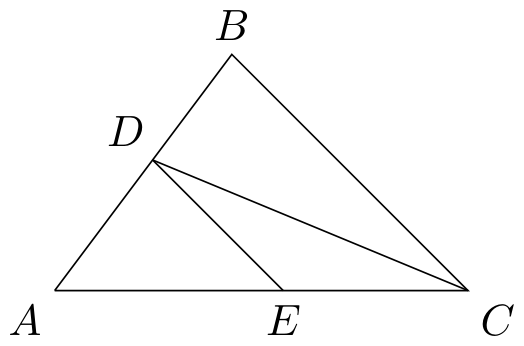
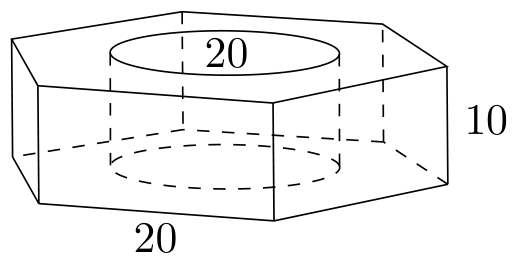

# 1977年上海卷（文）

## 解答题

### 第 1 题

1.  计算：$\left[\left(\frac{1}{2}-\frac{1}{3}\right)\left(-\frac{3}{2}\right)-\left(-1+\frac{1}{3}\right)\times\left(-\frac{3}{4}\right)\right]\div\frac{3}{2}$.

2.  某生产队去年养猪 $96\text{ 头}$，今年养猪 $120\text{ 头}$，问今年比去年增加百分之几？计划明年比今年多养 $40\%$，明年养猪几头？

#### 解析

1.  因为 $\frac{1}{2}-\frac{1}{3}=\frac{1}{6}$，所以 $\left(\frac{1}{2}-\frac{1}{3}\right)\left(-\frac{3}{2}\right)=-\frac{1}{4}$. 又因为 $-1+\frac{1}{3}=-\frac{2}{3}$，所以 $\left(-1+\frac{1}{3}\right)\left(-\frac{3}{4}\right)=\frac{1}{2}$. 因此原式为

$$

\left(-\frac{1}{4}-\frac{1}{2}\right)\div\frac{3}{2}=-\frac{3}{4}\times\frac{2}{3}=-\frac{1}{2}

$$

2.  今年比去年增加的数量为 $120-96=24\text{ 头}$，所以增加的百分数为 $\frac{24}{96}\times100\%=25\%$. 明年比今年多养 $40\%$，因此明年养猪 $120\left(1+40\%\right)=120\times1.4=168\text{ 头}$.

### 第 2 题

在 $\triangle ABC$ 中，$\angle C$ 的平分线交 $AB$ 于 $D$，过 $D$ 作 $BC$ 的平行线交 $AC$ 于 $E$，已知 $BC=a$，$AC=b$，求 $DE$ 的长.

#### 解析

由角平分线定理， $\dfrac{AD}{DB}=\dfrac{AC}{CB}=\dfrac{b}{a}$，从而 $\dfrac{AD}{AB}=\dfrac{b}{a+b}$，因为 $AB=AD+DB$. 又因为 $DE\parallel BC$，所以 $\triangle ADE\sim\triangle ABC$，从而 $\dfrac{DE}{BC}=\dfrac{AD}{AB}=\dfrac{b}{a+b}$. 代入 $BC=a$，得 $DE=\dfrac{ab}{a+b}$.

### 第 3 题

1.  化简：$\left(\frac{a}{a+b}-\frac{a^2}{a^2+2ab+b^2}\right)\div\left(\frac{a}{a+b}-\frac{a^2}{a^2-b^2}\right)$.

2.  解不等式：$\frac{2x-1}{3}>\frac{3x-1}{2}-4$.

3.  解方程：$\frac{4}{x+3}-\frac{1}{x-3}=1-\frac{2x}{x^2-9}$.

#### 解析

1.  原式有意义需满足 $a+b\ne0$、$a^2-b^2\ne0$，且除数不为零；由于 $a^2-b^2=(a+b)(a-b)$，这些条件等价于 $a+b\ne0$、$a-b\ne0$，并且 $ab\ne0$. 先化简被除数：

$$

\frac{a}{a+b}-\frac{a^2}{(a+b)^2}
    =\frac{a(a+b)-a^2}{(a+b)^2}
    =\frac{ab}{(a+b)^2}

$$

    再化简除数：

$$

\frac{a}{a+b}-\frac{a^2}{a^2-b^2}
    =\frac{a(a-b)-a^2}{(a+b)(a-b)}
    =-\frac{ab}{(a+b)(a-b)}

$$

    因此原式为

$$

\frac{ab}{(a+b)^2}\div\left(-\frac{ab}{(a+b)(a-b)}\right)
     =-\frac{a-b}{a+b}=\frac{b-a}{a+b}

$$

2.  不等式两边同乘正数 $6$，得 $2(2x-1)>3(3x-1)-24$，即 $4x-2>9x-27$. 移项得 $25>5x$，所以 $x<5$.

3.  原方程有意义的条件是 $x\ne3$ 且 $x\ne-3$. 因为 $x^2-9=(x+3)(x-3)$，原方程左边为

$$

\frac{4(x-3)-(x+3)}{x^2-9}=\frac{3x-15}{x^2-9}

$$

    右边为

$$

1-\frac{2x}{x^2-9}=\frac{x^2-2x-9}{x^2-9}

$$

    分母不为零，所以比较分子，得 $3x-15=x^2-2x-9$，即 $x^2-5x+6=0$，于是 $(x-2)(x-3)=0$. 所以 $x=2$ 或 $x=3$，但 $x=3$ 不符合原方程的定义域；代回 $x=2$ 验算，原方程左边为 $\dfrac{4}{5}-\dfrac{1}{-1}=\dfrac{9}{5}$，右边为 $1-\dfrac{4}{-5}=\dfrac{9}{5}$，等式成立，故 $x=2$.

### 第 4 题

1.  计算：$\frac{\sin 225^\circ+\tan 330^\circ}{\cos(-120^\circ)}$.

2.  求证：$\tan x+\cot x=\frac{2}{\sin 2x}$.

3.  $\triangle ABC$ 中，$\angle A=45^\circ$，$\angle B=75^\circ$，$AB=12$，求 $BC$ 的长.

#### 解析

1.  $\sin225^\circ=-\frac{\sqrt{2}}{2}$，$\tan330^\circ=-\frac{\sqrt{3}}{3}$，且 $\cos(-120^\circ)=\cos120^\circ=-\frac{1}{2}$. 因此原式为

$$

\frac{-\frac{\sqrt{2}}{2}-\frac{\sqrt{3}}{3}}{-\frac{1}{2}}
    =\sqrt{2}+\frac{2\sqrt{3}}{3}
    =\frac{3\sqrt{2}+2\sqrt{3}}{3}

$$

2.  在等式两边有意义时，$\sin x\ne0$ 且 $\cos x\ne0$. 此时

$$

\tan x+\cot x
    =\frac{\sin x}{\cos x}+\frac{\cos x}{\sin x}
    =\frac{\sin^2x+\cos^2x}{\sin x\cos x}
    =\frac{1}{\sin x\cos x}
    =\frac{2}{2\sin x\cos x}
    =\frac{2}{\sin2x}

$$

    故等式成立.

3.  三角形的第三个内角为 $\angle C=180^\circ-45^\circ-75^\circ=60^\circ$. 由正弦定理， $\dfrac{BC}{\sin45^\circ}=\dfrac{AB}{\sin60^\circ}$，所以

$$

BC=12\times\frac{\sin45^\circ}{\sin60^\circ}
    =12\times\frac{\frac{\sqrt{2}}{2}}{\frac{\sqrt{3}}{2}}
    =4\sqrt{6}

$$

### 第 5 题

六角螺帽尺寸如图，求它的体积（精确的 $1 \mathrm{~mm}^3$）.

#### 解析

由图知，正六边形的边长为 $20 \mathrm{~mm}$，圆孔的直径为 $20 \mathrm{~mm}$，螺帽的高为 $10 \mathrm{~mm}$. 正六边形可分成六个边长为 $20 \mathrm{~mm}$ 的正三角形，所以其底面积为

$$

S_1=6\times\frac{\sqrt{3}}{4}\times20^2=600\sqrt{3}\mathrm{~mm}^2

$$

圆孔半径为 $10 \mathrm{~mm}$，其面积为

$$

S_2=\pi\times10^2=100\pi\mathrm{~mm}^2

$$

因此螺帽的体积为

$$

V=(S_1-S_2)\times10
=(600\sqrt{3}-100\pi)\times10
=(6\sqrt{3}-\pi)\times10^3\mathrm{~mm}^3

$$

取 $\sqrt{3}\approx1.7320508$，$\pi\approx3.1415926$，得 $V\approx7250.712\mathrm{~mm}^3$，所以精确到 $1 \mathrm{~mm}^3$ 为 $7251 \mathrm{~mm}^3$.

### 第 6 题

求直线 $x+\sqrt{3}y+3\sqrt{3}=0$ 的斜率和倾角，并画出它的图形.

#### 解析

将直线方程化为斜截式，得 $y=-\dfrac{\sqrt{3}}{3}x-3$，所以斜率为 $k=-\dfrac{\sqrt{3}}{3}$. 设倾角为 $\theta$，则 $0^\circ\leq\theta<180^\circ$ 且 $\tan\theta=k$. 因为 $\tan150^\circ=-\dfrac{\sqrt{3}}{3}$，所以倾角为 $\theta=150^\circ$. 当 $y=0$ 时，得 $x=-3\sqrt{3}$，直线过点 $(-3\sqrt{3},0)$；当 $x=0$ 时，得 $y=-3$，直线过点 $(0,-3)$. 在坐标系中描出这两个点并作直线，即得所求图形.

### 第 7 题

当 $x$ 为何值时，函数 $y=x^2-8x+5$ 的值最小，并求出这个最小值.

#### 解析

配方得

$$

y=x^2-8x+5=(x^2-8x+16)-11=(x-4)^2-11

$$

因为 $(x-4)^2\geq0$，所以当且仅当 $x=4$ 时，$y$ 取得最小值，最小值为 $-11$.

### 第 8 题

将浓度为 $96\%$ 和 $36\%$ 的甲、乙两种硫酸配制成浓度为 $70\%$ 的硫酸 $600\text{ 升}$，问应从甲、乙两种硫酸中各取多少升.

#### 解析

设应取甲种硫酸 $x\text{ 升}$，乙种硫酸 $y\text{ 升}$，则

$$

x+y=600

$$

由纯硫酸的量守恒，得 $0.96x+0.36y=0.70\times600=420$. 由 $y=600-x$，代入上式得 $0.96x+0.36(600-x)=420$，即 $0.60x=204$，所以 $x=340$. 于是 $y=600-340=260$. 故应取甲种硫酸 $340\text{ 升}$，乙种硫酸 $260\text{ 升}$.
