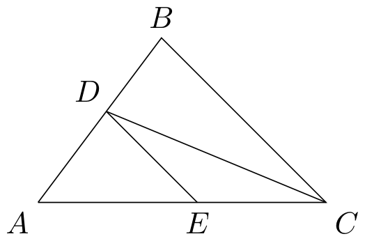
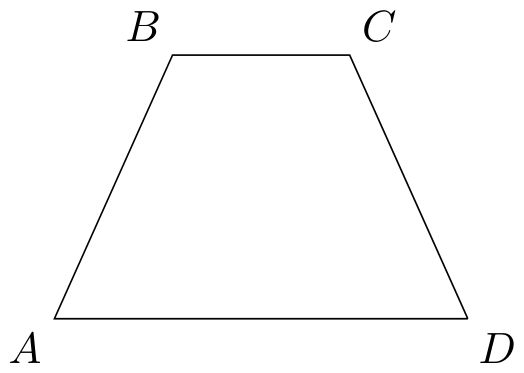
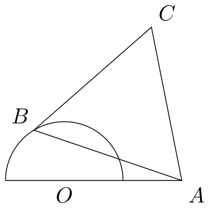

# 1977年上海卷（理）

## 解答题

### 第 1 题

1.  化简：$\left(\frac{a}{a+b}-\frac{a^2}{a^2+2ab+b^2}\right)\div\left(\frac{a}{a+b}-\frac{a^2}{a^2-b^2}\right)$.

2.  计算：$\frac{1}{2}\lg 25+\lg 2-\lg \sqrt{0.1}-\log_2 9\times\log_3 2$.

3.  $\sqrt{-1}=\i$，验算 $\i$ 是否方程 $2x^4+3x^3-3x^2+3x-5=0$ 的解.

4.  求证：$\frac{\sin\left(\frac{\pi}{4}+\theta\right)}{\sin\left(\frac{\pi}{4}-\theta\right)}+\frac{\cos\left(\frac{\pi}{4}+\theta\right)}{\cos\left(\frac{\pi}{4}-\theta\right)}=\frac{2}{\cos 2\theta}$.

#### 解析

1.  原式有意义的条件是 $a+b\ne0$、$a-b\ne0$，且作为除数的第二个括号不为零. 先分别通分，得 $\frac{a}{a+b}-\frac{a^2}{(a+b)^2}=\frac{ab}{(a+b)^2}$，以及 $\frac{a}{a+b}-\frac{a^2}{a^2-b^2}=\frac{a(a-b)-a^2}{(a-b)(a+b)}=-\frac{ab}{(a-b)(a+b)}$. 第二个式子不为零又要求 $a\ne0$、$b\ne0$，所以总条件为 $ab(a-b)(a+b)\ne0$. 在此条件下，原式 $=\frac{ab}{(a+b)^2}\div\left(-\frac{ab}{(a-b)(a+b)}\right)=\frac{b-a}{a+b}$.

2.  因为 $25=5^2$，所以 $\frac{1}{2}\lg25=\lg5$. 又因为 $0.1=10^{-1}$，所以 $\lg\sqrt{0.1}=\lg10^{-1/2}=-\frac{1}{2}$，从而前三项的和为 $\lg5+\lg2+\frac{1}{2}=\lg10+\frac{1}{2}=\frac{3}{2}$. 此外，$\log_2 9=2\log_2 3$，且 $\log_3 2=\frac{1}{\log_2 3}$，故 $\log_2 9\cdot\log_3 2=2$. 因此原式 $=\frac{3}{2}-2=-\frac{1}{2}$.

3.  由 $\i^2=-1$ 得 $\i^3=-\i$、$\i^4=1$. 将 $x=\i$ 代入方程左边，得 $2\i^4+3\i^3-3\i^2+3\i-5=2-3\i+3+3\i-5=0$. 所以 $\i$ 是该方程的解.

4.  设 $u=\frac{\pi}{4}$. 在题目分式有意义的条件下，$\sin(u-\theta)\ne0$、$\cos(u-\theta)\ne0$，于是 $\cos2\theta\ne0$，可以通分. 左边 $=\frac{\sin(u+\theta)\cos(u-\theta)+\cos(u+\theta)\sin(u-\theta)}{\sin(u-\theta)\cos(u-\theta)}=\frac{\sin2u}{\frac{1}{2}\sin(2u-2\theta)}$. 由于 $2u=\frac{\pi}{2}$，上式 $=\frac{1}{\frac{1}{2}\sin(\frac{\pi}{2}-2\theta)}=\frac{2}{\cos2\theta}$，等式得证.

### 第 2 题

在 $\triangle ABC$ 中，$\angle C$ 的平分线交 $AB$ 于 $D$，过 $D$ 作 $BC$ 的平行线交 $AC$ 于 $E$，已知 $BC=a$，$AC=b$，求 $DE$ 的长.

#### 解析

由角平分线定理，$\frac{AD}{DB}=\frac{AC}{CB}=\frac{b}{a}$. 又 $AB=AD+DB$，所以 $\frac{AD}{AB}=\frac{b}{a+b}$. 因为 $DE\parallel BC$，故 $\triangle ADE\sim\triangle ABC$，从而 $\frac{DE}{BC}=\frac{AD}{AB}=\frac{b}{a+b}$. 代入 $BC=a$，得 $DE=\frac{ab}{a+b}$.

### 第 3 题

已知圆 $A$ 的直径为 $2\sqrt{3}$，圆 $B$ 的直径为 $4-2\sqrt{3}$，圆 $C$ 的直径为 $2$，圆 $A$ 与圆 $B$ 外切，圆 $A$ 又与圆 $C$ 外切，$\angle A=60^\circ$，求 $BC$ 及 $\angle C$.

#### 解析

圆 $A$、圆 $B$、圆 $C$ 的半径分别为 $\sqrt3$、$2-\sqrt3$、$1$. 由两圆外切时圆心距等于两半径之和，得 $AB=\sqrt3+(2-\sqrt3)=2$，$AC=\sqrt3+1=1+\sqrt3$. 在 $\triangle ABC$ 中，$\angle A=60^\circ$，由余弦定理，$BC^2=AB^2+AC^2-2AB\cdot AC\cos60^\circ=4+(1+\sqrt3)^2-2(1+\sqrt3)=6$，所以 $BC=\sqrt6$. 再由余弦定理，$\cos C=\frac{AC^2+BC^2-AB^2}{2AC\cdot BC}=\frac{(1+\sqrt3)^2+6-4}{2(1+\sqrt3)\sqrt6}=\frac{6+2\sqrt3}{2(1+\sqrt3)\sqrt6}=\frac{\sqrt3(1+\sqrt3)}{(1+\sqrt3)\sqrt6}=\frac{1}{\sqrt2}$. 因为 $0^\circ<C<180^\circ$，所以 $\angle C=45^\circ$.

### 第 4 题

正六棱锥 $V-ABCDEF$ 的高为 $2 \mathrm{~cm}$，底面边长为 $2 \mathrm{~cm}$.

1.  按 $1:1$ 画出它的二视图；

2.  求其侧面积；

3.  求它的侧棱和底面的夹角.

#### 解析

1.  将底面正六边形的一条连接相对边中点的直线作为主视图的水平方向. 俯视图画成边长为 $2\mathrm{~cm}$ 的正六边形，记其中心为 $O$，顶点 $V$ 的正投影落在 $O$. 主视图中，底面的水平投影长度为正六边形的对边距离 $2\sqrt3\mathrm{~cm}$，顶点的投影位于底边中点上方 $2\mathrm{~cm}$ 处，因此主视图是底边长 $2\sqrt3\mathrm{~cm}$、高 $2\mathrm{~cm}$ 的等腰三角形. 按投影关系将可见棱画实线、不可见棱画虚线，俯视图和主视图中的长度均按 $1:1$ 标定.

2.  设底面中心为 $O$，顶点为 $V$，底面一条边的中点为 $M$. 正六边形的边心距为 $OM=2\cos30^\circ=\sqrt3$. 因为 $VO\perp$ 底面，所以 $VO\perp OM$，从而侧面三角形的高 $VM=\sqrt{VO^2+OM^2}=\sqrt{2^2+3}=\sqrt7$. 因此侧面积 $=6\times\frac{1}{2}\times2\times\sqrt7=6\sqrt7\mathrm{~cm}^2$.

3.  仍设底面中心为 $O$，取底面顶点 $A$. 因为 $VO\perp$ 底面，$OA$ 是 $VA$ 在底面上的射影，所以侧棱 $VA$ 与底面的夹角等于直角三角形 $VAO$ 中的 $\angle VAO$. 正六边形的外接圆半径等于边长，故 $OA=2$，于是 $\tan\angle VAO=\frac{VO}{OA}=\frac{2}{2}=1$，从而侧棱和底面的夹角为 $45^\circ$.

### 第 5 题

解不等式：

$$

\begin{cases}
16-x^2\ge0,\\
x^2-x-6>0
\end{cases}

$$

，并在数轴上把它的解表示出来.

#### 解析

由 $16-x^2\ge0$ 得 $-4\le x\le4$. 又 $x^2-x-6=(x-3)(x+2)>0$，所以 $x<-2$ 或 $x>3$. 两者取交集，解集为 $\left[-4,-2\right)\cup\left(3,4\right]$. 在数轴上，$-4$、$4$ 处取实心点，$-2$、$3$ 处取空心点，并标出区间 $[-4,-2)$ 和 $(3,4]$.

### 第 6 题

已知两定点 $A(-4,0)$，$B(4,0)$，一动点 $P(x,y)$ 与两定点 $A$，$B$ 的连线 $PA$，$PB$ 的斜率的乘积为 $-\frac{1}{4}$. 求点 $P$ 的轨迹方程，并把它化为标准方程，指出是什么曲线.

#### 解析

斜率有定义要求 $x\ne-4$、$x\ne4$. 在此条件下，直线 $PA$、$PB$ 的斜率分别为 $\frac{y}{x+4}$、$\frac{y}{x-4}$，所以 $\frac{y}{x+4}\cdot\frac{y}{x-4}=-\frac14$. 整理得 $4y^2=-(x+4)(x-4)=16-x^2$，即轨迹方程为 $x^2+4y^2=16$，标准方程为 $\frac{x^2}{16}+\frac{y^2}{4}=1$. 这是以原点为中心、半轴长分别为 $4$ 和 $2$ 的椭圆，但椭圆上的 $(4,0)$、$(-4,0)$ 分别使 $PA$、$PB$ 的斜率无定义，必须排除. 反过来，椭圆上除去这两个点的任一点都满足原斜率乘积条件，所以这就是完整轨迹.

### 第 7 题

等腰梯形的周长为 $60$，底角为 $60^\circ$，问这梯形各边长为多少时，面积最大？

#### 解析

设两腰长均为 $\ell$，两底分别为 $p$、$q$，不妨设 $p\ge q$. 每条腰在较长底边方向上的投影为 $\ell\cos60^\circ=\frac{\ell}{2}$，故 $p-q=2\cdot\frac{\ell}{2}=\ell$. 由周长条件，$p+q+2\ell=60$，所以 $p+q=60-2\ell$，并且 $p=30-\frac{\ell}{2}$、$q=30-\frac{3\ell}{2}$. 由于底边长为正，$0<\ell<20$. 梯形高为 $h=\ell\sin60^\circ=\frac{\sqrt3}{2}\ell$，所以面积 $S=\frac{p+q}{2}h=\frac{\sqrt3}{2}\ell(30-\ell)=\frac{\sqrt3}{2}\left(225-(\ell-15)^2\right)$. 在 $0<\ell<20$ 内，$\ell=15$ 时平方项最小，面积最大. 此时 $p=22.5$、$q=7.5$，即两腰均为 $15$，两底为 $22.5$ 和 $7.5$，最大面积为 $\frac{225\sqrt3}{2}$. 若上下底命名相反，两个底长互换，结论相同.

### 第 8 题

1.  当 $k$ 为何值时，方程组

$$

\begin{cases}
    x-\sqrt{y-2}=0,\\
    kx-y-2k-10=0
    \end{cases}

$$

有两组相同的解？

2.  求出它的解.

#### 解析

1.  由 $x-\sqrt{y-2}=0$，得 $x=\sqrt{y-2}$，所以 $x\ge0$，且 $y=x^2+2$. 将它代入第二个方程，得 $x^2+2=kx-2k-10$，即 $x^2-kx+2k+12=0$. 每个满足 $x\ge0$ 的根对应唯一的 $y=x^2+2$，所以方程组有两组相同的解时，这个二次方程必须有重根. 其判别式为 $\Delta=k^2-4(2k+12)=k^2-8k-48=(k-12)(k+4)$，故候选值为 $k=12$ 或 $k=-4$. 当 $k=12$ 时重根为 $x=\frac{k}{2}=6$，符合 $x\ge0$；当 $k=-4$ 时重根为 $x=\frac{k}{2}=-2$，不符合平方根方程要求，舍去. 因此 $k=12$.

2.  当 $k=12$ 时，重根为 $x=6$，代入 $y=x^2+2$，得 $y=38$. 检验得 $6-\sqrt{38-2}=6-6=0$，且 $12\times6-38-2\times12-10=0$，所以方程组的解为 $(x,y)=(6,38)$.

## 附加题

### 第 9 题

如图所示，半圆 $O$ 的直径为 $2$，$A$ 为半圆直径的延长线上的一点，且 $OA=2$，$B$ 为半圆上任一点，以 $AB$ 为边作等边 $\triangle ABC$，问 $B$ 在什么地方时，四边形 $OACB$ 的面积最大？并求出这个面积的最大值.

#### 解析

设 $\theta=\angle BOA$，则 $0\le\theta\le\pi$，且 $OB=1$、$OA=2$. 按图中等边三角形的取向，点 $O$、点 $C$ 在直线 $AB$ 的两侧，因此四边形 $OACB$ 的对角线 $AB$ 将其分成 $\triangle OAB$ 和等边三角形 $ABC$，面积为二者之和. 由余弦定理，$AB^2=OA^2+OB^2-2OA\cdot OB\cos\theta=5-4\cos\theta$，所以 $S=\frac12OA\cdot OB\sin\theta+\frac{\sqrt3}{4}AB^2=\sin\theta+\frac{\sqrt3}{4}(5-4\cos\theta)=\frac{5\sqrt3}{4}+2\sin\left(\theta-\frac{\pi}{3}\right)$. 因为 $\sin\left(\theta-\frac{\pi}{3}\right)\le1$，故 $S\le2+\frac{5\sqrt3}{4}$. 等号成立当且仅当 $\theta-\frac{\pi}{3}=\frac{\pi}{2}$，即 $\theta=\frac{5\pi}{6}=150^\circ$. 因此当 $\angle BOA=150^\circ$ 时面积最大；若以 $OA$ 为正方向建立直角坐标系，则此时 $B$ 的坐标为 $\left(-\frac{\sqrt3}{2},\frac12\right)$，最大面积为 $2+\frac{5\sqrt3}{4}$.

### 第 10 题

已知曲线 $y=x^2-2x+3$ 与直线 $y=x+3$ 相交于点 $P(0,3)$，$Q(3,6)$ 两点.

1.  分别求出曲线在交点的切线的斜率；

2.  求出曲线与直线所围成的图形的面积.

#### 解析

1.  设曲线函数为 $f(x)=x^2-2x+3$，则 $f'(x)=2x-2$. 点 $P$ 的横坐标为 $0$，故曲线在 $P$ 处的切线斜率为 $f'(0)=2\times0-2=-2$；点 $Q$ 的横坐标为 $3$，故曲线在 $Q$ 处的切线斜率为 $f'(3)=2\times3-2=4$.

2.  两曲线交点的横坐标为题中给出的 $0$、$3$. 在 $0\le x\le3$ 时，直线在曲线上方，因为 $(x+3)-(x^2-2x+3)=x(3-x)\ge0$. 所以所围图形的面积为 $\displaystyle\int_0^3\bigl[(x+3)-(x^2-2x+3)\bigr]\,\mathrm{d}x=\int_0^3(3x-x^2)\,\mathrm{d}x=\left[\frac{3}{2}x^2-\frac{1}{3}x^3\right]_0^3=\frac{27}{2}-9=\frac{9}{2}$.
