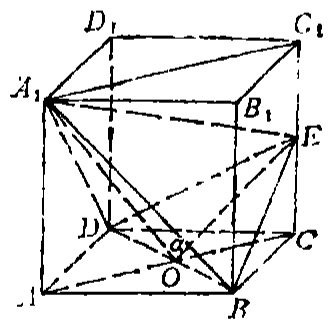
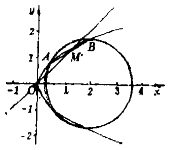

# 1986年上海卷（文）

## 单选题

### 第 1 题

平移坐标轴，把原点 $O(0,0)$ 移到 $O'(2,-1)$，则点 $(-1,-3)$ 在新坐标系中的坐标是（）

A.  
$\left( 3,2 \right)$

B.  
$\left( -3,-2 \right)$

C.  
$\left( -3,2 \right)$

D.  
$\left( 3,-2 \right)$

#### 答案

B

#### 解析

新坐标原点为 $O'(2,-1)$，且坐标轴方向不变，所以点 $P(x,y)$ 在新坐标系中的坐标为 $(x-2,y+1)$. 对 $P=(-1,-3)$ 代入得新坐标 $(-1-2,-3+1)=(-3,-2)$，故选 B.

### 第 2 题

下列三角关系式中不正确的是（）

A.  
$\sin\alpha+\sin\beta=2\sin\frac{\beta+\alpha}{2}\cos\frac{\beta-\alpha}{2}$

B.  
$\sin\alpha-\sin\beta=2\cos\frac{\beta+\alpha}{2}\sin\frac{\beta-\alpha}{2}$

C.  
$\cos \alpha + \cos \beta = 2\cos \frac{\beta + \alpha}{2}\cos \frac{\beta - \alpha}{2}$

D.  
$\cos \alpha - \cos \beta = 2\sin \frac{\beta + \alpha}{2}\sin \frac{\beta - \alpha}{2}$

#### 答案

B

#### 解析

由和差化积公式，$\sin\alpha+\sin\beta=2\sin\frac{\alpha+\beta}{2}\cos\frac{\alpha-\beta}{2}$，而余弦函数为偶函数，故选项 A 正确. 又 $\sin\alpha-\sin\beta=2\cos\frac{\alpha+\beta}{2}\sin\frac{\alpha-\beta}{2}=-2\cos\frac{\alpha+\beta}{2}\sin\frac{\beta-\alpha}{2}$，选项 B 右端少了负号，因此 B 不正确. 选项 C 是余弦和的和差化积公式；选项 D 由 $\cos\alpha-\cos\beta=-2\sin\frac{\alpha+\beta}{2}\sin\frac{\alpha-\beta}{2}=2\sin\frac{\alpha+\beta}{2}\sin\frac{\beta-\alpha}{2}$ 得到，正确. 故选 B.

### 第 3 题

在直角坐标系中，直线 $x + \sqrt{3} y + 1 = 0$ 的倾角是（）

A.  
$\frac{1}{6}\pi$

B.  
$\frac{1}{3}\pi$

C.  
$\frac{2}{3}\pi$

D.  
$\frac{5}{6}\pi$

#### 答案

D

#### 解析

将直线方程化为斜截式，得 $y=-\frac{1}{\sqrt{3}}x-\frac{1}{\sqrt{3}}$，所以斜率 $k=-\frac{1}{\sqrt{3}}$. 设直线倾角为 $\alpha$，则 $0\leqslant\alpha<\pi$ 且 $\tan\alpha=k=-\frac{1}{\sqrt{3}}$，故 $\alpha=\frac{5\pi}{6}$. 因此选 D.

### 第 4 题

函数 $y = 2\tan\left( 3x + \frac{1}{6}\pi \right)$ 的最小正周期是（）

A.  
$\frac{1}{6}\pi$

B.  
$\frac{1}{3}\pi$

C.  
$\frac{1}{2}\pi$

D.  
$\frac{2}{3}\pi$

#### 答案

B

#### 解析

$\tan u$ 的最小正周期是 $\pi$. 对 $y=2\tan\left(3x+\frac{\pi}{6}\right)$，令自变量增加 $T$，要求 $3T=\pi$，所以 $T=\frac{\pi}{3}$. 常数因子 $2$ 和相位平移不改变周期，故选 B.

### 第 5 题

在空间，下列命题中正确的是（）

A.  
如果两直线 $a$，$b$ 与直线 $l$ 所成的角相等，那么 $a\parallel b$

B.  
如果两直线 $a$，$b$ 与平面 $\alpha$ 所成的角相等，那么 $a\parallel b$

C.  
如果直线 $l$ 与两平面 $\alpha$，$\beta$ 所成的角都是直角，那么 $\alpha\parallel\beta$

D.  
如果平面 $\gamma$ 与两平面 $\alpha$，$\beta$ 所成的二面角都是直二面角，那么 $\alpha\parallel\beta$

#### 答案

C

#### 解析

若直线 $l$ 与平面 $\alpha$ 垂直，则 $l$ 的方向是平面 $\alpha$ 的法线方向；若 $l$ 也与平面 $\beta$ 垂直，则平面 $\alpha$ 和 $\beta$ 的法线都平行于 $l$，从而 $\alpha\parallel\beta$，所以选项 C 正确. 选项 A 中两直线与同一直线所成角相等时，可能位于 $l$ 的两侧而不平行；选项 B 中两直线与同一平面所成角相等也不能确定其方向；选项 D 中两个都垂直于 $\gamma$ 的平面不一定互相平行. 故选 C.

### 第 6 题

函数 $y = \tan\left(x + \frac{1}{3}\pi\right)$ 的定义域是（）

A.  
$\{x \mid x \in \mathbb{R} \text{ 且 } x \neq k\pi + \frac{1}{6}\pi,\ k \in \mathbb{Z}\}$

B.  
$\{x \mid x \in \mathbb{R} \text{ 且 } x \neq k\pi - \frac{1}{6}\pi,\ k \in \mathbb{Z}\}$

C.  
$\{x \mid x \in \mathbb{R} \text{ 且 } x \neq 2k\pi + \frac{1}{6}\pi,\ k \in \mathbb{Z}\}$

D.  
$\{x \mid x \in \mathbb{R} \text{ 且 } x \neq 2k\pi - \frac{1}{6}\pi,\ k \in \mathbb{Z}\}$

#### 答案

A

#### 解析

$\tan u$ 在 $u=\frac{\pi}{2}+k\pi$ 时无定义，其中 $k\in\mathbb{Z}$. 因而 $x+\frac{\pi}{3}=\frac{\pi}{2}+k\pi$，即 $x=k\pi+\frac{\pi}{6}$. 所以定义域为 $\{x\mid x\in\mathbb{R}\text{ 且 }x\neq k\pi+\frac{\pi}{6},\ k\in\mathbb{Z}\}$，故选 A.

### 第 7 题

若空间有 $10$ 个点，则可以确定的平面总数最多有（）

A.  
$90\text{ 个}$

B.  
$100\text{ 个}$

C.  
$120\text{ 个}$

D.  
$150\text{ 个}$

#### 答案

C

#### 解析

任取三个点且不共线可以确定一个平面. 为使平面总数最多，取十个点处于一般位置，使任意三个点不共线且任意四个点不共面；这样每三个点确定的平面都不同. 因此最多可确定的平面数为 $\mathrm C_{10}^{3}=\frac{10\cdot9\cdot8}{3\cdot2\cdot1}=120$，故选 C.

### 第 8 题

下列双曲线方程中，以 $y = \pm \frac{1}{2}x$ 为渐近线的是（）

A.  
$\frac{x^{2}}{16}-\frac{y^{2}}{4}=1$

B.  
$\frac{x^{2}}{4}-\frac{y^{2}}{16}=1$

C.  
$\frac{x^{2}}{2}-\frac{y^{2}}{1}=1$

D.  
$\frac{x^{2}}{1}-\frac{y^{2}}{2}=1$

#### 答案

A

#### 解析

双曲线 $\frac{x^{2}}{a^{2}}-\frac{y^{2}}{b^{2}}=1$ 的渐近线为 $y=\pm\frac{b}{a}x$. 题目要求 $\frac{b}{a}=\frac12$. 选项 A 中 $a=4$，$b=2$，故渐近线为 $y=\pm\frac{2}{4}x=\pm\frac12x$，其余选项的 $\frac{b}{a}$ 均不等于 $\frac12$. 故选 A.

### 第 9 题

复数 $\sqrt{3} - \i$ 的幅角的主值是（）

A.  
$\frac{1}{6}\pi$

B.  
$\frac{5}{6}\pi$

C.  
$7\pi /6$

D.  
$11\pi /6$

#### 答案

D

#### 解析

复数 $z=\sqrt3-\i$ 的实部为正、虚部为负，故其幅角在第四象限. 又 $|z|=\sqrt{3+1}=2$，所以 $\cos\theta=\frac{\sqrt3}{2}$，$\sin\theta=-\frac12$. 在本题选项采用 $0\leqslant\theta<2\pi$ 的幅角表示时，$\theta=\frac{11\pi}{6}$，故选 D.

### 第 10 题

等式 $\log_3 x^2 = 2$ 成立是等式 $\log_3 x = 1$ 成立的（）

A.  
充分条件但不是必要条件

B.  
必要条件但不是充分条件

C.  
充分必要条件

D.  
既不充分又不必要的条件

#### 答案

B

#### 解析

设条件 $P$ 为 $\log_{3}x^{2}=2$，条件 $Q$ 为 $\log_{3}x=1$. 由 $Q$ 得 $x=3$，从而 $x^{2}=9$，所以 $P$ 成立. 但由 $P$ 得 $x^{2}=9$，故 $x=3$ 或 $x=-3$；其中 $x=-3$ 时 $\log_{3}x$ 无定义，不能推出 $Q$. 因此 $P$ 是 $Q$ 成立的必要但不充分条件，故选 B.

### 第 11 题

在等比数列中，已知首项为 $\frac{9}{8}$，末项为 $\frac{1}{3}$，公比为 $\frac{2}{3}$，则项数是（）

A.  
$3$

B.  
$4$

C.  
$5$

D.  
$6$

#### 答案

B

#### 解析

等比数列第 $n$ 项满足 $a_n=a_1q^{n-1}$. 代入已知首项、末项和公比，得 $\frac{9}{8}\left(\frac{2}{3}\right)^{n-1}=\frac13$，即 $\left(\frac23\right)^{n-1}=\frac{8}{27}=\left(\frac23\right)^3$. 因为 $0<\frac23\neq1$，所以 $n-1=3$，$n=4$，故选 B.

### 第 12 题

已知定直线 $l$ 和外一定点 $A$，过点 $A$ 且与 $l$ 相切的圆的圆心轨迹是（）

A.  
抛物线

B.  
双曲线

C.  
椭圆

D.  
直线

#### 答案

A

#### 解析

设圆心为 $O$. 圆过定点 $A$，所以半径为 $OA$；圆与定直线 $l$ 相切，所以圆心到 $l$ 的距离等于半径，即 $d(O,l)=OA$. 因而圆心 $O$ 到定点 $A$ 的距离等于它到定直线 $l$ 的距离，$O$ 的轨迹是以 $A$ 为焦点、$l$ 为准线的抛物线，故选 A.

### 第 13 题

若 $\sin \frac{1}{2}\theta = \frac{3}{5}$，$\cos \frac{1}{2}\theta = -\frac{4}{5}$，则 $\theta$ 角的终边在（）

A.  
第一象限

B.  
第二象限

C.  
第三象限

D.  
第四象限

#### 答案

D

#### 解析

令 $\varphi=\frac{\theta}{2}$. 已知 $\sin\varphi=\frac35>0$，$\cos\varphi=-\frac45<0$，所以 $\varphi$ 在第二象限. 于是 $\sin\theta=\sin 2\varphi=2\sin\varphi\cos\varphi=-\frac{24}{25}<0$，$\cos\theta=\cos 2\varphi=\cos^{2}\varphi-\sin^{2}\varphi=\frac{7}{25}>0$. 因而 $\theta$ 的终边在第四象限，故选 D.

### 第 14 题

下列不等式中正确的是（）

A.  
$\sin\left(-\frac{5}{7}\pi\right)>\sin\left(\frac{4}{7}\pi\right)$

B.  
$\tan\left(\frac{15\pi}{8}\right)>\tan\left(-\frac{1}{7}\pi\right)$

C.  
$\sin\left(-\frac{1}{3}\pi\right)>\sin\left(-\frac{1}{6}\pi\right)$

D.  
$\cos\left(-\frac{8}{5}\pi\right)>\cos\left(-\frac{9}{4}\pi\right)$

#### 答案

B

#### 解析

先逐项化为熟悉区间内的三角函数值. 选项 A 中 $\sin\left(-\frac{5\pi}{7}\right)=-\sin\frac{2\pi}{7}<0$，而 $\sin\frac{4\pi}{7}>0$，不等式错误. 选项 B 中 $\tan\frac{15\pi}{8}=\tan\left(-\frac{\pi}{8}\right)$，且 $-\frac{\pi}{8}>-\frac{\pi}{7}$，两角都在 $\left(-\frac{\pi}{2},\frac{\pi}{2}\right)$ 内，$\tan x$ 在此区间递增，所以 $\tan\frac{15\pi}{8}>\tan\left(-\frac{\pi}{7}\right)$，正确. 选项 C 为 $-\frac{\sqrt3}{2}>-\frac12$，错误；选项 D 为 $\cos\frac{2\pi}{5}>\cos\frac{\pi}{4}$，但 $\frac{2\pi}{5}>\frac{\pi}{4}$ 且余弦在 $(0,\pi)$ 上递减，故该不等式也错误. 因此选 B.

### 第 15 题

集合 $\{a, b, c\}$ 的所有子集的个数是（）

A.  
$5$

B.  
$6$

C.  
$7$

D.  
$8$

#### 答案

D

#### 解析

集合 $\{a,b,c\}$ 有 $3$ 个元素. 每个元素都有“选入”或“不选入”两种状态，且各元素的选择相互独立，所以子集总数为 $2^3=8$，故选 D.

### 第 16 题

设自变量 $x \in \mathbb{R}$，下列各函数中奇函数是（）

A.  
$y = x + 3$

B.  
$y = -2x^{2}$

C.  
$y = \lg 3^x$

D.  
$y = -|x|$

#### 答案

C

#### 解析

函数 $y=x+3$ 的定义域为 $\mathbb{R}$，但 $f(-x)=-x+3\neq-(x+3)$，不是奇函数. 函数 $y=-2x^2$ 和 $y=-|x|$ 都满足 $f(-x)=f(x)$，是偶函数而不是奇函数. 对 $y=\lg 3^x$，有 $3^x>0$，定义域为 $\mathbb{R}$，且 $\lg 3^x=x\lg3$，所以 $f(-x)=-x\lg3=-f(x)$，它是奇函数. 故选 C.

### 第 17 题

$a$，$b$ 满足 $0 < a < b < 1$. 下列不等式中正确的是（）

A.  
$a^a < a^b$

B.  
$b^a < b^b$

C.  
$a^a < b^a$

D.  
$b^a < a^b$

#### 答案

C

#### 解析

因为 $0<a<1$，幂函数 $a^x$ 随指数 $x$ 增大而减小，所以 $a^a>a^b$，选项 A 错误. 同理 $0<b<1$，故 $b^a>b^b$，选项 B 错误. 因为指数 $a>0$，底数函数 $x^a$ 在正数上递增，且 $a<b$，所以 $a^a<b^a$，选项 C 正确. 对选项 D，函数 $h(x)=\frac{\ln x}{x}$ 在 $0<x<1$ 上递增，因为 $h'(x)=\frac{1-\ln x}{x^2}>0$. 因此 $\frac{\ln a}{a}<\frac{\ln b}{b}$，从而 $b\ln a<a\ln b$，即 $a^b<b^a$，选项 D 也错误. 故选 C.

### 第 18 题

正方体 $ABCD - A_{1}B_{1}C_{1}D_{1}$ 中，直线 $BC_{1}$ 与 $AC$（）

A.  
相交且垂直

B.  
相交但不垂直

C.  
异面且垂直

D.  
异面但不垂直

#### 答案

D

#### 解析

取正方体棱长为 $a$，建立直角坐标系，令 $A=(0,0,0)$，$B=(a,0,0)$，$C=(a,a,0)$，$C_1=(a,a,a)$. 则直线 $AC$ 的方向向量可取 $(1,1,0)$，直线 $BC_1$ 的方向向量可取 $(0,1,1)$，两向量内积为 $1\neq0$，所以两直线不垂直. 又 $AC$ 上点的第三坐标恒为 $0$，而 $BC_1$ 上点除 $B$ 外第三坐标均不为 $0$；点 $B$ 不在 $AC$ 上，故两直线不相交而是异面直线. 因此选 D.

### 第 19 题

设复数 $z = a + b\i$（$a\in\mathbb{R}$，$b\in\mathbb{R}$，且 $b \neq 0$），则 $|z^2|$，$|z|^2$，$z^2$ 的关系是（）

A.  
$|z^{2}|=|z|^{2}\neq z^{2}$

B.  
$|z^{2}|=|z|^{2}=z^{2}$

C.  
$|z^{2}| \neq |z|^{2} = z^{2}$

D.  
互不相等

#### 答案

A

#### 解析

由复数模的乘法性质，$|z^2|=|z|^2$. 另一方面，$|z|^2=a^2+b^2$，而 $z^2=(a^2-b^2)+2ab\i$. 若 $z^2=|z|^2$，则其虚部 $2ab=0$. 因为 $b\neq0$，只能有 $a=0$，此时 $z^2=-b^2$，而 $|z|^2=b^2$，仍不相等. 所以 $|z^2|=|z|^2\neq z^2$，故选 A.

### 第 20 题

过抛物线焦点 $F$ 的直线与抛物线相交于 $A$，$B$ 两点，若 $A$，$B$ 在抛物线准线上的射影分别是 $A_{1}$，$B_{1}$，则 $\angle A_{1}FB_{1}$ 等于（）

A.  
$45^{\circ}$

B.  
$60^{\circ}$

C.  
$90^{\circ}$

D.  
$120^{\circ}$

#### 答案

C

#### 解析

设抛物线参数方程为 $x=\frac{p}{4}t^2$，$y=\frac{p}{2}t$. 设 $A=A(t_1)$，$B=A(t_2)$，则焦点为 $F=(\frac p4,0)$. 将坐标同时除以 $\frac p4$，三点可写为 $F=(1,0)$、$A=(t_1^2,2t_1)$、$B=(t_2^2,2t_2)$. 由 $F$，$A$，$B$ 共线，得

$$

\det\begin{pmatrix}t_1^2-1&2t_1\\t_2^2-1&2t_2\end{pmatrix}=2(t_1-t_2)(t_1t_2+1)=0

$$

因为 $A\neq B$，所以 $t_1t_2=-1$. 抛物线准线为 $x=-\frac p4$，故 $A_1=(-\frac p4,\frac p2t_1)$，$B_1=(-\frac p4,\frac p2t_2)$. 于是 $\overrightarrow{FA_1}=\frac p2(-1,t_1)$，$\overrightarrow{FB_1}=\frac p2(-1,t_2)$，从而

$$

\overrightarrow{FA_1}\cdot\overrightarrow{FB_1}=\frac{p^2}{4}(1+t_1t_2)=0

$$

所以 $FA_1\perp FB_1$，即 $\angle A_1FB_1=90^\circ$，故选 C.

## 填空题

### 第 21 题

若三点 $P_{1}$，$P_{2}$ 和 $P$ 在一条直线上，点 $P_{1}$ 和点 $P_{2}$ 在直角坐标系中的坐标分别为 $(0,-6)$ 和 $(3,0)$，且 $\frac{P_{1}P}{PP_{2}}=-\frac{1}{2}$，则点 $P$ 的坐标是＿＿＿＿＿＿.

#### 答案

$\left( -3,-12 \right)$

#### 解析

设 $P=P_1+t(P_2-P_1)$. 由 $P_1=(0,-6)$、$P_2=(3,0)$，得 $P=(3t,-6+6t)$. 有向线段比满足 $\frac{P_1P}{PP_2}=\frac{t}{1-t}=-\frac12$，所以 $2t=-(1-t)$，解得 $t=-1$. 因而 $P=(-3,-12)$.

### 第 22 题

正方体的全面积是 $6$，则其内切球的体积是＿＿＿＿＿＿.

#### 答案

$\frac{\pi}{6}$

#### 解析

设正方体棱长为 $a$. 由全面积 $6a^2=6$，得 $a=1$. 内切球的直径等于正方体棱长，所以半径 $r=\frac12$. 因而球的体积为 $V=\frac43\pi r^3=\frac43\pi\left(\frac12\right)^3=\frac{\pi}{6}$.

### 第 23 题

设直线 $l$ 在 $x$ 轴和 $y$ 轴上的截距分别为 $4$ 和 $3$，则点 $(2, -1)$ 到 $l$ 的距离是＿＿＿＿＿＿.

#### 答案

$2$

#### 解析

直线 $l$ 的截距式为 $\frac{x}{4}+\frac{y}{3}=1$，化为一般式得 $3x+4y-12=0$. 点 $(2,-1)$ 到该直线的距离为 $\frac{|3\cdot2+4\cdot(-1)-12|}{\sqrt{3^2+4^2}}=\frac{10}{5}=2$.

### 第 24 题

$\displaystyle\lim_{n\to \infty}\frac{1 + 3 + 5 + \cdots + (2n - 1)}{n(n + 1)} =$＿＿＿＿＿＿

#### 答案

$1$

#### 解析

前 $n$ 个奇数的和为 $1+3+\cdots+(2n-1)=n^2$. 所以原极限为 $\displaystyle\lim_{n\to\infty}\frac{n^2}{n(n+1)}=\lim_{n\to\infty}\frac{n}{n+1}=\lim_{n\to\infty}\frac{1}{1+\frac1n}=1$.

### 第 25 题

$\left( \sqrt[3]{x}-\frac{1}{\sqrt{x}} \right)^8$ 的展开式中，$x$ 的一次项的系数是＿＿＿＿＿＿.

#### 答案

$28$或$\mathrm C_8^6$

#### 解析

将 $\sqrt[3]{x}$ 写成 $x^{1/3}$，将 $\frac1{\sqrt{x}}$ 写成 $x^{-1/2}$. 展开式中取第二项 $k$ 次的通项为 $\mathrm C_8^k(-1)^k x^{(8-k)/3-k/2}=\mathrm C_8^k(-1)^k x^{(16-5k)/6}$. 要成为 $x$ 的一次项，须满足 $\frac{16-5k}{6}=1$，解得 $k=2$. 因而系数为 $\mathrm C_8^2(-1)^2=\mathrm C_8^2=28=\mathrm C_8^6$.

### 第 26 题

不等式 $\sqrt{x - 1} < 3$ 的解是＿＿＿＿＿＿.

#### 答案

$1\leqslant x<10$

#### 解析

根式有意义要求 $x-1\geqslant0$，即 $x\geqslant1$. 在此条件下两边均非负，可以平方且不改变不等号方向，得到 $x-1<9$，即 $x<10$. 合并得不等式的解为 $1\leqslant x<10$.

### 第 27 题

轴截面是等边三角形的圆锥，它的侧面展开图扇形的圆心角的弧度数等于＿＿＿＿＿＿.

#### 答案

$\pi$

#### 解析

设圆锥底面半径为 $r$，母线长为 $l$. 轴截面是等边三角形时，其底边为底面直径 $2r$，两腰为母线 $l$，所以 $l=2r$. 侧面展开为半径 $l$ 的扇形，其弧长等于圆锥底面周长 $2\pi r$. 若扇形圆心角为 $\alpha$，则 $\alpha l=2\pi r$，故 $\alpha=\frac{2\pi r}{l}=\pi$.

### 第 28 题

用 $1$，$2$，$3$，$4$ 四个数字组成没有重复数字的四位奇数的个数是＿＿＿＿＿＿.

#### 答案

$12$

#### 解析

四位数为奇数，个位必须是 $1$ 或 $3$，有 $2$ 种选法. 个位确定后，千位、百位、十位由其余三个数字排列，有 $3!=6$ 种排法. 因而所组成的四位奇数共有 $2\cdot3!=12$ 个.

### 第 29 题

已知 $\cos \theta = -\frac{3}{5}$ 且 $\pi < \theta < 3\pi / 2$，则 $\cot\left( \theta - \frac{1}{4}\pi \right) =$＿＿＿＿＿＿.

#### 答案

$7$

#### 解析

由 $\pi<\theta<\frac{3\pi}{2}$，知 $\theta$ 在第三象限，所以 $\sin\theta=-\sqrt{1-\cos^2\theta}=-\frac45$. 利用和差公式，$\cot\left(\theta-\frac{\pi}{4}\right)=\frac{\cos\theta\cos\frac{\pi}{4}+\sin\theta\sin\frac{\pi}{4}}{\sin\theta\cos\frac{\pi}{4}-\cos\theta\sin\frac{\pi}{4}}=\frac{\cos\theta+\sin\theta}{\sin\theta-\cos\theta}$. 代入得 $\frac{-\frac35-\frac45}{-\frac45+\frac35}=\frac{-\frac75}{-\frac15}=7$.

### 第 30 题

函数 $y = \log_2\left(\log_{\frac{1}{2}}x\right)$ 的定义域是＿＿＿＿＿＿.

#### 答案

$\left( 0,1 \right)$

#### 解析

外层对数有意义，要求内层 $\log_{\frac12}x>0$. 这同时要求 $x>0$，且由于底数 $\frac12$ 在 $(0,1)$ 内，$\log_{\frac12}x>0$ 当且仅当 $0<x<1$. 所以函数的定义域为 $(0,1)$.

## 解答题

### 第 31 题

设 $f(x)=\frac{1}{2}\log_{\frac{1}{3}}(x+1)$，$g(x)=\log_{\frac{1}{3}}(1-x)$，试解不等式 $f(x)\geqslant g(x)$.

#### 解析

由对数真数为正，先得 $x+1>0$ 且 $1-x>0$. 原不等式两边乘以 $2$，得

$$

\begin{cases}
x+1>0,\\
1-x>0,\\
\log_{\frac{1}{3}}(x+1)\geqslant \log_{\frac{1}{3}}\left((1-x)^2\right).
\end{cases}

$$

由于底数 $\frac13$ 在 $(0,1)$ 内，第三个不等式等价于 $x+1\leqslant(1-x)^2$. 化简得 $x^2-3x\geqslant0$，所以 $x\leqslant0$ 或 $x\geqslant3$. 与 $-1<x<1$ 取交集，得原不等式的解为 $-1<x\leqslant0$.

### 第 32 题

设 $y=\frac{1-\sin\theta\cos\theta}{1+\sin\theta\cos\theta}$，当 $\theta\in[0,\pi]$ 上分别取何值时，$y$ 取得最大值和最小值.

#### 解析

令 $u=\sin2\theta$，则 $u\in[-1,1]$，且

$$

y=\frac{1-\sin\theta\cos\theta}{1+\sin\theta\cos\theta}=\frac{2-u}{2+u}

$$

因为 $2+u>0$，且 $\frac{\mathrm d}{\mathrm du}\frac{2-u}{2+u}=-\frac{4}{(2+u)^2}<0$，所以 $y$ 随 $u$ 增大而减小. 当 $u=-1$ 时 $y$ 取得最大值 $3$，在 $\theta\in[0,\pi]$ 内对应 $\theta=\frac{3\pi}{4}$；当 $u=1$ 时 $y$ 取得最小值 $\frac13$，对应 $\theta=\frac{\pi}{4}$.

### 第 33 题

写出棣莫佛定理并用数学归纳法加以证明.

#### 解析

当 $z=0$ 时等式显然成立. 设 $z\neq0$，写成三角形式 $z=r(\cos\theta+\i\sin\theta)$，其中 $r>0$. 棣莫佛定理为：对任意正整数 $n$，

$$

z^n=r^n\left(\cos n\theta+\i\sin n\theta\right)

$$

这也说明 $z^n$ 的模为 $r^n$，幅角为 $n\theta$（相差 $2\pi$ 的整数倍）.

证明：当 $n=1$ 时，等式就是 $z=r(\cos\theta+\i\sin\theta)$，成立. 假设 $n=k$ 时成立，即 $z^k=r^k(\cos k\theta+\i\sin k\theta)$. 则

$$

\begin{aligned}
z^{k+1}
&=z^{k}\cdot z
=r^{k}\left( \cos k\theta+\i\sin k\theta \right)\cdot r\left( \cos \theta+\i\sin \theta \right)\\
&=r^{k+1}\left[ \left( \cos k\theta\cos \theta-\sin k\theta\sin \theta \right)+\i\left( \sin k\theta\cos \theta+\cos k\theta\sin \theta \right) \right]\\
&=r^{k+1}\left[ \cos \left( k+1 \right)\theta+\i\sin \left( k+1 \right)\theta \right].
\end{aligned}

$$

所以 $n=k+1$ 时等式也成立. 根据数学归纳法，等式对所有正整数 $n$ 成立.

### 第 34 题

在正方体 $ABCD - A_{1}B_{1}C_{1}D_{1}$ 中，$E$ 为棱 $CC_{1}$ 的中点，求截面 $A_{1}BD$ 和截面 $EBD$ 所成二面角的度数.

#### 解析

连 $AC$，与 $BD$ 交于 $O$，则 $O$ 为 $AC$，$BD$ 的中点. 连 $A_{1}O$，$EO$，$A_{1}E$ 和 $A_{1}C_{1}$. 因为 $A_{1}B=A_{1}D$，$EB=ED$，所以 $A_{1}O\perp BD$，且 $EO\perp BD$.

故 $\angle A_{1}OE$ 为两截面所成二面角的平面角. 设 $\angle A_{1}OE=\alpha$，正方体的棱长为 $a$. 因为 $A_{1}O=\sqrt{AA_{1}^{2}+AO^{2}}=\frac{\sqrt{6}a}{2}$，$EO=\sqrt{EC^{2}+CO^{2}}=\frac{\sqrt{3}a}{2}$，$A_{1}E=\sqrt{A_{1}C_{1}^{2}+C_{1}E^{2}}=\frac{3a}{2}$，在 $\triangle A_{1}OE$ 中， $\cos \alpha=\frac{A_{1}O^{2}+EO^{2}-A_{1}E^{2}}{2A_{1}O\cdot EO}$. 所以 $\alpha=90^{\circ}$，即两截面所成的二面角为 $90^{\circ}$.

### 第 35 题

如果抛物线 $y^{2}=px$ 和圆 $(x-2)^{2}+y^{2}=3$ 相交，它们在 $x$ 轴上方的交点为 $A$ 和 $B$，那么当 $p$ 为何值时，线段 $AB$ 的中点 $M$ 在直线 $y=x$ 上.

#### 解析

设点 $A$ 的坐标为 $(x_{1},y_{1})$，点 $B$ 的坐标为 $(x_{2},y_{2})$. 由方程组

$$

\begin{cases}
y^{2}=px,\\
(x-2)^{2}+y^{2}=3,
\end{cases}

$$

消去 $y$，得 $x^{2}+(p-4)x+1=0$. 所以 $x_{1}+x_{2}=4-p$，$x_{1}x_{2}=1$.

设 $M$ 点坐标为 $(x_{M},y_{M})$，则 $x_{M}=\frac{x_{1}+x_{2}}{2}=\frac{4-p}{2}$. 因为点 $A$ 和点 $B$ 在 $x$ 轴上方，

$$

\begin{gathered}
y_{1}+y_{2}=\sqrt{\left( y_{1}+y_{2} \right)^{2}}=\sqrt{y_{1}^{2}+y_{2}^{2}+2y_{1}y_{2}},\\
y_{1}+y_{2}=\sqrt{p\left( x_{1}+x_{2} \right)+2p\sqrt{x_{1}x_{2}}}=\sqrt{p(4-p)+2p}=\sqrt{6p-p^{2}}.
\end{gathered}

$$

于是 $y_{M}=\frac{y_{1}+y_{2}}{2}=\frac{\sqrt{6p-p^{2}}}{2}$. 因为点 $M$ 在直线 $y=x$ 上， $\sqrt{6p-p^{2}}=4-p$. 即 $6p-p^{2}=\left( 4-p \right)^{2}$， 所以 $p^{2}-7p+8=0$. 解得 $p=\frac{7\pm \sqrt{17}}{2}$. 又因为 $4-p\geqslant 0$，故舍去 $p=\frac{7+\sqrt{17}}{2}$. 因此 $p=\frac{7-\sqrt{17}}{2}$. 对保留的值 $p=\frac{7-\sqrt{17}}{2}$，有 $0<p<4$，且 $(4-p)^2-4=p^2-8p+12=4-p>0$，所以关于 $x$ 的二次方程有两个正根；由 $y_i^2=px_i$ 可取两个正的 $y_i$，确实得到题设的两个 $x$ 轴上方交点，故该值满足原题条件.
