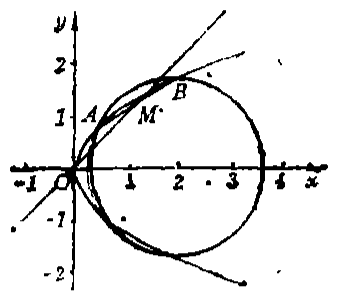
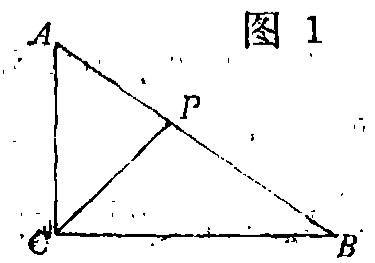
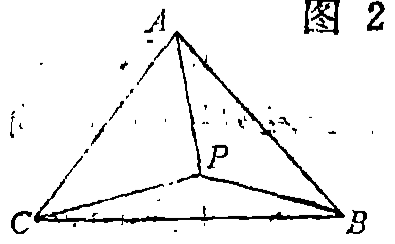

# 1986年上海卷（理）

## 单选题

### 第 1 题

平移坐标轴，把原点 $O(0,0)$ 移到 $O'(2,-1)$，则点 $(-1,-3)$ 在新坐标系中的坐标是（）

A.  
$\left( 3,2 \right)$

B.  
$\left( -3,-2 \right)$

C.  
$\left( -3,2 \right)$

D.  
$\left( 3,-2 \right)$

#### 答案

B

#### 解析

新坐标系的原点为 $O'(2,-1)$，因此点 $P(x,y)$ 的新坐标为 $\left(x-2,y+1\right)$.对点 $P(-1,-3)$，有 $x'=-1-2=-3$，$y'=-3+1=-2$，所以新坐标为 $\left(-3,-2\right)$，故选 B.

### 第 2 题

下列三角关系式中不正确的是（）

A.  
$\sin\alpha+\sin\beta=2\sin \frac{\alpha+\beta}{2}\cos \frac{\beta-\alpha}{2}$

B.  
$\sin\alpha-\sin\beta=2\cos \frac{\alpha+\beta}{2}\sin \frac{\beta-\alpha}{2}$

C.  
$\cos\alpha+\cos\beta=2\cos \frac{\alpha+\beta}{2}\cos \frac{\beta-\alpha}{2}$

D.  
$\cos\alpha-\cos\beta=2\sin \frac{\alpha+\beta}{2}\sin \frac{\beta-\alpha}{2}$

#### 答案

B

#### 解析

由和差化积公式， $\sin\alpha+\sin\beta=2\sin\frac{\alpha+\beta}{2}\cos\frac{\alpha-\beta}{2}$，而余弦函数是偶函数，所以选项 A 正确.又 $\sin\alpha-\sin\beta=2\cos\frac{\alpha+\beta}{2}\sin\frac{\alpha-\beta}{2}=-2\cos\frac{\alpha+\beta}{2}\sin\frac{\beta-\alpha}{2}$，选项 B 的右端符号错误.选项 C 是余弦和的和差化积公式，选项 D 由 $\cos\alpha-\cos\beta=-2\sin\frac{\alpha+\beta}{2}\sin\frac{\alpha-\beta}{2}$ 得到，均正确，故选 B.

### 第 3 题

在直角坐标系中，直线 $x+\sqrt{3}y+1=0$ 的倾角是（）

A.  
$\frac{\pi}{6}$

B.  
$\frac{\pi}{3}$

C.  
$\frac{2\pi}{3}$

D.  
$\frac{5\pi}{6}$

#### 答案

D

#### 解析

将直线方程化为斜截式，得 $y=-\frac{1}{\sqrt{3}}x-\frac{1}{\sqrt{3}}$，所以直线的斜率为 $k=-\frac{1}{\sqrt{3}}$.设倾角为 $\theta$，则 $\tan\theta=k=-\frac{1}{\sqrt{3}}$，且倾角满足 $0\leqslant\theta<\pi$，因此 $\theta=\frac{5\pi}{6}$，故选 D.

### 第 4 题

函数 $y=2\tan\left( 3x+\frac{\pi}{6} \right)$ 的最小正周期是（）

A.  
$\frac{\pi}{6}$

B.  
$\frac{\pi}{3}$

C.  
$\frac{\pi}{2}$

D.  
$\frac{2\pi}{3}$

#### 答案

B

#### 解析

正切函数的最小正周期为 $\pi$.当自变量 $x$ 增加 $T$ 时，要求 $3(x+T)+\frac{\pi}{6}=3x+\frac{\pi}{6}+\pi$，所以 $3T=\pi$，从而 $T=\frac{\pi}{3}$，故选 B.

### 第 5 题

在空间，下列命题中正确的是（）

A.  
如果两直线 $a,b$ 与直线 $l$ 所成的角相等，那么 $a\parallel b$

B.  
如果两直线 $a$，$b$ 与平面 $\alpha$ 所成的角相等，那么 $a\parallel b$

C.  
如果直线 $l$ 与两平面 $\alpha$，$\beta$ 所成的角都是直角，那么 $\alpha\parallel\beta$

D.  
如果平面 $\gamma$ 与两平面 $\alpha$，$\beta$ 所成的二面角都是直二面角，那么 $\alpha\parallel\beta$

#### 答案

C

#### 解析

直线 $l$ 与平面 $\alpha$ 垂直、与平面 $\beta$ 也垂直时，直线 $l$ 同时是两个平面的法线方向.因此 $\alpha$ 与 $\beta$ 的法线平行，两个平面平行，选项 C 正确.

选项 A 中，与同一直线所成角相等的两直线不一定平行；选项 B 中，平面内不同方向的两条直线与该平面的角都为零，也不一定平行；选项 D 中，两个相交的竖直平面都可与同一个水平面成直二面角，因而也不一定平行，故选 C.

### 第 6 题

当 $|x|\leqslant 1$ 时，$\arccos(-x)$ 等于（）

A.  
$\pi-\arccos x$

B.  
$-\arccos x$

C.  
$\arccos x$

D.  
$\pi+\arccos x$

#### 答案

A

#### 解析

令 $t=\arccos x$，由于 $|x|\leqslant1$，有 $0\leqslant t\leqslant\pi$ 且 $\cos t=x$.于是 $\cos(\pi-t)=-\cos t=-x$，并且 $\pi-t\in[0,\pi]$.根据反余弦函数值域， $\arccos(-x)=\pi-t=\pi-\arccos x$，故选 A.

### 第 7 题

极坐标方程 $\rho=\frac{5}{2-4\cos\theta}$ 所表示的曲线是（）

A.  
椭圆

B.  
抛物线

C.  
双曲线

D.  
直线

#### 答案

C

#### 解析

由极坐标与直角坐标的关系 $\rho=\sqrt{x^2+y^2}$，$x=\rho\cos\theta$，原方程化为 $2\rho-4\rho\cos\theta=5$，即 $2\sqrt{x^2+y^2}-4x=5$，所以 $\sqrt{x^2+y^2}=2x+\frac{5}{2}$.两边平方并配方，得 $3x^2+10x+\frac{25}{4}-y^2=0$，即 $3\left(x+\frac{5}{3}\right)^2-y^2=\frac{25}{12}$.这是以横轴为实轴的双曲线，故选 C.

### 第 8 题

下列双曲线方程中，以 $y=\pm \frac{1}{2}x$ 为渐近线的是（）

A.  
$\frac{x^2}{16}-\frac{y^2}{4}=1$

B.  
$\frac{x^2}{4}-\frac{y^2}{16}=1$

C.  
$\frac{x^2}{2}-y^2=1$

D.  
$x^2-\frac{y^2}{2}=1$

#### 答案

A

#### 解析

双曲线 $\frac{x^2}{a^2}-\frac{y^2}{b^2}=1$ 的渐近线为 $y=\pm\frac{b}{a}x$.逐项比较：选项 A 中 $a=4$，$b=2$，所以 $b/a=1/2$，正好满足题设；选项 B 的 $b/a=2$，选项 C 的 $b/a=1/\sqrt{2}$，选项 D 的 $b/a=\sqrt{2}$，二者都不等于 $1/2$，故选 A.

### 第 9 题

复数 $\sqrt{3}-\i$ 的幅角的主值是（）

A.  
$\frac{\pi}{6}$

B.  
$\frac{5\pi}{6}$

C.  
$\frac{7\pi}{6}$

D.  
$\frac{11\pi}{6}$

#### 答案

D

#### 解析

复数 $z=\sqrt{3}-\i$ 的实部为正、虚部为负，所以它位于第四象限.又 $\tan|\arg z|=\frac{1}{\sqrt{3}}$，故第四象限内与正实轴的锐角为 $\pi/6$.按题目采用的幅角主值范围 $[0,2\pi)$，有 $\arg z=2\pi-\frac{\pi}{6}=\frac{11\pi}{6}$，故选 D.

### 第 10 题

等式 $\log_3 x^2=2$ 成立是等式 $\log_3 x=1$ 成立的（）

A.  
充分条件但不是必要条件

B.  
必要条件但不是充分条件

C.  
充分必要条件

D.  
既不充分又不必要的条件

#### 答案

B

#### 解析

等式 $\log_3x^2=2$ 的定义域要求 $x\ne0$，并且 $x^2=3^2=9$，所以其解为 $x=\pm3$.等式 $\log_3x=1$ 的定义域要求 $x>0$，解为 $x=3$.因此后一等式成立一定能推出前一等式成立，但前一等式在 $x=-3$ 时也成立，不能反推出后一等式成立，所以前一等式是后一等式成立的必要但非充分条件，故选 B.

### 第 11 题

在等比数列中，已知首项为 $\frac{9}{8}$，末项为 $\frac{1}{3}$，公比为 $\frac{2}{3}$，则项数是（）

A.  
3

B.  
4

C.  
5

D.  
6

#### 答案

B

#### 解析

等比数列的第 $n$ 项为 $a_n=a_1q^{n-1}$.由题意， $\frac{1}{3}=\frac{9}{8}\left(\frac{2}{3}\right)^{n-1}$，从而 $\left(\frac{2}{3}\right)^{n-1}=\frac{8}{27}=\left(\frac{2}{3}\right)^3$.由于 $0<\frac{2}{3}<1$，得 $n-1=3$，所以 $n=4$，故选 B.

### 第 12 题

已知定直线 $l$ 和外一定点 $A$，过点 $A$ 且与 $l$ 相切的圆的圆心轨迹是（）

A.  
抛物线

B.  
双曲线

C.  
椭圆

D.  
直线

#### 答案

A

#### 解析

设圆心为 $C$.因为圆过定点 $A$，所以半径为 $CA$；又因为圆与定直线 $l$ 相切，所以半径等于圆心到直线 $l$ 的距离，即 $CA=d(C,l)$.因此圆心 $C$ 到定点 $A$ 的距离等于它到定直线 $l$ 的距离，这正是以 $A$ 为焦点、以 $l$ 为准线的抛物线的定义，故选 A.

### 第 13 题

若 $\sin \frac{\theta}{2}=\frac{3}{5}$，$\cos \frac{\theta}{2}=-\frac{4}{5}$，则 $\theta$ 角的终边在（）

A.  
第一象限

B.  
第二象限

C.  
第三象限

D.  
第四象限

#### 答案

D

#### 解析

设 $\varphi=\theta/2$.由 $\sin\varphi=3/5>0$、$\cos\varphi=-4/5<0$，可直接计算 $\cos\theta=\cos^2\varphi-\sin^2\varphi=\frac{16}{25}-\frac{9}{25}=\frac{7}{25}>0$，以及 $\sin\theta=2\sin\varphi\cos\varphi=2\times\frac{3}{5}\times\left(-\frac{4}{5}\right)=-\frac{24}{25}<0$.所以 $\theta$ 的终边在第四象限，故选 D.

### 第 14 题

下列不等式中正确的是（）

A.  
$\sin \frac{5\pi}{7}>\sin \frac{4\pi}{7}$

B.  
$\tan\frac{15\pi}{8}>\tan\left( -\frac{\pi}{7} \right)$

C.  
$\sin \left( -\frac{\pi}{5} \right)>\sin \left( -\frac{\pi}{6} \right)$

D.  
$\cos \left( -\frac{3\pi}{5} \right)>\cos \left( -\frac{9\pi}{4} \right)$

#### 答案

B

#### 解析

选项 A 中，$\sin\frac{5\pi}{7}=\sin\frac{2\pi}{7}$，$\sin\frac{4\pi}{7}=\sin\frac{3\pi}{7}$，而正弦函数在 $(0,\pi/2)$ 上递增，故前者小于后者，A 错.

选项 B 中，$\tan\frac{15\pi}{8}=\tan\left(-\frac{\pi}{8}\right)$.正切函数在 $(-\pi/2,\pi/2)$ 上递增，且 $-\frac{\pi}{8}>-\frac{\pi}{7}$，所以 $\tan\left(-\frac{\pi}{8}\right)>\tan\left(-\frac{\pi}{7}\right)$，B 正确.

选项 C 中，$\sin\left(-\frac{\pi}{5}\right)=-\sin\frac{\pi}{5}<-\sin\frac{\pi}{6}=\sin\left(-\frac{\pi}{6}\right)$，不等式方向相反.选项 D 中，$\cos\left(-\frac{3\pi}{5}\right)=\cos\frac{3\pi}{5}<0$，而 $\cos\left(-\frac{9\pi}{4}\right)=\cos\frac{\pi}{4}>0$，D 也错误，故选 B.

### 第 15 题

函数 $y=\lg \left( x+\sqrt{x^2+1} \right)$（$x\in\mathbb{R}$）（）

A.  
是奇函数，不是偶函数

B.  
是偶函数，不是奇函数

C.  
既不是奇函数，又不是偶函数

D.  
既是奇函数又是偶函数

#### 答案

A

#### 解析

因为 $\sqrt{x^2+1}>|x|$，所以 $x+\sqrt{x^2+1}>0$，函数定义域为 $\mathbb{R}$.令 $u=x+\sqrt{x^2+1}$，则 $\left(-x+\sqrt{x^2+1}\right)\left(x+\sqrt{x^2+1}\right)=1$，从而 $f(-x)=\lg\left(-x+\sqrt{x^2+1}\right)=\lg\frac{1}{u}=-\lg u=-f(x)$.又例如 $f(1)>0$，函数不恒为零，因此它是奇函数而不是偶函数，故选 A.

### 第 16 题

$a$，$b$ 满足 $0<a<b<1$. 下列不等式中正确的是（）

A.  
$a^a<a^b$

B.  
$b^a<b^b$

C.  
$a^a<b^a$

D.  
$b^b<a^b$

#### 答案

C

#### 解析

因为 $a>0$，函数 $x^a$ 在 $(0,+\infty)$ 上递增，而 $a<b$，所以 $a^a<b^a$，选项 C 正确.

另一方面，因底数 $a$、$b$ 都在 $(0,1)$ 内，$a^x$、$b^x$ 分别随 $x$ 增大而减小，所以 $a^a>a^b$、$b^a>b^b$.又因指数 $b>0$，函数 $x^b$ 递增，所以 $b^b>a^b$.因此其余选项均错误，故选 C.

### 第 17 题

正方体 $ABCD-A_1B_1C_1D_1$ 中，直线 $BC_1$ 与 $AC$（）

A.  
相交且垂直

B.  
相交但不垂直

C.  
异面且垂直

D.  
异面但不垂直

#### 答案

D

#### 解析

设正方体棱长为 $1$，取 $A(0,0,0)$，$B(1,0,0)$，$C(1,1,0)$，$C_1(1,1,1)$.则直线 $AC$ 的方向向量为 $(1,1,0)$，直线 $BC_1$ 的方向向量为 $(0,1,1)$.两方向向量的内积为 $1$，不为零，所以两直线不垂直.

若两直线相交，方程 $(1,1,0)s=(1,t,t)$ 应有解；由第三个坐标得 $t=0$，由第一个坐标得 $s=1$，但第二个坐标随即给出 $0=1$，矛盾.因此两直线不相交，即为异面但不垂直，故选 D.

### 第 18 题

设复数 $z=a+b\i$（$a$，$b\in\mathbb{R}$，且 $b\ne 0$），则 $|z^2|$，$|z|^2$，$z^2$ 的关系是（）

A.  
$|z^2|=|z|^2\ne z^2$

B.  
$|z^2|=|z|^2=z^2$

C.  
$|z^2|\ne |z|^2=z^2$

D.  
互不相等

#### 答案

A

#### 解析

复数模具有乘法性，所以 $|z^2|=|z|^2$.另一方面， $z^2=(a+b\i)^2=a^2-b^2+2ab\i$，而 $|z|^2=a^2+b^2$.若二者相等，则比较实部得到 $a^2-b^2=a^2+b^2$，即 $b=0$，这与题设 $b\ne0$ 矛盾.因此 $|z^2|=|z|^2\ne z^2$，故选 A.

### 第 19 题

过抛物线焦点 $F$ 的直线与抛物线相交于 $A$，$B$ 两点，若 $A$，$B$ 在抛物线准线上的射影分别是 $A_1$，$B_1$，则 $\angle A_1FB_1$ 等于（）

A.  
$45^\circ$

B.  
$60^\circ$

C.  
$90^\circ$

D.  
$120^\circ$

#### 答案

C

#### 解析

将抛物线写成标准式 $y^2=4cx$，其中焦点为 $F(c,0)$，准线为 $x=-c$.设抛物线上两点对应的参数分别为 $t$、$u$，则 $A(ct^2,2ct)$，$B(cu^2,2cu)$.两点弦的方程为 $(t+u)y=2x+2ctu$.因为弦 $AB$ 过焦点 $F(c,0)$，代入得 $0=2c+2ctu$，所以 $tu=-1$.

两点在准线上的射影为 $A_1(-c,2ct)$、$B_1(-c,2cu)$，故 $\overrightarrow{FA_1}=2c(-1,t)$，$\overrightarrow{FB_1}=2c(-1,u)$.于是 $\overrightarrow{FA_1}\cdot\overrightarrow{FB_1}=4c^2(1+tu)=0$，所以 $FA_1\perp FB_1$，即 $\angle A_1FB_1=90^\circ$，故选 C.

### 第 20 题

若全集 $I=\{(x,y)\mid x,y\in\mathbb{R}\}$，$A=\left\{(x,y)\mid \frac{y-3}{x-2}=1,\ x,y\in\mathbb{R} \right\}$，$B=\{(x,y)\mid y=x+1,\ x,y\in\mathbb{R}\}$，则 $\overline{A}\cap B$ 是（）

A.  
$\overline{A}$

B.  
$B$

C.  
$\varnothing$

D.  
$\{(2,3)\}$

#### 答案

D

#### 解析

集合 $A$ 中的分式要求 $x\ne2$.在此条件下， $\frac{y-3}{x-2}=1$ 等价于 $y-3=x-2$，即 $y=x+1$.因此 $A=\{(x,y)\mid y=x+1,\ (x,y)\ne(2,3)\}$.

全集为 $I$，所以 $\overline A$ 由 $I$ 中不属于 $A$ 的点组成.与 $B$ 相交时，$B$ 上除去的只有 $A$ 中的点，唯一剩下的点为 $(2,3)$，故 $\overline A\cap B=\{(2,3)\}$，选 D.

## 填空题

### 第 21 题

若三点 $P_1$，$P_2$ 和 $P$ 在一条直线上，点 $P_1$ 和点 $P_2$ 在直角坐标系中的坐标分别为 $(0,-6)$ 和 $(3,0)$，且 $\frac{P_1P}{PP_2}=-\frac{1}{2}$，则点 $P$ 的坐标是＿＿＿＿＿＿.

#### 答案

$\left( -3,-12 \right)$

#### 解析

用位置向量表示点 $P$.由有向线段比的意义， $\overrightarrow{P_1P}=-\frac{1}{2}\overrightarrow{PP_2}$，即 $P-P_1=-\frac{1}{2}(P_2-P)$.整理得 $P=2P_1-P_2$.代入 $P_1(0,-6)$、$P_2(3,0)$，得到 $P=(0,-12)-(3,0)=(-3,-12)$，所以填 $\left(-3,-12\right)$.

### 第 22 题

正方体的全面积是 $6$，则其内切球体积是＿＿＿＿＿＿.

#### 答案

$\frac{\pi}{6}$

#### 解析

设正方体棱长为 $a$.由全面积为 $6$，得 $6a^2=6$，所以 $a=1$.内切球的直径等于正方体棱长，故半径 $r=\frac{1}{2}$.于是球体积为 $V=\frac{4}{3}\pi r^3=\frac{4}{3}\pi\left(\frac{1}{2}\right)^3=\frac{\pi}{6}$，所以填 $\frac{\pi}{6}$.

### 第 23 题

$\displaystyle\lim_{n\to\infty}\frac{1+3+5+\cdots+(2n-1)}{n(n+1)}=$＿＿＿＿＿＿.

#### 答案

$1$

#### 解析

前 $n$ 个奇数的和为 $1+3+5+\cdots+(2n-1)=\frac{n\left[1+(2n-1)\right]}{2}=n^2$.因此 $\displaystyle\lim_{n\to\infty}\frac{1+3+5+\cdots+(2n-1)}{n(n+1)}=\lim_{n\to\infty}\frac{n^2}{n(n+1)}=\lim_{n\to\infty}\frac{n}{n+1}=1$，所以填 $1$.

### 第 24 题

$\left( \sqrt[3]{x}-\frac{1}{\sqrt{x}} \right)^8$ 的展开式中，$x$ 的一次项的系数是＿＿＿＿＿＿.

#### 答案

$28$ 或 $\mathrm C_8^6$

#### 解析

将通项写成 $\mathrm C_8^k\left(x^{1/3}\right)^{8-k}\left(-x^{-1/2}\right)^k=(-1)^k\mathrm C_8^k x^{\frac{8-k}{3}-\frac{k}{2}}=(-1)^k\mathrm C_8^k x^{\frac{16-5k}{6}}$. 要得到 $x$ 的一次项，须有 $\frac{16-5k}{6}=1$，解得 $k=2$.此时系数为 $\mathrm C_8^2=28=\mathrm C_8^6$，所以填 $28$ 或 $\mathrm C_8^6$.

### 第 25 题

不等式组 $\sqrt{x^2-9}\leqslant 4$ 且 $x>0$ 的解是＿＿＿＿＿＿.

#### 答案

$3\leqslant x\leqslant 5$

#### 解析

根式有意义要求 $x^2-9\geqslant0$，即 $x\leqslant-3$ 或 $x\geqslant3$.由于两边均非负，可以将不等式平方，得 $x^2-9\leqslant16$，即 $x^2\leqslant25$，所以 $-5\leqslant x\leqslant5$.再与 $x>0$ 及定义域相交，得到 $3\leqslant x\leqslant5$，所以填 $3\leqslant x\leqslant5$.

### 第 26 题

轴截面是等边三角形的圆锥，它的侧面展开图扇形的圆心角的弧度数等于＿＿＿＿＿＿.

#### 答案

$\pi$

#### 解析

设圆锥底面半径为 $r$，母线长为 $l$.轴截面是等边三角形时，底边为圆锥底面的直径 $2r$，两腰为母线，所以 $l=2r$.侧面展开图是半径为 $l$ 的扇形，其弧长等于圆锥底面周长，因此若圆心角为 $\varphi$，则 $l\varphi=2\pi r$.代入 $l=2r$，得 $2r\varphi=2\pi r$，所以 $\varphi=\pi$，填 $\pi$.

### 第 27 题

用 $1$，$2$，$3$，$4$ 四个数字组成没有重复数字的四位奇数的个数是＿＿＿＿＿＿.

#### 答案

$12$

#### 解析

四位数为奇数，个位必须从 $1$、$3$ 中选，有 $2$ 种选法.个位确定后，剩余三个数字在千位、百位、十位上无重复排列，有 $3!=6$ 种.因此总数为 $2\times3!=12$，填 $12$.

### 第 28 题

已知 $\cos \theta=-\frac{3}{5}$ 且 $\pi<\theta<\frac{3\pi}{2}$，则 $\cot\left( \theta-\frac{\pi}{4} \right)=$＿＿＿＿＿＿.

#### 答案

$7$

#### 解析

由 $\pi<\theta<\frac{3\pi}{2}$，知 $\theta$ 在第三象限，所以 $\sin\theta=-\frac{4}{5}$.于是 $\cos\left(\theta-\frac{\pi}{4}\right)=\cos\theta\cos\frac{\pi}{4}+\sin\theta\sin\frac{\pi}{4}=-\frac{3}{5}\cdot\frac{\sqrt{2}}{2}-\frac{4}{5}\cdot\frac{\sqrt{2}}{2}=-\frac{7\sqrt{2}}{10}$， $\sin\left(\theta-\frac{\pi}{4}\right)=\sin\theta\cos\frac{\pi}{4}-\cos\theta\sin\frac{\pi}{4}=-\frac{4}{5}\cdot\frac{\sqrt{2}}{2}+\frac{3}{5}\cdot\frac{\sqrt{2}}{2}=-\frac{\sqrt{2}}{10}$.因此 $\cot\left(\theta-\frac{\pi}{4}\right)=\frac{-7\sqrt{2}/10}{-\sqrt{2}/10}=7$，填 $7$.

### 第 29 题

函数 $y=\log_2\left( \log_{\frac{1}{2}}x \right)$ 的定义域是＿＿＿＿＿＿.

#### 答案

$(0,1)$

#### 解析

外层对数有意义，必须满足内层真数为正，即 $\log_{1/2}x>0$.由于底数 $1/2$ 在 $(0,1)$ 内，$\log_{1/2}x>0$ 等价于 $0<x<1$.因此函数的定义域为 $(0,1)$，填 $(0,1)$.

### 第 30 题

若直线的参数方程是 $x=3+\frac{4}{5}t$，$y=-2+\frac{3}{5}t$（$t$ 为参数），则过点 $(4,-1)$ 且与其平行的直线在 $y$ 轴上的截距是＿＿＿＿＿＿.

#### 答案

$-4$

#### 解析

原直线的方向向量为 $\left(\frac{4}{5},\frac{3}{5}\right)$，所以斜率为 $\frac{3}{4}$.过点 $(4,-1)$ 且与它平行的直线为 $y+1=\frac{3}{4}(x-4)$，即 $y=\frac{3}{4}x-4$.令 $x=0$，得其在 $y$ 轴上的截距为 $-4$，填 $-4$.

## 解答题

### 第 31 题

设数列 $\{a_n\}$ 的前 $n$ 项的和为 $S_n=n^2+2n+4$（$n\in\mathbb{Z}^+$）.

1.  写出这个数列的前三项 $a_1$，$a_2$，$a_3$；

2.  证明：数列 $\{a_n\}$ 除去首项后所成的数列 $a_2$，$a_3$，$a_4$，$\cdots$ 是等差数列.

#### 解析

1.  由 $a_1=S_1$，得 $a_1=1^2+2\times 1+4=7$. 又 $a_2=S_2-S_1=2^2+2\times 2+4-7=5$，$a_3=S_3-S_2=3^2+2\times 3+4-\left( 2^2+2\times 2+4 \right)=7$. 所以 $a_1=7$，$a_2=5$，$a_3=7$.

2.  当 $n\geqslant 2$ 时，

$$

a_n=S_n-S_{n-1}=n^2+2n+4-\left[ \left( n-1 \right)^2+2\left( n-1 \right)+4 \right]=2n+1

$$

    因此 $a_{n+1}-a_n=\left[ 2\left( n+1 \right)+1 \right]-\left( 2n+1 \right)=2$. 故数列 $a_2$，$a_3$，$a_4$，$\cdots$ 构成公差为 $2$ 的等差数列.

### 第 32 题

设 $x>0$，$y>0$. 证明不等式 $\left( x^2+y^2 \right)^{\frac{1}{2}}>\left( x^3+y^3 \right)^{\frac{1}{3}}$.

#### 解析

只需证明 $\left( x^2+y^2 \right)^3>\left( x^3+y^3 \right)^2$. 计算得

$$

\begin{gathered}
\left( x^2+y^2 \right)^3-\left( x^3+y^3 \right)^2
 =3x^4y^2+3x^2y^4-2x^3y^3
 =x^2y^2\left( 3x^2-2xy+3y^2 \right)\\
 =x^2y^2\left[ 3\left( x-\frac{y}{3} \right)^2+\frac{8}{3}y^2 \right]>0
\end{gathered}

$$

所以 $\left( x^2+y^2 \right)^3>\left( x^3+y^3 \right)^2$. 由于两端都为正数，两端开 $6$ 次方，得 $\left( x^2+y^2 \right)^{\frac{1}{2}}>\left( x^3+y^3 \right)^{\frac{1}{3}}$.

### 第 33 题

已知 $k$ 为实数，复数 $z=\cos\theta+\i\sin\theta$.

1.  当 $k$ 和 $\theta$ 分别为何值时，复数 $z^3+k\overline{z}^3$ 是纯虚数；

2.  当 $\theta$ 变化时，求出 $\left| z^3+k\overline{z}^3 \right|$ 的最大值和最小值.

#### 解析

根据棣莫弗定理，$z^3=\cos 3\theta+\i\sin 3\theta$，$\overline{z}^3=\cos 3\theta-\i\sin 3\theta$，因此

$$

z^3+k\overline{z}^3=\left( 1+k \right)\cos 3\theta+\i\left( 1-k \right)\sin 3\theta

$$

1.  若 $z^3+k\overline{z}^3$ 是纯虚数，则

$$

\begin{cases}
    \left( 1+k \right)\cos 3\theta&=0,\\
    \left( 1-k \right)\sin 3\theta&\ne 0.
    \end{cases}

$$

    于是有两种情况：

    $k=-1$ 且 $\theta\ne \frac{n\pi}{3}$（$n\in\mathbb{Z}$）；

    或 $k\ne 1$ 且 $\theta=\frac{2n\pi}{3}\pm \frac{\pi}{6}$（$n\in\mathbb{Z}$）.

2.  由上式得

$$

\left| z^3+k\overline{z}^3 \right|^2=\left( 1+k \right)^2\cos^2 3\theta+\left( 1-k \right)^2\sin^2 3\theta

$$

    利用二倍角公式化简为

$$

\left| z^3+k\overline{z}^3 \right|^2=1+k^2+2k\cos 6\theta

$$

    因此：

    当 $k>0$ 时，$\left| z^3+k\overline{z}^3 \right|$ 的最大值是 $1+k$，最小值是 $|1-k|$；

    当 $k=0$ 时，$\left| z^3+k\overline{z}^3 \right|$ 的最大值和最小值都等于 $1$；

    当 $k<0$ 时，$\left| z^3+k\overline{z}^3 \right|$ 的最大值是 $1-k$，最小值是 $|1+k|$.

### 第 34 题

如果抛物线 $y^2=px$ 和圆 $(x-2)^2+y^2=3$ 相交，它们在 $x$ 轴上方的交点为 $A$ 和 $B$，那么当 $p$ 为何值时，线段 $AB$ 的中点 $M$ 在直线 $y=x$ 上.

#### 解析

设 $A(x_1,y_1)$，$B(x_2,y_2)$. 因为圆的横坐标范围为 $2-\sqrt{3}\leqslant x\leqslant2+\sqrt{3}$，所以 $x_1$，$x_2>0$. 又 $A$，$B$ 同时在抛物线和圆上，由 $y^2=px$ 可知 $p>0$. 将 $y^2=px$ 代入 $(x-2)^2+y^2=3$，得 $x^2+\left( p-4 \right)x+1=0$. 故 $x_1+x_2=4-p$，$x_1x_2=1$.

设 $M(x_M,y_M)$，则 $x_M=\dfrac{x_1+x_2}{2}=\dfrac{4-p}{2}$.

又因为 $A$，$B$ 在 $x$ 轴上方，且 $x_1x_2=1$，所以

$$

\begin{gathered}
y_1+y_2
 =\sqrt{\left( y_1+y_2 \right)^2}
 =\sqrt{y_1^2+y_2^2+2y_1y_2}\\
 =\sqrt{p(x_1+x_2)+2p\sqrt{x_1x_2}}
 =\sqrt{p(4-p)+2p}=\sqrt{6p-p^2}
\end{gathered}

$$

因此 $y_M=\dfrac{y_1+y_2}{2}=\dfrac{\sqrt{6p-p^2}}{2}$.

因为 $M$ 在直线 $y=x$ 上，所以 $\dfrac{\sqrt{6p-p^2}}{2}=\dfrac{4-p}{2}$. 化简得 $6p-p^2=\left( 4-p \right)^2$，即 $p^2-7p+8=0$. 所以 $p=\dfrac{7\pm \sqrt{17}}{2}$. 又因为 $A$，$B$ 在 $x$ 轴上方，所以 $M$ 也在 $x$ 轴上方，从而 $x_M>0$，即 $p<4$. 因此舍去 $p=\dfrac{7+\sqrt{17}}{2}$，得到 $p=\dfrac{7-\sqrt{17}}{2}$.

### 第 35 题

已知直角三角形 $ABC$ 的两直角边 $AC=2$，$BC=3$，$P$ 为斜边 $AB$ 上一点（图1）. 现沿 $CP$ 将此三角形折成直二面角 $A-CP-B$，当 $AB=\sqrt{7}$ 时，求二面角 $P-AC-B$ 的大小（图2）.

#### 解析

设 $\alpha=\angle ACP$，$\beta=\angle PCB$. 折叠前 $P$ 在斜边 $AB$ 上，且 $AC\perp BC$，所以 $\alpha+\beta=\angle ACB=90^\circ$. 折叠后 $AC=2$，$BC=3$，$AB=\sqrt{7}$，设此时空间角为 $\angle ACB$，由余弦定理得

$$

\cos\angle ACB=\frac{AC^2+BC^2-AB^2}{2AC\cdot BC}=\frac{4+9-7}{12}=\frac{1}{2}

$$

直二面角 $A-CP-B$ 中，分别把 $\overrightarrow{CA}$、$\overrightarrow{CB}$ 分解为沿 $CP$ 的分量和垂直于 $CP$ 的分量，两个垂直分量互相垂直，因此

$$

\cos\angle ACB=\cos\alpha\cos\beta

$$

代入 $\beta=90^\circ-\alpha$，得到 $\cos\alpha\sin\alpha=\frac{1}{2}$，$\sin 2\alpha=1$. 由 $0^\circ<\alpha<90^\circ$，可得 $\alpha=\beta=45^\circ$.

建立空间直角坐标系，使 $C$ 为原点，$CP$ 为 $x$ 轴，平面 $ACP$ 为 $xOy$ 平面，平面 $BCP$ 为 $xOz$ 平面. 于是 $A\left(\sqrt{2},\sqrt{2},0\right)$，$B\left(\frac{3}{\sqrt{2}},0,\frac{3}{\sqrt{2}}\right)$. 平面 $PAC$ 的法向量可取 $n_1=(0,0,1)$，平面 $BAC$ 的法向量可取

$$

n_2=\overrightarrow{CA}\times\overrightarrow{CB}=3(1,-1,-1)

$$

因此二面角 $P-AC-B$ 的余弦为

$$

\frac{|n_1\cdot n_2|}{|n_1|\,|n_2|}=\frac{1}{\sqrt{3}}=\frac{\sqrt{3}}{3}

$$

所以二面角 $P-AC-B$ 的大小为 $\arccos\frac{\sqrt{3}}{3}$.
