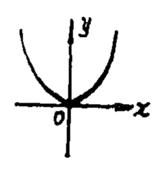
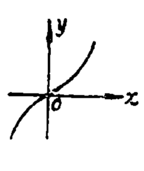
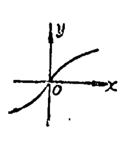
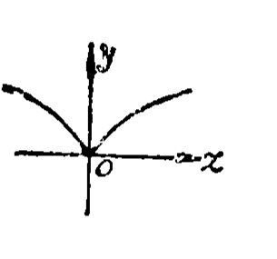
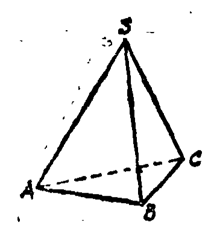

# 1987年上海卷

## 填空题

### 第 1 题

$y=x^2$（$x\leqslant 0$）的反函数是＿＿＿＿＿＿.

#### 答案

$y=-\sqrt{x}$

#### 解析

令原函数的自变量为 $t$，则 $y=t^2$，且 $t\leqslant0$. 交换自变量与因变量，得 $x=t^2$. 由于原函数的自变量满足 $t\leqslant0$，所以由 $t=\pm\sqrt{x}$ 只能取 $t=-\sqrt{x}$，并且此时 $x\geqslant0$. 因而反函数为 $y=-\sqrt{x}$，定义域为 $x\geqslant0$.

### 第 2 题

$\mathrm C_{10}^1+\mathrm C_{10}^2+\cdots+\mathrm C_{10}^9+\mathrm C_{10}^{10}=$＿＿＿＿＿＿.

#### 答案

$1023$

#### 解析

由二项式定理，$\mathrm C_{10}^0+\mathrm C_{10}^1+\cdots+\mathrm C_{10}^{10}=(1+1)^{10}=2^{10}$. 题中所求的和没有 $\mathrm C_{10}^0$，而 $\mathrm C_{10}^0=1$，所以所求结果为 $2^{10}-1=1024-1=1023$.

### 第 3 题

函数 $f(x)=ax^2+bx+c$ 是偶函数的充要条件是＿＿＿＿＿＿.

#### 答案

$b=0$

#### 解析

函数为偶函数的充要条件是对任意 $x\in\mathbb{R}$，都有 $f(-x)=f(x)$. 计算得 $f(-x)=ax^2-bx+c$，因此 $f(-x)-f(x)=-2bx$. 若 $f$ 为偶函数，则该式对一切 $x\in\mathbb{R}$ 都等于零，取 $x=1$ 即得 $b=0$. 反过来，若 $b=0$，则 $f(-x)=ax^2+c=f(x)$ 对一切 $x$ 成立，所以 $b=0$ 也是充分条件. 因而充要条件为 $b=0$.

### 第 4 题

设 $ABCD-A_1B_1C_1D_1$ 为一正方体，$E$，$F$ 分别为 $BB_1$，$DC$ 的中点. 则 $AE$ 与 $D_1F$ 所成的角为＿＿＿＿＿＿.

#### 答案

$\dfrac{\pi}{2}$

#### 解析

设正方体棱长为 $s>0$，建立坐标系使 $A=(0,0,0)$，$B=(s,0,0)$，$C=(s,s,0)$，$D=(0,s,0)$，$B_1=(s,0,s)$，$D_1=(0,s,s)$. 由中点条件，$E=\left(s,0,\dfrac{s}{2}\right)$，$F=\left(\dfrac{s}{2},s,0\right)$. 因而可取两直线的方向向量 $\overrightarrow{AE}=\left(s,0,\dfrac{s}{2}\right)$，$\overrightarrow{D_1F}=\left(\dfrac{s}{2},0,-s\right)$.

两向量的内积为 $\overrightarrow{AE}\cdot\overrightarrow{D_1F}=s\cdot\dfrac{s}{2}+\dfrac{s}{2}\cdot(-s)=0$. 由于两向量都非零，故两直线方向垂直，所成的角为 $\dfrac{\pi}{2}$.

### 第 5 题

在底面半径为 $a$，高为 $2a$ 的圆柱中，分别挖去一个底面半径及高均为 $a$ 的圆锥与一个半径为 $a$ 的半球，则剩下部分的体积为＿＿＿＿＿＿.

#### 答案

$\pi a^3$

#### 解析

圆柱的体积为 $V_1=\pi a^2\cdot2a=2\pi a^3$. 圆锥的底面半径和高都为 $a$，所以其体积为 $V_2=\dfrac13\pi a^2\cdot a=\dfrac13\pi a^3$. 半径为 $a$ 的半球体积为 $V_3=\dfrac12\cdot\dfrac43\pi a^3=\dfrac23\pi a^3$. 因而剩余部分的体积为 $V_1-V_2-V_3=2\pi a^3-\dfrac13\pi a^3-\dfrac23\pi a^3=\pi a^3$.

### 第 6 题

函数 $y=2\left|\sin\left(4x-\frac{\pi}{3}\right)\right|$ 的最小正周期为＿＿＿＿＿＿.

#### 答案

$\dfrac{\pi}{4}$

#### 解析

令 $g(u)=|\sin u|$. 因为 $g(u+\pi)=g(u)$，所以 $\pi$ 是它的周期；另一方面，$g(u)=0$ 的充要条件是 $u\in\pi\mathbb{Z}$，若正数 $T$ 是它的周期，则 $g(T)=g(0)=0$，从而 $T$ 至少为 $\pi$. 因此 $g$ 的最小正周期为 $\pi$. 对原函数，$T=\dfrac{\pi}{4}$ 时内层增加 $\pi$，所以它确实是一个周期；反过来，若 $T>0$ 是原函数的周期，则 $4T$ 是 $g$ 的正周期，从而 $4T\geqslant\pi$. 因此最小正周期为 $T=\dfrac{\pi}{4}$.

### 第 7 题

计算函数值：$\arcsin\left(\sin\frac{3\pi}{5}\right)=$＿＿＿＿＿＿.

#### 答案

$\dfrac{2\pi}{5}$

#### 解析

反正弦函数的值域为 $\left[-\dfrac{\pi}{2},\dfrac{\pi}{2}\right]$. 又因为 $\sin\dfrac{3\pi}{5}=\sin\left(\pi-\dfrac{3\pi}{5}\right)=\sin\dfrac{2\pi}{5}$，且 $\dfrac{2\pi}{5}\in\left[-\dfrac{\pi}{2},\dfrac{\pi}{2}\right]$，所以它正是这个正弦值对应的反正弦主值. 因而 $\arcsin\left(\sin\dfrac{3\pi}{5}\right)=\dfrac{2\pi}{5}$.

### 第 8 题

双曲线 $4x^2-\left(y-3\right)^2=4$ 的渐近线方程为＿＿＿＿＿＿.

#### 答案

$2x-y+3=0$，$2x+y-3=0$

#### 解析

令 $X=x$，$Y=y-3$，则双曲线方程化为 $4X^2-Y^2=4$，其中心为 $(X,Y)=(0,0)$. 渐近线由二次项部分 $4X^2-Y^2=0$ 给出，即 $Y=2X$ 或 $Y=-2X$. 换回原坐标，得到 $y-3=2x$ 或 $y-3=-2x$，即两条渐近线分别为 $2x-y+3=0$ 和 $2x+y-3=0$.

### 第 9 题

由参数方程 $x=2\left(\sec^2\theta-1\right)$，$y=2\tan\theta$（$-\frac{\pi}{2}<\theta<\frac{\pi}{2}$）给出的曲线在直角坐标系下的方程是＿＿＿＿＿＿.

#### 答案

$y^2=2x$

#### 解析

由恒等式 $\sec^2\theta-1=\tan^2\theta$，得 $x=2\tan^2\theta$，而 $y=2\tan\theta$. 消去参数可得 $y^2=4\tan^2\theta=2x$. 反过来，给定曲线 $y^2=2x$ 上任意一点，令 $\tan\theta=\dfrac{y}{2}$，由于 $\tan\theta$ 在 $\left(-\dfrac{\pi}{2},\dfrac{\pi}{2}\right)$ 内取遍 $\mathbb{R}$，即可取到相应的 $\theta$. 因此所得到的是 $y^2=2x$ 的全部图形.

### 第 10 题

设 $\{a_n\}$ 为等差数列，已知 $a_1=1$，$a_5$ 与 $a_6$ 的算术平均数为 $19$，则该等差数列的公差为＿＿＿＿＿＿.

#### 答案

$4$

#### 解析

设公差为 $d$，则 $a_5=a_1+4d=1+4d$，$a_6=a_1+5d=1+5d$. 由算术平均数条件，$\dfrac{a_5+a_6}{2}=19$，所以 $\dfrac{(1+4d)+(1+5d)}{2}=19$，即 $2+9d=38$. 解得 $d=4$.

### 第 11 题

$\left(x-\frac{1}{x}\right)^8$ 的展开式中，$x^4$ 的系数与 $\frac{1}{x^4}$ 的系数之差是＿＿＿＿＿＿.

#### 答案

$0$

#### 解析

展开式的通项为 $\mathrm C_8^k x^{8-k}\left(-\dfrac1x\right)^k=(-1)^k\mathrm C_8^k x^{8-2k}$，其中 $k=0$，$1$，$\dots$，$8$. 当幂为 $4$ 时，$8-2k=4$，故 $k=2$，对应系数为 $(-1)^2\mathrm C_8^2=28$. 当幂为 $-4$ 时，$8-2k=-4$，故 $k=6$，对应系数为 $(-1)^6\mathrm C_8^6=28$. 所求差为 $28-28=0$.

### 第 12 题

设 $2^a=5^b=10$，则 $\frac{1}{a}+\frac{1}{b}=$＿＿＿＿＿＿.

#### 答案

$1$

#### 解析

由 $2^a=10$，对等式两边取以 $10$ 为底的对数，得 $a\log_{10}2=1$，所以 $\dfrac1a=\log_{10}2$. 同理，由 $5^b=10$ 得 $b\log_{10}5=1$，所以 $\dfrac1b=\log_{10}5$. 因而 $\dfrac1a+\dfrac1b=\log_{10}2+\log_{10}5=\log_{10}10=1$.

## 单选题

### 第 13 题

设函数 $y=\log_2 x+3$（$x\geqslant 1$），则 $y$ 的值域是（）

A.  
$\{y\mid y\geqslant 2\}$

B.  
$\{y\mid y>3\}$

C.  
$\{y\mid y\geqslant 3\}$

D.  
$\mathbb{R}$

#### 答案

C

#### 解析

因为底数 $2>1$，所以对 $x\geqslant1$ 有 $\log_2x\geqslant\log_2 1=0$，从而 $y\geqslant3$. 当 $x=1$ 时 $y=3$，故下端点可以取到；当 $x$ 增大时 $\log_2x$ 可任意增大，故没有上界. 所以值域为 $\{y\mid y\geqslant3\}$，选 C.

### 第 14 题

下列函数图象中，表示 $y=x^{\frac{2}{3}}$ 的是（）

A.  

B.  

C.  

D.  

#### 答案

D

#### 解析

对任意 $x\in\mathbb{R}$，有 $x^{2/3}=\left(\sqrt[3]{x}\right)^2\geqslant0$，并且 $(-x)^{2/3}=x^{2/3}$，所以图象关于 $y$ 轴对称且位于 $x$ 轴上方. 当 $x<0$ 时，随着 $x$ 增大，$\sqrt[3]{x}$ 增大而其绝对值减小，故函数递减；当 $x>0$ 时函数递增，并在原点形成尖点. 只有选项 D 具有这些特征，故选 D.

### 第 15 题

设实数 $a$，$b$ 满足 $0<a<b$ 且 $a+b=1$，则下列四数中最大的是（）

A.  
$\frac{1}{2}$

B.  
$a^2+b^2$

C.  
$2ab$

D.  
$a$

#### 答案

B

#### 解析

由 $a\ne b$ 及均值不等式，$ab<\dfrac{(a+b)^2}{4}=\dfrac14$，所以 $2ab<\dfrac12$. 又 $a<b$ 且 $a+b=1$，故 $a<\dfrac12$. 同时 $a^2+b^2=(a+b)^2-2ab=1-2ab>\dfrac12$. 因而 $a^2+b^2$ 大于其余三个数，最大者为选项 B.

### 第 16 题

设 $0^\circ<\theta<45^\circ$，则 $\cos^2\theta$，$\sin^2\theta$，$\cot^2\theta$ 的大小顺序是（）

A.  
$\cos^2\theta<\sin^2\theta<\cot^2\theta$

B.  
$\cot^2\theta<\sin^2\theta<\cos^2\theta$

C.  
$\sin^2\theta<\cos^2\theta<\cot^2\theta$

D.  
$\cos^2\theta<\cot^2\theta<\sin^2\theta$

#### 答案

C

#### 解析

由 $0^\circ<\theta<45^\circ$，得 $0<\sin\theta<\cos\theta<1$，平方后有 $0<\sin^2\theta<\cos^2\theta<1$. 另外 $\cot^2\theta=\dfrac{\cos^2\theta}{\sin^2\theta}>1$，所以 $\cot^2\theta>\cos^2\theta$. 因而大小顺序为 $\sin^2\theta<\cos^2\theta<\cot^2\theta$，选 C.

### 第 17 题

$\frac{\sin\alpha+\sin\beta}{\cos\alpha+\cos\beta}$ 等于（）

A.  
$\tan\frac{\alpha+\beta}{2}$

B.  
$-\tan\frac{\alpha+\beta}{2}$

C.  
$\tan\alpha+\tan\beta$

D.  
$\cot\frac{\alpha+\beta}{2}$

#### 答案

A

#### 解析

由和差化积公式，分子为 $2\sin\dfrac{\alpha+\beta}{2}\cos\dfrac{\alpha-\beta}{2}$，分母为 $2\cos\dfrac{\alpha+\beta}{2}\cos\dfrac{\alpha-\beta}{2}$. 在原式有定义时，分母不为零，可以约去公共因子，得到 $\dfrac{\sin\alpha+\sin\beta}{\cos\alpha+\cos\beta}=\tan\dfrac{\alpha+\beta}{2}$. 故选 A.

### 第 18 题

如果圆 $x^2+y^2+ax+by+c=0$（$a$，$b$，$c$ 不全为 $0$）与 $x$ 轴相切于原点，那么（）

A.  
$a=0$，$b\neq 0$，$c\neq 0$

B.  
$b=c=0$，$a\neq 0$

C.  
$a=c=0$，$b\neq 0$

D.  
$a=b=0$，$c\neq 0$

#### 答案

C

#### 解析

圆与原点相切，首先原点在圆上，代入方程得 $c=0$. 配方可得圆心为 $\left(-\dfrac a2,-\dfrac b2\right)$. 在原点处的切线为 $x$ 轴，所以圆心到原点的半径垂直于 $x$ 轴，圆心的横坐标必须为零，即 $a=0$. 又因 $a$，$b$，$c$ 不全为零且已知 $a=c=0$，故 $b\neq0$. 所以满足条件的是选项 C.

### 第 19 题

直线 $x+2y+3=0$ 的倾斜角为（）

A.  
$\arctan\left(-\frac{1}{2}\right)$

B.  
$\arctan\frac{1}{2}$

C.  
$\frac{\pi}{2}+\arctan\frac{1}{2}$

D.  
$\pi-\arctan\frac{1}{2}$

#### 答案

D

#### 解析

将直线方程化为 $y=-\dfrac12x-\dfrac32$，所以斜率为 $k=-\dfrac12$. 直线的倾斜角 $\theta$ 规定在 $[0,\pi)$ 内，并满足 $\tan\theta=k$. 由于斜率为负，$\theta$ 在第二象限，故 $\theta=\pi-\arctan\dfrac12$. 因而选 D.

### 第 20 题

设极坐标方程 $\rho=\frac{6}{3+2\sin\left(\frac{3}{2}\pi+\theta\right)}$ 所表示的图形是（）

A.  
圆

B.  
椭圆

C.  
双曲线

D.  
抛物线

#### 答案

B

#### 解析

因为 $\sin\left(\dfrac{3\pi}{2}+\theta\right)=-\cos\theta$，原方程化为 $\rho=\dfrac{6}{3-2\cos\theta}$. 利用 $x=\rho\cos\theta$ 及 $\rho^2=x^2+y^2$，得 $3\rho-2x=6$，即 $3\rho=2x+6$. 两边平方后 $9(x^2+y^2)=(2x+6)^2$，整理得 $5x^2+9y^2-24x-36=0$. 配方为 $5\left(x-\dfrac{12}{5}\right)^2+9y^2=\dfrac{324}{5}$，这是椭圆方程，故选 B.

### 第 21 题

在空间里，下述命题中正确的是（）

A.  
若直线 $a\parallel$ 平面 $M$，直线 $b\perp$ 直线 $a$，则直线 $b\perp$ 平面 $M$

B.  
若平面 $M\parallel$ 平面 $N$，则平面 $M$ 内任意一条直线 $a\parallel$ 平面 $N$

C.  
若平面 $M$ 与平面 $N$ 的交线为 $a$，平面 $M$ 内的直线 $b\perp$ 直线 $a$，则直线 $b\perp$ 平面 $N$

D.  
若平面 $N$ 内的两条直线都平行于平面 $M$，则平面 $N\parallel$ 平面 $M$

#### 答案

B

#### 解析

若 $M\parallel N$，两平面没有公共点，因此 $M$ 内任意一条直线都没有与平面 $N$ 的公共点，按直线与平面平行的定义，该直线平行于 $N$，所以 B 正确.

A 不成立，例如取 $M$ 为水平面，取 $a$ 和 $b$ 为同一个与 $M$ 平行的水平面内互相垂直的两条直线，则 $a\parallel M$ 且 $b\perp a$，但 $b$ 不垂直于 $M$. 第四个命题也不成立：取两个相交平面 $M$，$N$，在 $N$ 内取两条互相平行且方向平行于 $M$ 的直线，它们都平行于 $M$，但 $N$ 与 $M$ 仍相交. 第三个命题中仅由 $b$ 垂直于交线 $a$ 不能推出 $b$ 还垂直于平面 $N$，因为还需要证明 $b$ 垂直于平面 $N$ 内另一条与 $a$ 相交的直线. 故只有 B 正确.

### 第 22 题

三个互不重合的平面，能把空间分成 $n$ 个部分，$n$ 的所有可能值为（）

A.  
$4$，$6$，$7$

B.  
$4$，$5$，$6$，$8$

C.  
$4$，$7$，$8$

D.  
$4$，$6$，$7$，$8$

#### 答案

D

#### 解析

先取两个平面：若它们平行，空间被分成 $3$ 部分；若它们相交，空间被分成 $4$ 部分. 加入第三个平面时，新平面被前两个平面分割成若干区域，每增加一个区域，空间的部分数就增加一个.

若三个平面互相平行，新平面不被前面分割，所得部分数为 $4$. 若先取两个平行平面，第三个平面分别与它们相交，则第三个平面内出现两条平行交线；前两个平面把空间分成 $3$ 部分，新平面增加 $3$ 部分，所得总数为 $6$. 若先取两个相交平面，第三个平面包含它们的公共直线，则第三个平面内只有一条交线，在原有 $4$ 部分的基础上增加 $2$ 部分，所得总数为 $6$. 若第三个平面平行于前两个平面的交线但不包含该交线，则它内的两条交线平行，在原有 $4$ 部分的基础上增加 $3$ 部分，所得总数为 $7$. 若三个平面两两相交而没有公共直线，则第三个平面内的两条交线相交，在原有 $4$ 部分的基础上增加 $4$ 部分，所得总数为 $8$. 因而所有可能值为 $4$，$6$，$7$，$8$，故选 D.

### 第 23 题

若直线 $l_1\colon ax+2y+6=0$ 与直线 $l_2\colon x+\left(a-1\right)y+\left(a^2-1\right)=0$ 平行但不重合，则 $a$ 等于（）

A.  
$-1$ 或 $2$

B.  
$-1$

C.  
$2$

D.  
$\frac{2}{3}$

#### 答案

B

#### 解析

两直线平行的必要条件是其法向量 $(a,2)$ 与 $(1,a-1)$ 平行，因此 $a(a-1)-2=0$. 所以 $a^2-a-2=0$，解得 $a=2$ 或 $a=-1$.

当 $a=2$ 时，$l_1$ 为 $2x+2y+6=0$，$l_2$ 为 $x+y+3=0$，两式表示同一条直线，舍去. 当 $a=-1$ 时，$l_1$ 为 $-x+2y+6=0$，$l_2$ 为 $x-2y=0$，两条直线的左端系数成比例而常数项不成比例，故平行但不重合. 所以 $a=-1$，选 B.

### 第 24 题

七人并排站成一行，如果甲，乙两人必须不相邻，那么不同排法的种数是（）

A.  
$1440$

B.  
$3600$

C.  
$4320$

D.  
$4800$

#### 答案

B

#### 解析

七人的任意排列共有 $7!$ 种. 把甲、乙看成一个整体时，整体与其余五人共有六个对象，排列有 $6!$ 种；甲、乙在整体内部还可按甲乙、乙甲两种次序排列，所以相邻的排法有 $2\cdot6!$ 种. 因而甲、乙不相邻的排法有 $7!-2\cdot6!=5040-1440=3600$ 种，故选 B.

## 解答题

### 第 25 题

设 $A=\left\{x\mid \log_{\frac{1}{3}}\left|x-\frac{\pi}{3}\right|\geqslant \log_{\frac{1}{3}}\frac{2\pi}{3},\,x\in\mathbb{R}\right\}$，$B=\left\{x\mid \cos x\geqslant 0,\,x\in\mathbb{R}\right\}$. 求 $D=A\cap B$（最后结果以区间形式给出），并在数轴上标出集合 $D$.

#### 解析

由于对数的真数必须为正，先有 $\left|x-\dfrac{\pi}{3}\right|>0$. 又因为底数 $\dfrac13$ 在 $0$ 与 $1$ 之间，对数函数单调递减，所以 $\log_{\frac13}\left|x-\frac\pi3\right|\geqslant\log_{\frac13}\frac{2\pi}{3}$ 等价于 $0<\left|x-\dfrac\pi3\right|\leqslant\dfrac{2\pi}{3}$. 因而 $A=\left[-\dfrac\pi3,\dfrac\pi3\right)\cup\left(\dfrac\pi3,\pi\right]$.

$\cos x\geqslant0$ 的解集为 $B=\bigcup_{k\in\mathbb{Z}}\left[-\dfrac\pi2+2k\pi,\dfrac\pi2+2k\pi\right]$. 由于 $A\subseteq\left[-\dfrac\pi3,\pi\right]$，只有 $k=0$ 的区间可能与 $A$ 相交，因此 $D=\left[-\dfrac\pi3,\dfrac\pi3\right)\cup\left(\dfrac\pi3,\dfrac\pi2\right]$.

数轴上在 $-\dfrac\pi3$ 和 $\dfrac\pi2$ 处取实心端点，在 $\dfrac\pi3$ 处取空心端点，并将两段区间分别标实，即表示集合 $D$.

### 第 26 题

设三棱锥 $S-ABC$ 的底面为等腰直角三角形，已知该直角三角形的斜边 $AC$ 长为 $10$. 三棱锥的侧棱 $SA=SB=SC=13$. 求：

1.  顶点 $S$ 到底面的距离；

2.  侧棱 $SB$ 与底面所成角的大小（用反三角函数表示）；

3.  二面角 $A-SB-C$ 的大小（用反三角函数表示）.

#### 解析

设 $O$ 为点 $S$ 在底面 $ABC$ 内的射影. 因为 $SA=SB=SC$，比较三条距离的平方可知 $OA=OB=OC$，所以 $O$ 是底面三角形的外心. 底面为以 $AC$ 为斜边的等腰直角三角形，故 $O$ 是斜边 $AC$ 的中点，且 $OA=OB=OC=\dfrac{AC}{2}=5$.

1.  在直角三角形 $SOA$ 中，$SA=13$，$OA=5$，所以 $SO=\sqrt{13^2-5^2}=12$. 因而顶点 $S$ 到底面的距离为 $12$.

2.  设 $SB$ 与底面所成的角为 $\alpha$. 直线 $SB$ 在底面内的射影为 $OB$，故 $\sin\alpha=\dfrac{SO}{SB}=\dfrac{12}{13}$. 由于线面角为锐角，$\alpha=\arcsin\dfrac{12}{13}$.

3.  建立空间直角坐标系，令 $B=(0,0,0)$，$A=(5\sqrt2,0,0)$，$C=(0,5\sqrt2,0)$，则 $O=\left(\dfrac{5\sqrt2}{2},\dfrac{5\sqrt2}{2},0\right)$. 取 $S=\left(\dfrac{5\sqrt2}{2},\dfrac{5\sqrt2}{2},12\right)$，记 $q=\dfrac{5\sqrt2}{2}$，则 $\overrightarrow{SB}=(-q,-q,-12)$，$\overrightarrow{SA}=(q,-q,-12)$，$\overrightarrow{SC}=(-q,q,-12)$.

    平面 $ASB$ 与平面 $CSB$ 的法向量可分别取 $\bs n_1=\overrightarrow{SB}\times\overrightarrow{SA}=(0,-60\sqrt2,25)$，$\bs n_2=\overrightarrow{SB}\times\overrightarrow{SC}=(60\sqrt2,0,-25)$. 设二面角为 $\varphi$，则 $\cos\varphi=\dfrac{\bs n_1\cdot\bs n_2}{|\bs n_1||\bs n_2|}=\dfrac{-625}{7825}=-\dfrac{25}{313}$.

    另一方面，令 $\gamma=\arctan\dfrac{13}{12}$，则 $\gamma\in\left(\dfrac\pi4,\dfrac\pi2\right)$，且 $\cos(2\gamma)=\dfrac{1-\tan^2\gamma}{1+\tan^2\gamma}=\dfrac{1-\frac{169}{144}}{1+\frac{169}{144}}=-\dfrac{25}{313}$. 因为 $2\gamma\in\left(\dfrac\pi2,\pi\right)$，可知 $\varphi=2\gamma=2\arctan\dfrac{13}{12}$.

### 第 27 题

设 $A(x_1,y_1)$ 为椭圆 $x^2+2y^2=2$ 上的任意一点，过点 $A$ 作一条斜率为 $-\frac{x_1}{2y_1}$ 的直线 $l$. 又设 $d$ 为原点到直线 $l$ 的距离，$r_1$，$r_2$ 分别为点 $A$ 到椭圆两焦点的距离. 试证明 $\sqrt{r_1r_2}\cdot d$ 是常数.

#### 解析

椭圆可写为 $\dfrac{x^2}{2}+y^2=1$，所以焦点为 $F_1=(1,0)$，$F_2=(-1,0)$. 先设 $y_1\neq0$. 由椭圆方程，$x_1^2+2y_1^2=2$. 直线 $l$ 的点斜式为 $y-y_1=-\dfrac{x_1}{2y_1}(x-x_1)$，整理并利用上式得 $x_1x+2y_1y=x_1^2+2y_1^2=2$. 因而原点到 $l$ 的距离为 $d=\dfrac{2}{\sqrt{x_1^2+4y_1^2}}=\dfrac{2}{\sqrt{2+2y_1^2}}=\dfrac{\sqrt2}{\sqrt{1+y_1^2}}$.

取 $r_1=AF_1$，$r_2=AF_2$，则 $r_1^2=(x_1-1)^2+y_1^2$，$r_2^2=(x_1+1)^2+y_1^2$. 于是 $r_1^2r_2^2=\left(x_1^2+y_1^2+1-2x_1\right)\left(x_1^2+y_1^2+1+2x_1\right)$. 由 $x_1^2=2-2y_1^2$，上式等于 $\left(3-y_1^2\right)^2-4x_1^2=\left(3-y_1^2\right)^2-4\left(2-2y_1^2\right)=\left(1+y_1^2\right)^2$. 由于距离为非负数，$r_1r_2=1+y_1^2$，所以 $\sqrt{r_1r_2}\cdot d=\sqrt{1+y_1^2}\cdot\dfrac{\sqrt2}{\sqrt{1+y_1^2}}=\sqrt2$.

当 $y_1=0$ 时，点 $A=(\pm\sqrt2,0)$，相应的切线为竖直线 $x=\pm\sqrt2$，其到原点的距离为 $\sqrt2$，且 $r_1r_2=(\sqrt2-1)(\sqrt2+1)=1$，结论仍为 $\sqrt{r_1r_2}\cdot d=\sqrt2$. 因而该乘积恒为常数 $\sqrt2$.

### 第 28 题

在 $xOy$ 平面上给定一曲线 $y^2=2x$.

1.  设点 $A$ 的坐标为 $\left(\frac{2}{3},0\right)$. 求曲线上距点 $A$ 最近的点 $P$ 的坐标及相应的距离 $|PA|$.

2.  设点 $A$ 的坐标为 $(a,0)$，$a\in\mathbb{R}$. 求曲线上点到点 $A$ 的距离的最小值，并写出 $d=f(a)$ 的函数表达式.

#### 解析

设曲线上任意一点为 $P=(x,y)$，则 $y^2=2x$，从而 $x\geqslant0$.

1.  当 $A=\left(\dfrac23,0\right)$ 时， $|PA|^2=\left(x-\dfrac23\right)^2+y^2=\left(x-\dfrac23\right)^2+2x=\left(x+\dfrac13\right)^2+\dfrac13$. 由于 $x\geqslant0$，有 $x+\dfrac13\geqslant\dfrac13$，等号在 $x=0$ 时成立. 此时 $y^2=0$，故最近点为 $P=(0,0)$，且 $|PA|^2=\dfrac49$，所以 $|PA|=\dfrac23$.

2.  对任意 $a\in\mathbb{R}$，有 $|PA|^2=(x-a)^2+y^2=(x-a)^2+2x=\left[x-(a-1)\right]^2+(2a-1)$，$x\geqslant0$. 当 $a\geqslant1$ 时，二次式的顶点 $x=a-1$ 在定义域内，故最小值为 $2a-1$，从而 $d=\sqrt{2a-1}$. 当 $a<1$ 时，顶点在定义域左侧，且该二次式在 $x\geqslant0$ 上递增，所以在 $x=0$ 处取得最小值 $a^2$，从而 $d=|a|$. 因此

$$

d=f(a)=
    \begin{cases}
    \sqrt{2a-1},&a\geqslant1,\\
    |a|,&a<1.
    \end{cases}

$$

### 第 29 题

设复平面上有一系列向量 $\overrightarrow{OZ_n}$（$n=0$，$1$，$2$，$\dots$）满足如下关系：将 $\overrightarrow{OZ_n}$ 按逆时针方向旋转 $\frac{3}{4}\pi$ 后，再把它的模变为原来的一半，得到 $\overrightarrow{OZ_{n+1}}$. 记 $\overrightarrow{OZ_n}$ 所对应的复数为 $z_n$（$n=0$，$1$，$2$，$\dots$），并设这一变换所对应的复数为 $z$. 若 $z_0=2\sqrt{2}+2\sqrt{2}\i$，其中 $\i$ 为虚数单位，求：

1.  $z$；

2.  $n$ 为何值时，$z_n$ 为实数？将所有等于实数的 $z_n$ 按原有次序排成数列 $\{a_n\}$，写出该数列的通项公式；

3.  $\displaystyle\lim_{k\to\infty}\left(a_1+a_2+\cdots+a_k\right)$.

#### 解析

1.  旋转 $\dfrac{3\pi}{4}$ 且模长变为原来的一半，对应的复数为 $z=\dfrac12\left(\cos\dfrac{3\pi}{4}+\i\sin\dfrac{3\pi}{4}\right)=\dfrac{-1+\i}{2\sqrt2}$.

2.  $z_0=4\left(\cos\dfrac\pi4+\i\sin\dfrac\pi4\right)$，所以 $z_n=z^nz_0=2^{2-n}\left(\cos\dfrac{3n+1}{4}\pi+\i\sin\dfrac{3n+1}{4}\pi\right)$. $z_n$ 为实数，当且仅当 $\sin\dfrac{3n+1}{4}\pi=0$，即 $\dfrac{3n+1}{4}\pi=k\pi$，其中 $k\in\mathbb{Z}$. 因为 $n\geqslant0$，解得 $n=4m+1$，其中 $m=0$，$1$，$2$，$\dots$. 对这些下标， $z_{4m+1}=2^{1-4m}(-1)^{3m+1}=-2\left(-\dfrac1{16}\right)^m$. 因此若把这些实数按原有次序记为 $a_1$，$a_2$，$\dots$，则 $a_n=z_{4(n-1)+1}$，从而 $a_n=-2\left(-\dfrac1{16}\right)^{n-1}$，$n=1$，$2$，$3$，$\dots$.

3.  这是首项为 $-2$、公比为 $-\dfrac1{16}$ 的等比数列，且公比的绝对值小于 $1$. 所以 $\displaystyle\lim_{k\to\infty}(a_1+a_2+\cdots+a_k)=\dfrac{-2}{1-\left(-\frac1{16}\right)}=-\dfrac{32}{17}$.
