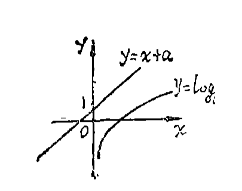
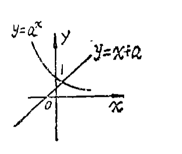
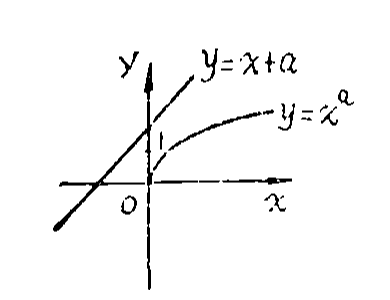
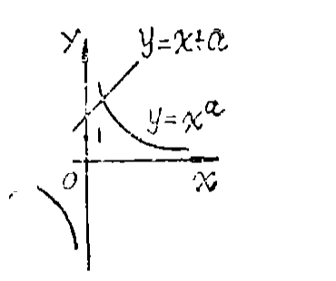
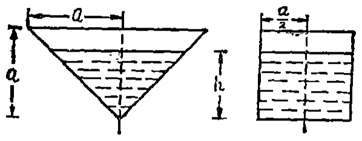
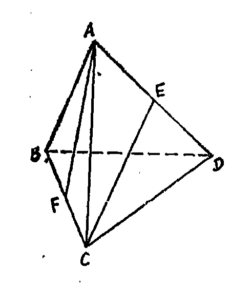

# 1988年上海卷

## 填空题

### 第 1 题

方程 $4^x-2^{x+1}-8=0$ 的解是＿＿＿＿＿＿.

#### 答案

$2$

#### 解析

令 $u=2^x>0$，则 $4^x=u^2$，$2^{x+1}=2u$. 原方程化为 $u^2-2u-8=0$，即 $(u-4)(u+2)=0$. 由于 $u>0$，只能 $u=4$，所以 $2^x=4=2^2$，解得 $x=2$.

### 第 2 题

$y=\sqrt{x-1}$ 的反函数是＿＿＿＿＿＿.

#### 答案

$y=x^2+1$（$x\geqslant0$）

#### 解析

原函数 $y=\sqrt{x-1}$ 的定义域为 $x\geqslant1$，值域为 $y\geqslant0$. 交换 $x$，$y$ 得 $x=\sqrt{y-1}$，其中 $x\geqslant0$. 两边平方，得 $x^2=y-1$，所以反函数为 $y=x^2+1$（$x\geqslant0$）.

### 第 3 题

在极坐标系中，以 $\left( \frac{a}{2},\frac{\pi}{2} \right)$ 为圆心，$\frac{a}{2}$ 为半径的圆的方程为＿＿＿＿＿＿.

#### 答案

$\rho=a\sin\theta$

#### 解析

极点为原点时，极坐标点 $\left(\frac a2,\frac\pi2\right)$ 的直角坐标为 $\left(0,\frac a2\right)$，圆的半径为 $\frac a2$. 因而圆的直角坐标方程为 $x^2+\left(y-\frac a2\right)^2=\left(\frac a2\right)^2$，即 $x^2+y^2=ay$. 代入 $x=\rho\cos\theta$，$y=\rho\sin\theta$，得 $\rho^2=a\rho\sin\theta$，故该圆的极坐标方程可写为 $\rho=a\sin\theta$.

### 第 4 题

参数方程

$$

\begin{cases}
x=1-2t,\\
y=2t^2-t
\end{cases}

$$

（$t$ 为参数）化为普通方程是＿＿＿＿＿＿.

#### 答案

$y=\frac{x^2-x}{2}$

#### 解析

由 $x=1-2t$ 得 $t=\frac{1-x}{2}$. 代入 $y=2t^2-t$，得

$$

y=2\left(\frac{1-x}{2}\right)^2-\frac{1-x}{2}=\frac{(1-x)^2-(1-x)}2=\frac{x^2-x}{2}

$$

因此普通方程为 $y=\frac{x^2-x}{2}$.

### 第 5 题

圆锥的侧面展开图是圆心角为 $216^\circ$ 的扇形，则此圆锥的轴截面的半顶角的正弦是＿＿＿＿＿＿.

#### 答案

$\frac{3}{5}$

#### 解析

设圆锥侧面展开扇形的半径（即圆锥母线）为 $l$，圆锥底面半径为 $r$. 扇形弧长等于底面圆周长，所以

$$

\frac{216^\circ}{360^\circ}\cdot2\pi l=2\pi r

$$

从而 $r=\frac35l$. 轴截面的半顶角记为 $\varphi$，在轴截面的一半中，$\sin\varphi=\frac rl$，故 $\sin\varphi=\frac35$.

### 第 6 题

$\displaystyle\lim_{n\to\infty}\frac{(-2)^{n+1}}{1-2+4-\cdots+(-2)^{n-1}}=$＿＿＿＿＿＿.

#### 答案

$6$

#### 解析

分母是首项为 $1$，公比为 $-2$ 的等比数列前 $n$ 项和，因此

$$

1-2+4-\cdots+(-2)^{n-1}=\frac{1-(-2)^n}{3}

$$

原式为

$$

\frac{3(-2)^{n+1}}{1-(-2)^n}=\frac{6}{1-(-2)^{-n}}

$$

当 $n\to\infty$ 时，$(-2)^{-n}\to0$，所以极限为 $6$.

### 第 7 题

函数 $y=\cos\left( \frac{\pi}{2}x \right)\cos\left[ \frac{\pi}{2}(x-1) \right]$ 的最小正周期是＿＿＿＿＿＿.

#### 答案

$2$

#### 解析

令 $u=\frac\pi2x$，则 $\frac\pi2(x-1)=u-\frac\pi2$，从而

$$

y=\cos u\cos\left(u-\frac\pi2\right)=\cos u\sin u=\frac12\sin(2u)=\frac12\sin(\pi x)

$$

函数 $\sin(\pi x)$ 的周期为 $2$，且平移 $1$ 后函数值变为相反数，所以不存在更小的正周期. 因此最小正周期为 $2$.

### 第 8 题

在 $(1+x)^n$ 的展开式中，若第三项和第六项的系数相等，则 $n=$＿＿＿＿＿＿.

#### 答案

$7$

#### 解析

展开式的第三项和第六项分别为 $\mathrm C_n^2x^2$ 与 $\mathrm C_n^5x^5$，故题设给出 $\mathrm C_n^2=\mathrm C_n^5$，且第六项存在要求 $n\geqslant5$. 因此

$$

\frac{n(n-1)}2=\frac{n(n-1)(n-2)(n-3)(n-4)}{120}

$$

约去正因子 $n(n-1)$，得 $(n-2)(n-3)(n-4)=60$. 当 $n=6$ 时左边为 $24$，当 $n=7$ 时左边为 $60$，而 $n\geqslant5$ 时左边随 $n$ 严格增大，所以 $n=7$.

### 第 9 题

到椭圆 $\frac{x^2}{25}+\frac{y^2}{9}=1$ 右焦点的距离与直线 $x=6$ 的距离相等的点的轨迹方程是＿＿＿＿＿＿.

#### 答案

$y^2=-4(x-5)$

#### 解析

椭圆的半长轴、半短轴分别为 $5$，$3$，故焦距参数满足 $c=\sqrt{5^2-3^2}=4$，右焦点为 $F(4,0)$. 设动点为 $P(x,y)$. 由题意，

$$

\sqrt{(x-4)^2+y^2}=|x-6|

$$

两边均非负，平方后得 $(x-4)^2+y^2=(x-6)^2$，整理为 $y^2=-4x+20=-4(x-5)$. 这正是所求轨迹方程.

### 第 10 题

从 $6$ 个运动员中选出 $4$ 人参加 $4\times100\text{ 米}$接力赛，如果甲，乙两人都不能跑第一棒，那末共有＿＿＿＿＿＿ 种不同的参赛方案（要求结果用数字表达）.

#### 答案

$240$

#### 解析

第一棒不能由甲、乙承担，所以第一棒有 $4$ 种选法. 确定第一棒运动员后，从其余 $5$ 人中选出另外 $3$ 人并按第二至第四棒排列，有 $\mathrm A_5^3=5\times4\times3$ 种. 因而不同参赛方案数为

$$

4\mathrm A_5^3=4\times5\times4\times3=240

$$

## 单选题

### 第 11 题

方程 $x^4-y^4-4x^2+4y^2=0$ 所表示的曲线是（）

A.  
双曲线和一个圆

B.  
两条相交直线

C.  
两条平行直线和一个圆

D.  
两条相交直线和一个圆

#### 答案

D

#### 解析

将方程因式分解：

$$

x^4-y^4-4x^2+4y^2=(x^2-y^2)(x^2+y^2-4)

$$

所以曲线由 $x^2-y^2=0$ 和 $x^2+y^2=4$ 组成，即两条相交直线 $y=x$，$y=-x$ 与圆 $x^2+y^2=4$. 故选 D.

### 第 12 题

在 $\left[ -1,\frac{3}{2} \right]$ 上与函数 $y=x$ 相同的函数是（）

A.  
$y=\arccos(\cos x)$

B.  
$y=\arcsin(\sin x)$

C.  
$y=\sin(\arcsin x)$

D.  
$y=\cos(\arccos x)$

#### 答案

B

#### 解析

在 $x\in[-1,\frac32]$ 上，因 $-\frac\pi2<-1\leqslant x\leqslant\frac32<\frac\pi2$，有 $\arcsin(\sin x)=x$，所以第二项与 $y=x$ 的图象相同. 第一项在负数 $x$ 上有 $\arccos(\cos x)=-x\ne x$；第三、四项的定义域分别只覆盖 $[-1,1]$，不能覆盖给定区间. 故选 B.

### 第 13 题

函数 $y=\frac{1+a^x}{1-a^x}$（$a>0$，$a\ne1$）（）

A.  
是奇函数

B.  
是偶函数

C.  
既是奇函数，又是偶函数

D.  
是非奇非偶函数

#### 答案

A

#### 解析

函数定义域为 $x\ne0$，因为 $a^x=1$ 当且仅当 $x=0$. 对任意 $x\ne0$，

$$

f(-x)=\frac{1+a^{-x}}{1-a^{-x}}=\frac{a^x+1}{a^x-1}=-\frac{1+a^x}{1-a^x}=-f(x)

$$

因此函数是奇函数. 它不可能是偶函数，因为例如 $f(1)\ne0$ 而 $f(-1)=-f(1)$. 故选 A.

### 第 14 题

$|x|\leqslant2$ 是 $|x+1|<1$ 的（）

A.  
必要不充分条件

B.  
充分不必要条件

C.  
充分必要条件

D.  
既不充分也不必要条件

#### 答案

A

#### 解析

条件 $P:|x|\leqslant2$ 的解集为 $[-2,2]$，条件 $Q:|x+1|<1$ 的解集为 $(-2,0)$. 显然 $(-2,0)\subset[-2,2]$，所以 $Q$ 是 $P$ 的充分条件，即 $P$ 是 $Q$ 的必要条件. 但 $P$ 的解集不包含于 $Q$，例如 $x=1$ 满足 $P$ 而不满足 $Q$，所以不是充分条件. 故选 A.

### 第 15 题

下列命题中错误的是（）

A.  
若一直线垂直于一平面，则此直线必垂直于这平面上所有直线

B.  
若一个平面通过另一个平面的一条垂线，则这两个平面互相垂直

C.  
若一直线垂直于一个平面的一条垂线，则此直线平行于这个平面

D.  
若平面内的一条直线和这个平面的一条斜线的射影垂直，则它也和这条斜线垂直

#### 答案

C

#### 解析

第一项是直线垂直平面的定义所给出的性质；第二项中的平面含有另一平面的垂线，按两平面垂直的判定定理，两平面互相垂直；第四项是斜线与平面内直线垂直的逆定理，均正确.

第三项不成立. 例如取平面为 $z=0$，取该平面的一条垂线为 $z$ 轴，取 $x$ 轴作为所述直线. $x$ 轴垂直于 $z$ 轴，但 $x$ 轴在平面 $z=0$ 内，并不平行于该平面. 因此错误命题是第三项，故选 C.

### 第 16 题

若 $\sin\alpha=\frac{5}{13}$，$\alpha$ 为第二象限角，则 $\tan\frac{\alpha}{2}$ 的值为（）

A.  
$\frac{1}{5}$

B.  
$5$

C.  
$-5$

D.  
$-\frac{1}{5}$

#### 答案

B

#### 解析

由于 $\alpha$ 为第二象限角，$\cos\alpha<0$. 由 $\sin\alpha=\frac5{13}$ 得

$$

\cos\alpha=-\sqrt{1-\sin^2\alpha}=-\frac{12}{13}

$$

半角公式给出

$$

\tan\frac\alpha2=\frac{\sin\alpha}{1+\cos\alpha}=\frac{\frac5{13}}{1-\frac{12}{13}}=5

$$

故选 B.

### 第 17 题

在半径为 $a$ 的球中，高为 $\frac{2}{3}a$ 的球冠面积与整个球面面积之和为（）

A.  
$\frac{8}{3}\pi a^2$

B.  
$\frac{10}{3}\pi a^2$

C.  
$\frac{14}{3}\pi a^2$

D.  
$\frac{16}{3}\pi a^2$

#### 答案

D

#### 解析

半径为 $a$ 的球，高为 $h$ 的球冠面积为 $2\pi ah$. 取 $h=\frac23a$，球冠面积为 $2\pi a\cdot\frac23a=\frac43\pi a^2$. 整个球面面积为 $4\pi a^2$，所以两者之和为

$$

\frac43\pi a^2+4\pi a^2=\frac{16}{3}\pi a^2

$$

故选 D.

### 第 18 题

下列函数图象中正确的是（）

A.  

B.  

C.  

D.  

#### 答案

B

#### 解析

逐项核对图中的定义域、单调性、截距和渐近线. 第一幅图中直线 $y=x+a$ 的纵截距标为 $1$，这将迫使 $a=1$，但 $y=\log_a x$ 要求 $a>0$ 且 $a\ne1$，故第一项错误. 第三幅图中直线的纵截距对应 $a>1$，而图示 $y=x^a$ 却为凹向下曲线；凹向下要求 $0<a<1$，故第三项错误. 第四幅图中直线的纵截距为正，即 $a>0$，但图示 $y=x^a$ 在正半轴上递减；对 $a>0$，有 $\dfrac{\mathrm d}{\mathrm dx}x^a=ax^{a-1}>0$（$x>0$），所以第四项错误.

第二幅图与 $0<a<1$ 时的性质一致：$y=a^x>0$，过点 $(0,1)$，单调递减且以 $y=0$ 为水平渐近线；直线 $y=x+a$ 斜率为 $1$，纵截距 $a\in(0,1)$. 因而正确图象为第二项，故选 B.

### 第 19 题

下列关系中正确的是（）

A.  
$\left( \frac{1}{2} \right)^{\frac{2}{3}}<\left( \frac{1}{5} \right)^{\frac{2}{3}}<\left( \frac{1}{2} \right)^{\frac{1}{3}}$

B.  
$\left( \frac{1}{2} \right)^{\frac{1}{3}}<\left( \frac{1}{2} \right)^{\frac{2}{3}}<\left( \frac{1}{5} \right)^{\frac{2}{3}}$

C.  
$\left( \frac{1}{5} \right)^{\frac{1}{3}}<\left( \frac{1}{2} \right)^{\frac{1}{3}}<\left( \frac{1}{2} \right)^{\frac{2}{3}}$

D.  
$\left( \frac{1}{5} \right)^{\frac{2}{3}}<\left( \frac{1}{2} \right)^{\frac{2}{3}}<\left( \frac{1}{2} \right)^{\frac{1}{3}}$

#### 答案

D

#### 解析

令 $u=\left(\frac12\right)^{1/3}$，$v=\left(\frac15\right)^{1/3}$. 因为 $0<\frac15<\frac12<1$，所以 $0<v<u<1$. 对 $0<t<1$，有 $t^2<t$，且平方保持正数大小关系. 因而

$$

v^2<u^2<u

$$

即

$$

\left(\frac15\right)^{2/3}<\left(\frac12\right)^{2/3}<\left(\frac12\right)^{1/3}

$$

故选 D.

### 第 20 题

方程 $\sin x=\lg x$ 的实数根有（）

A.  
$1$ 个

B.  
$2$ 个

C.  
$3$ 个

D.  
无穷多个

#### 答案

C

#### 解析

方程要求 $x>0$. 设 $f(x)=\sin x-\lg x$. 当 $0<x<1$ 时，$\sin x>0$，而 $\lg x<0$，故无根；$x=1$ 时 $f(1)=\sin1>0$.

在 $[1,\frac\pi2]$ 上，$\sin x\geqslant\sin1>\frac12$，且 $\lg x\leqslant\lg\frac\pi2<\lg2<\frac12$，故 $f(x)>0$. 在 $[\frac\pi2,\pi]$ 上，$\sin x$ 严格递减而 $\lg x$ 严格递增，且 $f(\frac\pi2)>0$，$f(\pi)=-\lg\pi<0$，所以恰有一个根.

在 $(\pi,2\pi)$ 上 $\sin x<0<\lg x$，无根. 在 $(2\pi,3\pi)$ 上，$f(2\pi)<0$，$f(\frac{5\pi}{2})=1-\lg\frac{5\pi}{2}>0$，$f(3\pi)=-\lg(3\pi)<0$. 先看 $(2\pi,\frac{5\pi}{2})$：此时 $\sin x$ 严格递增，而 $\frac1{x^2\ln10}$ 严格递减，所以 $f''(x)=-\sin x+\frac1{x^2\ln10}$ 严格递减；又 $f''(2\pi)>0$，$f''(\frac{5\pi}{2})<0$，故 $f'$ 先增后减. 由于 $f'(2\pi)=1-\frac1{2\pi\ln10}>0$，且 $f'(\frac{5\pi}{2})=-\frac1{(5\pi/2)\ln10}<0$，$f$ 先增后减. 在递减段上，$f(x)\geqslant f(\frac{5\pi}{2})>0$，而 $f(2\pi)<0$，所以该区间恰有一个根. 在 $(\frac{5\pi}{2},3\pi)$ 上，$\cos x<0$，从而 $f'(x)=\cos x-\frac1{x\ln10}<0$，结合两端函数值知恰有一个根. 因此 $(2\pi,3\pi)$ 上恰有两个根.

当 $3\pi\leqslant x\leqslant10$ 时，$3\pi<10<\frac{7\pi}{2}$，所以 $\sin x\leqslant0<\lg x$，无根；当 $x>10$ 时，$\lg x>1\geqslant\sin x$，无根. 所以实数根总数为 $1+2=3$，故选 C.

## 解答题

### 第 21 题

已知直线 $l_1:3x-y+12=0$，$l_2:3x+2y-6=0$. 求 $l_1$，$l_2$ 和 $y$ 轴所围成的三角形面积.

#### 解析

直线 $l_1$，$l_2$ 在 $y$ 轴上的截距分别为 $12$ 和 $3$，故它们在 $y$ 轴上所截得的线段长为 $9$. 联立 $3x-y+12=0$，$3x+2y-6=0$ 得 $x=-2$. 所以所求三角形的面积为 $S_{\triangle}=\frac{1}{2}\times9\times2=9$.

### 第 22 题

设 $A=\left\{ x\mid x\geqslant\frac{1}{x},x\in\mathbb{R} \right\}$，$B=\left\{ x\mid \sqrt{2x+1}<3,x\in\mathbb{R} \right\}$. 求 $D=A\cap B$.

#### 解析

由 $x\geqslant\frac{1}{x}$ 得 $A=\left\{ x\mid -1\leqslant x<0,\text{或 }x\geqslant1,\ x\in\mathbb{R} \right\}$. 由 $\sqrt{2x+1}<3$ 得 $B=\left\{ x\mid -\frac{1}{2}\leqslant x<4,\ x\in\mathbb{R} \right\}$. 因此

$$

D=A\cap B=\left\{ x\mid -1\leqslant x<0,\text{或 }x\geqslant1 \right\}\cap\left\{ x\mid -\frac{1}{2}\leqslant x<4 \right\}=\left\{ x\mid -\frac{1}{2}\leqslant x<0,\text{或 }1\leqslant x<4 \right\}

$$

### 第 23 题

一个圆锥容器和一个圆柱形容器，它们的轴截面尺寸如图. 两容器内盛有的液体的体积正好相等，且液面高度 $h$ 正好相同. 求 $h$.

#### 解析

圆锥形容器的轴截面的底角为 $45^\circ$，故液面半径 $r=h$. 所以圆锥形容器内液体体积为 $V_{\text{锥}}=\frac{1}{3}\pi r^2h=\frac{\pi}{3}h^3$. 圆柱形容器内液体体积为 $V_{\text{柱}}=\pi\left( \frac{a}{2} \right)^2h=\frac{\pi a^2h}{4}$. 由题意 $V_{\text{锥}}=V_{\text{柱}}$，得 $\frac{\pi}{3}h^3=\frac{\pi a^2h}{4}$，解得 $h=\frac{\sqrt{3}}{2}a$.

### 第 24 题

设方程 $x^2+3\sqrt{3}x+4=0$ 的两个实根为 $x_1$，$x_2$. 记 $\alpha=\arctan x_1$，$\beta=\arctan x_2$. 求 $\alpha+\beta$.

#### 解析

由韦达定理得 $x_1+x_2=-3\sqrt{3}$，$x_1x_2=4$. 因为 $\tan\alpha=x_1$，$\tan\beta=x_2$，所以

$$

\tan(\alpha+\beta)=\frac{\tan\alpha+\tan\beta}{1-\tan\alpha\tan\beta}=\frac{x_1+x_2}{1-x_1x_2}=\sqrt{3}

$$

又因为 $x_1x_2>0$ 且 $x_1+x_2<0$，所以 $x_1<0$，$x_2<0$，从而 $\alpha$，$\beta\in\left( -\frac{\pi}{2},0 \right)$，故 $\alpha+\beta\in(-\pi,0)$. 因此 $\alpha+\beta=-\frac{2\pi}{3}$.

### 第 25 题

设 $y=\log_{\frac{1}{2}}\left[ a^{2x}+2(ab)^x-b^{2x}+1 \right]$（$a>0$，$b>0$）. 求使 $y$ 为负值的 $x$ 的取值范围.

#### 解析

要使 $y<0$，只要 $a^{2x}+2(ab)^x-b^{2x}>0$，即 $b^{2x}\left[ \left( \frac{a}{b} \right)^{2x}+2\left( \frac{a}{b} \right)^x-1 \right]>0$. 由因式分解得 $b^{2x}\left[ \left( \frac{a}{b} \right)^x+1+\sqrt{2} \right]\left[ \left( \frac{a}{b} \right)^x+1-\sqrt{2} \right]>0$. 因为 $b^{2x}>0$，$\left( \frac{a}{b} \right)^x+1+\sqrt{2}>0$，故只需 $\left( \frac{a}{b} \right)^x>\sqrt{2}-1$. 两端取对数得 $x\lg\dfrac{a}{b}>\lg(\sqrt{2}-1)$.

当 $a>b>0$ 时，$\lg\frac{a}{b}>0$，由上式得 $x>\dfrac{\lg(\sqrt{2}-1)}{\lg\frac{a}{b}}=\log_{\frac{a}{b}}(\sqrt{2}-1)$. 当 $b>a>0$ 时，$\lg\frac{a}{b}<0$，由上式得 $x<\dfrac{\lg(\sqrt{2}-1)}{\lg\frac{a}{b}}=\log_{\frac{a}{b}}(\sqrt{2}-1)$. 当 $a=b>0$ 时，$\lg\frac{a}{b}=0$，而 $\lg(\sqrt{2}-1)<0$，所以不等式恒成立，此时 $x$ 为一切实数.

### 第 26 题

在棱长都相等的四面体 $A-BCD$ 中，$E$，$F$ 分别为棱 $AD$，$BC$ 的中点，连接 $AF$，$CE$，如图所示.

1.  求异面直线 $AF$，$CE$ 所成角的大小；

2.  求 $CE$ 与底面 $BCD$ 所成角的大小（要求角的大小用反三角函数表示）.

#### 解析

1.  连接 $DF$，设 $G$ 为 $DF$ 的中点，连接 $GE$. 因为 $AE=ED$，$FG=GD$，所以 $EG\parallel AF$. 故 $\angle GEC$ 是异面直线 $AF$ 与 $CE$ 所成的角. 设棱长为 $a$. 在正三角形 $ABC$ 中，$F$ 是 $BC$ 的中点，所以 $AF\perp BC$，$AF=\dfrac{\sqrt{3}}{2}a$；在正三角形 $ACD$ 中，$E$ 是 $AD$ 的中点，所以 $CE=\dfrac{\sqrt{3}}{2}a$. 由中位线定理，$EG=\dfrac{1}{2}AF=\dfrac{\sqrt{3}}{4}a$. 在正三角形 $BCD$ 中，$F$ 是 $BC$ 的中点，故 $DF\perp BC$. 因为 $G\in DF$，$FC\subset BC$，所以 $FG\perp FC$，从而

$$

GC=\sqrt{FC^2+FG^2}=\sqrt{\frac{a^2}{4}+\frac{3a^2}{16}}=\frac{\sqrt{7}}{4}a

$$

    由余弦定理得 $\cos\angle GEC=\dfrac{EG^2+CE^2-GC^2}{2EG\cdot CE}=\dfrac{2}{3}$，所以 $\angle GEC=\arccos\dfrac{2}{3}$ 即异面直线 $AF$ 与 $CE$ 所成角的大小为 $\arccos\frac{2}{3}$.

2.  作 $EK\perp DF$，垂足为 $K$，连接 $KC$. 由正三角形 $ABC$ 和 $BCD$ 的中线性质，$AF\perp BC$，$DF\perp BC$，且 $AF$，$DF$ 是平面 $ADF$ 内相交的两条直线，所以 $BC\perp$ 平面 $ADF$. 又 $BC\subset$ 平面 $BCD$，故平面 $ADF\perp$ 平面 $BCD$. 两平面的交线为 $DF$，而 $EK$ 在平面 $ADF$ 内且 $EK\perp DF$，所以 $EK\perp$ 平面 $BCD$. 因而 $CK$ 是 $CE$ 在底面 $BCD$ 上的射影，$\angle KCE$ 是 $CE$ 与底面 $BCD$ 所成的角. 在 $\triangle AFD$ 中，$AF=FD=\dfrac{\sqrt{3}}{2}a$，所以它是以 $F$ 为顶点的等腰三角形；又 $E$ 是 $AD$ 的中点，故中线 $EF\perp AD$. 因此

$$

EF=\sqrt{FD^2-ED^2}=\sqrt{\frac{3a^2}{4}-\frac{a^2}{4}}=\frac{\sqrt{2}}{2}a

$$

    由三角形 $EFD$ 的面积分别以 $EF$，$EK$ 为高，得 $EK\cdot FD=EF\cdot ED$，所以 $EK=\frac{EF\cdot ED}{FD}=\frac{\frac{\sqrt{2}}{2}a\cdot\frac{a}{2}}{\frac{\sqrt{3}}{2}a}=\frac{\sqrt{6}}{6}a$. 于是

$$

\sin\angle KCE=\frac{EK}{CE}=\frac{\frac{\sqrt{6}}{6}a}{\frac{\sqrt{3}}{2}a}=\frac{\sqrt{2}}{3}

$$

    所以 $\angle KCE=\arcsin\dfrac{\sqrt{2}}{3}$ 即 $CE$ 与底面 $BCD$ 所成角的大小为 $\arcsin\frac{\sqrt{2}}{3}$.

### 第 27 题

复数 $z_1$，$z_2$，$z_3$ 的辐角分别为 $\alpha$，$\beta$，$\gamma$，又 $|z_1|=1$，$|z_2|=k$，$|z_3|=2-k$，且 $z_1+z_2+z_3=0$. 问 $k$ 各为何值时，$\cos(\beta-\gamma)$ 分别取得最大值和最小值，并求出最大值和最小值.

#### 解析

由 $|z_2|=k$，$|z_3|=2-k$ 且 $z_2$，$z_3$ 有辐角可知 $0<k<2$. 设 $z_1=\cos\alpha+\i\sin\alpha$，$z_2=k\cos\beta+\i k\sin\beta$，$z_3=(2-k)\cos\gamma+\i(2-k)\sin\gamma$. 由 $z_1+z_2+z_3=0$ 得 $\cos\alpha+k\cos\beta+(2-k)\cos\gamma=0$，$\sin\alpha+k\sin\beta+(2-k)\sin\gamma=0$， 即 $\cos\alpha=(k-2)\cos\gamma-k\cos\beta$，$\sin\alpha=(k-2)\sin\gamma-k\sin\beta$.

将上面两式两端平方后相加，得 $1=(k-2)^2+k^2-2(k-2)k\cos(\gamma-\beta)$. 由题设可知 $k\ne0$，$k\ne2$，所以 $\cos(\beta-\gamma)=\dfrac{(k-2)^2+k^2-1}{2k(k-2)}=1+\dfrac{3}{2(k-1)^2-2}$.

又因为 $\left| \cos(\beta-\gamma) \right|\leqslant1$，故 $-2\leqslant\dfrac{3}{2(k-1)^2-2}\leqslant0$，解得 $\dfrac{1}{2}\leqslant k\leqslant\dfrac{3}{2}$. 这些 $k$ 值也确实可行，因为三角形三边 $1$，$k$，$2-k$ 满足最大边不超过其余两边之和，且在端点处退化为共线情形.

由上式可知，当 $k=1$ 时，$\left[ \cos(\beta-\gamma) \right]_{\max}=-\dfrac{1}{2}$；当 $k=\dfrac{1}{2}$ 或 $k=\dfrac{3}{2}$ 时，$\left[ \cos(\beta-\gamma) \right]_{\min}=-1$. 所以 $\cos(\beta-\gamma)$ 的最大值为 $-\dfrac{1}{2}$，在 $k=1$ 时取得；最小值为 $-1$，在 $k=\dfrac{1}{2}$ 或 $k=\dfrac{3}{2}$ 时取得.

### 第 28 题

在双曲线 $\frac{y^2}{12}-\frac{x^2}{13}=1$ 的一支上不同的三点 $A(x_1,y_1)$，$B(\sqrt{26},6)$，$C(x_2,y_2)$ 与焦点 $F(0,5)$ 的距离成等差数列.

1.  求 $y_1+y_2$；

2.  证明线段 $AC$ 的垂直平分线经过某一定点，并求该定点的坐标.

#### 解析

1.  双曲线的方程可写为 $x^2=\dfrac{13}{12}(y^2-12)$. 因为 $A$，$B$，$C$ 在同一上支上，所以 $y_1$，$y_2\geqslant\sqrt{12}$. 对上支上的点 $P(x,y)$，

$$

PF^2=x^2+(y-5)^2=\frac{13y^2-156}{12}+y^2-10y+25=\frac{(5y-12)^2}{12}

$$

    由于 $5y-12>0$，所以 $PF=\dfrac{5y-12}{\sqrt{12}}$. 因而 $AF=\frac{5y_1-12}{\sqrt{12}}$，$CF=\frac{5y_2-12}{\sqrt{12}}$. 又 $BF=\sqrt{(\sqrt{26}-0)^2+(6-5)^2}=3\sqrt{3}$. 由 $AF$，$BF$，$CF$ 成等差数列，

$$

\frac{5y_1-12}{\sqrt{12}}+\frac{5y_2-12}{\sqrt{12}}=2\cdot3\sqrt{3}

$$

    解得 $y_1+y_2=12$.

2.  由第（1）问，若 $y_1=y_2$，则 $y_1=y_2=6$. 在双曲线的上支上，给定 $y=6$ 时只有两个点 $(\sqrt{26},6)$ 和 $(-\sqrt{26},6)$，其中一个是 $B$，这与 $A$，$B$，$C$ 互不相同矛盾. 因此 $y_1\ne y_2$. 线段 $AC$ 的中点为 $\left( \dfrac{x_1+x_2}{2},6 \right)$，故它的垂直平分线 $l$ 的方程为 $y-6=-\dfrac{x_1-x_2}{y_1-y_2}\left( x-\dfrac{x_1+x_2}{2} \right)$. 设 $l$ 与 $y$ 轴的交点为 $D(0,y_0)$，则 $y_0-6=\dfrac{x_1^2-x_2^2}{2(y_1-y_2)}$. 因为 $A(x_1,y_1)$，$C(x_2,y_2)$ 在双曲线上，所以 $x_1^2=\dfrac{13}{12}(y_1^2-12)$，$x_2^2=\dfrac{13}{12}(y_2^2-12)$. 因此

$$

x_1^2-x_2^2=\frac{13}{12}(y_1^2-y_2^2)=\frac{13}{12}(y_1+y_2)(y_1-y_2)=13(y_1-y_2)

$$

    代入上式得 $y_0-6=\dfrac{13}{2}$，所以 $y_0=\dfrac{25}{2}$. 因为 $y_0$ 的值与 $A$，$C$ 点的坐标无关，所以 $D$ 为定点，即线段 $AC$ 的垂直平分线经过定点 $D\left( 0,\dfrac{25}{2} \right)$.
