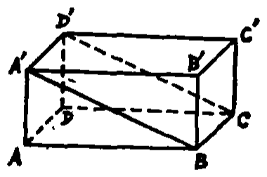
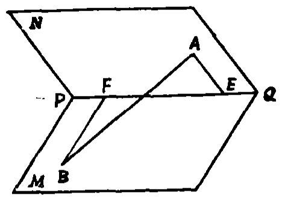
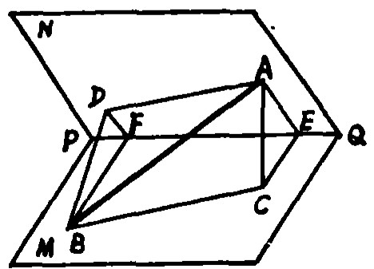
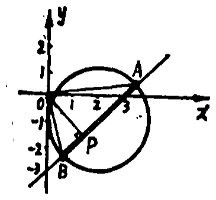
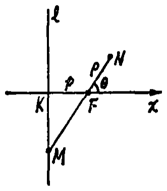
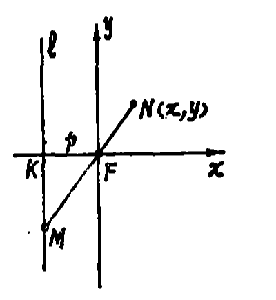

# 1989年上海卷

## 填空题

### 第 1 题

若点 $P(1,a)$ 在曲线 $x^2+2xy-5y=0$ 上，则 $a=$＿＿＿＿＿＿.

#### 答案

$\frac{1}{3}$

#### 解析

将点 $P(1,a)$ 代入曲线方程，得 $1+2a-5a=0$，即 $1-3a=0$，所以 $a=\frac{1}{3}$.

### 第 2 题

计算 $2\left( \cos \frac{\pi}{3}+\i \sin \frac{\pi}{3} \right)^5\div \sqrt{2}\left( \cos \frac{\pi}{6}+\i \sin \frac{\pi}{6} \right)=$＿＿＿＿＿＿（$\i$ 为虚数单位）.

#### 答案

$-\sqrt{2}\i$

#### 解析

由棣莫弗定理，先将分子化为

$$

2\left(\cos\frac{5\pi}{3}+\i\sin\frac{5\pi}{3}\right)

$$

再利用复数三角形式的除法公式，原式等于

$$

\frac{2\left(\cos\frac{5\pi}{3}+\i\sin\frac{5\pi}{3}\right)}{\sqrt{2}\left(\cos\frac{\pi}{6}+\i\sin\frac{\pi}{6}\right)}
=\sqrt{2}\left(\cos\left(\frac{5\pi}{3}-\frac{\pi}{6}\right)+\i\sin\left(\frac{5\pi}{3}-\frac{\pi}{6}\right)\right)
=\sqrt{2}\left(\cos\frac{3\pi}{2}+\i\sin\frac{3\pi}{2}\right)=-\sqrt{2}\i

$$

因此填 $-\sqrt{2}\i$.

### 第 3 题

三角方程 $\cos\left( \frac{x}{2}+\frac{\pi}{3} \right)=-\frac{1}{2}$ 的解集是＿＿＿＿＿＿.

#### 答案

$\left\{x\mid x=4k\pi+\frac{2\pi}{3}\text{\ 或\ }x=4k\pi-2\pi,\ k\in\mathbb{Z}\right\}$

#### 解析

令 $t=\frac{x}{2}+\frac{\pi}{3}$. 由 $\cos t=-\frac{1}{2}$，得 $t=2k\pi+\frac{2\pi}{3}$ 或 $t=2k\pi-\frac{2\pi}{3}$，其中 $k\in\mathbb{Z}$. 因而分别有 $x=4k\pi+\frac{2\pi}{3}$ 或 $x=4k\pi-2\pi$，这就是所求解集.

### 第 4 题

侧棱长为 $3 \mathrm{~cm}$，底面边长为 $4 \mathrm{~cm}$ 的正四棱锥的体积为＿＿＿＿＿＿$\mathrm{cm}^3$.

#### 答案

$\frac{16}{3}$

#### 解析

设正四棱锥的高为 $h$，底面中心为 $O$，底面边长为 $4$. 由正方形对角线，$O$ 到任一底面顶点的距离为 $\frac{4\sqrt{2}}{2}=2\sqrt{2}$. 由勾股定理，$h=\sqrt{3^2-(2\sqrt{2})^2}=1$. 所以体积为 $\frac{1}{3}\cdot4^2\cdot1=\frac{16}{3}$，即填 $\frac{16}{3}$.

### 第 5 题

函数 $y=x^{-2/3}$ 的递增区间是＿＿＿＿＿＿.

#### 答案

$(-\infty,0)$

#### 解析

函数定义域为 $x\neq0$，且 $y'=-\frac{2}{3}x^{-5/3}$. 当 $x<0$ 时，$x^{-5/3}<0$，故 $y'>0$；当 $x>0$ 时，$y'<0$. 因此函数的递增区间为 $(-\infty,0)$.

### 第 6 题

已知长方体 $ABCD-A'B'C'D'$ 中，棱 $AA'=5$，$AB=12$，那么直线 $B'C'$ 和平面 $A'BCD'$ 的距离是＿＿＿＿＿＿.

#### 答案

$\frac{60}{13}$

#### 解析

建立直角坐标系，取 $A(0,0,0)$，$B(12,0,0)$，$C(12,b,0)$，$D(0,b,0)$，并令 $AA'=5$. 则可取 $A'(0,0,5)$，$B'(12,0,5)$，$C'(12,b,5)$，$D'(0,b,5)$. 平面 $A'BCD'$ 的一个法向量为 $\overrightarrow{A'B}\times\overrightarrow{A'D'}=(5b,0,12b)$，所以其方程为 $5x+12z-60=0$. 直线 $B'C'$ 的方向为 $(0,1,0)$，与该法向量垂直，故直线 $B'C'$ 平行于平面 $A'BCD'$. 取 $B'$ 为直线上一点，点到平面的距离为 $\frac{|5\cdot12+12\cdot5-60|}{\sqrt{5^2+12^2}}=\frac{60}{13}$. 因此填 $\frac{60}{13}$.

### 第 7 题

方程 $\log_2(x-3)=\log_6(5-x)$ 的解是＿＿＿＿＿＿.

#### 答案

$x=4$

#### 解析

定义域要求 $3<x<5$. 在此区间内，函数 $\log_2(x-3)$ 随 $x$ 严格增加，而 $\log_6(5-x)$ 随 $x$ 严格减少. 代入 $x=4$ 得两边均为 $0$，所以等式成立；由于一边增加、另一边减少，解不可能超过一个，故唯一解为 $x=4$.

### 第 8 题

已知 $\sin \alpha=\frac{1}{3}$，$2\pi<\alpha<3\pi$，那么 $\sin \frac{\alpha}{2}+\cos \frac{\alpha}{2}=$＿＿＿＿＿＿.

#### 答案

$-\frac{2}{3}\sqrt{3}$

#### 解析

因 $\sin\alpha=\frac{1}{3}>0$ 且 $2\pi<\alpha<3\pi$，所以 $2\pi<\alpha<\frac{5\pi}{2}$. 从而 $\pi<\frac{\alpha}{2}<\frac{5\pi}{4}$，故 $\sin\frac{\alpha}{2}<0$，$\cos\frac{\alpha}{2}<0$. 于是 $\left(\sin\frac{\alpha}{2}+\cos\frac{\alpha}{2}\right)^2=1+2\sin\frac{\alpha}{2}\cos\frac{\alpha}{2}=1+\sin\alpha=\frac{4}{3}$. 结合和为负，得到 $\sin\frac{\alpha}{2}+\cos\frac{\alpha}{2}=-\frac{2\sqrt{3}}{3}$.

### 第 9 题

计算 $\displaystyle\lim_{n\to\infty}\left( \frac{1}{n^2}+\frac{4}{n^2}+\frac{7}{n^2}+\dots+\frac{3n-2}{n^2} \right)=$＿＿＿＿＿＿.

#### 答案

$\frac{3}{2}$

#### 解析

括号内共有 $n$ 项，分子依次为首项 $1$、公差 $3$ 的等差数列，末项为 $3n-2$. 因而 $\frac{1}{n^2}+\frac{4}{n^2}+\cdots+\frac{3n-2}{n^2}=\frac{n\left(1+3n-2\right)}{2n^2}=\frac{3n-1}{2n}$. 令 $n\to\infty$，极限为 $\frac{3}{2}$.

### 第 10 题

抛物线 $y=4x^2-4x$ 的准线方程是＿＿＿＿＿＿.

#### 答案

$y=-\frac{17}{16}$

#### 解析

配方得 $y=4\left(x-\frac{1}{2}\right)^2-1$，即 $\left(x-\frac{1}{2}\right)^2=\frac{1}{4}(y+1)$. 与标准方程 $(x-h)^2=4p(y-k)$ 比较，得 $h=\frac{1}{2}$，$k=-1$，$4p=\frac{1}{4}$，所以 $p=\frac{1}{16}$. 抛物线的准线为 $y=k-p=-1-\frac{1}{16}=-\frac{17}{16}$.

## 单选题

### 第 11 题

若 $\alpha$ 是第四象限的角，则 $\pi-\alpha$ 是（）

A.  
第一象限的角

B.  
第二象限的角

C.  
第三象限的角

D.  
第四象限的角

#### 答案

C

#### 解析

若 $\alpha=2k\pi+\theta$，其中 $\frac{3\pi}{2}<\theta<2\pi$，则 $\pi-\alpha$ 与 $\pi-\theta$ 同终边. 因为 $-\pi<\pi-\theta<-\frac{\pi}{2}$，加上 $2\pi$ 后落在第三象限，故选 C.

### 第 12 题

以点 $A(-5,4)$ 为圆心，且与 $x$ 轴相切的圆的标准方程是（）

A.  
$(x+5)^2+(y-4)^2=16$

B.  
$(x-5)^2+(y+4)^2=16$

C.  
$(x+5)^2+(y-4)^2=25$

D.  
$(x-5)^2+(y+4)^2=25$

#### 答案

A

#### 解析

圆心到 $x$ 轴的距离为 $4$，所以圆的半径为 $4$. 圆的方程为 $(x+5)^2+(y-4)^2=4^2=16$，故选 A.

### 第 13 题

若 $a<b<0$，则下列不等关系中不能成立的是（）

A.  
$\frac{1}{a}>\frac{1}{b}$

B.  
$\frac{1}{a-b}>\frac{1}{a}$

C.  
$|a|>|b|$

D.  
$a^2>b^2$

#### 答案

B

#### 解析

由 $a<b<0$ 得 $a-b>a$，且两者都为负数. 取倒数时不等号反向，所以恒有 $\frac{1}{a-b}<\frac{1}{a}$，选项 B 的不等关系不能成立. 又因为 $a<b<0$，所以 $|a|=-a>-b=|b|$，平方后仍有 $a^2>b^2$；同时倒数时不等号反向得 $\frac{1}{a}>\frac{1}{b}$. 因此其余三项均能成立，故选 B.

### 第 14 题

两排座位，第一排有 $3$ 个座位，第二排有 $5$ 个座位，若 $8$ 名学生入座（每人一个座位），则不同坐法的种数是（）

A.  
$\mathrm C_8^5 \mathrm C_8^3$

B.  
$\mathrm A_2^1 \mathrm C_8^5 \mathrm C_8^3$

C.  
$\mathrm A_8^5 \mathrm A_8^3$

D.  
$\mathrm A_8^8$

#### 答案

D

#### 解析

8 名学生和 8 个座位均可区分，给 8 名学生安排座位就是对 8 个座位作全排列，共有 $\mathrm A_8^8=8!$ 种坐法，故选 D.

### 第 15 题

设 $z_1$，$z_2$ 为复数，那么 $z_1^2+z_2^2=0$ 是 $z_1$，$z_2$ 同时为零的（）

A.  
充分不必要条件

B.  
必要不充分条件

C.  
充分必要条件

D.  
既不充分又不必要条件

#### 答案

B

#### 解析

若 $z_1=z_2=0$，显然有 $z_1^2+z_2^2=0$，所以方程 $z_1^2+z_2^2=0$ 是两数同时为零的必要条件. 但取 $z_1=1$，$z_2=\i$，也有 $z_1^2+z_2^2=1-1=0$，而两数并非同时为零，因此不是充分条件，故选 B.

### 第 16 题

下面四个函数中为奇函数的是（）

A.  
$y=x^2\sin\left( x+\frac{\pi}{2} \right)$

B.  
$y=x^2\cos\left( x+\frac{\pi}{4} \right)$

C.  
$y=\cos(\operatorname{arccot} x)$

D.  
$y=\operatorname{arccot}(\sin x)$

#### 答案

C

#### 解析

选项 A 中 $x^2$ 与 $\cos x$ 都是偶函数，故积为偶函数而不是奇函数. 选项 B 展开为 $\frac{\sqrt{2}}{2}x^2(\cos x-\sin x)$，同时含有偶、奇两部分，不是奇函数. 对选项 C，按 $\operatorname{arccot}x\in(0,\pi)$ 取值，有 $\cos(\operatorname{arccot}x)=\frac{x}{\sqrt{1+x^2}}$，这是奇函数. 选项 D 满足 $\operatorname{arccot}(-u)=\pi-\operatorname{arccot}u$，所以 $f(-x)=\pi-f(x)$. 例如 $x=\frac{\pi}{2}$ 时，$f(x)=\frac{\pi}{4}$，而 $f(-x)=\frac{3\pi}{4}\ne-\frac{\pi}{4}=-f(x)$，故选项 D 不是奇函数. 所以选 C.

### 第 17 题

下列四个命题中的真命题是（）

A.  
若直线 $l$ 与平面 $\alpha$ 内两条平行直线垂直，则 $l\perp \alpha$

B.  
若平面 $\alpha$ 内两条直线与平面 $\beta$ 内两条直线分别平行，则 $\alpha\parallel \beta$

C.  
若平面 $\alpha$ 与直二面角 $\beta-MN-\gamma$ 的棱 $MN$ 交于点 $A$，与二面角的面 $\beta$，面 $\gamma$ 分别交于 $AB$，$AC$，则 $\angle BAC\leqslant 90^\circ$

D.  
以上三个命题都是假命题

#### 答案

D

#### 解析

命题甲不成立：在平面 $z=0$ 内取两条平行于 $x$ 轴的直线 $y=0$ 和 $y=1$，取直线 $l:(x,y,z)=(0,t,0)$. 直线 $l$ 分别与这两条直线相交且垂直，但 $l$ 在平面 $z=0$ 内，故不垂直于该平面，所以不能推出 $l\perp\alpha$. 命题乙不成立：取 $\alpha:z=0$，$\beta:y=0$，两平面相交；分别在其中取两条方向均平行于 $x$ 轴的平行直线，仍满足题设条件. 命题丙也不成立：取两个互相垂直的面 $y=0$ 和 $x=0$，棱为 $z$ 轴，截面取平面 $z=x-y$. 令 $A=(0,0,0)$，$B=(1,0,1)$，$C=(0,1,-1)$，则 $AB$ 与 $AC$ 分别在两个面内，且 $\cos\angle BAC=\frac{\overrightarrow{AB}\cdot\overrightarrow{AC}}{|AB||AC|}=-\frac{1}{2}$，所以 $\angle BAC=120^\circ>90^\circ$. 三个命题均为假命题，故选 D.

### 第 18 题

要得到函数 $y=\cos\left( 2x-\frac{\pi}{4} \right)$ 的图象，只需将函数 $y=\sin 2x$ 的图象（）

A.  
向左平移 $\frac{\pi}{8}$ 个单位

B.  
向右平移 $\frac{\pi}{8}$ 个单位

C.  
向左平移 $\frac{\pi}{4}$ 个单位

D.  
向右平移 $\frac{\pi}{4}$ 个单位

#### 答案

A

#### 解析

利用 $\cos u=\sin\left(u+\frac{\pi}{2}\right)$，有 $\cos\left(2x-\frac{\pi}{4}\right)=\sin\left(2x+\frac{\pi}{4}\right)=\sin\left(2\left(x+\frac{\pi}{8}\right)\right)$. 因此将 $y=\sin2x$ 的图象向左平移 $\frac{\pi}{8}$ 个单位，故选 A.

### 第 19 题

设直角 $\triangle ABC$ 的直角边 $BC=a$，$AC=b$，斜边 $AB=c$，且 $a<b$，现分别以直线 $BC$，$AC$ 和 $AB$ 为轴将直角三角形绕轴旋转一周，所得的三个旋转体的体积分别记为 $V_1$，$V_2$ 和 $V_3$，那么 $V_1$，$V_2$ 和 $V_3$ 间的大小关系是（）

A.  
$V_3>V_1>V_2$

B.  
$V_1>V_2>V_3$

C.  
$V_1>V_3>V_2$

D.  
$V_2>V_1>V_3$

#### 答案

B

#### 解析

绕直角边 $BC$ 旋转所得圆锥的底面半径为 $b$，高为 $a$，所以 $V_1=\frac{1}{3}\pi b^2a$. 同理，绕 $AC$ 旋转所得圆锥的体积为 $V_2=\frac{1}{3}\pi a^2b$. 因为 $a<b$，所以 $V_1>V_2$.

设从直角顶点 $C$ 向斜边 $AB$ 作高，足为 $H$，则 $CH=\frac{ab}{c}$. 绕 $AB$ 旋转时得到两个以 $CH$ 为公共底面半径的圆锥，两个高之和为 $AB=c$，故 $V_3=\frac{1}{3}\pi\left(\frac{ab}{c}\right)^2c=\frac{1}{3}\pi\frac{a^2b^2}{c}$. 于是 $\frac{V_3}{V_2}=\frac{b}{c}<1$，即 $V_2>V_3$. 所以 $V_1>V_2>V_3$，故选 B.

### 第 20 题

下列参数方程（$t$ 是参数）中与方程 $y^2=x$ 表示同一曲线的是（）

A.  
$\left\{\begin{aligned}x&=t,\\ y&=t^2\end{aligned}\right.$

B.  
$\left\{\begin{aligned}x&=\sin^2 t,\\ y&=\sin t\end{aligned}\right.$

C.  
$\left\{\begin{aligned}x&=t,\\ y&=\sqrt{|t|}\end{aligned}\right.$

D.  
$\left\{\begin{aligned}x&=\frac{1-\cos 2t}{1+\cos 2t},\\ y&=\tan t\end{aligned}\right.$

#### 答案

D

#### 解析

逐项消去参数检验. 第一项给出 $y=t^2$，因而 $y=x^2$，不是 $y^2=x$. 第二项虽满足 $y^2=x$，但 $y=\sin t$ 只能取 $[-1,1]$，只得到原曲线的一部分. 第三项给出 $y^2=|t|=|x|$，也不是所给曲线. 第四项中在分母不为零时，$x=\frac{1-\cos2t}{1+\cos2t}=\tan^2t$，而 $y=\tan t$，所以恒有 $y^2=x$. 反过来，对曲线上任意一点 $(x,y)$，取满足 $\tan t=y$ 的参数即可得到该点，且 $\tan t$ 的值域为 $\mathbb R$，故第四项表示整条曲线，选 D.

## 解答题

### 第 21 题

求 $\cos\left( 2\arctan\sqrt{6}+\frac{\pi}{3} \right)$ 的值.

#### 解析

设 $\theta=\arctan\sqrt{6}$，则 $\tan\theta=\sqrt{6}$. 计算得 $\cos 2\theta=\frac{1-\tan^2\theta}{1+\tan^2\theta}=-\frac{5}{7}$，$\sin 2\theta=\frac{2\tan\theta}{1+\tan^2\theta}=\frac{2\sqrt{6}}{7}$. 所以 $\cos\left( 2\arctan\sqrt{6}+\frac{\pi}{3} \right)=\cos 2\theta \cos \frac{\pi}{3}-\sin 2\theta \sin \frac{\pi}{3}=-\frac{5+6\sqrt{2}}{14}$.

### 第 22 题

求函数 $y=\sqrt{2+\log_{1/2}x}+\sqrt{\tan x}$ 的定义域.

#### 解析

解不等式组 $\left\{\begin{aligned}2+\log_{1/2}x&\geqslant 0,\\ \tan x&\geqslant 0\end{aligned}\right.$. 由第一式得 $0<x\leqslant 4$；由第二式得 $k\pi\leqslant x<k\pi+\frac{\pi}{2}$，$k\in\mathbb{Z}$. 所以函数 $y$ 的定义域为 $\left( 0,\frac{\pi}{2} \right)\cup [\pi,4]$.

### 第 23 题

在直角坐标系 $xOy$ 中，过点 $P(-3,4)$ 的直线 $l$ 与直线 $OP$ 的夹角为 $45^\circ$，求直线 $l$ 的方程.

#### 解析

若 $l$ 为竖直直线，则其方向向量可取 $(0,1)$，而 $OP$ 的方向向量为 $(-3,4)$，两直线夹角的余弦为 $\frac{4}{5}\ne\frac{\sqrt{2}}{2}$，故 $l$ 不可能是竖直直线. 设直线 $l$ 的斜率为 $k$. 直线 $OP$ 的斜率 $k_{OP}=-\frac{4}{3}$. 按题意，有 $\left| \frac{k+4/3}{1-4k/3} \right|=1$，即 $3k+4=\pm(3-4k)$. 解得 $k_1=-\frac{1}{7}$，$k_2=7$. 故所求直线方程是 $x+7y-25=0$ 和 $7x-y+25=0$.

### 第 24 题

在 $(1-x^2)^{20}$ 的展开式中，如果第 $4r$ 项和第 $r+2$ 项的二项式系数相等，

1.  求 $r$ 的值；

2.  写出展开式中的第 $4r$ 项和第 $r+2$ 项.

#### 解析

1.  展开式中第 $4r$ 项的二项式系数为 $\mathrm C_{20}^{4r-1}$，第 $r+2$ 项的二项式系数为 $\mathrm C_{20}^{r+1}$. 根据二项式系数的性质，当且仅当 $4r-1=r+1$ 或 $(4r-1)+(r+1)=20$ 时，它们的二项式系数相等. 解得 $r=\frac{2}{3}$（不合题意，舍去），或 $r=4$.

2.  当 $r=4$ 时，第 $4r$ 项是 $T_{16}=\mathrm C_{20}^{15}\left( -x^2 \right)^{15}=-15504x^{30}$，第 $r+2$ 项是 $T_6=\mathrm C_{20}^5\left( -x^2 \right)^5=-15504x^{10}$.

### 第 25 题

如图，设点 $A$，$B$ 分别在二面角 $M-PQ-N$（平面角为锐角）的两个面 $N$，$M$ 上，直线 $AB$ 与面 $M$，$N$ 所成的角分别为 $\alpha$，$\beta$，过点 $A$，$B$ 分别作棱 $PQ$ 的垂线 $AE$，$BF$，垂足为 $E$，$F$. 求证：$\frac{AE}{BF}=\frac{\sin \alpha}{\sin \beta}$.

#### 解析

过 $A$，$B$ 分别作平面 $M$，$N$ 的垂线 $AC$，$BD$，垂足分别为 $C$，$D$，再连结 $CE$，$DF$，$BC$ 和 $DA$. 由于 $BC$，$AD$ 分别是 $AB$ 在平面 $M$，$N$ 上的射影，所以 $\angle ABC=\alpha$，$\angle BAD=\beta$. 在 $\mathrm{Rt}\triangle ABC$ 和 $\mathrm{Rt}\triangle ABD$ 中，分别有 $AC=AB\sin\alpha$，$BD=AB\sin\beta$.

因为 $AE\perp PQ$，所以由三垂线定理的逆定理，$CE\perp PQ$. 故 $\angle AEC$ 为二面角 $M-PQ-N$ 的平面角. 同理，由 $BF\perp PQ$ 可得 $DF\perp PQ$，所以 $\angle BFD$ 也是该二面角的平面角. 于是 $\angle AEC=\angle BFD$，且 $\mathrm{Rt}\triangle AEC\sim \mathrm{Rt}\triangle BFD$，从而

$$

\frac{AE}{BF}=\frac{AC}{BD}

$$

将 $AC=AB\sin\alpha$，$BD=AB\sin\beta$ 代入，得到

$$

\frac{AE}{BF}=\frac{\sin\alpha}{\sin\beta}

$$

### 第 26 题

设复数集合 $M=\left\{z\mid |z-2+\i|\leqslant 2,\ z\in \mathbf{C}\right\}\cap \left\{z\mid |z-2-\i|=|z-4+\i|,\ z\in \mathbf{C}\right\}$.

1.  试在复平面内作出表示集合 $M$ 的图形，并说出图形的名称；

2.  求集合 $M$ 中元素 $z$ 的辐角主值的范围；

3.  求集合 $M$ 中元素 $z$ 的模的范围.

#### 解析

1.  设 $z=x+y\i$，由题意得

$$

\left\{
    \begin{aligned}
    (x-2)^2+(y+1)^2&\leqslant 4,\\
    x-y&=3
    \end{aligned}
    \right.%

$$

    则集合 $M$ 的图形是图中直线段 $AB$.

2.  解方程组 $\left\{\begin{aligned}(x-2)^2+(y+1)^2&=4,\\ x-y&=3\end{aligned}\right.$ 得 $A(2+\sqrt{2},\sqrt{2}-1)$，$B(2-\sqrt{2},-\sqrt{2}-1)$. 记点 $A$，$B$ 所对应的复数的辐角主值分别为 $\theta_1$，$\theta_2$，则 $\theta_1=\arctan\frac{3\sqrt{2}-4}{2}$，$\theta_2=2\pi-\arctan\frac{3\sqrt{2}+4}{2}$. 所以集合 $M$ 中元素 $z$ 的辐角主值的范围是 $\left[ 2\pi-\arctan\frac{3\sqrt{2}+4}{2},2\pi \right)\cup \left[ 0,\arctan\frac{3\sqrt{2}-4}{2} \right]$.

3.  $|OA|=\sqrt{9+2\sqrt{2}}$，$|OB|=\sqrt{9-2\sqrt{2}}$. 作 $OP\perp AB$，垂足为 $P$. 由 $\left\{\begin{aligned}x-y&=3,\\ x+y&=0\end{aligned}\right.$ 解得 $P\left( \frac{3}{2},-\frac{3}{2} \right)$，$|OP|=\frac{3\sqrt{2}}{2}$. 因为点 $P$ 在圆 $(x-2)^2+(y+1)^2=4$ 内，又 $|OA|>|OB|$，所以集合 $M$ 中元素 $z$ 的模的范围是 $\left[ \frac{3\sqrt{2}}{2},\sqrt{9+2\sqrt{2}} \right]$.

### 第 27 题

已知等比数列 $\{a_n\}$ 的首项 $a_1>0$，公比 $q>-1$ 且 $q\neq 0$. 设数列 $\{b_n\}$ 的通项 $b_n=a_{n+1}+a_{n+2}$（$n\in \mathbb{N}$），数列 $\{a_n\}$，$\{b_n\}$ 的前 $n$ 项的和分别记为 $A_n$，$B_n$. 试比较 $A_n$ 与 $B_n$ 的大小.

#### 解析

【法一】因为 $b_n=a_{n+1}+a_{n+2}=a_n(q^2+q)$，得 $B_n=(q^2+q)A_n$. 当 $q>0$ 时，$a_n=a_1q^{n-1}>0$，所以 $A_n>0$；当 $-1<q<0$ 时，$A_n=\frac{a_1(1-q^n)}{1-q}>0$， 故当 $q>-1$ 且 $q\neq 0$ 时总有 $A_n>0$. 由 $B_n-A_n=A_n(q^2+q-1)=A_n\left( q+\frac{\sqrt{5}+1}{2} \right)\left( q-\frac{\sqrt{5}-1}{2} \right)$ 得：

当 $-1<q<\frac{\sqrt{5}-1}{2}$ 且 $q\neq 0$ 时，$A_n>B_n$；

当 $q=\frac{\sqrt{5}-1}{2}$ 时，$A_n=B_n$；

当 $q>\frac{\sqrt{5}-1}{2}$ 时，$A_n<B_n$.

【法二】因为 $b_n=a_{n+1}+a_{n+2}=a_1(1+q)q^n$，得 $\frac{b_{n+1}}{b_n}=q$，$q\neq 0$，$n\in \mathbb{N}$， 因此数列 $\{b_n\}$ 也是等比数列.

当 $q=1$ 时，$A_n=na_1$，$B_n=2na_1$， 所以 $A_n<B_n$.

当 $q>-1$ 且 $q\neq 1$ 时，

$$

B_n-A_n=\frac{a_1(1-q^n)(q^2+q-1)}{1-q}
=\frac{a_1(1-q^n)\left( q+\frac{\sqrt{5}+1}{2} \right)\left( q-\frac{\sqrt{5}-1}{2} \right)}{1-q}

$$

因为在 $-1<q<1$ 时，$1-q^n>0$，$1-q>0$；在 $q>1$ 时，$1-q^n<0$，$1-q<0$. 又 $a_1>0$，所以 $\frac{a_1(1-q^n)}{1-q}>0$. 于是：

当 $-1<q<\frac{\sqrt{5}-1}{2}$ 且 $q\neq 0$ 时，$A_n>B_n$；

当 $q=\frac{\sqrt{5}-1}{2}$ 时，$A_n=B_n$；

当 $q>\frac{\sqrt{5}-1}{2}$ 时，$A_n<B_n$.

### 第 28 题

$F$ 是定点，$l$ 是定直线，点 $F$ 到直线 $l$ 的距离为 $p$（$p>0$），点 $M$ 在直线 $l$ 上滑动，动点 $N$ 在 $MF$ 的延长线上，且满足条件 $\frac{|FN|}{|MN|}=\frac{1}{|MF|}$.

1.  求动点 $N$ 的轨迹；

2.  求 $|MN|$ 的最小值.

#### 解析

1.  【法一】作 $FK\perp l$，垂足为 $K$，以 $F$ 为极点，$FK$ 的反向延长线为极轴，建立极坐标系. 设动点 $N$ 的极坐标为 $(\rho,\theta)$. 根据题意，不妨取 $\rho>0$，$\cos\theta>0$.

    则 $|MF|=\frac{p}{\cos\theta}$，$|FN|=\rho$，从而 $|MN|=|MF|+|FN|=\frac{p}{\cos\theta}+\rho$， 由点 $N$ 所满足的条件，得 $\frac{p}{\cos\theta}\cdot \rho=\frac{p}{\cos\theta}+\rho$， 故所求轨迹的极坐标方程为 $\rho=\frac{1}{1-\frac{1}{p}\cos\theta}$（$0<\cos\theta<p$）. 设过极点 $F$ 且与极轴垂直的直线为 $l'$，则当 $e=\frac{1}{p}>1$，即 $0<p<1$ 时，所求轨迹是双曲线在直线 $l'$ 右边的部分；当 $e=\frac{1}{p}=1$，即 $p=1$ 时，所求轨迹是抛物线在直线 $l'$ 右边的部分；当 $0<e=\frac{1}{p}<1$，即 $p>1$ 时，所求轨迹是椭圆在直线 $l'$ 右边的部分.

    【法二】过 $F$ 作 $l$ 的垂线，垂足为 $K$，以 $F$ 为原点，直线 $KF$ 为 $x$ 轴，建立直角坐标系. 设点 $N$ 的坐标为 $(x,y)$，根据题意，$x>0$. 直线 $l$ 的方程为 $x=-p$. 设直线 $MN$ 的斜率为 $k$，则点 $M$ 和 $N$ 的坐标分别为 $(-p,-pk)$ 和 $(x,kx)$.

    有 $|MF|=p\sqrt{1+k^2}$，$|FN|=\sqrt{x^2+y^2}=x\sqrt{1+k^2}$，$|MN|=|MF|+|FN|=(x+p)\sqrt{1+k^2}$， 按题意有 $(p\sqrt{1+k^2})\cdot (x\sqrt{1+k^2})=(x+p)\sqrt{1+k^2}$. 因为 $k=\frac{y}{x}$，所以 $p\sqrt{x^2+y^2}=x+p$， 化简得 $(p^2-1)x^2+p^2y^2-2px-p^2=0$（$x>0$）. 当 $0<p<1$ 时，所求轨迹是双曲线在 $y$ 轴右边的部分；当 $p=1$ 时，所求轨迹是抛物线在 $y$ 轴右边的部分；当 $p>1$ 时，所求轨迹是椭圆在 $y$ 轴右边的部分.

2.  【法一】

$$

|MN|=\frac{p}{\cos\theta}+\frac{1}{1-\frac{1}{p}\cos\theta}=\frac{p^2}{\cos\theta (p-\cos\theta)}=\frac{p^2}{-\left( \cos\theta-\frac{p}{2} \right)^2+\frac{p^2}{4}}

$$

    若 $0<p\leqslant 2$，则当 $\cos\theta=\frac{p}{2}$ 时，$|MN|$ 取得最小值 $4$；若 $p>2$，则当 $\cos\theta=1$ 时，$|MN|$ 取得最小值 $\frac{p^2}{p-1}$.

    【法二】将 $y=kx$ 代入上式，得 $x=\frac{p}{p\sqrt{1+k^2}-1}$（由 $x>0$，得 $k^2>\frac{1-p^2}{p^2}$）， $|MN|=(x+p)\sqrt{1+k^2}=\frac{p^2(1+k^2)}{p\sqrt{1+k^2}-1}$， 令 $k=\tan\theta$（$-\frac{\pi}{2}<\theta<\frac{\pi}{2}$），由 $\tan^2\theta>\frac{1-p^2}{p^2}$，得 $0<\cos\theta<p$. 则 $|MN|=\frac{p^2}{\cos\theta (p-\cos\theta)}$. 以下同法一.
