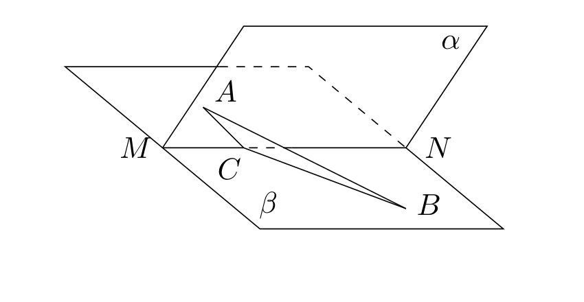

# 1990年上海卷

## 填空题

### 第 1 题

函数 $y=\frac{\sqrt{x+4}}{x+2}$ 的定义域是＿＿＿＿＿＿.

#### 答案

$[-4,-2)\cup(-2,+\infty)$

#### 解析

要使函数有意义，根式要求 $x+4\geq0$，即 $x\geq-4$；分母要求 $x+2\ne0$，即 $x\ne-2$. 因此定义域为 $[-4,-2)\cup(-2,+\infty)$.

### 第 2 题

函数 $y=\arcsin x$（$x\in[-1,1]$）的反函数是＿＿＿＿＿＿.

#### 答案

$y=\sin x$，$x\in[-\frac{\pi}{2},\frac{\pi}{2}]$

#### 解析

令 $y=\arcsin x$. 按反正弦函数的值域，$y\in[-\frac{\pi}{2},\frac{\pi}{2}]$，且由定义有 $x=\sin y$. 交换自变量与因变量，得到反函数 $y=\sin x$，其定义域为 $[-\frac{\pi}{2},\frac{\pi}{2}]$.

### 第 3 题

过点 $(1,2)$ 且与直线 $2x+y-1=0$ 平行的直线方程是＿＿＿＿＿＿.

#### 答案

$2x+y-4=0$

#### 解析

平行直线的法向量相同，所以所求直线可设为 $2x+y+c=0$. 将点 $(1,2)$ 代入，得 $2\cdot1+2+c=0$，从而 $c=-4$. 因此所求直线为 $2x+y-4=0$.

### 第 4 题

已知圆柱的轴截面是正方形，它的面积是 $4\mathrm{~cm}^2$， 那么这个圆柱的体积是＿＿＿＿＿＿$\mathrm{cm}^3$（结果中保留 $\pi$）.

#### 答案

$2\pi$

#### 解析

设圆柱的底面半径为 $r>0$，高为 $h>0$. 轴截面是边长为 $2r$ 和 $h$ 的矩形，且它是正方形，所以 $h=2r$. 由轴截面面积为 $4\mathrm{~cm}^2$，得 $2r\cdot h=4$. 代入 $h=2r$，得 $4r^2=4$，故 $r=1 \mathrm{~cm}$，$h=2 \mathrm{~cm}$. 因而圆柱体积为 $V=\pi r^2h=2\pi \mathrm{~cm}^3$，填入 $2\pi$.

### 第 5 题

在 $\triangle ABC$ 中，已知 $\cos A=-\frac{3}{5}$，则 $\sin\frac{A}{2}=$＿＿＿＿＿＿.

#### 答案

$\frac{2\sqrt5}{5}$

#### 解析

因为 $A$ 是三角形内角，所以 $0<A<\pi$，从而 $0<\frac A2<\frac\pi2$，故半角正弦取正值. 由半角公式， $\sin\frac A2=\sqrt{\frac{1-\cos A}{2}}=\sqrt{\frac{1-(-\frac35)}{2}}=\sqrt{\frac45}=\frac{2\sqrt5}{5}$.

### 第 6 题

设复数 $\omega=\cos\frac{2\pi}{5}+\i\sin\frac{2\pi}{5}$，则 $\omega+\omega^2+\omega^3+\omega^4+\omega^5$ 的值是＿＿＿＿＿＿.

#### 答案

$0$

#### 解析

由 $\omega=\cos\frac{2\pi}{5}+\i\sin\frac{2\pi}{5}$，有 $\omega^5=\cos2\pi+\i\sin2\pi=1$，且 $\omega\ne1$. 因而等比数列求和公式给出 $1+\omega+\omega^2+\omega^3+\omega^4=\frac{\omega^5-1}{\omega-1}=0$. 所求式为 $(1+\omega+\omega^2+\omega^3+\omega^4)-1+\omega^5=0-1+1=0$.

### 第 7 题

已知圆锥的中截面周长为 $a$，母线长为 $l$，则它的侧面积等于＿＿＿＿＿＿.

#### 答案

$al$

#### 解析

设圆锥底面半径为 $R$. 经过母线中点且平行于底面的中截面与底面相似，线性比为 $1:2$，所以中截面半径为 $\frac R2$. 其周长为 $2\pi\cdot\frac R2=\pi R=a$. 圆锥侧面积为 $\pi Rl$，故所求侧面积为 $al$.

### 第 8 题

已知 $(x+a)^7$ 的展开式中，$x^4$ 的系数是 $-280$，则实数 $a=$＿＿＿＿＿＿.

#### 答案

$-2$

#### 解析

由二项式定理，$(x+a)^7$ 的一般项为 $\mathrm C_7^k x^{7-k}a^k$. 要得到 $x^4$，必须取 $k=3$，所以 $x^4$ 的系数为 $\mathrm C_7^3a^3=35a^3$. 由题意 $35a^3=-280$，得 $a^3=-8$. 因为 $a$ 为实数，故 $a=-2$.

### 第 9 题

双曲线 $2mx^2-my^2=2$ 的一条准线是 $y=1$，则 $m=$＿＿＿＿＿＿.

#### 答案

$-\frac43$

#### 解析

当 $m=0$ 时，方程化为 $0=2$，不表示双曲线，故 $m\ne0$. 若 $m>0$，则方程化为 $\frac{x^2}{1/m}-\frac{y^2}{2/m}=1$，其准线是竖直直线，不可能为 $y=1$，所以必须有 $m<0$. 此时 $\frac{y^2}{-2/m}-\frac{x^2}{-1/m}=1$. 令 $a^2=-\frac2m$，$b^2=-\frac1m$，则这是纵轴双曲线，且 $e^2=1+\frac{b^2}{a^2}=1+\frac12=\frac32$. 纵轴双曲线的准线为 $y=\pm\frac ae$，故 $1=\frac ae=\sqrt{\frac{-2/m}{3/2}}=\sqrt{-\frac4{3m}}$. 两边平方得 $m=-\frac43$，满足 $m<0$，所以所求值为 $-\frac43$.

### 第 10 题

平面上，四条平行直线与另外五条平行直线互相垂直，则它的矩形共有＿＿＿＿＿＿ 个（结果用数值表示）.

#### 答案

$60$

#### 解析

矩形的两组对边分别来自两组平行线. 从四条平行线中任取两条作为一组对边，有 $\mathrm C_4^2=6$ 种；从另外五条平行线中任取两条作为另一组对边，有 $\mathrm C_5^2=10$ 种. 每一种选择唯一确定一个矩形，所以矩形总数为 $\mathrm C_4^2\mathrm C_5^2=6\times10=60$.

## 单选题

### 第 11 题

圆的半径是 $1$，圆心的极坐标是 $(1,0)$，则这个圆的极坐标方程是（）

A.  
$\rho=\cos\theta$

B.  
$\rho=\sin\theta$

C.  
$\rho=2\cos\theta$

D.  
$\rho=2\sin\theta$

#### 答案

C

#### 解析

圆心极坐标 $(1,0)$ 对应直角坐标 $(1,0)$，所以圆的直角坐标方程为 $\left(x-1\right)^2+y^2=1$. 展开并整理得 $x^2+y^2=2x$. 代入 $x=\rho\cos\theta$ 和 $x^2+y^2=\rho^2$，得 $\rho^2=2\rho\cos\theta$. 圆上点满足 $\rho\geq0$，故方程化为 $\rho=2\cos\theta$，选 C.

### 第 12 题

函数 $f(x)$ 和 $g(x)$ 的定义域均为 $\mathbb{R}$，“$f(x)$，$g(x)$ 都是奇函数”是“$f(x)$ 与 $g(x)$ 的积是偶函数”的（）

A.  
必要条件但非充分条件

B.  
充分条件但非必要条件

C.  
充分必要条件

D.  
非充分条件也非必要条件

#### 答案

B

#### 解析

设命题 $P$ 为“$f$、$g$ 都是奇函数”，命题 $Q$ 为“$fg$ 是偶函数”. 若 $P$ 成立，则对任意 $x\in\mathbb{R}$，有 $f(-x)=-f(x)$，$g(-x)=-g(x)$，于是 $(fg)(-x)=f(-x)g(-x)=\left(-f(x)\right)\left(-g(x)\right)=f(x)g(x)=(fg)(x)$. 因此 $P$ 是 $Q$ 的充分条件.

但 $P$ 不是 $Q$ 的必要条件. 例如取 $f(x)=g(x)=1$，则 $(fg)(x)=1$ 是偶函数，而 $f$、$g$ 都不是奇函数. 所以选 B.

### 第 13 题

设点 $P$ 在有向线段 $\overrightarrow{AB}$ 的延长线上，$P$ 分 $\overrightarrow{AB}$ 所成的比为 $\lambda$，则（）

A.  
$\lambda<-1$

B.  
$-1<\lambda<0$

C.  
$0<\lambda<1$

D.  
$\lambda>1$

#### 答案

A

#### 解析

取有向直线上的坐标 $A=0$，$B=1$. “$\overrightarrow{AB}$ 的延长线”指向 $B$ 的一侧，所以设 $P$ 的坐标为 $p>1$. 由有向线段定比分点的定义， $\lambda=\frac{\overline{AP}}{\overline{PB}}=\frac{p}{1-p}$. 此时分母为负，故 $\lambda<0$. 又因 $p>1$，有 $p>p-1=|1-p|$，所以 $\lambda=-\frac{p}{p-1}<-1$. 因此选 A.

### 第 14 题

设 $2^a=3$，$2^b=6$，$2^c=12$，则数列 $a$，$b$，$c$（）

A.  
是等差数列但不是等比数列

B.  
是等比数列但不是等差数列

C.  
既是等差数列又是等比数列

D.  
既不是等差数列又不是等比数列

#### 答案

A

#### 解析

因为 $2^a=3$，$2^b=6$，$2^c=12$，所以 $b-a=\log_2\frac{6}{3}=1$，$c-b=\log_2\frac{12}{6}=1$. 两个相邻差相等，故 $a$，$b$，$c$ 成等差数列.

若三项成等比数列，则应有 $b^2=ac$. 但由 $b=a+1$、$c=a+2$，得 $b^2-ac=(a+1)^2-a(a+2)=1\ne0$. 所以它不是等比数列，选 A.

### 第 15 题

设 $\alpha$ 角属于第二象限，且 $\left|\cos\frac{\alpha}{2}\right|=-\cos\frac{\alpha}{2}$，则 $\frac{\alpha}{2}$ 角属于（）

A.  
第一象限

B.  
第二象限

C.  
第三象限

D.  
第四象限

#### 答案

C

#### 解析

由 $\left|\cos\frac\alpha2\right|=-\cos\frac\alpha2$，且 $\alpha$ 属于第二象限、半角不在坐标轴上，知 $\cos\frac\alpha2<0$. 又因 $\alpha$ 属于第二象限，所以 $\sin\alpha>0$. 利用倍角公式， $\sin\alpha=2\sin\frac\alpha2\cos\frac\alpha2>0$. 由于 $\cos\frac\alpha2<0$，只能有 $\sin\frac\alpha2<0$. 因此半角的正弦、余弦均为负，$\frac\alpha2$ 属于第三象限，选 C.

### 第 16 题

设过长方体同一个顶点的三个面的对角线长分别是 $a$，$b$，$c$，那么这个长方体的对角线长是（）

A.  
$\sqrt{a^2+b^2+c^2}$

B.  
$\sqrt{\frac{a^2+b^2+c^2}{2}}$

C.  
$\sqrt{\frac{a^2+b^2+c^2}{3}}$

D.  
$\frac{\sqrt{a^2+b^2+c^2}}{2}$

#### 答案

B

#### 解析

设从该顶点出发的三条棱长分别为 $u$、$v$、$w$，长方体的空间对角线长为 $d$. 由勾股定理，三个面的对角线满足 $a^2=u^2+v^2$，$b^2=v^2+w^2$，$c^2=w^2+u^2$. 相加得到 $a^2+b^2+c^2=2u^2+2v^2+2w^2=2\left(u^2+v^2+w^2\right)=2d^2$. 因为 $d>0$，所以 $d=\sqrt{\frac{a^2+b^2+c^2}{2}}$，选 B.

### 第 17 题

函数 $f(x)=a\tan\frac{x}{a}$ 的最小正周期是（）

A.  
$\pi a$

B.  
$\pi|a|$

C.  
$\frac{\pi}{a}$

D.  
$\frac{\pi}{|a|}$

#### 答案

B

#### 解析

函数表达式要求 $a\ne0$. 设其正周期为 $T>0$. 正切函数满足 $\tan(u+k\pi)=\tan u$，因此必须有 $\frac{T}{a}=k\pi$，其中 $k$ 为非零整数. 要使 $T>0$ 且最小，取使 $k\pi a>0$ 的最小整数绝对值，即 $T=\pi|a|$. 函数值外的非零常数 $a$ 不改变周期，故选 B.

### 第 18 题

已知 $1<x<d$，令 $a=\left(\log_d x\right)^2$，$b=\log_d\left(x^2\right)$，$c=\log_d\left(\log_d x\right)$，则（）

A.  
$a<b<c$

B.  
$a<c<b$

C.  
$c<b<a$

D.  
$c<a<b$

#### 答案

D

#### 解析

由对数的定义域，底数满足 $d>0$ 且 $d\ne1$. 又因 $1<x<d$，只能有 $d>1$. 令 $t=\log_d x$，由 $1<x<d$ 得 $0<t<1$. 因而 $a=t^2>0$，$b=\log_d\left(x^2\right)=2\log_d x=2t>0$，而因为 $0<t<1$ 且 $d>1$，有 $c=\log_d t<0$. 另外 $0<t<1$ 给出 $t^2<2t$，所以 $c<a<b$，选 D.

### 第 19 题

设 $a$，$b$ 是两条异面直线，那么下列四个命题中的假命题是（）

A.  
经过直线 $a$ 有且只有一个平面平行于直线 $b$

B.  
经过直线 $a$ 有且只有一个平面垂直于直线 $b$

C.  
存在分别经过直线 $a$ 和 $b$ 的两个互相平行的平面

D.  
存在分别经过直线 $a$ 和 $b$ 的两个互相垂直的平面

#### 答案

B

#### 解析

过直线 $a$ 上任一点作一条与直线 $b$ 平行的直线，这两条相交直线唯一确定一个平面；该平面包含 $a$ 且平行于 $b$，所以命题 A 正确.

将这个平面沿垂直于它的方向平移，使所得平面经过直线 $b$，即可得到分别经过 $a$、$b$ 的两个平行平面，所以命题 C 正确. 对于命题 $D$，先取一个经过 $a$ 的平面，使其法向量 $\bs n$ 不平行于直线 $b$ 的方向向量 $\bs b$；这是可以做到的，因为与直线 $a$ 垂直的法向量不只有一个方向，而异面直线 $a$、$b$ 的方向也不平行. 令 $\bs m=\bs b\times\bs n$，则 $\bs m\ne\bs 0$，且同时垂直于 $\bs b$ 和 $\bs n$，从而可取一个经过直线 $b$ 且法向量为 $\bs m$ 的平面；两平面的法向量垂直，所以这两个平面互相垂直，命题 $D$ 可成立.

若存在一个经过直线 $a$ 且垂直于直线 $b$ 的平面，则直线 $a$ 的方向必须垂直于直线 $b$ 的方向. 但两条异面直线的方向不一定垂直，例如直线 $a$ 的方向向量可取 $(1,0,0)$，直线 $b$ 的方向向量可取 $(1,1,0)$，并将 $b$ 平移到不在由这两个方向向量张成的平面内的位置，此时两直线异面但方向不垂直. 因此“有且只有一个”不能对任意异面直线成立，命题 $B$ 是假命题，选 B.

### 第 20 题

下列四个函数中，在定义域内不具有单调性的函数是（）

A.  
$y=\cot\left(\arccos x\right)$

B.  
$y=\tan\left(\arcsin x\right)$

C.  
$y=\sin\left(\arctan x\right)$

D.  
$y=\cos\left(\arctan x\right)$

#### 答案

D

#### 解析

对 A，$\arccos x\in[0,\pi]$，而余切在端点无定义，所以定义域为 $(-1,1)$. 在该区间内 $\cot(\arccos x)=\frac{\cos(\arccos x)}{\sin(\arccos x)}=\frac{x}{\sqrt{1-x^2}}$，其导数为 $\frac1{(1-x^2)^{3/2}}>0$，故单调递增.

对 B，$\arcsin x\in[-\frac\pi2,\frac\pi2]$，正切在两个端点无定义，所以定义域也是 $(-1,1)$. 同样有 $\tan(\arcsin x)=\frac{x}{\sqrt{1-x^2}}$，导数为正，故单调递增.

对 C，$\arctan x\in(-\frac\pi2,\frac\pi2)$，定义域为 $\mathbb{R}$，且 $\sin(\arctan x)=\frac{x}{\sqrt{1+x^2}}$. 其导数为 $\frac1{(1+x^2)^{3/2}}>0$，故在 $\mathbb{R}$ 上单调递增.

对 D，$\cos(\arctan x)=\frac1{\sqrt{1+x^2}}$，其导数为 $-\frac{x}{(1+x^2)^{3/2}}$. 它在 $(-\infty,0)$ 上递增，在 $(0,+\infty)$ 上递减，因而在整个定义域 $\mathbb{R}$ 上不具有单调性，选 D.

## 解答题

### 第 21 题

已知 $\log_5(x^2+2x-2)=0$，$2\log_5(x+2)-\log_5 y+\frac{1}{2}=0$，求 $y$ 的值.

#### 解析

由第一式，因 $\log_5 u=0$ 当且仅当 $u=1$，得 $x^2+2x-2=1$，即 $x^2+2x-3=0$. 因式分解为 $(x-1)(x+3)=0$，所以 $x=1$ 或 $x=-3$. 但第二式中的 $\log_5(x+2)$ 要求 $x+2>0$，故 $x>-2$，只能取 $x=1$. 同时 $\log_5 y$ 要求 $y>0$.

代入第二式，得 $2\log_5 3-\log_5 y+\frac12=0$，所以 $\log_5 y=2\log_5 3+\frac12=\log_5 9+\log_5\sqrt5=\log_5\left(9\sqrt5\right)$. 因此 $y=9\sqrt5$.

### 第 22 题

求方程 $\sqrt{5}\cos x+\cos 2x+\sin x=0$ 在 $[0,2\pi)$ 上的解.

#### 解析

令 $s=\sin x$，$c=\cos x$. 原方程为 $\sqrt5c+2c^2-1+s=0$. 利用 $c^2=1-s^2$，可写成 $\sqrt5c=2s^2-s-1$. 两边平方，并用 $c^2=1-s^2$，得

$$

\left(2s^2-s-1\right)^2=5\left(1-s^2\right)

$$

展开并移项，得

$$

4s^4-4s^3-3s^2+2s+1=5-5s^2
\Longleftrightarrow 2s^4-2s^3+s^2+s-2=0

$$

再因式分解为

$$

2(s-1)\left(2s^3+s+2\right)=0

$$

先看 $s=1$. 此时 $c^2=1-s^2=0$，所以 $c=0$，对应 $x=\frac\pi2$.

再看 $2s^3+s+2=0$. 令 $h(s)=2s^3+s+2$，则 $h'(s)=6s^2+1>0$，所以该方程至多有一个实根. 又 $h(-1)=-1<0$，$h(-\frac12)=\frac54>0$，故它有且只有一个根 $s_0\in(-1,-\frac12)$. 对此根，$(s_0-1)(2s_0+1)>0$，所以 $2s_0^2-s_0-1>0$. 由未平方的关系取 $c_0=\frac{2s_0^2-s_0-1}{\sqrt5}>0$. 前面的平方等式又保证 $c_0^2=1-s_0^2$，故 $(s_0,c_0)$ 确实满足原方程，没有增根. 由于正弦为负、余弦为正，相应角在第四象限，解为 $x=2\pi+\arcsin s_0$.

用卡尔丹公式求三次方程的实根，得到

$$

s_0=\sqrt[3]{\frac{-18+\sqrt{330}}{36}}+\sqrt[3]{\frac{-18-\sqrt{330}}{36}}

$$

所以在 $[0,2\pi)$ 内的全部解为 $x=\frac\pi2$ 和 $x=2\pi+\arcsin s_0$，其中 $s_0$ 为上式的实数值.

### 第 23 题

已知点 $P$ 在直线 $x=2$ 上移动，直线 $l$ 通过原点且与 $OP$ 垂直，通过点 $A(1,0)$ 及点 $P$ 的直线 $m$ 和直线 $l$ 交于点 $Q$. 求点 $Q$ 的轨迹方程，并指出该轨迹的名称和它的焦点坐标.

#### 解析

设 $P=(2,t)$，其中 $t\in\mathbb{R}$. 向量 $\overrightarrow{OP}=(2,t)$，所以过原点且垂直于 $OP$ 的直线 $l$ 为 $2x+ty=0$. 过 $A=(1,0)$ 和 $P=(2,t)$ 的直线 $m$ 的斜率为 $t$，故 $m$ 的方程为 $y=t(x-1)$. 设 $Q=(X,Y)$，联立两式： $Q=(X,Y)=\left(\frac{t^2}{t^2+2},-\frac{2t}{t^2+2}\right)$.

由 $2X+tY=0$ 和 $Y=t(X-1)$，联立可得 $X=\frac{t^2}{t^2+2}$，$Y=-\frac{2t}{t^2+2}$. 于是 $1-X=\frac2{t^2+2}$，所以 $Y^2=\frac{4t^2}{(t^2+2)^2}=2X(1-X)$. 因而轨迹方程为

$$

4\left(X-\frac12\right)^2+2Y^2=1

$$

将其写成标准式：

$$

\frac{\left(X-\frac12\right)^2}{\left(\frac12\right)^2}
+\frac{Y^2}{\left(\frac1{\sqrt2}\right)^2}=1

$$

因此轨迹所在的曲线是中心为 $\left(\frac12,0\right)$、长轴在 $y$ 轴方向的椭圆，半长轴为 $\frac1{\sqrt2}$，半短轴为 $\frac12$. 焦半距为 $c=\sqrt{\left(\frac1{\sqrt2}\right)^2-\left(\frac12\right)^2}=\frac12$，故焦点为 $\left(\frac12,\frac12\right)$ 和 $\left(\frac12,-\frac12\right)$.

参数 $t$ 为有限实数时 $X<1$，所以椭圆上的点 $(1,0)$ 不会取到. 反过来，椭圆上任一点只要不为 $(1,0)$，均可由 $t=-Y/(1-X)$ 得到，因此实际轨迹是上述椭圆去掉点 $(1,0)$.

### 第 24 题

已知直线 $l:x-ny=0$（$n\in\mathbb{N}$）；圆 $M:(x+1)^2+(y+1)^2=1$；抛物线 $\Phi:y=(x-1)^2$. 又 $l$ 与 $M$ 交于点 $A$，$B$；$l$ 与 $\Phi$ 交于点 $C$，$D$. 求 $\displaystyle\lim_{n\to\infty}\frac{\left|AB\right|^2}{\left|CD\right|^2}$.

#### 解析

直线 $l$ 写成 $y=\frac{x}{n}$. 圆心 $(-1,-1)$ 到该直线的距离为 $d=\frac{|n-1|}{\sqrt{n^2+1}}$. 因此圆的弦 $AB$ 满足

$$

\left|AB\right|^2=4(1-d^2)=\frac{8n}{n^2+1}

$$

直线与抛物线的交点横坐标是方程 $\frac{x}{n}=(x-1)^2$ 的两个根，亦即 $x^2-\left(2+\frac1n\right)x+1=0$. 设两根为 $x_1$，$x_2$，则 $\left|x_1-x_2\right|^2=\frac{4n+1}{n^2}$. 因为弦 $CD$ 在直线 $y=x/n$ 上，

$$

\left|CD\right|^2=\left(1+\frac1{n^2}\right)\left|x_1-x_2\right|^2=\frac{(n^2+1)(4n+1)}{n^4}

$$

所以

$$

\frac{\left|AB\right|^2}{\left|CD\right|^2}=\frac{8n^5}{(n^2+1)^2(4n+1)}\longrightarrow2

$$

### 第 25 题

关于实数 $x$ 的不等式 $\left|x-\frac{(a+1)^2}{2}\right|\le\frac{(a-1)^2}{2}$ 与 $x^2-3(a+1)x+2(3a+1)\le0$（其中 $a\in\mathbb{R}$）的解集依次记为 $A$ 与 $B$. 求使 $A\subseteq B$ 的 $a$ 的取值范围.

#### 解析

第一个不等式给出

$$

A=\left[\frac{(a+1)^2-(a-1)^2}{2},\frac{(a+1)^2+(a-1)^2}{2}\right]=[2a,a^2+1]

$$

第二个不等式中的二次式可因式分解为 $x^2-3(a+1)x+2(3a+1)=(x-2)(x-3a-1)$. 因而 $B=[3a+1,2]$（当 $a\le\frac13$），或 $B=[2,3a+1]$（当 $a\ge\frac13$).

当 $a\le\frac13$ 时，包含关系要求 $3a+1\le2a$ 且 $a^2+1\le2$，即 $a\le-1$ 且 $-1\le a\le1$，所以只有 $a=-1$. 当 $a\ge\frac13$ 时，包含关系要求 $2\le2a$ 且 $a^2+1\le3a+1$，即 $a\ge1$ 且 $0\le a\le3$，所以 $1\le a\le3$. 因此所求范围为 $\{-1\}\cup[1,3]$.

### 第 26 题

如图，平面 $\alpha$，$\beta$ 相交于直线 $MN$，点 $A$ 在平面 $\alpha$ 上，点 $B$ 在平面 $\beta$ 上，点 $C$ 在直线 $MN$ 上，$\angle ACM=\angle BCN=45^\circ$，二面角 $A-MN-B$ 是 $60^\circ$，$AC=1$. 求：

1.  点 $A$ 到平面 $\beta$ 的距离；

2.  二面角 $A-BC-M$ 的大小（用反三角函数表示）.

#### 解析

1.  取 $C$ 为原点，取 $MN$ 为 $x$ 轴，正方向为 $CN$ 的方向，令平面 $\alpha$ 为 $z=0$. 取平面 $\alpha$ 内垂直于 $MN$ 且指向 $A$ 的方向为正 $y$ 方向，则 $A=(-\frac{\sqrt2}{2},\frac{\sqrt2}{2},0)$.

    由二面角 $A-MN-B=60^\circ$，可取平面 $\beta$ 内垂直于 $MN$ 且指向 $B$ 所在半平面的单位方向为 $(0,\frac12,\frac{\sqrt3}{2})$，所以平面 $\beta$ 的方程可写为 $z=\sqrt3y$. 因而点 $A$ 到平面 $\beta$ 的距离为

$$

d=\frac{|\sqrt3y_A-z_A|}{\sqrt{1+3}}=\frac{\sqrt6}{4}

$$

2.  再设 $B$ 的位置向量方向去掉正比例因子后为 $\bs b=(1,\frac12,\frac{\sqrt3}{2})$，而 $A$ 的位置向量去掉正比例因子后为 $\bs a=(-1,1,0)$. 取平面 $MBC$ 和 $ABC$ 的法向量分别为 $\bs n_1=(1,0,0)\times\bs b=\left(0,-\frac{\sqrt3}{2},\frac12\right)$， $\bs n_2=\bs a\times\bs b=\left(\frac{\sqrt3}{2},\frac{\sqrt3}{2},-\frac32\right)$. 于是二面角 $A-BC-M$ 的余弦为

$$

\cos\theta=\frac{|\bs n_1\cdot\bs n_2|}{|\bs n_1||\bs n_2|}=\frac{\frac32}{1\cdot\frac{\sqrt{15}}2}=\sqrt{\frac35}

$$

    该二面角取锐角，所以 $\theta=\arccos\sqrt{\frac35}=\arctan\sqrt{\frac23}$.

### 第 27 题

复平面上点 $A$，$B$ 对应的复数分别为 $z_1=2$，$z_2=-3$，点 $P$ 对应的复数为 $z$，$\frac{z-z_1}{z-z_2}$ 的辐角主值为 $\varphi$. 当点 $P$ 在以原点为圆心，$1$ 为半径的上半圆周（不包括两个端点）上运动时，求 $\varphi$ 的最小值.

#### 解析

设 $P=(\cos t,\sin t)$，其中 $0<t<\pi$. 因为 $P$ 在上半平面，向量 $\overrightarrow{AP}=(\cos t-2,\sin t)$ 在第二象限，向量 $\overrightarrow{BP}=(\cos t+3,\sin t)$ 在第一象限，所以 $\varphi=\arg\overrightarrow{AP}-\arg\overrightarrow{BP}$ 是三角形 $APB$ 在 $P$ 处的内角，且 $\frac\pi2<\varphi<\pi$.

两向量的内积和行列式分别为

$$

\overrightarrow{AP}\cdot\overrightarrow{BP}=(\cos t-2)(\cos t+3)+\sin^2t=\cos t-5

$$

$$

\left|\det(\overrightarrow{AP},\overrightarrow{BP})\right|=5\sin t

$$

令 $\delta=\pi-\varphi$，则 $\delta$ 为锐角，且

$$

\tan\delta=\frac{5\sin t}{5-\cos t}

$$

因此使 $\varphi$ 最小，等价于使 $\frac{\sin t}{5-\cos t}$ 最大. 对其求导，

$$

\left(\frac{\sin t}{5-\cos t}\right)'=\frac{5\cos t-1}{(5-\cos t)^2}

$$

所以最大值在 $\cos t=\frac15$ 处取得，此时 $\sin t=\frac{2\sqrt6}{5}$，从而 $\tan\delta=\frac{5\sqrt6}{12}$. 于是

$$

\varphi_{\min}=\pi-\arctan\frac{5\sqrt6}{12}

$$

