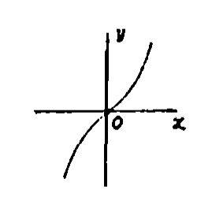
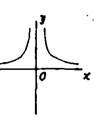
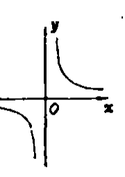
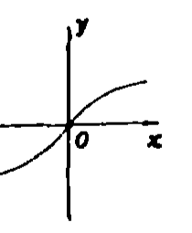
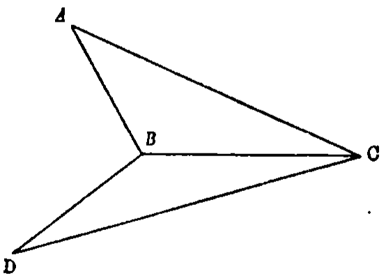
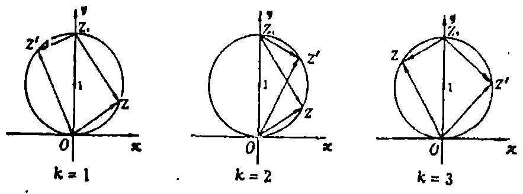
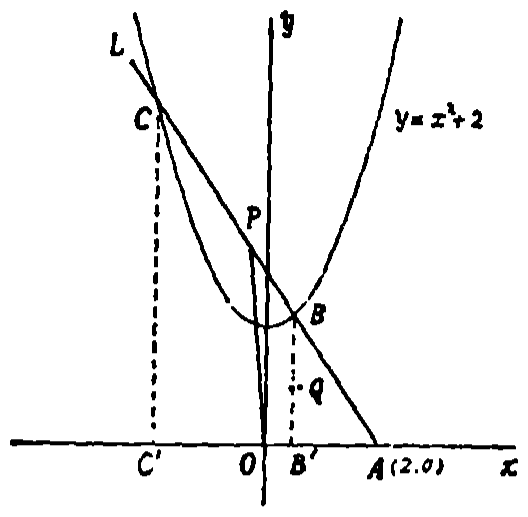
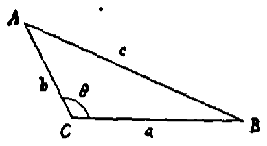

# 1991年上海卷

## 填空题

### 第 1 题

函数 $y = 3^x$（$x \geqslant 0$）的反函数是＿＿＿＿＿＿.

#### 答案

$y = \log_3 x$（$x \geqslant 1$）

#### 解析

由 $y=3^x$ 且 $x\geqslant0$，可知其值域为 $y\geqslant1$. 交换 $x$，$y$ 得 $x=3^y$，所以反函数为 $y=\log_3x$，其定义域为原函数的值域 $x\geqslant1$.

### 第 2 题

已知 $\pi < \theta < \frac{3}{2}\pi$，$\cos \theta = -\frac{4}{5}$，则 $\cos \frac{\theta}{2} =$＿＿＿＿＿＿.

#### 答案

$-\frac{\sqrt{10}}{10}$

#### 解析

因为 $\pi<\theta<\frac{3}{2}\pi$，所以 $\frac{\theta}{2}\in\left(\frac{\pi}{2},\frac{3\pi}{4}\right)$，从而 $\cos\frac{\theta}{2}<0$. 由半角公式， $\cos\frac{\theta}{2}=-\sqrt{\frac{1+\cos\theta}{2}}=-\sqrt{\frac{1-\frac45}{2}}=-\sqrt{\frac1{10}}=-\frac{\sqrt{10}}{10}$.

### 第 3 题

一个圆柱的底面直径和高都等于一个球的直径，则这个圆柱的体积与球体积的比值为＿＿＿＿＿＿.

#### 答案

$\frac{3}{2}$

#### 解析

设圆柱和球的直径均为 $d$. 则圆柱的底面半径为 $\frac d2$，高为 $d$，所以 $V_{\text{柱}}=\pi\left(\frac d2\right)^2d=\frac14\pi d^3$. 球的半径为 $\frac d2$，所以 $V_{\text{球}}=\frac43\pi\left(\frac d2\right)^3=\frac16\pi d^3$. 因而 $\frac{V_{\text{柱}}}{V_{\text{球}}}=\frac{\frac14\pi d^3}{\frac16\pi d^3}=\frac32$.

### 第 4 题

函数 $y = \sin(\pi x + 2)$ 的最小正周期是＿＿＿＿＿＿.

#### 答案

$2$

#### 解析

正弦函数 $y=\sin(\omega x+\varphi)$ 的最小正周期为 $\frac{2\pi}{|\omega|}$. 这里 $\omega=\pi$，所以最小正周期为 $\frac{2\pi}{\pi}=2$.

### 第 5 题

椭圆 $x^2 + 4y^2 = 1$ 的离心率是＿＿＿＿＿＿.

#### 答案

$\frac{\sqrt{3}}{2}$

#### 解析

将 $x^2+4y^2=1$ 化为标准式 $\frac{x^2}{1^2}+\frac{y^2}{(\frac12)^2}=1$. 因而长半轴 $a=1$，短半轴 $b=\frac12$，焦半距 $c=\sqrt{a^2-b^2}=\sqrt{1-\frac14}=\frac{\sqrt3}{2}$. 所以离心率为 $\frac ca=\frac{\sqrt3}{2}$.

### 第 6 题

在无穷等比数列 $\{a_n\}$ 中，$a_1 = 3\sqrt{3}$，$a_3 = \sqrt{3}$. 则 $\displaystyle\lim_{n \to \infty}(a_1 + a_3 + a_5 + \cdots + a_{2n-1}) =$＿＿＿＿＿＿.

#### 答案

$\frac{9}{2}\sqrt{3}$

#### 解析

设等比数列的公比为 $q$. 由 $a_3=a_1q^2$，得 $3\sqrt3q^2=\sqrt3$，所以 $q^2=\frac13$. 奇数项构成首项为 $a_1=3\sqrt3$、公比为 $q^2=\frac13$ 的无穷等比数列，因此 $\displaystyle\lim_{n\to\infty}(a_1+a_3+\cdots+a_{2n-1})=\frac{3\sqrt3}{1-\frac13}=\frac92\sqrt3$.

### 第 7 题

若母线长为 $4$ 的圆锥的轴截面的面积为 $8$，则圆锥的侧面积为＿＿＿＿＿＿（结果中保留 $\pi$）.

#### 答案

$8\sqrt{2}\pi$

#### 解析

设圆锥底面半径为 $r$，高为 $h$. 轴截面是底边为 $2r$、高为 $h$ 的等腰三角形，所以由面积条件 $rh=8$. 又母线长为 $4$，故 $r^2+h^2=16$. 于是 $r^2+h^2\geqslant2rh=16$，等号成立，所以 $r=h=2\sqrt2$. 圆锥的侧面积为 $\pi rl=\pi\cdot2\sqrt2\cdot4=8\sqrt2\pi$.

### 第 8 题

$\left(2x^2 - \frac{1}{x}\right)^6$ 的展开式中的常数项为＿＿＿＿＿＿（结果用数值表示）.

#### 答案

$60$

#### 解析

展开式的通项为 $\displaystyle\mathrm C_6^k(2x^2)^{6-k}\left(-\frac1x\right)^k=\mathrm C_6^k2^{6-k}(-1)^kx^{12-3k}$. 要得到常数项，须有 $12-3k=0$，即 $k=4$. 因而常数项为 $\displaystyle\mathrm C_6^4 2^2(-1)^4=15\times4=60$.

### 第 9 题

设函数 $y = f(x)$ 的图象关于直线 $x = 1$ 对称，若当 $x \leqslant 1$ 时，$y = x^2 + 1$，则当 $x > 1$ 时，$y =$＿＿＿＿＿＿.

#### 答案

$x^2 - 4x + 5$

#### 解析

直线 $x=1$ 是对称轴. 当 $x>1$ 时，关于该直线的对称点的横坐标为 $2-x<1$，纵坐标不变，因此 $f(x)=f(2-x)=(2-x)^2+1=x^2-4x+5$.

### 第 10 题

设有半径为 $4$ 的圆，它在极坐标系内的圆心坐标是 $(4,\pi)$，则这圆的极坐标方程是＿＿＿＿＿＿.

#### 答案

$\rho = -8\cos \theta$

#### 解析

极坐标点 $(4,\pi)$ 对应的直角坐标为 $(-4,0)$，所以该圆的直角坐标方程为 $(X+4)^2+Y^2=16$. 代入 $X=\rho\cos\theta$，$Y=\rho\sin\theta$，得 $\rho^2+8\rho\cos\theta=0$，即 $\rho(\rho+8\cos\theta)=0$. 其中 $\rho=0$ 表示原点，而原点本就在该圆上，所以圆的极坐标方程可写为 $\rho=-8\cos\theta$.

## 单选题

### 第 11 题

若全集 $I = \mathbb{R}$，$A = \{x \mid \sqrt{x + 1} \leqslant 0\}$，$B = \{x \mid \lg(x^2 - 2) = \lg x\}$，则 $A \cap \overline{B}$ 是（）

A.  
$\{2\}$

B.  
$\{-1\}$

C.  
$\{x \mid x \leqslant -1\}$

D.  
$\varnothing$

#### 答案

B

#### 解析

因为平方根非负，且定义域要求 $x+1\geqslant0$，所以 $\sqrt{x+1}\leqslant0$ 等价于 $\sqrt{x+1}=0$，从而 $A=\{-1\}$. 对于 $B$，对数有意义要求 $x>0$ 且 $x^2-2>0$. 在此条件下 $\lg(x^2-2)=\lg x\Longleftrightarrow x^2-2=x\Longleftrightarrow(x-2)(x+1)=0$. 结合 $x>\sqrt2$，得 $B=\{2\}$. 因为 $-1\neq2$，所以 $A\cap\overline B=\{-1\}$，选 B.

### 第 12 题

在等差数列 $\{a_n\}$ 中，若 $a_3 + a_4 + a_5 + a_6 + a_7 = 450$，则 $a_2 + a_8$ 的值等于（）

A.  
$45$

B.  
$75$

C.  
$180$

D.  
$300$

#### 答案

C

#### 解析

等差数列中，关于中项 $a_5$ 对称的五项和为 $5a_5$，所以 $5a_5=450$，得 $a_5=90$. 又 $a_2=a_5-3d$，$a_8=a_5+3d$，故 $a_2+a_8=(a_5-3d)+(a_5+3d)=2a_5=180$. 因而选 C.

### 第 13 题

设长方体的对角线的长度是 $4$，过每一顶点有两条棱与对角线的夹角都是 $60^{\circ}$，则此长方体的体积是（）

A.  
$\frac{32}{72}\sqrt{3}$

B.  
$8\sqrt{2}$

C.  
$8\sqrt{3}$

D.  
$16\sqrt{3}$

#### 答案

B

#### 解析

设长方体从同一顶点出发的三条棱长为 $a$，$b$，$c$，空间对角线长为 $4$. 设其中两条棱分别与空间对角线成 $60^{\circ}$，则由点积 $\cos60^{\circ}=\frac{a}{4}=\frac{b}{4}$，得 $a=b=2$. 由空间对角线公式， $c=\sqrt{4^2-a^2-b^2}=\sqrt{16-4-4}=2\sqrt2$. 所以长方体体积为 $abc=8\sqrt2$，选 B.

### 第 14 题

下列各函数图象中，表示函数 $y = x^{-1}$ 的是（）

A.  

B.  

C.  

D.  

#### 答案

C

#### 解析

函数 $y=x^{-1}=\frac1x$ 的定义域为 $x\in\mathbb{R}\mathbin{\backslash}\{0\}$，值域为 $y\in\mathbb{R}\mathbin{\backslash}\{0\}$. 当 $x>0$ 时 $y>0$，图象位于第一象限；当 $x<0$ 时 $y<0$，图象位于第三象限. 又因为 $x\to0^+$ 时 $y\to+\infty$，$x\to0^-$ 时 $y\to-\infty$，而 $x\to\pm\infty$ 时 $y\to0$，所以 $x=0$ 和 $y=0$ 是两条渐近线，符合图 C.

### 第 15 题

下列四个命题中的假命题是（）

A.  
存在这样的 $\alpha$ 和 $\beta$ 的值，使得 $\cos(\alpha + \beta) = \cos \alpha \cos \beta + \sin \alpha \sin \beta$

B.  
不存在无穷多个 $\alpha$ 和 $\beta$ 的值，使得 $\cos(\alpha + \beta) = \cos \alpha \cos \beta + \sin \alpha \sin \beta$

C.  
对于任意的 $\alpha$ 和 $\beta$，$\cos(\alpha + \beta) = \cos \alpha \cos \beta - \sin \alpha \sin \beta$

D.  
不存在这样的 $\alpha$ 和 $\beta$ 的值，使得 $\cos(\alpha + \beta) \neq \cos \alpha \cos \beta - \sin \alpha \sin \beta$

#### 答案

B

#### 解析

由和差公式， $\cos\alpha\cos\beta+\sin\alpha\sin\beta=\cos(\alpha-\beta)$，而 $\cos\alpha\cos\beta-\sin\alpha\sin\beta=\cos(\alpha+\beta)$. 取 $\alpha=\beta=0$，可知第一个命题成立；取 $\alpha=0$，任意 $\beta$ 都使第一个命题中的等式成立，因此这样的数值有无穷多个，第二个命题的“不存在无穷多个”是假命题；第三个命题是余弦和角公式，第四个命题说明标准和角公式不存在反例，均为真命题. 所以正确选项为第二项.

### 第 16 题

设有编号为 $1$，$2$，$3$，$4$，$5$ 的五个球和编号为 $1$，$2$，$3$，$4$，$5$ 的五个盒子，现将这五个球投放入这五个盒内，要求每个盒内投放一个球，并且恰好有两个球的编号与盒子的编号相同，则这样的投放方法的总数为（）

A.  
$20$

B.  
$30$

C.  
$60$

D.  
$120$

#### 答案

A

#### 解析

先从 $5$ 个盒子中选出与球号相同的 $2$ 个盒子，并把相应的球放入，共有 $\mathrm C_5^2$ 种选法. 剩下的 $3$ 个球放入剩下的 $3$ 个盒子时不能有固定点；三个球的错位排列只有两个，即三个球作一个三循环. 所以总数为 $\mathrm C_5^2\cdot2=10\cdot2=20$，选 A.

### 第 17 题

下列四个式子中，正确的是（）

A.  
$\sin\left(\arccos \frac{2}{3}\right) > \sin\left(\arccos \frac{1}{3}\right)$

B.  
$\tan\left(\arccos \frac{2}{3}\right) > \tan\left(\arccos \frac{1}{3}\right)$

C.  
$\sin\left[\arccos\left(-\frac{2}{3}\right)\right] > \sin\left[\arccos\left(-\frac{1}{3}\right)\right]$

D.  
$\tan\left[\arccos\left(-\frac{2}{3}\right)\right] > \tan\left[\arccos\left(-\frac{1}{3}\right)\right]$

#### 答案

D

#### 解析

反余弦函数的值在 $[0,\pi]$ 内，因此 $\sin(\arccos t)=\sqrt{1-t^2}$. 于是 $\sin(\arccos\frac23)=\frac{\sqrt5}{3}<\frac{2\sqrt2}{3}=\sin(\arccos\frac13)$，A 错；在正数处 $\tan(\arccos t)=\frac{\sqrt{1-t^2}}{t}$，所以 $\tan(\arccos\frac23)=\frac{\sqrt5}{2}<2\sqrt2=\tan(\arccos\frac13)$，B 错.

同理， $\sin[\arccos(-\frac23)]=\frac{\sqrt5}{3}<\frac{2\sqrt2}{3}=\sin[\arccos(-\frac13)]$，C 错；而 $\tan[\arccos(-\frac23)]=-\frac{\sqrt5}{2}>-2\sqrt2=\tan[\arccos(-\frac13)]$，D 正确，故选 D.

### 第 18 题

设直线 $a$ 在平面 $M$ 内，则平面 $M$ 平行于平面 $N$ 是直线 $a$ 平行于平面 $N$ 的（）

A.  
充分条件但非必要条件

B.  
必要条件但非充分条件

C.  
充分必要条件

D.  
非充分条件也非必要条件

#### 答案

A

#### 解析

若平面 $M\parallel N$，则平面 $M$ 内任一直线都不与平面 $N$ 相交，因而 $a\parallel N$，所以该条件是充分条件. 但它不是必要条件：例如平面 $M$ 与平面 $N$ 相交于直线 $b$，在 $M$ 内取一条与 $b$ 平行且不同于 $b$ 的直线 $a$，则 $a\parallel N$，而 $M$ 不平行于 $N$. 因而选 A.

### 第 19 题

下列参数方程（$t$ 为参数）与普通方程 $x^2 - y = 0$ 表示同一曲线的方程是（）

A.  

$$

\begin{cases}
x = |t|,\\
y = t^2,
\end{cases}

$$

B.  

$$

\begin{cases}
x = \cos t,\\
y = \cos^2 t,
\end{cases}

$$

C.  

$$

\begin{cases}
x = \tan t,\\
y = \frac{1 + \cos 2t}{1 - \cos 2t},
\end{cases}

$$

D.  

$$

\begin{cases}
x = \tan t,\\
y = \frac{1 - \cos 2t}{1 + \cos 2t},
\end{cases}

$$

#### 答案

D

#### 解析

选项 A 消去参数得 $y=t^2=x^2$，但 $x=|t|\geqslant0$，只得到抛物线的右半支；选项 B 虽有 $y=x^2$，但 $x=\cos t$ 只能取 $[-1,1]$，也不是整条曲线. 选项 C 中 $\frac{1+\cos2t}{1-\cos2t}=\frac{2\cos^2t}{2\sin^2t}=\cot^2t=\frac1{\tan^2t}=\frac1{x^2}$，所得不是 $y=x^2$. 选项 D 中 $\frac{1-\cos2t}{1+\cos2t}=\frac{2\sin^2t}{2\cos^2t}=\tan^2t=x^2$. 当 $t$ 取遍正切函数有定义的各值时，$x=\tan t$ 取遍全体实数，所以第四个选项与普通方程表示同一曲线.

### 第 20 题

在平面直角坐标系 $xOy$ 中，设曲线 $4x^2 - y^2 = 4$ 的一条倾角为锐角的渐近线为 $L$，现在平移坐标轴，把原点 $O$ 移到 $O'(3,-4)$，则渐近线 $L$ 在新坐标系 $x'O'y'$ 中的方程是（）

A.  
$2x' - y' + 10 = 0$

B.  
$2x' - y' - 10 = 0$

C.  
$2x' + y' + 2 = 0$

D.  
$2x' + y' - 2 = 0$

#### 答案

A

#### 解析

由 $4x^2-y^2=4$ 得 $(2x-y)(2x+y)=4$. 当 $\lvert x\rvert$ 无限增大时，曲线的两条渐近线为 $y=2x$ 和 $y=-2x$. 其中 $y=2x$ 的倾角为锐角，故 $L$ 的方程为 $y=2x$.

平移坐标轴后，新坐标与旧坐标满足 $x=x'+3$，$y=y'-4$. 代入 $y=2x$，得 $y'-4=2(x'+3)$，即 $2x'-y'+10=0$，选 A.

## 解答题

### 第 21 题

已知 $\sin\left(x - \frac{3}{4}\pi\right)\cos\left(x - \frac{\pi}{4}\right) = -\frac{1}{4}$，求 $\cos 4x$ 的值.

#### 解析

由积化和差公式，$\frac{1}{2}\left[\sin(2x - \pi) + \sin\left(-\frac{\pi}{2}\right)\right] = -\frac{1}{4}$. 所以 $\sin 2x = -\frac{1}{2}$. 从而 $\cos 4x = 1 - 2\sin^2 2x = \frac{1}{2}$.

### 第 22 题

设有一颗彗星，围绕地球沿一抛物线轨道运行，地球恰好位于这抛物线轨道的焦点处. 当此彗星离地球为 $d$（万公里）时，经过地球和彗星的直线与抛物线的轴的夹角为 $30^{\circ}$. 求这彗星与地球的最短距离.

#### 解析

【法一】 设极坐标系如图，使极点 $O$ 位于抛物线的焦点处，$Ox$ 过抛物线的轴. 设抛物线为 $y^2=2px$，则焦点到准线的距离参数为 $p$，由抛物线的定义可得其极坐标方程 $\rho=\frac{p}{1-\cos\theta}$. 直线 $OM$ 与抛物线的轴所成的锐角为 $30^{\circ}$，若取彗星在轴的同侧或反侧，分别对应 $\theta=30^{\circ}$ 或 $\theta=150^{\circ}$.

情形 1. 当 $\theta = 30^{\circ}$ 时，$\rho = d$，故 $d = \frac{p}{1 - \cos 30^{\circ}}$，$p = \left(1 - \frac{\sqrt{3}}{2}\right)d$. 因为 $1-\cos\theta\leqslant2$，等号仅在 $\theta=\pi$ 时成立，所以 $\rho$ 的最小值在 $\theta=\pi$ 处取得，且 $\rho_{\min} = \frac{p}{2} = \frac{2 - \sqrt{3}}{4}d$.

情形 2. 当 $\theta = 150^{\circ}$ 时，$\rho = d$，故 $d = \frac{p}{1 - \cos 150^{\circ}}$，$p = \left(1 + \frac{\sqrt{3}}{2}\right)d$. 同理，当 $\theta = \pi$ 时，$\rho$ 有最小值 $\rho_{\min} = \frac{p}{2} = \frac{2 + \sqrt{3}}{4}d$.

故这颗彗星与地球的最短距离为 $\frac{2 - \sqrt{3}}{4}d$ 或 $\frac{2 + \sqrt{3}}{4}d$（万公里）.

【法二】 设平面直角坐标系 $xOy$，使 $x$ 轴过抛物线的轴，抛物线方程为 $y^2 = 2px$（$p > 0$）. 按假设，地球位于 $\left(\frac{p}{2},0\right)$ 处. 当彗星离地球为 $d$ 时，彗星的位置为 $M\left(\frac{p}{2} + d\cos 30^{\circ}, d\sin 30^{\circ}\right)$ 或 $M'\left(\frac{p}{2} - d\cos 30^{\circ}, d\sin 30^{\circ}\right)$. 把 $M$ 与 $M'$ 的坐标分别代入 $y^2 = 2px$，得 $p^2 \pm \sqrt{3}dp - \frac{d^2}{4} = 0$，解得 $p = \left(1 \mp \frac{\sqrt{3}}{2}\right)d$.

当彗星位于 $P(x,y)$ 时，它与地球的距离为 $\sqrt{\left(x - \frac{p}{2}\right)^2 + y^2} = x + \frac{p}{2} \geqslant \frac{p}{2}$（$x \geqslant 0$）. 故当 $x = 0$ 时取得最短距离，最短距离为 $\frac{p}{2} = \frac{2 - \sqrt{3}}{4}d$ 或 $\frac{p}{2} = \frac{2 + \sqrt{3}}{4}d$. 因此，这颗彗星与地球的最短距离为 $\frac{2 - \sqrt{3}}{4}d$ 或 $\frac{2 + \sqrt{3}}{4}d$（万公里）.

### 第 23 题

解关于实数 $x$ 的不等式 $\left|(\log_a x)^2 - 1\right| > 2a - 1$，其中 $a > 0$，$a \neq 1$.

#### 解析

当 $0 < a < \frac{1}{2}$ 时，原不等式的解为 $x > 0$.

当 $a = \frac{1}{2}$ 时，原不等式的解为 $0 < x < \frac{1}{2}$，$\frac{1}{2} < x < 2$，或 $x > 2$.

当 $a > \frac{1}{2}$ 时，分两种情形讨论.

$1^{\odot}$ 若 $\left(\log_a x\right)^2 - 1 > 2a - 1$，则 $\left(\log_a x\right)^2 > 2a$. 于是 $\log_a x < -\sqrt{2a}$ 或 $\log_a x > \sqrt{2a}$. 因此，当 $\frac{1}{2} < a < 1$ 时，$x > a^{-\sqrt{2a}}$ 或 $0 < x < a^{\sqrt{2a}}$；当 $a > 1$ 时，$0 < x < a^{-\sqrt{2a}}$ 或 $x > a^{\sqrt{2a}}$.

$2^{\odot}$ 若 $-\left[\left(\log_a x\right)^2 - 1\right] > 2a - 1$，则 $\left(\log_a x\right)^2 < 2(1 - a)$. 这时必有 $\frac{1}{2} < a < 1$，且 $-\sqrt{2(1 - a)} < \log_a x < \sqrt{2(1 - a)}$. 故 $a^{\sqrt{2(1 - a)}} < x < a^{-\sqrt{2(1 - a)}}$.

综上，原不等式的解为

$$

\begin{cases}
x > 0, & 0 < a < \frac{1}{2},\\[4pt]
0 < x < \frac{1}{2}\ \text{或}\ \frac{1}{2} < x < 2\ \text{或}\ x > 2, & a = \frac{1}{2},\\[4pt]
0 < x < a^{\sqrt{2a}}\ \text{或}\ a^{\sqrt{2(1 - a)}} < x < a^{-\sqrt{2(1 - a)}}\ \text{或}\ x > a^{-\sqrt{2a}}, & \frac{1}{2} < a < 1,\\[4pt]
0 < x < a^{-\sqrt{2a}}\ \text{或}\ x > a^{\sqrt{2a}}, & a > 1.
\end{cases}

$$

### 第 24 题

如图，设 $\triangle ABC$ 和 $\triangle DBC$ 所在的两平面互相垂直，且 $AB = BC = BD$，$\angle CBA = \angle DBC = 120^{\circ}$. 求

1.  $A$，$D$ 的连线和平面 $BCD$ 所成的角；

2.  $A$，$D$ 的连线和直线 $BC$ 所成的角；

3.  二面角 $A-BD-C$ 的大小（用反三角函数表示）.

#### 解析

1.  连 $A$，$D$. 过 $A$ 点在平面 $ABC$ 内作 $BC$ 的垂线，交 $CB$ 的延长线于 $H$，连 $H$，$D$. 由面面垂直的性质，$AH \perp$ 平面 $BCD$. 设 $BC=a$，则由 $AB=a$、$\angle CBA=120^{\circ}$，点 $A$ 在直线 $BC$ 上的射影 $H$ 位于 $B$ 背离 $C$ 的一侧，且 $BH=a\cos60^{\circ}=\frac a2$，$AH=a\sin60^{\circ}=\frac{\sqrt3}{2}a$. 同理，$D$ 在直线 $BC$ 上的射影也位于 $B$ 背离 $C$ 的一侧，且 $BD=BC=a$、$\angle DBC=120^{\circ}$，故其到 $B$ 的距离也是 $\frac a2$，这个射影正是 $H$. 因而 $DH\perp HB$，且 $DH=\frac{\sqrt3}{2}a=AH$. 由于 $HD$ 为 $AD$ 在平面 $BCD$ 内的射影，所以 $\angle ADH$ 即为 $AD$ 与平面 $BCD$ 所成的角. 又 $AH\perp HD$，故 $\triangle AHD$ 是等腰直角三角形，$\angle ADH=45^{\circ}$，所以 $AD$ 与平面 $BCD$ 所成的角为 $45^{\circ}$.

2.  $BC$ 位于平面 $BCD$ 内，且 $HD\perp BC$. 又 $AH\perp$ 平面 $BCD$，从而 $AH\perp BC$. 因此 $AD$ 在 $BC$ 方向上的正射影为零，即 $AD\perp BC$，所以 $A$，$D$ 的连线和 $BC$ 所成的角为 $90^{\circ}$.

3.  在平面 $BCD$ 内，过 $H$ 作 $HR\perp BD$，垂足为 $R$，连 $A$，$R$. 由三垂线定理，得 $AR\perp BD$. 因而 $\angle ARH$ 为二面角 $A\text{-}BD\text{-}C$ 的平面角的补角. 设 $BC=a$. 在直角三角形 $AHB$ 中，$\angle ABH=60^{\circ}$，故 $HB=\frac12a$，$AH=\frac{\sqrt3}{2}a$；由上一步又有 $DH=AH=\frac{\sqrt3}{2}a$. 在直角三角形 $HDB$ 中，面积既等于 $\frac12HB\cdot DH$，又等于 $\frac12BD\cdot HR$，所以 $HR=\frac{HB\cdot DH}{BD}=\frac{\sqrt3}{4}a$. 于是 $\tan\angle ARH=\frac{AH}{HR}=2$，即 $\angle ARH=\arctan2$. 故二面角 $A\text{-}BD\text{-}C$ 的大小为 $\pi-\arctan2$.

### 第 25 题

1.  设复数 $z$ 的辐角为 $\theta$（$0 \leqslant \theta < \pi$），且满足等式 $|z - \i| = 1$，求复数 $z^2 - z\i$ 的辐角（用含 $\theta$ 的式子表示），其中 $\i$ 为虚数单位；

2.  设复数 $z$ 满足等式 $|z - \i| = 1$，且 $z \neq 0$，$z \neq 2\i$. 又复数 $\omega$ 使得 $\frac{\omega}{\omega - 2\i} \cdot \frac{z - 2\i}{z}$ 为实数. 问复数 $\omega$ 在复平面上所对应的点 $Z$ 的集合是什么图形，并说明理由.

#### 解析

1.  由题设辐角的定义，$z\neq0$，可设 $z=r(\cos\theta+\i\sin\theta)$，其中 $r>0$，$0\leqslant\theta<\pi$. 由 $|z-\i|=1$ 得 $(r\cos\theta)^2+(r\sin\theta-1)^2=1$，即 $r^2-2r\sin\theta=0$. 因为 $r>0$，所以 $r=2\sin\theta$，从而 $0<\theta<\pi$. 进一步， $z-\i=2\sin\theta(\cos\theta+\i\sin\theta)-\i=\sin2\theta-\i\cos2\theta=\cos\left(2\theta-\frac{\pi}{2}\right)+\i\sin\left(2\theta-\frac{\pi}{2}\right)$. 因此 $z^2-z\i=z(z-\i)=2\sin\theta\left[\cos\left(3\theta-\frac{\pi}{2}\right)+\i\sin\left(3\theta-\frac{\pi}{2}\right)\right]$. 由于 $2\sin\theta>0$，且 $|z-\i|=1$，故 $z^2-z\i\neq0$，其辐角为 $\left(3\theta-\frac{\pi}{2}\right)+2k\pi$，其中 $k\in\mathbb{Z}$.

2.  【法一】设 $z=a+b\i$，$\omega=x+y\i$. 由 $|z-\i|=1$ 得 $a^2+b^2-2b=0$. 因为 $\omega\neq2\i$ 时 $\displaystyle\frac{\omega}{\omega-2\i}=\frac{(x+y\i)(x-(y-2)\i)}{x^2+(y-2)^2}=\frac{x^2+y^2-2y+2x\i}{x^2+(y-2)^2}$，且 $\displaystyle\frac{z-2\i}{z}=\frac{(a+(b-2)\i)(a-b\i)}{a^2+b^2}=\frac{a^2+b^2-2b-2a\i}{a^2+b^2}=\frac{-2a\i}{a^2+b^2}$. 令题设实数为 $u$，相乘后其虚部为 $\displaystyle\operatorname{Im}u=-\frac{2a(x^2+y^2-2y)}{(x^2+(y-2)^2)(a^2+b^2)}$. 由于 $z\neq0$ 且 $z\neq2\i$，圆 $a^2+(b-1)^2=1$ 上的点 $z$ 不在虚轴端点，故 $a\neq0$. 因而 $\operatorname{Im}u=0$ 等价于 $x^2+y^2-2y=0$，即 $x^2+(y-1)^2=1$. 还须排除使原式无意义的 $\omega=2\i$，所以点 $Z$ 的集合是以 $(0,1)$ 为圆心、$1$ 为半径的圆，除去点 $(0,2)$.

    【法二】设 $z = 2\sin\theta(\cos\theta + \i\sin\theta)$（$0 < \theta < \frac{\pi}{2}$，或 $\frac{\pi}{2} < \theta < \pi$），则 $z - 2\i = 2\cos\theta\left[\cos\left(\theta - \frac{\pi}{2}\right) + \i\sin\left(\theta - \frac{\pi}{2}\right)\right]$， $\frac{z - 2\i}{z} = \cot\theta\left[\cos\left(-\frac{\pi}{2}\right) + \i\sin\left(-\frac{\pi}{2}\right)\right] = -\i\cot\theta$.

    又如图，$\alpha = \frac{\pi}{2}$，故 $\arg\left(\frac{z - 2\i}{z}\right) = \frac{\pi}{2}$ 或 $\frac{3\pi}{2}$. 按照复数的乘法，除法的几何意义与假设条件 $\operatorname{Im}u = 0$，又可得 $\arg\left(\frac{\omega - 0}{\omega - 2\i}\right) + \arg\left(\frac{z - 2\i}{z}\right) = k\pi$（$k = 1$，$2$，$3$）. 故 $\arg\left(\frac{\omega - 0}{\omega - 2\i}\right) = \frac{\pi}{2}$ 或 $\frac{3\pi}{2}$. 从而 $\beta = \frac{\pi}{2}$. 这说明点 $Z$ 必在圆 $|\omega - \i| = 1$ 上. 因此 $\omega$ 在复平面上所对应的点 $Z$ 的集合是以 $(0,1)$ 为圆心，$1$ 为半径的圆，除去点 $(0,2)$.

### 第 26 题

如图，设有一动直线 $L$，过定点 $A(2,0)$ 且与抛物线 $y = x^2 + 2$ 相交于不同的两点 $B$ 和 $C$. 点 $B$，$C$ 在 $x$ 轴上的射影分别是 $B'$，$C'$. $P$ 是线段 $BC$ 上的点，适合关系式 $\frac{BP}{PC} = \frac{|BB'|}{|CC'|}$. 求 $\triangle POA$ 的重心 $Q$ 的轨迹方程，并说明轨迹是什么图形.

#### 解析

设点 $P(x_0,y_0)$，$B(x_1,y_1)$，$C(x_2,y_2)$，$\triangle POA$ 的重心为 $Q(X,Y)$. 因为 $B$、$C$ 在抛物线 $y=x^2+2$ 上，所以 $y_1>0$、$y_2>0$，且 $BB'$、$CC'$ 为竖直线段，故 $|BB'|=y_1$、$|CC'|=y_2$. 令 $\lambda=\frac{y_1}{y_2}$. 由 $BP:PC=y_1:y_2$ 的内分点公式， $P=\frac{y_2B+y_1C}{y_1+y_2}$，从而 $y_0=\frac{y_2y_1+y_1y_2}{y_1+y_2}=\frac{2y_1y_2}{y_1+y_2}$.

过 $A(2,0)$ 的直线 $L$ 不能是竖直线或水平线，否则不可能与抛物线有两个相异交点，因此可设 $L:y=k(x-2)$，其中 $k\neq0$. 由此 $x=\frac{y+2k}{k}$. 代入 $y=x^2+2$，得 $y=\left(\frac{y+2k}{k}\right)^2+2$，即 $y^2+(4k-k^2)y+6k^2=0$. 因此 $y_1+y_2=k^2-4k$，$y_1y_2=6k^2$. 于是 $\frac2{y_0}=\frac{y_1+y_2}{y_1y_2}=\frac{k-4}{6k}$. 又 $k=\frac{y_0}{x_0-2}$，代入并约去正数 $y_0$，得 $4x_0-y_0+4=0$.

重心坐标为 $X=\frac{x_0+0+2}{3}=\frac{x_0+2}{3}$、$Y=\frac{y_0+0+0}{3}=\frac{y_0}{3}$，所以 $x_0=3X-2$、$y_0=3Y$，代入上式得轨迹所在直线 $12X-3Y-4=0$.

直线 $L$ 与抛物线有两个相异交点，当且仅当 $\Delta=(4k-k^2)^2-24k^2>0$，即 $k^2\bigl[(k-4)^2-24\bigr]>0$. 结合 $k\neq0$，得到 $k<4-2\sqrt6$ 或 $k>4+2\sqrt6$. 由 $y_0=\frac{12k}{k-4}=12+\frac{48}{k-4}$，前一段 $k$ 的取值给出 $12-4\sqrt6<y_0<12$，后一段给出 $12<y_0<12+4\sqrt6$. 端点对应重根而不取，$y_0=12$ 也不可能由有限的 $k$ 取得. 因而 $4-\frac43\sqrt6<Y<4+\frac43\sqrt6$，且 $Y\neq4$. 直线方程在 $Y=4$ 时给出 $X=\frac43$，故轨迹是直线 $12X-3Y-4=0$ 上满足上述开区间条件的一段，并除去点 $\left(\frac43,4\right)$.

### 第 27 题

如图，在 $\triangle ABC$ 中，$BC = a$，$AC = b$，$AB = c$，$\angle ACB = \theta$. 现将 $\triangle ABC$ 分别以 $BC$，$AC$，$AB$ 所在的直线为轴旋转一周，设所得三个旋转体的体积依次为 $V_1$，$V_2$，$V_3$. 求

1.  $T = \frac{V_3}{V_1 + V_2}$（用 $a$，$b$，$c$，$\theta$ 表示）；

2.  若 $\theta$ 为定值，并令 $\frac{a + b}{c} = x$，将 $T$ 表为 $x$ 的函数，写出这函数的定义域，并求这函数的最大值 $u$；

3.  当 $\theta$ 在 $\left[\frac{\pi}{3},\pi\right)$ 内变化时，求 $u$ 的最大值.

#### 解析

1.  在 $\triangle ABC$ 中，设分别以 $BC$，$AC$，$AB$ 为底边的高依次为 $h_1$，$h_2$，$h_3$. 则 $h_1 = b\sin \theta$，$h_2 = a\sin \theta$，$h_3 = \frac{ab\sin \theta}{c}$. 于是 $V_1 = \frac{1}{3}\pi h_1^2 a = \frac{\pi}{3}ab^2\sin^2 \theta$，$V_2 = \frac{1}{3}\pi h_2^2 b = \frac{\pi}{3}a^2b\sin^2 \theta$，$V_3 = \frac{1}{3}\pi h_3^2 c = \frac{\pi}{3}\frac{a^2b^2}{c}\sin^2 \theta$. 因此 $T = \frac{V_3}{V_1 + V_2} = \frac{ab}{(a + b)c}$.

2.  由余弦定理， $c^2=a^2+b^2-2ab\cos\theta=(a+b)^2-2ab(1+\cos\theta)$. 令 $x=\frac{a+b}{c}$，则 $(x^2-1)c^2=2ab(1+\cos\theta)$，即 $ab=\frac{(x^2-1)c^2}{2(1+\cos\theta)}$. 代入第一问的结果，得 $T=\frac{ab}{(a+b)c}=\frac{x^2-1}{2(1+\cos\theta)x}=\frac{1}{2(1+\cos\theta)}\left(x-\frac1x\right)$. 三角形不等式给出 $a+b>c$，故 $x>1$. 又由 $ab\leqslant\frac{(a+b)^2}{4}$，有 $c^2=(a+b)^2-2ab(1+\cos\theta)\geqslant\frac{1-\cos\theta}{2}(a+b)^2$. 因而 $x\leqslant\sqrt{\frac{2}{1-\cos\theta}}$，等号当且仅当 $a=b$ 时成立. 当 $a/b$ 从极端不等逐渐趋于 $1$ 时，$x$ 连续地取遍该范围，所以函数定义域为 $\left(1,\sqrt{\frac{2}{1-\cos\theta}}\right]$. 在此区间上 $T'(x)=\frac{1+x^{-2}}{2(1+\cos\theta)}>0$，故 $T$ 单调递增，最大值在 $a=b$，即 $x=\sqrt{\frac{2}{1-\cos\theta}}$ 时取得： $u=\frac{\sqrt2}{4\sqrt{1-\cos\theta}}$.

3.  当 $\theta\in\left[\frac{\pi}{3},\pi\right)$ 时，$\sqrt{1-\cos\theta}$ 单调递增，所以 $u=\frac{\sqrt2}{4\sqrt{1-\cos\theta}}$ 单调递减. 因此 $\theta=\frac{\pi}{3}$ 时 $u$ 取得最大值 $u_{\max}=\frac{\sqrt2}{4\sqrt{1-\frac12}}=\frac12$.
