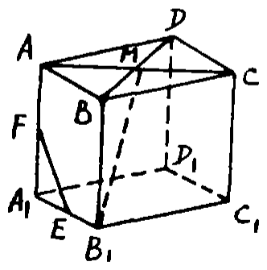
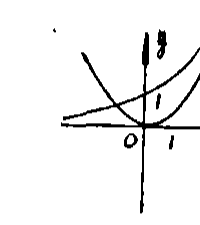
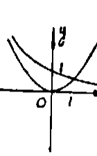
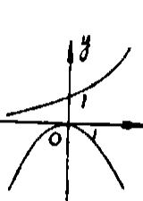
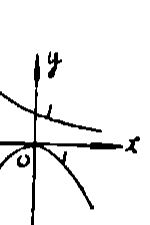
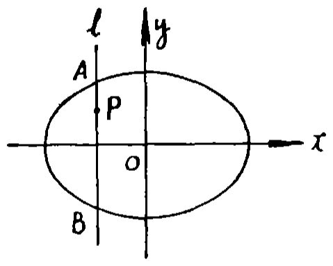
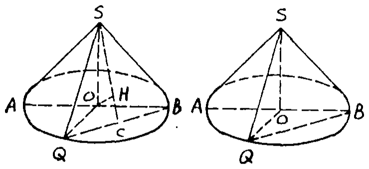
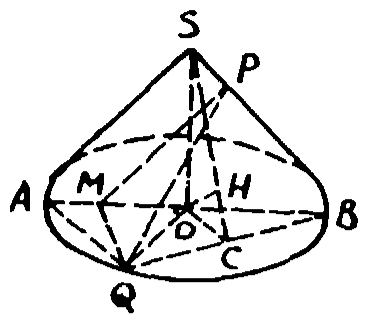
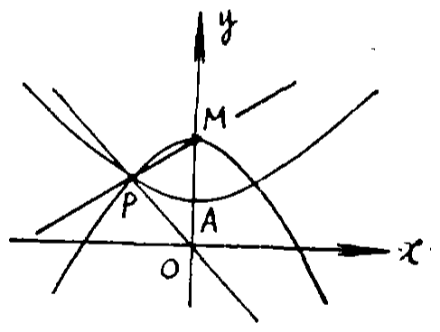

# 1992年上海卷

## 填空题

### 第 1 题

求值：$\cos \frac{5\pi}{8}\cos \frac{\pi}{8}=$＿＿＿＿＿＿.

#### 答案

$-\frac{\sqrt{2}}{4}$

#### 解析

利用积化和差公式，$\cos \frac{5\pi}{8}\cos \frac{\pi}{8}=\frac{1}{2}\left[\cos\left(\frac{5\pi}{8}+\frac{\pi}{8}\right)+\cos\left(\frac{5\pi}{8}-\frac{\pi}{8}\right)\right]=\frac{1}{2}\left(\cos\frac{3\pi}{4}+\cos\frac{\pi}{2}\right)=-\frac{\sqrt{2}}{4}$. 因此填空为 $-\frac{\sqrt{2}}{4}$.

### 第 2 题

$\left(x + \frac{1}{x}\right)^8$ 的展开式中 $\frac{1}{x^2}$ 的系数是＿＿＿＿＿＿（结果用数值表示）.

#### 答案

56

#### 解析

展开式的通项为 $\mathrm C_8^k x^{8-k}\left(\frac{1}{x}\right)^k=\mathrm C_8^k x^{8-2k}$. 要得到 $\frac{1}{x^2}=x^{-2}$，必须有 $8-2k=-2$，解得 $k=5$. 因此所求系数为 $\mathrm C_8^5=56$.

### 第 3 题

函数 $y = \sin^2 x - \sin x \cos x + \cos^2 x$ 的最大值是＿＿＿＿＿＿.

#### 答案

$\frac{3}{2}$

#### 解析

由 $\sin^2x+\cos^2x=1$ 及 $\sin x\cos x=\frac{1}{2}\sin 2x$，得 $y=1-\frac{1}{2}\sin 2x$. 因为 $-1\leqslant\sin 2x\leqslant1$，所以 $\frac{1}{2}\leqslant y\leqslant\frac{3}{2}$. 当 $\sin 2x=-1$ 时取得最大值，故最大值为 $\frac{3}{2}$.

### 第 4 题

方程 $\log_5(x+1)-\log_{\frac{1}{5}}(x-3)=1$ 的解是＿＿＿＿＿＿.

#### 答案

4

#### 解析

由对数的真数为正，得 $x+1>0$ 且 $x-3>0$，所以定义域要求 $x>3$. 又因为 $\log_{1/5}u=-\log_5u$，原方程化为 $\log_5(x+1)+\log_5(x-3)=1$. 因而 $(x+1)(x-3)=5$，即 $x^2-2x-8=0$，解得 $x=4$ 或 $x=-2$. 由 $x>3$ 舍去 $x=-2$，所以方程的解为 $x=4$.

### 第 5 题

计算 $(\sqrt{3} + \i)^6=$＿＿＿＿＿＿（$\i$ 是虚数单位）.

#### 答案

$-64$

#### 解析

复数 $\sqrt{3}+\i$ 的模为 $2$，辐角为 $\frac{\pi}{6}$，所以 $\sqrt{3}+\i=2\left(\cos\frac{\pi}{6}+\i\sin\frac{\pi}{6}\right)$. 由棣莫弗定理，$(\sqrt{3}+\i)^6=2^6\left(\cos\pi+\i\sin\pi\right)=-64$.

### 第 6 题

如果直线 $l$ 与直线 $x + y - 1 = 0$ 关于 $y$ 轴对称，那么直线 $l$ 的方程是＿＿＿＿＿＿.

#### 答案

$x - y + 1 = 0$

#### 解析

关于 $y$ 轴对称时，点 $(x,y)$ 变为 $(-x,y)$. 因此把直线 $x+y-1=0$ 中的 $x$ 换成 $-x$，得到对称直线的方程 $-x+y-1=0$，化简为 $x-y+1=0$.

### 第 7 题

已知圆台的下底面半径为 $8 \mathrm{~cm}$，高为 $6 \mathrm{~cm}$，母线与下底面成 $45^\circ$ 的角，那么圆台的侧面积是＿＿＿＿＿＿ $\mathrm{cm}^2$（结果中保留 $\pi$）.

#### 答案

$60\sqrt{2}\pi$

#### 解析

设圆台上底面半径为 $r$，母线长为 $l$. 在圆台的轴截面中，母线与下底面所成的角为 $45^\circ$，所以 $l\sin45^\circ=6$，从而 $l=6\sqrt{2}$. 母线在下底面内的投影长度为 $l\cos45^\circ=6$，故 $8-r=6$，即 $r=2$. 因此圆台的侧面积为 $\pi(8+2)\cdot6\sqrt{2}=60\sqrt{2}\pi\ \mathrm{cm}^2$，填入数值为 $60\sqrt{2}\pi$.

### 第 8 题

已知函数 $y = f(x)$ 的反函数是 $f^{-1}(x)=\sqrt{x}-1$（$x \geqslant 0$），那么函数 $y = f(x)$ 的定义域是＿＿＿＿＿＿.

#### 答案

$[-1,+\infty)$

#### 解析

函数 $f$ 的定义域等于其反函数 $f^{-1}$ 的值域. 由 $f^{-1}(x)=\sqrt{x}-1$ 且 $x\geqslant0$，有 $\sqrt{x}\geqslant0$，所以 $f^{-1}(x)\geqslant-1$. 当 $x$ 在 $[0,+\infty)$ 内取遍时，$\sqrt{x}-1$ 取遍 $[-1,+\infty)$，故 $f$ 的定义域为 $[-1,+\infty)$.

### 第 9 题

由 $1$，$2$，$3$，$4$，$5$ 组成比 $40000$ 小的没有重复数字的五位数的个数是＿＿＿＿＿＿（结果用数值表示）.

#### 答案

72

#### 解析

五位数小于 $40000$，其万位只能取 $1$，$2$ 或 $3$，共有 $3$ 种取法. 万位确定后，其余四位从剩下的四个数字中无重复地排列，共有 $4!$ 种取法. 因此所求个数为 $3\times4!=72$.

### 第 10 题

如图，直平行六面体 $ABCD-A_1B_1C_1D_1$ 的上底面 $ABCD$ 为菱形，$\angle BAD = 60^\circ$，侧面为正方形. $E$，$F$ 分别是 $A_1B_1$，$AA_1$ 的中点，$M$ 是 $AC$ 与 $BD$ 的交点，则 $EF$ 与 $B_1M$ 所成角的大小为＿＿＿＿＿＿（用反三角函数表示）.

#### 答案

$\arcsin \frac{\sqrt{6}}{4}$

#### 解析

设菱形边长为 $a$. 取 $A$ 为原点，令 $AB$ 沿 $x$ 轴，令 $AD$ 在底面内且与 $AB$ 成 $60^\circ$，并令竖直方向为 $z$ 轴，则可取 $A=(0,0,0)$，$B=(a,0,0)$，$D=\left(\frac{a}{2},\frac{\sqrt{3}a}{2},0\right)$. 由于侧面为正方形，$AA_1=a$，故 $E=\left(\frac{a}{2},0,a\right)$，$F=\left(0,0,\frac{a}{2}\right)$. 又 $M$ 是平行四边形对角线的交点，$M=\left(\frac{3a}{4},\frac{\sqrt{3}a}{4},0\right)$，$B_1=(a,0,a)$.

于是可取 $\overrightarrow{EF}=\left(\frac{a}{2},0,\frac{a}{2}\right)$，$\overrightarrow{B_1M}=\left(-\frac{a}{4},\frac{\sqrt{3}a}{4},-a\right)$. 因而 $\left|\overrightarrow{EF}\cdot\overrightarrow{B_1M}\right|=\frac{5a^2}{8}$，且 $|EF|=\frac{a}{\sqrt{2}}$，$|B_1M|=\frac{\sqrt{5}a}{2}$. 设两直线所成的锐角为 $\varphi$，则 $\cos\varphi=\frac{5a^2/8}{(a/\sqrt{2})(\sqrt{5}a/2)}=\frac{\sqrt{10}}{4}$. 所以 $\sin\varphi=\sqrt{1-\frac{10}{16}}=\frac{\sqrt{6}}{4}$，从而 $\varphi=\arcsin\frac{\sqrt{6}}{4}$.

## 单选题

### 第 11 题

当 $0 < a < 1$ 时，函数 $y = a^x$ 和 $y = (a - 1)x^2$ 的图象只可能是（）

A.  

B.  

C.  

D.  

#### 答案

D

#### 解析

因为 $0<a<1$，所以 $y=a^x$ 是过点 $(0,1)$ 的减函数，且始终在 $x$ 轴上方. 又因为 $a-1<0$，所以 $y=(a-1)x^2$ 是顶点在原点、开口向下的抛物线. 同时两图象在原点的相对位置和单调性必须符合上述性质，四个图形中只有选项 D 符合，故选 D.

### 第 12 题

下列函数中，在区间 $(0,1]$ 上为减函数的是（）

A.  
$y = \log_a x$

B.  
$y = x^a$

C.  
$y = \cos x$

D.  
$y = \arcsin x$

#### 答案

C

#### 解析

在 $(0,1]$ 上，$y=\cos x$ 的导数为 $y'=-\sin x<0$，所以它是减函数. 在 $(0,1)$ 上，$y=\arcsin x$ 的导数为 $\frac{1}{\sqrt{1-x^2}}>0$，并且在端点 $x=1$ 处连续延拓，所以它在 $(0,1]$ 上是增函数. 对于 $y=\log_a x$，其单调性随底数 $a$ 的取值而定，不能确定为减函数；在通常的参数范围 $a>0$ 下，$y=x^a$ 为增函数. 因此只有选项 C 符合，故选 C.

### 第 13 题

$\alpha$，$\beta$ 是两个不重合的平面，在下列条件中，可判定平面 $\alpha$ 与 $\beta$ 平行的是（）

A.  
$\alpha$，$\beta$ 都垂直平面 $\gamma$

B.  
$\alpha$ 内不共线的三点到 $\beta$ 的距离都相等

C.  
$l$，$m$ 是 $\alpha$ 内两条直线，且 $l \parallel \beta$，$m \parallel \beta$

D.  
$l$，$m$ 是两条异面直线，且 $l \parallel \alpha$，$m \parallel \alpha$，$l \parallel \beta$，$m \parallel \beta$

#### 答案

D

#### 解析

选项 A 中，两平面都垂直于同一平面时仍可能相交，不能判定平行. 选项 B 不充分，例如取 $\alpha:z=0$，$\beta:y=0$，则 $(0,1,0)$，$(1,1,0)$，$(0,-1,0)$ 是 $\alpha$ 内不共线的三点，且到 $\beta$ 的距离都为 $1$，但 $\alpha$ 与 $\beta$ 相交. 选项 C 中，$\alpha$ 内两条互相平行的直线可以同时平行于 $\beta$，而 $\alpha$ 与 $\beta$ 仍可能相交.

对于选项 D，若 $\alpha$ 与 $\beta$ 不平行，则它们的交线方向是两平面的方向所共有的唯一方向. 于是同时平行于 $\alpha$ 和 $\beta$ 的直线都必须具有这个方向，从而 $l$ 与 $m$ 互相平行，这与它们异面矛盾. 因此 $\alpha\parallel\beta$，故选 D.

### 第 14 题

下列函数中，最小正周期为 $\pi$ 的偶函数是（）

A.  
$y = \sin 2x$

B.  
$y = \cos \frac{x}{2}$

C.  
$y = \sin 2x + \cos 2x$

D.  
$y = \frac{1 - \tan^2 x}{1 + \tan^2 x}$

#### 答案

D

#### 解析

选项 A 的 $y=\sin2x$ 是奇函数，虽有最小正周期 $\pi$，但不是偶函数. 选项 B 的周期为 $4\pi$，不符合要求. 选项 C 的周期为 $\pi$，但含有 $\sin2x$ 项，且 $f(-x)=-\sin2x+\cos2x\ne f(x)$，不是偶函数. 选项 D 在其定义域内满足 $\frac{1-\tan^2x}{1+\tan^2x}=\cos2x$，所以是偶函数，且最小正周期为 $\pi$. 故选 D.

### 第 15 题

在方程

$$

\begin{cases}
x = \sin \theta,\\
y = \cos 2\theta
\end{cases}

$$

（$\theta$ 为参数）所表示的曲线上的一个点的坐标是（）

A.  
$(2,-7)$

B.  
$\left(\frac{1}{3}, \frac{2}{3}\right)$

C.  
$\left(\frac{1}{2}, \frac{1}{2}\right)$

D.  
$(1,0)$

#### 答案

C

#### 解析

由 $x=\sin\theta$，得 $\sin^2\theta=x^2$. 因而 $y=\cos2\theta=1-2\sin^2\theta=1-2x^2$，且必须有 $-1\leqslant x\leqslant1$. 逐项检验：$(2,-7)$ 的横坐标不满足范围；当 $x=\frac{1}{3}$ 时，$1-2x^2=\frac{7}{9}\ne\frac{2}{3}$；当 $x=\frac{1}{2}$ 时，$1-2x^2=\frac{1}{2}$；当 $x=1$ 时，$y=-1\ne0$. 因此只有 $\left(\frac{1}{2},\frac{1}{2}\right)$ 在曲线上，故选 C.

### 第 16 题

抛物线 $(y + 2)^2 = 4(x + 1)$ 的焦点坐标是（）

A.  
$(0,-2)$

B.  
$(2,2)$

C.  
$(1,-2)$

D.  
$(3,2)$

#### 答案

A

#### 解析

将方程写成标准形式 $\left(y-(-2)\right)^2=4\left(x-(-1)\right)$. 与 $(y-k)^2=4p(x-h)$ 对比，得 $h=-1$，$k=-2$，$p=1$. 所以焦点为 $(h+p,k)=(0,-2)$，故选 A.

### 第 17 题

下列命题中的真命题是（）

A.  
各侧面都是矩形的棱柱是长方体

B.  
有两个相邻侧面是矩形的棱柱是直棱柱

C.  
各侧面都是等腰三角形的四棱锥是正四棱锥

D.  
有两个面互相平行，其余四个面都是等腰梯形的六面体是四棱台

#### 答案

B

#### 解析

各侧面为矩形的棱柱可以是底面为三角形的直棱柱，不能因此断定是长方体，所以 A 错. 对于 B，两个相邻侧面为矩形，说明它们的公共侧棱分别垂直于底面内相交的两条底边；一条直线若垂直于同一平面内两条相交直线，就垂直于该平面，因此棱柱的侧棱垂直于底面，是直棱柱.

各侧面为等腰三角形不能保证四棱锥的底面为正方形且顶点在底面中心，所以 C 错. 两个平行面及其余四个等腰梯形也不足以保证各对应边按同一比例收缩，不能据此断定为四棱台，所以 D 错. 故真命题为 B.

### 第 18 题

函数 $y = \arccos \frac{1}{\sqrt{x}}$ 的值域是（）

A.  
$\left[0,\frac{\pi}{2}\right)$

B.  
$\left(0,\frac{\pi}{2}\right]$

C.  
$\left[0,\pi\right)$

D.  
$\left(0,\pi\right]$

#### 答案

A

#### 解析

要使反余弦有意义，必须有 $x>0$，且 $0<\frac{1}{\sqrt{x}}\leqslant1$. 这等价于 $x\geqslant1$. 当 $x=1$ 时，函数值为 $\arccos1=0$；当 $x\to+\infty$ 时，$\frac{1}{\sqrt{x}}\to0^+$，函数值趋近于 $\frac{\pi}{2}$ 但不能取到. 因此值域为 $\left[0,\frac{\pi}{2}\right)$，故选 A.

### 第 19 题

在极坐标系中，与圆 $\rho = 4\sin \theta$ 相切的一条直线的方程是（）

A.  
$\rho \sin \theta = 2$

B.  
$\rho \cos \theta = 2$

C.  
$\rho \cos \theta = 4$

D.  
$\rho \cos \theta = -4$

#### 答案

B

#### 解析

由极坐标与直角坐标的关系 $x=\rho\cos\theta$，$y=\rho\sin\theta$，将 $\rho=4\sin\theta$ 两边乘以 $\rho$，得 $\rho^2=4\rho\sin\theta$. 因而圆的方程为 $x^2+y^2=4y$，即 $x^2+(y-2)^2=4$. 这是圆心 $(0,2)$、半径 $2$ 的圆. 选项 B 为 $x=2$，它到圆心的距离为 $2$，所以是该圆的切线；其余选项均不是该圆的切线. 故选 B.

### 第 20 题

设集合 $M = \{x \mid x > 2\}$，$P = \{x \mid x < 3\}$，那么“$x \in M$ 或 $x \in P$”是“$x \in M \cap P$”的（）

A.  
充分条件但非必要条件

B.  
必要条件但非充分条件

C.  
充分必要条件

D.  
非充分条件也非必要条件

#### 答案

B

#### 解析

条件“$x\in M$ 或 $x\in P$”等价于 $x>2$ 或 $x<3$. 对任意实数 $x$，不可能同时有 $x\leqslant2$ 和 $x\geqslant3$，所以该条件恒成立. 而 $x\in M\cap P$ 等价于 $2<x<3$，它显然能推出前一个条件，但前一个条件不能推出 $2<x<3$，例如 $x=1$ 时前者成立而后者不成立. 因此前一个条件是后一个条件的必要但非充分条件，故选 B.

## 解答题

### 第 21 题

已知 $\cos 2\alpha = \frac{7}{25}$，$\alpha \in \left(0, \frac{\pi}{2}\right)$，$\sin \beta = -\frac{5}{13}$，$\beta \in \left(\pi, \frac{3\pi}{2}\right)$，求 $\alpha + \beta$（用反三角函数表示）.

#### 解析

由 $\cos 2\alpha = \frac{7}{25}$ 得 $\cos \alpha = \sqrt{\frac{1 + \cos 2\alpha}{2}} = \frac{4}{5}$，$\sin \alpha = \frac{3}{5}$. 又由 $\sin \beta = -\frac{5}{13}$ 且 $\beta \in \left(\pi,\frac{3\pi}{2}\right)$，得 $\cos \beta = -\sqrt{1 - \sin^2 \beta} = -\frac{12}{13}$. 所以 $\cos(\alpha + \beta) = \cos \alpha \cos \beta - \sin \alpha \sin \beta = -\frac{33}{65}$. 因为 $\alpha\in\left(0,\frac{\pi}{2}\right)$，$\beta\in\left(\pi,\frac{3\pi}{2}\right)$，所以 $\pi<\alpha+\beta<2\pi$. 又因余弦值为负，得 $\pi<\alpha+\beta<\frac{3\pi}{2}$. 令 $\varphi=\arccos\frac{33}{65}$，则 $0<\varphi<\frac{\pi}{2}$，且 $\cos(\pi+\varphi)=-\frac{33}{65}$，故 $\alpha+\beta=\pi+\arccos\frac{33}{65}$.

### 第 22 题

设 $w = z + a\i$，其中 $a$ 是实数，$z = \frac{(1 - 4\i)(1 + \i) + 2 + 4\i}{3 + 4\i}$，且 $|w| \leqslant \sqrt{2}$，求 $w$ 的辐角主值 $\theta$ 的取值范围.

#### 解析

先化简

$$

z = \dfrac{(1 - 4\i)(1 + \i) + 2 + 4\i}{3 + 4\i}
= \dfrac{7 + \i}{3 + 4\i}
= 1 - \i

$$

. 于是 $w = z + a\i = 1 + (a - 1)\i$. 由 $|w| \leqslant \sqrt{2}$ 得 $\sqrt{1 + (a - 1)^2} \leqslant \sqrt{2}$，所以 $0 \leqslant a \leqslant 2$. 又因 $w$ 的实部恒为正，按辐角主值取 $\theta\in[0,2\pi)$ 时有 $\tan\theta=a-1$，故 $-1\leqslant\tan\theta\leqslant1$. 当 $0\leqslant a\leqslant1$ 时，$w$ 位于第四象限或正实轴上，$\theta\in\left[\frac{7\pi}{4},2\pi\right)$；当 $1\leqslant a\leqslant2$ 时，$w$ 位于第一象限或正实轴上，$\theta\in\left[0,\frac{\pi}{4}\right]$. 因此 $\theta$ 的取值范围是 $\left[0,\frac{\pi}{4}\right] \cup \left[\frac{7\pi}{4},2\pi\right)$.

### 第 23 题

设动直线 $l$ 垂直于 $x$ 轴，且与椭圆 $\frac{x^2}{4} + \frac{y^2}{2} = 1$ 交于 $A$，$B$ 两点，$P$ 是 $l$ 上满足 $|PA| \cdot |PB| = 1$ 的点，求点 $P$ 的轨迹方程，并说明轨迹是什么图形.

#### 解析

设点 $P$ 的坐标为 $(x,y)$，点 $A$ 的坐标为 $(x,y_1)$，则点 $B$ 的坐标为 $(x,-y_1)$. 因为 $A$，$B$ 两点在椭圆上，所以 $\dfrac{x^2}{4} + \dfrac{y_1^2}{2} = 1$（$\textcircled{1}$）.

又由 $\textcircled{1}$ 得 $-2 < x < 2$. 由题意，$|PA| = |y_1 - y|$，$|PB| = |y_1 + y|$，且 $|PA|\cdot|PB| = 1$，于是 $|y_1 - y|\cdot|y_1 + y| = 1$，即 $y_1^2 - y^2 = \pm 1$. 若 $y_1^2 = y^2 + 1$，代入 $\textcircled{1}$ 得 $\frac{x^2}{2} + y^2 = 1$. 若 $y_1^2 = y^2 - 1$，代入 $\textcircled{1}$ 得 $\frac{x^2}{6} + \frac{y^2}{3} = 1$（$-2 < x < 2$）. 因此，点 $P$ 的轨迹是椭圆 $\frac{x^2}{2} + y^2 = 1$，以及椭圆 $\frac{x^2}{6} + \frac{y^2}{3} = 1$ 夹在两直线 $x = 2$ 与 $x = -2$ 之间的部分.

### 第 24 题

如图，圆锥的轴截面为等腰直角三角形 $SAB$，$Q$ 为底面圆周上一点.

1.  如果 $QB$ 的中点为 $C$，$OH \perp SC$，求证 $OH \perp$ 平面 $SBQ$；

2.  如果 $\angle AOQ = 60^{\circ}$，$QB = 2\sqrt{3}$，求此圆锥的体积；

3.  如果二面角 $A-SB-Q$ 的大小为 $\arctan \frac{\sqrt{6}}{3}$，求 $\angle AOQ$ 的大小.

#### 解析

1.  连接 $OC$. 因为 $SQ = SB$，且 $C$ 是 $QB$ 的中点，所以在等腰三角形 $SQB$ 中有 $QB \perp SC$. 又因为 $OQ = OB$，且 $C$ 是 $QB$ 的中点，所以在等腰三角形 $OQB$ 中有 $QB \perp OC$. 直线 $SC$ 与 $OC$ 是平面 $SOC$ 内相交的两条直线，故 $QB \perp$ 平面 $SOC$. 又因 $OH\subset$ 平面 $SOC$，所以 $QB\perp OH$. 已知 $OH\perp SC$，而 $SC$ 与 $QB$ 是平面 $SBQ$ 内相交的两条直线，因此 $OH\perp$ 平面 $SBQ$.

2.  连接 $AQ$. 因为 $Q$ 为圆周上一点，$AB$ 为直径，所以 $AQ\perp QB$. 又已知 $\angle AOQ=60^{\circ}$，由同弧所对的圆周角等于圆心角的一半，得 $\angle QBA=30^{\circ}$. 在 $\mathrm{Rt}\triangle AQB$ 中，$QB=2\sqrt{3}$，故 $AB=\frac{2\sqrt{3}}{\cos30^{\circ}}=4$. 三角形 $SAB$ 是以 $S$ 为直角顶点的等腰直角三角形，$O$ 是斜边 $AB$ 的中点，所以 $SO=OA=\frac{1}{2}AB=2$. 故圆锥体积 $V=\frac{1}{3}\pi\cdot OA^2\cdot SO=\frac{8}{3}\pi$.

3.  过 $Q$ 作 $QM\perp AB$，垂足为 $M$. 因平面 $SAB\perp$ 平面 $ABQ$，且 $QM$ 在平面 $ABQ$ 内垂直于交线 $AB$，故 $QM\perp$ 平面 $SAB$. 再过 $M$ 作 $MP\perp SB$，垂足为 $P$，连接 $PQ$，则由三垂线定理可得 $QP\perp SB$. 因此 $\angle MPQ$ 是二面角 $A-SB-Q$ 的平面角，故 $\angle MPQ=\arctan\frac{\sqrt{6}}{3}$. 设圆锥底面半径为 $R$，$\angle AOQ=\alpha$. 在 $\mathrm{Rt}\triangle OMQ$ 中，$QM=R\sin\alpha$，$OM=R\cos\alpha$. 在 $\mathrm{Rt}\triangle MPB$ 中，$\angle PBM=45^{\circ}$，且 $MB=R(1+\cos\alpha)$，故 $MP=\frac{\sqrt{2}}{2}R(1+\cos\alpha)$. 因为 $\triangle MPQ$ 在 $P$ 处的两边分别垂直于 $SB$，二面角的正切为 $\frac{QM}{MP}$，所以 $\frac{R\sin\alpha}{\frac{\sqrt{2}}{2}R(1+\cos\alpha)}=\frac{\sqrt{6}}{3}$，即 $\frac{\sin\alpha}{1+\cos\alpha}=\frac{\sqrt{3}}{3}$. 由半角公式，$\tan\frac{\alpha}{2}=\frac{\sin\alpha}{1+\cos\alpha}=\frac{\sqrt{3}}{3}$. 因 $0<\alpha<\pi$，故 $\alpha=\frac{\pi}{3}=60^{\circ}$.

### 第 25 题

已知数列 $\{a_n\}$，$a_n > 0$（$n \in \mathbb{N}$），它的前 $n$ 项的和记为 $S_n$.

1.  如果 $\{a_n\}$ 是一个首项为 $a$，公比为 $q$（$0 < q \leqslant 1$）的等比数列，且 $G_n = a_1^2 + a_2^2 + \cdots + a_n^2$（$n \in \mathbb{N}$），求 $\displaystyle\lim_{n \to \infty} \frac{S_n}{G_n}$；

2.  如果 $S_1^2$，$S_2^2$，$\cdots$，$S_n^2$，$\cdots$ 是一个首项为 3，公差为 1 的等差数列，试比较 $S_n$ 与 $3na_n$（$n \in \mathbb{N}$）的大小.

#### 解析

1.  当 $q=1$ 时，$S_n=na$，$G_n=na^2$，且 $a>0$，所以 $\displaystyle\lim_{n\to\infty}\frac{S_n}{G_n}=\frac{1}{a}$. 当 $0<q<1$ 时，$S_n=\frac{a(1-q^n)}{1-q}$，故 $\displaystyle\lim_{n\to\infty}S_n=\frac{a}{1-q}$. 又 $a_n^2$ 是首项为 $a^2$、公比为 $q^2$ 的等比数列，所以 $G_n=\frac{a^2(1-q^{2n})}{1-q^2}$，从而 $\displaystyle\lim_{n\to\infty}G_n=\frac{a^2}{1-q^2}$. 因此 $\displaystyle\lim_{n\to\infty}\frac{S_n}{G_n}=\frac{a/(1-q)}{a^2/(1-q^2)}=\frac{1+q}{a}$. 综上，

$$

\displaystyle\lim_{n\to\infty}\frac{S_n}{G_n}=\begin{cases}
    \frac{1}{a}, & q=1,\\
    \frac{1+q}{a}, & 0<q<1.
    \end{cases}

$$

2.  由题设知 $S_1=a_1=\sqrt{3}$，且 $S_n^2$ 是首项为 $3$、公差为 $1$ 的等差数列，所以 $S_n^2=3+(n-1)=n+2$. 因为 $a_n>0$，从而 $S_n>0$，故 $S_n=\sqrt{n+2}$. 当 $n\geqslant2$ 时，$a_n=S_n-S_{n-1}=\sqrt{n+2}-\sqrt{n+1}$.

    当 $n=1$ 时，$S_1=\sqrt{3}<3\sqrt{3}=3a_1$. 当 $n\geqslant2$ 时，令 $U=3n\sqrt{n+1}$，$V=(3n-1)\sqrt{n+2}$，则 $U>0$，$V>0$，且 $S_n-3na_n=U-V$. 于是 $U-V$ 与 $U^2-V^2$ 同号，而 $U^2-V^2=9n^2(n+1)-(3n-1)^2(n+2)=-3n^2+11n-2=-3\left(n-\frac{11-\sqrt{97}}{6}\right)\left(n-\frac{11+\sqrt{97}}{6}\right)$.

    由于 $\frac{11-\sqrt{97}}{6}<1$，且 $3<\frac{11+\sqrt{97}}{6}<4$，所以当 $n=2$，$3$ 时 $U^2-V^2>0$，当 $n\geqslant4$ 时 $U^2-V^2<0$. 因此当 $n=2$，$3$ 时 $S_n>3na_n$，当 $n\geqslant4$ 时 $S_n<3na_n$. 结合 $n=1$ 的结论，得当 $n=1$ 及 $n\geqslant4$ 时 $S_n<3na_n$，当 $n=2$，$3$ 时 $S_n>3na_n$.

### 第 26 题

如图，已知双曲线 $C: (1 - a^2)x^2 + a^2y^2 - a^2 = 0$（参数 $a > 0$）. 若 $C$ 的上半支的顶点为 $A$，且与直线 $y = -x$ 交于点 $P$. 以 $A$ 为焦点，$M(0,m)$ 为顶点的开口向下的抛物线通过点 $P$. 当 $C$ 的一条渐近线的斜率在区间 $\left[\frac{\sqrt{3}}{2}, \frac{2\sqrt{2}}{3}\right]$ 上变化时，求直线 $PM$ 斜率的最大值.

#### 解析

因为 $(1 - a^2)x^2 + a^2y^2 - a^2 = 0$ 是双曲线，所以 $1-a^2<0$，从而它可化为 $y^2-\frac{a^2-1}{a^2}x^2=1$. 双曲线的两条渐近线的斜率为 $\pm \frac{\sqrt{a^2 - 1}}{a}$. 于是 $\frac{\sqrt{3}}{2} \leqslant \frac{\sqrt{a^2 - 1}}{a} \leqslant \frac{2\sqrt{2}}{3}$，即 $4 \leqslant a^2 \leqslant 9$，又由 $a > 0$ 得 $a$ 的取值范围是 $[2,3]$. 把 $y = -x$ 代入双曲线方程，得点 $P$ 的坐标为 $(-a,a)$. 双曲线上半支的顶点为 $A(0,1)$. 以 $A(0,1)$ 为焦点，$M(0,m)$ 为顶点的开口向下的抛物线方程为 $x^2 = -4(m - 1)(y - m)$. 因为 $P(-a,a)$ 在抛物线上，所以 $a^2 = -4(m - 1)(a - m)$（$\textcircled{1}$）. 即 $m^2 - (1 + a)m + \left(a - \frac{a^2}{4}\right) = 0$. 解得 $m = \dfrac{1}{2}\left(1 + a \pm \sqrt{1 - 2a + 2a^2}\right)$， 根据题设抛物线的顶点位置，由 $\textcircled{1}$ 可知 $m > 1$，$m > a$，所以 $m > \dfrac{1 + a}{2}$. 因此只取 $m = \dfrac{1}{2}\left(1 + a + \sqrt{1 - 2a + 2a^2}\right)$. 直线 $PM$ 的斜率为 $k = \dfrac{m - a}{0 - (-a)} = \dfrac{1}{2a}\left(1 - a + \sqrt{1 - 2a + 2a^2}\right)$（$\textcircled{2}$）. 在 $\textcircled{2}$ 中，令 $u = \dfrac{1}{a}$，有 $k = \dfrac{1}{2}\left(u - 1 + \sqrt{u^2 - 2u + 2}\right) = \dfrac{1}{2}\left[\sqrt{(1 - u)^2 + 1} - (1 - u)\right] = \dfrac{1}{2}\frac{1}{\sqrt{(1 - u)^2 + 1} + (1 - u)}$. 在 $[2,3]$ 上，$u$ 是减函数，$1 - u$ 是增函数. 由 $1 - u > 0$，可知 $(1 - u)^2$ 也是增函数，从而 $k$ 在 $[2,3]$ 上是减函数. 故当 $a = 2$ 时，$k$ 取得最大值 $k_{\max} = \dfrac{\sqrt{5} - 1}{4}$.
