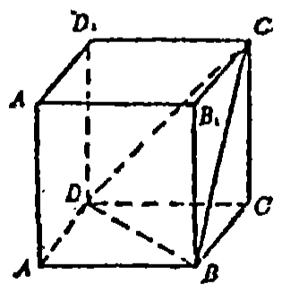
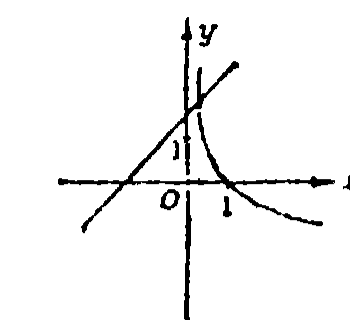
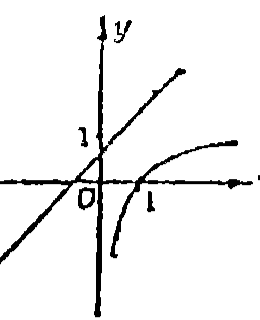
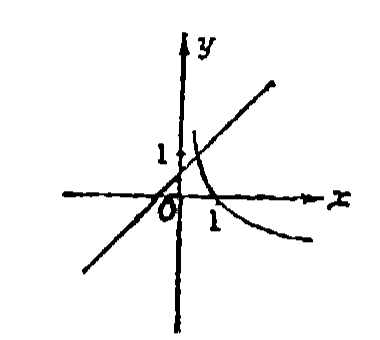
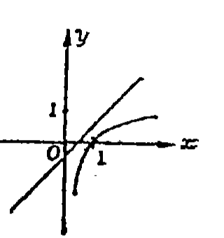
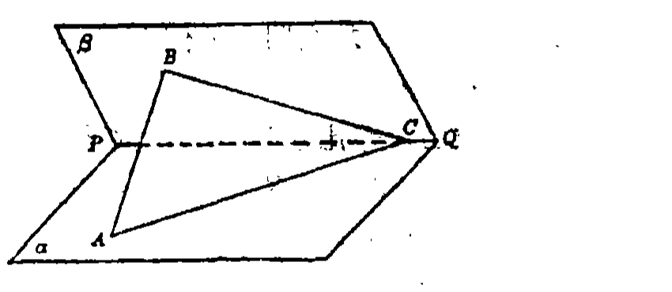
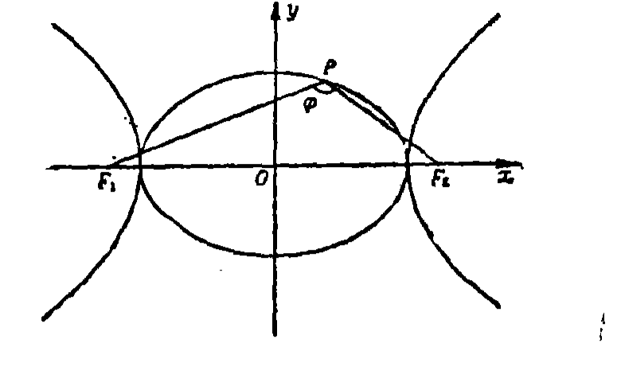

# 1993年上海卷

## 填空题

### 第 1 题

函数 $y = x^2 - 2x + 3$ 的最小值是＿＿＿＿＿＿.

#### 答案

2

#### 解析

配方得 $y=x^2-2x+3=(x-1)^2+2$. 因为 $(x-1)^2\geqslant 0$，所以 $y\geqslant 2$，当 $x=1$ 时取等号，故最小值为 $2$.

### 第 2 题

函数 $y = \cos^2(\omega x)$（$\omega > 0$）的最小正周期是＿＿＿＿＿＿.

#### 答案

$\frac{\pi}{\omega}$

#### 解析

由二倍角公式，$\cos^2(\omega x)=\frac{1+\cos(2\omega x)}{2}$. 因为 $\omega>0$，$\cos(2\omega x)$ 的最小正周期为 $\frac{\pi}{\omega}$，加上常数和乘以非零常数不改变周期，所以原函数的最小正周期为 $\frac{\pi}{\omega}$.

### 第 3 题

设 $z = \cos \frac{7\pi}{5} + \i \sin \frac{7\pi}{5}$，$\i$ 是虚数单位，则 $z$ 的辐角主值是＿＿＿＿＿＿.

#### 答案

$\frac{7\pi}{5}$

#### 解析

题中复数已经写成三角形式 $z=\cos\frac{7\pi}{5}+\i\sin\frac{7\pi}{5}$. 按本卷复数辐角主值的约定 $0\leqslant\arg z<2\pi$，且 $\frac{7\pi}{5}$ 属于该区间，故 $\arg z=\frac{7\pi}{5}$.

### 第 4 题

$1\text{ 名}$老师和$4\text{ 名}$获奖同学排成一排照相留念，若老师不排在两端，则共有不同排法＿＿＿＿＿＿$\text{种}$（结果用数值表示）.

#### 答案

72

#### 解析

老师不能排在两端，因此老师有第 $2$、第 $3$、第 $4$ 个位置，共有 $3$ 种选法. 每确定老师的位置后，$4$ 名同学任意排列，有 $4!=24$ 种排法. 所以不同排法共有 $3\times 4!=72$ 种.

### 第 5 题

函数 $y = \arccos x$（$-1 \leqslant x \leqslant 0$）的反函数是＿＿＿＿＿＿.

#### 答案

$y = \cos x$（$\frac{\pi}{2} \leqslant x \leqslant \pi$）

#### 解析

原函数为 $y=\arccos x$，其定义域为 $[-1,0]$，值域为 $\left[\frac{\pi}{2},\pi\right]$. 交换自变量和因变量，得到反函数 $y=\cos x$，并且其定义域为原函数的值域 $\left[\frac{\pi}{2},\pi\right]$，故反函数为 $y=\cos x$，$\frac{\pi}{2}\leqslant x\leqslant\pi$.

### 第 6 题

$P$ 点分 $\overline{AB}$ 所成的比是 $-3$，则 $B$ 点分 $\overline{AP}$ 所成的比是＿＿＿＿＿＿.

#### 答案

2

#### 解析

取有向线段 $\overline{AP}$ 和 $\overline{PB}$ 的方向分别为从 $A$ 到 $P$、从 $P$ 到 $B$，则 $\frac{\overline{AP}}{\overline{PB}}=-3$. 设 $\overline{AP}=t\overline{AB}$，则 $\overline{PB}=(1-t)\overline{AB}$，从而 $\frac{t}{1-t}=-3$，解得 $t=\frac{3}{2}$. 因而 $P$ 在 $B$ 的外侧，且 $\overline{BP}=\frac{1}{2}\overline{AB}$. 所以 $B$ 分 $\overline{AP}$ 所成的比为 $\frac{\overline{AB}}{\overline{BP}}=2$.

### 第 7 题

已知圆台的上、下底面半径分别是 $10 \mathrm{~cm}$ 和 $20 \mathrm{~cm}$，它的侧面展开后所得扇环的圆心角是 $180^{\circ}$，那么圆台的侧面积是＿＿＿＿＿＿ $\mathrm{cm}^{2}$（结果中保留 $\pi$）.

#### 答案

$600\pi$

#### 解析

设扇环的内、外半径分别为 $l_1$、$l_2$. 扇环圆心角为 $\pi$，内弧长和外弧长分别等于圆台上、下底面的周长，因此 $\pi l_1=2\pi\times 10$，$\pi l_2=2\pi\times 20$，解得 $l_1=20$，$l_2=40$. 圆台侧面积等于扇环面积，所以

$$

S=\frac{\pi}{2}\left(l_2^2-l_1^2\right)=\frac{\pi}{2}\left(40^2-20^2\right)=600\pi

$$

故圆台的侧面积为 $600\pi\ \mathrm{cm}^{2}$.

### 第 8 题

已知等比数列 $\{a_n\}$（$a_n \in \mathbb{R}$），$a_1 + a_2 = 9$，$a_1 \cdot a_2 \cdot a_3 = 27$，且 $S_n = a_1 + a_2 + \cdots + a_n$（$n = 1$，$2$，$\cdots$），则 $\displaystyle\lim_{n \to \infty} S_n =$＿＿＿＿＿＿.

#### 答案

12

#### 解析

设等比数列的公比为 $q$，则 $a_2=a_1q$，且 $a_1a_2a_3=a_1^3q^3=(a_1q)^3=a_2^3=27$. 因为 $a_2\in\mathbb{R}$，故 $a_2=3$. 由 $a_1+a_2=9$ 得 $a_1=6$，于是 $q=\frac{a_2}{a_1}=\frac{1}{2}$. 由于 $|q|<1$，无穷等比级数收敛，且

$$

\lim_{n\to\infty}S_n=\frac{a_1}{1-q}=\frac{6}{1-\frac{1}{2}}=12

$$

### 第 9 题

在极坐标系中，过点 $M\left(2, \frac{\pi}{2}\right)$ 且平行于极轴的直线的极坐标方程是＿＿＿＿＿＿.

#### 答案

$\rho \sin \theta = 2$

#### 解析

极坐标与直角坐标的关系为 $x=\rho\cos\theta$，$y=\rho\sin\theta$. 点 $M\left(2,\frac{\pi}{2}\right)$ 的直角坐标为 $(0,2)$，过该点且平行于极轴的直线是 $y=2$. 因而其极坐标方程为 $\rho\sin\theta=2$.

### 第 10 题

如图，正方体 $ABCD - A_1B_1C_1D_1$ 中，过顶点 $B$，$D$，$C_1$ 作截面，则二面角 $B - DC_1 - C$ 的大小是＿＿＿＿＿＿（用反三角函数表示）.

#### 答案

$\arccos \frac{\sqrt{3}}{3}$

#### 解析

取正方体棱长为 $1$，建立坐标系 $A(0,0,0)$、$B(1,0,0)$、$C(1,1,0)$、$D(0,1,0)$、$C_1(1,1,1)$. 二面角 $B-DC_1-C$ 的两个面分别为平面 $BDC_1$ 和平面 $DCC_1$.

在平面 $BDC_1$ 内，取 $\overrightarrow{DC_1}=(1,0,1)$、$\overrightarrow{DB}=(1,-1,0)$，则该平面的一个法向量为 $\boldsymbol{n}_1=\overrightarrow{DC_1}\times\overrightarrow{DB}=(1,1,-1)$. 平面 $DCC_1$ 是 $y=1$，其法向量可取 $\boldsymbol{n}_2=(0,1,0)$. 因此两平面所成的较小角 $\varphi$ 满足

$$

\cos\varphi=\frac{|\boldsymbol{n}_1\cdot\boldsymbol{n}_2|}{|\boldsymbol{n}_1||\boldsymbol{n}_2|}=\frac{1}{\sqrt{3}}=\frac{\sqrt{3}}{3}

$$

故二面角的大小为 $\arccos\frac{\sqrt{3}}{3}$.

## 单选题

### 第 11 题

函数 $y = x + a$ 与 $y = \log_a x$ 的图象可能是（）

A.  

B.  

C.  

D.  

#### 答案

C

#### 解析

由对数函数的定义，必须有 $a>0$ 且 $a\neq 1$. 曲线 $y=\log_a x$ 的定义域为 $x>0$，经过点 $(1,0)$，并以 $x=0$ 为渐近线；当 $a>1$ 时它递增且向下凸，当 $0<a<1$ 时它递减且向上凸. 直线 $y=x+a$ 的斜率为 $1$，与两坐标轴的交点分别为 $(0,a)$ 和 $(-a,0)$. 对照四个图象，只有第三个图象同时满足对数曲线的渐近线、经过点 $(1,0)$ 及单调性，并满足直线的截距关系，故正确选项为第三项.

### 第 12 题

$(x - 1)^{9}$ 按 $x$ 降幂排列的展开式中，系数最大的项是（）

A.  
第4项和第5项

B.  
第5项

C.  
第5项和第6项

D.  
第6项

#### 答案

B

#### 解析

按 $x$ 的降幂排列，二项式通项为 $T_{k+1}=\mathrm C_9^k x^{9-k}(-1)^k$，其中 $k=0$，$1$，$\ldots$，$9$. 只有 $k$ 为偶数时系数为正；这些正系数依次为 $\mathrm C_9^0=1$、$\mathrm C_9^2=36$、$\mathrm C_9^4=126$、$\mathrm C_9^6=84$、$\mathrm C_9^8=9$. 最大系数为 $126$，对应 $k=4$，即第 $5$ 项，故第 $5$ 项正确.

### 第 13 题

在区间 $(0, +\infty)$ 上为增函数的是（）

A.  
$y = \operatorname{arccot} x$

B.  
$y = \log_{\frac{1}{2}} x$

C.  
$y = -2^{x}$

D.  
$y = x^{\frac{1}{3}}$

#### 答案

D

#### 解析

在 $(0,+\infty)$ 上，$y=\operatorname{arccot}x$ 为减函数，$y=\log_{\frac12}x$ 的底数小于 $1$，为减函数，$y=-2^x$ 也是减函数. 而 $y=x^{\frac13}$ 的导数为 $y'=\frac{1}{3x^{\frac23}}>0$，所以它在 $(0,+\infty)$ 上为增函数，故第 $4$ 个选项正确.

### 第 14 题

下列不等式中正确的是（）

A.  
$\arcsin \left(-\frac{1}{4}\right) < \arcsin \left(-\frac{1}{3}\right)$

B.  
$\arccos \left(-\frac{1}{4}\right) < \arccos \frac{1}{3}$

C.  
$\arctan \frac{1}{4} < \arcsin \frac{1}{4}$

D.  
$\operatorname{arccot} \frac{1}{3} < \arctan \frac{1}{3}$

#### 答案

C

#### 解析

反正弦函数在 $[-1,1]$ 上递增，而 $-\frac14>-\frac13$，所以 $\arcsin\left(-\frac14\right)>\arcsin\left(-\frac13\right)$，选项 A 错. 反余弦函数在 $[-1,1]$ 上递减，而 $-\frac14<\frac13$，所以 $\arccos\left(-\frac14\right)>\arccos\frac13$，选项 B 错.

设 $\alpha=\arctan\frac14$，$\beta=\arcsin\frac14$. 则 $\alpha$、$\beta\in\left(0,\frac\pi2\right)$，且 $\tan\alpha=\frac14$，$\tan\beta=\frac{1/4}{\sqrt{1-1/16}}=\frac{1}{\sqrt{15}}$. 因为 $\sqrt{15}<4$，所以 $\frac{1}{\sqrt{15}} > \frac14$，从而 $\beta>\alpha$，选项 C 正确.

对 $t>0$，有 $\operatorname{arccot}t=\frac\pi2-\arctan t$，且 $0<\arctan\frac13<\frac\pi4$，故 $\operatorname{arccot}\frac13>\arctan\frac13$，选项 D 错. 因此选 C.

### 第 15 题

动点 $P$ 到直线 $x + 4 = 0$ 的距离减去它到点 $M(2,0)$ 的距离之差等于$2$，则点 $P$ 的轨迹是（）

A.  
直线

B.  
椭圆

C.  
双曲线

D.  
抛物线

#### 答案

D

#### 解析

设动点为 $P(x,y)$. 由题意，

$$

\sqrt{(x-2)^2+y^2}=|x+4|-2

$$

因此必须有 $|x+4|\geqslant 2$. 当 $x\geqslant-4$ 时，条件化为 $x\geqslant-2$，平方并整理得 $(x-2)^2+y^2=(x+2)^2$，$\Longrightarrow$，$y^2=8x$. 该方程本身要求 $x\geqslant0$，所以这一支全部满足原条件. 当 $x<-4$ 时，条件要求 $x\leqslant-6$，平方得 $(x-2)^2+y^2=(-x-6)^2$，$\Longrightarrow$，$y^2=16(x+2)<0$ 不可能有实数点. 故轨迹为抛物线 $y^2=8x$，选 $D$.

### 第 16 题

设有三个命题：

1.  底面是平行四边形的四棱柱是平行六面体；

2.  底面是矩形的平行六面体是长方体；

3.  直四棱柱是直平行六面体.

以上命题中真命题的个数是（）

A.  
0

B.  
1

C.  
2

D.  
3

#### 答案

B

#### 解析

命题甲正确：四棱柱的两个底面平行且全等，若底面是平行四边形，则四个侧面也都是平行四边形，所以它是平行六面体.

命题乙不一定正确. 平行六面体的一个底面可以是矩形，但侧棱不必垂直于底面，因此不一定是长方体.

命题丙不一定正确. 直四棱柱只保证侧棱垂直于底面，底面四边形不一定是平行四边形，因此不一定是直平行六面体. 所以真命题只有 $1$ 个，选 $B$.

### 第 17 题

在直角坐标系中平移坐标轴，把原点 $O(0,0)$ 移到 $O'(2,-5)$，点 $A$ 在新坐标系中的坐标为 $(-3,7)$，则点 $A$ 在原坐标系中的坐标是（）

A.  
$(-1,2)$

B.  
$(1,-2)$

C.  
$(-5,12)$

D.  
$(5,-12)$

#### 答案

A

#### 解析

平移坐标轴只改变原点位置，不改变坐标轴方向. 新原点 $O'(2,-5)$ 在原坐标系中的坐标为 $(2,-5)$，而点 $A$ 从新原点出发的坐标向量为 $(-3,7)$. 因此

$$

\overrightarrow{OA}=\overrightarrow{OO'}+\overrightarrow{O'A}=(2,-5)+(-3,7)=(-1,2)

$$

故点 $A$ 在原坐标系中的坐标为 $(-1,2)$，选 $A$.

### 第 18 题

设 $a$，$b$ 是两条异面直线. 在下列命题中正确的是（）

A.  
有且仅有一条直线与 $a$，$b$ 都垂直

B.  
有一平面与 $a$，$b$ 都垂直

C.  
过直线 $a$ 有且仅有一平面与 $b$ 平行

D.  
过空间中任一点必可作一条直线与 $a$，$b$ 都相交

#### 答案

C

#### 解析

取直线 $a$ 上任一点 $A$，过 $A$ 作直线 $b'\parallel b$. 因为 $a$、$b$ 是异面直线，二者方向不平行，故直线 $a$ 与 $b'$ 唯一确定一个平面 $\pi$，且 $\pi\parallel b$. 若另有一个过直线 $a$ 且平行于 $b$ 的平面，则它也必须包含过 $A$ 的平行于 $b$ 的直线，因而与 $\pi$ 重合，所以该平面唯一.

选项 A 错：设 $m$ 是 $a$、$b$ 的公垂线，则所有与 $m$ 平行的直线都分别与 $a$、$b$ 垂直，故不可能只有一条. 选项 B 错：若平面同时垂直于 $a$、$b$，则 $a$、$b$ 的方向都应平行于该平面的法向量，从而 $a\parallel b$，与异面矛盾. 选项 D 也不成立：取过 $a$ 且平行于 $b$ 的平面 $\pi$ 内、但不在 $a$ 上的一点 $X$. 任取过 $X$ 且与 $a$ 相交的直线，它的交点和 $X$ 都在 $\pi$ 内，故整条直线在 $\pi$ 内；而 $b\parallel\pi$ 且 $b$ 不在 $\pi$ 内，所以该直线不可能与 $b$ 相交. 故选 C.

### 第 19 题

函数 $y = \cos \left(2x + \frac{\pi}{2}\right)$ 的图象的一条对称轴方程是（）

A.  
$x = -\frac{\pi}{2}$

B.  
$x = -\frac{\pi}{4}$

C.  
$x = \frac{\pi}{8}$

D.  
$x = \pi$

#### 答案

B

#### 解析

函数可写为 $y=\cos\left(2x+\frac\pi2\right)=-\sin 2x$. 对于余弦函数，对称轴经过其极大值点或极小值点. 极大值点满足 $2x+\frac\pi2=2k\pi$，从而 $x=-\frac\pi4+k\pi$，其中 $k\in\mathbb{Z}$. 因此 $x=-\frac\pi4$ 是一条对称轴，选 $B$.

### 第 20 题

$a + b > 2c$ 的一个充分条件是（）

A.  
$a > c$ 或 $b > c$

B.  
$a > c$ 且 $b < c$

C.  
$a > c$ 且 $b > c$

D.  
$a > c$ 或 $b < c$

#### 答案

C

#### 解析

若 $a>c$ 且 $b>c$，则两式相加得到 $a+b>2c$，所以选项 C 是充分条件.

其余选项都不能保证结论：只满足 $a>c$ 或只满足 $b<c$ 时，另一个数可以取得足够小，使 $a+b\leqslant2c$；选项 B 也没有保证 $b>c$. 故选 C.

## 解答题

### 第 21 题

已知角 $\alpha$ 的顶点与直角坐标系的原点重合，始边在 $x$ 轴的正半轴上，终边经过点 $P(-1,2)$，求 $\sin \left(2\alpha + \frac{2\pi}{3}\right)$ 的值.

#### 解析

因为 $r = |OP| = \sqrt{(-1)^2 + 2^2} = \sqrt{5}$，所以 $\sin \alpha = \frac{2}{\sqrt{5}}$，$\cos \alpha = -\frac{1}{\sqrt{5}}$. 因而 $\sin 2\alpha = 2\sin \alpha\cos \alpha = -\frac{4}{5}$， $\cos 2\alpha = 1 - 2\sin^2\alpha = -\frac{3}{5}$. 所以

$$

\sin\left(2\alpha + \frac{2\pi}{3}\right)
= \sin 2\alpha\cos\frac{2\pi}{3} + \cos 2\alpha\sin\frac{2\pi}{3}
= \frac{4 - 3\sqrt{3}}{10}

$$

### 第 22 题

已知 $z = \frac{a - \i}{1 - \i}$，其中 $\i$ 为虚数单位，$a > 0$，复数 $w = z(z + \i)$ 的虚部减去它的实部所得的差等于 $\frac{3}{2}$，求复数 $w$ 的模.

#### 解析

$w = \frac{a - \i}{1 - \i}\left(\frac{a - \i}{1 - \i} + \i\right) = \frac{(a - \i)(a + 1)}{(1 - \i)^2} = \frac{a + 1}{2}(1 + a\i)$. 由已知条件，$\frac{a + 1}{2}a - \frac{a + 1}{2} = \frac{3}{2}$，即 $a^2 = 4$. 由已知 $a > 0$，故 $a = 2$. 于是 $|w| = \left|\frac{3}{2} + 3\i\right| = \frac{3}{2}\sqrt{5}$.

### 第 23 题

抛物线 $y = -\frac{x^2}{2}$ 与过点 $M(0,-1)$ 的直线 $l$ 相交于 $A$，$B$ 两点，$O$ 为坐标原点. 若直线 $OA$ 与 $OB$ 的斜率之和为 $1$，求直线 $l$ 的方程.

#### 解析

设点 $A$ 和点 $B$ 的坐标分别为 $(x_1,y_1)$ 和 $(x_2,y_2)$. 由条件可设直线 $l$ 的方程为 $y = kx - 1$. 设直线 $OA$ 和 $OB$ 的斜率分别为 $k_{OA}$ 和 $k_{OB}$，则由条件有 $k_{OA} + k_{OB} = \frac{y_1}{x_1} + \frac{y_2}{x_2} = 1$. 由于 $y_1 = -\frac{x_1^2}{2}$，$y_2 = -\frac{x_2^2}{2}$，故代入上式后得 $-\frac{1}{2}(x_1 + x_2) = 1$. 于是

$$

k = \frac{y_2 - y_1}{x_2 - x_1} = \frac{\left(-\frac{x_2^2}{2}\right) - \left(-\frac{x_1^2}{2}\right)}{x_2 - x_1} = -\frac{1}{2}(x_1 + x_2) = 1

$$

因此直线 $l$ 的方程为 $y = x - 1$.

代入抛物线方程得 $x^2+2x-2=0$，其判别式为 $12>0$，故直线 $y=x-1$ 确实与抛物线交于两个不同的实点，所求直线有效.

### 第 24 题

如图，已知二面角 $\alpha - PQ - \beta$ 为 $60^{\circ}$，点 $A$ 和点 $B$ 分别在平面 $\alpha$ 和平面 $\beta$ 上，点 $C$ 在棱 $PQ$ 上，$\angle ACP = \angle BCP = 30^{\circ}$，$CA = CB = a$.

1.  求证 $AB \perp PQ$.

2.  求点 $B$ 到平面 $\alpha$ 的距离.

3.  设 $R$ 是线段 $CA$ 上的一点，直线 $BR$ 与平面 $\alpha$ 所成角的大小为 $45^{\circ}$，求线段 $CR$ 的长度.

#### 解析

1.  在平面 $\beta$ 内作 $BD \perp PQ$，垂足为 $D$，连接 $AD$. 因 $\angle BCD = \angle ACD$，且 $BC = AC$，$DC$ 为公共边，故 $\triangle BCD \cong \triangle ACD$，所以 $AD \perp PQ$. 于是 $PQ \perp$ 平面 $ABD$，故 $AB \perp PQ$.

2.  因 $BD \perp PQ$，$AD \perp PQ$，故 $\angle ADB$ 为二面角 $\alpha - PQ - \beta$ 的平面角，$\angle ADB = 60^{\circ}$. 在 $\mathrm{Rt}\triangle BCD$ 中，因为 $BC = a$，$\angle BCD = 30^{\circ}$，所以 $BD = \frac{1}{2}a$. 过 $B$ 作 $BH \perp AD$，$H$ 为垂足. 因为 $PQ \perp$ 平面 $ABD$，所以平面 $ABD \perp \alpha$，$BH \perp \alpha$. 于是点 $B$ 到平面 $\alpha$ 的距离为 $BH = BD \cdot \sin 60^{\circ} = \frac{\sqrt{3}}{4}a$.

3.  连接 $HR$. 因 $BH \perp \alpha$，故 $\angle BRH$ 是 $BR$ 与平面 $\alpha$ 所成的角，$\angle BRH = 45^{\circ}$. 因 $BH = \frac{\sqrt{3}}{4}a$，故 $BR = \frac{\sqrt{6}}{4}a$. 在 $\triangle ABD$ 中，$AD = BD$，$\angle ADB = 60^{\circ}$，所以 $\triangle ABD$ 为正三角形，$AB = BD = \frac{a}{2}$. 在 $\triangle ABC$ 中，$AC = BC = a$，由余弦定理得 $\cos \angle BCA = \frac{a^2 + a^2 - \left(\frac{a}{2}\right)^2}{2 \cdot a \cdot a} = \frac{7}{8}$. 在 $\triangle BCR$ 中，设 $x = CR$，由余弦定理得 $\left(\frac{\sqrt{6}}{4}a\right)^2 = x^2 + a^2 - 2ax \cdot \frac{7}{8}$， 即 $8x^2 - 14ax + 5a^2 = 0$. 所以 $x_1 = \frac{1}{2}a$，$x_2 = \frac{5}{4}a$. 由于 $\frac{5}{4}a > a$，故 $x_2 = \frac{5}{4}a$ 舍去. 因此 $CR$ 的长为 $\frac{1}{2}a$.

### 第 25 题

设数列 $\{a_n\}$ 的前 $n$ 项和 $S_n = na + n(n - 1)b$（$n = 1$，$2$，$\cdots$），$a$，$b$ 是常数且 $b \neq 0$.

1.  证明 $\{a_n\}$ 是等差数列.

2.  证明以 $\left(a_n, \frac{S_n}{n} - 1\right)$ 为坐标的点 $P_n$（$n = 1$，$2$，$\cdots$）都落在同一条直线上，并写出此直线的方程.

3.  设 $a = 1$，$b = \frac{1}{2}$，$C$ 是以 $(r,r)$ 为圆心，$r$ 为半径的圆（$r > 0$）. 求使得点 $P_1$，$P_2$，$P_3$ 都落在圆 $C$ 外时，$r$ 的取值范围.

#### 解析

1.  由条件得 $a_1 = S_1 = a$. 当 $n \geqslant 2$ 时，有

$$

a_n = S_n - S_{n - 1} = \left[na + n(n - 1)b\right] - \left[(n - 1)a + (n - 1)(n - 2)b\right] = a + 2(n - 1)b

$$

    因此，当 $n \geqslant 2$ 时，$a_n - a_{n - 1} = \left[a + 2(n - 1)b\right] - \left[a + 2(n - 2)b\right] = 2b$. 因此，$\{a_n\}$ 是以 $a$ 为首项，$2b$ 为公差的等差数列.

2.  因为 $b \neq 0$，对于 $n \geqslant 2$，有

$$

\frac{\left(\frac{S_n}{n} - 1\right) - \left(\frac{S_1}{1} - 1\right)}{a_n - a_1}
    = \frac{\frac{na + n(n - 1)b}{n} - a}{a + 2(n - 1)b - a}
    = \frac{(n - 1)b}{2(n - 1)b}
    = \frac{1}{2}

$$

    因此，所有的点 $P_n\left(a_n,\frac{S_n}{n} - 1\right)$（$n = 1$，$2$，$\cdots$）都落在通过 $P_1(a,a - 1)$ 且以 $\frac{1}{2}$ 为斜率的直线上. 此直线方程为 $y - (a - 1) = \frac{1}{2}(x - a)$，即 $x - 2y + a - 2 = 0$.

3.  当 $a = 1$，$b = \frac{1}{2}$ 时，$P_n$ 的坐标为 $\left(n,\frac{n - 1}{2}\right)$. 使 $P_1(1,0)$，$P_2\left(2,\frac{1}{2}\right)$，$P_3(3,1)$ 都落在圆 $C$ 外的条件是

$$

\begin{cases}
    (r - 1)^2 + r^2 > r^2,\\
    (r - 2)^2 + \left(r - \frac{1}{2}\right)^2 > r^2,\\
    (r - 3)^2 + (r - 1)^2 > r^2.
    \end{cases}

$$

    即等价于

$$

\begin{cases}
    (r - 1)^2 > 0,\\
    r^2 - 5r + \frac{17}{4} > 0,\\
    r^2 - 8r + 10 > 0.
    \end{cases}

$$

    由第一个不等式，得 $r \neq 1$；由第二个不等式，得 $r < \frac{5}{2} - \sqrt{2}$ 或 $r > \frac{5}{2} + \sqrt{2}$；由第三个不等式，得 $r < 4 - \sqrt{6}$ 或 $r > 4 + \sqrt{6}$. 再注意到 $r > 0$，且

$$

1 < \frac{5}{2} - \sqrt{2} < 4 - \sqrt{6} < \frac{5}{2} + \sqrt{2} < 4 + \sqrt{6}

$$

    故使 $P_1$，$P_2$，$P_3$ 都落在圆 $C$ 外时，$r$ 的取值范围是 $(0,1) \cup \left(1,\frac{5}{2} - \sqrt{2}\right) \cup (4 + \sqrt{6}, +\infty)$.

### 第 26 题

如图，$P$ 为椭圆 $\frac{x^2}{a^2} + y^2 = 1$ 上的一个动点，它与长轴端点不重合，$a \geqslant \sqrt{2}$，点 $F_1$ 和点 $F_2$ 分别是双曲线 $\frac{x^2}{a^2} - y^2 = 1$ 的左焦点和右焦点，$\varphi = \angle F_1PF_2$.

1.  求 $\tan\varphi$ 的表达式（用 $a$ 及描述点 $P$ 位置的一个变量来表示）.

2.  当 $a$ 固定时，求 $\varphi$ 的最小值 $\varphi_0$.

3.  当 $a$ 在区间 $[\sqrt{2}, \sqrt{3}]$ 上变化时，求 $\varphi_0$ 的取值范围.

#### 解析

1.  双曲线的半焦距 $c = \sqrt{a^2 + 1}$，焦点为 $F_1(-\sqrt{a^2 + 1},0)$ 和 $F_2(\sqrt{a^2 + 1},0)$. 设 $P(x_0,y_0)$ 为椭圆上一点，与长轴的端点 $A_1$ 及 $A_2$ 不重合，由对称性，不妨设 $0 < y_0 \leqslant 1$.

    作 $PH \perp F_1F_2$，垂足为 $H$. 记 $\alpha = \angle F_1PH$，$\beta = \angle HPF_2$，则 $\varphi = \alpha + \beta$. 因 $\tan \alpha = \frac{x_0 + \sqrt{a^2 + 1}}{y_0}$，$\tan \beta = \frac{\sqrt{a^2 + 1} - x_0}{y_0}$， 故

$$

\tan \varphi
    = \tan(\alpha + \beta)
    = \frac{\tan \alpha + \tan \beta}{1 - \tan \alpha \cdot \tan \beta}
    = \frac{2\sqrt{a^2 + 1} \cdot y_0}{x_0^2 + y_0^2 - (a^2 + 1)}

$$

    由于 $P(x_0,y_0)$ 在椭圆上，$x_0^2 = a^2(1 - y_0^2)$，故 $\tan \varphi = -\frac{2\sqrt{a^2 + 1} \cdot y_0}{(a^2 - 1)y_0^2 + 1}$.

2.  由于 $a \geqslant \sqrt{2}$，故 $a^2 - 1 \geqslant 1$，$\tan \varphi < 0$，$\frac{\pi}{2} < \varphi < \pi$. 又

$$

\tan(\pi - \varphi)
    = \frac{2\sqrt{a^2 + 1} \cdot y_0}{(a^2 - 1)y_0^2 + 1}
    = \frac{2\sqrt{a^2 + 1}}{(a^2 - 1)y_0 + \frac{1}{y_0}}
    \leqslant \sqrt{\frac{a^2 + 1}{a^2 - 1}}

$$

    当且仅当 $(a^2 - 1)y_0 = \frac{1}{y_0}$，即 $y_0 = \frac{1}{\sqrt{a^2 - 1}} \leqslant 1$ 时取“$=$”号. 由于 $0 < \pi - \varphi < \frac{\pi}{2}$，且正切函数在 $\left(0,\frac{\pi}{2}\right)$ 内是增函数，故有 $\pi - \varphi \leqslant \arctan\sqrt{\frac{a^2 + 1}{a^2 - 1}}$. 于是 $\varphi \geqslant \pi - \arctan\sqrt{\frac{a^2 + 1}{a^2 - 1}}$， 从而 $\varphi_0 = \pi - \arctan\sqrt{\frac{a^2 + 1}{a^2 - 1}}$.

3.  $\varphi_0 = \pi - \arctan\sqrt{1 + \frac{2}{a^2 - 1}}$. 由 $\sqrt{2} \leqslant a \leqslant \sqrt{3}$，故 $2 \leqslant a^2 \leqslant 3$，$1 \leqslant a^2 - 1 \leqslant 2$，于是 $1 \leqslant \frac{2}{a^2 - 1} \leqslant 2$，$2 \leqslant 1 + \frac{2}{a^2 - 1} \leqslant 3$， $\sqrt{2} \leqslant \sqrt{1 + \frac{2}{a^2 - 1}} \leqslant \sqrt{3}$. 由反正切函数单调性，

$$

\arctan\sqrt{2} \leqslant \arctan\sqrt{1 + \frac{2}{a^2 - 1}} \leqslant \arctan\sqrt{3} = \frac{\pi}{3}

$$

    于是 $\frac{2\pi}{3} \leqslant \varphi_0 \leqslant \pi - \arctan\sqrt{2}$. 故 $\varphi_0$ 的取值范围是 $\left[\frac{2\pi}{3}, \pi - \arctan\sqrt{2}\right]$.
