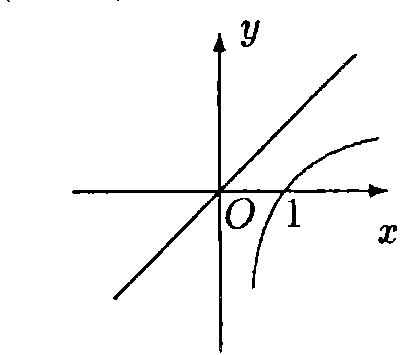
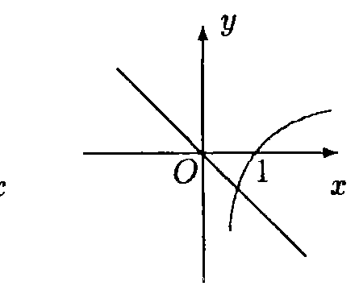
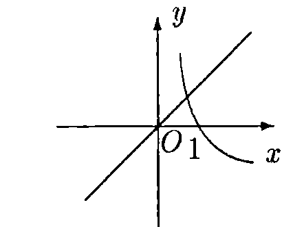
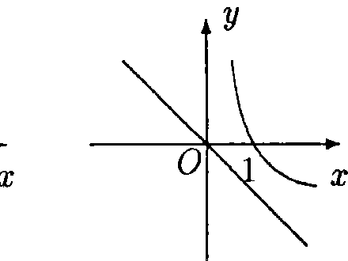
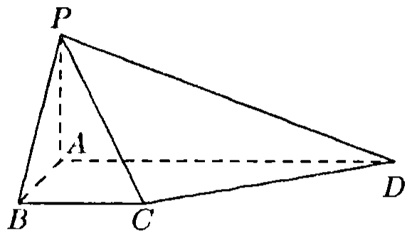
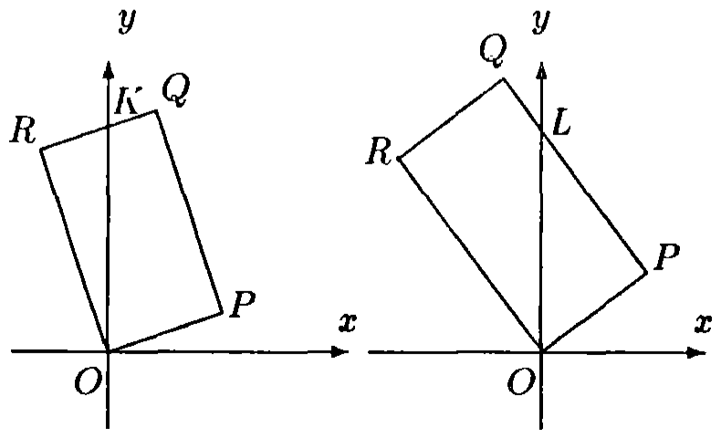

# 1994年上海卷

## 填空题

### 第 1 题

不等式 $|x + 1| < 1$ 的解是＿＿＿＿＿＿.

#### 答案

$-2 < x < 0$

#### 解析

由绝对值不等式的等价关系，$-1 < x + 1 < 1$，所以$-2 < x < 0$.

### 第 2 题

计算： $\sin \left(\frac{1}{2} \arccos \frac{1}{8}\right) =$＿＿＿＿＿＿.

#### 答案

$\frac{\sqrt{7}}{4}$

#### 解析

令$\theta=\arccos\frac{1}{8}$，则$\theta\in[0,\pi]$，且$\cos\theta=\frac{1}{8}$.因此$\theta/2\in[0,\pi/2]$，由半角公式得 $\sin\frac{\theta}{2}=\sqrt{\frac{1-\cos\theta}{2}}=\sqrt{\frac{1-\frac{1}{8}}{2}}=\sqrt{\frac{7}{16}}=\frac{\sqrt{7}}{4}$.

### 第 3 题

以点 $C(-2,3)$ 为圆心且与 $y$ 轴相切的圆的方程是＿＿＿＿＿＿.

#### 答案

$(x + 2)^2 + (y - 3)^2 = 4$

#### 解析

圆心为$C(-2,3)$，圆与$y$轴相切，所以半径等于圆心到$y$轴的距离，即$r=|-2|=2$.由圆的标准方程得$(x+2)^2+(y-3)^2=2^2$，即$(x+2)^2+(y-3)^2=4$.

### 第 4 题

方程 $\log_3(x - 1) = \log_9(x + 5)$ 的解是＿＿＿＿＿＿.

#### 答案

$x = 4$

#### 解析

定义域要求$x-1>0$，即$x>1$.因为$\log_9 u=\frac{1}{2}\log_3u$，原方程等价于$2\log_3(x-1)=\log_3(x+5)$，从而$(x-1)^2=x+5$.解得$x^2-3x-4=0$，即$x=4$或$x=-1$.其中$x=-1$不满足定义域，故原方程的解为$x=4$.

### 第 5 题

有一个实心圆锥体的零部件，它的轴截面是边长为 $10\mathrm{~cm}$ 的等边三角形. 现要在它的整个表面镀上一层防腐材料，已知每平方厘米的工料价为 $0.10$ 元，则需要费用＿＿＿＿＿＿ 元（$\pi$ 取 $3.2$）.

#### 答案

$24$

#### 解析

轴截面是边长为$10\mathrm{~cm}$的等边三角形，所以圆锥的母线长为$l=10\mathrm{~cm}$，底面直径为$10\mathrm{~cm}$，从而底面半径为$r=5\mathrm{~cm}$.圆锥的整个表面积为侧面积与底面积之和：$S=\pi rl+\pi r^2=\pi\cdot5\cdot10+\pi\cdot5^2=75\pi$.取$\pi=3.2$，得$S=240\mathrm{~cm^2}$.每平方厘米费用为$0.10$元，因此总费用为$240\times0.10=24$元.

### 第 6 题

函数 $y = \sqrt{x^2 - 1}$（$x \leqslant -1$）的反函数是＿＿＿＿＿＿.

#### 答案

$y = -\sqrt{x^2 + 1}$（$x \geqslant 0$）

#### 解析

原函数的定义域为$x\leqslant-1$，值域为$y\geqslant0$.由$y=\sqrt{x^2-1}$得$x^2=y^2+1$，结合原定义域取负号，得到$x=-\sqrt{y^2+1}$.交换$x$，$y$并注明原值域，反函数为$y=-\sqrt{x^2+1}$，定义域为$x\geqslant0$.

### 第 7 题

双曲线 $\frac{y^2}{2} - x^2 = 1$ 的两个焦点的坐标是＿＿＿＿＿＿.

#### 答案

$(0,\sqrt{3})$ 和 $(0,-\sqrt{3})$

#### 解析

将方程写成标准形式$\frac{y^2}{2}-\frac{x^2}{1}=1$.这是焦点在$y$轴上的双曲线，其中$a^2=2$，$b^2=1$，所以$c^2=a^2+b^2=3$，即$c=\sqrt{3}$.因此两个焦点的坐标为$(0,\sqrt{3})$和$(0,-\sqrt{3})$.

### 第 8 题

$\left(x^{3} - \frac{2}{x^{2}}\right)^{5}$ 的展开式中，$x^{5}$ 的系数是（结果用数值表示）＿＿＿＿＿＿.

#### 答案

$40$

#### 解析

展开式的通项为$\mathrm C_5^k(x^3)^{5-k}\left(-\frac{2}{x^2}\right)^k=\mathrm C_5^k(-2)^k x^{15-5k}$.要得到$x^5$，需满足$15-5k=5$，所以$k=2$.因此$x^5$的系数为$\mathrm C_5^2(-2)^2=10\times4=40$.

### 第 9 题

函数 $y = \sin 2x - 2\cos^2 x$ 的最大值是＿＿＿＿＿＿.

#### 答案

$\sqrt{2} - 1$

#### 解析

利用$2\cos^2x=1+\cos2x$，有$y=\sin2x-1-\cos2x$.又$\sin2x-\cos2x=\sqrt{2}\sin\left(2x-\frac{\pi}{4}\right)$，故$y=\sqrt{2}\sin\left(2x-\frac{\pi}{4}\right)-1\leqslant\sqrt{2}-1$.当$\sin\left(2x-\frac{\pi}{4}\right)=1$时等号成立，所以函数的最大值为$\sqrt{2}-1$.

### 第 10 题

函数 $y = \frac{\sin 2x + \sin\left(2x + \frac{\pi}{3}\right)}{\cos 2x + \cos\left(2x + \frac{\pi}{3}\right)}$ 的最小正周期是＿＿＿＿＿＿.

#### 答案

$\frac{\pi}{2}$

#### 解析

由和差化积公式，分子为$2\sin\left(2x+\frac{\pi}{6}\right)\cos\frac{\pi}{6}$，分母为$2\cos\left(2x+\frac{\pi}{6}\right)\cos\frac{\pi}{6}$.在分母不为零的定义域内，函数化为$y=\tan\left(2x+\frac{\pi}{6}\right)$.正切函数的最小正周期为$\pi$，所以原函数的最小正周期满足$2T=\pi$，即$T=\frac{\pi}{2}$.

## 单选题

### 第 11 题

当 $a > 1$ 时，函数 $y = \log_a x$ 和 $y = (1 - a)x$ 的图象只可能是（）

A.  

B.  

C.  

D.  

#### 答案

B

#### 解析

当$a>1$时，$y=\log_a x$是定义域为$x>0$的增函数，经过点$(1,0)$，且在$x=0$处有竖直渐近线.直线$y=(1-a)x$的斜率$1-a<0$，且经过原点.因此两图象的相对位置只能符合选项 B.

### 第 12 题

如果 $0 < a < 1$，那么下列不等式中正确的是（）

A.  
$(1 - a)^{\frac{1}{3}} > (1 - a)^{\frac{1}{2}}$

B.  
$\log_{(1 - a)}(1 + a) > 0$

C.  
$(1 - a)^{3} > (1 + a)^{2}$

D.  
$(1 - a)^{1 + a} > 1$

#### 答案

A

#### 解析

令$c=1-a$，则$0<c<1$.由于底数在$(0,1)$内时幂函数随指数增大而减小，且$\frac{1}{3}<\frac{1}{2}$，所以$c^{1/3}>c^{1/2}$，选项 A 正确.又$1+a>1$，以小于$1$的数为底的对数为负，故 B 错；$0<(1-a)^3<1<(1+a)^2$，故 C 错；正指数幂$(1-a)^{1+a}<1$，故 D 错.

### 第 13 题

已知点 $P$ 的极坐标为 $(1, \pi)$，那么过点 $P$ 且垂直于极轴的直线的极坐标方程为（）

A.  
$\rho = 1$

B.  
$\rho = \cos \theta$

C.  
$\rho = -\frac{1}{\cos\theta}$

D.  
$\rho = \frac{1}{\cos\theta}$

#### 答案

C

#### 解析

极坐标$(1,\pi)$对应直角坐标$P(-1,0)$.过$P$且垂直于极轴（即$x$轴）的直线为$x=-1$.极坐标中$x=\rho\cos\theta$，所以其方程为$\rho\cos\theta=-1$，即$\rho=-\frac{1}{\cos\theta}$，选 C.

### 第 14 题

已知 $a$，$b$ 是异面直线，直线 $c$ 平行于直线 $a$，那么 $c$ 与 $b$（）

A.  
一定是异面直线

B.  
一定是相交直线

C.  
不可能是平行直线

D.  
不可能是相交直线

#### 答案

C

#### 解析

若$c$与$b$平行，由于$c\parallel a$，将得到$a\parallel b$，这与$a$，$b$为异面直线矛盾，因此$c$不可能与$b$平行.另一方面，过$b$上任一点作一条平行于$a$的直线即可使$c$与$b$相交，所以不能断言二者一定异面或一定相交.故选 C.

### 第 15 题

设 $I$ 是全集，集合 $P$，$Q$ 满足 $P \subset Q$，则下面的结论中错误的是（）

A.  
$P \cup Q = Q$

B.  
$\overline{P} \cup Q = I$

C.  
$P \cap \overline{Q} = \varnothing$

D.  
$\overline{P} \cap \overline{Q} = \overline{P}$

#### 答案

D

#### 解析

由$P\subset Q$，有$P\cup Q=Q$，所以 A 正确；若元素不属于$P$，则属于$\overline P$，若属于$P$，又因$P\subset Q$而属于$Q$，故$\overline P\cup Q=I$，B 正确；$P$与$\overline Q$没有公共元素，故$P\cap\overline Q=\varnothing$，C 正确.又$P\subset Q$推出$\overline Q\subset\overline P$，所以$\overline P\cap\overline Q=\overline Q$，一般不等于$\overline P$，因此第四项是错误结论.

### 第 16 题

设复数 $z = -\frac{1}{2} + \frac{\sqrt{3}}{2}\i$（$\i$ 为虚数单位），则满足等式 $z^n = z$，且大于 $1$ 的正整数 $n$ 中最小的是（）

A.  
$3$

B.  
$4$

C.  
$6$

D.  
$7$

#### 答案

B

#### 解析

复数$z=-\frac{1}{2}+\frac{\sqrt3}{2}\i$的模为$1$，辐角为$\frac{2\pi}{3}$，即$z=\cos\frac{2\pi}{3}+\i\sin\frac{2\pi}{3}$.条件$z^n=z$等价于$z^{n-1}=1$.由于$z$的乘法阶为$3$，故$3\mid n-1$.大于$1$的正整数中最小的满足者为$n=4$，选 B.

### 第 17 题

设 $a$，$b$ 是平面 $\alpha$ 外的任意两条线段，则“$a$，$b$ 的长相等”是“$a$，$b$ 在平面 $\alpha$ 内的射影长相等”的（）

A.  
非充分条件也非必要条件

B.  
充分必要条件

C.  
必要条件而非充分条件

D.  
充分条件而非必要条件

#### 答案

A

#### 解析

设线段与平面$\alpha$的夹角分别为$\theta_a$，$\theta_b$，则射影长分别为$|a|\cos\theta_a$，$|b|\cos\theta_b$.即使$|a|=|b|$，若$\theta_a\ne\theta_b$，射影长也可以不同.例如在平面$z=0$外取方向向量$(1,0,1)$和$\left(\sqrt{\frac32},0,\frac{1}{\sqrt2}\right)$，二者长度都为$\sqrt2$，而射影长度分别为$1$和$\sqrt{\frac32}$，所以前者不是后者的充分条件；反过来射影长相等时，线段本身的长度也可以不同，例如取方向向量分别为$(1,0,1)$和$(1,0,2)$，它们在平面$z=0$上的射影长度都为$1$，而线段长度分别为$\sqrt2$和$\sqrt5$，所以前者也不是后者的必要条件.故选 A.

### 第 18 题

计划在某画廊展出$10$幅不同的画，其中$1$幅水彩画，$4$幅油画，$5$幅国画，排成一行陈列，要求同一品种的画必须连在一起，并且水彩画不放在两端，那么不同陈列方式有（）

A.  
$\mathrm A_4^4 \cdot \mathrm A_5^5$ 种

B.  
$\mathrm A_3^3 \cdot \mathrm A_4^4 \cdot \mathrm A_5^5$ 种

C.  
$\mathrm C_3^1 \cdot \mathrm A_4^4 \cdot \mathrm A_5^5$ 种

D.  
$\mathrm A_2^2 \cdot \mathrm A_4^4 \cdot \mathrm A_5^5$ 种

#### 答案

D

#### 解析

将同一品种的画看成一个整体，则水彩画、油画、国画三个整体的排列方式为$3!$.水彩画不能放在两端，所以水彩画整体只能放在中间；油画和国画两个整体有$2!$种排列.油画内部有$4!$种排列，国画内部有$5!$种排列.因此总数为$2!\cdot4!\cdot5!=\mathrm A_2^2\cdot\mathrm A_4^4\cdot\mathrm A_5^5$，选 D.

### 第 19 题

在直角坐标系 $xOy$ 中，曲线 $C$ 的方程是 $y = \cos x$. 现平移坐标系，把原点移到点 $O'\left(\frac{\pi}{2}, -\frac{\pi}{2}\right)$，则在坐标系 $x'O'y'$ 中，曲线 $C$ 的方程是（）

A.  
$y' = \sin x' + \frac{\pi}{2}$

B.  
$y' = -\sin x' + \frac{\pi}{2}$

C.  
$y' = \sin x' - \frac{\pi}{2}$

D.  
$y' = -\sin x' - \frac{\pi}{2}$

#### 答案

B

#### 解析

平移坐标系后，新旧坐标满足$x=x'+\frac{\pi}{2}$，$y=y'-\frac{\pi}{2}$.代入原方程$y=\cos x$，得$y'-\frac{\pi}{2}=\cos\left(x'+\frac{\pi}{2}\right)=-\sin x'$，所以$y'=-\sin x'+\frac{\pi}{2}$，选 B.

### 第 20 题

某个命题与自然数 $n$ 有关. 如果当 $n = k$（$k \in \mathbb{N}$）时该命题成立，那么可推得当 $n = k + 1$ 时该命题也成立. 现已知当 $n = 5$ 时该命题不成立，那么可推得（）

A.  
当 $n = 6$ 时该命题不成立

B.  
当 $n = 6$ 时该命题成立

C.  
当 $n = 4$ 时该命题不成立

D.  
当 $n = 4$ 时该命题成立

#### 答案

C

#### 解析

设该命题为$P(n)$.已知对任意自然数$k$，$P(k)\mathbb{R}ightarrow P(k+1)$，其逆否命题为$\neg P(k+1)\mathbb{R}ightarrow\neg P(k)$.由已知$\neg P(5)$，取$k=4$，得到$\neg P(4)$，即当$n=4$时该命题不成立，选 C.由条件不能推出$n=6$时的真假.

## 解答题

### 第 21 题

已知 $\sin \alpha = \frac{3}{5}$，$\alpha \in \left(\frac{\pi}{2}, \pi\right)$，$\tan(\pi - \beta) = \frac{1}{2}$，求 $\tan(\alpha - 2\beta)$ 的值.

#### 解析

因为$\alpha\in\left(\frac{\pi}{2},\pi\right)$，所以$\cos\alpha<0$.由$\sin^2\alpha+\cos^2\alpha=1$，得$\cos\alpha=-\frac{4}{5}$，从而$\tan\alpha=-\frac{3}{4}$.又$\tan(\pi-\beta)=-\tan\beta=\frac{1}{2}$，所以$\tan\beta=-\frac{1}{2}$.因此

$$

\tan2\beta=\frac{2\tan\beta}{1-\tan^2\beta}=\frac{2\left(-\frac{1}{2}\right)}{1-\left(-\frac{1}{2}\right)^2}=-\frac{4}{3}

$$

于是分母$1+\tan\alpha\tan2\beta=1+\left(-\frac{3}{4}\right)\left(-\frac{4}{3}\right)=2\ne0$，故

$$

\tan(\alpha-2\beta)=\frac{\tan\alpha-\tan2\beta}{1+\tan\alpha\tan2\beta}=\frac{-\frac{3}{4}+\frac{4}{3}}{2}=\frac{7}{24}

$$

### 第 22 题

设 $w$ 为复数. 它的辐角的主值为 $\frac{3\pi}{4}$，且 $\frac{\left(\overline{w}\right)^2 - 4}{w}$ 为实数，求复数 $w$.

#### 解析

设$w=a+b\i$，其中$a$，$b\in\mathbb{R}$.辐角主值为$\frac{3\pi}{4}$说明$w$在第二象限，且其虚部与实部的绝对值相等，因此$b=-a$，$a<0$.于是$w=a(1-\i)$，$\overline w=a(1+\i)$，从而

$$

\frac{(\overline w)^2-4}{w}=\frac{a^2(1+\i)^2-4}{a(1-\i)}=\frac{2a^2\i-4}{a(1-\i)}=-\frac{a^2+2}{a}+\frac{a^2-2}{a}\i

$$

该复数为实数，当且仅当虚部为零，即$\frac{a^2-2}{a}=0$.因为$a<0$，所以$a=-\sqrt2$，进而$b=\sqrt2$.因此 $w=-\sqrt2+\sqrt2\i$.

### 第 23 题

如图，在梯形 $ABCD$ 中，$AD \parallel BC$，$\angle ABC = \frac{\pi}{2}$，$AB = a$，$AD = 3a$，且 $\angle ADC = \arcsin \frac{\sqrt{5}}{5}$，又 $PA \perp$ 平面 $ABCD$，$PA = a$. 求：

1.  二面角 $P-CD-A$ 的大小（用反三角函数表示）；

2.  点 $A$ 到平面 $PBC$ 的距离.

#### 解析

1.  在平面$ABCD$内过$A$作$AE\perp CD$，垂足为$E$，并连接$PE$.由于$PA\perp$平面$ABCD$，且$AE$是$PE$在平面$ABCD$内的射影，由三垂线定理得$PE\perp CD$.因此$\angle PEA$是二面角$P-CD-A$的平面角.

    在直角三角形$AED$中，$AD=3a$，且$E$在$CD$上，所以$\angle ADE=\angle ADC=\arcsin\frac{\sqrt5}{5}$.于是$AE=AD\sin\angle ADE=3a\cdot\frac{\sqrt5}{5}=\frac{3\sqrt5}{5}a$.在直角三角形$PAE$中， $\tan\angle PEA=\frac{PA}{AE}=\frac{a}{\frac{3\sqrt5}{5}a}=\frac{\sqrt5}{3}$.故二面角$P-CD-A$的大小为$\arctan\frac{\sqrt5}{3}$.

2.  因为$PA\perp$平面$ABCD$，所以$PA\perp BC$；又$\angle ABC=\frac{\pi}{2}$，所以$AB\perp BC$.直线$PA$，$AB$是平面$PAB$内相交的两条直线，故$BC\perp$平面$PAB$.

    在平面$PAB$内过$A$作$AH\perp PB$，垂足为$H$.由$BC\perp$平面$PAB$知$AH\perp BC$，再结合$AH\perp PB$，以及$PB$，$BC$是平面$PBC$内相交的两条直线，得$AH\perp$平面$PBC$.所以$AH$的长度就是点$A$到平面$PBC$的距离.

    又$PA\perp AB$，且$PA=AB=a$，所以直角三角形$PAB$为等腰直角三角形，$PB=a\sqrt2$.由面积关系 $\frac12PA\cdot AB=\frac12PB\cdot AH$，得$AH=\frac{a^2}{a\sqrt2}=\frac{\sqrt2}{2}a$.因此点$A$到平面$PBC$的距离为$\frac{\sqrt2}{2}a$.

### 第 24 题

设椭圆的中心为原点 $O$，一个焦点为 $F(0,1)$，长轴和短轴的长度之比为 $t$.

1.  求椭圆的方程；

2.  设经过原点且斜率为 $t$ 的直线与椭圆在 $y$ 轴右边部分的交点为 $Q$，点 $P$ 在该直线上，且 $\left|\frac{OP}{OQ}\right| = t\sqrt{t^2 - 1}$，当 $t$ 变化时，求点 $P$ 的轨迹方程，并说明轨迹是什么图形.

#### 解析

1.  设椭圆的半长轴为$a$，半短轴为$b$，则$a>b>0$，且因焦点在$y$轴上，椭圆方程可设为$\frac{x^2}{b^2}+\frac{y^2}{a^2}=1$.焦半距为$c=\sqrt{a^2-b^2}=1$，长轴与短轴长度之比为$\frac{2a}{2b}=\frac{a}{b}=t$.因此

$$

\begin{cases}
    a^2-b^2=1,\\
    a=tb,
    \end{cases}

$$

    从而$(t^2-1)b^2=1$.由于$t>1$，得$b^2=\frac{1}{t^2-1}$，$a^2=\frac{t^2}{t^2-1}$.代回椭圆方程并同乘$t^2$，得 $t^2(t^2-1)x^2+(t^2-1)y^2=t^2$.

2.  设$P=(x,y)$，$Q=(x',y')$.直线过原点且斜率为$t$，所以$y=tx$，$y'=tx'$.由于$Q$在椭圆的$y$轴右侧部分，故$x'>0$.将$y'=tx'$代入椭圆方程，得

$$

t^2(t^2-1)x'^2+(t^2-1)t^2x'^2=t^2

$$

    所以$x'=\frac{1}{\sqrt{2(t^2-1)}}$，$y'=\frac{t}{\sqrt{2(t^2-1)}}$.

    点$P$，$Q$在同一条过原点的直线上，因此$\frac{|OP|}{|OQ|}=\left|\frac{x}{x'}\right|$.由题设 $\left|\frac{x}{x'}\right|=t\sqrt{t^2-1}$，得$|x|=\frac{t}{\sqrt2}$.结合$y=tx$，得到

$$

\begin{cases}
    x=\frac{t}{\sqrt2},\\
    y=\frac{t^2}{\sqrt2},
    \end{cases}
    \quad\text{或}\quad
    \begin{cases}
    x=-\frac{t}{\sqrt2},\\
    y=-\frac{t^2}{\sqrt2}.
    \end{cases}

$$

    因为$t>1$，第一组点满足$x>\frac{\sqrt2}{2}$，消去$t$得$x^2=\frac{\sqrt2}{2}y$；第二组点满足$x< -\frac{\sqrt2}{2}$，消去$t$得$x^2=-\frac{\sqrt2}{2}y$.

    因此，点$P$的轨迹是抛物线$x^2=\frac{\sqrt2}{2}y$在直线$x=\frac{\sqrt2}{2}$右侧的部分，以及抛物线$x^2=-\frac{\sqrt2}{2}y$在直线$x=-\frac{\sqrt2}{2}$左侧的部分.

### 第 25 题

在直角坐标系 $xOy$ 中，设矩形 $OPQR$ 的顶点按逆时针顺序依次为 $O(0,0)$，$P(1,t)$，$Q(1-2t,2+t)$，$R(-2t,2)$，其中 $t \in (0,+\infty)$.

1.  求矩形 $OPQR$ 在第一象限部分的面积 $S(t)$；

2.  确定函数 $S(t)$ 的单调区间，并加以证明.

#### 解析

1.  由$\overrightarrow{OP}=(1,t)$，$\overrightarrow{OR}=(-2t,2)$，且$\overrightarrow{OP}\cdot\overrightarrow{OR}=0$，可知这确实是矩形.其两边长分别为$\sqrt{1+t^2}$和$2\sqrt{1+t^2}$，所以矩形面积为$S_{OPQR}=2(1+t^2)$.

    当$0<t<\frac12$时，点$Q=(1-2t,2+t)$在第一象限，第一象限内的部分为四边形$OPQK$，其中$K$为$QR$与$y$轴的交点.直线$QR$的方程为$y-2=t(x+2t)$，令$x=0$，得$K=(0,2+2t^2)$.因此第一象限外被扣除的部分为三角形$OKR$，其面积为$\frac12\cdot2t\cdot(2+2t^2)=2t(1+t^2)$，从而

$$

S(t)=2(1+t^2)-2t(1+t^2)=2(1-t+t^2-t^3)

$$

    当$t\geqslant\frac12$时，点$Q$在$y$轴上或第二象限，第一象限内的部分为三角形$OPL$，其中$L$为$PQ$与$y$轴的交点.直线$PQ$的方程为$y-t=-\frac1t(x-1)$，令$x=0$，得$L=\left(0,t+\frac1t\right)$.故 $S(t)=S_{OPL}=\frac12\left(t+\frac1t\right)$.综上，

$$

S(t)=
    \begin{cases}
    2(1-t+t^2-t^3),&0<t<\frac12,\\
    \frac12\left(t+\frac1t\right),&t\geqslant\frac12.
    \end{cases}

$$

2.  当 $0 < t < \frac{1}{2}$ 时，对于任何 $0 < t_1 < t_2 < \frac{1}{2}$，有 $S(t_1)-S(t_2)=2(t_2-t_1)\left[1-(t_1+t_2)+(t_1^2+t_1t_2+t_2^2)\right]>0$.其中$t_2-t_1>0$，且$t_1+t_2<1$，所以方括号内的数为正.故$S(t_1)>S(t_2)$，即$S(t)$在$\left(0,\frac12\right)$内是减函数.

    当$t\geqslant\frac12$时，对任意$\frac12\leqslant t_1<t_2$，有 $S(t_1)-S(t_2)=\frac12(t_1-t_2)\left(1-\frac{1}{t_1t_2}\right)$.若$\frac12\leqslant t_1<t_2\leqslant1$，则$t_1t_2<1$，所以$S(t_1)-S(t_2)>0$，函数在$\left[\frac12,1\right]$上为减函数；若$1\leqslant t_1<t_2$，则$t_1t_2>1$，所以$S(t_1)-S(t_2)<0$，函数在$[1,+\infty)$上为增函数.

    又$S\left(\frac12\right)=2\left[1-\frac12+\left(\frac12\right)^2-\left(\frac12\right)^3\right]=\frac54$.若$0<t_1<\frac12\leqslant t_2<1$，则由前面的单调性有$S(t_1)>S\left(\frac12\right)=\frac54\geqslant S(t_2)$.因此在跨越分界点时仍保持减小趋势.综上，$S(t)$在$(0,1]$上为减函数，在$[1,+\infty)$上为增函数.

### 第 26 题

已知数列 $\{a_n\}$ 满足条件：$a_1 = 1$，$a_2 = r$（$r > 0$），且 $\{a_n a_{n+1}\}$ 是公比为 $q$（$q > 0$）的等比数列. 设 $b_n = a_{2n-1} + a_{2n}$（$n = 1$，$2$，$\dots$）.

1.  求出使不等式 $a_n a_{n+1} + a_{n+1} a_{n+2} > a_{n+2} a_{n+3}$（$n \in \mathbb{N}$）成立时 $q$ 的取值范围；

2.  求 $b_n$ 和 $\lim\limits_{n \to \infty} \frac{1}{S_n}$，其中 $S_n = b_1 + b_2 + \cdots + b_n$；

3.  设 $r = 2^{19.2} - 1$，$q = \frac{1}{2}$，求数列 $\left\{\frac{\log_2 b_{n+1}}{\log_2 b_n}\right\}$ 的最大项和最小项的值.

#### 解析

1.  记$c_n=a_na_{n+1}$，则$\{c_n\}$为首项$c_1=a_1a_2=r$、公比$q$的等比数列，所以$c_n=rq^{n-1}$.题设不等式化为$rq^{n-1}+rq^n>rq^{n+1}$.因$r>0$，$q>0$，两边除以$rq^{n-1}$，得$1+q>q^2$，即$q^2-q-1<0$.该二次不等式的解为$\frac{1-\sqrt5}{2}<q<\frac{1+\sqrt5}{2}$，再结合$q>0$，得到$0<q<\frac{1+\sqrt5}{2}$.

2.  由相邻两项乘积构成等比数列，$\frac{a_{k+1}a_{k+2}}{a_ka_{k+1}}=\frac{a_{k+2}}{a_k}=q$，所以$a_{k+2}=qa_k$.分别取$k=2n-1$和$k=2n$，得$a_{2n+1}=qa_{2n-1}$，$a_{2n+2}=qa_{2n}$.于是

$$

\begin{aligned}

    \frac{b_{n+1}}{b_n}
    &= \frac{a_{2n+1} + a_{2n+2}}{a_{2n-1} + a_{2n}} \\
    &= \frac{a_{2n-1}q + a_{2n}q}{a_{2n-1} + a_{2n}} \\
    &= q \neq 0.

    \end{aligned}

$$

    又$b_1=a_1+a_2=1+r>0$，所以$\{b_n\}$是首项为$1+r$、公比为$q$的等比数列，故$b_n=(1+r)q^{n-1}$.

    当$q=1$时，$S_n=n(1+r)$，所以$\lim\limits_{n\to\infty}\frac1{S_n}=0$.

    当$0<q<1$时，$S_n=\frac{(1+r)(1-q^n)}{1-q}$，且$q^n\to0$，所以$\lim\limits_{n\to\infty}\frac1{S_n}=\frac{1-q}{1+r}$.

    当$q>1$时，$S_n=\frac{(1+r)(q^n-1)}{q-1}\to+\infty$，所以$\lim\limits_{n\to\infty}\frac1{S_n}=0$.因此

$$

\lim\limits_{n \to \infty} \frac{1}{S_n}
    =
    \begin{cases}
    \frac{1 - q}{1 + r}, & 0 < q < 1,\\
    0, & q \geqslant 1.
    \end{cases}

$$

3.  由（2）得$b_n=(1+r)q^{n-1}$.在本小问中，$1+r=2^{19.2}$，$q=\frac12$，所以$b_n=2^{20.2-n}$，从而

$$

\begin{aligned}

    \frac{\log_2 b_{n+1}}{\log_2 b_n}
    &=\frac{19.2-n}{20.2-n} \\
    &=1+\frac{1}{n-20.2}.

    \end{aligned}

$$

    记$c_n=\frac{\log_2b_{n+1}}{\log_2b_n}$.因$n$为正整数，$20.2-n\ne0$，所以每一项都有定义.当$n\geqslant21$时，$n-20.2>0$，且$c_n=1+\frac1{n-20.2}$随$n$增大而减小，故$1<c_n\leqslant c_{21}=1+\frac1{0.8}=2.25$.

    当$1\leqslant n\leqslant20$时，$n-20.2<0$，同样有$c_n$随$n$增大而减小，因此$c_n\geqslant c_{20}=1-\frac1{0.2}=-4$，且这一段的各项都小于$1$.综合两段，数列的最大项为$c_{21}=2.25$，最小项为$c_{20}=-4$.
