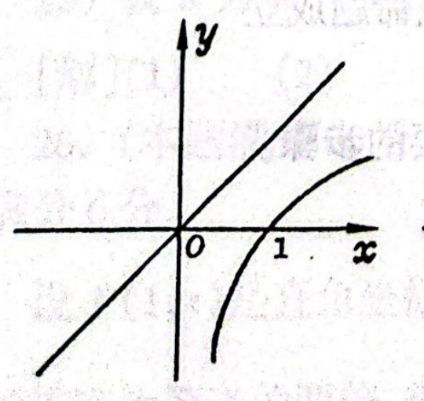
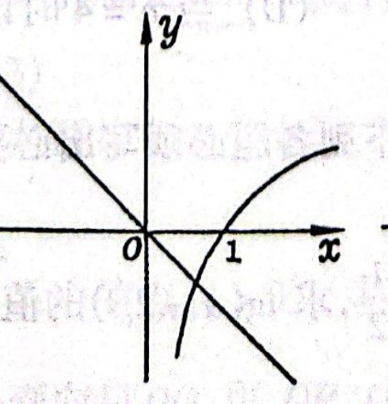
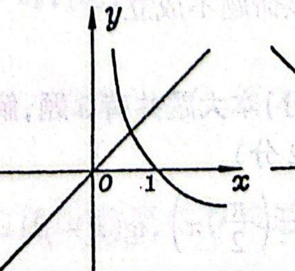
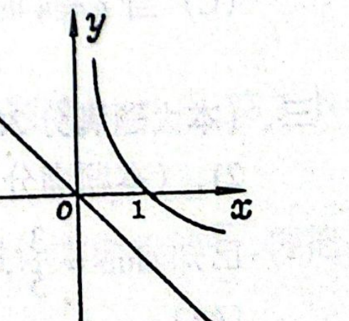
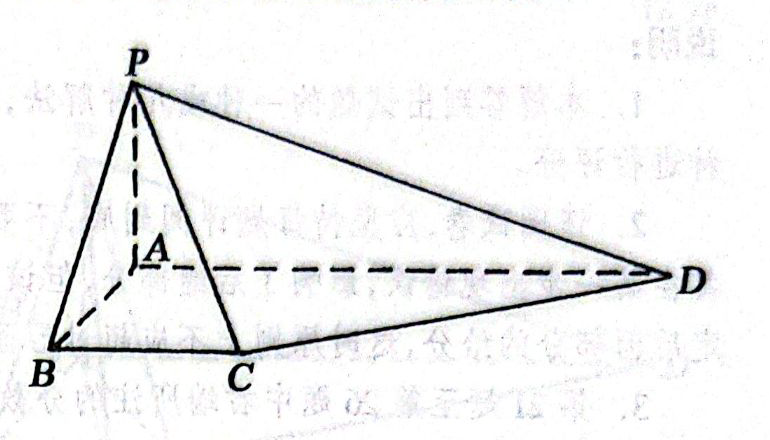
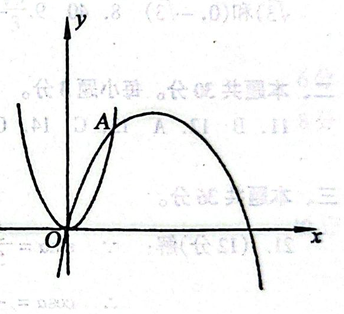
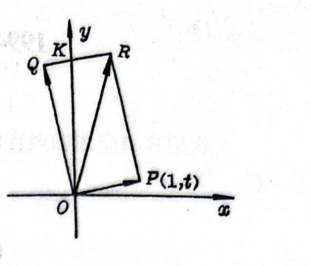
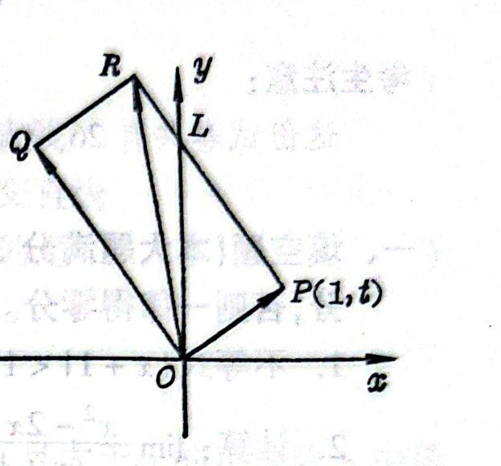

# 1994年上海卷（文）

## 填空题

### 第 1 题

不等式 $|x + 1| < 1$ 的解是＿＿＿＿＿＿.

#### 答案

$-2 < x < 0$

#### 解析

由绝对值不等式的等价形式，$|x+1|<1$ 等价于 $-1<x+1<1$，两边同时减去 $1$，得 $-2<x<0$.

### 第 2 题

函数 $y = \sin^{2} x$ 的最小正周期是＿＿＿＿＿＿.

#### 答案

$\pi$

#### 解析

利用降幂公式，$\sin^2x=\dfrac{1-\cos2x}{2}$，所以 $\pi$ 是 $y=\sin^2x$ 的一个正周期. 又因为 $\sin^2x=0$ 当且仅当 $x=k\pi$（$k\in\mathbb{Z}$），若正数 $T$ 是该函数的周期，则由 $f(0)=f(T)$ 得 $\sin^2T=0$，从而 $T$ 是 $\pi$ 的正整数倍. 因此最小正周期为 $\pi$.

### 第 3 题

计算：$\displaystyle\lim_{x\to-1}\frac{x^{2}-2x-3}{x+1}=$＿＿＿＿＿＿.

#### 答案

$-4$

#### 解析

当 $x\ne-1$ 时，$x^2-2x-3=(x+1)(x-3)$，故 $\dfrac{x^2-2x-3}{x+1}=x-3$. 于是 $\displaystyle\lim_{x\to-1}\frac{x^2-2x-3}{x+1}=\lim_{x\to-1}(x-3)=-4$.

### 第 4 题

以点 $C(-2,3)$ 为圆心且与 $y$ 轴相切的圆的方程是＿＿＿＿＿＿.

#### 答案

$(x + 2)^2 + (y - 3)^2 = 4$

#### 解析

圆心为 $C(-2,3)$. 圆与 $y$ 轴相切，所以半径等于圆心到直线 $x=0$ 的距离，即 $r=|-2|=2$. 因此圆的方程为 $(x+2)^2+(y-3)^2=r^2=4$.

### 第 5 题

方程 $\log_{3}(x-1)=\log_{9}(x+5)$ 的解是＿＿＿＿＿＿.

#### 答案

$x = 4$

#### 解析

由对数的定义域，必须有 $x-1>0$ 且 $x+5>0$，合并得 $x>1$. 又因为 $\log_9u=\dfrac12\log_3u$，原方程化为 $\log_3(x-1)=\dfrac12\log_3(x+5)$，即 $2\log_3(x-1)=\log_3(x+5)$. 所以 $(x-1)^2=x+5$，整理得 $x^2-3x-4=0$，即 $(x-4)(x+1)=0$. 候选值为 $x=4$ 或 $x=-1$，其中只有 $x=4$ 满足 $x>1$，故原方程的解为 $x=4$.

### 第 6 题

函数 $y=\sqrt{x^{2}-1}$（$x\leqslant-1$）的反函数是＿＿＿＿＿＿.

#### 答案

$y = -\sqrt{x^{2} + 1}$（$x \geqslant 0$）

#### 解析

原函数的定义域为 $x\leqslant-1$，且 $y=\sqrt{x^2-1}\geqslant0$. 由 $y^2=x^2-1$ 得 $x^2=y^2+1$. 因为原函数的定义域限制为 $x\leqslant-1$，所以 $x=-\sqrt{y^2+1}$，其值域为 $y\geqslant0$. 交换 $x$，$y$，得到反函数 $y=-\sqrt{x^2+1}$，其定义域为 $x\geqslant0$.

### 第 7 题

双曲线 $\frac{y^{2}}{2}-x^{2}=1$ 的两个焦点的坐标是＿＿＿＿＿＿.

#### 答案

$(0,\sqrt{3})$ 和 $(0,-\sqrt{3})$

#### 解析

将双曲线方程写成标准形式 $\dfrac{y^2}{2}-\dfrac{x^2}{1}=1$. 因此 $a^2=2$，$b^2=1$，焦半距满足 $c^2=a^2+b^2=3$，所以 $c=\sqrt3$. 双曲线的焦点在 $y$ 轴上，坐标为 $(0,\sqrt3)$ 和 $(0,-\sqrt3)$.

### 第 8 题

$\left(x^{3}-\frac{2}{x^{2}}\right)^{5}$ 的展开式中 $x^{5}$ 的系数是（结果用数值表示）＿＿＿＿＿＿.

#### 答案

$40$

#### 解析

在二项式展开中，取 $\left(x^3\right)^k$ 和 $\left(-\dfrac{2}{x^2}\right)^{5-k}$ 的项，其幂次为 $3k-2(5-k)=5k-10$. 要得到 $x^5$，必须有 $5k-10=5$，所以 $k=3$. 对应项的系数为 $\mathrm C_5^3(-2)^{5-3}=10\cdot4=40$，故所求系数为 $40$.

### 第 9 题

如果复数 $\frac{2+b\i}{1-2\i}$（其中 $\i$ 为虚数单位，$b$ 为实数）的实部和虚部相等，那么 $b=$＿＿＿＿＿＿.

#### 答案

$-\frac{2}{3}$

#### 解析

分子、分母同乘以共轭复数 $1+2\i$，得 $\dfrac{2+b\i}{1-2\i}=\dfrac{(2+b\i)(1+2\i)}{5}=\dfrac{2-2b}{5}+\dfrac{4+b}{5}\i$. 因此实部和虚部分别为 $\dfrac{2-2b}{5}$ 与 $\dfrac{4+b}{5}$. 令二者相等，得 $2-2b=4+b$，从而 $b=-\dfrac23$.

### 第 10 题

某商场计划经销某种商品，预测可得盈利 $30000$ 元，$26000$ 元，$8000$ 元的概率分别为 $0.3$，$0.6$，$0.1$，则经销该商品的期望盈利为＿＿＿＿＿＿$\text{元}$.

#### 答案

$25400$

#### 解析

设盈利为随机变量 $X$. 根据期望的定义，$E(X)=30000\times0.3+26000\times0.6+8000\times0.1$. 计算得 $E(X)=9000+15600+800=25400$，所以期望盈利为 $25400$ 元.

## 单选题

### 第 11 题

当 $a > 1$ 时，函数 $y = \log_a x$ 和 $y = (1 - a)x$ 的图象只可能是（$\quad$）

A.  

B.  

C.  

D.  

#### 答案

B

#### 解析

当 $a>1$ 时，$y=\log_a x$ 的定义域为 $x>0$，在该定义域上单调递增，并且经过点 $(1,0)$，当 $x\to0^+$ 时函数值趋于负无穷；直线 $y=(1-a)x$ 的斜率为 $1-a<0$，且经过原点. 选项 A 中直线斜率为正，选项 C、D 中对数函数单调递减，均不符合题设；只有选项 B 同时满足两项性质，故选 B.

### 第 12 题

如果 $0 < a < 1$，那么下列不等式中正确的是（$\quad$）

A.  
$(1 - a)^{\frac{1}{3}} > (1 - a)^{\frac{1}{2}}$

B.  
$\log_{(1 - a)}(1 + a) > 0$

C.  
$(1 - a)^{3} > (1 + a)^{2}$

D.  
$(1 - a)^{1 + a} > 1$

#### 答案

A

#### 解析

令 $r=1-a$，则 $0<r<1$. 由于底数在 $(0,1)$ 内，函数 $r^x$ 关于 $x$ 单调递减. 因为 $\dfrac13<\dfrac12$，所以 $r^{1/3}>r^{1/2}$，选项 A 正确.

又因为 $1+a>1$，所以 $\log_r(1+a)<0$，B 错误；$0<r^3<1$，而 $(1+a)^2>1$，故 C 错误；$1+a>0$ 且 $r<1$，所以 $r^{1+a}<1$，D 错误. 因此选 A.

### 第 13 题

已知直线 $2x + y - 2 = 0$ 和 $mx - y + 1 = 0$ 的夹角为 $\frac{\pi}{4}$，那么 $m$ 的值为（$\quad$）

A.  
$-\frac{1}{3}$ 或 $-3$

B.  
$\frac{1}{3}$ 或 $3$

C.  
$-\frac{1}{3}$ 或 $3$

D.  
$\frac{1}{3}$ 或 $-3$

#### 答案

C

#### 解析

两直线的斜率分别为 $m_1=-2$ 和 $m_2=m$. 当 $1+m_1m_2\ne0$ 时，两直线的夹角满足 $\tan\theta=\left|\dfrac{m_2-m_1}{1+m_1m_2}\right|=\left|\dfrac{m+2}{1-2m}\right|$. 由 $\theta=\dfrac\pi4$ 得 $\left|\dfrac{m+2}{1-2m}\right|=1$，即分别有 $m+2=1-2m$ 或 $m+2=-1+2m$. 解得 $m=-\dfrac13$ 或 $m=3$，故选 C.

### 第 14 题

已知 $a$，$b$ 是异面直线，直线 $c$ 平行于直线 $a$，那么 $c$ 与 $b$（$\quad$）

A.  
一定是异面直线

B.  
一定是相交直线

C.  
不可能是平行直线

D.  
不可能是相交直线

#### 答案

C

#### 解析

若 $c\parallel b$，又已知 $c\parallel a$，则两条都与 $c$ 平行的直线 $a$，$b$ 必相互平行，这与 $a$，$b$ 是异面直线矛盾. 因此 $c$ 不可能与 $b$ 平行. 由题设不能排除相交或异面的情形，故选 C.

### 第 15 题

设 $I$ 是全集，集合 $P$，$Q$ 满足 $P \subset Q$，则下面的结论中错误的是（$\quad$）

A.  
$P \cup Q = Q$

B.  
$\overline{P} \cup Q = I$

C.  
$P \cap \overline{Q} = \emptyset$

D.  
$\overline{P} \cap \overline{Q} = \overline{P}$

#### 答案

D

#### 解析

由 $P\subset Q$，有 $P\cup Q=Q$，所以 A 正确；若元素不属于 $Q$，则一定不属于 $P$，从而属于 $\overline P$，故 $\overline P\cup Q=I$，B 正确；因为 $P\subset Q$，所以 $P\cap\overline Q=\emptyset$，C 正确.

另一方面，由 $P\subset Q$，存在元素 $u$ 满足 $u\in Q$ 且 $u\notin P$. 因此 $u\in\overline P$，但 $u\notin\overline Q$，从而 $\overline Q$ 是 $\overline P$ 的真子集，$\overline P\cap\overline Q=\overline Q\ne\overline P$. 所以错误的结论是 D.

### 第 16 题

已知 $y = f(x)$（$x \in \mathbb{R}$）是奇函数，$f(5) \neq 0$，则下列各点中，在 $y = f(x)$ 的图象上的点是（$\quad$）

A.  
$(5, f(-5))$

B.  
$(-5, -f(5))$

C.  
$(-5, f(5))$

D.  
$(5, -f(5))$

#### 答案

B

#### 解析

奇函数满足 $f(-x)=-f(x)$，所以 $f(-5)=-f(5)$. 因此点 $(-5,-f(5))$ 的纵坐标等于 $f(-5)$，该点在函数图象上. 由于 $f(5)\ne0$，其余三个选项的点均不满足对应的函数值关系，故选 B.

### 第 17 题

设 $a$，$b$ 是平面 $\alpha$ 外的任意两条线段，则“$a$，$b$ 的长相等”是“$a$，$b$ 在平面 $\alpha$ 内的射影长相等”的（$\quad$）

A.  
非充分条件也非必要条件

B.  
充分必要条件

C.  
必要条件而非充分条件

D.  
充分条件而非必要条件

#### 答案

A

#### 解析

设 $\alpha$ 为平面 $z=0$，线段的射影长度等于其长度乘以线段与平面夹角的余弦的绝对值.

先说明“长度相等”不是充分条件. 取线段 $a$ 的端点为 $(0,0,1)$，$(1,0,2)$，取线段 $b$ 的端点为 $(0,1,1)$，$(\sqrt{2},1,1)$. 两条线段的长度都为 $\sqrt{2}$，但它们在 $\alpha$ 内的射影长度分别为 $1$ 和 $\sqrt{2}$，所以长度相等不能推出射影长度相等.

再说明“长度相等”不是必要条件. 取线段 $c$ 的端点为 $(0,0,1)$，$(1,0,2)$，取线段 $d$ 的端点为 $(0,1,1)$，$(1,1,1+\sqrt{3})$. 两条线段在 $\alpha$ 内的射影长度都为 $1$，但它们的长度分别为 $\sqrt{2}$ 和 $2$，所以射影长度相等不能推出长度相等. 因此选 A.

### 第 18 题

$9$ 支足球队中，有 $5$ 支亚洲队，$4$ 支非洲队，从中任意抽取两队进行比赛，则 $1$ 队是亚洲队且 $1$ 队是非洲队的概率是（$\quad$）

A.  
$\frac{\mathrm C_5^1 + \mathrm C_4^1}{\mathrm C_9^2}$

B.  
$\frac{\mathrm C_4^1}{\mathrm C_9^2}$

C.  
$\frac{\mathrm C_5^1}{\mathrm C_9^2}$

D.  
$\frac{\mathrm C_5^1 \cdot \mathrm C_4^1}{\mathrm C_9^2}$

#### 答案

D

#### 解析

从 $9$ 支球队中任取两队，所有等可能结果数为 $\mathrm C_9^2$. 要使一队为亚洲队、另一队为非洲队，先从 $5$ 支亚洲队中取一队，再从 $4$ 支非洲队中取一队，符合条件的结果数为 $\mathrm C_5^1\mathrm C_4^1$. 所以所求概率为 $\dfrac{\mathrm C_5^1\mathrm C_4^1}{\mathrm C_9^2}$，故选 D.

### 第 19 题

在直角坐标系 $xOy$ 中，曲线 $C$ 的方程是 $y = \cos x$，现平移坐标系，把原点移到点 $O' \left(\frac{\pi}{2}, -\frac{\pi}{2} \right)$，则在坐标系 $x'O'y'$ 中，曲线 $C$ 的方程是（$\quad$）

A.  
$y' = \sin x' + \frac{\pi}{2}$

B.  
$y' = -\sin x' + \frac{\pi}{2}$

C.  
$y' = \sin x' - \frac{\pi}{2}$

D.  
$y' = -\sin x' - \frac{\pi}{2}$

#### 答案

B

#### 解析

平移坐标系后，新旧坐标轴方向相同，且 $O'$ 在旧坐标系中的坐标为 $\left(\dfrac\pi2,-\dfrac\pi2\right)$，所以 $x=x'+\dfrac\pi2$，$y=y'-\dfrac\pi2$. 代入原曲线方程 $y=\cos x$，得 $y'-\dfrac\pi2=\cos\left(x'+\dfrac\pi2\right)=-\sin x'$. 因此 $y'=-\sin x'+\dfrac\pi2$，故选 B.

### 第 20 题

某个命题与自然数 $n$ 有关. 如果当 $n = k$（$k \in \mathbb{N}$）时该命题成立，那么可推得当 $n = k + 1$ 时该命题也成立. 现已知当 $n = 5$ 时该命题不成立，那么可推得（$\quad$）

A.  
当 $n=6$ 时该命题不成立

B.  
当 $n=6$ 时该命题成立

C.  
当 $n=4$ 时该命题不成立

D.  
当 $n=4$ 时该命题成立

#### 答案

C

#### 解析

设该命题在 $n=k$ 时为 $P(k)$. 题设的递推条件是“$P(k)$ 成立能推出 $P(k+1)$ 成立”，其逆否命题是“$P(k+1)$ 不成立能推出 $P(k)$ 不成立”. 已知 $P(5)$ 不成立，应用逆否命题可推出 $P(4)$ 不成立；不能由此推出 $P(6)$ 的真假. 因此选 C.

## 解答题

### 第 21 题

已知 $\sin\alpha=\frac{3}{5}$，$\alpha\in\left(\frac{\pi}{2},\pi\right)$，$\tan(\pi-\beta)=\frac{1}{2}$，求 $\tan(\alpha-2\beta)$ 的值.

#### 解析

因为 $\sin \alpha = \frac{3}{5}$，$\alpha \in \left(\frac{\pi}{2}, \pi\right)$，所以 $\cos \alpha = -\frac{4}{5}$，$\tan \alpha = -\frac{3}{4}$. 又因为 $\tan(\pi - \beta) = \frac{1}{2}$，所以 $\tan \beta = -\frac{1}{2}$，从而

$$

\tan 2\beta=\frac{2\tan \beta}{1 - \tan^2 \beta}=\frac{2 \cdot \left(-\frac{1}{2}\right)}{1 - \left(-\frac{1}{2}\right)^2}=-\frac{4}{3}

$$

于是

$$

\tan(\alpha - 2\beta)=\frac{\tan \alpha - \tan 2\beta}{1 + \tan \alpha \tan 2\beta}=\frac{-\frac{3}{4} + \frac{4}{3}}{1 + \left(-\frac{3}{4}\right)\left(-\frac{4}{3}\right)}=\frac{7}{24}

$$

### 第 22 题

已知空间三个点 $P(-2,0,2)$，$Q(-1,1,2)$ 和 $R(-3,0,4)$. 设 $\boldsymbol{a}= \overrightarrow{PQ}$，$\boldsymbol{b}= \overrightarrow{PR}$.

1.  求 $\boldsymbol{a}$ 与 $\boldsymbol{b}$ 的夹角 $\theta$（用反三角函数表示）；

2.  试确定实数 $k$，使 $k \boldsymbol{a}+ \boldsymbol{b}$ 与 $k \boldsymbol{a}- 2\boldsymbol{b}$ 互相垂直.

#### 解析

1.  $\boldsymbol{a}= \overrightarrow{PQ} = (1,1,0)$，$\boldsymbol{b}= \overrightarrow{PR} = (-1,0,2)$. 所以 $\left|\boldsymbol{a}\right|=\sqrt{2}$，$\left|\boldsymbol{b}\right|=\sqrt{5}$，

$$

\cos \theta=\frac{\boldsymbol{a}\cdot \boldsymbol{b}}{|\boldsymbol{a}||\boldsymbol{b}|}=\frac{-1}{\sqrt{10}}=-\frac{\sqrt{10}}{10}

$$

    因此 $\theta = \arccos\left(-\frac{\sqrt{10}}{10}\right)$.

2.  $(k\boldsymbol{a}+\boldsymbol{b})\cdot(k\boldsymbol{a}-2\boldsymbol{b}) = \bigl(k-1,k,2\bigr)\cdot \bigl(k+2,k,-4\bigr) = (k-1)(k+2)+k^2-8 = 2k^2+k-10$. 由两向量互相垂直得 $2k^2+k-10=0$，解得 $k=-\frac{5}{2}$ 或 $k=2$.

### 第 23 题

如图，在梯形 $ABCD$ 中，$AD \parallel BC$，$\angle ABC = \frac{\pi}{2}$，$AB = a$，$AD = 3a$，且 $\angle ADC = \arcsin \frac{\sqrt{5}}{5}$，又 $PA \perp$ 平面 $ABCD$，$PA = a$. 求：

1.  二面角 $P - CD - A$ 的大小（用反三角函数表示）；

2.  点 $A$ 到平面 $PBC$ 的距离.

#### 解析

1.  在平面 $ABCD$ 内，过 $A$ 作 $AE \perp CD$，垂足为 $E$，连接 $PE$. 因为 $PA \perp$ 平面 $ABCD$，所以由三垂线定理知 $PE \perp CD$，从而 $\angle PEA$ 是二面角 $P - CD - A$ 的平面角. 因为 $AE\perp CD$，所以 $AE$ 是点 $A$ 到直线 $CD$ 的距离. 直线 $AD$ 与直线 $CD$ 的夹角的正弦为 $\sin\angle ADC=\dfrac{\sqrt5}{5}$，故 $AE=AD\sin\angle ADC=\dfrac{3\sqrt5}{5}a$. 在直角三角形 $PAE$ 中，$\tan \angle PEA = \dfrac{PA}{AE} = \dfrac{\sqrt{5}}{3}$，所以 $\angle PEA = \arctan \frac{\sqrt{5}}{3}$，从而二面角 $P - CD - A$ 的大小为 $\arctan \frac{\sqrt{5}}{3}$.

2.  在平面 $PAB$ 内，过 $A$ 作 $AH \perp PB$，垂足为 $H$. 因为 $PA \perp$ 平面 $ABCD$，所以 $PA \perp BC$；又由题设 $AB \perp BC$. 直线 $PA$，$AB$ 是平面 $PAB$ 内相交的两条直线，因此 $BC \perp$ 平面 $PAB$，从而 $BC \perp AH$.

    由 $AH \perp PB$ 以及 $AH \perp BC$，且 $PB$，$BC$ 是平面 $PBC$ 内相交的两条直线，得 $AH \perp$ 平面 $PBC$. 故 $AH$ 的长就是点 $A$ 到平面 $PBC$ 的距离.

    在直角三角形 $PAB$ 中，$PA=AB=a$，所以 $PB=a\sqrt2$. 由三角形面积的两种表示，$\dfrac12 PA\cdot AB=\dfrac12 PB\cdot AH$，得 $AH=\dfrac{a^2}{a\sqrt2}=\dfrac{\sqrt2}{2}a$. 所以点 $A$ 到平面 $PBC$ 的距离为 $\dfrac{\sqrt2}{2}a$.

### 第 24 题

如图，抛物线 $y = 3x^{2}$ 和 $y = -x^{2} + 4ax$（$a > 0$）交于原点 $O$ 和点 $A$.

1.  求这两条抛物线所围成的图形的面积；

2.  过点 $A$ 作抛物线 $y = -x^{2} + 4ax$ 的切线，该切线与抛物线 $y = 3x^{2}$ 交于另一点 $P$，求线段 $AP$ 的垂直平分线的方程.

#### 解析

1.  两条抛物线的交点满足

$$

\begin{cases}
    y = 3x^2,\\
    y = -x^2 + 4ax.
    \end{cases}

$$

    消去 $y$，得 $3x^2=-x^2+4ax$，即 $4x(x-a)=0$. 除原点 $O$ 外，另一交点的横坐标为 $x=a$，代入 $y=3x^2$ 得 $A(a,3a^2)$. 在 $0\leq x\leq a$ 上，第二条抛物线的函数值减去第一条的函数值为 $4x(a-x)\geq0$，所以所围面积为

$$

S=\int_0^a\bigl[(-x^2+4ax)-3x^2\bigr]\,dx=\left(2ax^2-\frac43x^3\right)_0^a=\frac23a^3

$$

2.  由 $y = -x^2 + 4ax$ 得 $y' = -2x + 4a$，故点 $A$ 处切线斜率为 $2a$，切线方程为 $y - 3a^2 = 2a(x - a)$，即 $y = 2ax + a^2$. 切线与抛物线 $y=3x^2$ 的交点满足

$$

\begin{cases}
    y = 2ax + a^2,\\
    y = 3x^2,
    \end{cases}

$$

    由 $3x^2=2ax+a^2$ 得 $3x^2-2ax-a^2=(3x+a)(x-a)=0$. 根 $x=a$ 对应已知交点 $A$，另一根为 $x=-\dfrac{a}{3}$，代入切线方程得 $y=\dfrac{a^2}{3}$. 故 $P\left(-\dfrac{a}{3},\dfrac{a^2}{3}\right)$.

    设 $AP$ 的中点为 $M$，则 $M\left(\dfrac{a+(-a/3)}2,\dfrac{3a^2+a^2/3}2\right)=\left(\dfrac a3,\dfrac{5a^2}{3}\right)$. 又 $AP$ 的斜率为 $2a$，所以其垂直平分线的斜率为 $-\dfrac1{2a}$. 于是垂直平分线方程为 $y-\dfrac{5a^2}{3}=-\dfrac1{2a}\left(x-\dfrac a3\right)$，即 $y=-\dfrac1{2a}x+\dfrac{5a^2}{3}+\dfrac16$.

### 第 25 题

设 $\{a_{n}\}$ 是公差为 $d$ 的等差数列，$a_{3} + a_{5} = 2$，$S_{20} = a_{1} + a_{2} + \cdots + a_{20} = 150$，又 $b_{n} = 2^{a_{n} - 2a_{n+1}}$（$n \in \mathbb{N}$）.

1.  求 $a_{1}$，$d$ 的值；

2.  求证 $\{b_{n}\}$ 是等比数列，并求 $b_{n}$；

3.  设 $k$ 为某个自然数，且满足 $\displaystyle\lim_{n\to\infty}\left(b_k b_{k+1} + b_{k+1} b_{k+2} + \cdots + b_n b_{n+1}\right) = \frac{1}{96}$，求 $k$ 的值.

#### 解析

1.  由 $a_n=a_1+(n-1)d$，得 $a_3=a_1+2d$，$a_5=a_1+4d$，$a_{20}=a_1+19d$. 因此

$$

\begin{cases}
    2a_1+6d=2,\\
    S_{20}=10(a_1+a_{20})=10(2a_1+19d)=150.
    \end{cases}

$$

    化简为 $a_1+3d=1$，$2a_1+19d=15$. 由 $a_1=1-3d$ 代入第二式，得 $2-6d+19d=15$，所以 $d=1$，进而 $a_1=-2$.

2.  因为 $a_1=-2$，$d=1$，所以 $a_n=n-3$，$a_{n+1}=n-2$. 从而 $b_n=2^{a_n-2a_{n+1}}=2^{n-3-2(n-2)}=2^{1-n}=\left(\dfrac12\right)^{n-1}$. 此外，$\dfrac{b_{n+1}}{b_n}=\dfrac{2^{-n}}{2^{1-n}}=\dfrac12$，比值为常数，故 $\{b_n\}$ 是等比数列，且通项为 $b_n=\left(\dfrac12\right)^{n-1}$.

3.  由上式，$b_kb_{k+1}=\left(\dfrac12\right)^{k-1}\left(\dfrac12\right)^k=\left(\dfrac12\right)^{2k-1}$. 令 $c_m=b_mb_{m+1}$，则

$$

\frac{c_{m+1}}{c_m}=\frac{b_{m+1}b_{m+2}}{b_mb_{m+1}}=\frac{b_{m+2}}{b_m}=\left(\frac12\right)^2=\frac14

$$

    所以从 $c_k$ 开始的各项构成首项为 $\left(\dfrac12\right)^{2k-1}$、公比为 $\dfrac14$ 的无穷等比数列. 故

$$

\displaystyle\lim_{n\to\infty}\sum_{m=k}^n b_mb_{m+1}=\frac{\left(\frac12\right)^{2k-1}}{1-\frac14}=\frac{8}{3\cdot2^{2k}}

$$

    由题设，这个和等于 $\dfrac1{96}$，所以 $\dfrac{8}{3\cdot2^{2k}}=\dfrac1{96}$，即 $2^{2k}=256=2^8$. 由于 $k$ 为自然数，得 $k=4$.

### 第 26 题

设 $P(1, t)$ 是直角坐标系内的点（$t > 0$）. 将向量 $\overrightarrow{OP}$ 绕原点 $O$ 按逆时针方向旋转 $\frac{\pi}{2}$，再把它的模变为原来的两倍，得到向量 $\overrightarrow{OQ}$，以 $OP$，$OQ$ 为邻边作矩形 $OPRQ$.

1.  求点 $Q$，$R$ 的坐标；

2.  求矩形 $OPRQ$ 在第一象限部分的面积 $S(t)$；

3.  确定函数 $S(t)$ 的单调区间，并加以证明.

#### 解析

1.  $\overrightarrow{OP} = (1,t)$. 由 $\overrightarrow{OQ}\cdot\overrightarrow{OP}=0$ 和 $\lvert\overrightarrow{OQ}\rvert=2\lvert\overrightarrow{OP}\rvert$，得 $\overrightarrow{OQ}=\pm 2(-t,1)$. 根据题意，向量 $\overrightarrow{OP}$ 按逆时针方向旋转 $\frac{\pi}{2}$ 后再把模变为原来的两倍，所以 $\overrightarrow{OQ}=(-2t,2)$. 所以 $Q(-2t,2)$. 又 $\overrightarrow{OR} = \overrightarrow{OP} + \overrightarrow{OQ} = (-2t+1, t+2)$，所以 $R(-2t+1,t+2)$.

2.  当 $-2t+1>0$，即 $0<t<\frac12$ 时，点 $R$ 在第一象限内，此时 $S(t)$ 为四边形 $OPRQ$ 在第一象限部分的面积. 直线 $QR$ 的方程为 $y-2=t(x+2t)$. 令 $x=0$，得 $y=2t^2+2$，设交点为 $K(0,2t^2+2)$. 因而

$$

S(t)=S_{OPRQ}-S_{OKQ}=2\left(\sqrt{1+t^2}\right)^2-\frac12(2t^2+2)\cdot 2t=2(1-t+t^2-t^3)

$$

    当 $-2t+1\le0$，即 $t\ge\frac12$ 时，点 $R$ 在 $y$ 轴上或第二象限内，此时 $S(t)$ 为 $\triangle OPL$ 的面积. 直线 $PR$ 的方程为 $y-t=-\dfrac{1}{t}(x-1)$. 令 $x=0$，得 $y=t+\dfrac1t$，设交点为 $L\!\left(0,t+\dfrac1t\right)$. 所以 $S(t)=\dfrac12\left(t+\dfrac1t\right)$. 因此

$$

S(t)=
    \begin{cases}
    2(1-t+t^2-t^3), & 0<t<\frac12,\\
    \dfrac12\left(t+\dfrac1t\right), & t\ge\frac12.
    \end{cases}

$$

3.  当 $0<t_1<t_2<\frac12$ 时， $S(t_1)-S(t_2)=2(t_2-t_1)\bigl[1-(t_1+t_2)+(t_1^2+t_1t_2+t_2^2)\bigr]$. 其中 $t_2-t_1>0$，且 $1-(t_1+t_2)+(t_1^2+t_1t_2+t_2^2)=(1-t_1)(1-t_2)+t_1^2+t_2^2>0$，所以 $S(t_1)-S(t_2)>0$， 所以 $S(t)$ 在 $(0,\frac12)$ 内是减函数.

    当 $\frac12\le t_1<t_2\le1$ 时，$t_1-t_2<0$，且 $t_1t_2<1$，所以 $1-\dfrac{1}{t_1t_2}<0$，从而 $S(t_1)-S(t_2)=\dfrac12(t_1-t_2)\left(1-\dfrac{1}{t_1t_2}\right)>0$， 所以 $S(t)$ 在 $[\frac12,1]$ 内也是减函数.

    又 $S\!\left(\dfrac12\right)=2\left(1-\dfrac12+\dfrac14-\dfrac18\right)=\dfrac54$. 对于 $0<t_1<\frac12\le t_2\le1$，有 $S(t_1)>\dfrac54\ge S(t_2)$，所以 $S(t)$ 在 $(0,1]$ 内是减函数.

    当 $1\le t_1<t_2$ 时，$t_1-t_2<0$，且 $t_1t_2>1$，所以 $1-\dfrac{1}{t_1t_2}>0$，从而 $S(t_1)-S(t_2)=\dfrac12(t_1-t_2)\left(1-\dfrac{1}{t_1t_2}\right)<0$， 所以 $S(t)$ 在 $[1,+\infty)$ 内是增函数.

    综上，$S(t)$ 在 $(0,1]$ 上单调递减，在 $[1,+\infty)$ 上单调递增；因此其单调区间分别为 $(0,1]$ 和 $[1,+\infty)$.

