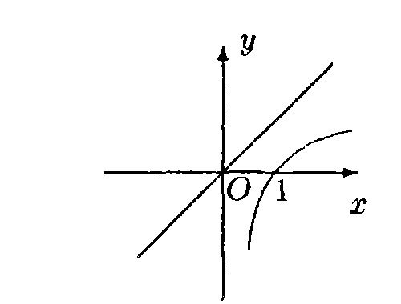
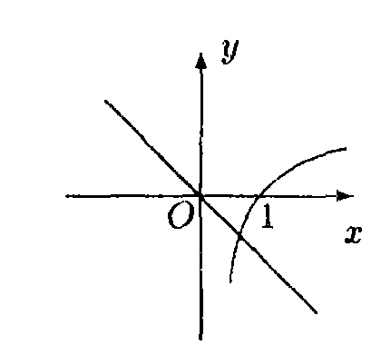
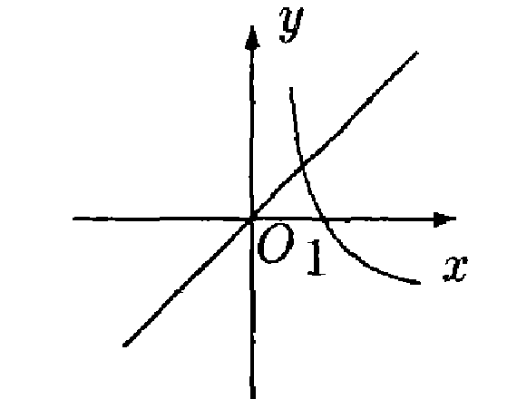
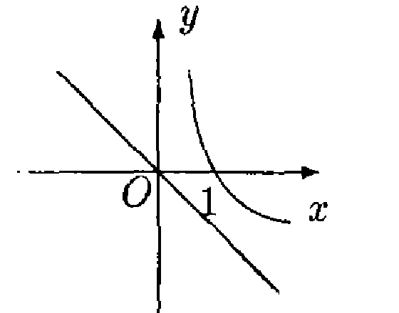
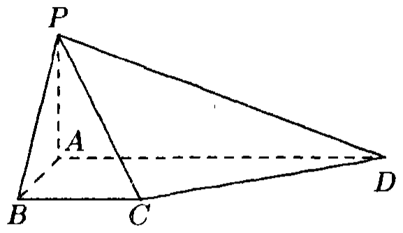
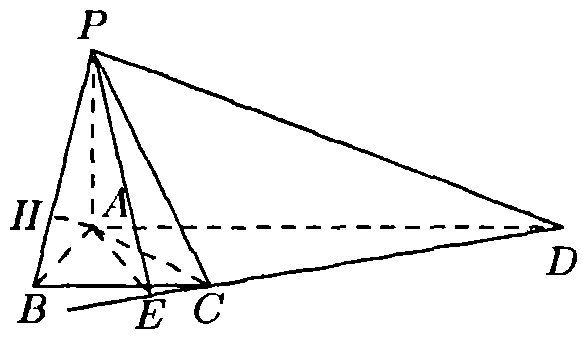
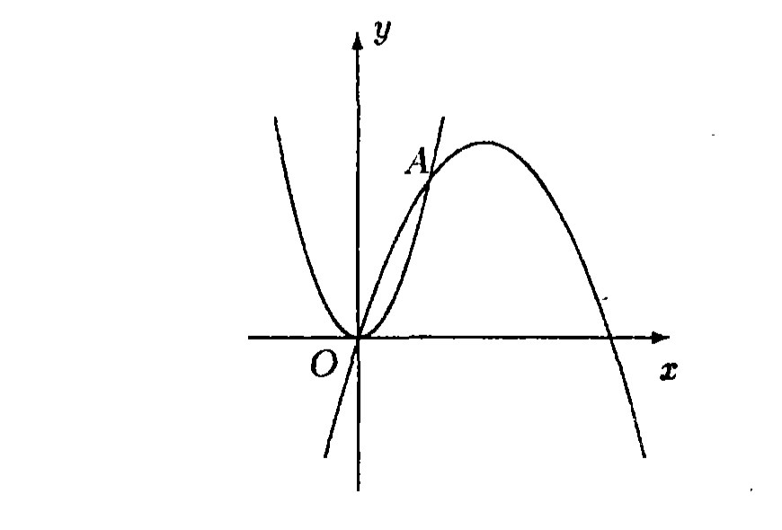
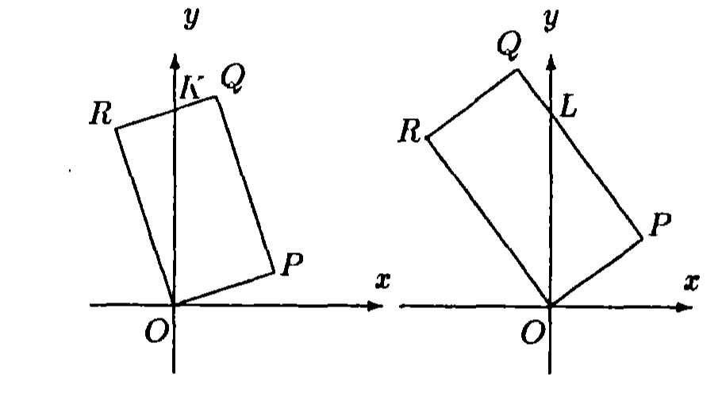

# 1994年上海卷（理）

## 填空题

### 第 1 题

不等式 $|x + 1| < 1$ 的解是＿＿＿＿＿＿.

#### 答案

$-2 < x < 0$

#### 解析

由绝对值不等式的等价关系，$|x+1|<1$ 等价于 $-1<x+1<1$. 两边同时减去 $1$，得 $-2<x<0$，所以原不等式的解集为 $(-2,0)$.

### 第 2 题

计算：$\displaystyle\lim_{x \to -1}\frac{x^{2} - 2x - 3}{x + 1} =$＿＿＿＿＿＿.

#### 答案

$-4$

#### 解析

当 $x\ne-1$ 时，分子可以因式分解为 $x^2-2x-3=(x+1)(x-3)$，因此 $\dfrac{x^2-2x-3}{x+1}=x-3$. 所以 $\displaystyle\lim_{x\to-1}\dfrac{x^2-2x-3}{x+1}=\lim_{x\to-1}(x-3)=-4$.

### 第 3 题

以点 $C(-2,3)$ 为圆心且与 $y$ 轴相切的圆的方程是＿＿＿＿＿＿.

#### 答案

$(x + 2)^2 + (y - 3)^2 = 4$

#### 解析

圆心为 $C(-2,3)$，圆与 $y$ 轴相切，所以半径等于圆心到直线 $x=0$ 的距离，即 $r=|-2|=2$. 由圆的标准方程，得 $(x+2)^2+(y-3)^2=r^2=4$.

### 第 4 题

方程 $\log_3(x - 1) = \log_9(x + 5)$ 的解是＿＿＿＿＿＿.

#### 答案

$x = 4$

#### 解析

对数的定义域要求 $x-1>0$ 且 $x+5>0$，故 $x>1$. 又因为 $\log_9 u=\dfrac{1}{2}\log_3u$，原方程等价于 $2\log_3(x-1)=\log_3(x+5)$，从而 $(x-1)^2=x+5$. 整理得 $x^2-3x-4=0$，即 $(x-4)(x+1)=0$. 候选值为 $x=4$ 或 $x=-1$，只有 $x=4$ 满足定义域，所以原方程的解为 $x=4$.

### 第 5 题

如果复数 $\frac{2 + b\i}{1 - 2\i}$（其中 $\i$ 为虚数单位，$b$ 为实数）的实部和虚部相等，那么 $b =$＿＿＿＿＿＿.

#### 答案

$-\frac{2}{3}$

#### 解析

分子、分母同乘以分母的共轭复数 $1+2\i$，得 $\dfrac{2+b\i}{1-2\i}=\dfrac{(2+b\i)(1+2\i)}{5}=\dfrac{2-2b}{5}+\dfrac{4+b}{5}\i$. 因此实部和虚部分别为 $\dfrac{2-2b}{5}$ 与 $\dfrac{4+b}{5}$. 令二者相等，得 $2-2b=4+b$，解得 $b=-\dfrac{2}{3}$.

### 第 6 题

函数 $y = \sqrt{x^2 - 1}$（$x \leqslant -1$）的反函数是＿＿＿＿＿＿.

#### 答案

$y = -\sqrt{x^2 + 1}$（$x \geqslant 0$）

#### 解析

原函数的定义域为 $x\leqslant-1$，值域为 $y\geqslant0$. 由 $y=\sqrt{x^2-1}$ 得 $x^2=y^2+1$. 结合原函数的定义域，必须取负根，即 $x=-\sqrt{y^2+1}$. 交换 $x$，$y$，并把原函数的值域作为反函数的定义域，得到反函数 $y=-\sqrt{x^2+1}$，其中 $x\geqslant0$.

### 第 7 题

双曲线 $\frac{y^2}{2} - x^2 = 1$ 的两个焦点的坐标是＿＿＿＿＿＿.

#### 答案

$(0, \sqrt{3})$ 和 $(0, -\sqrt{3})$

#### 解析

将方程写成标准形式 $\dfrac{y^2}{2}-\dfrac{x^2}{1}=1$. 这是焦点在 $y$ 轴上的双曲线，其中 $a^2=2$，$b^2=1$. 由双曲线的关系 $c^2=a^2+b^2$，得 $c^2=3$，即 $c=\sqrt3$. 所以两个焦点的坐标为 $(0,\sqrt3)$ 和 $(0,-\sqrt3)$.

### 第 8 题

$\left(x^{3} - \frac{2}{x^{2}}\right)^{5}$ 的展开式中，$x^{5}$ 的系数是（结果用数值表示）＿＿＿＿＿＿.

#### 答案

$40$

#### 解析

二项式展开的通项可写为 $\mathrm C_5^k(x^3)^{5-k}\left(-\dfrac{2}{x^2}\right)^k=\mathrm C_5^k(-2)^k x^{15-5k}$，其中 $k=0$，$1$，$\dots$，$5$. 要得到含 $x^5$ 的项，必须满足 $15-5k=5$，所以 $k=2$. 因此所求系数为 $\mathrm C_5^2(-2)^2=10\cdot4=40$.

### 第 9 题

要建造一个长方体形状的仓库，其内部的高为 $3\mathrm{~m}$，长与宽的和为 $20\mathrm{~m}$，那么仓库容积的最大值为＿＿＿＿＿＿ $\mathrm{m}^{3}$.

#### 答案

$300$

#### 解析

设仓库的长为 $x\mathrm{~m}$，则宽为 $(20-x)\mathrm{~m}$，且 $0<x<20$. 容积为 $V=3x(20-x)=60x-3x^2=300-3(x-10)^2$. 因为 $(x-10)^2\geqslant0$，所以 $V\leqslant300$，且当 $x=10$ 时等号成立. 故仓库容积的最大值为 $300\mathrm{~m}^3$.

### 第 10 题

函数 $y = \frac{\sin 2x + \sin \left(2x + \frac{\pi}{3}\right)}{\cos 2x + \cos \left(2x + \frac{\pi}{3}\right)}$ 的最小正周期是＿＿＿＿＿＿.

#### 答案

$\frac{\pi}{2}$

#### 解析

由和差化积公式，分子为 $\sin2x+\sin\left(2x+\dfrac{\pi}{3}\right)=2\sin\left(2x+\dfrac{\pi}{6}\right)\cos\dfrac{\pi}{6}$，分母为 $\cos2x+\cos\left(2x+\dfrac{\pi}{3}\right)=2\cos\left(2x+\dfrac{\pi}{6}\right)\cos\dfrac{\pi}{6}$. 在原函数有定义的范围内，二者约去相同的非零因子，得到 $y=\tan\left(2x+\dfrac{\pi}{6}\right)$. 正切函数的最小正周期为 $\pi$，故原函数的最小正周期 $T$ 满足 $2T=\pi$，即 $T=\dfrac{\pi}{2}$.

## 单选题

### 第 11 题

当 $a > 1$ 时，函数 $y = \log_a x$ 和 $y = (1 - a)x$ 的图象只可能是（）

A.  

B.  

C.  

D.  

#### 答案

B

#### 解析

当 $a>1$ 时，函数 $y=\log_a x$ 的定义域为 $x>0$，在定义域上单调递增，且经过点 $(1,0)$，直线 $x=0$ 是其竖直渐近线. 另一方面，直线 $y=(1-a)x$ 经过原点，斜率 $1-a<0$. 四个图象中只有选项 B 同时满足这两项性质，故选 B.

### 第 12 题

如果 $0 < a < 1$，那么下列不等式中正确的是（）

A.  
$(1 - a)^{\frac{1}{3}} > (1 - a)^{\frac{1}{2}}$

B.  
$\log_{(1 - a)}(1 + a) > 0$

C.  
$(1 - a)^3 > (1 + a)^2$

D.  
$(1 - a)^{1 + a} > 1$

#### 答案

A

#### 解析

令 $c=1-a$，则 $0<c<1$. 因为 $\dfrac{1}{3}<\dfrac{1}{2}$，而底数 $c$ 在 $(0,1)$ 内时幂函数随指数增大而减小，所以 $c^{1/3}>c^{1/2}$，选项 A 正确.

又因为 $1+a>1$，以 $0<c<1$ 为底的对数值为负，故 $\log_{1-a}(1+a)<0$，B 错误. 由 $0<c<1<1+a$，得 $c^3<1<(1+a)^2$，C 错误；又因 $1+a>0$，有 $c^{1+a}<1$，D 错误. 因此正确选项为 A.

### 第 13 题

已知点 $P$ 的极坐标为 $(1,\pi)$，那么过点 $P$ 且垂直于极轴的直线的极坐标方程为（）

A.  
$\rho = 1$

B.  
$\rho = \cos \theta$

C.  
$\rho = -\frac{1}{\cos \theta}$

D.  
$\rho = \frac{1}{\cos \theta}$

#### 答案

C

#### 解析

极坐标 $(1,\pi)$ 对应的直角坐标为 $P(\cos\pi,\sin\pi)=(-1,0)$. 极轴就是 $x$ 轴，所以过 $P$ 且垂直于极轴的直线为 $x=-1$. 极坐标中 $x=\rho\cos\theta$，故该直线的方程为 $\rho\cos\theta=-1$，即 $\rho=-\dfrac{1}{\cos\theta}$，选 C.

### 第 14 题

已知 $a$，$b$ 是异面直线，直线 $c$ 平行于直线 $a$，那么 $c$ 与 $b$（）

A.  
一定是异面直线

B.  
一定是相交直线

C.  
不可能是平行直线

D.  
不可能是相交直线

#### 答案

C

#### 解析

若 $c$ 与 $b$ 平行，由于 $c\parallel a$，则两条都平行于 $c$ 的直线 $a$，$b$ 应相互平行，这与 $a$，$b$ 是异面直线矛盾. 因此 $c$ 不可能与 $b$ 平行.

题设不能排除 $c$ 与 $b$ 相交的情形，也不能排除二者异面的情形，所以只有“不可能是平行直线”必然成立，故选 C.

### 第 15 题

设 $I$ 是全集，集合 $P$，$Q$ 满足 $P \subset Q$，则下面的结论中错误的是（）

A.  
$P \cup Q = Q$

B.  
$\overline{P} \cup Q = I$

C.  
$P \cap \overline{Q} = \varnothing$

D.  
$\overline{P} \cap \overline{Q} = \overline{P}$

#### 答案

D

#### 解析

由 $P\subset Q$，直接得到 $P\cup Q=Q$，所以 A 正确. 对任意属于全集 $I$ 的元素，若它不属于 $P$，则属于 $\overline P$；若它属于 $P$，由 $P\subset Q$ 可知它属于 $Q$，所以 $\overline P\cup Q=I$，B 正确.

又因为 $P\subset Q$，集合 $P$ 与 $\overline Q$ 没有公共元素，故 $P\cap\overline Q=\varnothing$，C 正确. 由补集的包含关系 $\overline Q\subset\overline P$，有 $\overline P\cap\overline Q=\overline Q$，一般不等于 $\overline P$，所以错误的是 D.

### 第 16 题

设复数 $z = -\frac{1}{2} + \frac{\sqrt{3}}{2}\i$（$\i$ 为虚数单位），则满足等式 $z^n = z$，且大于 $1$ 的正整数 $n$ 中最小的是（）

A.  
$3$

B.  
$4$

C.  
$6$

D.  
$7$

#### 答案

B

#### 解析

复数 $z=-\dfrac12+\dfrac{\sqrt3}{2}\i$ 的模为 $1$，辐角为 $\dfrac{2\pi}{3}$，所以 $z=\cos\dfrac{2\pi}{3}+\i\sin\dfrac{2\pi}{3}$，并且 $z^3=1$，而 $z\ne1$.

条件 $z^n=z$ 等价于 $z^{n-1}=1$，因此 $n-1$ 必须是 $3$ 的正整数倍. 大于 $1$ 的正整数中最小的满足者为 $n=4$，故选 B.

### 第 17 题

设 $a$，$b$ 是平面 $\alpha$ 外的任意两条线段，则“$a$，$b$ 的长相等”是“$a$，$b$ 在平面 $\alpha$ 内的射影长相等”的（）

A.  
非充分条件也非必要条件

B.  
充分必要条件

C.  
必要条件而非充分条件

D.  
充分条件而非必要条件

#### 答案

A

#### 解析

设线段 $a$，$b$ 与平面 $\alpha$ 的夹角分别为 $\theta_a$，$\theta_b$，则它们在平面 $\alpha$ 内的射影长分别为 $|a|\cos\theta_a$，$|b|\cos\theta_b$. 即使 $|a|=|b|$，若 $\theta_a\ne\theta_b$，射影长也可能不相等，所以“$a$，$b$ 的长相等”不是射影长相等的充分条件.

反过来，射影长相等也不能推出线段长度相等. 例如取 $\alpha$ 为平面 $z=0$，取方向向量 $(1,0,1)$ 和 $(1,0,2)$ 的两条线段，它们的射影长都为 $1$，而线段长分别为 $\sqrt2$ 和 $\sqrt5$. 所以前一个条件也不是后一个条件的必要条件，故选 A.

### 第 18 题

$9$ 支足球队中，有 $5$ 支亚洲队，$4$ 支非洲队，从中任意抽取两队进行比赛，则 $1$ 队是亚洲队且 $1$ 队是非洲队的概率是（）

A.  
$\frac{\mathrm C_5^1 + \mathrm C_4^1}{\mathrm C_9^2}$

B.  
$\frac{\mathrm C_4^1}{\mathrm C_9^2}$

C.  
$\frac{\mathrm C_5^1}{\mathrm C_9^2}$

D.  
$\frac{\mathrm C_5^1 \cdot \mathrm C_4^1}{\mathrm C_9^2}$

#### 答案

D

#### 解析

从 $9$ 支球队中任取两队，所有取法共有 $\mathrm C_9^2$ 种. 要使两队中恰有一支亚洲队和一支非洲队，先从 $5$ 支亚洲队中取一支，再从 $4$ 支非洲队中取一支，符合条件的取法共有 $\mathrm C_5^1\mathrm C_4^1$ 种.

所以所求概率为 $\dfrac{\mathrm C_5^1\mathrm C_4^1}{\mathrm C_9^2}$，故选 D.

### 第 19 题

在直角坐标系 $xOy$ 中，曲线 $C$ 的方程是 $y = \cos x$，现平移坐标系，把原点移到点 $O'\left(\frac{\pi}{2}, -\frac{\pi}{2}\right)$，则在坐标系 $x'O'y'$ 中，曲线 $C'$ 的方程是（）

A.  
$y' = \sin x' + \frac{\pi}{2}$

B.  
$y' = -\sin x' + \frac{\pi}{2}$

C.  
$y' = \sin x' - \frac{\pi}{2}$

D.  
$y' = -\sin x' - \frac{\pi}{2}$

#### 答案

B

#### 解析

新坐标系的原点为旧坐标系中的 $O'\left(\dfrac\pi2,-\dfrac\pi2\right)$，且坐标轴方向不变，因此同一点的新旧坐标满足 $x=x'+\dfrac\pi2$，$y=y'-\dfrac\pi2$. 将其代入原曲线方程 $y=\cos x$，得 $y'-\dfrac\pi2=\cos\left(x'+\dfrac\pi2\right)=-\sin x'$. 所以 $y'=-\sin x'+\dfrac\pi2$，故选 B.

### 第 20 题

某个命题与自然数 $n$ 有关，如果当 $n = k$（$k \in \mathbb{N}$）时该命题成立，那么可推得当 $n = k + 1$ 时该命题也成立. 现已知当 $n = 5$ 时该命题不成立，那么可推得（）

A.  
当 $n = 6$ 时该命题不成立

B.  
当 $n = 6$ 时该命题成立

C.  
当 $n = 4$ 时该命题不成立

D.  
当 $n = 4$ 时该命题成立

#### 答案

C

#### 解析

设该命题为 $P(n)$. 题设给出的递推关系为：对任意自然数 $k$，若 $P(k)$ 成立，则 $P(k+1)$ 成立，即 $P(k)\mathbb{R}ightarrow P(k+1)$. 它的逆否命题是 $\neg P(k+1)\mathbb{R}ightarrow\neg P(k)$.

已知 $P(5)$ 不成立，取 $k=4$，由逆否命题可得 $P(4)$ 不成立. 因此可以推出当 $n=4$ 时该命题不成立，故选 C；题设不能确定 $P(6)$ 的真假.

## 解答题

### 第 21 题

已知 $\sin \alpha = \frac{3}{5}$，$\alpha \in \left(\frac{\pi}{2}, \pi\right)$，$\tan(\pi - \beta) = \frac{1}{2}$，求 $\tan(\alpha - 2\beta)$ 的值.

#### 解析

因为 $\sin \alpha = \frac{3}{5}$，$\alpha \in \left(\frac{\pi}{2}, \pi\right)$，所以 $\cos \alpha = -\frac{4}{5}$，$\tan \alpha = -\frac{3}{4}$. 又因为 $\tan(\pi - \beta) = \frac{1}{2}$，所以 $\tan \beta = -\frac{1}{2}$，从而 $\tan 2\beta = \frac{2\tan \beta}{1 - \tan^2 \beta} = \frac{2 \cdot \left(-\frac{1}{2}\right)}{1 - \left(-\frac{1}{2}\right)^2} = -\frac{4}{3}$. 于是

$$

\tan(\alpha - 2\beta)
= \frac{\tan \alpha - \tan 2\beta}{1 + \tan \alpha \tan 2\beta}
= \frac{-\frac{3}{4} + \frac{4}{3}}{1 + \frac{3}{4} \cdot \frac{4}{3}}
= \frac{7}{24}

$$

### 第 22 题

已知空间三个点 $P(-2,0,2)$，$Q(-1,1,2)$ 和 $R(-3,0,4)$. 设 $\boldsymbol{a}= \overrightarrow{PQ}$，$\boldsymbol{b}= \overrightarrow{PR}$.

1.  求 $\boldsymbol{a}$ 与 $\boldsymbol{b}$ 的夹角 $\theta$（用反三角函数表示）；

2.  试确定实数 $k$，使 $k\boldsymbol{a}+ \boldsymbol{b}$ 与 $k\boldsymbol{a}- 2\boldsymbol{b}$ 互相垂直.

#### 解析

1.  由题意，$\boldsymbol{a}= (1,1,0)$，$\boldsymbol{b}= (-1,0,2)$. 因此 $|\boldsymbol{a}| = \sqrt{2}$，$|\boldsymbol{b}| = \sqrt{5}$. 于是

$$

\cos \theta
    = \frac{\boldsymbol{a}\cdot \boldsymbol{b}}{|\boldsymbol{a}| \cdot |\boldsymbol{b}|}
    = \frac{-1}{\sqrt{2} \cdot \sqrt{5}}
    = -\frac{\sqrt{10}}{10}

$$

    故 $\theta = \arccos\left(-\frac{\sqrt{10}}{10}\right)$.

2.  由

$$

(k\boldsymbol{a}+ \boldsymbol{b}) \cdot (k\boldsymbol{a}- 2\boldsymbol{b})
        = (k - 1,k,2) \cdot (k + 2,k,-4)
        = (k - 1)(k + 2) + k^2 - 8
    = 2k^2 + k - 10

$$

    由两个向量互相垂直的充要条件知，当 $2k^2 + k - 10 = 0$ 时，$k\boldsymbol{a}+ \boldsymbol{b}$ 和 $k\boldsymbol{a}- 2\boldsymbol{b}$ 互相垂直. 解得 $k = -\dfrac{5}{2}$ 或 $k = 2$.

### 第 23 题

如图，在梯形 $ABCD$ 中，$AD \parallel BC$，$\angle ABC = \frac{\pi}{2}$，$AB = a$，$AD = 3a$，且 $\angle ADC = \arcsin \frac{\sqrt{5}}{5}$，又 $PA \perp$ 平面 $ABCD$，$PA = a$. 求：

1.  二面角 $P - CD - A$ 的大小（用反三角函数表示）；

2.  点 $A$ 到平面 $PBC$ 的距离.

#### 解析

1.  在平面 $ABCD$ 内，过 $A$ 作 $AE \perp CD$，垂足为 $E$，连接 $PE$. 因为 $PA \perp$ 平面 $ABCD$，由三垂线定理知 $PE \perp CD$.

    所以 $\angle PEA$ 是二面角 $P - CD - A$ 的平面角. 在直角三角形 $AED$ 中，$AD = 3a$，$\angle ADE = \arcsin \dfrac{\sqrt{5}}{5}$，因此 $AE = AD \cdot \sin \angle ADE = \frac{3\sqrt{5}}{5}a$. 在直角三角形 $PAE$ 中， $\tan \angle PEA = \frac{PA}{AE} = \frac{\sqrt{5}}{3}$， 故 $\angle PEA = \arctan \dfrac{\sqrt{5}}{3}$. 所以二面角 $P - CD - A$ 的大小为 $\arctan \dfrac{\sqrt{5}}{3}$.

2.  在平面 $PAB$ 中，过 $A$ 作 $AH \perp PB$，垂足为 $H$. 因为 $PA \perp$ 平面 $ABCD$，所以 $PA \perp BC$；又 $AB \perp BC$，所以 $BC \perp$ 平面 $PAB$. 从而 $BC \perp AH$，于是 $AH \perp$ 平面 $PBC$. 故 $AH$ 的长即为点 $A$ 到平面 $PBC$ 的距离. 在等腰直角三角形 $PAB$ 中，$AH = \dfrac{\sqrt{2}}{2}a$. 所以点 $A$ 到平面 $PBC$ 的距离为 $\dfrac{\sqrt{2}}{2}a$.

### 第 24 题

如图，抛物线 $y = 3x^2$ 和 $y = -x^2 + 4tx$ 交于原点 $O$ 和点 $A$.

1.  当 $t$ 是大于 $0$ 的常数时，求这两条抛物线所围成的图形的面积；

2.  过点 $A$ 作抛物线 $y = -x^2 + 4tx$ 的切线，该切线与抛物线 $y = 3x^2$ 交于点 $P$，当 $t$ 在实数范围内变化时，求线段 $AP$ 的中点 $M$ 的轨迹方程，并说明轨迹是什么图形.

#### 解析

1.  解方程组

$$

\begin{cases}
    y=3x^2,\\
    y=-x^2+4tx,
    \end{cases}

$$

    化简得

$$

3x^2=-x^2+4tx
    \Longleftrightarrow 4x(x-t)=0

$$

    除原点 $O$ 外，交点满足 $x=t$，所以点 $A$ 的坐标为 $(t,3t^2)$. 当 $0\leqslant x\leqslant t$ 时，第二条抛物线在第一条抛物线上方，因为

$$

(-x^2+4tx)-3x^2=4x(t-x)\geqslant 0

$$

    故所求面积

$$

S = \int_0^t \left[(-x^2 + 4tx) - 3x^2\right] \,\mathrm{d}x
    = \int_0^t (-4x^2 + 4tx) \,\mathrm{d}x
    = \frac{2}{3}t^3

$$

2.  由 $y = -x^2 + 4tx$，得 $y' = -2x + 4t$. 因此点 $A$ 处切线的斜率为 $2t$，切线方程为 $y = 2tx + t^2$. 解方程组

$$

\begin{cases}
    y=2tx+t^2,\\
    y=3x^2,
    \end{cases}

$$

    得

$$

3x^2=2tx+t^2
    \Longleftrightarrow (3x+t)(x-t)=0

$$

    根 $x=t$ 对应切点 $A$，另一个交点满足 $x=-\frac{t}{3}$，再代入切线方程得

$$

P\left(-\frac{t}{3},\frac{t^2}{3}\right)

$$

    设线段 $AP$ 的中点 $M$ 的坐标为 $(x,y)$，则

$$

\begin{cases}
    x=\frac{1}{3}t,\\
    y=\frac{5}{3}t^2,
    \end{cases}

$$

    消去 $t$，得 $y = 15x^2$. 所以轨迹方程为 $y = 15x^2$，轨迹是抛物线.

### 第 25 题

在直角坐标系中，设矩形 $OPQR$ 的顶点按逆时针顺序依次为 $O(0,0)$，$P(1,t)$，$Q(1 - 2t, 2 + t)$，$R(-2t,2)$，其中 $t \in (0,+\infty)$.

1.  求矩形 $OPQR$ 在第一象限部分的面积 $S(t)$；

2.  确定函数 $S(t)$ 的单调区间，并加以证明.

#### 解析

1.  当 $-2t + 1 > 0$，即 $0 < t < \frac{1}{2}$ 时，如图，点 $Q$ 在第一象限，此时 $S(t)$ 为四边形 $OPQK$ 的面积，直线 $QR$ 的方程为

    $y - 2 = t(x + 2t)$. 令 $x = 0$，得 $y = 2t^2 + 2$， 所以点 $K$ 的坐标为 $(0,2t^2 + 2)$. 因而

$$

S_{OPQK}
    = S_{OPQR} - S_{OKR}
    = 2(\sqrt{1 + t^2})^2 - \frac{1}{2}(2t^2 + 2) \cdot 2t
    = 2(1 - t + t^2 - t^3)

$$

    当 $-2t + 1 \leqslant 0$，即 $t \geqslant \frac{1}{2}$ 时，如图，点 $Q$ 在 $y$ 轴上或第二象限，$S(t)$ 为 $\triangle OPL$ 的面积，直线 $PQ$ 的方程为 $y - t = -\dfrac{1}{t}(x - 1)$. 令 $x = 0$，得 $y = t + \dfrac{1}{t}$， 所以点 $L$ 的坐标为 $\left(0, t + \dfrac{1}{t}\right)$. 因而 $S_{OPL} = \frac{1}{2}\left(t + \frac{1}{t}\right)\cdot 1 = \frac{1}{2}\left(t + \frac{1}{t}\right)$. 所以

$$

S(t) =
    \begin{cases}
    2(1 - t + t^2 - t^3), & 0 < t < \frac{1}{2},\\
    \frac{1}{2}\left(t + \frac{1}{t}\right), & t \geqslant \frac{1}{2}.
    \end{cases}

$$

2.  当 $0 < t < \frac{1}{2}$ 时，对于任何 $0 < t_1 < t_2 < \frac{1}{2}$，有

$$

S(t_1) - S(t_2)
    = 2(t_2 - t_1)\left[1 - (t_1 + t_2) + (t_1^2 + t_1t_2 + t_2^2)\right] > 0

$$

    即 $S(t_1) > S(t_2)$，所以 $S(t)$ 在区间 $\left(0, \frac{1}{2}\right)$ 内是减函数.

    当 $t \geqslant \frac{1}{2}$ 时，对于任何 $\frac{1}{2} \leqslant t_1 < t_2$，有 $S(t_1) - S(t_2) = \frac{1}{2}(t_1 - t_2)\left(1 - \frac{1}{t_1t_2}\right)$. 所以，若 $\frac{1}{2} \leqslant t_1 < t_2 \leqslant 1$，则 $S(t_1) > S(t_2)$；若 $1 \leqslant t_1 < t_2$，则 $S(t_1) < S(t_2)$. 所以 $S(t)$ 在区间 $\left[\frac{1}{2},1\right]$ 上是减函数，在区间 $[1,+\infty)$ 内是增函数.

    又因为 $2\left[1 - \frac{1}{2} + \left(\frac{1}{2}\right)^2 - \left(\frac{1}{2}\right)^3\right] = \frac{5}{4} = S\left(\frac{1}{2}\right)$， 并结合上面的证明过程可得，对于任何 $0 < t_1 < \frac{1}{2} \leqslant t_2 < 1$，都有 $S(t_1) > \dfrac{5}{4} \geqslant S(t_2)$.

    于是 $S(t)$ 的单调区间分别为 $(0,1]$ 及 $[1,+\infty)$，且 $S(t)$ 在 $(0,1]$ 内是减函数，在 $[1,+\infty)$ 内是增函数.

### 第 26 题

已知数列 $\{a_n\}$ 满足条件：$a_1 = 1$，$a_2 = r$（$r > 0$），且 $\{a_n a_{n + 1}\}$ 是公比为 $q$（$q > 0$）的等比数列，设 $b_n = a_{2n - 1} + a_{2n}$（$n = 1$，$2$，$\dots$）.

1.  求出使不等式 $a_na_{n + 1} + a_{n + 1}a_{n + 2} > a_{n + 2}a_{n + 3}$（$n \in \mathbb{N}$）成立的 $q$ 的取值范围；

2.  求 $b_n$ 和 $\displaystyle\lim_{n \to \infty}\frac{1}{S_n}$，其中 $S_n = b_1 + b_2 + \cdots + b_n$；

3.  设 $r = 2^{19.2} - 1$，$q = \frac{1}{2}$，求数列 $\left\{\frac{\log_2 b_{n + 1}}{\log_2 b_n}\right\}$ 的最大项和最小项的值.

#### 解析

1.  由题意得 $r q^{n - 1} + rq^n > rq^{n + 1}$. 由题设 $r > 0$，$q > 0$，故从上式可得 $q^2 - q - 1 < 0$. 解得 $\dfrac{1 - \sqrt{5}}{2} < q < \dfrac{1 + \sqrt{5}}{2}$. 因为 $q > 0$，所以 $0 < q < \dfrac{1 + \sqrt{5}}{2}$.

2.  因为 $\dfrac{a_{n + 1}a_{n + 2}}{a_n a_{n + 1}} = \dfrac{a_{n + 2}}{a_n} = q$，所以 由 $a_na_{n+1}=rq^{n-1}$ 可知每一项均为正数，且

$$

a_{n+1}a_{n+2}=q(a_na_{n+1})

$$

    从而 $a_{n+2}=qa_n$. 因此

$$

\frac{b_{n + 1}}{b_n}
    = \frac{a_{2n + 1} + a_{2n + 2}}{a_{2n - 1} + a_{2n}}
    = \frac{a_{2n - 1}q + a_{2n}q}{a_{2n - 1} + a_{2n}}
    = q \neq 0

$$

    又 $b_1 = 1 + r \neq 0$，所以 $\{b_n\}$ 是首项为 $1 + r$，公比为 $q$ 的等比数列，从而 $b_n = (1 + r)q^{n - 1}$.

    当 $q = 1$ 时， $S_n = n(1 + r)$，$\displaystyle\lim_{n \to \infty}\frac{1}{S_n} = 0$.

    当 $0 < q < 1$ 时， $S_n = \frac{(1 + r)(1 - q^n)}{1 - q}$， 故

$$

\displaystyle\lim_{n \to \infty}\frac{1}{S_n}
    = \displaystyle\lim_{n \to \infty}\frac{1 - q}{(1 + r)(1 - q^n)}
    = \frac{1 - q}{1 + r}

$$

    当 $q > 1$ 时， $S_n = \frac{(1 + r)(1 - q^n)}{1 - q}$， 故

$$

\displaystyle\lim_{n \to \infty}\frac{1}{S_n}
    = \displaystyle\lim_{n \to \infty}\frac{1 - q}{(1 + r)(1 - q^n)}
    = 0

$$

    所以

$$

\displaystyle\lim_{n \to \infty}\frac{1}{S_n}
    =
    \begin{cases}
    \frac{1 - q}{1 + r}, & 0 < q < 1,\\
    0, & q \geqslant 1.
    \end{cases}

$$

3.  由（2），$b_n = (1 + r)q^{n - 1}$，所以

$$

\frac{\log_2 b_{n + 1}}{\log_2 b_n}
    = \frac{\log_2\bigl[(1 + r)q^n\bigr]}{\log_2\bigl[(1 + r)q^{n - 1}\bigr]}
    = \frac{\log_2(1 + r) + n\log_2 q}{\log_2(1 + r) + (n - 1)\log_2 q}

$$

    当 $r = 2^{19.2} - 1$，$q = \frac{1}{2}$ 时，$\log_2(1 + r) = 19.2$，$\log_2 q = -1$， 于是

$$

\log_2 b_n=19.2-(n-1)=20.2-n\neq 0

$$

    对任意自然数 $n$ 成立，故所求比值有意义，且

$$

\dfrac{\log_2 b_{n + 1}}{\log_2 b_n} = 1 + \dfrac{1}{n - 20.2}

$$

    记 $c_n = \dfrac{\log_2 b_{n + 1}}{\log_2 b_n}$. 从上式可知，当 $n - 20.2 > 0$，即 $n \geqslant 21$（$n \in \mathbb{N}$）时，$c_n$ 随 $n$ 的增大而减小，故

$$

1 < c_n \leqslant c_{21}
    = 1 + \frac{1}{21 - 20.2}
    = 1 + \frac{1}{0.8}
    = 2.25

$$

    当 $n - 20.2 < 0$，即 $n \leqslant 20$（$n \in \mathbb{N}$）时，$c_n$ 也随 $n$ 的增大而减小，故

$$

1 > c_n \geqslant c_{20}
    = 1 + \frac{1}{20 - 20.2}
    = 1 - \frac{1}{0.2}
    = -4

$$

    综合可知，对任意的自然数 $n$，有 $c_{20} \leqslant c_n \leqslant c_{21}$. 故 $\{c_n\}$ 的最大项是 $c_{21} = 2.25$，最小项是 $c_{20} = -4$.
