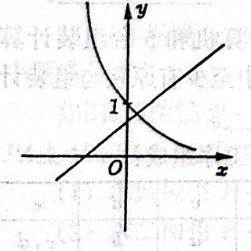
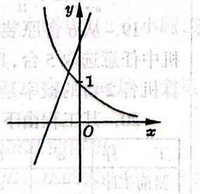
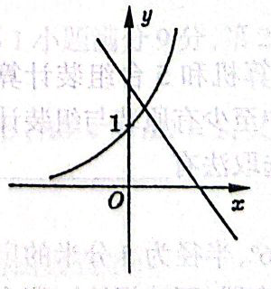
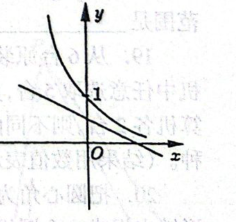
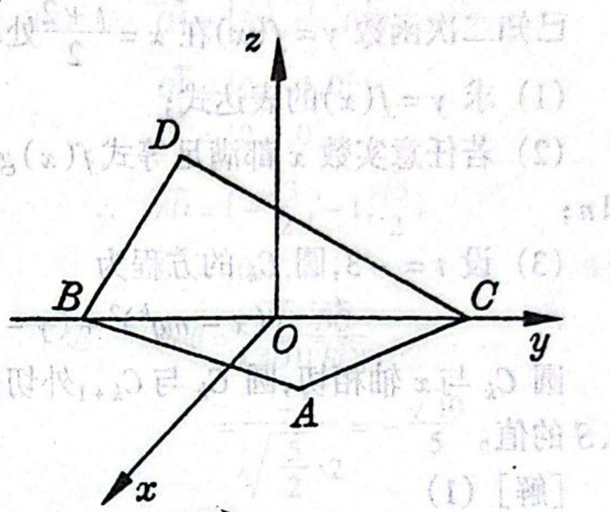
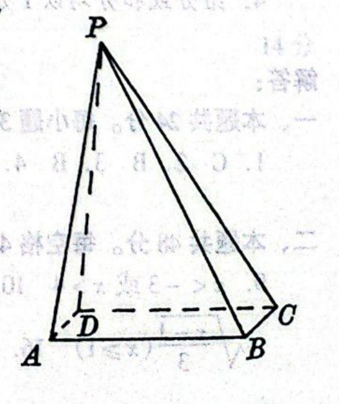

# 1995年上海卷（文）

## 单选题

### 第 1 题

$y=\sin^2 x$ 是（）

A.  
最小正周期为 $2\pi$ 的偶函数

B.  
最小正周期为 $2 \pi$ 的奇函数

C.  
最小正周期为 $\pi$ 的偶函数

D.  
最小正周期为 $\pi$ 的奇函数

#### 答案

C

#### 解析

由 $\sin^2x=\dfrac{1-\cos2x}{2}$，函数的周期为 $\pi$，且 $\sin^2(-x)=\sin^2x$，所以它是偶函数. 若 $T>0$ 是它的周期，则 $\cos2(x+T)=\cos2x$ 对任意 $x$ 成立，从而 $2T$ 必为 $2\pi$ 的整数倍，即 $T$ 是 $\pi$ 的正整数倍. 因此最小正周期为 $\pi$，故选 C.

### 第 2 题

如果 $P = \{x \mid (x - 1)(2x - 5) < 0\}$，$Q = \{x \mid 0 < x < 10\}$，那么（）

A.  
$P\cap Q=\emptyset$

B.  
$P \subset Q$

C.  
$P\supset Q$

D.  
$P\cup Q=\mathbb{R}$

#### 答案

B

#### 解析

不等式 $(x-1)(2x-5)<0$ 的两个零点为 $1$ 和 $\dfrac{5}{2}$，所以 $P=\left(1,\dfrac{5}{2}\right)$. 又 $Q=(0,10)$，因此 $P\subset Q$，而其余三个选项均不成立. 因此选 B.

### 第 3 题

方程 $\tan\left(2x+\frac{\pi}{3}\right)=\frac{\sqrt{3}}{3}$ 在区间 $[0,2\pi)$ 上解的个数是（）

A.  
$5$

B.  
$4$

C.  
$3$

D.  
$2$

#### 答案

B

#### 解析

由 $\tan\alpha=\dfrac{\sqrt3}{3}$ 得 $\alpha=\dfrac{\pi}{6}+k\pi$，其中 $k\in\mathbb{Z}$. 令 $\alpha=2x+\dfrac{\pi}{3}$，则

$$

2x+\frac{\pi}{3}=\frac{\pi}{6}+k\pi
\iff x=-\frac{\pi}{12}+\frac{k\pi}{2}

$$

当 $0\leqslant x<2\pi$ 时，

$$

0\leqslant-\frac{\pi}{12}+\frac{k\pi}{2}<2\pi
\iff \frac16\leqslant k<\frac{25}{6}

$$

所以整数 $k=1$，$2$，$3$，$4$，共有 $4$ 个解. 因此选 B.

### 第 4 题

设棱锥的底面面积是 $8\mathrm{~cm}^2$，那么这个棱锥的中截面（过棱锥高的中点且平行于底面的截面）的面积是（）

A.  
$4\mathrm{~cm}^2$

B.  
$2\sqrt{2}\mathrm{~cm}^2$

C.  
$2\mathrm{~cm}^2$

D.  
$\sqrt{2}\mathrm{~cm}^2$

#### 答案

C

#### 解析

棱锥被过高的中点且平行于底面的平面截得的截面与底面相似，线性比为 $\dfrac{1}{2}$，所以面积比为 $\dfrac{1}{4}$. 因而中截面面积为 $8\times\dfrac14=2\mathrm{~cm}^2$，故选 C.

### 第 5 题

“$ab<0$”是“方程 $ax^2+by^2=c$ 表示双曲线”的（）

A.  
必要条件但不是充分条件

B.  
充分条件但不是必要条件

C.  
充分必要条件

D.  
既不是充分条件又不是必要条件

#### 答案

A

#### 解析

若方程 $ax^2+by^2=c$ 表示双曲线，则二次项系数必须异号，所以必有 $ab<0$. 但 $ab<0$ 还不充分，例如 $c=0$ 时方程退化为两条相交直线而不是双曲线. 因此 $ab<0$ 是必要条件但不是充分条件，故选 A.

### 第 6 题

当 $a\neq 0$ 时，函数 $y=ax+b$ 和 $y=b^{ax}$ 的图象只可能是（）

A.  

B.  

C.  

D.  

#### 答案

A

#### 解析

指数函数的定义要求 $b>0$ 且 $b\ne1$. 两个图象分别与 $y$ 轴交于 $(0,b)$ 和 $(0,1)$，直线的斜率为 $a$，而指数函数的单调性由 $a\ln b$ 的符号决定.

若 $a>0$ 且 $0<b<1$，则直线递增，且在 $y$ 轴上的截距 $b$ 位于 $0$ 与 $1$ 之间；指数函数递减并经过 $(0,1)$，这正是图 A.

其余三图分别违反“直线在 $y$ 轴上的截距为 $b$”与“指数函数经过 $(0,1)$”所带来的对应关系：若 $a>0$ 且 $b>1$，直线截距大于 $1$，但指数函数应递增；若 $a<0$ 且 $0<b<1$，指数函数递增，但直线截距小于 $1$；若 $a<0$ 且 $b>1$，指数函数递减，但直线截距大于 $1$. 因此只有图 A 可能，故选 A.

### 第 7 题

当 $0<a<b<1$ 时，下列不等式中正确的是（）

A.  
$(1 - a)^{\frac{1}{b}} > (1 - a)^{b}$

B.  
$(1 + a)^{a} > (1 + b)^{b}$

C.  
$(1 - a)^{b} > (1 - a)^{\frac{b}{2}}$

D.  
$(1 - a)^{a} > (1 - b)^{b}$

#### 答案

D

#### 解析

因为 $0<1-a<1$，且 $0<b<1$ 给出 $\dfrac1b>b$，所以底数在 $(0,1)$ 内时幂指数越大，幂值越小，从而

$$

(1-a)^{1/b}<(1-a)^b

$$

故 A 错误.

令 $h(t)=t\ln(1+t)$. 对 $t>0$，有

$$

h'(t)=\ln(1+t)+\frac{t}{1+t}>0

$$

所以 $h$ 在正半轴上递增，因而 $0<a<b$ 时 $(1+a)^a<(1+b)^b$，B 错误.

又因为 $b>\dfrac b2$ 且 $0<1-a<1$，所以

$$

(1-a)^b<(1-a)^{b/2}

$$

故 C 错误.

令 $g(t)=t\ln(1-t)$，其中 $0<t<1$. 则

$$

g'(t)=\ln(1-t)-\frac{t}{1-t}<0

$$

因为 $\ln(1-t)<0$ 且 $-\dfrac{t}{1-t}<0$. 所以 $g(a)>g(b)$，即

$$

a\ln(1-a)>b\ln(1-b)
\iff (1-a)^a>(1-b)^b

$$

故 D 正确.

### 第 8 题

下列四个命题中的真命题是（）

A.  
经过定点 $P_0(x_0,y_0)$ 的直线都可以用方程 $y-y_0=k(x-x_0)$ 表示

B.  
经过任意两个不同的点 $P_1(x_1,y_1)$，$P_2(x_2,y_2)$ 的直线都可以用方程 $(y-y_1)(x_2-x_1)=(x-x_1)(y_2-y_1)$ 表示

C.  
不经过原点的直线都可以用方程 $\frac{x}{a}+\frac{y}{b}=1$ 表示

D.  
经过定点 $A(0,b)$ 的直线都可以用方程 $y=kx+b$ 表示

#### 答案

B

#### 解析

第一项中的方程要求直线斜率有限，不能表示经过 $P_0$ 的竖直直线. 第三项不能表示与坐标轴平行且不经过原点的直线，例如 $x=1$. 第四项同样不能表示经过 $A(0,b)$ 的竖直直线 $x=0$.

对任意不同两点 $P_1(x_1,y_1)$，$P_2(x_2,y_2)$，考虑方程

$$

(y-y_1)(x_2-x_1)=(x-x_1)(y_2-y_1)

$$

两点分别代入时等式都成立. 若 $x_2\ne x_1$，方程可化为

$$

y-y_1=\frac{y_2-y_1}{x_2-x_1}(x-x_1)

$$

这正是过两点的直线方程；若 $x_2=x_1$，由于两点不同，必有 $y_2\ne y_1$，原方程化为 $x=x_1$，也正是过两点的竖直直线. 因此真命题是 B.

## 填空题

### 第 9 题

不等式 $\frac{2x-1}{x+3}>1$ 的解是＿＿＿＿＿＿.

#### 答案

$x<-3$ 或 $x>4$

#### 解析

定义域要求 $x\ne-3$. 移项并通分，得

$$

\frac{2x-1}{x+3}-1=\frac{x-4}{x+3}>0

$$

临界点为 $-3$ 和 $4$. 当 $x<-3$ 时，分子、分母均为负，分式为正；当 $-3<x<4$ 时，分子为负而分母为正，分式为负；当 $x>4$ 时，分子、分母均为正，分式为正. 因此解集为 $x<-3$ 或 $x>4$.

### 第 10 题

双曲线 $\frac{x^{2}}{2}-\frac{8y^{2}}{9}=8$ 的渐近线方程是＿＿＿＿＿＿.

#### 答案

$3x\pm4y=0$

#### 解析

将方程除以 $8$，化为

$$

\frac{x^2}{16}-\frac{y^2}{9}=1

$$

这是实轴在 $x$ 轴上的双曲线，渐近线为 $y=\pm\dfrac{3}{4}x$，即 $3x\pm4y=0$.

### 第 11 题

$1992$ 年底世界人口达到 $54.8\text{ 亿}$，若人口的年平均增长率为 $x\%$，$2000$ 年底世界人口数为 $y$（$\text{亿}$），那么 $y$ 与 $x$ 的函数关系式是＿＿＿＿＿＿.

#### 答案

$y=54.8\left(1+x\%\right)^8$

#### 解析

每年人口数乘以增长因子 $1+\dfrac{x}{100}=1+x\%$. 从 1992 年底到 2000 年底经过 $8$ 年，因此

$$

y=54.8\left(1+\frac{x}{100}\right)^8=54.8\left(1+x\%\right)^8

$$

### 第 12 题

已知 $\log_3 x=-\frac{1}{\log_2 3}$，那么 $x+x^2+x^3+\cdots+x^n+\cdots=$＿＿＿＿＿＿.

#### 答案

$1$

#### 解析

由换底公式，$\dfrac{1}{\log_2 3}=\log_3 2$，所以 $\log_3x=-\log_3 2=\log_3\dfrac12$，从而 $x=\dfrac12$. 于是等比级数的首项为 $\dfrac12$，公比也为 $\dfrac12$，其和为

$$

\frac{\frac12}{1-\frac12}=1

$$

### 第 13 题

若 $(x+1)^n=x^n+\cdots+ax^3+bx^2+\cdots+1$（$n\in\mathbb{N}$），且 $a:b=3:1$，那么 $n=$＿＿＿＿＿＿.

#### 答案

$11$

#### 解析

在二项式展开式中，$x^3$ 和 $x^2$ 的系数分别为 $a=\mathrm C_n^3$ 和 $b=\mathrm C_n^2$. 因而

$$

\frac{a}{b}=\frac{\mathrm C_n^3}{\mathrm C_n^2}=\frac{n-2}{3}=3

$$

解得 $n=11$，满足 $n\in\mathbb{N}$.

### 第 14 题

到点 $A(-1,0)$ 和直线 $x = 3$ 距离相等的点的轨迹方程是＿＿＿＿＿＿.

#### 答案

$y^2=-8x+8$

#### 解析

设轨迹上的点为 $M(x,y)$. 点 $M$ 到点 $A(-1,0)$ 的距离等于它到直线 $x=3$ 的距离，所以

$$

\sqrt{(x+1)^2+y^2}=|x-3|

$$

等式两边均为非负数，平方是等价变形. 化简得 $x^2+2x+1+y^2=x^2-6x+9$，即 $y^2=-8x+8$.

### 第 15 题

函数 $y=3x^2+1$（$x\leqslant 0$）的反函数是 $y=$＿＿＿＿＿＿.

#### 答案

$-\sqrt{\frac{x-1}{3}}$（$x\geqslant1$）

#### 解析

原函数在 $x\leqslant0$ 上递减，值域为 $[1,+\infty)$. 由 $y=3x^2+1$ 且 $x\leqslant0$，得 $x=-\sqrt{\dfrac{y-1}{3}}$. 交换自变量和因变量，反函数为 $y=-\sqrt{\frac{x-1}{3}}$，$x\geqslant1$.

### 第 16 题

函数 $y=\lg\sqrt{10^{x}-2}$ 的定义域是＿＿＿＿＿＿.

#### 答案

$(\lg2,+\infty)$

#### 解析

因为对数真数 $\sqrt{10^x-2}$ 必须为正，所以必须有 $10^x-2>0$，即 $10^x>2$，从而 $x>\lg2$. 因此定义域为 $(\lg2,+\infty)$.

### 第 17 题

函数 $y=\sin\frac{x}{2}+\cos\frac{x}{2}$ 在 $(-2\pi,2\pi)$ 内的递增区间是＿＿＿＿＿＿.

#### 答案

$\left[-\frac{3\pi}{2},\frac{\pi}{2}\right]$

#### 解析

令 $u=\dfrac{x}{2}$，则

$$

y'=\frac12\left(\cos\frac{x}{2}-\sin\frac{x}{2}\right)=\frac{\sqrt2}{2}\cos\left(\frac{x}{2}+\frac{\pi}{4}\right)

$$

在 $-2\pi<x<2\pi$ 内，导数在 $-\dfrac{3\pi}{2}<x<\dfrac{\pi}{2}$ 时为正，在其余部分为负. 因而函数在该递增区间的闭包 $\left[-\dfrac{3\pi}{2},\dfrac{\pi}{2}\right]$ 上递增.

## 选做题：填空题

### 第 18 题

若 $\displaystyle\lim_{n\to\infty}\left[1+(r+1)^n\right]=1$，则 $r$ 的取值范围是＿＿＿＿＿＿.

#### 答案

$-2<r<0$

#### 解析

极限等于 $1$ 当且仅当 $(r+1)^n\to0$. 对实数公比而言，等比数列的极限为零的充要条件是 $|r+1|<1$，因此

$$

-1<r+1<1

$$

即 $-2<r<0$. 当 $r=-2$ 或 $r=0$ 时，公比分别为 $-1$ 或 $1$，数列不趋于零，两个端点均不能取.

### 第 19 题

从$6\text{ 台}$原装计算机和$5\text{ 台}$组装计算机中任意选取$5\text{ 台}$，其中至少有原装与组装计算机各$2\text{ 台}$，则不同的选取法有＿＿＿＿＿＿ 种（结果用数值表示）.

#### 答案

$350$

#### 解析

至少选取原装和组装计算机各 $2$ 台，选取数量只有 $(2,3)$ 和 $(3,2)$ 两种情形. 因而不同选取法共有

$$

\mathrm C_6^2\mathrm C_5^3+\mathrm C_6^3\mathrm C_5^2=15\times10+20\times10=350

$$

种.

### 第 20 题

把圆心角为 $216^{\circ}$，半径为 $5\text{ 分米}$ 的扇形铁皮焊成一个圆锥形容器（不计焊缝），那么容器的容积是＿＿＿＿＿＿ $\text{立方分米}$（结果保留两位小数）.

#### 答案

$37.70$（或 $37.68$ 或 $37.69$）

#### 解析

扇形弧长为

$$

\frac{216^{\circ}}{360^{\circ}}\cdot2\pi\cdot5=6\pi

$$

焊成圆锥后，扇形弧长等于圆锥底面周长，故底面半径 $R$ 满足 $2\pi R=6\pi$，得 $R=3$. 圆锥母线长为 $5$，所以高为 $h=\sqrt{5^2-3^2}=4$，容积为

$$

V=\frac13\pi R^2h=12\pi\approx37.70\text{ 立方分米}

$$

### 第 21 题

$\displaystyle\lim_{n\to\infty}\left(1+\frac{1}{n}\right)^{n-2}=$＿＿＿＿＿＿.

#### 答案

$\e$

#### 解析

$$

\left(1+\frac1n\right)^{n-2}=\frac{\left(1+\frac1n\right)^n}{\left(1+\frac1n\right)^2}

$$

由基本极限 $\left(1+\dfrac1n\right)^n\to\e$，且 $\left(1+\dfrac1n\right)^2\to1\ne0$，所以商的极限存在且为

$$

\frac{\e}{1}=\e

$$

### 第 22 题

从$6\text{ 台}$原装计算机和$5\text{ 台}$组装计算机中任意选取$5\text{ 台}$，其中至少有原装与组装计算机各$2\text{ 台}$的概率是＿＿＿＿＿＿.

#### 答案

$\frac{25}{33}$（或 $0.76$）

#### 解析

从 $11$ 台计算机中任取 $5$ 台，基本事件总数为 $\mathrm C_{11}^5$. 满足条件的选取法有 $350$ 种，因此所求概率为

$$

\frac{350}{\mathrm C_{11}^5}=\frac{350}{462}=\frac{25}{33}\approx0.76

$$

### 第 23 题

某工程由下列工序组成，那么工程总时数是＿＿＿＿＿＿ $\text{天}$.

|     工序     | $a$ | $b$ | $c$ | $d$ |    $e$     |
|:------------:|:-----:|:-----:|:-----:|:-----:|:------------:|
|   紧前工序   |   —   | $a$ | $a$ | $b$ | $c$，$d$ |
| 工时数（天） | $2$ | $3$ | $5$ | $6$ |    $3$     |

#### 答案

$14$

#### 解析

工序 $a$ 先进行，最早在第 $2$ 天结束；工序 $b$、$c$ 均在 $a$ 后开始，最早结束时间分别为 $2+3=5$ 天和 $2+5=7$ 天；工序 $d$ 在 $b$ 后开始，最早在第 $5+6=11$ 天结束；工序 $e$ 必须等 $c$、$d$ 都结束后才能开始，因此最早在第 $\max\{7,11\}+3=14$ 天结束. 所以工程总时数为 $14$ 天.

## 选做题：解答题

### 第 24 题

已知 $\tan\left(\frac{\pi}{4}+\theta\right)=3$，求 $\sin2\theta-2\cos^{2}\theta$ 的值.

#### 解析

因为

$$

\frac{1+\tan\theta}{1-\tan\theta}=3

$$

解得 $\tan\theta=\frac{1}{2}$. 于是

$$

\sin2\theta-2\cos^2\theta
=\sin2\theta-\cos2\theta-1
=\frac{2\tan\theta}{1+\tan^2\theta}-\frac{1-\tan^2\theta}{1+\tan^2\theta}-1
=\frac{4}{5}-\frac{3}{5}-1=-\frac{4}{5}

$$

### 第 25 题

已知复数 $z_1$，$z_2$ 满足 $|z_1|=|z_2|=1$，且 $z_1+z_2=\i$. 求 $z_1$，$z_2$ 的值.

#### 解析

设 $z_1=a+b\i$，$z_2=c+d\i$（$a$，$b$，$c$，$d\in\mathbb{R}$）. 由 $z_1+z_2=\i$ 比较实部和虚部，得 $a+c=0$，$b+d=1$. 又由 $|z_1|=|z_2|=1$，有 $a^2+b^2=1$，$c^2+d^2=1$. 利用 $c=-a$ 将两式相减，得 $b^2=d^2$，即

$$

(b-d)(b+d)=0

$$

因为 $b+d=1\ne0$，所以 $b=d=\frac{1}{2}$，且 $c=-a$. 再由 $a^2+b^2=1$，得 $a^2=1-\frac{1}{4}=\frac{3}{4}$，$a=\pm\frac{\sqrt{3}}{2}$. 于是 $z_1=\frac{\sqrt{3}}{2}+\frac{1}{2}\i$，$z_2=-\frac{\sqrt{3}}{2}+\frac{1}{2}\i$ 或 $z_1=-\frac{\sqrt{3}}{2}+\frac{1}{2}\i$，$z_2=\frac{\sqrt{3}}{2}+\frac{1}{2}\i$.

### 第 26 题

如图，在空间直角坐标系中，$BC=2$，原点 $O$ 是 $BC$ 的中点，点 $A$ 的坐标是 $\left(\frac{\sqrt{3}}{2},\frac{1}{2},0\right)$，点 $D$ 在平面 $yoz$ 上，且 $\angle BDC=90^\circ$，$\angle DCB=30^\circ$.

1.  求向量 $\overrightarrow{OD}$ 的坐标；

2.  设向量 $\overrightarrow{AD}$ 和 $\overrightarrow{BC}$ 的夹角为 $\theta$，求 $\cos\theta$ 的值.

#### 解析

1.  由 $O$ 是 $BC$ 的中点且 $BC=2$，得 $B=(0,-1,0)$，$C=(0,1,0)$. 三角形 $BDC$ 在 $D$ 处直角，故 $BC$ 是斜边；又 $\angle DCB=30^\circ$，所以 $CD=BC\cos30^\circ=\sqrt{3}$. 由图中 $D$ 位于 $z$ 轴正向一侧，且 $D$ 在平面 $yoz$ 上，得 $z_D=CD\sin30^\circ=\frac{\sqrt{3}}{2}$，$y_D=1-CD\cos30^\circ=-\frac{1}{2}$. 因此

$$

\overrightarrow{OD}=\left(0,-\frac{1}{2},\frac{\sqrt{3}}{2}\right)

$$

2.  因为 $\overrightarrow{OA}=\left(\frac{\sqrt{3}}{2},\frac{1}{2},0\right)$，$\overrightarrow{OB}=(0,-1,0)$，$\overrightarrow{OC}=(0,1,0)$，所以 $\overrightarrow{AD}=\left(-\frac{\sqrt{3}}{2},-1,\frac{\sqrt{3}}{2}\right)$，$\overrightarrow{BC}=(0,2,0)$. 于是

$$

\cos\theta=\frac{\overrightarrow{AD}\cdot\overrightarrow{BC}}{|\overrightarrow{AD}||\overrightarrow{BC}|}
    =\frac{-2}{\sqrt{\frac{5}{2}}\cdot2}=-\frac{\sqrt{10}}{5}

$$

### 第 27 题

设 $y=f(x)$ 是二次函数，方程 $f(x)=0$ 有两个相等的实根，且 $f'(x)=2x+2$.

1.  求 $y=f(x)$ 的表达式；

2.  求 $y=f(x)$ 的图象与两坐标轴所围成图形的面积.

#### 解析

1.  设 $f(x)=ax^2+bx+c$，则 $f'(x)=2ax+b$. 又因为 $f'(x)=2x+2$，所以 $a=1$，$b=2$，从而

$$

f(x)=x^2+2x+c

$$

    方程 $f(x)=0$ 有两个相等的实根，所以判别式 $\Delta=4-4c=0$，即 $c=1$. 因此

$$

f(x)=x^2+2x+1

$$

2.  因为 $f(x)=(x+1)^2$，抛物线与 $x$ 轴相切于 $(-1,0)$，与 $y$ 轴交于 $(0,1)$，且在区间 $[-1,0]$ 上 $f(x)\geqslant0$，所以两坐标轴与图象围成的面积为

$$

S=\int_{-1}^{0}(x^2+2x+1)\mathrm{d}x
    =\left(\frac{1}{3}x^3+x^2+x\right)\Big|_{-1}^{0}
    =\frac{1}{3}

$$

## 解答题

### 第 28 题

如图，四棱锥 $P-ABCD$ 中，底面是一个矩形，$AB=3$，$AD=1$，又 $PA\perp AB$，$PA=4$，$\angle PAD=60^\circ$.

1.  求四棱锥 $P-ABCD$ 的体积；

2.  求二面角 $P-BC-D$ 的大小（用反三角函数表示）.

#### 解析

1.  因为 $AB\perp AD$，$AB\perp AP$，所以 $AB\perp$ 平面 $PAD$. 又 $AB\subset$ 平面 $ABCD$，所以平面 $ABCD\perp$ 平面 $PAD$.

    在平面 $PAD$ 中，作 $PE\perp AD$，交 $AD$ 的延长线于点 $E$. 因为 $AD$ 是平面 $PAD$ 与平面 $ABCD$ 的交线，且 $AE=AP\cos60^\circ=2>AD$，所以 $PE\perp$ 平面 $ABCD$.

    在直角三角形 $PAE$ 中，$PE=AP\sin60^\circ=2\sqrt{3}$. 因此

$$

V_{P-ABCD}=\frac{1}{3}AB\cdot AD\cdot PE=2\sqrt{3}

$$

2.  在平面 $ABCD$ 中，作 $EF\parallel DC$，交 $BC$ 的延长线于点 $F$，则 $EF\perp BF$，连接 $PF$. 因为 $PE\perp$ 平面 $ABCD$，且 $EF\perp BF$，所以 $PF\perp BF$（三垂线定理）.

    于是 $\angle PFE$ 是二面角 $P-BC-D$ 的平面角. 在直角三角形 $PEF$ 中，

$$

\tan\angle PFE=\frac{PE}{EF}=\frac{2\sqrt{3}}{3}

$$

    因此，二面角 $P-BC-D$ 的大小为

$$

\arctan\frac{2\sqrt{3}}{3}

$$

### 第 29 题

设椭圆的方程为 $\frac{x^2}{m^2}+\frac{y^2}{n^2}=1$（$m$，$n>0$），过原点且倾角为 $\theta$ 和 $\pi-\theta$（$0<\theta<\frac{\pi}{2}$）的两条直线分别交椭圆于 $A$，$C$ 和 $B$，$D$ 四点.

1.  用 $\theta$，$m$，$n$ 表示四边形 $ABCD$ 的面积 $S$；

2.  若 $m$，$n$ 为定值，当 $\theta$ 在 $\left(0,\frac{\pi}{4}\right]$ 上变化时，求 $S$ 的最大值 $u$.

#### 解析

1.  设经过原点且倾角为 $\theta$ 的直线方程为 $y=x\tan\theta$，则方程组为

$$

\begin{cases}
    y=x\tan\theta,\\
    \dfrac{x^2}{m^2}+\dfrac{y^2}{n^2}=1.
    \end{cases}

$$

    代入 $y=x\tan\theta$，得

$$

\frac{x^2}{m^2}+\frac{x^2\tan^2\theta}{n^2}=1

$$

    所以 $x^2=\frac{m^2n^2}{n^2+m^2\tan^2\theta}$，$y^2=x^2\tan^2\theta =\frac{m^2n^2\tan^2\theta}{n^2+m^2\tan^2\theta}$. 由对称性，得四边形 $ABCD$ 为矩形，又因为 $0<\theta<\frac{\pi}{2}$，所以四边形 $ABCD$ 的面积

$$

S=4|x||y|=\frac{4m^2n^2\tan\theta}{n^2+m^2\tan^2\theta}

$$

2.  

$$

S=\frac{4m^2n^2}{\dfrac{n^2}{\tan\theta}+m^2\tan\theta}

$$

    1.  当 $m\geqslant n$，即 $\frac{n}{m}\leqslant1$ 时，

$$

\frac{n^2}{\tan\theta}+m^2\tan\theta\geqslant2mn

$$

        且仅当 $\tan^2\theta=\frac{n^2}{m^2}$ 时等号成立. 因此

$$

S\leqslant\frac{4m^2n^2}{2mn}=2mn

$$

        由于 $0<\theta\leqslant\frac{\pi}{4}$，$0<\tan\theta\leqslant1$，且 $\frac{n}{m}\leqslant1$，故取 $\tan\theta=\frac{n}{m}$，得 $u=2mn$. 当 $m=n$ 时取 $\theta=\frac{\pi}{4}$，该结论仍成立.

    2.  当 $m<n$，即 $\frac{n}{m}>1$ 时，令 $t_i=\tan\theta_i$（$i=1$，$2$）. 对任意 $0<\theta_1<\theta_2\leqslant\frac{\pi}{4}$，有 $0<t_1<t_2\leqslant1$，且

$$

\left(m^2t_2+\frac{n^2}{t_2}\right)-\left(m^2t_1+\frac{n^2}{t_1}\right)=(t_2-t_1)\frac{m^2t_1t_2-n^2}{t_1t_2}<0

$$

        其中 $t_2-t_1>0$，$m^2t_1t_2\leqslant m^2<n^2$，故分母中的量随 $\theta$ 增大而减小，从而 $S$ 是 $\theta$ 的递增函数. 取 $\theta=\frac{\pi}{4}$，得

$$

u=\frac{4m^2n^2}{m^2+n^2}

$$

### 第 30 题

已知二次函数 $y=f(x)$ 在 $x=\frac{t+2}{2}$ 处取得最小值 $-\frac{t^2}{4}$（$t\neq 0$），$f(1)=0$.

1.  求 $y=f(x)$ 的表达式；

2.  若任意实数 $x$ 都满足等式 $f(x)g(x)+mx+n=x^3$（$g(x)$ 为多项式），试用 $t$ 表示 $m$ 和 $n$；

3.  设 $t=-3$，圆 $C_k$ 的方程为 $(x-mq^k)^2+(y-nq^k)^2=r_k^2$（$0<q<1$，$r_k>0$），圆 $C_k$ 与 $x$ 轴相切，圆 $C_k$ 与 $C_{k+1}$ 外切（$k=0$，$1$，$2$，$\cdots$），记 $S$ 为所有这些圆的面积之和，求 $q$，$S$ 的值.

#### 解析

1.  设

$$

f(x)=a\left(x-\frac{t+2}{2}\right)^2-\frac{t^2}{4}

$$

    因为 $f(1)=0$ 且 $t\neq0$，所以

$$

a\frac{t^2}{4}-\frac{t^2}{4}=0

$$

    从而 $a=1$. 于是

$$

f(x)=x^2-(t+2)x+t+1

$$

2.  因为 $f(x)=(x-1)[x-(t+1)]$，代入已知等式，得

$$

(x-1)[x-(t+1)]g(x)+mx+n=x^3

$$

    将 $x=1$，$x=t+1$ 分别代入上式，得

$$

\begin{cases}
    m+n=1,\\
    (t+1)m+n=(t+1)^3.
    \end{cases}

$$

    两式相减得

$$

tm=(t+1)^3-1=t\left(t^2+3t+3\right)

$$

    因 $t\neq0$，所以 $m=t^2+3t+3$，$n=1-m=-t^2-3t-2$.

3.  当 $t=-3$ 时，$m=3$，$n=-2$. 圆 $C_k$ 的方程为

$$

(x-3q^k)^2+(y+2q^k)^2=r_k^2

$$

    因为圆 $C_k$ 与 $x$ 轴相切，所以 $r_k=2q^k$.

    圆 $C_k$ 的圆心 $O_k=(3q^k,-2q^k)$，所以

$$

|O_kO_{k+1}|^2=(3q^{k+1}-3q^k)^2+(2q^{k+1}-2q^k)^2
    =13q^{2k}(q-1)^2

$$

    因为 $0<q<1$，所以

$$

|O_kO_{k+1}|=\sqrt{13}q^k(1-q)

$$

    又圆 $C_k$ 与 $C_{k+1}$ 外切，所以

$$

r_k+r_{k+1}=|O_kO_{k+1}|

$$

    即

$$

2q^k+2q^{k+1}=\sqrt{13}q^k(1-q)

$$

    解得

$$

q=\frac{\sqrt{13}-2}{\sqrt{13}+2}

$$

    圆 $C_k$ 的面积

$$

S_k=\pi r_k^2=4\pi q^{2k}

$$

    所以

$$

S=S_0+S_1+S_2+\cdots
    =4\pi(1+q^2+q^4+\cdots)
    =\frac{4\pi}{1-q^2}

$$

    令 $s=\sqrt{13}$，则 $q=\frac{s-2}{s+2}$，$q^2=\frac{(s-2)^2}{(s+2)^2}$，$1-q^2=\frac{(s+2)^2-(s-2)^2}{(s+2)^2} =\frac{8s}{(s+2)^2}$. 因此

$$

S=\frac{4\pi}{1-q^2}
    =\frac{\pi(s+2)^2}{2s}
    =\pi\left(2+\frac{17}{26}\sqrt{13}\right)

$$

