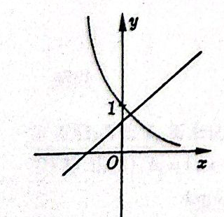
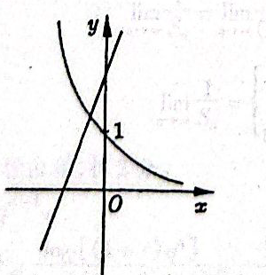
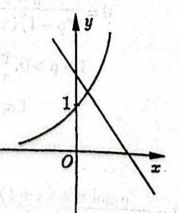
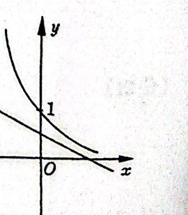
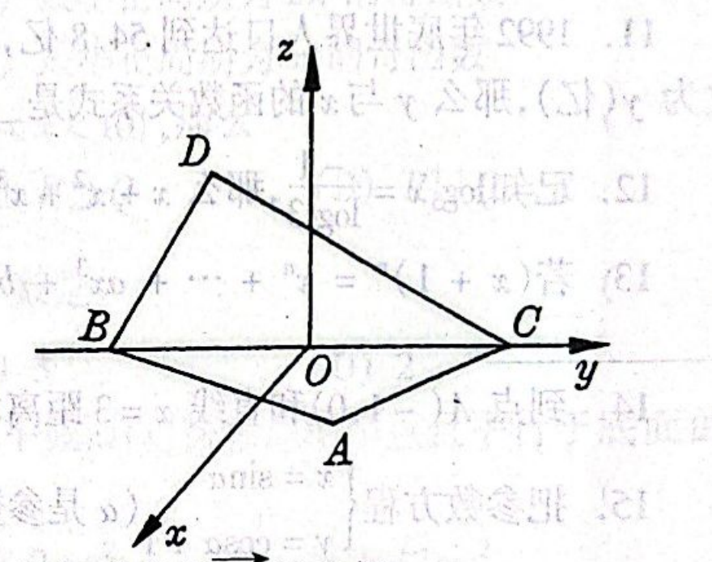
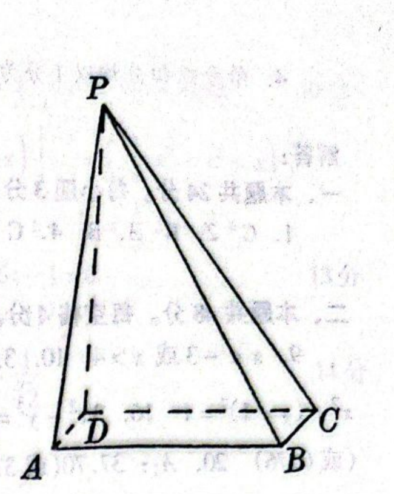

# 1995年上海卷（理）

## 单选题

### 第 1 题

$y=\sin^2 x$ 是（）

A.  
最小正周期为 $2\pi$ 的偶函数

B.  
最小正周期为 $2\pi$ 的奇函数

C.  
最小正周期为 $\pi$ 的偶函数

D.  
最小正周期为 $\pi$ 的奇函数

#### 答案

C

#### 解析

因为 $\sin(-x)=-\sin x$，所以 $y(-x)=\sin^2(-x)=\sin^2x=y(x)$，故该函数是偶函数. 又因为

$$

\sin^2(x+\pi)=\sin^2x

$$

所以 $\pi$ 是它的一个正周期. 若 $0<T<\pi$ 也是正周期，则由 $y(T)=y(0)=0$ 得 $\sin^2T=0$，从而 $T=k\pi$. 但 $0<T<\pi$ 时不存在这样的整数 $k$，所以不存在比 $\pi$ 更小的正周期. 因此最小正周期为 $\pi$，故选 C.

### 第 2 题

如果 $P=\{x\mid (x-1)(2x-5)<0\}$，$Q=\{x\mid 0<x<10\}$，那么（）

A.  
$P\cap Q=\emptyset$

B.  
$P\subset Q$

C.  
$P\supset Q$

D.  
$P\cup Q=\mathbb{R}$

#### 答案

B

#### 解析

不等式的两个临界点为 $1$ 和 $\frac{5}{2}$. 因为二次式的首项系数为正，在三个区间上分别判断符号可得

$$

\begin{cases}
(x-1)(2x-5)>0,&x<1\text{ 或 }x>\frac52,\\
(x-1)(2x-5)<0,&1<x<\frac52.
\end{cases}

$$

所以 $P=\left(1,\frac{5}{2}\right)$. 又 $Q=(0,10)$，且 $1<x<\frac52$ 时必有 $0<x<10$，故 $P\subset Q$. 因此选 B.

### 第 3 题

方程 $\tan\left(2x+\frac{\pi}{3}\right)=\frac{\sqrt{3}}{3}$ 在区间 $[0,2\pi)$ 上解的个数是（）

A.  
$5$

B.  
$4$

C.  
$3$

D.  
$2$

#### 答案

B

#### 解析

因为 $\frac{\sqrt{3}}{3}=\tan\frac{\pi}{6}$，所以 $2x+\frac{\pi}{3}=\frac{\pi}{6}+k\pi$，$(k\in\mathbb{Z})$ 从而

$$

x=-\frac{\pi}{12}+\frac{k\pi}{2}

$$

由 $0\leqslant x<2\pi$ 得

$$

0\leqslant-\frac{\pi}{12}+\frac{k\pi}{2}<2\pi

$$

即 $\frac{1}{6}\leqslant k<\frac{25}{6}$，故 $k=1$，$2$，$3$，$4$. 解为 $x=\frac{5\pi}{12}$，$\ \frac{11\pi}{12}$，$\ \frac{17\pi}{12}$，$\ \frac{23\pi}{12}$ 共有 $4$ 个，故选 B.

### 第 4 题

设棱锥的底面面积是 $8\mathrm{~cm}^2$，那么这个棱锥的中截面（过棱锥高的中点且平行于底面的截面）的面积是（）

A.  
$4\mathrm{~cm}^2$

B.  
$2\sqrt{2}\mathrm{~cm}^2$

C.  
$2\mathrm{~cm}^2$

D.  
$\sqrt{2}\mathrm{~cm}^2$

#### 答案

C

#### 解析

过棱锥高的中点且平行于底面的截面与底面相似，线性相似比为 $\frac{1}{2}$. 因此截面面积与底面面积之比为 $\left(\frac{1}{2}\right)^2=\frac{1}{4}$，截面面积为

$$

8\times\frac{1}{4}=2\mathrm{~cm}^2

$$

故选 C.

### 第 5 题

“$ab<0$”是“方程 $ax^2+by^2=c$ 表示双曲线”的（）

A.  
必要条件但不是充分条件

B.  
充分条件但不是必要条件

C.  
充分必要条件

D.  
既不是充分条件又不是必要条件

#### 答案

A

#### 解析

若 $ax^2+by^2=c$ 表示非退化双曲线，则 $a$ 与 $b$ 的符号必须相反，故必有 $ab<0$. 反之，取 $a=1$、$b=-1$、$c=0$，虽有 $ab<0$，但方程化为

$$

x^2-y^2=0\iff (x-y)(x+y)=0

$$

它表示两条相交直线而不是非退化双曲线. 因此 $ab<0$ 是必要条件但不是充分条件，故选 A.

### 第 6 题

当 $a\neq 0$ 时，函数 $y=ax+b$ 和 $y=b^{ax}$ 的图象只可能是（）

A.  

B.  

C.  

D.  

#### 答案

A

#### 解析

直线 $y=ax+b$ 的斜率为 $a$，在 $y$ 轴上的截距为 $b$，而指数曲线 $y=b^{ax}$ 必过点 $(0,1)$. 为使指数式有意义，须有 $b>0$ 且 $b\ne1$. 当 $b>1$ 时，指数曲线的单调性与 $a$ 同号；当 $0<b<1$ 时，指数曲线的单调性与 $a$ 反号.

图 A 中直线斜率为正、纵轴截距在 $0$ 与 $1$ 之间，指数曲线过 $(0,1)$ 且递减. 这对应于 $a>0$、$0<b<1$，三项条件彼此一致. 图 B 中直线斜率为正且纵轴截距大于 $1$，应有 $b>1$，此时指数曲线应递增，与图示矛盾. 图 C 中直线斜率为负且纵轴截距大于 $1$，应有 $a<0$、$b>1$，此时指数曲线应递减而图示递增. 图 D 中直线斜率为负且 $0<b<1$，此时指数曲线应递增而图示递减. 因此只有图 A 可能，故选 A.

### 第 7 题

当 $0<a<b<1$ 时，下列不等式中正确的是（）

A.  
$(1-a)^{\frac{1}{b}}>(1-a)^b$

B.  
$(1+a)^a>(1+b)^b$

C.  
$(1-a)^b>(1-a)^{\frac{b}{2}}$

D.  
$(1-a)^a>(1-b)^b$

#### 答案

D

#### 解析

逐项判断. 因为 $0<a<b<1$，所以 $0<1-a<1$，且 $b<\frac{1}{b}$. 对于底数在 $(0,1)$ 内的幂函数，指数越大值越小，故

$$

(1-a)^{1/b}<(1-a)^b

$$

选项 A 错误. 又因为 $b>\frac b2$，所以

$$

(1-a)^b<(1-a)^{b/2}

$$

选项 C 错误.

令 $h(x)=x\ln(1+x)$. 当 $x>0$ 时，$\ln(1+x)>0$，故 $h'(x)=\ln(1+x)+\frac{x}{1+x}>0$，$(x>0)$ 所以 $h$ 在正半轴上递增，因而 $h(a)<h(b)$，即 $(1+a)^a<(1+b)^b$，选项 B 错误.

令 $k(x)=x\ln(1-x)$. 当 $0<x<1$ 时，$\ln(1-x)<0$ 且 $\frac{x}{1-x}>0$，故 $k'(x)=\ln(1-x)-\frac{x}{1-x}<0$，$(0<x<1)$ 所以 $k$ 在 $(0,1)$ 上递减，因而 $k(a)>k(b)$，从而 $(1-a)^a>(1-b)^b$. 故正确选项为 D.

### 第 8 题

下列四个命题中的真命题是（）

A.  
经过定点 $P_0(x_0,y_0)$ 的直线都可以用方程 $y-y_0=k(x-x_0)$ 表示

B.  
经过任意两个不同的点 $P_1(x_1,y_1)$，$P_2(x_2,y_2)$ 的直线都可以用方程 $(y-y_1)(x_2-x_1)=(x-x_1)(y_2-y_1)$ 表示

C.  
不经过原点的直线都可以用方程 $\frac{x}{a}+\frac{y}{b}=1$ 表示

D.  
经过定点 $A(0,b)$ 的直线都可以用方程 $y=kx+b$ 表示

#### 答案

B

#### 解析

选项 A 不正确，因为经过点 $P_0(x_0,y_0)$ 的直线还可能是竖直直线 $x=x_0$，而方程 $y-y_0=k(x-x_0)$ 不能表示竖直直线.

选项 B 的方程在 $P_1$、$P_2$ 处都成立. 若 $x_2\ne x_1$，它可化为

$$

y-y_1=\frac{y_2-y_1}{x_2-x_1}(x-x_1)

$$

这是经过两点的直线方程；若 $x_2=x_1$，则因两点不同而有 $y_2-y_1\ne0$，原方程化为 $x=x_1$，同样是经过两点的直线. 所以 B 正确.

选项 C 不正确，例如直线 $x=1$ 不经过原点，但它与 $y$ 轴平行，没有有限的 $x$ 轴截距，不能写成 $\frac{x}{a}+\frac{y}{b}=1$. 选项 D 不正确，因为经过 $A(0,b)$ 的直线还包括竖直直线 $x=0$，而 $y=kx+b$ 不能表示它. 故选 B.

## 填空题

### 第 9 题

不等式 $\frac{2x-1}{x+3}>1$ 的解是＿＿＿＿＿＿.

#### 答案

$x<-3$ 或 $x>4$

#### 解析

定义域要求 $x\ne-3$. 移项得

$$

\frac{2x-1}{x+3}>1
\iff \frac{x-4}{x+3}>0

$$

临界点为 $-3$ 和 $4$. 在 $(-\infty,-3)$、$(-3,4)$、$(4,+\infty)$ 上分别检验符号，分式的符号依次为正、负、正，因此解为

$$

x<-3\quad\text{或}\quad x>4

$$

### 第 10 题

双曲线 $\frac{x^2}{2}-\frac{8y^2}{9}=8$ 的渐近线方程是＿＿＿＿＿＿.

#### 答案

$3x\pm4y=0$

#### 解析

将方程化为标准形式：

$$

\frac{x^2}{2}-\frac{8y^2}{9}=8
\iff \frac{x^2}{16}-\frac{y^2}{9}=1

$$

令标准方程右侧的常数项趋于零，得到其渐近线：

$$

\frac{x^2}{16}-\frac{y^2}{9}=0

$$

这里 $a=4$、$b=3$，所以

$$

y=\pm\frac{3}{4}x\iff 3x\mp4y=0

$$

即渐近线方程为 $3x\pm4y=0$.

### 第 11 题

1992年底世界人口达到 $54.8\text{ 亿}$，若人口的年平均增长率为 $x\%$，2000 年底世界人口数为 $y$（亿），那么 $y$ 与 $x$ 的函数关系式是＿＿＿＿＿＿.

#### 答案

$y=54.8(1+x\%)^8$

#### 解析

每年的增长倍数为 $1+\frac{x}{100}$. 从 1992 年底到 2000 年底经过 $8$ 年，故

$$

y=54.8\left(1+\frac{x}{100}\right)^8

$$

### 第 12 题

已知 $\log_3 x=\frac{-1}{\log_2 3}$，那么 $x+x^2+x^3+\cdots+x^n+\cdots=$＿＿＿＿＿＿.

#### 答案

$1$

#### 解析

由换底公式

$$

\frac{1}{\log_2 3}=\log_3 2

$$

故

$$

\log_3x=-\log_3 2=\log_3\frac12

$$

从而 $x=\frac12$. 于是这是首项为 $\frac12$、公比为 $\frac12$ 的无穷等比数列，且公比绝对值小于 $1$，所以

$$

x+x^2+x^3+\cdots=\frac{x}{1-x}=\frac{1/2}{1-1/2}=1

$$

### 第 13 题

若 $(x+1)^n=x^n+\cdots+ax^3+bx^2+\cdots+1$（$n\in\mathbb{N}$），且 $a:b=3:1$，那么 $n=$＿＿＿＿＿＿.

#### 答案

$11$

#### 解析

二项式展开中，$x^3$ 和 $x^2$ 的系数分别为 $a=\mathrm C_n^3$，$b=\mathrm C_n^2$. 因此

$$

\frac{a}{b}=\frac{\mathrm C_n^3}{\mathrm C_n^2}=\frac{n-2}{3}=3

$$

其中 $n\geqslant3$，解得 $n=11$.

### 第 14 题

到点 $A(-1,0)$ 和直线 $x=3$ 距离相等的点的轨迹方程是＿＿＿＿＿＿.

#### 答案

$y^2=-8x+8$

#### 解析

设所求轨迹上的点为 $M(x,y)$. 由点到点 $A(-1,0)$ 的距离等于点到直线 $x=3$ 的距离，得

$$

\sqrt{(x+1)^2+y^2}=|x-3|

$$

两边平方并整理：

$$

(x+1)^2+y^2=(x-3)^2
\iff y^2=-8x+8

$$

由 $y^2\geqslant0$ 可知该方程给出 $x\leqslant1$，于是 $x-3<0$，故平方过程中没有引入增根，轨迹方程为 $y^2=-8x+8$.

### 第 15 题

把参数方程 $x=\sin\alpha$，$y=\cos\alpha+1$（$\alpha$ 是参数）化为普通方程，结果是＿＿＿＿＿＿.

#### 答案

$x^2+(y-1)^2=1$

#### 解析

由参数方程直接消去 $\alpha$：

$$

x^2+(y-1)^2=\sin^2\alpha+\cos^2\alpha=1

$$

当 $\alpha$ 取遍实数时，$(\sin\alpha,\cos\alpha)$ 取遍单位圆上的全部点，所以普通方程为

$$

x^2+(y-1)^2=1

$$

### 第 16 题

把直角坐标系的原点作为极点，$x$ 轴的正半轴作为极轴，并且在两种坐标系中取相同的长度单位. 若曲线的极坐标方程是 $\rho^2=\frac{1}{4\cos^2\theta-1}$，则它的直角坐标方程是＿＿＿＿＿＿.

#### 答案

$3x^2-y^2=1$

#### 解析

在两种坐标系中原点和长度单位相同，有 $x=\rho\cos\theta$，$y=\rho\sin\theta$，$\rho^2=x^2+y^2$. 由极坐标方程知分母不为零，且 $\rho\ne0$. 将 $\cos^2\theta=\frac{x^2}{\rho^2}$ 代入：

$$

\rho^2=\frac{1}{4x^2/\rho^2-1}
\iff 4x^2-\rho^2=1

$$

再用 $\rho^2=x^2+y^2$，得

$$

3x^2-y^2=1

$$

### 第 17 题

函数 $y=\sin\frac{x}{2}+\cos\frac{x}{2}$ 在 $(-2\pi,2\pi)$ 内的递增区间是＿＿＿＿＿＿.

#### 答案

$\left[-\frac{3\pi}{2},\frac{\pi}{2}\right]$

#### 解析

求导得

$$

y'=\frac12\cos\frac{x}{2}-\frac12\sin\frac{x}{2}

$$

令 $u=\frac{x}{2}$，则 $y'=0$ 的点满足 $\cos u=\sin u$，即 $x=\frac{\pi}{2}+2k\pi$，$(k\in\mathbb{Z})$. 由于 $y'=\frac12\sqrt2\cos\left(\frac{x}{2}+\frac{\pi}{4}\right)$，其在两个相邻零点 $-\frac{3\pi}{2}$ 与 $\frac{\pi}{2}$ 之间为正，在其余相邻区间为负. 与定义域 $(-2\pi,2\pi)$ 取交，递增区间为

$$

\left[-\frac{3\pi}{2},\frac{\pi}{2}\right]

$$

## 选做题：填空题

### 第 18 题

若 $\displaystyle\lim_{n\to\infty}\left[1+(r+1)^n\right]=1$，则 $r$ 的取值范围是＿＿＿＿＿＿.

#### 答案

$-2<r<0$

#### 解析

极限条件等价于

$$

(r+1)^n\longrightarrow0

$$

实数数列 $q^n$ 趋于 $0$ 的充要条件是 $|q|<1$，因此

$$

|r+1|<1
\iff -1<r+1<1
\iff -2<r<0

$$

当 $r+1=1$ 时数列恒为 $1$，当 $r+1=-1$ 时数列振荡，均不满足条件.

### 第 19 题

从 6 台原装计算机和 5 台组装计算机中任意选取 5 台，其中至少有原装与组装计算机各 2 台，则不同的选取法有＿＿＿＿＿＿ 种（结果用数值表示）.

#### 答案

$350$

#### 解析

设选取的原装计算机数为 $k$，则组装计算机数为 $5-k$，至少各有 $2$ 台时只有两种情况，若 $k=2$，选法数为

$$

\mathrm C_6^2\mathrm C_5^3=15\times10=150;

$$

若 $k=3$，选法数为

$$

\mathrm C_6^3\mathrm C_5^2=20\times10=200

$$

两类互不相交，所以不同选取法共有

$$

150+200=350

$$

种.

### 第 20 题

把圆心角为 $216^\circ$，半径为 $5\text{ 分米}$ 的扇形铁皮焊成一个圆锥形容器（不计焊缝），那么容器的容积是＿＿＿＿＿＿$\text{立方分米}$（结果保留两位小数）.

#### 答案

$37.70$（或 $37.68$，$37.69$）

#### 解析

扇形半径 $5$ 分米焊成圆锥后，扇形弧长成为圆锥底面周长. 扇形圆心角为 $216^\circ$，所以弧长为

$$

\frac{216}{360}\cdot2\pi\cdot5=6\pi

$$

设圆锥底面半径为 $R$，则 $2\pi R=6\pi$，得 $R=3$. 圆锥母线长为 $5$，故高为

$$

h=\sqrt{5^2-3^2}=4

$$

容积为

$$

V=\frac13\pi R^2h=\frac13\pi\cdot3^2\cdot4=12\pi\approx37.70

$$

立方分米.

### 第 21 题

$\displaystyle\lim_{n\to\infty}\left(1+\frac{1}{n}\right)^{n-2}=$＿＿＿＿＿＿.

#### 答案

$\e$

#### 解析

写成

$$

\left(1+\frac1n\right)^{n-2}
=\frac{\left(1+\frac1n\right)^n}{\left(1+\frac1n\right)^2}

$$

由数 $\e$ 的定义，$\left(1+\frac1n\right)^n\to\e$，且 $\left(1+\frac1n\right)^2\to1$，所以

$$

\lim_{n\to\infty}\left(1+\frac1n\right)^{n-2}=\e

$$

### 第 22 题

从 6 台原装计算机和 5 台组装计算机中任意选取 5 台，其中至少有原装与组装计算机各 2 台的概率是＿＿＿＿＿＿.

#### 答案

$\frac{25}{33}$（或 $0.76$）

#### 解析

从 $6+5=11$ 台计算机中任取 $5$ 台，共有

$$

\mathrm C_{11}^5=462

$$

种等可能选法. 满足条件的选法数由两种情况组成：

$$

\mathrm C_6^2\mathrm C_5^3+\mathrm C_6^3\mathrm C_5^2
=150+200=350

$$

因此所求概率为

$$

\frac{350}{462}=\frac{25}{33}\approx0.76

$$

### 第 23 题

复数 $z$ 满足 $(1+2\i)\overline{z}=4+3\i$，那么 $z=$＿＿＿＿＿＿.

#### 答案

$2+\i$

#### 解析

设 $z=u+v\i$，则 $\overline z=u-v\i$. 代入已知方程并比较实部、虚部：

$$

(1+2\i)(u-v\i)=(u+2v)+(2u-v)\i=4+3\i

$$

所以

$$

\begin{cases}
u+2v=4,\\
2u-v=3.
\end{cases}

$$

由第二式得 $v=2u-3$，代入第一式：

$$

u+2(2u-3)=4\iff5u=10\iff u=2

$$

从而 $v=1$. 故

$$

z=2+\i

$$

## 选做题：解答题

### 第 24 题

已知 $\tan\left(\frac{\pi}{4}+\theta\right)=3$，求 $\sin2\theta-2\cos^2\theta$ 的值.

#### 解析

设 $u=\tan\theta$. 若 $\cos\theta=0$，则 $\tan\left(\frac\pi4+\theta\right)=-1$，与题设矛盾，所以 $\tan\theta$ 有意义. 又因 $\tan\left(\frac\pi4+\theta\right)$ 有意义，故 $u\ne1$. 由正切和角公式得

$$

\frac{1+u}{1-u}=3

$$

所以 $1+u=3-3u$，从而 $u=\frac12$.

利用 $\sin2\theta=\frac{2u}{1+u^2}$，$\cos2\theta=\frac{1-u^2}{1+u^2}$，$2\cos^2\theta=1+\cos2\theta$ 原式为

$$

\sin2\theta-\cos2\theta-1
=\frac{2u-(1-u^2)}{1+u^2}-1

$$

代入 $u=\frac12$，得

$$

\frac{1-\frac34}{1+\frac14}-1=\frac15-1=-\frac45

$$

### 第 25 题

已知复数 $z_1$，$z_2$ 满足 $|z_1|=|z_2|=1$，且 $z_1+z_2=\frac{1}{2}+\frac{\sqrt{3}}{2}\i$. 求 $z_1$，$z_2$ 的值.

#### 解析

设 $z_1=\cos\alpha+\i\sin\alpha$，$z_2=\cos\beta+\i\sin\beta$，并令 $w=z_1+z_2=\frac12+\frac{\sqrt3}{2}\i$. 则 $|w|=1$，所以

$$

|w|^2=|z_1|^2+|z_2|^2+2\cos(\alpha-\beta)=2+2\cos(\alpha-\beta)=1

$$

从而 $\cos(\alpha-\beta)=-\frac12$，即 $\alpha-\beta\equiv\frac{2\pi}{3}$ 或 $-\frac{2\pi}{3}\pmod{2\pi}$.

若 $\alpha-\beta\equiv\frac{2\pi}{3}$，则

$$

w=\e^{\i\beta}\left(1+\e^{2\pi\i/3}\right)=\e^{\i\beta}\e^{\i\pi/3}

$$

又 $w=\e^{\i\pi/3}$，所以 $\e^{\i\beta}=1$，即 $z_2=1$，$z_1=\e^{2\pi\i/3}=-\frac12+\frac{\sqrt3}{2}\i$. 另一种相反的角差只交换两者的顺序. 因此

$$

\left(z_1,z_2\right)=\left(1,-\frac12+\frac{\sqrt3}{2}\i\right)
\quad\text{或}\quad
\left(z_1,z_2\right)=\left(-\frac12+\frac{\sqrt3}{2}\i,1\right)

$$

### 第 26 题

如图，在空间直角坐标系中，$BC=2$，原点 $O$ 是 $BC$ 的中点，点 $A$ 的坐标是 $\left(\frac{\sqrt{3}}{2},\frac{1}{2},0\right)$，点 $D$ 在平面 $yoz$ 上，且 $\angle BDC=90^\circ$，$\angle DCB=30^\circ$.

1.  求向量 $\overrightarrow{OD}$ 的坐标；

2.  设向量 $\overrightarrow{AD}$ 和 $\overrightarrow{BC}$ 的夹角为 $\theta$，求 $\cos\theta$ 的值.

#### 解析

1.  因为 $O$ 是 $BC$ 的中点且 $BC=2$，所以 $B=(0,-1,0)$，$C=(0,1,0)$. 在直角三角形 $BDC$ 中，$\angle BDC=90^\circ$，所以 $BC$ 是斜边. 由 $\angle DCB=30^\circ$，故 $DC=BC\cos30^\circ=\sqrt3$，$BD=BC\sin30^\circ=1$. 点 $D$ 在 $yoz$ 平面上，所以 $x_D=0$. 按题图，$\overrightarrow{CD}$ 的 $y$ 分量为负、$z$ 分量为正. 因而

$$

\overrightarrow{CD}
    =\left(0,-DC\cos30^\circ,DC\sin30^\circ\right)
    =\left(0,-\frac32,\frac{\sqrt3}{2}\right)

$$

    于是

$$

D=(0,1,0)+\overrightarrow{CD}
    =\left(0,-\frac12,\frac{\sqrt3}{2}\right)

$$

    从而

$$

\overrightarrow{OD}=\left(0,-\frac12,\frac{\sqrt3}{2}\right)

$$

2.  由题设 $\overrightarrow{OA}=\left(\frac{\sqrt3}{2},\frac12,0\right)$，$\overrightarrow{OB}=(0,-1,0)$，$\overrightarrow{OC}=(0,1,0)$. 所以 $\overrightarrow{AD}=\overrightarrow{OD}-\overrightarrow{OA} =\left(-\frac{\sqrt3}{2},-1,\frac{\sqrt3}{2}\right)$，$\overrightarrow{BC}=\overrightarrow{OC}-\overrightarrow{OB}=(0,2,0)$. 于是

$$

\cos\theta=\frac{\overrightarrow{AD}\cdot\overrightarrow{BC}}{|\overrightarrow{AD}|\,|\overrightarrow{BC}|}
    =\frac{-2}{\sqrt{\frac{5}{2}}\cdot2}
    =-\frac{\sqrt{10}}{5}

$$

### 第 27 题

设 $y=f(x)$ 是二次函数，方程 $f(x)=0$ 有两个相等的实根，且 $f'(x)=2x+2$.

1.  求 $y=f(x)$ 的表达式；

2.  若直线 $x=-t$（$0<t<1$）把 $y=f(x)$ 的图象与两坐标轴所围成图形的面积二等分，求 $t$ 的值.

#### 解析

1.  设 $f(x)=ax^2+bx+c$，则 $f'(x)=2ax+b$. 又已知 $f'(x)=2x+2$，故 $a=1$，$b=2$.

    于是 $f(x)=x^2+2x+c$. 方程 $f(x)=0$ 有两个相等实根，判别式 $\Delta=4-4c=0$，得 $c=1$，所以 $f(x)=x^2+2x+1$.

2.  因为 $f(x)=(x+1)^2\geqslant0$，图形与两坐标轴围成的区域对应于 $-1\leqslant x\leqslant0$. 直线 $x=-t$ 将该区域二等分，故

$$

\int_{-1}^{-t}(x+1)^2\,\mathrm{d}x=\int_{-t}^{0}(x+1)^2\,\mathrm{d}x

$$

    令 $F(x)=\frac13x^3+x^2+x$，则

$$

F(-t)-F(-1)=F(0)-F(-t)

$$

$$

\left(-\frac13t^3+t^2-t+\frac13\right)=\left(\frac13t^3-t^2+t\right)

$$

$$

2t^3-6t^2+6t-1=0

$$

    即 $2(t-1)^3=-1$. 由于 $0<t<1$，取该方程的实根得 $t-1=-\frac1{\sqrt[3]{2}}$，$t=1-\frac1{\sqrt[3]{2}}$.

## 解答题

### 第 28 题

如图，四棱锥 $P-ABCD$ 中，底面是一个矩形，$AB=3$，$AD=1$，又 $PA\perp AB$，$PA=4$，$\angle PAD=60^\circ$.

1.  求四棱锥 $P-ABCD$ 的体积；

2.  求二面角 $P-BC-D$ 的大小（用反三角函数表示）.

#### 解析

1.  因为 $AB\perp AD$，$AB\perp AP$，且 $AD$ 与 $AP$ 是平面 $PAD$ 内的相交直线，所以 $AB\perp$ 平面 $PAD$. 又 $AB\subset$ 平面 $ABCD$，所以平面 $ABCD\perp$ 平面 $PAD$.

    在平面 $PAD$ 中，作 $PE\perp AD$（$AD$ 为平面 $PAD$ 与平面 $ABCD$ 的交线），交 $AD$ 的延长线于点 $E$（因为 $AE=AP\cos60^\circ=2>AD$）.

    所以 $PE\perp$ 平面 $ABCD$. 在直角三角形 $PAE$ 中，

$$

PE=AP\sin60^\circ=2\sqrt{3}

$$

    故

$$

V_{P-ABCD}=\frac{1}{3}AB\cdot AD\cdot PE=2\sqrt{3}

$$

2.  在平面 $ABCD$ 中，过 $E$ 作 $EF\parallel DC$，交 $BC$ 的延长线于点 $F$. 因为 $ABCD$ 是矩形，$EF\parallel DC\parallel AB$，且 $BF\parallel BC$，所以 $EF\perp BF$，且 $EF=AB=3$. 连接 $PF$.

    因为 $PE\perp$ 平面 $ABCD$，$EF\perp BF$，所以 $PF\perp BF$（三垂线定理）.

    平面 $PEF$ 含有两条相交直线 $EF$、$EP$，它们都垂直于 $BF$，故平面 $PEF\perp BC$. 因此，平面 $PEF$ 与两个半平面的交线分别为 $PF$、$EF$，$\angle PFE$ 是二面角 $P-BC-D$ 的平面角. 在直角三角形 $PEF$ 中，

$$

\tan\angle PFE=\frac{PE}{EF}=\frac{2\sqrt{3}}{3}

$$

    所以 $\angle PFE=\arctan\frac{2\sqrt{3}}{3}$. 因此，二面角 $P-BC-D$ 的大小为 $\arctan\frac{2\sqrt{3}}{3}$.

### 第 29 题

设椭圆的方程为 $\frac{x^2}{m^2}+\frac{y^2}{n^2}=1$（$m$，$n>0$），过原点且倾角为 $\theta$ 和 $\pi-\theta$（$0<\theta<\frac{\pi}{2}$）的两条直线分别交椭圆于 $A$，$C$ 和 $B$，$D$ 四点.

1.  用 $\theta$，$m$，$n$ 表示四边形 $ABCD$ 的面积 $S$；

2.  若 $m$，$n$ 为定值，当 $\theta$ 在 $\left(0,\frac{\pi}{4}\right]$ 上变化时，求 $S$ 的最大值 $u$；

3.  如果 $u>mn$，求 $\frac{m}{n}$ 的取值范围.

#### 解析

1.  设经过原点且倾角为 $\theta$ 的直线方程为 $y=x\tan\theta$，解方程组

$$

\begin{cases}
    y=x\tan\theta,\\
    \dfrac{x^2}{m^2}+\dfrac{y^2}{n^2}=1
    \end{cases}

$$

    得

$$

\begin{cases}
    x^2=\dfrac{m^2n^2}{n^2+m^2\tan^2\theta},\\
    y^2=\dfrac{m^2n^2\tan^2\theta}{n^2+m^2\tan^2\theta}
    \end{cases}

$$

. 由对称性，四边形 $ABCD$ 为矩形，又因为 $0<\theta<\frac{\pi}{2}$，所以

$$

S=4|xy|=\frac{4m^2n^2\tan\theta}{n^2+m^2\tan^2\theta}

$$

2.  

$$

S=\frac{4m^2n^2}{\dfrac{n^2}{\tan\theta}+m^2\tan\theta}

$$

    当 $m\geqslant n$ 时，$\frac{n}{m}\leqslant1$. 由基本不等式，

$$

\frac{n^2}{\tan\theta}+m^2\tan\theta\geqslant2mn

$$

    且当 $\tan\theta=\frac{n}{m}$ 时等号成立，所以

$$

S=\frac{4m^2n^2}{\dfrac{n^2}{\tan\theta}+m^2\tan\theta}\leqslant\frac{4m^2n^2}{2mn}=2mn

$$

    由于 $0<\theta\leqslant\frac{\pi}{4}$，$0<\tan\theta\leqslant1$，故当 $\tan\theta=\frac{n}{m}$ 时等号成立，得 $u=2mn$.

    当 $m<n$ 时，令 $t=\tan\theta$，则 $0<t\leqslant1$，且

$$

\frac{\mathrm d}{\mathrm dt}\left(\frac{n^2}{t}+m^2t\right)=m^2-\frac{n^2}{t^2}<m^2-n^2<0

$$

    因此 $\frac{n^2}{t}+m^2t$ 在 $(0,1]$ 上递减，而 $S=\frac{4m^2n^2}{\frac{n^2}{t}+m^2t}$ 在该区间上递增. 最大值在 $t=1$，即 $\theta=\frac\pi4$ 时取得，故 $u=\frac{4m^2n^2}{m^2+n^2}$.

    综上，

$$

u=\begin{cases}
    2mn,&0<n\leqslant m,\\
    \dfrac{4m^2n^2}{m^2+n^2},&0<m<n.
    \end{cases}

$$

3.  按通常定义，椭圆的两个半轴不相等，故需分 $\frac{m}{n}>1$ 与 $\frac{m}{n}<1$ 两种情况讨论. 当 $\frac{m}{n}>1$ 时，$u=2mn>mn$ 恒成立.

    当 $\frac{m}{n}<1$ 时，

$$

\frac{u}{mn}=\frac{4mn}{m^2+n^2}>1

$$

    即 $\left(\frac{m}{n}\right)^2-4\frac{m}{n}+1<0$. 所以 $2-\sqrt{3}<\frac{m}{n}<2+\sqrt{3}$. 又由 $\frac{m}{n}<1$，得 $2-\sqrt{3}<\frac{m}{n}<1$.

    综上所述，在通常的非圆椭圆约定下，当 $u>mn$ 时，$\frac{m}{n}$ 的取值范围为

$$

\left(2-\sqrt{3},1\right)\cup\left(1,+\infty\right)

$$

### 第 30 题

已知二次函数 $y=f(x)$ 在 $x=\frac{t+2}{2}$ 处取得最小值 $-\frac{t^2}{4}$（$t>0$），$f(1)=0$.

1.  求 $y=f(x)$ 的表达式；

2.  若任意实数 $x$ 都满足等式 $f(x)g(x)+a_nx+b_n=x^{n+1}$（$g(x)$ 为多项式，$n\in\mathbb{N}$），试用 $t$ 表示 $a_n$ 和 $b_n$；

3.  设圆 $C_n$ 的方程为 $(x-a_n)^2+(y-b_n)^2=r_n^2$，圆 $C_n$ 与 $C_{n+1}$ 外切（$n=1$，$2$，$3$，$\cdots$），$\{r_n\}$ 是各项都是正数的等比数列，记 $S_n$ 为前 $n$ 个圆的面积之和，求 $r_n$，$S_n$.

#### 解析

1.  设

$$

f(x)=a\left(x-\frac{t+2}{2}\right)^2-\frac{t^2}{4}

$$

    由 $f(1)=0$，得

$$

a\left(1-\frac{t+2}{2}\right)^2-\frac{t^2}{4}=0

$$

    而

$$

1-\frac{t+2}{2}=-\frac t2

$$

    由于 $t>0$，代入上式得 $a\frac{t^2}{4}-\frac{t^2}{4}=0$，从而 $a=1$. 于是

$$

f(x)=x^2-(t+2)x+t+1

$$

2.  $f(x)=(x-1)[x-(t+1)]$，代入已知等式，得

$$

(x-1)[x-(t+1)]g(x)+a_nx+b_n=x^{n+1}

$$

    将 $x=1$，$x=t+1$ 分别代入上式，得

$$

\begin{cases}
    a_n+b_n=1,\\
    (t+1)a_n+b_n=(t+1)^{n+1}
    \end{cases}

$$

    两式相减得 $ta_n=(t+1)^{n+1}-1$，所以 $a_n=\frac{1}{t}\left[(t+1)^{n+1}-1\right]$，$b_n=\frac{t+1}{t}\left[1-(t+1)^n\right]$

3.  由上式可知 $a_n+b_n=1$，故圆 $C_n$ 的圆心 $O_n=(a_n,b_n)$ 在直线 $x+y=1$ 上. 另外

$$

a_{n+1}-a_n=\frac{(t+1)^{n+2}-(t+1)^{n+1}}{t}=(t+1)^{n+1}>0

$$

    于是

$$

|O_nO_{n+1}|=\sqrt{2}|a_{n+1}-a_n|

$$

    又圆 $C_n$ 与 $C_{n+1}$ 外切，故

$$

r_n+r_{n+1}=\sqrt{2}(t+1)^{n+1}

$$

    设 $\{r_n\}$ 的公比为 $q$，则 $r_{n+1}=qr_n$，且

$$

\begin{cases}
    r_n+qr_n=\sqrt{2}(t+1)^{n+1},\\
    r_{n+1}+qr_{n+1}=\sqrt{2}(t+1)^{n+2}
    \end{cases}

$$

    两式相除，得 $q=\frac{r_{n+1}}{r_n}=t+1$.

    于是

$$

r_n=\frac{\sqrt{2}(t+1)^{n+1}}{t+2}

$$

    因为 $r_1=\dfrac{\sqrt{2}(t+1)^2}{t+2}$，且 $q=t+1>1$，所以

$$

S_n=\pi\sum_{k=1}^n r_k^2
    =\frac{2\pi}{(t+2)^2}\sum_{k=1}^n(t+1)^{2k+2}

$$

$$

S_n=\frac{2\pi(t+1)^4}{(t+2)^2}\cdot\frac{(t+1)^{2n}-1}{(t+1)^2-1}
    =\frac{2\pi(t+1)^4}{t(t+2)^3}\left[(t+1)^{2n}-1\right]

$$

