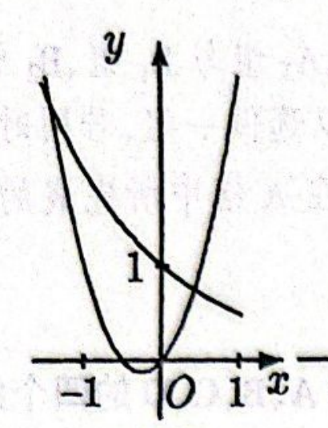
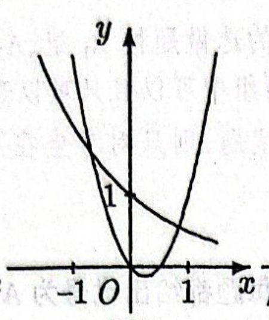
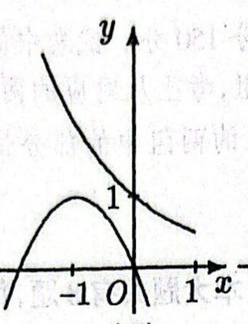
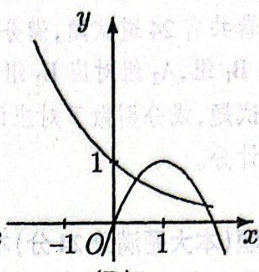
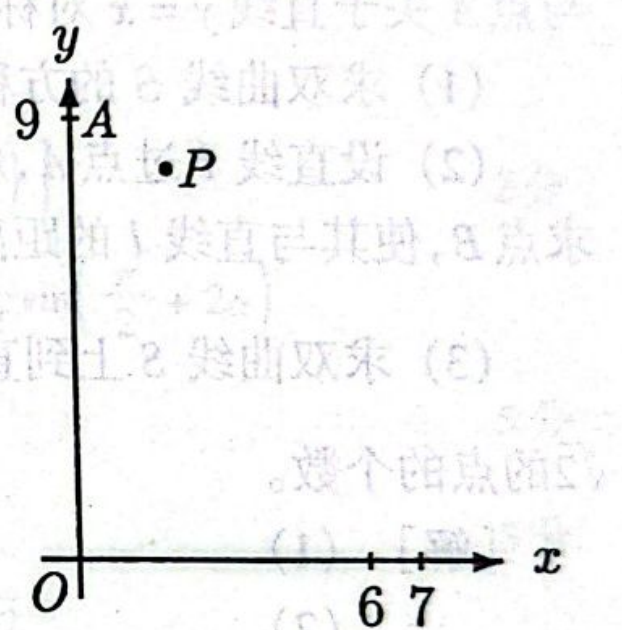
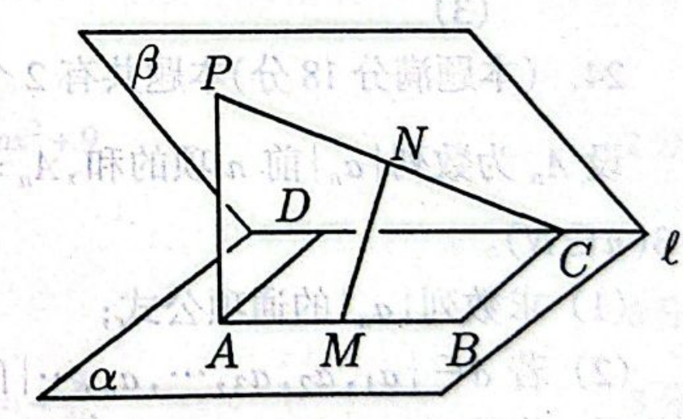
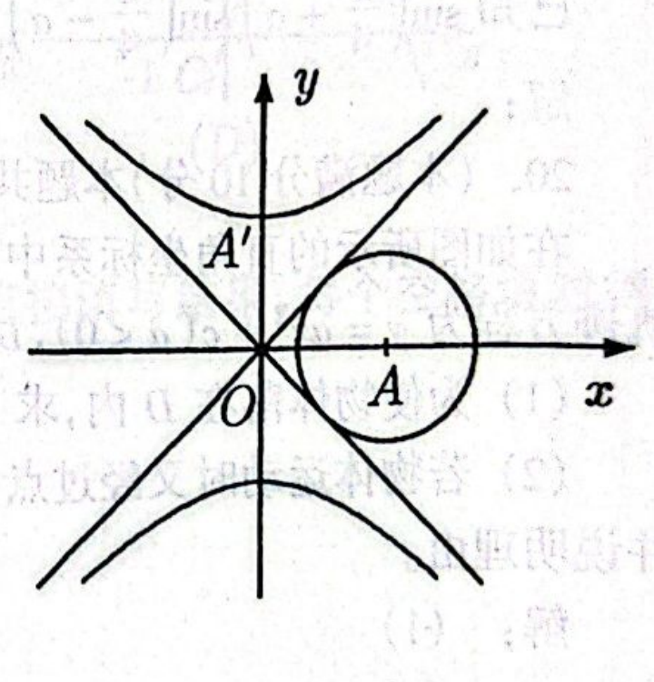

# 1996年上海卷（文）

## 单选题

### 第 1 题

已知集合 $M=\left\{(x,y)\mid x+y=2\right\}$，$N=\left\{(x,y)\mid x-y=4\right\}$，那么集合 $M\cap N$ 为（$\quad$）

A.  
$x=3$，$y=-1$

B.  
$(3,-1)$

C.  
$\{3,-1\}$

D.  
$\{(3,-1)\}$

#### 答案

D

#### 解析

集合 $M\cap N$ 中的点必须同时满足两个方程，因此

$$

\begin{cases}
x+y=2,\\
x-y=4.
\end{cases}

$$

两式相加得 $2x=6$，所以 $x=3$；代入 $x+y=2$ 得 $y=-1$. 因而 $M\cap N$ 只有一个元素，即 $M\cap N=\left\{(3,-1)\right\}$，故选 D.

### 第 2 题

在下列各区间中，函数 $y=\sin\left(x+\frac{\pi}{4}\right)$ 的单调递增区间是（$\quad$）

A.  
$\left[\frac{\pi}{2},\pi\right]$

B.  
$\left[0,\frac{\pi}{4}\right]$

C.  
$\left[-\pi,0\right]$

D.  
$\left[\frac{\pi}{4},\frac{\pi}{2}\right]$

#### 答案

B

#### 解析

令 $t=x+\frac{\pi}{4}$，则函数为 $y=\sin t$. 正弦函数在 $\left[-\frac{\pi}{2}+2k\pi,\frac{\pi}{2}+2k\pi\right]$ 上单调递增. 对选项 A，$x\in\left[\frac{\pi}{2},\pi\right]$ 时 $t\in\left[\frac{3\pi}{4},\frac{5\pi}{4}\right]$，正弦函数在该区间上单调递减；对选项 B，$t\in\left[\frac{\pi}{4},\frac{\pi}{2}\right]$，整个区间位于递增区间内；对选项 C，$t\in\left[-\frac{3\pi}{4},\frac{\pi}{4}\right]$，跨过 $t=-\frac{\pi}{2}$，先减后增；对选项 D，$t\in\left[\frac{\pi}{2},\frac{3\pi}{4}\right]$，位于递减区间内. 因此只有选项 B 符合，故选 B.

### 第 3 题

过点 $(4,0)$ 和点 $(0,3)$ 的直线的倾斜角为（$\quad$）

A.  
$\arctan \frac{3}{4}$

B.  
$\pi-\arctan \frac{3}{4}$

C.  
$\arctan\left(-\frac{3}{4}\right)$

D.  
$\pi-\arctan\left(-\frac{3}{4}\right)$

#### 答案

B

#### 解析

直线的斜率为

$$

k=\frac{3-0}{0-4}=-\frac{3}{4}

$$

设直线的倾斜角为 $\theta$，则 $0\leq\theta<\pi$，且 $\tan\theta=-\frac{3}{4}$. 倾斜角在第二象限，所以

$$

\theta=\pi-\arctan\frac{3}{4}

$$

故选 B.

### 第 4 题

在下列命题中，真命题是（$\quad$）

A.  
若直线 $m$，$n$ 都平行于平面 $\alpha$，则 $m\parallel n$

B.  
设 $\alpha-l-\beta$ 是直二面角. 若直线 $m\perp l$，则 $m\perp\beta$

C.  
若直线 $m$，$n$ 在平面 $\alpha$ 内的射影依次是一个点和一条直线，且 $m\perp n$，则 $n$ 在 $\alpha$ 内或 $n$ 与 $\alpha$ 平行

D.  
设 $m$，$n$ 是异面直线. 若 $m$ 与平面 $\alpha$ 平行，则 $n$ 与 $\alpha$ 相交

#### 答案

C

#### 解析

先说明 C 正确. 直线 $m$ 在平面 $\alpha$ 内的射影是一个点，所以 $m\perp\alpha$. 取 $m$ 的方向为平面 $\alpha$ 的法向方向. 由于 $m\perp n$，直线 $n$ 的方向在该法向方向上的分量必须为零，因此 $n$ 平行于平面 $\alpha$. 于是 $n$ 若与 $\alpha$ 相交，就只能全部位于 $\alpha$ 内；若不相交，则 $n\parallel\alpha$. 这正是选项 C 的结论.

其余选项都可构造反例. 例如，在平行于 $\alpha$ 的另一个平面内取两条相交直线 $m$，$n$，它们都平行于 $\alpha$，但不互相平行；在直二面角的两个面分别取为 $xz$ 平面和 $yz$ 平面、棱为 $z$ 轴，取方向向量为 $(1,1,0)$ 的直线 $m$，则 $m\perp l$，但 $m$ 不垂直于 $\beta$；再取 $\alpha$ 为 $z=0$，取一条位于 $z=1$ 且平行于 $x$ 轴的直线 $m$，以及一条位于 $z=2$ 且平行于 $y$ 轴的直线 $n$，则 $m$，$n$ 异面，$m\parallel\alpha$，而 $n\parallel\alpha$ 并不与 $\alpha$ 相交. 因此真命题是 C.

### 第 5 题

将椭圆 $\frac{x^2}{25}+\frac{y^2}{9}=1$ 绕其左焦点按逆时针方向旋转 $90^\circ$ 后所得的椭圆方程是（$\quad$）

A.  
$\frac{(x+4)^2}{25}+\frac{(y-4)^2}{9}=1$

B.  
$\frac{(x+4)^2}{25}+\frac{(y+4)^2}{9}=1$

C.  
$\frac{(x+4)^2}{9}+\frac{(y-4)^2}{25}=1$

D.  
$\frac{(x+4)^2}{9}+\frac{(y+4)^2}{25}=1$

#### 答案

C

#### 解析

椭圆的半长轴为 $5$，半短轴为 $3$，焦半距为 $c=\sqrt{25-9}=4$，所以左焦点为 $F(-4,0)$. 以 $F$ 为中心逆时针旋转 $90^\circ$ 时，原中心 $O(0,0)$ 的相对位置向量 $(4,0)$ 变为 $(0,4)$，故新中心为 $(-4,4)$. 原来的水平长轴旋转后变为竖直长轴，长半轴仍为 $5$，短半轴仍为 $3$. 因而旋转后的椭圆方程为

$$

\frac{(x+4)^2}{9}+\frac{(y-4)^2}{25}=1

$$

故选 C.

### 第 6 题

若 $y=f(x)$ 是定义在 $\mathbb{R}$ 上的函数，则 $y=f(x)$ 为奇函数的一个充要条件为（$\quad$）

A.  
$f(0)=0$

B.  
对任意的 $x\in\mathbb{R}$，$f(x)=0$ 都成立

C.  
存在某一 $x_0\in\mathbb{R}$，使得 $f(x_0)+f(-x_0)=0$

D.  
对任意的 $x\in\mathbb{R}$，$f(x)+f(-x)=0$ 都成立

#### 答案

D

#### 解析

奇函数的定义是：对定义域内任意 $x$，都有 $f(-x)=-f(x)$. 由于定义域为 $\mathbb{R}$，这等价于

$$

f(x)+f(-x)=0

$$

因此“对任意 $x\in\mathbb{R}$，$f(x)+f(-x)=0$”是奇函数的充要条件. 选项 A 是奇函数的必要条件，但不是充分条件，例如 $f(x)=x^2$ 满足 $f(0)=0$ 而不是奇函数. 选项 B 是充分条件，因为零函数是奇函数，但它不是必要条件，例如 $f(x)=x$ 是奇函数而不满足“对任意 $x$，$f(x)=0$”. 选项 C 也是必要条件：奇函数取 $x_0=0$ 即有 $f(x_0)+f(-x_0)=0$，但它不是充分条件，例如 $f(x)=x^2$ 取 $x_0=0$ 满足该等式而函数仍不是奇函数. 故选 D.

### 第 7 题

如果 $\log_a 3>\log_b 3>0$，那么 $a$，$b$ 间的关系是（$\quad$）

A.  
$0<b<a<1$

B.  
$0<a<b<1$

C.  
$1<b<a$

D.  
$1<a<b$

#### 答案

D

#### 解析

对数底数必须为正且不等于 $1$. 由于 $3>1$，而 $\log_a3>0$，可知 $a>1$；同理 $b>1$. 又 $\log_a3=\frac{\ln3}{\ln a}$，$\log_b3=\frac{\ln3}{\ln b}$. 因为 $\ln3>0$，且 $\ln a$，$\ln b$ 均为正，$\log_a3>\log_b3$ 等价于 $\frac{1}{\ln a}>\frac{1}{\ln b}$，从而 $\ln a<\ln b$，即 $a<b$. 因此 $1<a<b$，故选 D.

### 第 8 题

在下列图象中，二次函数 $y=ax^2+bx$ 与指数函数 $y=\left(\frac{b}{a}\right)^x$ 的图象只可能是（$\quad$）

A.  

B.  

C.  

D.  

#### 答案

A

#### 解析

令 $q=\frac{b}{a}$. 指数函数的定义要求 $q>0$，由图象递减可知 $0<q<1$. 二次函数可写为

$$

y=ax^2+bx=ax(x+q)

$$

因此抛物线的两个零点为 $0$ 和 $-q$，且 $-q\in(-1,0)$. 所以图中的抛物线必须与 $x$ 轴交于原点及 $(-1,0)$ 与 $(0,0)$ 之间的另一点. 第一幅图的抛物线开口向上，另一零点位于该区间，且指数函数递减，满足全部条件；第二幅图的另一零点在正半轴上，第三幅图的另一零点在 $-1$ 的左侧，第四幅图的另一零点也在正半轴上，均不符合 $-q\in(-1,0)$. 因此只可能是第一幅图，故选 A.

## 填空题

### 第 9 题

方程 $\log_{2}\left(9^x-5\right)=\log_{2}\left(3^x-2\right)+2$ 的解是 $x=$＿＿＿＿＿＿.

#### 答案

$1$

#### 解析

令 $t=3^x$，则 $t>0$，且 $9^x=t^2$. 对数真数必须为正，所以 $t^2-5>0$，$t-2>0$，从而 $t>2$. 由对数的单调性，

$$

t^2-5=4(t-2)

$$

即

$$

t^2-4t+3=0

$$

所以 $t=1$ 或 $t=3$. 结合 $t>2$ 舍去 $t=1$，得到 $3^x=3$，故 $x=1$.

### 第 10 题

函数 $y=\frac{1}{\sqrt{\log_{\frac{1}{2}}(2-x)}}$ 的定义域是＿＿＿＿＿＿.

#### 答案

$\{x \mid 1 < x < 2\}$（或 $(1,2)$）

#### 解析

根式在分母中，必须满足 $\log_{\frac{1}{2}}(2-x)>0$，同时对数真数要求 $2-x>0$. 由于底数 $\frac{1}{2}\in(0,1)$， $\log_{\frac{1}{2}}u>0$ 等价于 $0<u<1$. 因而

$$

0<2-x<1

$$

解得 $1<x<2$. 该条件也保证根式不为零，所以定义域为 $(1,2)$.

### 第 11 题

方程 $\sin\left(x-\frac{\pi}{3}\right)=\frac{\sqrt{2}}{2}$ 在 $[0,\pi]$ 上的解是 $x=$＿＿＿＿＿＿.

#### 答案

$\frac{7\pi}{12}$

#### 解析

令 $t=x-\frac{\pi}{3}$. 当 $x\in[0,\pi]$ 时， $t\in\left[-\frac{\pi}{3},\frac{2\pi}{3}\right]$. 方程 $\sin t=\frac{\sqrt{2}}{2}$ 的一般解为 $t=\frac{\pi}{4}+2k\pi$ 或 $t=\frac{3\pi}{4}+2k\pi$. 在上述区间内只有 $t=\frac{\pi}{4}$，所以

$$

x=t+\frac{\pi}{3}=\frac{\pi}{4}+\frac{\pi}{3}=\frac{7\pi}{12}

$$

### 第 12 题

函数 $y=x^{-2}$（$x<0$）的反函数是 $y=$＿＿＿＿＿＿.

#### 答案

$y=-\sqrt{\frac{1}{x}}$（$x>0$）

#### 解析

原函数的定义域为 $x<0$，且 $y=x^{-2}=\frac{1}{x^2}>0$. 由 $x^2=\frac{1}{y}$，并结合原定义域 $x<0$，得到 $x=-\sqrt{\frac{1}{y}}$. 交换 $x$，$y$，可得反函数 $y=-\sqrt{\frac{1}{x}}$，$x>0$.

### 第 13 题

与圆 $(x-2)^2+y^2=1$ 外切，且与 $y$ 轴相切的动圆圆心 $P$ 的轨迹方程为＿＿＿＿＿＿.

#### 答案

$y^2=6x-3$

#### 解析

设动圆圆心为 $P(x,y)$，由于动圆与 $y$ 轴相切，动圆半径为 $r=|x|$. 原圆的圆心为 $C(2,0)$，半径为 $1$. 外切条件给出

$$

\sqrt{(x-2)^2+y^2}=|x|+1

$$

两边均非负，平方不改变等价性，并且 $(x-2)^2+y^2=(|x|+1)^2$，$\Longrightarrow$，$y^2=4x+2|x|-3$. 若 $x<0$，右端为 $2x-3<0$，不可能有实数 $y$. 因而 $x\geq0$，于是

$$

y^2=6x-3

$$

反之，若 $y^2=6x-3$，则 $x\geq\frac{1}{2}>0$，从而

$$

(x-2)^2+y^2=x^2+2x+1=(x+1)^2=(|x|+1)^2

$$

两边均为非负数，故可开平方恢复外切条件. 因此轨迹方程为 $y^2=6x-3$.

### 第 14 题

在 $\left(1+x\right)^2\left(1-x\right)^4$ 的展开式中，$x^3$ 的系数是（结果用数值表示）＿＿＿＿＿＿.

#### 答案

$4$

#### 解析

由 $(1+x)^2=1+2x+x^2$，$(1-x)^4=1-4x+6x^2-4x^3+x^4$. $x^3$ 项只能来自第一因子的常数项与第二因子的 $x^3$ 项、第一因子的 $2x$ 项与第二因子的 $x^2$ 项、第一因子的 $x^2$ 项与第二因子的 $x$ 项. 因此系数为

$$

-4+2\cdot6-4=4

$$

## 选做题：填空题

### 第 15 题

已知 $O(0,0)$ 和 $A(6,3)$ 两点，若点 $P$ 在直线 $OA$ 上，且 $\frac{OP}{PA}=\frac{1}{2}$，又 $P$ 是线段 $OB$ 的中点，则点 $B$ 的坐标是＿＿＿＿＿＿.

#### 答案

$(4,2)$

#### 解析

设 $P=tA=(6t,3t)$，则

$$

\frac{OP}{PA}=\frac{|t|}{|1-t|}=\frac{1}{2}

$$

解得 $t=\frac{1}{3}$ 或 $t=-1$. 若按原卷答案所采用的线段 $OA$ 内分情形，则 $0<t<1$，故 $t=\frac{1}{3}$，从而 $P=(2,1)$. 又 $P$ 是线段 $OB$ 的中点，所以 $B=2P=(4,2)$.

严格按题面“直线 $OA$”理解时，$t=-1$ 也满足长度比，此时 $P=(-6,-3)$，并得到 $B=(-12,-6)$. 因此原题文字存在“直线”与标准答案之间的歧义；现答案保留原卷标准答案对应的线段内分解释.

### 第 16 题

平移坐标轴将抛物线 $4x^2-8x+y+5=0$ 化为标准方程 $x^{\prime2}=ay^\prime$（$a\neq0$），则新坐标系的原点在原坐标系中的坐标是＿＿＿＿＿＿.

#### 答案

$(1,-1)$

#### 解析

将方程配方：

$$

4x^2-8x+y+5=4(x-1)^2+y+1=0

$$

即

$$

(x-1)^2=-\frac{1}{4}(y+1)

$$

令新坐标为 $x'=x-1$，$y'=y+1$，则方程化为 $x^{\prime2}=-\frac{1}{4}y'$，符合 $x^{\prime2}=ay'$ 的形式. 因此新坐标系原点满足 $x=1$，$y=-1$，其坐标为 $(1,-1)$.

### 第 17 题

有 $8$ 本互不相同的书，其中数学书 $3$ 本，外文书 $2$ 本，其它书 $3$ 本. 若将这些书排成一列放在书架上，则数学书恰好排在一起，外文书也恰好排在一起的排法共有＿＿＿＿＿＿种（结果用数值表示）.

#### 答案

$1440$

#### 解析

把 $3$ 本数学书看成一个整体，把 $2$ 本外文书看成一个整体，再与其余 $3$ 本书一起排列，共有 $5!$ 种排列. 数学书这个整体内部有 $3!$ 种排列，外文书这个整体内部有 $2!$ 种排列. 因此排法总数为

$$

5!\cdot3!\cdot2!=120\cdot6\cdot2=1440

$$

### 第 18 题

把半径为 $3\mathrm{~cm}$，中心角为 $\frac{2}{3}\pi$ 的扇形卷成一个圆锥形容器，这个容器的容积为＿＿＿＿＿＿$\mathrm{~cm}^3$（结果保留 $\pi$）.

#### 答案

$\frac{2\sqrt{2}}{3}\pi$

#### 解析

扇形半径是圆锥的母线长 $3\mathrm{~cm}$. 扇形弧长为

$$

3\cdot\frac{2\pi}{3}=2\pi\mathrm{~cm}

$$

它卷成圆锥底面的圆周，所以 $2\pi r=2\pi$，得 $r=1\mathrm{~cm}$. 圆锥高为

$$

h=\sqrt{3^2-1^2}=2\sqrt{2}\mathrm{~cm}

$$

因此容积为

$$

V=\frac{1}{3}\pi r^2h=\frac{2\sqrt{2}}{3}\pi\mathrm{~cm}^3

$$

### 第 19 题

已知 $\boldsymbol{a}+\boldsymbol{b}=2\boldsymbol{i}-8\boldsymbol{j}$，$\boldsymbol{a}-\boldsymbol{b}=-8\boldsymbol{i}+16\boldsymbol{j}$. 那么 $\boldsymbol{a}\cdot\boldsymbol{b}=$＿＿＿＿＿＿.

#### 答案

$-63$

#### 解析

由

$$

\boldsymbol{a}=\frac{(\boldsymbol{a}+\boldsymbol{b})+(\boldsymbol{a}-\boldsymbol{b})}{2}
=\frac{-6\boldsymbol{i}+8\boldsymbol{j}}{2}
=-3\boldsymbol{i}+4\boldsymbol{j}

$$

以及

$$

\boldsymbol{b}=\frac{(\boldsymbol{a}+\boldsymbol{b})-(\boldsymbol{a}-\boldsymbol{b})}{2}
=\frac{10\boldsymbol{i}-24\boldsymbol{j}}{2}
=5\boldsymbol{i}-12\boldsymbol{j}

$$

所以

$$

\boldsymbol{a}\cdot\boldsymbol{b}=(-3)\cdot5+4\cdot(-12)=-15-48=-63

$$

### 第 20 题

$\displaystyle\lim_{x\to 2}\left(\frac{4}{x^2-4}-\frac{1}{x-2}\right)=$＿＿＿＿＿＿.

#### 答案

$-\frac{1}{4}$

#### 解析

当 $x\ne2$ 时，

$$

\frac{4}{x^2-4}-\frac{1}{x-2}
=\frac{4-(x+2)}{(x-2)(x+2)}
=\frac{-(x-2)}{(x-2)(x+2)}
=-\frac{1}{x+2}

$$

因此

$$

\lim_{x\to2}\left(\frac{4}{x^2-4}-\frac{1}{x-2}\right)
=\lim_{x\to2}\left(-\frac{1}{x+2}\right)
=-\frac{1}{4}

$$

### 第 21 题

有 $8$ 本互不相同的书，其中数学书 $3$ 本，外文书 $2$ 本，其它书 $3$ 本. 若将这些书随机地排成一列放在书架上，则数学书恰好排在一起，外文书也恰好排在一起的概率为＿＿＿＿＿＿（结果用分数表示）.

#### 答案

$\frac{1}{28}$

#### 解析

将 $3$ 本数学书捆成一个整体，将 $2$ 本外文书捆成一个整体，再与其余 $3$ 本书排列，满足条件的排法数为

$$

5!\cdot3!\cdot2!=1440

$$

全部 $8$ 本互不相同的书随机排列，排法总数为 $8!$. 因此所求概率为

$$

\frac{5!\cdot3!\cdot2!}{8!}
=\frac{1440}{40320}
=\frac{1}{28}

$$

### 第 22 题

某人有 $10$ 万元，准备用于投资房地产或购买股票. 如果根据下面的盈利表进行决策：

<table>
<thead>
<tr>
<th style="text-align: center;">自然状况</th>
<th style="text-align: center;">盈利（万元）</th>
<th colspan="2" style="text-align: center;">方案</th>
</tr>
</thead>
<tbody>
<tr>
<td style="text-align: center;">2-4</td>
<td style="text-align: center;">概率</td>
<td style="text-align: center;">购买股票</td>
<td style="text-align: center;">投资房地产</td>
</tr>
<tr>
<td style="text-align: center;">巨大成功</td>
<td style="text-align: center;">0.3</td>
<td style="text-align: center;">10</td>
<td style="text-align: center;">8</td>
</tr>
<tr>
<td style="text-align: center;">中等成功</td>
<td style="text-align: center;">0.5</td>
<td style="text-align: center;">3</td>
<td style="text-align: center;">4</td>
</tr>
<tr>
<td style="text-align: center;">失败</td>
<td style="text-align: center;">0.2</td>
<td style="text-align: center;">−5</td>
<td style="text-align: center;">−4</td>
</tr>
</tbody>
</table>

那么决策方案是＿＿＿＿＿＿.

#### 答案

投资房地产

#### 解析

购买股票的期望盈利为

$$

0.3\cdot10+0.5\cdot3+0.2\cdot(-5)=3.5

$$

万元；投资房地产的期望盈利为

$$

0.3\cdot8+0.5\cdot4+0.2\cdot(-4)=3.6

$$

万元. 按期望盈利较大的方案决策，应投资房地产.

## 解答题

### 第 23 题

已知 $\sin\left(\frac{\pi}{4}+\alpha\right)\sin\left(\frac{\pi}{4}-\alpha\right)=\frac{1}{6}$，（$\alpha\in\left(\frac{\pi}{2},\pi\right)$），求 $\sin 4\alpha$ 的值.

#### 解析

$\sin\left(\frac{\pi}{4}-\alpha\right)=\cos\left(\frac{\pi}{4}+\alpha\right)$，所以

$$

\sin\left(\frac{\pi}{4}+\alpha\right)\sin\left(\frac{\pi}{4}-\alpha\right)
=\sin\left(\frac{\pi}{4}+\alpha\right)\cos\left(\frac{\pi}{4}+\alpha\right)
=\frac{1}{2}\sin\left(\frac{\pi}{2}+2\alpha\right)
=\frac{1}{2}\cos2\alpha

$$

由题设得 $\cos2\alpha=\frac{1}{3}$. 又因为 $\alpha\in\left(\frac{\pi}{2},\pi\right)$，所以 $2\alpha\in(\pi,2\pi)$，从而

$$

\sin2\alpha=-\sqrt{1-\cos^22\alpha}
=-\sqrt{1-\frac{1}{9}}
=-\frac{2\sqrt{2}}{3}

$$

因此

$$

\sin4\alpha=2\sin2\alpha\cos2\alpha
=2\cdot\left(-\frac{2\sqrt{2}}{3}\right)\cdot\frac{1}{3}
=-\frac{4\sqrt{2}}{9}

$$

### 第 24 题

在如图所示的直角坐标系中，一运动物体经过点 $A(0,9)$，其轨迹方程为 $y=ax^2+c$（$a<0$），$D=(6,7)$ 为 $x$ 轴上的给定区间.

1.  为使物体落在 $D$ 内，求 $a$ 的取值范围；

2.  若物体运动时又经过点 $P(2,8.1)$，问它能否落在 $D$ 内？并说明理由.

#### 解析

1.  由点 $A(0,9)$ 在轨迹上，得 $c=9$，所以轨迹方程为 $y=ax^2+9$. 物体落到 $x$ 轴上的位置满足 $0=ax^2+9$，$x^2=-\frac{9}{a}$. 由于 $a<0$，取正半轴上的交点，其横坐标为 $\sqrt{-\frac{9}{a}}$. “落在 $D$ 内”表示该横坐标在 $(6,7)$ 内，因此

$$

6<\sqrt{-\frac{9}{a}}<7

$$

    平方并注意 $-a>0$，得到 $36<\frac{9}{-a}<49$，$\Longrightarrow$，$\frac{9}{49}<-a<\frac{1}{4}$. 故

$$

-\frac{1}{4}<a<-\frac{9}{49}

$$

2.  由于物体经过 $P(2,8.1)$，有

$$

8.1=4a+9

$$

    解得 $a=-\frac{9}{40}$. 又

$$

-\frac{1}{4}=-\frac{10}{40}<-\frac{9}{40}<-\frac{9}{49}

$$

    所以该物体能落在 $D$ 内.

### 第 25 题

如图，在二面角 $\alpha-l-\beta$ 中，$A$，$B\in\alpha$，$C$，$D\in l$，$ABCD$ 为矩形，$P\in\beta$，$PA\perp\alpha$，且 $PA=AD$. $M$，$N$ 依次是 $AB$，$PC$ 的中点.

1.  求二面角 $\alpha-l-\beta$ 的大小；

2.  求证：$MN\perp AB$；

3.  求异面直线 $PA$ 与 $MN$ 所成角的大小.

#### 解析

1.  连接 $PD$. 因为 $PA\perp\alpha$，而 $l\subset\alpha$，所以 $PA\perp l$；又 $AD\perp l$. 直线 $PA$，$AD$ 相交且都垂直于 $l$，故平面 $PAD\perp l$，从而 $PD\perp l$. 于是 $AD$ 与 $PD$ 分别位于平面 $\alpha$，$\beta$ 内且都垂直于棱 $l$，所以 $\angle PDA$ 是二面角 $\alpha-l-\beta$ 的平面角. 在直角三角形 $PAD$ 中，$\angle PAD=90^\circ$，且 $PA=AD$，所以 $\angle PDA=45^\circ$. 二面角 $\alpha-l-\beta$ 的大小为 $45^\circ$.

2.  设 $E$ 是 $DC$ 的中点，连接 $ME$，$NE$. 在矩形 $ABCD$ 中，$M$，$E$ 分别为 $AB$，$DC$ 的中点，所以 $ME\parallel AD$. 在三角形 $PCD$ 中，$N$，$E$ 分别为 $PC$，$DC$ 的中点，所以 $NE\parallel PD$. 由第（1）问知 $AD\perp l$，$PD\perp l$，故 $ME\perp l$，$NE\perp l$. 直线 $ME$，$NE$ 相交且都垂直于 $l$，所以 $l\perp$ 平面 $MNE$. 又 $AB\parallel l$，从而 $AB\perp$ 平面 $MNE$. 由于 $MN$ 在平面 $MNE$ 内，得到 $MN\perp AB$.

3.  设 $Q$ 是 $DP$ 的中点，连接 $NQ$，$AQ$. 在三角形 $DPC$ 中，$N$，$Q$ 分别为 $PC$，$PD$ 的中点，因此 $NQ\parallel DC$，$NQ=\frac{1}{2}DC$. 在矩形 $ABCD$ 中，$AM\parallel DC$，且

$$

AM=\frac{1}{2}AB=\frac{1}{2}DC

$$

    所以 $QN\parallel AM$ 且 $QN=AM$，四边形 $QNMA$ 是平行四边形，从而 $AQ\parallel MN$. 因此异面直线 $PA$ 与 $MN$ 所成的角等于 $PA$ 与 $AQ$ 所成的锐角，即 $\angle PAQ$. 三角形 $PAD$ 是以 $A$ 为直角顶点的等腰直角三角形，$Q$ 是斜边 $PD$ 的中点，所以中线 $AQ$ 也是顶角平分线，$\angle PAQ=45^\circ$. 故 $PA$ 与 $MN$ 所成角的大小为 $45^\circ$.

## 选做题：解答题

### 第 26 题

设 $z=a+b\i$（$a$，$b\in\mathbb{R}$，$b\neq0$，$\i$ 为虚数单位），$w=z+\frac{1}{z}$ 是实数，且 $-1<w<2$.

1.  求 $\left|z\right|$ 的值及 $z$ 的实部的取值范围；

2.  设 $u=\frac{1-z}{1+z}$. 求证：$u$ 为纯虚数；

3.  求 $w-u^2$ 的最小值.

#### 解析

1.  由

$$

\frac{1}{z}=\frac{a-b\i}{a^2+b^2}

$$

    可得

$$

w=z+\frac{1}{z}
    =\left(a+\frac{a}{a^2+b^2}\right)
    +\left(b-\frac{b}{a^2+b^2}\right)\i

$$

    因为 $w$ 是实数，且 $b\neq0$，虚部必须为零，所以 $b-\frac{b}{a^2+b^2}=0$，$\Longrightarrow$，$a^2+b^2=1$. 因此 $|z|=1$，并且 $w=2a$. 由 $-1<w<2$ 得

$$

-\frac{1}{2}<a<1

$$

    所以 $z$ 的实部的取值范围为 $\left(-\frac{1}{2},1\right)$.

2.  由 $b\neq0$ 和 $a^2+b^2=1$ 可知 $a\neq-1$，所以 $1+z\neq0$. 分母有理化得

$$

u=\frac{1-a-b\i}{1+a+b\i}
    =\frac{(1-a-b\i)(1+a-b\i)}{(1+a+b\i)(1+a-b\i)}
    =\frac{1-a^2-b^2-2b\i}{(1+a)^2+b^2}

$$

    利用 $a^2+b^2=1$ 以及 $(1+a)^2+b^2=2(a+1)$，得到

$$

u=-\frac{b}{a+1}\i

$$

    这里 $-\frac{b}{a+1}$ 为实数，因此 $u$ 为纯虚数.

3.  因为 $u=-\frac{b}{a+1}\i$，所以

$$

w-u^2=2a+\frac{b^2}{(a+1)^2}
    =2a+\frac{1-a^2}{(a+1)^2}
    =2a-\frac{a-1}{a+1}
    =2\left(a+1+\frac{1}{a+1}\right)-3

$$

    由 $-\frac{1}{2}<a<1$，令 $t=a+1$，则 $t>0$. 由基本不等式

$$

t+\frac{1}{t}\geq2

$$

    可得

$$

w-u^2\geq2\cdot2-3=1

$$

    当且仅当 $t=1$，即 $a=0$ 时取等号；此时可取 $b=\pm1$，且 $w=0$ 满足题设范围. 因此 $w-u^2$ 的最小值为 $1$.

### 第 27 题

已知 $A(-1,2)$ 为抛物线 $C:y=2x^2$ 上的点，直线 $l_1$ 过点 $A$，且与抛物线 $C$ 相切. 直线 $l_2:x=a$（$a\neq-1$）交抛物线 $C$ 于点 $B$，交直线 $l_1$ 于点 $D$.

1.  求直线 $l_1$ 的方程；

2.  设 $\triangle ABD$ 的面积为 $S_1$，求 $|BD|$ 及 $S_1$ 的值；

3.  设由抛物线 $C$，直线 $l_1$，$l_2$ 所围成的图形的面积为 $S_2$，求证：$S_1:S_2$ 的值为与 $a$ 无关的常数.

#### 解析

1.  抛物线 $C$ 的函数为 $y=2x^2$，所以 $y'=4x$. 在点 $A(-1,2)$ 处，切线斜率为 $-4$. 因而

$$

y-2=-4(x+1)

$$

    即

$$

4x+y+2=0

$$

2.  由 $l_2:x=a$ 与抛物线 $C$ 相交，得

$$

B=(a,2a^2)

$$

    由 $l_2:x=a$ 与 $l_1$ 相交，得

$$

D=(a,-4a-2)

$$

    所以 $BD$ 是竖直线段，且

$$

|BD|=\left|2a^2-(-4a-2)\right|
    =2(a+1)^2

$$

    其中 $a\neq-1$ 保证线段长度非零. 点 $A$ 到直线 $BD:x=a$ 的距离为 $|a+1|$. 因此

$$

S_1=\frac{1}{2}|BD|\cdot|a+1|
    =\frac{1}{2}\cdot2(a+1)^2|a+1|
    =|a+1|^3

$$

3.  抛物线与切线的纵坐标差为

$$

2x^2-(-4x-2)=2(x+1)^2\geq0

$$

    当 $a>-1$ 时，所围区域在 $x=-1$ 与 $x=a$ 之间，所以

$$

S_2=\int_{-1}^{a}2(x+1)^2\,\mathrm{d}x
    =\frac{2}{3}(a+1)^3

$$

    当 $a<-1$ 时，所围区域在 $x=a$ 与 $x=-1$ 之间，所以

$$

S_2=\int_{a}^{-1}2(x+1)^2\,\mathrm{d}x
    =-\frac{2}{3}(a+1)^3
    =\frac{2}{3}|a+1|^3

$$

    综上，

$$

\frac{S_1}{S_2}
    =\frac{|a+1|^3}{\frac{2}{3}|a+1|^3}
    =\frac{3}{2}

$$

    故 $S_1:S_2=3:2$，与 $a$ 无关.

## 解答题

### 第 28 题

已知双曲线 $S$ 的两条渐近线过坐标原点，且与以点 $A(\sqrt{2},0)$ 为圆心，$1$ 为半径的圆相切，双曲线 $S$ 的一个顶点 $A^\prime$ 与点 $A$ 关于直线 $y=x$ 对称.

1.  求双曲线 $S$ 的方程；

2.  设直线 $l$ 过点 $A$，斜率为 $1$. 在双曲线 $S$ 的上支上求点 $B$，使其与直线 $l$ 的距离为 $\sqrt{2}$；

3.  求双曲线 $S$ 上到直线 $l:y=\frac{2\sqrt{5}}{5}\left(x-\sqrt{2}\right)$ 的距离为 $\sqrt{2}$ 的点的个数.

#### 解析

1.  两条渐近线均过原点，可设其中一条为 $y=kx$. 它与圆 $\left(x-\sqrt{2}\right)^2+y^2=1$ 相切，所以圆心 $A(\sqrt{2},0)$ 到直线 $kx-y=0$ 的距离为 $1$，即

$$

\frac{|k|\sqrt{2}}{\sqrt{k^2+1}}=1

$$

    平方得 $2k^2=k^2+1$，所以 $k=\pm1$，两条渐近线为 $y=\pm x$. 因而 $S$ 是等轴双曲线，且其一个顶点是点 $A$ 关于 $y=x$ 的对称点 $A'(0,\sqrt{2})$. 双曲线的顶点在 $y$ 轴上，所以可写为

$$

\frac{y^2}{a^2}-\frac{x^2}{a^2}=1

$$

    由 $a=\sqrt{2}$，得到

$$

\frac{y^2}{2}-\frac{x^2}{2}=1

$$

    即 $y^2-x^2=2$.

2.  直线 $l$ 过 $A(\sqrt{2},0)$ 且斜率为 $1$，所以

$$

l:y=x-\sqrt{2}

$$

    双曲线 $S$ 的上支可表示为 $y=\sqrt{x^2+2}$. 点 $B\left(x,\sqrt{x^2+2}\right)$ 到 $l$ 的距离为 $\sqrt{2}$，故

$$

\frac{\left|x-\sqrt{x^2+2}-\sqrt{2}\right|}{\sqrt{2}}=\sqrt{2}

$$

    即 $\left|x-\sqrt{x^2+2}-\sqrt{2}\right|=2$. 由于 $\sqrt{x^2+2}>|x|$，有 $x-\sqrt{x^2+2}-\sqrt{2}<0$，所以

$$

\sqrt{x^2+2}=x+2-\sqrt{2}

$$

    两边平方得

$$

x^2+2=(x+2-\sqrt{2})^2

$$

    即

$$

2(2-\sqrt{2})x=2-(2-\sqrt{2})^2=4(\sqrt{2}-1)

$$

    从而 $x=\sqrt{2}$. 此时右端 $x+2-\sqrt{2}=2>0$，且 $y=\sqrt{x^2+2}=2$，代回距离式可知原条件成立. 所以

$$

B=(\sqrt{2},2)

$$

3.  记 $m=\frac{2\sqrt{5}}{5}$，原直线为 $l:y=mx-m\sqrt{2}=mx-\frac{2\sqrt{10}}{5}$. 与 $l$ 平行且距离为 $\sqrt{2}$ 的直线可写为 $y=mx+c$，并满足

$$

\frac{\left|c+\frac{2\sqrt{10}}{5}\right|}{\sqrt{m^2+1}}=\sqrt{2}

$$

    由于 $m^2+1=\frac{9}{5}$，所以

$$

\left|c+\frac{2\sqrt{10}}{5}\right|=\frac{3\sqrt{10}}{5}

$$

    从而 $c_1=\frac{\sqrt{10}}{5}$，$c_2=-\sqrt{10}$. 记相应直线为 $l_1:y=\frac{2\sqrt{5}}{5}x+\frac{\sqrt{10}}{5}$，$l_2:y=\frac{2\sqrt{5}}{5}x-\sqrt{10}$. 到 $l$ 的距离为 $\sqrt{2}$ 的双曲线上的点，恰为这两条平行线与双曲线的公共点. 将 $l_1$ 代入 $y^2-x^2=2$，得

$$

x^2-4\sqrt{2}x+8=0

$$

    其判别式为 $32-32=0$，所以 $l_1$ 与双曲线有 $1$ 个公共点. 将 $l_2$ 代入，得

$$

x^2+20\sqrt{2}x-40=0

$$

    其判别式为

$$

(20\sqrt{2})^2+160=960>0

$$

    所以 $l_2$ 与双曲线有 $2$ 个公共点. 两条直线不同且平行，公共点不重合，故所求点的个数为 $1+2=3$.

### 第 29 题

设 $A_n$ 为数列 $\{a_n\}$ 前 $n$ 项的和，$A_n=\frac{3}{2}(a_n-1)$（$n\in\mathbb{N}$）. 数列 $\{b_n\}$ 的通项公式为 $b_n=4n+3$（$n\in\mathbb{N}$）.

1.  求数列 $\{a_n\}$ 的通项公式；

2.  若 $d\in\{a_1,a_2,a_3,\cdots,a_n,\cdots\}\cap\{b_1,b_2,b_3,\cdots,b_n,\cdots\}$，则称 $d$ 为数列 $\{a_n\}$ 与 $\{b_n\}$ 的公共项. 将数列 $\{a_n\}$ 与 $\{b_n\}$ 的公共项，按它们在原数列中的先后顺序排成一个新的数列 $\{d_n\}$，证明数列 $\{d_n\}$ 的通项公式为 $d_n=3^{2n+1}$（$n\in\mathbb{N}$）.

#### 解析

1.  当 $n=1$ 时，$A_1=a_1$，所以

$$

a_1=\frac{3}{2}(a_1-1)

$$

    解得 $a_1=3$. 当 $n\geq2$ 时，

$$

a_n=A_n-A_{n-1}
    =\frac{3}{2}(a_n-1)-\frac{3}{2}(a_{n-1}-1)
    =\frac{3}{2}(a_n-a_{n-1})

$$

    整理得 $a_n=3a_{n-1}$. 因此 $\{a_n\}$ 是首项为 $3$、公比为 $3$ 的等比数列，故 $a_n=3^n$，$(n\in\mathbb{N})$.

2.  1.  对任意 $n\in\mathbb{N}$，$a_{2n+1}=3^{2n+1}$，所以 $3^{2n+1}$ 是数列 $\{a_n\}$ 的项. 又因为 $3\equiv-1\pmod4$，所以

$$

3^{2n+1}\equiv3\pmod4

$$

        因此存在正整数 $m$，使得 $3^{2n+1}=4m+3=b_m$. 于是 $3^{2n+1}$ 是两个数列的公共项.

    2.  $a_1=3$，而 $b_m=4m+3\geq7$（$m\in\mathbb{N}$），所以 $a_1$ 不是 $\{b_n\}$ 的项. 对任意 $n\in\mathbb{N}$，

$$

a_{2n}=3^{2n}\equiv1\pmod4

$$

        而 $b_m\equiv3\pmod4$，所以所有偶数项 $a_{2n}$ 都不是 $\{b_n\}$ 的项. 结合上一项，两个数列的公共项恰为 $a_3$，$a_5$，$a_7$，$\ldots$，$a_{2n+1}$，$\ldots$. 按原数列先后顺序排列后， $d_n=a_{2n+1}=3^{2n+1}$，$(n\in\mathbb{N})$.
