# 1996年上海卷（理）

## 单选题

### 第 1 题

已知集合 $M=\left\{(x,y)\mid x+y=2\right\}$，$N=\left\{(x,y)\mid x-y=4\right\}$，那么集合 $M\cap N$ 为（）

A.  
$x=3$，$y=-1$

B.  
$(3,-1)$

C.  
$\{3,-1\}$

D.  
$\left\{(3,-1)\right\}$

#### 答案

D

#### 解析

由 $x+y=2$，$x-y=4$，两式相加得 $2x=6$，所以 $x=3$，代入得 $y=-1$. 因此交集是由有序数对组成的集合 $\left\{(3,-1)\right\}$，故选 D.

### 第 2 题

在下列各区间中，函数 $y=\sin\left(x+\frac{\pi}{4}\right)$ 的单调递增区间是（）

A.  
$\left[\frac{\pi}{2},\pi\right]$

B.  
$\left[0,\frac{\pi}{4}\right]$

C.  
$\left[-\pi,0\right]$

D.  
$\left[\frac{\pi}{4},\frac{\pi}{2}\right]$

#### 答案

B

#### 解析

令 $t=x+\frac{\pi}{4}$，则函数为 $y=\sin t$，其单调递增区间为 $\left[-\frac{\pi}{2}+2k\pi,\frac{\pi}{2}+2k\pi\right]$. 选项 B 中 $x\in\left[0,\frac{\pi}{4}\right]$ 时，$t\in\left[\frac{\pi}{4},\frac{\pi}{2}\right]$，函数单调递增；A，D 对应的 $t$ 区间落在递减段，C 横跨增减两段，故选 B.

### 第 3 题

如果 $\log_{a}3>\log_{b}3>0$，那么 $a$，$b$ 间的关系是（）

A.  
$0<a<b<1$

B.  
$1<a<b$

C.  
$0<b<a<1$

D.  
$1<b<a$

#### 答案

B

#### 解析

因 $\log_a3>0$ 且 $3>1$，必有 $a>1$；同理 $b>1$. 于是 $\log_a3=\frac{\ln3}{\ln a}>\frac{\ln3}{\ln b}=\log_b3$，由 $\ln3>0$ 得 $\ln a<\ln b$，所以 $1<a<b$，故选 B.

### 第 4 题

在下列命题中，真命题是（）

A.  
若直线 $m$，$n$ 都平行于平面 $\alpha$，则 $m\parallel n$

B.  
设 $\alpha-l-\beta$ 是直二面角，若直线 $m\perp l$，则 $m\perp\beta$

C.  
若直线 $m$，$n$ 在平面 $\alpha$ 内的射影依次是一个点和一条直线，且 $m\perp n$，则 $n$ 在 $\alpha$ 内或 $n$ 与 $\alpha$ 平行

D.  
设 $m$，$n$ 是异面直线，若 $m$ 与平面 $\alpha$ 平行，则 $n$ 与 $\alpha$ 相交

#### 答案

C

#### 解析

选项 A 不成立：取一个与 $\alpha$ 平行的平面 $\alpha'$，在 $\alpha'$ 内取两条相交直线作为 $m$，$n$，则它们都平行于 $\alpha$，但彼此不平行. 选项 B 不成立：建立直角坐标系，使棱 $l$ 为 $z$ 轴，$\alpha$，$\beta$ 分别为 $xz$ 平面和 $yz$ 平面，取方向向量为 $(1,1,0)$ 的直线 $m$，则 $m\perp l$，但 $m$ 不垂直于 $\beta$. 选项 D 不成立：仍取 $\alpha$ 为 $z=0$，令 $m$ 为过 $(0,0,1)$ 且平行于 $x$ 轴的直线，令 $n$ 为过 $(1,0,2)$ 且平行于 $y$ 轴的直线；两直线异面且都平行于 $\alpha$，而 $n$ 不与 $\alpha$ 相交.

对选项 C，直线 $m$ 在 $\alpha$ 内的射影为一点，说明 $m\perp\alpha$. 若 $m\perp n$，则 $n$ 的方向没有垂直于 $\alpha$ 的分量；因此 $n$ 若与 $\alpha$ 相交就只能在 $\alpha$ 内，否则只能与 $\alpha$ 平行，故 C 为真命题.

### 第 5 题

将椭圆 $\frac{x^2}{25}+\frac{y^2}{9}=1$ 绕其左焦点按逆时针方向旋转 $90^\circ$ 后所得的椭圆方程是（）

A.  
$\frac{(x+4)^2}{25}+\frac{(y-4)^2}{9}=1$

B.  
$\frac{(x+4)^2}{25}+\frac{(y+4)^2}{9}=1$

C.  
$\frac{(x+4)^2}{9}+\frac{(y-4)^2}{25}=1$

D.  
$\frac{(x+4)^2}{9}+\frac{(y+4)^2}{25}=1$

#### 答案

C

#### 解析

椭圆的焦半距为 $c=\sqrt{25-9}=4$，左焦点为 $F(-4,0)$. 设原椭圆上一点为 $(x,y)$，相对于 $F$ 的坐标为 $(x+4,y)$. 逆时针旋转 $90^\circ$ 后相对坐标变为 $(-y,x+4)$，故旋转后点的坐标为 $(-4-y,x+4)$. 反解得原坐标 $x=y'-4$，$y=-x'-4$，代入原方程得到

$$

\frac{(x'+4)^2}{9}+\frac{(y'-4)^2}{25}=1

$$

将新坐标仍记为 $(x,y)$，得选项 C.

### 第 6 题

若函数 $f(x)$，$g(x)$ 的定义域和值域都为 $\mathbb{R}$，则 $f(x)>g(x)$（$x\in\mathbb{R}$）成立的充要条件是（）

A.  
有一个 $x\in\mathbb{R}$，使得 $f(x)>g(x)$

B.  
有无穷多个 $x\in\mathbb{R}$，使得 $f(x)>g(x)$

C.  
对 $\mathbb{R}$ 中任意的 $x$，都有 $f(x)>g(x)+1$

D.  
$\mathbb{R}$ 中不存在 $x$，使得 $f(x)\leqslant g(x)$

#### 答案

D

#### 解析

题设不等式是对每一个 $x\in\mathbb{R}$ 成立，即不存在 $x\in\mathbb{R}$ 使 $f(x)\leqslant g(x)$，这正是选项 D. 选项 A，B 只说明存在部分满足不等式的点，不能推出对所有点成立；选项 C 比题设更强且不是必要条件，例如取 $f(x)=x+\frac{1}{2}$、$g(x)=x$，则对所有 $x$ 有 $f(x)>g(x)$，但没有 $f(x)>g(x)+1$. 因此选 D.

### 第 7 题

若 $\theta\in\left[0,\frac{\pi}{2}\right]$，则椭圆 $x^2+2y^2-2\sqrt{2}x\cos\theta+4y\sin\theta=0$ 的中心轨迹是（）

A.  
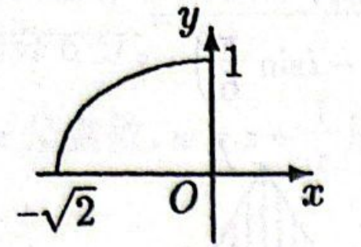

B.  
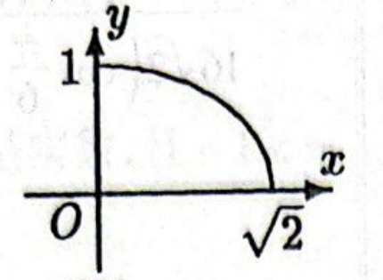

C.  
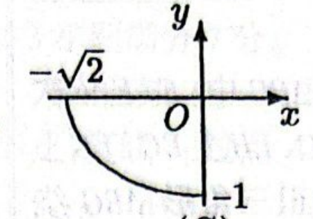

D.  
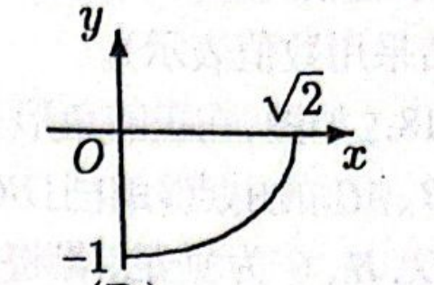

#### 答案

D

#### 解析

配方得

$$

\left(x-\sqrt{2}\cos\theta\right)^2+2\left(y+\sin\theta\right)^2=2

$$

所以椭圆中心为 $\left(\sqrt{2}\cos\theta,-\sin\theta\right)$. 当 $0\leqslant\theta\leqslant\frac{\pi}{2}$ 时，中心从 $(\sqrt{2},0)$ 运动到 $(0,-1)$，且满足 $\frac{x^2}{2}+y^2=1$，位于第四象限的四分之一椭圆弧上，对应图 D.

### 第 8 题

在下列图象中，二次函数 $y=ax^2+bx$ 与指数函数 $y=\left(\frac{b}{a}\right)^x$ 的图象只可能是（）

A.  
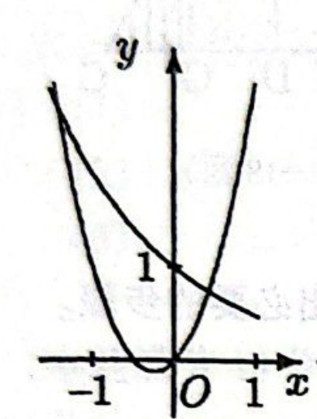

B.  
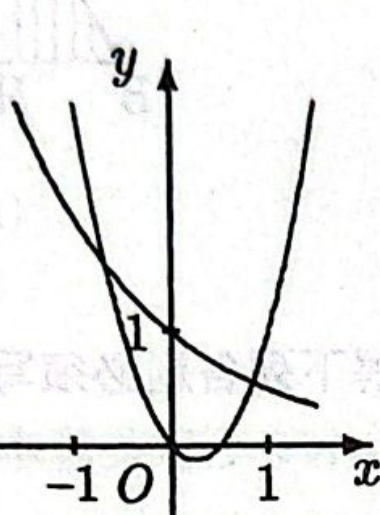

C.  
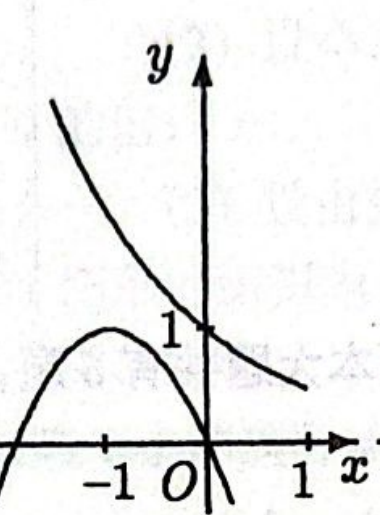

D.  
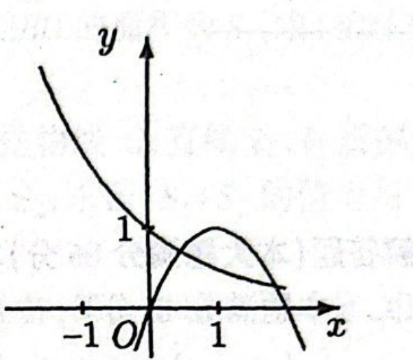

#### 答案

A

#### 解析

令 $q=\frac{b}{a}$. 指数函数 $y=q^x$ 有意义且不是常函数，故 $q>0$ 且 $q\neq1$. 二次函数可写为 $y=ax(x+q)$，其两个零点为 $0$ 和 $-q$，顶点横坐标为 $-\frac{q}{2}$.

若 $0<q<1$，则指数函数递减，且二次函数的另一个零点在 $(-1,0)$ 内；若 $q>1$，则指数函数递增，且二次函数的另一个零点小于 $-1$. 逐一观察图象：图 A 中指数函数递减，抛物线开口向上，另一个零点在 $(-1,0)$ 内，三者相容；图 B 的另一个零点在正半轴，图 C 虽为开口向下且另一个零点在负半轴，但该零点在 $(-\infty,-1)$ 内而图中指数函数仍递减，图 D 的抛物线另一个零点在正半轴. 所以只有图 A 可能，故选 A.

## 填空题

### 第 9 题

方程 $\log_{2}\left(9^x-5\right)=\log_{2}\left(3^x-2\right)+2$ 的解是 $x=$＿＿＿＿＿＿.

#### 答案

$1$

#### 解析

令 $t=3^x>0$. 对数真数要求 $t^2-5>0$、$t-2>0$，故 $t>\sqrt{5}$. 由对数运算， $t^2-5=4(t-2)$，$\Longrightarrow$，$t^2-4t+3=0$，$\Longrightarrow$，$t=1\ \text{或}\ t=3$. 由于 $t>2$，舍去 $t=1$，故 $3^x=3$，所以 $x=1$.

### 第 10 题

函数 $y=\frac{1}{\sqrt{\log_{\frac{1}{2}}(2-x)}}$ 的定义域是＿＿＿＿＿＿.

#### 答案

$\{x\mid 1<x<2\}$（或 $(1,2)$）

#### 解析

根式要求 $\log_{\frac{1}{2}}(2-x)>0$，同时对数真数要求 $2-x>0$. 由于底数 $\frac{1}{2}$ 在 $(0,1)$ 内，$\log_{\frac{1}{2}}u>0$ 等价于 $0<u<1$，因此 $0<2-x<1$，$\Longrightarrow$，$1<x<2$. 分母也因此不为零，故定义域为 $(1,2)$.

### 第 11 题

方程 $\sin\frac{x}{2}=\frac{1}{3}$ 在 $\left[\pi,2\pi\right]$ 上的解是 $x=$＿＿＿＿＿＿.

#### 答案

$2\pi - 2\arcsin \frac{1}{3}$

#### 解析

令 $t=\frac{x}{2}$，则 $t\in\left[\frac{\pi}{2},\pi\right]$，且 $\sin t=\frac{1}{3}$. 在该区间内正弦函数单调递减，故唯一解为 $t=\pi-\arcsin\frac{1}{3}$. 于是

$$

x=2t=2\pi-2\arcsin\frac{1}{3}

$$

### 第 12 题

函数 $y=x^{-2}$（$x<0$）的反函数是 $y=$＿＿＿＿＿＿.

#### 答案

$y=-\sqrt{\frac{1}{x}}$（$x>0$）

#### 解析

原函数中 $x<0$，由 $y=x^{-2}=\frac{1}{x^2}$ 得 $y>0$. 由 $x^2=\frac{1}{y}$ 且原定义域要求取负根，得到 $x=-\sqrt{\frac{1}{y}}$. 交换 $x$，$y$，反函数为 $y=-\sqrt{\frac{1}{x}}$，$x>0$.

### 第 13 题

极坐标方程分别是 $\rho=\cos\theta$ 和 $\rho=\sin\theta$ 的两个圆的圆心距是＿＿＿＿＿＿.

#### 答案

$\frac{\sqrt{2}}{2}$

#### 解析

由极坐标关系 $x=\rho\cos\theta$、$y=\rho\sin\theta$，方程 $\rho=\cos\theta$ 化为 $x^2+y^2=x$，即 $\left(x-\frac{1}{2}\right)^2+y^2=\frac{1}{4}$，圆心为 $\left(\frac{1}{2},0\right)$. 同理，$\rho=\sin\theta$ 化为 $x^2+y^2=y$，即 $x^2+\left(y-\frac{1}{2}\right)^2=\frac{1}{4}$，圆心为 $\left(0,\frac{1}{2}\right)$. 故圆心距为

$$

\sqrt{\left(\frac{1}{2}\right)^2+\left(-\frac{1}{2}\right)^2}=\frac{\sqrt{2}}{2}

$$

### 第 14 题

在 $(1+x)^6(1-x)^4$ 的展开式中，$x^3$ 的系数是（结果用数值表示）＿＿＿＿＿＿.

#### 答案

$-8$

#### 解析

先将乘积改写为

$$

(1+x)^6(1-x)^4=(1+x)^2(1-x^2)^4

$$

展开 $(1-x^2)^4=1-4x^2+\cdots$. 要得到 $x^3$，只能取 $(1+x)^2$ 中的 $2x$ 与 $-4x^2$ 相乘，因此 $x^3$ 的系数为 $2\times(-4)=-8$.

## 选做题：填空题

### 第 15 题

已知 $O(0,0)$ 和 $A(6,3)$ 两点，若点 $P$ 在直线 $OA$ 上，且 $\frac{OP}{PA}=\frac{1}{2}$，又 $P$ 是线段 $OB$ 的中点，则点 $B$ 的坐标是＿＿＿＿＿＿.

#### 答案

$(4,2)$

#### 解析

设 $P=tA=(6t,3t)$. 若严格按题面“直线 $OA$”理解，则 $t\in\mathbb{R}$，且

$$

\frac{OP}{PA}=\frac{|t|}{|1-t|}=\frac{1}{2}

$$

当 $0\leqslant t<1$ 时，$2t=1-t$，得 $t=\frac{1}{3}$；当 $t<0$ 时，$-2t=1-t$，得 $t=-1$；当 $t>1$ 时，$2t=t-1$ 无解. 因而直线上的两个可能点分别为 $P=(2,1)$ 和 $P=(-6,-3)$. 又 $P$ 是线段 $OB$ 的中点，所以相应地 $B=2P$，得到 $B=(4,2)$ 或 $B=(-12,-6)$.

原卷标准答案取线段 $OA$ 内分点的情形，故本题按原卷记为 $(4,2)$；若不补充这一内分约定，题面“直线 $OA$”会同时产生上述外分解.

### 第 16 题

平移坐标轴将抛物线 $4x^{2}-8x+y+5=0$ 化为标准方程 $x^{\prime2}=ay^{\prime}$（$a\neq0$），则新坐标系的原点在原坐标系中的坐标是＿＿＿＿＿＿.

#### 答案

$(1,-1)$

#### 解析

将原方程配方：

$$

4x^2-8x+y+5=4(x-1)^2+y+1=0

$$

令新坐标原点在原坐标中的坐标为 $(h,k)$，即 $x=x'+h$、$y=y'+k$. 要消去一次项并使常数项为零，必须有 $h=1$、$k=-1$. 此时 $4x'^2+y'=0$，$\Longrightarrow$，$x'^2=-\frac{1}{4}y'$ 符合 $x'^2=ay'$ 且 $a=-\frac{1}{4}\neq0$，故新坐标系原点为 $(1,-1)$.

### 第 17 题

有 $8$ 本互不相同的书，其中数学书 $3$ 本，外文书 $2$ 本，其它书 $3$ 本. 若将这些书排成一列放在书架上，则数学书恰好排在一起，外文书也恰好排在一起的排法共有＿＿＿＿＿＿种（结果用数值表示）.

#### 答案

$1440$

#### 解析

把三本数学书看作一个整体，把两本外文书看作另一个整体，再与三本其它书一起排列，共有 $5!$ 种整体排列. 数学书在其整体内有 $3!$ 种排列，外文书有 $2!$ 种排列，所以总数为

$$

5!\cdot3!\cdot2!=120\cdot6\cdot2=1440

$$

### 第 18 题

如图，在正三角形 $ABC$ 中，$E$，$F$ 依次是 $AB$，$AC$ 的中点，$AD \perp BC$，$EH \perp BC$，$FG \perp BC$，$D$，$H$，$G$ 为垂足，若将正三角形 $ABC$ 绕 $AD$ 旋转一周所得的圆锥的体积为 $V$，则其中由阴影部分所产生的旋转体的体积与 $V$ 的比值是＿＿＿＿＿＿.

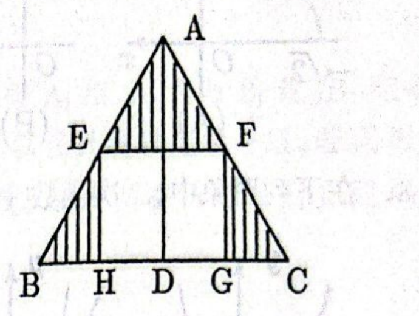

#### 答案

$\frac{5}{8}$

#### 解析

设正三角形边长为 $s$，高为 $h$，则旋转所得圆锥的底面半径为 $R=\frac{s}{2}$，体积为 $V=\frac{1}{3}\pi R^2h$. 由于 $E$，$F$ 是两腰中点，$EF$ 到 $AD$ 的半径为 $r=\frac{s}{4}=\frac{R}{2}$，其高度为 $\frac{h}{2}$. 阴影上部旋转成小圆锥，体积比为

$$

\frac{V_{\mathrm{top}}}{V}=\left(\frac{r}{R}\right)^2\frac{h/2}{h}=\frac{1}{8}

$$

下部两侧阴影旋转所得体积等于下半段圆锥台体积减去中间矩形旋转成的圆柱体积. 下半段圆锥台占 $V$ 的 $1-\frac18=\frac78$，圆柱体积为 $\pi r^2\frac{h}{2}$，故

$$

\frac{V_{\mathrm{cyl}}}{V}=\frac{\pi(R/2)^2(h/2)}{\frac13\pi R^2h}=\frac38

$$

所以阴影下部占 $\frac78-\frac38=\frac12$，阴影总体积与 $V$ 的比值为 $\frac18+\frac12=\frac58$.

### 第 19 题

已知 $\boldsymbol{a}+\boldsymbol{b}=2\boldsymbol{i}-8\boldsymbol{j}$，$\boldsymbol{a}-\boldsymbol{b}=-8\boldsymbol{i}+16\boldsymbol{j}$. 那么 $\boldsymbol{a}\cdot\boldsymbol{b}=$＿＿＿＿＿＿.

#### 答案

$-63$

#### 解析

利用恒等式 $(\bs a+\bs b)^2-(\bs a-\bs b)^2=4\bs a\cdot\bs b$. 由题设

$$

\left\lvert\bs a+\bs b\right\rvert^2=2^2+(-8)^2=68

$$

又 $\left\lvert\bs a-\bs b\right\rvert^2=(-8)^2+16^2=320$. 因此

$$

4\bs a\cdot\bs b=68-320=-252

$$

从而 $\bs a\cdot\bs b=-63$.

### 第 20 题

$\displaystyle\lim_{x\to2}\left(\frac{4}{x^{2}-4}-\frac{1}{x-2}\right)=$＿＿＿＿＿＿.

#### 答案

$-\frac{1}{4}$

#### 解析

当 $x\neq2$ 时，

$$

\frac{4}{x^2-4}-\frac{1}{x-2}
=\frac{4}{(x-2)(x+2)}-\frac{x+2}{(x-2)(x+2)}
=-\frac{1}{x+2}

$$

因此

$$

\lim_{x\to2}\left(\frac{4}{x^2-4}-\frac{1}{x-2}\right)
=\lim_{x\to2}\left(-\frac{1}{x+2}\right)=-\frac14

$$

### 第 21 题

有 $8$ 本互不相同的书，其中数学书 $3$ 本，外文书 $2$ 本，其它书 $3$ 本. 若将这些书随机地排成一列放在书架上，则数学书恰好排在一起，外文书也恰好排在一起的概率为＿＿＿＿＿＿（结果用分数表示）.

#### 答案

$\frac{1}{28}$

#### 解析

八本书互不相同，所有排列共有 $8!$ 种. 将三本数学书看作一个整体、两本外文书看作一个整体，再与三本其它书排列，有 $5!$ 种整体排列；两个整体内部的排列数分别为 $3!$、$2!$. 故所求概率为

$$

\frac{5!\cdot3!\cdot2!}{8!}=\frac{1440}{40320}=\frac{1}{28}

$$

### 第 22 题

若 $\i$ 是虚数单位，计算：$\displaystyle \frac{(1+\sqrt{3}\i)^5}{16\sqrt{2}\left(\cos\frac{\pi}{6}-\i\sin\frac{\pi}{6}\right)}=$＿＿＿＿＿＿.

#### 答案

$\frac{\sqrt{6}}{2}-\frac{\sqrt{2}}{2}\i$（或 $\sqrt{2}\left(\cos \frac{11\pi}{6}+\i\sin \frac{11\pi}{6}\right)$）

#### 解析

有 $1+\sqrt3\i=2\left(\cos\frac{\pi}{3}+\i\sin\frac{\pi}{3}\right)$，所以

$$

(1+\sqrt3\i)^5=2^5\left(\cos\frac{5\pi}{3}+\i\sin\frac{5\pi}{3}\right)

$$

分母为

$$

16\sqrt2\left(\cos\frac{\pi}{6}-\i\sin\frac{\pi}{6}\right)
=16\sqrt2\left(\cos\left(-\frac\pi6\right)+\i\sin\left(-\frac\pi6\right)\right)

$$

故原式的模为 $\frac{32}{16\sqrt2}=\sqrt2$，辐角为 $\frac{5\pi}{3}-\left(-\frac\pi6\right)=\frac{11\pi}{6}$. 因此

$$

\sqrt2\left(\cos\frac{11\pi}{6}+\i\sin\frac{11\pi}{6}\right)=\frac{\sqrt6}{2}-\frac{\sqrt2}{2}\i

$$

## 解答题

### 第 23 题

已知 $\sin\left(\frac{\pi}{4}+\alpha\right)\sin\left(\frac{\pi}{4}-\alpha\right)=\frac{1}{6}$，$\alpha\in\left(\frac{\pi}{2},\pi\right)$，求 $\sin 4\alpha$ 的值.

#### 解析

由

$$

\sin\left(\frac{\pi}{4}+\alpha\right)\sin\left(\frac{\pi}{4}-\alpha\right)
=\sin\left(\frac{\pi}{4}+\alpha\right)\cos\left(\frac{\pi}{4}+\alpha\right)
=\frac{1}{2}\sin\left(\frac{\pi}{2}+2\alpha\right)
=\frac{1}{2}\cos2\alpha

$$

得 $\cos2\alpha=\frac{1}{3}$. 又 $\alpha\in\left(\frac{\pi}{2},\pi\right)$，所以 $2\alpha\in(\pi,2\pi)$，从而 $\sin2\alpha=-\frac{2\sqrt{2}}{3}$. 于是

$$

\sin4\alpha=2\sin2\alpha\cos2\alpha
=2\cdot\left(-\frac{2\sqrt{2}}{3}\right)\cdot\frac{1}{3}
=-\frac{4\sqrt{2}}{9}

$$

### 第 24 题

在如图所示的直角坐标系中，一运动物体经过点 $A(0,9)$，其轨迹方程为 $y=ax^{2}+c$（$a<0$），$D=(6,7)$ 为 $x$ 轴上的给定区间.

1.  为使物体落在 $D$ 内，求 $a$ 的取值范围；

2.  若物体运动时又经过点 $P(2,8.1)$，问它能否落在 $D$ 内？并说明理由.

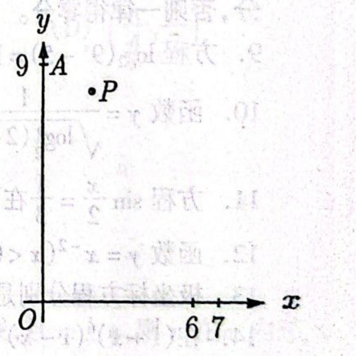

#### 解析

1.  由点 $A$ 的坐标为 $(0,9)$，得 $c=9$，即轨迹方程为 $y=ax^{2}+9$. 令 $y=0$，得 $ax^{2}+9=0$，即 $x^{2}=-\frac{9}{a}$. 物体落在正 $x$ 轴上的区间 $D$ 内时，取交点的正横坐标 $x_{0}=\sqrt{-\frac{9}{a}}$，故 $6<\sqrt{-\frac{9}{a}}<7$，解得 $-\frac{1}{4}<a<-\frac{9}{49}$.

2.  若物体又经过点 $P(2,8.1)$，则 $8.1=4a+9$，解得 $a=-\frac{9}{40}$. 因为 $-\frac{1}{4}<-\frac{9}{40}<-\frac{9}{49}$，所以物体能落在 $D$ 内.

### 第 25 题

如图，在二面角 $\alpha-l-\beta$ 中，$A$，$B\in\alpha$，$C$，$D\in l$，$ABCD$ 为矩形. $P\in\beta$，$PA\perp\alpha$，且 $PA=AD$. $M$，$N$ 依次是 $AB$，$PC$ 的中点.

1.  求二面角 $\alpha-l-\beta$ 的大小；

2.  求证：$MN\perp AB$；

3.  求异面直线 $PA$ 与 $MN$ 所成角的大小.

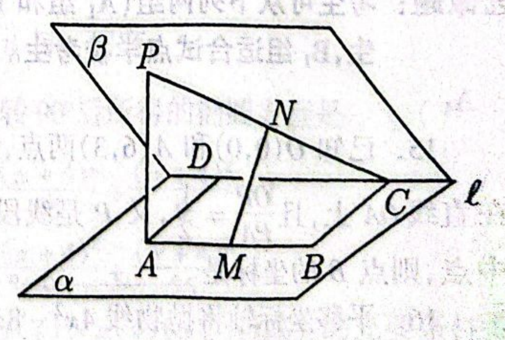

#### 解析

1.  连接 $PD$. 由于 $l\subset\alpha$ 且 $PA\perp\alpha$，有 $PA\perp l$. 又因 $ABCD$ 为矩形、$AB\parallel CD$，而 $C$，$D\in l$，所以 $AB\parallel l$，从而 $AD\perp l$. 直线 $PA$，$AD$ 相交且都垂直于 $l$，故平面 $PAD\perp l$，于是 $PD\perp l$. 平面 $PAD$ 与两个半平面 $\alpha$，$\beta$ 的交线分别为 $AD$，$PD$，所以 $\angle PDA$ 是二面角 $\alpha-l-\beta$ 的平面角. 在 $\mathrm{Rt}\triangle PAD$ 中，$PA=AD$，所以 $\angle PDA=45^\circ$，即二面角 $\alpha-l-\beta$ 的大小为 $45^\circ$.

2.  设 $E$ 是 $DC$ 的中点，连接 $ME$，$NE$. 因为 $M$，$N$，$E$ 依次是 $AB$，$PC$，$DC$ 的中点，所以 $ME\parallel AD$，$NE\parallel PD$. 又 $AD\perp l$，$PD\perp l$，所以 $ME\perp l$，$NE\perp l$，从而 $l\perp$ 平面 $MNE$. 因为 $AB\parallel l$，所以 $AB\perp$ 平面 $MNE$. 又 $MN\subset$ 平面 $MNE$，故 $MN\perp AB$.

3.  设 $Q$ 是 $DP$ 的中点，连接 $NQ$，$AQ$. 因为 $NQ\parallel DC$ 且 $NQ=\frac{1}{2}DC$，又 $AM\parallel DC$ 且 $AM=\frac{1}{2}AB=\frac{1}{2}DC$，所以 $QN\parallel AM$ 且 $QN=AM$，从而 $QNMA$ 为平行四边形，故 $AQ\parallel MN$. 于是 $\angle PAQ$ 是异面直线 $PA$ 与 $MN$ 所成的角. 又 $\triangle PAD$ 是等腰直角三角形，$AQ$ 为斜边上的中线，所以 $\angle PAQ=45^\circ$. 因此异面直线 $PA$ 与 $MN$ 所成角的大小为 $45^\circ$.

## 选做题：解答题

### 第 26 题

1.  设 $z$ 是虚数，$w=z+\frac{1}{z}$ 是实数，且 $-1<w<2$. 求 $\left|z\right|$ 的值及 $z$ 的实部的取值范围；

2.  设 $u=\frac{1-z}{1+z}$. 求证：$u$ 为纯虚数；

3.  求 $w-u^{2}$ 的最小值.

#### 解析

1.  设 $z=a+b\i$（$a$，$b\in\mathbb{R}$，$b\neq0$），则 $w=a+b\i+\frac{a-b\i}{a^{2}+b^{2}}=\left(a+\frac{a}{a^{2}+b^{2}}\right)+\left(b-\frac{b}{a^{2}+b^{2}}\right)\i$. 因为 $w$ 是实数，故 $a^{2}+b^{2}=1$，即 $\left|z\right|=1$. 又 $w=2a$，由 $-1<w<2$ 得 $-\frac{1}{2}<a<1$.

2.  由 $z=a+b\i$ 及 $a^{2}+b^{2}=1$，得

$$

u=\frac{1-z}{1+z}=\frac{1-a-b\i}{1+a+b\i}
    =\frac{(1-a-b\i)(1+a-b\i)}{(1+a+b\i)(1+a-b\i)}
    =\frac{1-a^{2}-b^{2}-2b\i}{(1+a)^{2}+b^{2}}
    =-\frac{b}{a+1}\i

$$

    所以 $u$ 为纯虚数.

3.  由 $u=\frac{1-z}{1+z}=-\frac{b}{a+1}\i$，得 $u^{2}=-\frac{b^{2}}{(a+1)^{2}}$. 于是

$$

w-u^{2}=2a+\frac{b^{2}}{(a+1)^{2}}
    =2a+\frac{1-a^{2}}{(a+1)^{2}}
    =2\left((a+1)+\frac{1}{a+1}\right)-3

$$

    因为 $a\in\left(-\frac{1}{2},1\right)$，所以 $a+1>0$，由 AM-GM 得 $(a+1)+\frac{1}{a+1}\ge 2$， 故 $w-u^{2}\ge1$. 当 $a=0$ 时取等号，所以最小值为 $1$.

### 第 27 题

已知 $A(-1,2)$ 为抛物线 $C:y=2x^{2}$ 上的点，直线 $l_{1}$ 过点 $A$，且与抛物线 $C$ 相切. 直线 $l_{2}:x=a$（$a\neq-1$）交抛物线 $C$ 于点 $B$，交直线 $l_{1}$ 于点 $D$.

1.  求直线 $l_{1}$ 的方程；

2.  设 $\triangle ABD$ 的面积为 $S_{1}$，求 $|BD|$ 及 $S_{1}$ 的值；

3.  设由抛物线 $C$，直线 $l_{1}$，$l_{2}$ 所围成的图形的面积为 $S_{2}$，求证：$S_{1}:S_{2}$ 的值为与 $a$ 无关的常数.

#### 解析

1.  由 $y=2x^{2}$ 得 $y'=4x$. 当 $x=-1$ 时，$y'=-4$，所以 $l_{1}$ 的方程为 $y-2=-4(x+1)$， 即 $4x+y+2=0$.

2.  由 $y=2x^{2}$ 及 $x=a$，解得点 $B$ 的坐标为 $(a,2a^{2})$. 由 $4x+y+2=0$ 及 $x=a$，解得点 $D$ 的坐标为 $(a,-4a-2)$. 又可求得 $A$ 到直线 $BD$ 的距离为 $|a+1|$，$|BD|=2a^{2}+4a+2=2(a+1)^{2}$. 所以 $S_{1}=|a+1|^{3}$.

3.  由题意，当 $a>-1$ 时，

$$

S_{2}=\int_{-1}^{a}(2x^{2}+4x+2)\,dx
    =\left(\frac{2}{3}x^{3}+2x^{2}+2x\right)\Big|_{-1}^{a}
    =\frac{2}{3}(a+1)^{3}

$$

    当 $a<-1$ 时，$S_{2}=\int_{a}^{-1}(2x^{2}+4x+2)\,dx=-\frac{2}{3}(a+1)^{3}$. 因此 $S_{1}:S_{2}=\frac{3}{2}$， 即 $S_{1}:S_{2}$ 的值为与 $a$ 无关的常数.

## 解答题

### 第 28 题

已知双曲线 $S$ 的两条渐近线过坐标原点，且与以点 $A(\sqrt{2},0)$ 为圆心，$1$ 为半径的圆相切，双曲线 $S$ 的一个顶点 $A'$ 与点 $A$ 关于直线 $y=x$ 对称. 设直线 $l$ 过点 $A$，斜率为 $k$.

1.  求双曲线 $S$ 的方程；

2.  当 $k=1$ 时，在双曲线 $S$ 的上支上求点 $B$，使其与直线 $l$ 的距离为 $\sqrt{2}$；

3.  当 $0 \leqslant k < 1$ 时，若双曲线 $S$ 的上支上有且只有一个点 $B$ 到直线 $l$ 的距离为 $\sqrt{2}$，求斜率 $k$ 的值及相应的点 $B$ 的坐标.

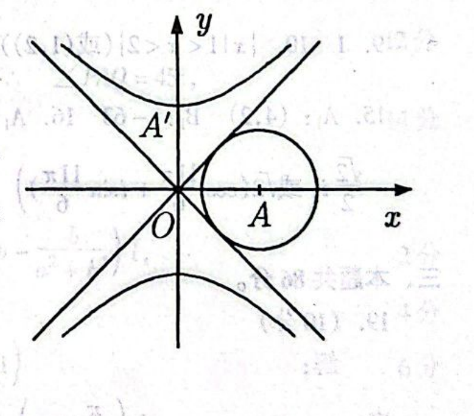

#### 解析

1.  设双曲线的一条渐近线为 $y=rx$. 该直线与圆相切，所以圆心 $A(\sqrt{2},0)$ 到它的距离为 $1$，即 $\frac{\sqrt{2}|r|}{\sqrt{1+r^{2}}}=1$，从而 $r^{2}=1$，两条渐近线为 $y=\pm x$. 点 $A$ 关于 $y=x$ 的对称点为 $A'(0,\sqrt{2})$，故 $S$ 是以 $y$ 轴为实轴的等轴双曲线，方程为 $\frac{y^{2}}{2}-\frac{x^{2}}{2}=1$.

2.  当 $k=1$ 时，直线 $l$ 的方程为 $y=x-\sqrt{2}$. 若 $B\bigl(x,\sqrt{x^{2}+2}\bigr)$ 在双曲线 $S$ 的上支上，则距离条件给出 $\frac{\left|x-\sqrt{x^{2}+2}-\sqrt{2}\right|}{\sqrt{2}}=\sqrt{2}$. 由于 $x-\sqrt{x^{2}+2}-\sqrt{2}<0$，所以 $\sqrt{x^{2}+2}-x=2-\sqrt{2}$. 两边平方并整理得 $x=\frac{2-(2-\sqrt{2})^{2}}{2(2-\sqrt{2})}=\sqrt{2}$，于是 $y=\sqrt{2+2}=2$. 将 $(\sqrt{2},2)$ 代回 $y=\sqrt{x^{2}+2}$ 及距离条件均成立，因此点 $B$ 的坐标是 $(\sqrt{2},2)$.

3.  当 $0\leqslant k<1$ 时，双曲线 $S$ 的上支在直线 $l:y=k(x-\sqrt{2})$ 的上方：若 $x\leqslant\sqrt{2}$，则 $k(x-\sqrt{2})\leqslant0<\sqrt{x^{2}+2}$；若 $x>\sqrt{2}$，则 $k(x-\sqrt{2})<x-\sqrt{2}<x<\sqrt{x^{2}+2}$. 设直线 $l'$ 与 $l$ 平行，在 $l$ 的上方且与 $l$ 的距离为 $\sqrt{2}$. 由两平行线间的距离公式，若 $l'$ 为 $y=kx+m$，则 $\frac{|\sqrt{2}k+m|}{\sqrt{k^{2}+1}}=\sqrt{2}$，从而 $m=\sqrt{2}\left(\pm\sqrt{k^{2}+1}-k\right)$. 取位于 $l$ 上方的直线，得 $m=\sqrt{2}\left(\sqrt{k^{2}+1}-k\right)$. 此时，题目条件等价于 $l'$ 与双曲线的上支相切.

    将 $y=kx+m$ 代入 $y^{2}-x^{2}=2$，得 $(k^{2}-1)x^{2}+2mkx+m^{2}-2=0$. 因为 $0\leqslant k<1$，二次项系数不为零，切线条件为判别式为零，即 $\Delta=4(m^{2}+2k^{2}-2)=8k\left(3k-2\sqrt{k^{2}+1}\right)=0$. 因而 $k=0$，或 $3k=2\sqrt{k^{2}+1}$. 后者在给定范围内等价于 $9k^{2}=4(k^{2}+1)$，故 $k=\frac{2\sqrt{5}}{5}$.

    当 $k=0$ 时，$m=\sqrt{2}$，切点为 $(0,\sqrt{2})$. 当 $k=\frac{2\sqrt{5}}{5}$ 时，$m=\frac{\sqrt{10}}{5}$，由二次方程的重根公式得 $x=2\sqrt{2}$，再由 $y=kx+m$ 得 $y=\sqrt{10}$. 所以相应的点分别为 $(0,\sqrt{2})$ 和 $(2\sqrt{2},\sqrt{10})$.

### 第 29 题

设 $A_{n}$ 为数列 $\{a_{n}\}$ 前 $n$ 项的和，$A_{n}=\frac{3}{2}(a_{n}-1)$（$n\in\mathbb{N}$）. 数列 $\{b_{n}\}$ 的通项公式为 $b_{n}=4n+3$（$n\in\mathbb{N}$）.

1.  求数列 $\{a_{n}\}$ 的通项公式；

2.  若 $d\in\{a_{1}, a_{2}, a_{3}, \cdots, a_{n}, \cdots\}\cap\{b_{1}, b_{2}, b_{3}, \cdots, b_{n}, \cdots\}$，则称 $d$ 为数列 $\{a_{n}\}$ 与 $\{b_{n}\}$ 的公共项. 将数列 $\{a_{n}\}$ 与 $\{b_{n}\}$ 的公共项，按它们的原数列中的先后顺序排成一个新的数列 $\{d_{n}\}$，证明数列 $\{d_{n}\}$ 的通项公式为 $d_{n}=3^{2n+1}$（$n\in\mathbb{N}$）；

3.  设数列 $\{d_{n}\}$ 中的第 $n$ 项是数列 $\{b_{n}\}$ 中的第 $r$ 项，$B_{r}$ 为数列 $\{b_{n}\}$ 前 $r$ 项的和，$D_{n}$ 为数列 $\{d_{n}\}$ 前 $n$ 项的和，$T_{n}=B_{r}-D_{n}$. 求 $\displaystyle\lim_{n\to\infty}\frac{T_{n}}{(a_{n})^{4}}$.

#### 解析

1.  当 $n=1$ 时，$a_{1}=\frac{3}{2}(a_{1}-1)$，解得 $a_{1}=3$. 当 $n\geqslant2$ 时，$a_{n}=A_{n}-A_{n-1}=\frac{3}{2}(a_{n}-a_{n-1})$，由此解得 $a_{n}=3a_{n-1}$. 即 $\frac{a_{n}}{a_{n-1}}=3$（$n\geqslant2$），数列 $\{a_{n}\}$ 是首项为 $3$，公比为 $3$ 的等比数列，故得 $a_{n}=3^{n}$（$n\in\mathbb{N}$）.

2.  证法一：

    1.  先证明形如 $3^{2n+1}$（$n\in\mathbb{N}$）的数为数列 $\{a_{n}\}$ 与 $\{b_{n}\}$ 的公共项，因而为数列 $\{d_{n}\}$ 中的项. 数列 $\{a_{n}\}$ 的通项公式为 $a_{n}=3^{n}$，所以 $3^{2n+1}\in\{a_{1},a_{2},\cdots,a_{n},\cdots\}$.

$$

3^{2n+1}=3\cdot9^{n}=3(8+1)^{n}=3(8^{n}+\mathrm C_{n}^{1}8^{n-1}+\cdots+\mathrm C_{n}^{n-1}8+1)
        =3\bigl[8(8^{n-1}+\mathrm C_{n}^{1}8^{n-2}+\cdots+\mathrm C_{n}^{n-1})+1\bigr]

$$

        令 $t=8^{n-1}+\mathrm C_{n}^{1}8^{n-2}+\cdots+\mathrm C_{n}^{n-1}$，则 $t$ 为正整数. 所以 $3^{2n+1}=3(8t+1)=4\cdot(6t)+3$. 所以 $3^{2n+1}\in\{b_{1},b_{2},\cdots,b_{n},\cdots\}$，所以 $3^{2n+1}\in\{a_{1},a_{2},\cdots,a_{n},\cdots\}\cap\{b_{1},b_{2},\cdots,b_{n},\cdots\}$.

    2.  再证明数列 $\{a_{n}\}$ 中除去形如 $3^{2n+1}$（$n\in\mathbb{N}$）的项外，其它项都不是 $\{b_{n}\}$ 中的项，因而不是 $\{d_{n}\}$ 中的项. 显然 $a_{1}=3$ 不是 $\{b_{n}\}$ 中的项. 所以 $a_{2n}=3^{2n}=(8+1)^{n}=8t+1=4(2t)+1$（$n\in\mathbb{N}$，$t\in\mathbb{N}$）， 所以 $a_{2n}$（$n\in\mathbb{N}$）不是 $\{b_{n}\}$ 中的项，因而不是 $\{d_{n}\}$ 中的项. 由前两步，数列 $\{d_{n}\}$ 的通项公式是 $d_{n}=a_{2n+1}=3^{2n+1}$（$n\in\mathbb{N}$）.

3.  由题意，$3^{2n+1}=4r+3$，所以 $r=\frac{3^{2n+1}-3}{4}=\frac{3}{4}\left(3^{2n}-1\right)$. 因 $b_n=4n+3$ 为首项 $7$、公差 $4$ 的等差数列，

$$

B_r=\frac{r(b_1+b_r)}{2}
    =\frac{3(3^{2n}-1)\bigl(7+3^{2n+1}\bigr)}{8}

$$

    又 $d_n=3^{2n+1}=27\cdot9^{n-1}$，所以

$$

D_n=\frac{27(9^n-1)}{9-1}=\frac{27(3^{2n}-1)}{8}

$$

    因此

$$

T_n=B_r-D_n=\frac{9\cdot3^{4n}-15\cdot3^{2n}+6}{8}

$$

    由于 $a_n=3^n$，得到

$$

\lim_{n\to\infty}\frac{T_n}{(a_n)^4}
    =\lim_{n\to\infty}\frac{9\cdot3^{4n}-15\cdot3^{2n}+6}{8\cdot3^{4n}}
    =\frac{9}{8}

$$

