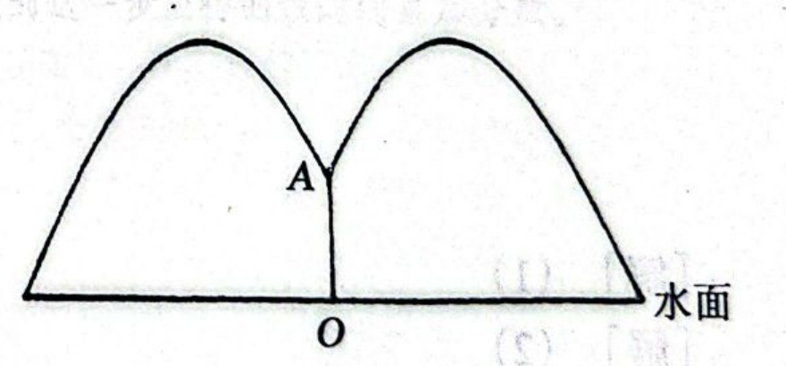
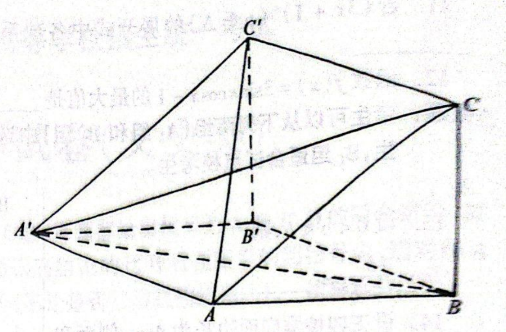
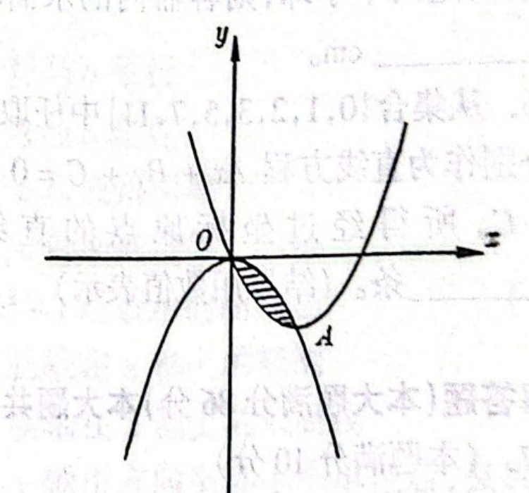
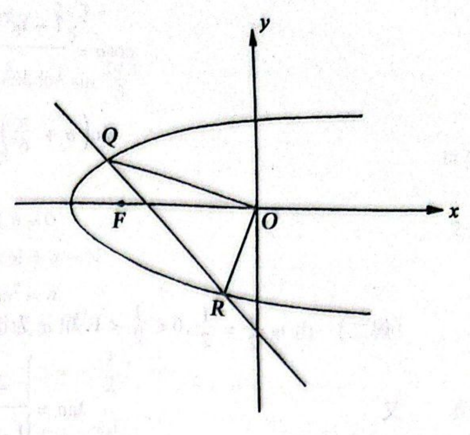

# 1997年上海卷（文）

## 单选题

### 第 1 题

设全集是实数集 $\mathbb{R}$，$M = \{x \mid x \leqslant 1 + \sqrt{2}, x \in \mathbb{R}\}$，$N = \{1, 2, 3, 4\}$，则 $\overline{M} \cap N$ 等于（$\quad$）

A.  
$\{4\}$

B.  
$\{3,4\}$

C.  
$\{2,3,4\}$

D.  
$\{1,2,3,4\}$

#### 答案

B

#### 解析

因为 $2<1+\sqrt{2}<3$，所以 $M=(-\infty,1+\sqrt{2}]$，从而 $\overline{M}=(1+\sqrt{2},+\infty)$. 在集合 $N$ 中，只有 $3$，$4$ 属于这个区间，因此 $\overline{M}\cap N=\{3,4\}$，故选 B.

### 第 2 题

三个数 $6^{0.7}$，$0.7^{6}$，$\log_{0.7}6$ 的大小顺序是（$\quad$）

A.  
$0.7^{6} < \log_{0.7}6 < 6^{0.7}$

B.  
$0.7^{6} < 6^{0.7} < \log_{0.7}6$

C.  
$\log_{0.7}6<6^{0.7}<0.7^{6}$

D.  
$\log_{0.7}6<0.7^{6}<6^{0.7}$

#### 答案

D

#### 解析

因为 $0<0.7<1$，所以 $0<0.7^6<1$. 又因为 $6>1$，所以 $6^{0.7}>1$. 底数 $0.7$ 在 $(0,1)$ 内，对数函数 $y=\log_{0.7}x$ 单调递减，故 $\log_{0.7}6<\log_{0.7}1=0$. 因此 $\log_{0.7}6<0.7^6<6^{0.7}$，故选 D.

### 第 3 题

在下列命题中，假命题是（$\quad$）

A.  
若 $a$，$b$ 是异面直线，则一定存在平面 $\alpha$ 过 $a$ 且与 $b$ 平行

B.  
若 $a$，$b$ 是异面直线，则一定存在平面 $\alpha$ 过 $a$ 且与 $b$ 垂直

C.  
若 $a$，$b$ 是异面直线，则一定存在平面 $\alpha$ 与 $a$，$b$ 所成角相等

D.  
若 $a$，$b$ 是异面直线，则一定存在平面 $\alpha$ 与 $a$，$b$ 的距离相等

#### 答案

B

#### 解析

过直线 $a$ 上任一点作直线 $b'\parallel b$. 直线 $a$ 与 $b'$ 相交，因而确定平面 $\alpha$. 若 $b\subset\alpha$，则 $a$ 与 $b$ 同在平面 $\alpha$ 内，与异面矛盾；因此 $b\not\subset\alpha$. 又因为 $b\parallel b'$，而 $b'\subset\alpha$，所以 $b\parallel\alpha$，命题 A 正确.

设 $a$，$b$ 的方向向量分别为 $\boldsymbol{u}$，$\boldsymbol{v}$. 异面直线不平行，故 $\boldsymbol{u}\times\boldsymbol{v}\neq\boldsymbol{0}$. 取法向量为 $\boldsymbol{u}\times\boldsymbol{v}$ 的平面 $\beta$，并将其平移至既不与 $a$ 也不与 $b$ 相交的位置. 由于 $\boldsymbol{u}$，$\boldsymbol{v}$ 都垂直于 $\boldsymbol{u}\times\boldsymbol{v}$，所以 $a\parallel\beta$，$b\parallel\beta$，两直线与 $\beta$ 所成的角都为 $0$，命题 C 正确. 取 $A\in a$，$B\in b$，作过直线 $a$ 和点 $B$ 的平面 $\gamma$. 直线 $a\subset\gamma$，且 $b$ 在点 $B$ 处与 $\gamma$ 相交，所以 $a$，$b$ 到 $\gamma$ 的距离都为 $0$，命题 D 正确.

若存在过 $a$ 且垂直于 $b$ 的平面 $\alpha$，则 $b\perp\alpha$. 设 $a$，$b$ 的方向向量分别为 $\boldsymbol{u}$，$\boldsymbol{v}$，因为 $a\subset\alpha$，所以 $\boldsymbol{u}$ 平行于 $\alpha$；又因为 $b\perp\alpha$，所以 $\boldsymbol{v}$ 是 $\alpha$ 的法向量，从而 $\boldsymbol{u}\cdot\boldsymbol{v}=0$，即两直线的方向垂直. 但异面直线的方向不一定垂直，例如 $a:(x,y,z)=(t,0,0)$ 与 $b:(x,y,z)=(s,s,1)$ 是异面直线，而其方向向量的内积为 $1\neq0$. 因此该命题不能对所有异面直线成立，B 项错误，故选 B.

### 第 4 题

设 $k > 1$，则关于 $x$，$y$ 的方程 $(1 - k)x^{2} + y^{2} = k^{2} - 1$ 所表示的曲线是（$\quad$）

A.  
长轴在 $y$ 轴上的椭圆

B.  
长轴在 $x$ 轴上的椭圆

C.  
实轴在 $y$ 轴上的双曲线

D.  
实轴在 $x$ 轴上的双曲线

#### 答案

C

#### 解析

因为 $k>1$，所以 $k^2-1>0$，且 $1-k<0$. 移项并除以 $k^2-1=(k-1)(k+1)$，得

$$

\frac{y^2}{k^2-1}-\frac{x^2}{k+1}=1

$$

这是标准形式的双曲线，正项对应的变量是 $y$，所以实轴在 $y$ 轴上，故选 C.

### 第 5 题

如果直线 $l$ 沿 $x$ 轴负方向平移 $3$ 个单位，再沿 $y$ 轴正方向平移 $1$ 个单位后，又回到原来的位置，那么直线 $l$ 的斜率是（$\quad$）

A.  
$-\frac{1}{3}$

B.  
$-3$

C.  
$\frac{1}{3}$

D.  
$3$

#### 答案

A

#### 解析

这次平移的向量为 $(-3,1)$. 平移后直线仍与原直线重合，说明平移向量与直线平行. 若直线斜率为 $m$，则 $m$ 等于该向量的纵坐标与横坐标之比，因此 $m=\frac{1}{-3}=-\frac13$，故选 A.

### 第 6 题

设 $f(n) = 1 + \frac{1}{2} + \frac{1}{3} + \cdots + \frac{1}{3n-1}$（$n \in \mathbb{N}$），则 $f(n+1) - f(n)$ 等于（$\quad$）

A.  
$\frac{1}{3n+2}$

B.  
$\frac{1}{3n} + \frac{1}{3n + 1}$

C.  
$\frac{1}{3n + 1} +\frac{1}{3n + 2}$

D.  
$\frac{1}{3n} + \frac{1}{3n + 1} + \frac{1}{3n + 2}$

#### 答案

D

#### 解析

把 $n$ 换成 $n+1$，有 $f(n+1)=1+\frac12+\cdots+\frac1{3n-1}+\frac1{3n}+\frac1{3n+1}+\frac1{3n+2}$. 因而前面的公共项相消，得到 $f(n+1)-f(n)=\frac1{3n}+\frac1{3n+1}+\frac1{3n+2}$，故选 D.

## 填空题

### 第 7 题

方程 $\lg(1-3x)=\lg(3-x)+\lg(7+x)$ 的解是＿＿＿＿＿＿.

#### 答案

$x=-5$

#### 解析

三个对数的真数都必须为正，所以 $1-3x>0$，$3-x>0$，$7+x>0$，即定义域为 $-7<x<\frac13$. 在此定义域内，利用对数的和等于真数之积，原方程等价于

$$

1-3x=(3-x)(7+x)=21-4x-x^2

$$

整理得 $x^2+x-20=0$，即 $(x-4)(x+5)=0$，所以 $x=4$ 或 $x=-5$. 其中 $x=4$ 不在定义域内，只有 $x=-5$ 合法，故方程的解为 $x=-5$.

### 第 8 题

方程 $\sin 2x=\frac{1}{2}$ 在 $[-2\pi,2\pi]$ 内解的个数是＿＿＿＿＿＿.

#### 答案

8

#### 解析

由 $\sin 2x=\frac12$，得 $2x=\frac\pi6+2k\pi$ 或 $2x=\frac{5\pi}{6}+2k\pi$，其中 $k\in\mathbb{Z}$，即

$$

x=\frac\pi{12}+k\pi\quad\text{或}\quad x=\frac{5\pi}{12}+k\pi

$$

对第一类解，代入 $-2\pi\leqslant x\leqslant2\pi$，得到 $-\frac{25}{12}\leqslant k\leqslant\frac{23}{12}$，所以 $k=-2$，$-1$，$0$，$1$，有 $4$ 个解. 对第二类解，得到 $-\frac{29}{12}\leqslant k\leqslant\frac{19}{12}$，同样只有 $k=-2$，$-1$，$0$，$1$，有 $4$ 个解. 两类解不可能相等，因为这将导致 $\frac\pi{12}+k\pi=\frac{5\pi}{12}+l\pi$，即 $l-k=-\frac13$，与 $k$，$l\in\mathbb{Z}$ 矛盾. 因此共有 $4+4=8$ 个解.

### 第 9 题

已知 $a = \frac{-3 - \i}{1 + 2\i}$（$\i$ 是虚数单位），那么 $a^{2} =$＿＿＿＿＿＿.

#### 答案

$-2\i$

#### 解析

分母有理化，得

$$

a=\frac{(-3-\i)(1-2\i)}{(1+2\i)(1-2\i)}=\frac{-5+5\i}{5}=-1+\i

$$

因此

$$

a^2=(-1+\i)^2=1-2\i+\i^2=-2\i

$$

### 第 10 题

设圆 $x^{2} + y^{2} - 4x - 5 = 0$ 的弦 $AB$ 的中点为 $P(3,1)$，则直线 $AB$ 的方程是＿＿＿＿＿＿.

#### 答案

$x+y-4=0$

#### 解析

将圆方程配方，得 $(x-2)^2+y^2=9$，所以圆心为 $O(2,0)$. 直径方向向量 $\overrightarrow{OP}=(1,1)$，因此 $OP$ 的斜率为 $1$，弦的中垂线性质说明 $OP\perp AB$，所以直线 $AB$ 的斜率为 $-1$. 又直线过 $P(3,1)$，故其方程为 $y-1=-(x-3)$，整理得 $x+y-4=0$.

### 第 11 题

若 $(3x+1)^{n}$（$n\in \mathbb{N}$）的展开式中各项系数的和是$256$，则展开式中 $x^{2}$ 的系数是＿＿＿＿＿＿.

#### 答案

54

#### 解析

多项式各项系数的和等于令 $x=1$ 时的值，所以 $4^n=256=4^4$，从而 $n=4$. 在 $(3x+1)^4$ 的二项式展开中，$x^2$ 项来自选取两个 $3x$ 和两个 $1$，其系数为 $\mathrm C_4^2\cdot3^2=6\cdot9=54$.

### 第 12 题

函数 $f(x)=3\sin x\cos x-1$ 的最大值是＿＿＿＿＿＿.

#### 答案

$\frac{1}{2}$

#### 解析

由二倍角公式 $2\sin x\cos x=\sin 2x$，得 $f(x)=\frac32\sin 2x-1$. 因为 $-1\leqslant\sin 2x\leqslant1$，所以 $f(x)\leqslant\frac32-1=\frac12$. 当 $2x=\frac\pi2+2k\pi$ 时 $\sin 2x=1$，等号确实能够取得，因此函数的最大值为 $\frac12$.

## 选做题：填空题

### 第 13 题

设 $0 < a < b$，则 $\displaystyle\lim_{n \to \infty} \frac{4b^n}{a^n-b^n}=$＿＿＿＿＿＿.

#### 答案

$-4$

#### 解析

分子、分母同除以 $b^n$，得

$$

\frac{4b^n}{a^n-b^n}=\frac{4}{\left(\frac ab\right)^n-1}

$$

因为 $0<\frac ab<1$，所以 $\left(\frac ab\right)^n\to0$，从而原极限为 $\frac4{0-1}=-4$.

### 第 14 题

$\displaystyle\lim_{n\to\infty}\left(1-\frac{2}{n}\right)^{-2n}=$＿＿＿＿＿＿.

#### 答案

$\e^{4}$

#### 解析

利用基本极限 $\displaystyle\lim_{n\to\infty}\left(1+\frac{c}{n}\right)^n=\e^c$，有

$$

\left(1-\frac2n\right)^{-2n}=\left[\left(1-\frac2n\right)^n\right]^{-2}\longrightarrow(\e^{-2})^{-2}=\e^4

$$

### 第 15 题

设正四棱锥底面边长为 $4 \mathrm{~cm}$，侧面和底面所成的二面角是 $60^{\circ}$，则这个棱锥的侧面积是＿＿＿＿＿＿$\mathrm{cm}^{2}$.

#### 答案

32

#### 解析

设正四棱锥顶点为 $V$，底面中心为 $O$，底面一边的中点为 $M$. 正四棱锥的高 $VO\perp$ 底面，且侧面与底面所成的二面角等于 $\angle VMO=60^{\circ}$. 底面边长为 $4$，所以 $OM=2$. 在直角三角形 $VOM$ 中，$VM$ 是侧面三角形的高，且 $\tan60^{\circ}=\frac{VO}{OM}$，故 $VO=2\sqrt3$. 于是 $VM=\sqrt{VO^2+OM^2}=\sqrt{12+4}=4$. 每个侧面面积为 $\frac12\cdot4\cdot4=8$，四个侧面的总面积为 $4\cdot8=32\ \mathrm{cm}^2$.

### 第 16 题

设 $\boldsymbol{a}=(m+1)\boldsymbol{i}-3\boldsymbol{j}$，$\boldsymbol{b}=\boldsymbol{i}+(m-1)\boldsymbol{j}$，$(\boldsymbol{a}+\boldsymbol{b})\perp(\boldsymbol{a}-\boldsymbol{b})$，则 $m=$＿＿＿＿＿＿.

#### 答案

$-2$

#### 解析

先求两向量的坐标：$\boldsymbol{a}+\boldsymbol{b}=(m+2)\boldsymbol{i}+(m-4)\boldsymbol{j}$，$\boldsymbol{a}-\boldsymbol{b}=m\boldsymbol{i}-(m+2)\boldsymbol{j}$. 垂直条件给出它们的数量积为零，即

$$

(m+2)m+(m-4)(-m-2)=4(m+2)=0

$$

因此 $m=-2$.

### 第 17 题

圆柱形容器的内壁底半径为 $5 \mathrm{~cm}$，两个直径为 $5 \mathrm{~cm}$ 的玻璃小球都浸没于容器的水中. 若取出这两个小球，则容器内的水面将下降＿＿＿＿＿＿$\mathrm{cm}$.

#### 答案

$\frac{5}{3}$

#### 解析

取出小球后水面下降的体积，等于两个小球排开的总体积. 每个小球半径为 $\frac52\mathrm{~cm}$，所以两个小球的总体积为

$$

2\cdot\frac43\pi\left(\frac52\right)^3=\frac{125\pi}{3}\ \mathrm{cm}^3

$$

圆柱容器的底面积为 $\pi\cdot5^2=25\pi\ \mathrm{cm}^2$. 设水面下降 $h\ \mathrm{cm}$，则 $25\pi h=\frac{125\pi}{3}$，解得 $h=\frac53\ \mathrm{cm}$.

### 第 18 题

设 $f(x)=x^{2}(2-x)$，则 $f(x)$ 的单调递增区间是＿＿＿＿＿＿.

#### 答案

$\left(0,\frac{4}{3}\right)$

#### 解析

将函数展开并求导，得 $f(x)=2x^2-x^3$，$f'(x)=4x-3x^2=x(4-3x)$. 当 $x<0$ 时 $f'(x)<0$；当 $0<x<\frac43$ 时 $f'(x)>0$；当 $x>\frac43$ 时 $f'(x)<0$. 因此 $f(x)$ 的单调递增区间为 $\left(0,\frac43\right)$.

### 第 19 题

从集合 $\{0,1,2,3,5,7,11\}$ 中任取 $3$ 个元素分别作为直线方程 $Ax + By + C = 0$ 中的 $A$，$B$，$C$，所得经过坐标原点的直线有＿＿＿＿＿＿ 条.（结果用数值表示）

#### 答案

30

#### 解析

直线经过坐标原点 $(0,0)$ 的充要条件是代入方程后得到 $C=0$. 因为 $A$，$B$，$C$ 取自集合中的三个不同元素，所以 $A$，$B$ 必须从其余 $6$ 个非零元素中有序选取，共有 $6\cdot5=30$ 组 $(A,B,C)$. 还需说明这些取法确实给出不同的直线：非零元素集合 $\{1,2,3,5,7,11\}$ 中任意两个不同元素互质，若两组系数给出同一直线，则 $A/B=A'/B'$，即 $AB'=A'B$. 由互质性和这些数均为 $1$ 或素数，只能有 $A=A'$，$B=B'$，从而两组取法相同. 因此所得直线有 $30$ 条.

### 第 20 题

从集合 $\{0,1,2,3,5,7,11\}$ 中任取 $3$ 个元素分别作为直线方程 $Ax + By + C = 0$ 中的 $A$，$B$，$C$，所得恰好经过坐标原点的直线的概率是＿＿＿＿＿＿.

#### 答案

$\frac{1}{7}$

#### 解析

从 7 个元素中有序选取 3 个不同元素，样本总数为 $\mathrm A_7^3=7\cdot6\cdot5=210$. 由上一题，恰好经过原点的情况要求 $C=0$，再从其余 6 个非零元素中有序选取 $A$，$B$，共有 $6\cdot5=30$ 种. 因此所求概率为 $\frac{30}{210}=\frac17$.

## 解答题

### 第 21 题

已知 $\tan\frac{\alpha}{2}=\frac{1}{2}$，求 $\sin \left(\alpha +\frac{\pi}{6}\right)$ 的值.

#### 解析

由半角正弦、余弦公式，得

$$

\sin\alpha=\frac{2\tan\frac\alpha2}{1+\tan^2\frac\alpha2}=\frac{2\times\frac12}{1+\frac14}=\frac45

$$

以及

$$

\cos\alpha=\frac{1-\tan^2\frac\alpha2}{1+\tan^2\frac\alpha2}=\frac{1-\frac14}{1+\frac14}=\frac35

$$

于是

$$

\sin\left(\alpha+\frac\pi6\right)=\sin\alpha\cos\frac\pi6+\cos\alpha\sin\frac\pi6=\frac45\cdot\frac{\sqrt3}{2}+\frac35\cdot\frac12=\frac{3+4\sqrt3}{10}

$$

### 第 22 题

公园要建造一个圆形的喷水池. 在水池中央垂直于水面安装一个花形柱子 $OA$，$O$ 恰在水面中心，$OA=1.25\text{ 米}$. 安置在柱子顶端 $A$ 处的喷头向外喷水，水流在各个方向上沿形状相同的抛物线路径落下，且在过 $OA$ 的任一平面上抛物线路径如图所示. 为使水流形状较为漂亮，设计成水流在到 $OA$ 距离为 $1\text{ 米}$ 处达到距水面最大高度 $2.25\text{ 米}$. 如果不计其它因素，那么水池的半径至少要多少$\text{ 米}$，才能使喷出的水流不致落到池外.

#### 解析

在过 $OA$ 的竖直平面内建立直角坐标系，取水面为 $x$ 轴，$O$ 为原点，向外喷水的方向为 $x$ 轴正方向. 抛物线顶点距 $OA$ 的水平距离为 $1$，最大高度为 $2.25$，所以设其方程为 $y=a(x-1)^2+2.25$. 点 $A$ 的坐标为 $(0,1.25)$，代入得 $1.25=a+2.25$，即 $a=-1$. 因此水流轨迹为 $y=-(x-1)^2+2.25$.

水流落到水面时 $y=0$，于是 $(x-1)^2=2.25$，得到 $x=2.5$ 或 $x=-0.5$. 向外喷水的落点在 $x$ 轴正方向，故落点距 $O$ 为 $2.5\text{ 米}$. 所以水池半径至少为 $2.5\text{ 米}$.

### 第 23 题

如图，在三棱柱 $ABC-A'B'C'$ 中，四边形 $A'ABB'$ 是菱形，四边形 $BCC'B'$ 是矩形，$C'B' \perp AB$.

1.  求证：平面 $CA'B \perp$ 平面 $A'AB$；

2.  若 $C'B' = 3$，$AB = 4$，$\angle ABB' = 60^{\circ}$，求 $AC'$ 与平面 $BCC'$ 所成角的大小.（用反三角函数表示）

#### 解析

1.  在三棱柱中，$C'B'\parallel CB$，由已知 $C'B'\perp AB$，得 $CB\perp AB$. 又因为矩形 $BCC'B'$ 的邻边互相垂直，所以 $CB\perp BB'$. 菱形 $A'ABB'$ 所在的平面就是平面 $A'AB$，其中直线 $AB$ 与 $BB'$ 相交于 $B$. 因此，直线 $CB$ 垂直于平面 $A'AB$. 又 $CB\subset$ 平面 $CA'B$，所以平面 $CA'B\perp$ 平面 $A'AB$.

2.  由 $CB\perp$ 平面 $A'AB$ 及 $C'B'\parallel CB$，得 $C'B'\perp$ 平面 $A'AB$. 因为 $C'B'$ 在平面 $BCC'$ 内，所以平面 $A'AB\perp$ 平面 $BCC'$，两平面的交线为 $BB'$. 在平面 $A'AB$ 内过 $A$ 作 $AH\perp BB'$，则由两平面垂直的性质，$AH\perp$ 平面 $BCC'$，且垂足 $H$ 在 $BB'$ 上. 连接 $C'H$，则 $\angle AC'H$ 是直线 $AC'$ 与平面 $BCC'$ 所成的角.

    菱形的边长为 $AB=BB'=4$，且 $\angle ABB'=60^{\circ}$，所以等腰三角形 $ABB'$ 的第三边 $AB'=4$，从而三角形 $ABB'$ 为等边三角形. 于是 $H$ 是 $BB'$ 的中点，$AH=2\sqrt3$. 又 $C'B'\perp$ 平面 $A'AB$，所以 $C'B'\perp AB'$，三角形 $AC'B'$ 在 $B'$ 处为直角，故 $AC'=\sqrt{4^2+3^2}=5$. 在直角三角形 $AHC'$ 中，$\sin\angle AC'H=\frac{AH}{AC'}=\frac{2\sqrt3}{5}$. 因此所求角为 $\arcsin\frac{2\sqrt3}{5}$.

## 选做题：解答题

### 第 24 题

设虚数 $z_{1}$，$z_{2}$ 满足 $z_{1}^{2}=z_{2}$.

1.  若 $z_{1}$，$z_{2}$ 又是一个实系数一元二次方程的两个根，求 $z_{1}$，$z_{2}$；

2.  若 $z_{1}=1+m\i$（$\i$ 为虚数单位），$|z_{1}|\leqslant\sqrt{2}$，复数 $\omega=z_{2}+3$，求 $|\omega|$ 的取值范围.

#### 解析

1.  因为 $z_1$，$z_2$ 是实系数一元二次方程的两个非实根，所以它们互为共轭复数. 设 $z_1=a+b\i$，$z_2=a-b\i$，其中 $a$，$b\in\mathbb{R}$，且 $b\neq0$. 由 $z_1^2=z_2$，得

$$

a^2-b^2+2ab\i=a-b\i

$$

    比较实部和虚部，得到

$$

\begin{cases}
    a^2-b^2=a,\\
    2ab=-b.
    \end{cases}

$$

    由于 $b\neq0$，第二式给出 $2a=-1$，即 $a=-\frac12$. 代入第一式，得 $\frac14-b^2=-\frac12$，所以 $b^2=\frac34$，即 $b=\pm\frac{\sqrt3}{2}$. 因此

$$

(z_1,z_2)=\left(-\frac12+\frac{\sqrt3}{2}\i,-\frac12-\frac{\sqrt3}{2}\i\right)

$$

    或

$$

(z_1,z_2)=\left(-\frac12-\frac{\sqrt3}{2}\i,-\frac12+\frac{\sqrt3}{2}\i\right)

$$

2.  由 $z_1=1+m\i$ 且 $|z_1|\leqslant\sqrt2$，得 $1+m^2\leqslant2$. 由于 $z_1$ 是虚数，$m\neq0$，所以 $0<m^2\leqslant1$. 又 $z_2=z_1^2=(1-m^2)+2m\i$，从而 $\omega=(4-m^2)+2m\i$. 于是

$$

|\omega|^2=(4-m^2)^2+4m^2=(m^2-2)^2+12

$$

    令 $t=m^2$，则 $0<t\leqslant1$，所以 $1\leqslant(t-2)^2<4$，从而 $13\leqslant|\omega|^2<16$. 开平方得 $\sqrt{13}\leqslant|\omega|<4$，故取值范围为 $[\sqrt{13},4)$.

### 第 25 题

如图，抛物线 $C_1:y=-x^2$ 与抛物线 $C_2:y=x^2-2ax$（$a>0$）交于 $O$，$A$ 两点.

1.  把 $C_1$ 与 $C_2$ 所围成的图形（阴影部分）绕 $x$ 轴旋转一周，求所得几何体的体积 $V$；

2.  若过原点的直线 $l$ 与抛物线 $C_2$ 所围成的图形面积为 $\frac{9}{2}a^{3}$，求直线 $l$ 的方程.

#### 解析

1.  联立两条抛物线方程，得 $-x^2=x^2-2ax$，即 $2x(x-a)=0$. 所以交点为 $O(0,0)$，$A(a,-a^2)$. 当 $0\leqslant x\leqslant a$ 时，$C_2$ 在 $C_1$ 下方，旋转后的外半径为 $2ax-x^2$，内半径为 $x^2$. 因此

$$

V=\pi\int_0^a\left[(2ax-x^2)^2-(x^2)^2\right]\,\mathrm{d}x
    =\pi\int_0^a(4a^2x^2-4ax^3)\,\mathrm{d}x
    =\pi\left(\frac43a^5-a^5\right)=\frac\pi3a^5

$$

2.  若 $l$ 为 $y$ 轴，则它与 $C_2$ 只有交点 $O$，不能围成面积为 $\frac92a^3>0$ 的图形. 因此可设直线 $l$ 的方程为 $y=kx$. 与 $C_2$ 联立，得 $kx=x^2-2ax$，即 $x(x-k-2a)=0$，所以两个交点的横坐标为 $0$ 和 $k+2a$. 令 $r=k+2a$.

    当 $r\geqslant0$ 时，所围图形面积为

$$

S=\int_0^r\left(rx-x^2\right)\,\mathrm{d}x=\frac{r^3}{6}

$$

    由 $S=\frac92a^3$，得 $r^3=27a^3$. 因为 $a>0$ 且 $r\geqslant0$，所以 $r=3a$，从而 $k=a$，直线为 $y=ax$.

    当 $r<0$ 时，所围图形位于 $r\leqslant x\leqslant0$，面积为

$$

S=\int_r^0\left(rx-x^2\right)\,\mathrm{d}x=-\frac{r^3}{6}

$$

    由 $S=\frac92a^3$，得 $-r^3=27a^3$，所以 $r=-3a$，从而 $k=-5a$，直线为 $y=-5ax$.

## 解答题

### 第 26 题

如图，抛物线方程为 $y^{2}=p(x+1)$（$p>0$），直线 $x+y=m$ 与 $x$ 轴的交点在抛物线的准线的右边.

1.  求证：直线与抛物线总有两个交点；

2.  设直线与抛物线的交点为 $Q$，$R$，$OQ \perp OR$，求 $p$ 关于 $m$ 的函数 $f(m)$ 的表达式；

3.  在（2）的条件下，若抛物线焦点 $F$ 到直线 $x + y = m$ 的距离为 $\frac{\sqrt{2}}{2}$，求此直线的方程.

#### 解析

1.  抛物线 $y^2=p(x+1)$ 可写为 $y^2=4a(x+1)$，其中 $a=\frac p4$，所以其准线为 $x=-1-\frac p4$. 直线与 $x$ 轴的交点为 $(m,0)$，由题意得 $m>-1-\frac p4$，即 $4m+p+4>0$.

    联立直线与抛物线，消去 $y$ 得

$$

\begin{cases}
    y^2=p(x+1),\\
    x+y=m,
    \end{cases}
    \quad\Longrightarrow\quad x^2-(2m+p)x+m^2-p=0

$$

    其判别式为 $\Delta=(2m+p)^2-4(m^2-p)=p(4m+p+4)>0$. 因此该二次方程有两个不等实根，直线与抛物线总有两个交点.

2.  设 $Q=(x_1,y_1)$，$R=(x_2,y_2)$. 由上式和韦达定理，$x_1+x_2=2m+p$，$x_1x_2=m^2-p$. 又 $Q$，$R$ 在直线 $x+y=m$ 上，所以 $y_1=m-x_1$，$y_2=m-x_2$.

    由 $OQ\perp OR$，得 $x_1x_2+y_1y_2=0$. 代入上式，得

$$

0=x_1x_2+(m-x_1)(m-x_2)=2x_1x_2-m(x_1+x_2)+m^2

$$

    再代入韦达关系，得到 $2(m^2-p)-m(2m+p)+m^2=0$，即 $m^2=p(m+2)$. 因此

$$

p=f(m)=\frac{m^2}{m+2}

$$

    由 $p>0$ 可知 $m>-2$ 且 $m\neq0$. 反之，当 $m>-2$ 且 $m\neq0$ 时，

$$

4m+p+4=4m+4+\frac{m^2}{m+2}=\frac{5m^2+12m+8}{m+2}>0

$$

    其中 $5m^2+12m+8$ 的判别式为 $12^2-4\times5\times8=-16<0$，故原题中直线与 $x$ 轴交点在准线右边的条件自动满足. 所以 $f(m)=\frac{m^2}{m+2}$ 的定义域为 $m>-2$ 且 $m\neq0$.

3.  抛物线的焦点为 $F\left(-1+\frac p4,0\right)$. 由点到直线距离公式，得

$$

\frac{\left|-1+\frac p4-m\right|}{\sqrt2}=\frac{\sqrt2}{2}

$$

    即 $|p-4m-4|=4$. 代入 $p=\frac{m^2}{m+2}$，并注意 $m>-2$，得

$$

\left|\frac{3m^2+12m+8}{m+2}\right|=4

$$

    分两种情况：

$$

3m^2+12m+8=4(m+2)\quad\text{或}\quad3m^2+12m+8=-4(m+2)

$$

    前一种情况给出 $m=0$ 或 $m=-\frac83$，后一种情况给出 $m=-4$ 或 $m=-\frac43$. 结合 $m>-2$ 且 $m\neq0$，只有 $m=-\frac43$ 合法. 因此所求直线为 $x+y=-\frac43$，即 $3x+3y+4=0$.

## 解答题

### 第 27 题

设数列 $\{a_{n}\}$ 的首项 $a_{1}=1$，前 $n$ 项和 $S_{n}$ 满足关系式：$3tS_{n}-(2t+3)S_{n-1}=3t$（$t>0$，$n=2$，$3$，$4$，$\dots$）.

1.  求证：数列 $\{a_{n}\}$ 是等比数列；

2.  设数列 $\{a_{n}\}$ 的公比为 $f(t)$，作数列 $\{b_{n}\}$，使 $b_{1}=1$，$b_{n}=f\left(\frac{1}{b_{n-1}}\right)$（$n=2$，$3$，$4$，$\dots$），求 $b_{n}$；

3.  求和：$b_{1}b_{2}-b_{2}b_{3}+b_{3}b_{4}-\cdots+b_{2n-1}b_{2n}-b_{2n}b_{2n+1}$.

#### 解析

1.  由 $S_1=a_1=1$，$S_2=a_1+a_2=1+a_2$，将 $n=2$ 代入已知关系式，得 $3t(1+a_2)-(2t+3)=3t$，所以 $a_2=\frac{2t+3}{3t}$.

    当 $n\geqslant3$ 时，将相邻两式相减：

$$

\left[3tS_n-(2t+3)S_{n-1}\right]-\left[3tS_{n-1}-(2t+3)S_{n-2}\right]=0

$$

    利用 $S_n-S_{n-1}=a_n$，得到 $3ta_n-(2t+3)a_{n-1}=0$，即 $\frac{a_n}{a_{n-1}}=\frac{2t+3}{3t}$. 结合 $\frac{a_2}{a_1}=\frac{2t+3}{3t}$，可知对所有 $n\geqslant2$，相邻两项的比都是同一个常数. 因此 $\{a_n\}$ 是首项为 $1$，公比为 $f(t)=\frac{2t+3}{3t}$ 的等比数列.

2.  将公比写成 $f(t)=\frac23+\frac1t$，则

$$

b_n=f\left(\frac1{b_{n-1}}\right)=\frac23+b_{n-1}

$$

    所以 $\{b_n\}$ 是首项为 $1$，公差为 $\frac23$ 的等差数列，故

$$

b_n=1+\frac23(n-1)=\frac{2n+1}{3}

$$

3.  设所求和为 $T$. 将相邻两项配对，得

$$

T=\sum_{j=1}^{n}b_{2j}\left(b_{2j-1}-b_{2j+1}\right)

$$

    由于 $\{b_n\}$ 的公差为 $\frac23$，所以 $b_{2j-1}-b_{2j+1}=-\frac43$，从而

$$

T=-\frac43\sum_{j=1}^{n}b_{2j}=-\frac43\sum_{j=1}^{n}\frac{4j+1}{3}

$$

    又 $\sum_{j=1}^{n}(4j+1)=4\cdot\frac{n(n+1)}2+n=2n^2+3n$，因此

$$

T=-\frac49(2n^2+3n)

$$

