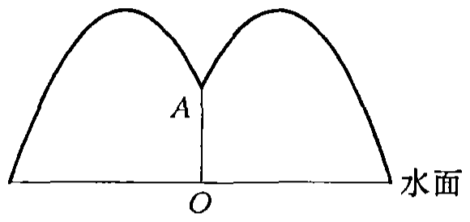
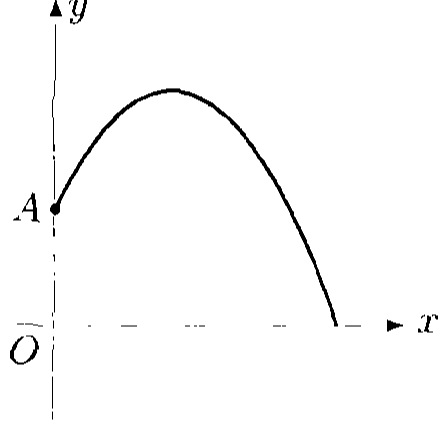
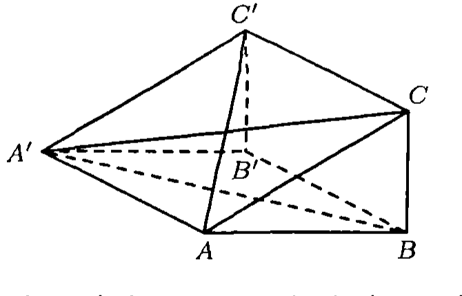
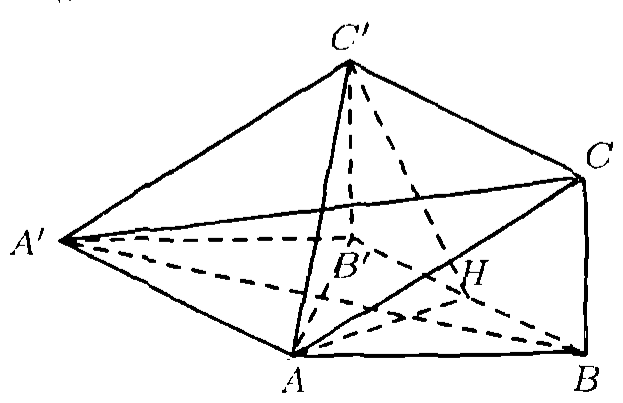
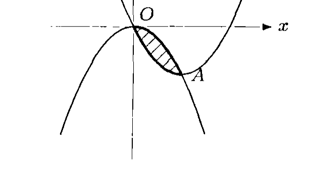
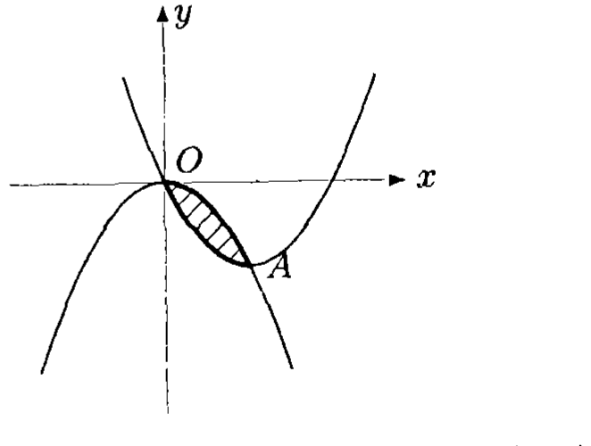
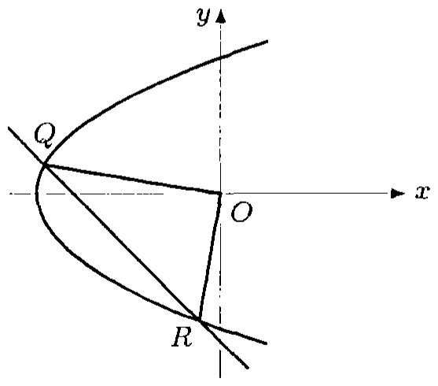
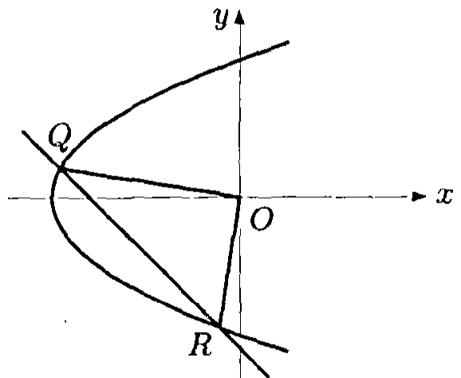

# 1997年上海卷（理）

## 单选题

### 第 1 题

设全集是实数集 $\mathbb{R}$，$M=\left\{x \mid x \leqslant 1+\sqrt{2}, x \in \mathbb{R}\right\}$，$N=\{1,2,3,4\}$. 则 $\overline{M} \cap N$ 等于（）

A.  
$\{4\}$

B.  
$\{3,4\}$

C.  
$\{2,3,4\}$

D.  
$\{1,2,3,4\}$

#### 答案

B

#### 解析

由 $1+\sqrt{2}\in(2,3)$，得 $\overline{M}=(1+\sqrt{2},+\infty)$. 在集合 $N$ 中，只有 $3$，$4$ 大于 $1+\sqrt{2}$，所以 $\overline{M}\cap N=\{3,4\}$. 因此选 B.

### 第 2 题

三个数 $6^{0.7}$，$0.7^{6}$，$\log_{0.7}6$ 的大小顺序是（）

A.  
$0.7^6 < \log_{0.7}6 < 6^{0.7}$

B.  
$0.7^6 < 6^{0.7} < \log_{0.7}6$

C.  
$\log_{0.7}6 < 6^{0.7} < 0.7^6$

D.  
$\log_{0.7}6 < 0.7^6 < 6^{0.7}$

#### 答案

D

#### 解析

因为 $0<0.7<1$，所以 $0.7^6<1$. 又因为 $6>1$，且对数的底数 $0.7$ 小于 $1$，所以 $\log_{0.7}6<0$. 另一方面，$6^{0.7}>1$. 因而 $\log_{0.7}6<0.7^6<6^{0.7}$，故选 D.

### 第 3 题

在下列命题中，假命题是（）

A.  
若 $a$，$b$ 是异面直线，则一定存在平面 $\alpha$ 过 $a$ 且与 $b$ 平行

B.  
若 $a$，$b$ 是异面直线，则一定存在平面 $\alpha$ 过 $a$ 且与 $b$ 垂直

C.  
若 $a$，$b$ 是异面直线，则一定存在平面 $\alpha$ 与 $a$，$b$ 所成角相等

D.  
若 $a$，$b$ 是异面直线，则一定存在平面 $\alpha$ 与 $a$，$b$ 的距离相等

#### 答案

B

#### 解析

设直线 $a$，$b$ 的方向向量分别为单位向量 $\boldsymbol{u}$，$\boldsymbol{v}$. 对于选项 A，过 $a$ 上一点作一条平行于 $b$ 的直线，这两条相交直线确定一个平面；该平面不含 $b$，否则 $a$，$b$ 共面，与异面矛盾，所以它与 $b$ 平行.

对于选项 C，取法向量平行于 $\boldsymbol{u}-\boldsymbol{v}$ 的平面，因为 $\left(\boldsymbol{u}-\boldsymbol{v}\right)\cdot\boldsymbol{u}=1-\boldsymbol{u}\cdot\boldsymbol{v}$，$\left(\boldsymbol{u}-\boldsymbol{v}\right)\cdot\boldsymbol{v}=\boldsymbol{u}\cdot\boldsymbol{v}-1$，两者绝对值相等，所以该平面与 $a$，$b$ 所成的角相等.

对于选项 D，令 $\boldsymbol{n}=\boldsymbol{u}\times\boldsymbol{v}$，取空间中一点 $O$ 为原点，并取点 $A\in a$，$B\in b$. 因为 $\boldsymbol{n}$ 同时垂直于两直线的方向，所以对任意 $X\in a$，$Y\in b$，都有 $\boldsymbol{n}\cdot\overrightarrow{AX}=0$，$\boldsymbol{n}\cdot\overrightarrow{BY}=0$. 因而 $\boldsymbol{n}\cdot\overrightarrow{OX}=\boldsymbol{n}\cdot\overrightarrow{OA}$ 在直线 $a$ 上为常数，$\boldsymbol{n}\cdot\overrightarrow{OY}=\boldsymbol{n}\cdot\overrightarrow{OB}$ 在直线 $b$ 上为常数；两直线异面保证这两个常数不相等. 取平面 $\boldsymbol{n}\cdot\overrightarrow{OX}=\frac{1}{2}\left(\boldsymbol{n}\cdot\overrightarrow{OA}+\boldsymbol{n}\cdot\overrightarrow{OB}\right)$，该平面平行于两直线，且到两直线的距离相等.

选项 B 要求存在过 $a$ 且垂直于 $b$ 的平面，这必然要求 $a\perp b$. 异面直线的方向不一定垂直，因此该命题不一定成立，故假命题是 B.

### 第 4 题

设 $\theta \in \left(\frac{3\pi}{4}, \pi\right)$，则关于 $x$，$y$ 的方程 $x^2 \csc \theta - y^2 \sec \theta = 1$ 所表示的曲线是（）

A.  
实轴在 $y$ 轴上的双曲线

B.  
实轴在 $x$ 轴上的双曲线

C.  
长轴在 $y$ 轴上的椭圆

D.  
长轴在 $x$ 轴上的椭圆

#### 答案

C

#### 解析

由 $\theta\in\left(\frac{3\pi}{4},\pi\right)$，知 $\sin\theta>0$，$\cos\theta<0$，所以 $\csc\theta>0$，$-\sec\theta>0$. 原方程可写为 $\csc\theta\,x^2+(-\sec\theta)\,y^2=1$，表示椭圆.

其半轴长的平方分别为 $\sin\theta$ 和 $-\cos\theta$. 在该区间内，$\sin\theta<-\cos\theta$，所以 $y$ 轴方向的半轴较长，长轴在 $y$ 轴上，故选 C.

### 第 5 题

如果直线 $l$ 沿 $x$ 轴负方向平移 $3$ 个单位，再沿 $y$ 轴正方向平移 $1$ 个单位后，又回到原来的位置，那么直线 $l$ 的斜率是（）

A.  
$-\frac{1}{3}$

B.  
$-3$

C.  
$\frac{1}{3}$

D.  
$3$

#### 答案

A

#### 解析

设直线 $l$ 的方程为 $y=kx+b$. 沿 $x$ 轴负方向平移 $3$ 个单位后，方程变为 $y=k(x+3)+b=kx+b+3k$. 再沿 $y$ 轴正方向平移 $1$ 个单位后，方程变为 $y=kx+b+3k+1$.

要回到原来的直线，必须有 $3k+1=0$，所以 $k=-\frac{1}{3}$，故选 A.

### 第 6 题

设 $f(n)=\frac{1}{n+1}+\frac{1}{n+2}+\frac{1}{n+3}+\cdots+\frac{1}{2n}$（$n \in \mathbb{N}$），那么 $f(n+1)-f(n)$ 等于（）

A.  
$\frac{1}{2n+1}$

B.  
$\frac{1}{2n+2}$

C.  
$\frac{1}{2n+1}+\frac{1}{2n+2}$

D.  
$\frac{1}{2n+1}-\frac{1}{2n+2}$

#### 答案

D

#### 解析

$f(n+1)-f(n)=\frac{1}{2n+1}+\frac{1}{2n+2}-\frac{1}{n+1}=\frac{1}{2n+1}+\frac{1}{2n+2}-\frac{2}{2n+2}=\frac{1}{2n+1}-\frac{1}{2n+2}$. 因此选 D.

## 填空题

### 第 7 题

二次曲线

$$

\begin{cases}
x = 5\cos \theta\\
y = 3\sin \theta
\end{cases}

$$

（$\theta$ 是参数）的左焦点坐标是＿＿＿＿＿＿.

#### 答案

$(-4,0)$

#### 解析

消去参数 $\theta$，得 $\frac{x^2}{25}+\frac{y^2}{9}=1$，这是椭圆，半长轴为 $5$，半短轴为 $3$. 焦距满足 $c^2=5^2-3^2=16$，所以 $c=4$. 椭圆的左焦点为 $(-4,0)$.

### 第 8 题

方程 $\sin 2x = \frac{1}{2}$ 在 $\left[-2\pi, 2\pi\right]$ 内解的个数是＿＿＿＿＿＿.

#### 答案

8

#### 解析

由 $\sin 2x=\frac12$，得 $2x=\frac{\pi}{6}+2k\pi$ 或 $2x=\frac{5\pi}{6}+2k\pi$，即 $x=\frac{\pi}{12}+k\pi$ 或 $x=\frac{5\pi}{12}+k\pi$，其中 $k\in\mathbb{Z}$.

在区间 $[-2\pi,2\pi]$ 内，第一组解对应 $k=-2$，$-1$，$0$，$1$，共有 $4$ 个；第二组解也对应 $k=-2$，$-1$，$0$，$1$，共有 $4$ 个；两组解不重合，所以解的个数为 $8$.

### 第 9 题

已知 $a=\frac{-3-\i}{1+2\i}$（$\i$ 是虚数单位），那么 $a^4=\underline{\qquad\qquad}$.

#### 答案

$-4$

#### 解析

分子、分母同乘以 $1-2\i$，得

$$

a=\frac{(-3-\i)(1-2\i)}{(1+2\i)(1-2\i)}=\frac{-5+5\i}{5}=-1+\i

$$

于是 $a^2=(-1+\i)^2=-2\i$，从而 $a^4=(-2\i)^2=-4$.

### 第 10 题

设圆 $x^2+y^2-4x-5=0$ 的弦 $AB$ 的中点为 $P(3,1)$，则直线 $AB$ 的方程是＿＿＿＿＿＿.

#### 答案

$x+y-4=0$

#### 解析

将圆的方程配方，得 $(x-2)^2+y^2=9$，所以圆心为 $O(2,0)$. 弦中点 $P(3,1)$ 与圆心的连线 $OP$ 垂直于弦 $AB$. 直线 $OP$ 的斜率为 $1$，因此直线 $AB$ 的斜率为 $-1$. 过 $P(3,1)$ 的直线 $AB$ 为 $y-1=-(x-3)$，即 $x+y-4=0$.

### 第 11 题

若 $(3x+1)^n$（$n \in \mathbb{N}$）的展开式中各项系数的和是 $256$，则展开式中 $x^2$ 的系数是＿＿＿＿＿＿.

#### 答案

54

#### 解析

展开式各项系数的和等于令 $x=1$ 时的值，因此 $(3+1)^n=4^n=256=4^4$，得 $n=4$.

此时 $(3x+1)^4$ 中的 $x^2$ 项来自二项式通项中的 $3x$ 取两次，故其系数为 $\mathrm C_4^2 3^2=6\times9=54$.

### 第 12 题

函数 $f(x)=3\sin x\cos x-4\cos^2 x$ 的最大值是＿＿＿＿＿＿.

#### 答案

$\frac{1}{2}$

#### 解析

利用 $2\sin x\cos x=\sin 2x$ 和 $2\cos^2x=1+\cos 2x$，得

$$

f(x)=\frac32\sin 2x-2(1+\cos 2x)=-2+\frac32\sin 2x-2\cos 2x

$$

由 $A\sin t+B\cos t$ 的最大值为 $\sqrt{A^2+B^2}$，有

$$

\frac32\sin 2x-2\cos 2x\leqslant\sqrt{\left(\frac32\right)^2+(-2)^2}=\frac52

$$

当 $\sin 2x$，$\cos 2x$ 与 $\left(\frac32,-2\right)$ 同向时可取等号，所以 $f(x)$ 的最大值为 $-2+\frac52=\frac12$.

## 选做题：填空题

### 第 13 题

设 $0<a<b$，则 $\displaystyle\lim_{n\to\infty}\frac{4b^n}{a^n-b^n}=\underline{\qquad\qquad}$.

#### 答案

$-4$

#### 解析

分子、分母同除以 $b^n$，得

$$

\frac{4b^n}{a^n-b^n}=\frac{4}{\left(\frac{a}{b}\right)^n-1}

$$

因为 $0<a<b$，所以 $0<\frac ab<1$，从而 $\left(\frac ab\right)^n\to0$. 因此极限为 $\frac{4}{0-1}=-4$.

### 第 14 题

设正四棱锥底面边长为 $4\mathrm{~cm}$，侧面和底面所成的二面角是 $60^\circ$，则这个棱锥的侧面积是＿＿＿＿＿＿$\mathrm{cm}^2$.

#### 答案

32

#### 解析

设正四棱锥的顶点为 $S$，底面中心为 $O$，底面一边的中点为 $M$. 则 $OM=2$，且 $SM$ 是侧面的斜高. 在截面三角形 $SOM$ 中，$SO\perp OM$，二面角为 $\angle SMO=60^\circ$，所以 $\cos60^\circ=\frac{OM}{SM}=\frac{2}{SM}$，得 $SM=4$.

每个侧面的面积为 $\frac12\times4\times4=8$，四个侧面的总面积为 $4\times8=32\ \mathrm{cm}^2$.

### 第 15 题

圆柱形容器的内壁底半径为 $5\mathrm{~cm}$，两个直径为 $5\mathrm{~cm}$ 的玻璃小球都浸没于容器的水中. 若取出这两个小球，则容器内的水面将下降＿＿＿＿＿＿$\mathrm{cm}$.

#### 答案

$\frac{5}{3}$

#### 解析

每个玻璃球的半径为 $\frac52\ \mathrm{cm}$，两个球的总体积为

$$

2\times\frac43\pi\left(\frac52\right)^3=\frac{125\pi}{3}\ \mathrm{cm}^3

$$

取出小球后，水面下降的体积正好等于两个小球排开的体积；设下降高度为 $h$，圆柱容器的底面积为 $25\pi\ \mathrm{cm}^2$，则 $25\pi h=\frac{125\pi}{3}$，所以 $h=\frac53\ \mathrm{cm}$.

### 第 16 题

从集合 $\{0,1,2,3,5,7,11\}$ 中任取 $3$ 个元素分别作为直线方程 $Ax+By+C=0$ 中的 $A$，$B$，$C$，所得恰好经过坐标原点的直线有＿＿＿＿＿＿ 条（结果用数值表示）.

#### 答案

30

#### 解析

直线经过坐标原点时，代入 $(0,0)$ 得 $C=0$. 因为 $A$，$B$，$C$ 是从集合中任取后分别使用的三个不同元素，所以 $A$，$B$ 必须从其余六个非零元素中有序选取：先选 $A$ 有 $6$ 种，再选 $B$ 有 $5$ 种.

因此所得直线的条数为 $6\times5=30$.

### 第 17 题

$\displaystyle\lim_{n\to\infty}\left(1-\frac{2}{n}\right)^{-2n}=\underline{\qquad\qquad}$.

#### 答案

$\e^4$

#### 解析

令 $L_n=\left(1-\frac2n\right)^{-2n}$. 对充分大的 $n$，$L_n>0$，且

$$

\ln L_n=-2n\ln\left(1-\frac2n\right)

$$

由 $\displaystyle\lim_{u\to0}\frac{\ln(1+u)}{u}=1$，取 $u=-\frac2n$，得

$$

\lim_{n\to\infty}\ln L_n
=\lim_{n\to\infty}-2n\left(-\frac2n\right)\frac{\ln\left(1-\frac2n\right)}{-\frac2n}=4

$$

因此 $L_n\to\e^4$.

### 第 18 题

设 $\boldsymbol{a}=(m+1)\boldsymbol{i}-3\boldsymbol{j}$，$\boldsymbol{b}=\boldsymbol{i}+(m-1)\boldsymbol{j}$，$\left(\boldsymbol{a}+\boldsymbol{b}\right)\perp\left(\boldsymbol{a}-\boldsymbol{b}\right)$，则 $m=\underline{\qquad\qquad}$.

#### 答案

$-2$

#### 解析

由 $(\boldsymbol{a}+\boldsymbol{b})\perp(\boldsymbol{a}-\boldsymbol{b})$，得

$$

0=(\boldsymbol{a}+\boldsymbol{b})\cdot(\boldsymbol{a}-\boldsymbol{b})=|\boldsymbol{a}|^2-|\boldsymbol{b}|^2

$$

而 $|\boldsymbol{a}|^2=(m+1)^2+(-3)^2$，$|\boldsymbol{b}|^2=1^2+(m-1)^2$，所以

$$

(m+1)^2+9=1+(m-1)^2

$$

展开并化简得 $4m+8=0$，故 $m=-2$.

### 第 19 题

设 $f(x)=x^2(2-x)$，则 $f(x)$ 的单调递增区间是＿＿＿＿＿＿.

#### 答案

$\left(0,\frac{4}{3}\right)$

#### 解析

$f(x)=x^2(2-x)=2x^2-x^3$，所以 $f'(x)=4x-3x^2=x(4-3x)$. 当 $0<x<\frac43$ 时，$x>0$ 且 $4-3x>0$，故 $f'(x)>0$，函数单调递增；其余区间导数不为正，所以单调递增区间为 $\left(0,\frac43\right)$.

### 第 20 题

从集合 $\{0,1,2,3,5,7,11\}$ 中任取 $3$ 个元素分别作为直线方程 $Ax+By+C=0$ 中的 $A$，$B$，$C$，所得恰好经过坐标原点的直线的概率是＿＿＿＿＿＿.

#### 答案

$\frac{1}{7}$

#### 解析

总的有序取法数为 $7\times6\times5=210$. 直线经过原点当且仅当 $C=0$，此时 $A$，$B$ 从其余六个非零元素中有序选取，恰有 $6\times5=30$ 种.

所以所求概率为 $\frac{30}{210}=\frac17$.

## 解答题

### 第 21 题

已知 $\tan \frac{\alpha}{2}=\frac{1}{2}$，求 $\sin \left(\alpha+\frac{\pi}{6}\right)$ 的值.

#### 解析

由半角正切公式，在 $\tan\frac{\alpha}{2}$ 有定义时， $\sin\alpha=\frac{2\tan\frac{\alpha}{2}}{1+\tan^2\frac{\alpha}{2}}=\frac{2\times\frac12}{1+\frac14}=\frac45$， $\cos\alpha=\frac{1-\tan^2\frac{\alpha}{2}}{1+\tan^2\frac{\alpha}{2}}=\frac{1-\frac14}{1+\frac14}=\frac35$. 因此 $\sin\left(\alpha+\frac\pi6\right)=\sin\alpha\cos\frac\pi6+\cos\alpha\sin\frac\pi6=\frac45\times\frac{\sqrt3}{2}+\frac35\times\frac12=\frac{3+4\sqrt3}{10}$.

### 第 22 题

公园要建造一个圆形的喷水池. 在水池中央垂直于水面安装一个花形柱子 $OA$. $O$ 恰在水面中心，$OA=1.25\text{ 米}$. 安置在柱子顶端 $A$ 处的喷头向外喷水，水流在各个方向上沿形状相同的抛物线路径落下，且在过 $OA$ 的任一平面上抛物线路径如图所示. 为使水流形状较为漂亮，设计成水流在到 $OA$ 距离为 $1\text{ 米}$ 处达到距水面最大高度 $2.25\text{ 米}$. 如果不计其它因素，那么水池的半径至少要多少米，才能使喷出的水流不致落到池外.

#### 解析

如图建立直角坐标系，

则水流所呈现的抛物线方程为 $y=a(x-1)^2+2.25$. 由题意，点 $A$ 的坐标为 $(0,1.25)$，把 $x=0$ 和 $y=1.25$ 代入上述方程，得 $a=-1$，于是抛物线方程为 $y=-(x-1)^2+2.25$. 令 $y=0$，得 $-(x-1)^2+2.25=0$，解得 $x_1=2.5$，$x_2=-0.5$（不合，舍去）. 答：水池半径至少要 $2.5\text{ 米}$，才能使水流不落到池外.

### 第 23 题

如图，在三棱柱 $ABC-A'B'C'$ 中，四边形 $A'ABB'$ 是菱形，四边形 $BCC'B'$ 是矩形，$C'B' \perp AB$.

1.  求证：平面 $CA'B \perp$ 平面 $A'AB$；

2.  若 $C'B'=3$，$AB=4$，$\angle ABB'=60^\circ$，求 $AC'$ 与平面 $BCC'$ 所成角的大小（用反三角函数表示）.

#### 解析

1.  证明：因为在三棱柱 $ABC-A'B'C'$ 中，$C'B' \parallel CB$，所以 $CB \perp AB$. 又因为 $CB \perp BB'$，$AB \cap BB'=B$，所以 $CB \perp$ 平面 $A'AB$. 因为 $CB \subset$ 平面 $CA'B$，因此平面 $CA'B \perp$ 平面 $A'AB$.

2.  由 $C'B' \perp$ 平面 $A'AB$，得平面 $A'AB \perp$ 平面 $BCC'$. 过 $A$ 作 $AH \perp$ 平面 $BCC'$，$H$ 为垂足，则 $H$ 在 $BB'$ 上. 连接 $C'H$，则 $\angle AC'H$ 为 $AC'$ 与平面 $BCC'$ 所成的角. 连接 $AB'$，由四边形 $A'ABB'$ 是菱形，$\angle ABB'=60^\circ$，可知 $\triangle ABB'$ 为等边三角形，而 $H$ 为 $BB'$ 中点. 又 $AB'=4$，$AH=2\sqrt{3}$，于是在 $\mathrm{Rt}\triangle C'B'A$ 中，$AC'=\sqrt{4^2+3^2}=5$，而在 $\mathrm{Rt}\triangle AHC'$ 中，$\sin \angle AC'H=\frac{2\sqrt{3}}{5}$，所以 $\angle AC'H=\arcsin \frac{2\sqrt{3}}{5}$. 因此，直线 $AC'$ 与平面 $BCC'$ 所成的角是 $\arcsin \frac{2\sqrt{3}}{5}$.

## 选做题：解答题

### 第 24 题

设虚数 $z_1$，$z_2$ 满足 $z_1^2=z_2$.

1.  若 $z_1$，$z_2$ 又是一个实系数一元二次方程的两个根，求 $z_1$，$z_2$；

2.  若 $z_1=1+m\i$（$m>0$，$\i$ 为虚数单位），$\omega=z_2-2$，$\omega$ 的辐角主值为 $\theta$，求 $\theta$ 的取值范围.

#### 解析

1.  设 $z_1=a+b\i$，$z_2=a-b\i$（$a$，$b \in \mathbb{R}$ 且 $b \neq 0$）. 由 $z_1^2=z_2$，得 $a^2-b^2+2ab\i=a-b\i$，于是

$$

\begin{cases}
    a^2-b^2=a,\\
    2ab=-b.
    \end{cases}

$$

解得 $a=-\frac{1}{2}$，$b=\pm\frac{\sqrt{3}}{2}$，所以 $z_1=-\frac{1}{2}+\frac{\sqrt{3}}{2}\i$，$z_2=-\frac{1}{2}-\frac{\sqrt{3}}{2}\i$，或 $z_1=-\frac{1}{2}-\frac{\sqrt{3}}{2}\i$，$z_2=-\frac{1}{2}+\frac{\sqrt{3}}{2}\i$.

2.  由 $z_1=1+m\i$（$m>0$），$z_1^2=z_2$，得 $z_2=(1-m^2)+2m\i$，所以 $\omega=-(1+m^2)+2m\i$，$\tan \theta=-\frac{2m}{1+m^2}=-\frac{2}{m+\frac{1}{m}}$. 由 $m>0$，知 $m+\frac{1}{m} \geqslant 2$，于是 $-1 \leqslant \tan \theta < 0$. 又由 $-(m^2+1)<0$，$2m>0$，得 $\frac{3\pi}{4} \leqslant \theta < \pi$. 因此，所求 $\theta$ 的取值范围为 $\left[\frac{3\pi}{4}, \pi\right)$.

### 第 25 题

如图，抛物线 $C_1:y=-x^2$ 与抛物线 $C_2:y=x^2-2ax$（$a>0$）交于 $O$，$A$ 两点.

1.  把 $C_1$ 与 $C_2$ 所围成的图形（阴影部分）绕 $x$ 轴旋转一周，求所得几何体的体积 $V$；

2.  若过原点的直线 $l$ 与抛物线 $C_2$ 所围成的图形面积为 $\frac{9}{2}a^3$，求直线 $l$ 的方程.

#### 解析

1.  $C_1$ 和 $C_2$ 交于两点 $O(0,0)$，$A(a,-a^2)$，

$$

\begin{aligned}
    V&=\pi \int_0^a (x^2-2ax)^2 \mathrm{d}x-\pi \int_0^a (-x^2)^2 \mathrm{d}x \\
    &=4a\pi \int_0^a (-x^3+ax^2) \mathrm{d}x \\
    &=4a\pi \left(-\frac{1}{4}x^4+\frac{1}{3}ax^3\right)\Bigg|_0^a=\frac{\pi}{3}a^5.
    \end{aligned}

$$

2.  设过原点的直线方程为 $y=kx$，解方程组

$$

\begin{cases}
    y=kx,\\
    y=x^2-2ax,
    \end{cases}

$$

    得 $x_1=0$，$x_2=k+2a$. 当 $k+2a \geqslant 0$ 时，

$$

\begin{aligned}
    S&=\int_0^{k+2a} (kx-x^2+2ax) \mathrm{d}x \\
    &=\int_0^{k+2a} \left[(k+2a)x-x^2\right] \mathrm{d}x
    =\left(\frac{k+2a}{2}x^2-\frac{1}{3}x^3\right)\Bigg|_0^{k+2a} \\
    &=\frac{(k+2a)^3}{6}.
    \end{aligned}

$$

    于是 $(k+2a)^3=27a^3$，解得 $k=a$. 所以，直线 $l$ 的方程为 $y=ax$.

    当 $k+2a<0$ 时， $S=\int_{k+2a}^0 \left[(k+2a)x-x^2\right] \mathrm{d}x=-\frac{(k+2a)^3}{6}$， 于是 $-(k+2a)^3=27a^3$，解得 $k=-5a$. 所以，直线 $l$ 的方程为 $y=-5ax$.

## 解答题

### 第 26 题

如图，抛物线方程为 $y^2=p(x+1)$（$p>0$），直线 $x+y=m$ 与 $x$ 轴的交点在抛物线的准线的右边.

1.  求证：直线与抛物线总有两个交点；

2.  设直线与抛物线的交点为 $Q$，$R$，$OQ\perp OR$，求 $p$ 关于 $m$ 的函数 $f(m)$ 的表达式；

3.  在（2）的条件下，若 $m$ 变化，使得原点 $O$ 到直线 $QR$ 的距离不大于 $\frac{\sqrt{2}}{2}$，求 $p$ 的取值范围.

#### 解析

1.  证明：抛物线 $y^2=p(x+1)$ 的准线方程是 $x=-1-\frac{p}{4}$，直线 $x+y=m$ 与 $x$ 轴的交点为 $(m,0)$，则 $m>-1-\frac{p}{4}$，即 $4m+p+4>0$. 由方程组

$$

\begin{cases}
    y^2=p(x+1),\\
    x+y=m,
    \end{cases}

$$

得 $x^2-(2m+p)x+(m^2-p)=0$，而判别式 $\Delta=(2m+p)^2-4(m^2-p)=p(4m+p+4)$. 又 $p>0$ 及 $4m+p+4>0$，可见 $\Delta>0$. 因此，直线与抛物线总有两个交点.

2.  设 $Q$，$R$ 两点的坐标分别为 $(x_1,y_1)$，$(x_2,y_2)$，由（1）知，$x_1$，$x_2$ 是方程 $x^2-(2m+p)x+m^2-p=0$ 的两根. 所以 $x_1+x_2=2m+p$，$x_1x_2=m^2-p$. 由 $OQ \perp OR$，直接用向量点积得 $x_1x_2+y_1y_2=0$，这一写法也包含坐标轴为竖直或水平的特殊情形. 又 $Q$，$R$ 为直线 $x+y=m$ 上的点，因而 $y_1=-x_1+m$，$y_2=-x_2+m$. 于是 $x_1x_2+y_1y_2=2x_1x_2-m(x_1+x_2)+m^2=0$，所以 $p=f(m)=\frac{m^2}{m+2}$. 由 $p>0$，$4m+4+p>0$，得 $m>-2$，$m \neq 0$.

3.  由原点 $O$ 到直线 $x+y=m$ 的距离不大于 $\frac{\sqrt{2}}{2}$，得 $\frac{|m|}{\sqrt{2}}\leqslant\frac{\sqrt{2}}{2}$，所以 $|m|\leqslant1$. 结合（2）中的条件 $m>-2$ 且 $m\neq0$，可得 $m\in[-1,0)\cup(0,1]$.

    由（2），$p=f(m)=\frac{m^2}{m+2}$，且 $f'(m)=\frac{2m(m+2)-m^2}{(m+2)^2}=\frac{m(m+4)}{(m+2)^2}$. 当 $m\in[-1,0)$ 时，$f'(m)<0$，所以 $f$ 在该区间递减；又 $f(-1)=1$，$\displaystyle\lim_{m\to0^-}f(m)=0$，故此时 $p\in(0,1]$. 当 $m\in(0,1]$ 时，$f'(m)>0$，所以 $f$ 在该区间递增；又 $\displaystyle\lim_{m\to0^+}f(m)=0$，$f(1)=\frac13$，故此时 $p\in\left(0,\frac13\right]$. 因而 $p$ 的取值范围为 $(0,1]$.

### 第 27 题

设数列 $\{a_n\}$ 的首项 $a_1=1$，前 $n$ 项和 $S_n$ 满足关系式：$3tS_n-(2t+3)S_{n-1}=3t$（$t>0$，$n=2$，$3$，$4$，$\dots$）.

1.  求证：数列 $\{a_n\}$ 是等比数列；

2.  设数列 $\{a_n\}$ 的公比为 $f(t)$，作数列 $\{b_n\}$，使 $b_1=1$，$b_n=f\left(\frac{1}{b_{n-1}}\right)$（$n=2$，$3$，$4$，$\cdots$），求 $\displaystyle\lim_{n\to\infty}\frac{\lg a_n}{b_n}$；

3.  求和：$b_1b_2-b_2b_3+b_3b_4-\cdots+(-1)^{n-1}b_nb_{n+1}$.

#### 解析

1.  由 $S_1=a_1=1$，$S_2=a_1+a_2=1+a_2$，得 $3t(1+a_2)-(2t+3)=3t$，可见 $a_2=\frac{2t+3}{3t}$，$\frac{a_2}{a_1}=\frac{2t+3}{3t}$. 又 $3tS_n-(2t+3)S_{n-1}=3t$，$3tS_{n-1}-(2t+3)S_{n-2}=3t$，两式相减，得 $3ta_n-(2t+3)a_{n-1}=0$. 于是 $\frac{a_n}{a_{n-1}}=\frac{2t+3}{3t}$（$n=3$，$4$，$\dots$）. 因此，$\{a_n\}$ 是一个首项为 $1$，公比为 $\frac{2t+3}{3t}$ 的等比数列.

2.  由 $f(t)=\frac{2t+3}{3t}=\frac{2}{3}+\frac{1}{t}$，$b_n=f\left(\frac{1}{b_{n-1}}\right)=\frac{2}{3}+b_{n-1}$，可见，$\{b_n\}$ 是一个首项为 $1$，公差为 $\frac{2}{3}$ 的等差数列. 于是 $b_n=1+\frac{2}{3}(n-1)=\frac{2n+1}{3}$. 所以 $\displaystyle\lim_{n\to\infty}\frac{\lg a_n}{b_n}=\displaystyle\lim_{n\to\infty}\frac{3(n-1)\lg \left(\frac{2t+3}{3t}\right)}{2n+1}=\frac{3}{2}\lg \left(\frac{2t+3}{3t}\right)$.

3.  由 $b_n=\frac{2n+1}{3}$，可知 $\{b_{2n-1}\}$ 和 $\{b_{2n}\}$ 是首项分别为 $1$ 和 $\frac{5}{3}$，公差均为 $\frac{4}{3}$ 的等差数列，于是 $b_{2n}=\frac{4n+1}{3}$，$b_{2n+1}=\frac{4n+3}{3}$. 当 $n=2m$（$m=1$，$2$，$\dots$）时，

$$

\begin{aligned}
    &b_1b_2-b_2b_3+b_3b_4-b_4b_5+\cdots+b_{2m-1}b_{2m}-b_{2m}b_{2m+1} \\
    =&b_2(b_1-b_3)+b_4(b_3-b_5)+\cdots+b_{2m}(b_{2m-1}-b_{2m+1}) \\
    =&-\frac{4}{3}(b_2+b_4+\cdots+b_{2m})
    =-\frac{4}{3} \cdot \frac{1}{2}m \cdot \left(\frac{5}{3}+\frac{4m+1}{3}\right)
    =-\frac{4}{9}m(2m+3)=-\frac{1}{9}(2n^2+6n).
    \end{aligned}

$$

    当 $n=2m-1$（$m=1$，$2$，$\dots$）时，

$$

\begin{aligned}
    &b_1b_2-b_2b_3+b_3b_4-b_4b_5+\cdots-b_{2m-2}b_{2m-1}+b_{2m-1}b_{2m} \\
    =&-\frac{4}{9}m(2m+3)+b_{2m}b_{2m+1} \\
    =&-\frac{4}{9}m(2m+3)+\frac{(4m+1)(4m+3)}{9}
    =\frac{1}{9}(8m^2+4m+3)=\frac{1}{9}(2n^2+6n+7).
    \end{aligned}

$$

    所以 $b_1b_2-b_2b_3+b_3b_4-\dots+(-1)^{n-1}b_nb_{n+1}$ 等于

$$

\begin{cases}
    -\dfrac{1}{9}(2n^2+6n), & n \text{为偶数};\\[2mm]
    \dfrac{1}{9}(2n^2+6n+7), & n \text{为奇数}.
    \end{cases}

$$

