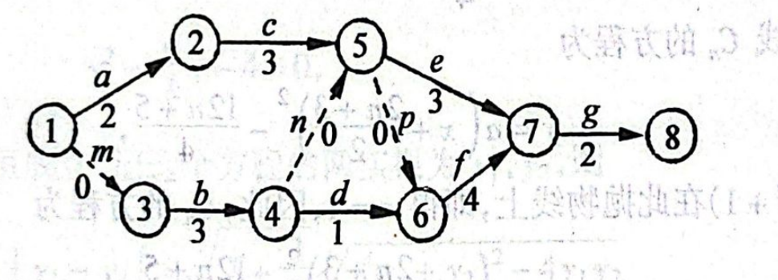

# 1998年上海卷（文）

## 填空题

### 第 1 题

$\lg20 + \log_{100}25 =$＿＿＿＿＿＿.

#### 答案

2

#### 解析

由对数的运算性质，

$$

\lg20+\log_{100}25=\lg20+\frac{\lg25}{\lg100}=\lg20+\frac{2\lg5}{2}=\lg(20\cdot5)=\lg100=2

$$

### 第 2 题

若函数 $y = 2\sin x + \sqrt{a} \cos x + 4$ 的最小值为 $1$，则 $a=$＿＿＿＿＿＿.

#### 答案

5

#### 解析

因为根式有意义，$a\geqslant0$. 由正弦、余弦的有界性及振幅公式，

$$

2\sin x+\sqrt a\cos x\in\left[-\sqrt{2^2+(\sqrt a)^2},\sqrt{2^2+(\sqrt a)^2}\right]=\left[-\sqrt{4+a},\sqrt{4+a}\right]

$$

因此函数的最小值为 $4-\sqrt{4+a}$. 由题意， $4-\sqrt{4+a}=1$，所以 $\sqrt{4+a}=3$，解得 $a=5$.

### 第 3 题

若 $\displaystyle\lim_{x\to1}\frac{x^{2}+ax+3}{x^{3}+3}=2$，则 $a=$＿＿＿＿＿＿.

#### 答案

4

#### 解析

当 $x\to1$ 时，分母 $x^3+3\to4\ne0$，故可直接代入：

$$

\lim_{x\to1}\frac{x^2+ax+3}{x^3+3}=\frac{1+a+3}{1+3}=\frac{a+4}{4}

$$

由题意 $\frac{a+4}{4}=2$，所以 $a=4$.

### 第 4 题

函数 $f(x)=(x-1)^{\frac{1}{3}}+2$ 的反函数是 $f^{-1}(x)=$＿＿＿＿＿＿.

#### 答案

$(x-2)^3+1$，$x\in\mathbb{R}$

#### 解析

设 $y=f(x)=(x-1)^{1/3}+2$. 则 $y-2=(x-1)^{1/3}$，两边立方得 $x=(y-2)^3+1$. 交换 $x$、$y$，得到

$$

f^{-1}(x)=(x-2)^3+1

$$

由于立方根函数的定义域和值域都是 $\mathbb{R}$，所以 $f^{-1}$ 的定义域为 $\mathbb{R}$.

### 第 5 题

棱长为$2$的正四面体的体积为＿＿＿＿＿＿.

#### 答案

$\dfrac{2\sqrt{2}}{3}$

#### 解析

取正四面体的一个面为底面，底面是边长为 $2$ 的正三角形，面积为 $S=\frac{\sqrt3}{4}\cdot2^2=\sqrt3$. 设顶点到底面的高为 $h$，底面中心到任一顶点的距离为正三角形的外接圆半径 $\frac{2}{\sqrt3}$. 由勾股定理，

$$

h=\sqrt{2^2-\left(\frac{2}{\sqrt3}\right)^2}=2\sqrt{\frac{2}{3}}

$$

所以正四面体的体积为

$$

V=\frac13Sh=\frac13\cdot\sqrt3\cdot2\sqrt{\frac23}=\frac{2\sqrt2}{3}

$$

### 第 6 题

某工程的工序流程图如下（工时数单位：天）： 则工程总时数为＿＿＿＿＿＿$\text{天}$.

#### 答案

11

#### 解析

设各事件最早完成时间分别为 $T_1$，$T_2$，$\ldots$，$T_8$，从事件 1 开始计时，则 $T_1=0$. 按流程图逐个计算： $T_2=T_1+2=2$，$T_3=T_1+0=0$，$T_4=T_3+3=3$.

$T_5=\max\{T_2+3,T_4+0\}=5$，$T_6=\max\{T_4+1,T_5+0\}=5$.

$T_7=\max\{T_5+3,T_6+4\}=9$，$T_8=T_7+2=11$. 因此工程总时数为 $11$ 天.

### 第 7 题

袋内装有大小相同的 $4$ 个白球和 $3$ 个黑球，从中任意摸出 $3$ 个球，其中只有一个黑球的概率是＿＿＿＿＿＿.

#### 答案

$\dfrac{18}{35}$

#### 解析

从 $7$ 个球中任意摸出 $3$ 个球的基本事件数为 $\mathrm C_7^3$. 其中恰有一个黑球的取法数为从 $3$ 个黑球中取 $1$ 个、从 $4$ 个白球中取 $2$ 个，即 $\mathrm C_3^1\mathrm C_4^2$. 所求概率为

$$

P=\frac{\mathrm C_3^1\mathrm C_4^2}{\mathrm C_7^3}=\frac{3\cdot6}{35}=\frac{18}{35}

$$

### 第 8 题

函数

$$

y=\begin{cases}
2x+3,&x\leqslant0\\
x+3,&0<x\leqslant1\\
-x+5,&x>1
\end{cases}

$$

的最大值是＿＿＿＿＿＿.

#### 答案

4

#### 解析

当 $x\leqslant0$ 时，$y=2x+3\leqslant3$，且在 $x=0$ 时取得最大值 $3$. 当 $0<x\leqslant1$ 时，$y=x+3\leqslant4$，且在 $x=1$ 时取得值 $4$. 当 $x>1$ 时，$y=-x+5<4$. 因此函数的最大值为 $4$.

### 第 9 题

设 $n$ 是一个自然数，$\left(1+\frac{x}{n}\right)^{n}$ 的展开式中 $x^{3}$ 的系数为 $\frac{1}{16}$，则 $n=$＿＿＿＿＿＿.

#### 答案

4

#### 解析

由于 $x^3$ 的系数非零，必有 $n\geqslant3$. 由二项式定理，$x^3$ 的系数为

$$

\mathrm C_n^3\left(\frac1n\right)^3=\frac{n(n-1)(n-2)}{6n^3}=\frac{(n-1)(n-2)}{6n^2}

$$

由题意，

$$

\frac{(n-1)(n-2)}{6n^2}=\frac1{16}

$$

即 $5n^2-24n+16=0$. 因而

$$

n=\frac{24\pm\sqrt{24^2-4\cdot5\cdot16}}{10}=\frac{24\pm16}{10}

$$

得到 $n=4$ 或 $n=\frac45$. 因为 $n$ 是自然数且系数 $x^3$ 非零，故 $n=4$.

### 第 10 题

在数列 $\{a_{n}\}$ 和 $\{b_{n}\}$ 中， $a_{1}=2$，且对任意自然数 $n$， $3a_{n+1}-a_{n}=0$， $b_{n}$ 是 $a_{n}$ 与 $a_{n+1}$ 的等差中项，则 $\{b_{n}\}$ 的各项和是＿＿＿＿＿＿.

#### 答案

2

#### 解析

由 $3a_{n+1}-a_n=0$，得 $a_{n+1}=\frac13a_n$. 因此

$$

a_n=\frac{2}{3^{n-1}}

$$

因为 $b_n$ 是 $a_n$ 与 $a_{n+1}$ 的等差中项，所以

$$

b_n=\frac{a_n+a_{n+1}}2=\frac12\left(\frac{2}{3^{n-1}}+\frac{2}{3^n}\right)=\frac4{3^n}

$$

故 $\{b_n\}$ 的各项和为首项为 $\frac43$、公比为 $\frac13$ 的无穷等比数列之和：

$$

\sum_{n=1}^{\infty}b_n=\frac{\frac43}{1-\frac13}=2

$$

### 第 11 题

与椭圆 $\frac{x^2}{49} + \frac{y^2}{24} = 1$ 有相同焦点且以 $y = \pm \frac{4}{3} x$ 为渐近线的双曲线方程是＿＿＿＿＿＿.

#### 答案

$\dfrac{x^2}{9}-\dfrac{y^2}{16}=1$

#### 解析

椭圆的长半轴平方和短半轴平方分别为 $49$、$24$，所以其焦半距满足

$$

c^2=49-24=25

$$

即焦点为 $(\pm5,0)$. 双曲线与椭圆有相同焦点，故双曲线的实轴在 $x$ 轴上，设其方程为

$$

\frac{x^2}{A^2}-\frac{y^2}{B^2}=1

$$

其渐近线斜率为 $\pm B/A$，由题意 $B/A=4/3$，又由焦半距公式 $A^2+B^2=c^2=25$. 因此 $B^2=\frac{16}{9}A^2$，$A^2+\frac{16}{9}A^2=25$ 解得 $A^2=9$、$B^2=16$. 所求双曲线方程为

$$

\frac{x^2}{9}-\frac{y^2}{16}=1

$$

## 单选题

### 第 12 题

下列函数中，周期为 $\frac{\pi}{2}$ 的偶函数是（）

A.  
$y = \sin 4x$

B.  
$y = \cos^2 2x - \sin^2 2x$

C.  
$y = \tan 2x$

D.  
$y = \cos 2x$

#### 答案

B

#### 解析

函数 $y=\sin4x$ 的周期为 $\frac\pi2$，但它是奇函数；函数 $y=\cos^22x-\sin^22x=\cos4x$，是偶函数且周期为 $\frac\pi2$. 函数 $y=\tan2x$ 虽周期为 $\frac\pi2$，但不是偶函数；函数 $y=\cos2x$ 是偶函数，但其最小正周期为 $\pi$. 故选 B.

### 第 13 题

若 $0 < a < 1$，则函数 $y = \log_a(x + 5)$ 的图象不经过（）

A.  
第一象限

B.  
第二象限

C.  
第三象限

D.  
第四象限

#### 答案

A

#### 解析

因为 $0<a<1$，函数 $y=\log_a(x+5)$ 的定义域为 $x>-5$，且函数值随 $x$ 增大而减小. 当 $-5<x<-4$ 时，$0<x+5<1$，故 $y>0$，此时 $x<0$，图象经过第二象限；当 $-4<x<0$ 时，$y<0$ 且 $x<0$，图象经过第三象限；当 $x>0$ 时，$x+5>1$，故 $y<0$，图象经过第四象限. 当 $x>0$ 时不可能有 $y>0$，所以图象不经过第一象限，故选 A.

### 第 14 题

在下列命题中，假命题是（）

A.  
若平面 $\alpha$ 内的一条直线 $l$ 垂直于平面 $\beta$ 内的任一直线，则 $\alpha \perp \beta$

B.  
若平面 $\alpha$ 内的任一直线平行于平面 $\beta$，则 $\alpha \parallel \beta$

C.  
若平面 $\alpha \perp \beta$，任取直线 $l \subset \alpha$，则必有 $l \perp \beta$

D.  
若平面 $\alpha \parallel \beta$，任取直线 $l \subset \alpha$，则必有 $l \parallel \beta$

#### 答案

C

#### 解析

第一项中，平面 $\alpha$ 内有一条直线垂直于平面 $\beta$ 内的任一直线，即该直线垂直于平面 $\beta$，所以 $\alpha\perp\beta$，命题正确. 第二项中，若平面 $\alpha$ 内任一直线都平行于平面 $\beta$，则 $\alpha$ 与 $\beta$ 不相交，所以 $\alpha\parallel\beta$，命题正确. 第四项中，若 $\alpha\parallel\beta$，则 $\alpha$ 内任一直线都不与 $\beta$ 相交，故都平行于 $\beta$，命题正确.

若 $\alpha\perp\beta$，则两平面相交. 取交线 $l=\alpha\cap\beta$，有 $l\subset\alpha$ 且 $l\subset\beta$，因此 $l$ 不可能垂直于平面 $\beta$. 所以第三项是假命题，故选第三项.

### 第 15 题

设全集为 $\mathbb{R}$，$A=\{x\mid x^{2}-5x-6>0\}$，$B=\{x\mid \lvert x-5\rvert<a\}$（$a$ 是常数），且 $11\in B$，则（）

A.  
$\overline{A} \cup B = \mathbb{R}$

B.  
$A \cup \overline{B} = \mathbb{R}$

C.  
$\overline{A} \cup \overline{B} = \mathbb{R}$

D.  
$A \cup B = \mathbb{R}$

#### 答案

D

#### 解析

由 $x^2-5x-6=(x+1)(x-6)$，得 $A=(-\infty,-1)\cup(6,+\infty)$，$\overline A=[-1,6]$. 又因为 $11\in B$，所以 $|11-5|<a$，即 $a>6$. 从而

$$

B=(5-a,5+a),\qquad \overline B=(-\infty,5-a]\cup[5+a,+\infty)

$$

其中上横线表示相对于全集 $\mathbb{R}$ 的补集. 且 $5-a<-1$、$5+a>6$，所以 $[-1,6]\subset B$. 因此 $A\cup B=\mathbb{R}$，选项 D 正确.

其余选项均不成立：取 $x=6+a$，则 $x\notin\overline A\cup B$，所以第一项不成立；取 $x=5$，则 $x\notin A$ 且 $x\in B$，从而 $x\notin A\cup\overline B$，所以第二项不成立；因为 $a>6$，有 $7\in A\cap B$，所以 $7\notin\overline A\cup\overline B$，第三项不成立. 故选 D.

### 第 16 题

设 $a$，$b$，$c$ 分别是 $\triangle ABC$ 中 $\angle A$，$\angle B$，$\angle C$ 所对边的边长，则直线 $\sin A \cdot x + ay + c = 0$ 与 $bx - \sin B \cdot y + \sin C = 0$ 的位置关系是（）

A.  
平行

B.  
重合

C.  
垂直

D.  
相交但不垂直

#### 答案

C

#### 解析

取两条直线的方向向量分别为 $\bs u=(a,-\sin A)$，$\bs v=(-\sin B,-b)$. 由正弦定理，存在同一个正数 $2R$，使得 $a=2R\sin A$、$b=2R\sin B$. 因而

$$

\bs u\cdot\bs v=-a\sin B+b\sin A=0

$$

所以两条直线互相垂直，故选 C.

## 解答题

### 第 17 题

设 $\alpha$ 是第二象限角，$\sin\alpha=\frac{3}{5}$，求 $\sin\left(\frac{37}{6}\pi-2\alpha\right)$ 的值.

#### 解析

因为 $\alpha$ 是第二象限角，$\sin\alpha=\dfrac{3}{5}$，所以 $\cos\alpha=-\dfrac{4}{5}$.

$\sin2\alpha=2\sin\alpha\cos\alpha=-\dfrac{24}{25}$，$\cos2\alpha=1-2\sin^2\alpha=\dfrac{7}{25}$.

$$

\sin\left(\frac{37}{6}\pi-2\alpha\right)=\sin\left(\frac{\pi}{6}-2\alpha\right)=\sin\frac{\pi}{6}\cos2\alpha-\cos\frac{\pi}{6}\sin2\alpha=\frac{7+24\sqrt{3}}{50}

$$

### 第 18 题

已知复数 $z_{1}$ 满足 $(z_{1}-2)\i=1+\i$，复数 $z_{2}$ 的虚部为 $2$，且 $z_{1}\cdot z_{2}$ 是实数，求复数 $z_{2}$ 的模.

#### 解析

由 $(z_1-2)\i=1+\i$，得 $z_1\i=1+3\i$，所以 $z_1=\dfrac{1+3\i}{\i}=3-\i$.

设 $z_2=t+2\i$（$t\in\mathbb{R}$），则

$$

z_1z_2=(3-\i)(t+2\i)=(3t+2)+(6-t)\i

$$

因为 $z_1z_2\in\mathbb{R}$，所以 $6-t=0$，得 $t=6$.

所以 $z_2=6+2\i$，$\lvert z_2\rvert=\sqrt{6^2+2^2}=2\sqrt{10}$.

### 第 19 题

直四棱柱 $ABCD - A_{1}B_{1}C_{1}D_{1}$ 的高为 $6$，底面是边长为 $4$， $\angle DAB = 60^{\circ}$ 的菱形，$AC$ 与 $BD$ 相交于 $O$，$A_{1}C_{1}$ 与 $B_{1}D_{1}$ 相交于 $O_{1}$，$E$ 是 $O_{1}A$ 的中点.

1.  求二面角 $O_{1}-BC-D$ 的大小（用反三角函数表示）.

2.  分别以射线 $OA$，$OB$，$OO_{1}$ 为 $x$ 轴，$y$ 轴，$z$ 轴的正半轴建立空间直角坐标系，求点 $B_{1}$，$D_{1}$，$E$ 的坐标，并求异面直线 $OB_{1}$ 与 $D_{1}E$ 所成角的大小（用反三角函数表示）.

#### 解析

1.  因为 $DD_1\perp$ 底面 $ABCD$，且 $O_1O\parallel D_1D$，所以 $O_1O\perp$ 底面 $ABCD$. 过 $O$ 作 $OF\perp BC$，交 $BC$ 于 $F$，连接 $O_1F$. 由三垂线定理，$O_1F\perp BC$，故 $\angle O_1FO$ 是二面角 $O_1-BC-D$ 的平面角.

    $OC=OA=4\cos30^{\circ}=2\sqrt{3}$，$OB=OD=2$，$OF=\dfrac{OC\cdot OB}{BC}=\sqrt{3}$.

    $\tan\angle O_1FO=\dfrac{6}{\sqrt{3}}=2\sqrt{3}$，所以二面角 $O_1-BC-D$ 的大小为 $\arctan 2\sqrt{3}$.

2.  由条件，$O(0,0,0)$，$B_1(0,2,6)$，$D_1(0,-2,6)$，$E(\sqrt{3},0,3)$.

    $\overrightarrow{OB_1}=(0,2,6)$，$\overrightarrow{D_1E}=(\sqrt{3},2,-3)$. 设异面直线所成的锐角为 $\alpha$，则

$$

\cos\alpha=\frac{\left\lvert\overrightarrow{OB_1}\cdot\overrightarrow{D_1E}\right\rvert}{\lvert\overrightarrow{OB_1}\rvert\lvert\overrightarrow{D_1E}\rvert}=\frac{7\sqrt{10}}{40}

$$

    由此可得异面直线 $OB_1$ 与 $D_1E$ 所成的角为 $\arccos\dfrac{7\sqrt{10}}{40}$.

### 第 20 题

1.  设动点 $M$ 到定点 $D(2,0)$ 的距离与到 $y$ 轴的距离相等，求点 $M$ 的轨迹 $C$ 的方程.

2.  过点 $D(2,0)$ 的直线 $l$ 交上述轨迹 $C$ 于 $P$，$Q$ 两点，$E$ 点坐标是 $(1,0)$，若 $\triangle EPQ$ 的面积为 $4$，求直线 $l$ 的倾斜角 $\alpha$ 的值.

#### 解析

1.  设动点 $M$ 的坐标为 $(x,y)$. 由于 $M$ 到 $y$ 轴的距离为 $\lvert x\rvert$，由题意

$$

\sqrt{(x-2)^2+y^2}=\lvert x\rvert

$$

    两边均非负，平方得

$$

x^2-4x+4+y^2=x^2

$$

    所以轨迹 $C$ 的方程为 $y^2=4(x-1)$. 这也与以 $D(2,0)$ 为焦点、$y$ 轴为准线的抛物线定义相符.

2.  若直线 $l$ 垂直于 $x$ 轴，则其方程为 $x=2$，与抛物线交于 $P(2,2)$、$Q(2,-2)$. 此时 $\lvert PQ\rvert=4$，点 $E(1,0)$ 到直线 $l$ 的距离为 $1$，所以 $S_{\triangle EPQ}=\frac12\cdot4\cdot1=2\ne4$，故竖直直线不是所求直线.

    对非竖直直线，设直线 $l$ 的方程为 $y=k(x-2)$. 因 $l$ 与抛物线有两个不同的交点，水平直线 $y=0$ 只有一个交点，故 $k\ne0$. 得 $x=\dfrac{y}{k}+2$，代入 $y^2=4(x-1)$ 得

$$

y^2-\frac{4}{k}y-4=0

$$

    $\Delta=\dfrac{16}{k^2}+16>0$ 恒成立，记这个方程的两实根为 $y_1$，$y_2$，则

$$

\lvert PQ\rvert=\sqrt{1+\frac{1}{k^2}}\lvert y_1-y_2\rvert=\sqrt{1+\frac{1}{k^2}}\sqrt{(y_1+y_2)^2-4y_1y_2}=\frac{4(k^2+1)}{k^2}

$$

    又点 $E$ 到直线 $l$ 的距离

$$

d=\frac{\lvert k\cdot1-0-2k\rvert}{\sqrt{k^2+1}}=\frac{\lvert k\rvert}{\sqrt{k^2+1}}

$$

    所以 $\triangle EPQ$ 的面积为

$$

S_{\triangle EPQ}=\frac{1}{2}\lvert PQ\rvert\cdot d=\frac{2\sqrt{k^2+1}}{\lvert k\rvert}

$$

    由 $\dfrac{2\sqrt{k^2+1}}{\lvert k\rvert}=4$ 解得 $k^2=\dfrac{1}{3}$，所以 $k=\pm\dfrac{\sqrt{3}}{3}$.

    因此 $\alpha=\dfrac{\pi}{6}$ 或 $\alpha=\dfrac{5\pi}{6}$.

### 第 21 题

设某物体一天中的温度 $T$ 是时间 $t$ 的函数：$T(t)=at^3+bt^2+ct+d$（$a\ne0$），其中温度的单位是 $^{\circ}\mathrm{C}$，时间的单位是小时，$t=0$ 表示 $12{:}00$，$t$ 取正值表示 $12{:}00$ 以后. 若测得该物体在 $8{:}00$ 的温度为 $8\mathrm{~^{\circ}C}$，$12{:}00$ 的温度为 $60\mathrm{~^{\circ}C}$，$13{:}00$ 的温度为 $58\mathrm{~^{\circ}C}$，且已知该物体的温度在 $8{:}00$ 和 $16{:}00$ 有相同的变化率.

1.  写出该物体的温度 $T$ 关于时间 $t$ 的函数关系式.

2.  该物体在 $10{:}00$ 到 $14{:}00$ 这段时间中（包括 $10{:}00$ 和 $14{:}00$），何时温度最高并求出最高温度.

3.  如果规定一个函数 $f(x)$ 在 $[x_1, x_2]$（$x_1 < x_2$）上函数值的平均为 $\frac{1}{x_2 - x_1} \int_{x_1}^{x_2} f(x) dx$，求该物体在 $8{:}00$ 到 $16{:}00$ 这段时间内的平均温度.

#### 解析

1.  由 $t=0$ 表示 $12{:}00$，可知 $8{:}00$、$13{:}00$、$16{:}00$ 分别对应 $t=-4$、$t=1$、$t=4$. 因此

$$

\begin{cases}
    d=60,\\
    -64a+16b-4c+d=8,\\
    a+b+c+d=58,\\
    48a-8b+c=48a+8b+c.
    \end{cases}

$$

    第一式给出 $d=60$，第四式给出 $b=0$. 代入第二、三式，得到 $16a+c=13$，$a+c=-2$. 两式相减得 $15a=15$，所以 $a=1$，进而 $c=-3$. 因此温度函数为

$$

T(t)=t^3-3t+60

$$

2.  $T'(t)=3t^2-3=3(t-1)(t+1)$.

    当 $t\in(-2,-1)\cup(1,2)$ 时，$T'(t)>0$；当 $t\in(-1,1)$ 时，$T'(t)<0$.

    因此，函数 $T(t)$ 在 $[-2,-1]$ 上先增，在 $[-1,1]$ 上减，在 $[1,2]$ 上增. 计算各个端点和驻点的函数值： $T(-2)=58$，$T(-1)=62$，$T(1)=58$，$T(2)=62$.

    由于 $t=0$ 表示 $12{:}00$，所以 $t=-1$ 和 $t=2$ 分别对应 $11{:}00$ 和 $14{:}00$. 故在 $10{:}00$ 到 $14{:}00$ 这段时间中，温度最高的时刻为 $11{:}00$ 和 $14{:}00$，最高温度为 $62\mathrm{~^{\circ}C}$.

3.  根据定义，平均温度为

$$

\frac{1}{4-(-4)}\int_{-4}^{4}T(t)\mathrm{d}t
    =\frac18\int_{-4}^{4}(t^3-3t+60)\mathrm{d}t
     =\frac18\left[\frac{t^4}{4}-\frac{3t^2}{2}+60t\right]_{-4}^{4}

$$

    代入端点，得

$$

\frac18\bigl((64-24+240)-(64-24-240)\bigr)=60

$$

    即该物体在 $8{:}00$ 到 $16{:}00$ 这段时间内的平均温度为 $60\mathrm{~^{\circ}C}$.

### 第 22 题

若 $A_{n}$ 和 $B_{n}$ 分别表示数列 $\{a_{n}\}$ 和 $\{b_{n}\}$ 前 $n$ 项的和，对任意正整数 $n$，$a_{n} = -\frac{2n+3}{2}$，$4B_{n} - 12A_{n} = 13n$.

1.  求数列 $\{b_{n}\}$ 的通项公式.

2.  设有抛物线列 $C_{1}$，$C_{2}$，$\cdots$，$C_{n}$，$\cdots$，抛物线 $C_{n}$（$n \in \mathbb{N}^{*}$）的对称轴平行于 $y$ 轴，顶点为 $(a_{n}, b_{n})$，且通过点 $D_{n}(0, n^{2} + 1)$，过点 $D_{n}$ 且与抛物线 $C_{n}$ 相切的直线斜率为 $k_{n}$，求极限 $\displaystyle\lim_{n \to \infty} \frac{k_1 + k_2 + k_3 + \cdots + k_n}{a_n b_n}$.

3.  设集合 $X = \{x \mid x = 2a_n, n \in \mathbb{N}^{*}\}$，$Y = \{y \mid y = 4b_n, n \in \mathbb{N}^{*}\}$. 把 $X \cap Y$ 中小于 $-100$ 的元素从大到小排列构成数列 $\{c_n\}$，求 $c_n$ 的通项公式.

#### 解析

1.  当 $n\geqslant2$ 时，

$$

\begin{cases}
    4B_n-12A_n=13n,\\
    4B_{n-1}-12A_{n-1}=13(n-1).
    \end{cases}

$$

    两式相减，得 $4b_n-12a_n=13$. 又

$$

12a_n=12\left(-\frac{2n+3}{2}\right)=-12n-18

$$

    所以 $4b_n=12a_n+13=-12n-5$，即 $b_n=-\dfrac{12n+5}{4}$.

    当 $n=1$ 时，原等式直接给出 $4b_1-12a_1=13$，而 $a_1=-\frac52$，故 $b_1=-\frac{17}{4}$，与上式一致. 所以 $\{b_n\}$ 的通项公式是 $b_n=-\dfrac{12n+5}{4}$.

2.  抛物线 $C_n$ 的方程为

$$

y=a\left(x+\frac{2n+3}{2}\right)^2-\frac{12n+5}{4}

$$

    因为 $D_n(0,n^2+1)$ 在此抛物线上，所以

$$

n^2+1=a\left(\frac{2n+3}{2}\right)^2-\frac{12n+5}{4}

$$

    注意到

$$

\left(\frac{2n+3}{2}\right)^2-\frac{12n+5}{4}=\frac{(2n+3)^2-(12n+5)}4=n^2+1

$$

    且 $n^2+1\ne0$，故 $a=1$. 因此 $C_n$ 的方程为

$$

y=\left(x+\frac{2n+3}{2}\right)^2-\frac{12n+5}{4}

$$

    即

$$

y=x^2+(2n+3)x+n^2+1

$$

    所以 $y'=2x+(2n+3)$，$D_n$ 处切线斜率 $k_n=2n+3$.

    因此

$$

k_1+k_2+\cdots+k_n=\sum_{j=1}^{n}(2j+3)=n(n+1)+3n=n^2+4n

$$

    且

$$

a_nb_n=\left(-\frac{2n+3}{2}\right)\left(-\frac{12n+5}{4}\right)=\left(-n-\frac32\right)\left(-3n-\frac54\right)

$$

    所以

$$

\lim_{n\to\infty}\frac{k_1+k_2+k_3+\cdots+k_n}{a_nb_n}=\lim_{n\to\infty}\frac{n^2+4n}{\left(-n-\frac{3}{2}\right)\left(-3n-\frac{5}{4}\right)}=\frac{1}{3}

$$

3.  对任意 $n\in\mathbb{N}^{*}$，$2a_n=-2n-3$，$4b_n=-12n-5=-2(6n+1)-3\in X$，所以 $Y\subseteq X$，故 $X\cap Y=Y$.

    $4b_n=-12n-5<-100$，故 $n>7\dfrac{11}{12}$，$n\in\mathbb{N}^{*}$，满足条件的最小自然数 $n=8$.

    所以 $c_1=4b_8=-101$，$c_n=-101-12(n-1)=-12n-89$.
