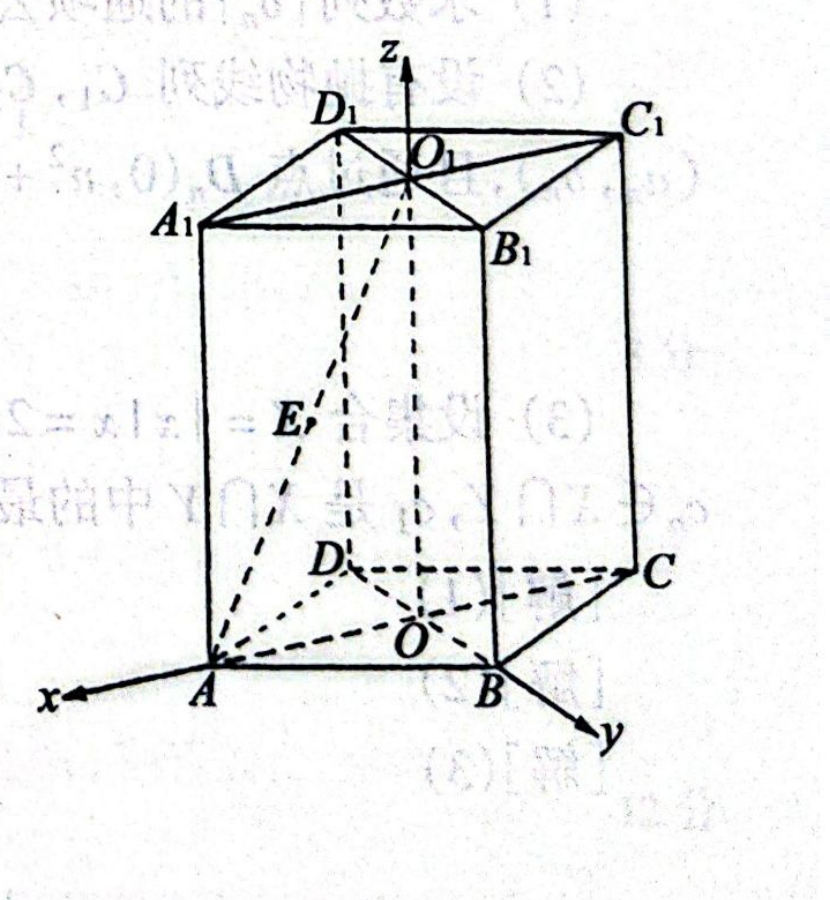
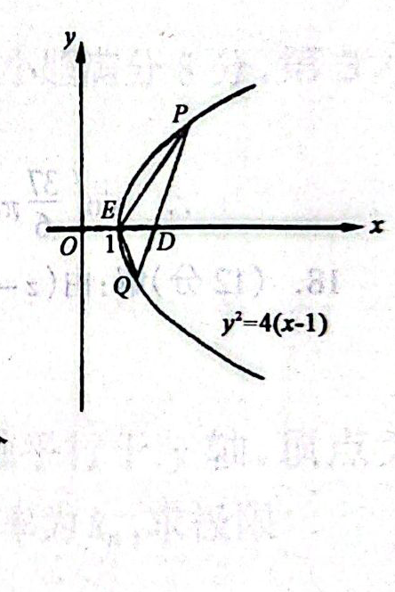

# 1998年上海卷（理）

## 填空题

### 第 1 题

$\lg20 + \log_{100}25 =$＿＿＿＿＿＿.

#### 答案

$2$

#### 解析

由换底公式，$\log_{100}25=\dfrac{\lg25}{\lg100}=\lg5$，所以 $\lg20+\log_{100}25=\lg20+\lg5=\lg100=2$.

### 第 2 题

若函数 $y = 2\sin x + \sqrt{a} \cos x + 4$ 的最小值为 $1$，则 $a=$＿＿＿＿＿＿.

#### 答案

$5$

#### 解析

因为 $2\sin x+\sqrt{a}\cos x$ 的振幅为 $\sqrt{2^2+(\sqrt{a})^2}=\sqrt{a+4}$，所以函数的最小值为 $4-\sqrt{a+4}$. 由题意，$4-\sqrt{a+4}=1$，得 $\sqrt{a+4}=3$，故 $a=5$.

### 第 3 题

若 $\displaystyle\lim_{x\to 1}\frac{x^{2}+ax+3}{x^{3}+3}=2$，则 $a=$＿＿＿＿＿＿.

#### 答案

$4$

#### 解析

当 $x=1$ 时分母 $x^3+3=4\ne0$，因此该有理函数在 $x=1$ 处连续，极限等于函数值，即 $\dfrac{1+a+3}{1+3}=2$. 解得 $a=4$.

### 第 4 题

函数 $f(x)=(x-1)^{\frac{1}{3}}+2$ 的反函数是 $f^{-1}(x)=$＿＿＿＿＿＿.

#### 答案

$(x-2)^3+1$，$x\in\mathbb{R}$

#### 解析

设 $y=f(x)=(x-1)^{\frac13}+2$，则 $y-2=(x-1)^{\frac13}$，两边立方得 $x=(y-2)^3+1$. 因为立方函数在 $\mathbb{R}$ 上一一对应，所以交换自变量与因变量后，$f^{-1}(x)=(x-2)^3+1$，且 $x\in\mathbb{R}$.

### 第 5 题

棱长为 $2$ 的正四面体的体积为＿＿＿＿＿＿.

#### 答案

$\frac{2\sqrt{2}}{3}$

#### 解析

取正四面体的一个面为底面，则底面是边长为 $2$ 的正三角形，面积为 $S=\dfrac{\sqrt3}{4}\cdot2^2=\sqrt3$. 正三角形的中心到顶点的距离为 $\dfrac{2\sqrt3}{3}$，所以正四面体的高为 $h=\sqrt{2^2-\left(\dfrac{2\sqrt3}{3}\right)^2}=\dfrac{2\sqrt6}{3}$. 因而体积为 $V=\dfrac13Sh=\dfrac13\cdot\sqrt3\cdot\dfrac{2\sqrt6}{3}=\dfrac{2\sqrt2}{3}$.

### 第 6 题

以直角坐标系的原点 $O$ 为极点，$x$ 轴的正半轴为极轴建立极坐标系，若椭圆两焦点的极坐标分别是 $\left(1, \frac{\pi}{2}\right)$， $\left(1, \frac{3\pi}{2}\right)$，长轴长是 $4$，则此椭圆的直角坐标方程是＿＿＿＿＿＿.

#### 答案

$\frac{x^2}{3}+\frac{y^2}{4}=1$

#### 解析

两个焦点的极坐标分别为 $\left(1,\frac{\pi}{2}\right)$、$\left(1,\frac{3\pi}{2}\right)$，化为直角坐标得焦点为 $F_1(0,1)$、$F_2(0,-1)$，所以焦半距 $c=1$. 长轴长为 $4$，故半长轴 $a=2$，再由 $b^2=a^2-c^2$ 得 $b^2=3$. 因为焦点在 $y$ 轴上，椭圆方程为 $\dfrac{x^2}{3}+\dfrac{y^2}{4}=1$.

### 第 7 题

袋内装有大小相同的 $4$ 个白球和 $3$ 个黑球，从中任意摸出 $3$ 个球，其中只有一个黑球的概率是＿＿＿＿＿＿.

#### 答案

$\frac{18}{35}$

#### 解析

从 $7$ 个球中任取 $3$ 个的基本事件数为 $\mathrm C_7^3$. 恰有一个黑球时，先从 $3$ 个黑球中取 $1$ 个，再从 $4$ 个白球中取 $2$ 个，事件数为 $\mathrm C_3^1\mathrm C_4^2$. 因此所求概率为 $\dfrac{\mathrm C_3^1\mathrm C_4^2}{\mathrm C_7^3}=\dfrac{18}{35}$.

### 第 8 题

函数

$$

y=\begin{cases}
2x+3,&x\leqslant0\\
x+3,&0<x\leqslant1\\
-x+5,&x>1
\end{cases}

$$

的最大值是＿＿＿＿＿＿.

#### 答案

$4$

#### 解析

当 $x\leqslant0$ 时，$y=2x+3\leqslant3$，且在 $x=0$ 时取到 $3$；当 $0<x\leqslant1$ 时，$y=x+3\leqslant4$，且在 $x=1$ 时取到 $4$；当 $x>1$ 时，$y=-x+5<4$. 三段合并可知函数的最大值为 $4$.

### 第 9 题

设 $n$ 是一个自然数，$\left(1+\frac{x}{n}\right)^{n}$ 的展开式中 $x^{3}$ 的系数为 $\frac{1}{16}$，则 $n=$＿＿＿＿＿＿.

#### 答案

$4$

#### 解析

当 $n<3$ 时展开式中没有 $x^3$ 项，所以由题设知 $n\geqslant3$. 根据二项式定理，$x^3$ 的系数为 $\mathrm C_n^3\left(\dfrac1n\right)^3=\dfrac{(n-1)(n-2)}{6n^2}$. 因而 $\dfrac{(n-1)(n-2)}{6n^2}=\dfrac1{16}$，即 $5n^2-24n+16=0$. 解得 $n=4$ 或 $n=\dfrac45$，由于 $n$ 是自然数，故 $n=4$.

### 第 10 题

在数列 $\{a_{n}\}$ 和 $\{b_{n}\}$ 中， $a_{1}=2$，且对任意自然数 $n$， $3a_{n+1}-a_{n}=0$， $b_{n}$ 是 $a_{n}$ 与 $a_{n+1}$ 的等差中项，则 $\{b_{n}\}$ 的各项和是＿＿＿＿＿＿.

#### 答案

$2$

#### 解析

由 $3a_{n+1}-a_n=0$ 得 $a_{n+1}=\dfrac13a_n$，结合 $a_1=2$ 可得 $a_n=\dfrac{2}{3^{n-1}}$. 因为 $b_n$ 是 $a_n$ 与 $a_{n+1}$ 的等差中项，所以 $b_n=\dfrac{a_n+a_{n+1}}2=\dfrac{4}{3^n}$. 因此 $\{b_n\}$ 是首项 $\dfrac43$、公比 $\dfrac13$ 的等比数列，各项和为 $\dfrac{\frac43}{1-\frac13}=2$.

### 第 11 题

函数 $f(x)=a^{x}$（$a>0$，$a\neq1$）在 $[1,2]$ 中的最大值比最小值大 $\frac{a}{2}$，则 $a$ 的值为＿＿＿＿＿＿.

#### 答案

$\frac{1}{2}$ 或 $\frac{3}{2}$

#### 解析

若 $a>1$，则 $a^x$ 在 $[1,2]$ 上递增，最大值与最小值分别为 $a^2$、$a$. 由 $a^2-a=\dfrac a2$，且 $a>0$，得 $a=\dfrac32$. 若 $0<a<1$，则 $a^x$ 在 $[1,2]$ 上递减，最大值与最小值分别为 $a$、$a^2$. 由 $a-a^2=\dfrac a2$ 得 $a=\dfrac12$. 两个值都满足题设条件，故 $a=\dfrac12$ 或 $a=\dfrac32$.

## 单选题

### 第 12 题

下列函数中，周期为 $\frac{\pi}{2}$ 的偶函数是（）

A.  
$y = \sin 4x$

B.  
$y = \cos^{2}2x - \sin^{2}2x$

C.  
$y = \tan 2x$

D.  
$y = \cos 2x$

#### 答案

B

#### 解析

选项 A 的函数 $\sin4x$ 是奇函数，不符合偶函数条件；选项 B 中 $\cos^22x-\sin^22x=\cos4x$，它是偶函数，最小正周期为 $\dfrac\pi2$. 选项 C 的函数 $\tan2x$ 虽然周期为 $\dfrac\pi2$，但它是奇函数；选项 D 的函数 $\cos2x$ 是偶函数，但其最小正周期为 $\pi$，且 $f\left(x+\dfrac\pi2\right)=-f(x)$. 因此选 B.

### 第 13 题

若 $0 < a < 1$，则函数 $y = \log_{a}(x + 5)$ 的图象不经过（）

A.  
第一象限

B.  
第二象限

C.  
第三象限

D.  
第四象限

#### 答案

A

#### 解析

函数的定义域为 $x>-5$. 因为 $0<a<1$，对数函数 $y=\log_a u$ 在 $u>0$ 上递减. 当 $x>0$ 时，$x+5>1$，从而 $y=\log_a(x+5)<0$，所以图象不可能有第一象限内的点. 另一方面，取 $-5<x<-4$ 时有 $x<0$、$0<x+5<1$，故 $y>0$，图象经过第二象限；取 $-4<x<0$ 时图象经过第三象限；取 $x>0$ 时图象经过第四象限. 因此选 A.

### 第 14 题

在下列命题中，假命题是（）

A.  
若平面 $\alpha$ 内的一条直线 $l$ 垂直于平面 $\beta$ 内的任一直线，则 $\alpha \perp \beta$

B.  
若平面 $\alpha$ 内的任一直线平行于平面 $\beta$，则 $\alpha \parallel \beta$

C.  
若平面 $\alpha \perp \beta$，任取直线 $l \subset \alpha$，则必有 $l \perp \beta$

D.  
若平面 $\alpha \parallel \beta$，任取直线 $l \subset \alpha$，则必有 $l \parallel \beta$

#### 答案

C

#### 解析

选项 A 中，直线 $l$ 垂直于平面 $\beta$ 内的任一直线，因而垂直于其中两条相交直线，所以 $l\perp\beta$，又 $l\subset\alpha$，可得 $\alpha\perp\beta$. 选项 B 中，若平面 $\alpha$ 内的任一直线都平行于平面 $\beta$，则 $\alpha$ 与 $\beta$ 没有公共点，故 $\alpha\parallel\beta$. 选项 D 由平面平行的性质直接成立. 对于第三个选项，若 $\alpha\perp\beta$，取 $l=\alpha\cap\beta$，则 $l\subset\alpha$ 且 $l\subset\beta$，显然不可能有 $l\perp\beta$. 因此第三个选项为假命题，选 C.

### 第 15 题

设全集为 $\mathbb{R}$，$A = \{x \mid x^2 - 5x - 6 > 0\}$，$B = \{x \mid |x - 5| < a\}$（$a$ 是常数），且 $11 \in B$，则（）

A.  
$\overline{A} \cup B = \mathbb{R}$

B.  
$A \cup \overline{B} = \mathbb{R}$

C.  
$\overline{A}\cup\overline{B} = \mathbb{R}$

D.  
$A \cup B = \mathbb{R}$

#### 答案

D

#### 解析

由 $x^2-5x-6=(x+1)(x-6)$，得 $A=(-\infty,-1)\cup(6,\infty)$. 又因为 $11\in B$，所以 $|11-5|=6<a$，即 $a>6$，从而 $B=(5-a,5+a)$，其中 $5-a<-1$、$5+a>6$. 因此 $[-1,6]\subset B$，所以 $A\cup B=\mathbb{R}$，选项 D 正确.

选项 A 不正确，因为任取 $x>5+a$，都有 $x\notin\overline A\cup B$；选项 B 不正确，例如 $x=0$ 不属于 $A\cup\overline B$；选项 C 不正确，例如 $x=7$ 同时属于 $A$ 和 $B$，所以不属于 $\overline A\cup\overline B$. 故选 D.

### 第 16 题

设 $a$，$b$，$c$ 分别是 $\triangle ABC$ 中 $\angle A$，$\angle B$，$\angle C$ 所对边的边长，则直线 $\sin A \cdot x + ay + c = 0$ 与 $bx - \sin B \cdot y + \sin C = 0$ 的位置关系是（）

A.  
平行

B.  
重合

C.  
垂直

D.  
相交但不垂直

#### 答案

C

#### 解析

由正弦定理，$\dfrac{a}{\sin A}=\dfrac{b}{\sin B}$，即 $a\sin B=b\sin A$. 两条直线的方向向量分别可取 $\bs u_1=(a,-\sin A)$、$\bs u_2=(\sin B,b)$，且 $\bs u_1\cdot\bs u_2=a\sin B-b\sin A=0$. 因而两条直线互相垂直，选 C.

## 解答题

### 第 17 题

设 $\alpha$ 是第二象限角，$\sin \alpha = \frac{3}{5}$，求 $\sin \left(\frac{37}{6} \pi - 2\alpha\right)$ 的值.

#### 解析

因为 $\alpha$ 是第二象限角，$\sin\alpha=\frac{3}{5}$，所以 $\cos\alpha=-\frac{4}{5}$.

于是 $\sin2\alpha=2\sin\alpha\cos\alpha=-\frac{24}{25}$，$\cos2\alpha=1-2\sin^2\alpha=\frac{7}{25}$. 所以

$$

\sin\left(\frac{37}{6}\pi-2\alpha\right)
=\sin\left(\frac{\pi}{6}-2\alpha\right)
=\sin\frac{\pi}{6}\cos2\alpha-\cos\frac{\pi}{6}\sin2\alpha
=\frac{7+24\sqrt{3}}{50}

$$

### 第 18 题

已知向量 $\overrightarrow{OZ}$ 所表示的复数 $z$ 满足 $(z - 2)\i = 1 + \i$，将 $\overrightarrow{OZ}$ 绕原点 $O$ 按顺时针方向旋转 $\frac{\pi}{4}$ 得 $\overrightarrow{OZ'}$，设 $\overrightarrow{OZ'}$ 所表示的复数为 $z'$，求复数 $z' + \sqrt{2}\i$ 的辐角主值.

#### 解析

由 $(z-2)\i=1+\i$ 得 $z=\frac{1+\i}{\i}+2=3-\i$. 于是

$$

z'=z\left[\cos\left(-\frac{\pi}{4}\right)+\i\sin\left(-\frac{\pi}{4}\right)\right]
=(3-\i)\left(\frac{\sqrt{2}}{2}-\frac{\sqrt{2}}{2}\i\right)
=\sqrt{2}-2\sqrt{2}\i

$$

所以

$$

z'+\sqrt{2}\i=\sqrt{2}-\sqrt{2}\i
=2\left(\frac{\sqrt{2}}{2}-\frac{\sqrt{2}}{2}\i\right)

$$

设 $z'+\sqrt{2}\i$ 的辐角主值为 $\theta$，则 $\cos\theta=\frac{\sqrt{2}}{2}$，$\sin\theta=-\frac{\sqrt{2}}{2}$，且 $\theta\in[0,2\pi)$，所以 $\theta=\frac{7\pi}{4}$. 因而 $\arg(z'+\sqrt{2}\i)=\frac{7\pi}{4}$.

### 第 19 题

直四棱柱 $ABCD - A_{1}B_{1}C_{1}D_{1}$ 的高为 $6$，底面是边长为 $4$， $\angle DAB = 60^{\circ}$ 的菱形，$AC$ 与 $BD$ 相交于 $O$， $A_{1}C_{1}$ 与 $B_{1}D_{1}$ 相交于 $O_{1}$，$E$ 是 $O_{1}A$ 的中点.

1.  求二面角 $O_{1}-BC-D$ 的大小（用反三角函数表示）.

2.  分别以射线 $OA$，$OB$，$OO_{1}$ 为 $x$ 轴，$y$ 轴，$z$ 轴的正半轴建立空间直角坐标系，求点 $B_{1}$，$D_{1}$，$E$ 的坐标，并求异面直线 $OB_{1}$ 与 $D_{1}E$ 所成角的大小（用反三角函数表示）.

#### 解析

1.  因为 $DD_{1}\perp$ 底面 $ABCD$，$O_{1}O\parallel D_{1}D$，所以 $O_{1}O\perp$ 底面 $ABCD$.

    过 $O$ 作 $OF\perp BC$，垂足为 $F$，连接 $O_{1}F$，根据三垂线定理得 $O_{1}F\perp BC$，所以 $\angle O_{1}FO$ 是二面角 $O_{1}-BC-D$ 的平面角.

    因为菱形的两条对角线互相垂直平分，且 $AC=2\cdot4\cos30^\circ=4\sqrt{3}$、$BD=2\cdot4\sin30^\circ=4$，所以 $OC=OA=2\sqrt{3}$、$OB=OD=2$，并且 $BC=4$. 因而

$$

OF=\frac{OC\cdot OB}{BC}=\sqrt{3}

$$

    于是

$$

\tan\angle O_{1}FO=\frac{6}{\sqrt{3}}=2\sqrt{3}

$$

    所以二面角 $O_{1}-BC-D$ 的大小为 $\arctan 2\sqrt{3}$.

2.  取 $O$ 为原点，按题意取射线 $OA$、$OB$、$OO_1$ 分别为三个坐标轴的正半轴，则 $O(0,0,0)$、$A(2\sqrt{3},0,0)$、$B(0,2,0)$、$D(0,-2,0)$. 由于棱柱高为 $6$，有 $O_1(0,0,6)$、$B_1(0,2,6)$、$D_1(0,-2,6)$. 又 $E$ 是 $O_1A$ 的中点，所以 $E(\sqrt{3},0,3)$. 于是 $\overrightarrow{OB_{1}}=(0,2,6)$，$\overrightarrow{D_{1}E}=(\sqrt{3},2,-3)$. 记异面直线 $OB_{1}$ 与 $D_{1}E$ 所成的角为 $\alpha$，则

$$

\cos\alpha=\frac{|\overrightarrow{OB_{1}}\cdot\overrightarrow{D_{1}E}|}{|\overrightarrow{OB_{1}}|\cdot|\overrightarrow{D_{1}E}|}
    =\frac{7\sqrt{10}}{40}

$$

    由此可得异面直线 $OB_{1}$ 与 $D_{1}E$ 所成的角为 $\arccos\frac{7\sqrt{10}}{40}$.

### 第 20 题

1.  动直线 $y = a$ 与抛物线 $y^{2} = \frac{1}{2}(x - 2)$ 相交于 $A$ 点，动点 $B$ 的坐标是 $(0, 3a)$，求线段 $AB$ 中点 $M$ 的轨迹 $C$ 的方程.

2.  过点 $D(2,0)$ 的直线 $l$ 交上述轨迹 $C$ 于 $P$，$Q$ 两点，$E$ 点坐标是 $(1,0)$，若 $\triangle EPQ$ 的面积为 $4$，求直线 $l$ 的倾斜角 $\alpha$ 的值.

#### 解析

1.  设 $M$ 的坐标为 $(x,y)$，由 $A$ 的坐标为 $(2a^{2}+2,a)$，$B$ 的坐标为 $(0,3a)$ 得

$$

\begin{cases}
    x=a^{2}+1,\\
    y=2a
    \end{cases}

$$

    所以轨迹 $C$ 的方程为 $x=\frac{y^{2}}{4}+1$，即 $y^{2}=4(x-1)$.

2.  若 $l$ 为竖直直线，则 $l$ 的方程为 $x=2$，与抛物线的交点为 $P(2,2)$、$Q(2,-2)$，此时 $S_{\triangle EPQ}=\dfrac12\cdot4\cdot1=2\ne4$，故竖直直线不是所求直线. 于是可设 $l$ 的方程为 $y=k(x-2)$，且因 $l$ 与抛物线有两个交点，故 $k\neq0$.

    由 $y=k(x-2)$ 得 $x=\frac{y}{k}+2$，代入 $y^{2}=4(x-1)$，得

$$

y^{2}-\frac{4}{k}y-4=0

$$

    且 $\Delta=\frac{16}{k^{2}}+16>0$ 恒成立. 记这个方程的两实根为 $y_{1}$，$y_{2}$，则

$$

|PQ|=\sqrt{1+\frac{1}{k^{2}}}|y_{1}-y_{2}|
    =\sqrt{1+\frac{1}{k^{2}}}\sqrt{(y_{1}+y_{2})^{2}-4y_{1}y_{2}}
    =\frac{4(k^{2}+1)}{k^{2}}

$$

    又点 $E$ 到直线 $l$ 的距离

$$

d=\frac{|k\cdot1-0-2k|}{\sqrt{k^{2}+1}}=\frac{|k|}{\sqrt{k^{2}+1}}

$$

    所以

$$

S_{\triangle EPQ}=\frac{1}{2}|PQ|\cdot d=\frac{2\sqrt{k^{2}+1}}{|k|}

$$

    由 $\frac{2\sqrt{k^{2}+1}}{|k|}=4$ 得 $k^{2}=\frac{1}{3}$，所以 $k=\pm\frac{\sqrt{3}}{3}$，故 $\alpha=\frac{\pi}{6}$ 或 $\frac{5\pi}{6}$.

### 第 21 题

设某物体一天中的温度 $T$ 是时间 $t$ 的函数： $T(t) = at^{3} + bt^{2} + ct + d$（$a \neq 0$），其中温度的单位是 $^{\circ}\mathrm{C}$，时间的单位是小时，$t = 0$ 表示 $12{:}00$，$t$ 取正值表示 $12{:}00$ 以后. 若测得该物体在 $8{:}00$ 的温度为 $8\mathrm{~^{\circ}C}$，$12{:}00$ 的温度为 $60\mathrm{~^{\circ}C}$，$13{:}00$ 的温度为 $58\mathrm{~^{\circ}C}$，且已知该物体的温度在 $8{:}00$ 和 $16{:}00$ 有相同的变化率.

1.  写出该物体的温度 $T$ 关于时间 $t$ 的函数关系式.

2.  该物体在 $10{:}00$ 到 $14{:}00$ 这段时间中（包括 $10{:}00$ 和 $14{:}00$），何时温度最高，并求出最高温度.

3.  如果规定一个函数 $f(x)$ 在 $[x_1, x_2]$（$x_1 < x_2$）上函数值的平均为 $\frac{1}{x_2 - x_1} \int_{x_1}^{x_2} f(x) dx$，求该物体在 $8{:}00$ 到 $16{:}00$ 这段时间内的平均温度.

#### 解析

1.  由时间定义，$8{:}00$、$12{:}00$、$13{:}00$、$16{:}00$ 分别对应 $t=-4$，$0$，$1$，$4$. 因此 $T(0)=d=60$，$-64a+16b-4c+d=8$，$a+b+c+d=58$. 又 $T'(t)=3at^2+2bt+c$，由 $T'(-4)=T'(4)$ 得 $48a-8b+c=48a+8b+c$，所以 $b=0$. 代入前面的两个温度条件，得到 $a+c=-2$、$-64a-4c=-52$，解得 $a=1$、$c=-3$，故 $d=60$.

    因此，温度函数 $T(t)=t^{3}-3t+60$.

2.  $T'(t)=3t^{2}-3=3(t-1)(t+1)$.

    当 $t\in(-2,-1)\cup(1,2)$ 时，$T'(t)>0$；当 $t\in(-1,1)$ 时，$T'(t)<0$.

    所以，函数 $T(t)$ 在 $[-2,-1]$ 上单调递增，在 $[-1,1]$ 上单调递减，在 $[1,2]$ 上单调递增. 还需比较端点和临界点的函数值：$T(-2)=58$、$T(-1)=62$、$T(1)=58$、$T(2)=62$.

    由于 $T(-1)=T(2)=62$，所以在 $10{:}00$ 到 $14{:}00$ 这段时间中，该物体在 $11{:}00$ 和 $14{:}00$ 的温度最高，最高温度为 $62\mathrm{~^{\circ}C}$.

3.  根据定义，平均温度为

$$

\frac{1}{4-(-4)}\int_{-4}^{4}T(t)\,\mathrm{d}t
    =\frac{1}{8}\int_{-4}^{4}(t^{3}-3t+60)\,\mathrm{d}t
    =60

$$

    所以该物体在 $8{:}00$ 到 $16{:}00$ 这段时间内的平均温度为 $60\mathrm{~^{\circ}C}$.

### 第 22 题

若 $A_n$ 和 $B_n$ 分别表示数列 $\{a_n\}$ 和 $\{b_n\}$ 前 $n$ 项的和，对任意正整数 $n$，$a_n = -\frac{2n + 3}{2}$，$4B_n - 12A_n = 13n$.

1.  求数列 $\{b_n\}$ 的通项公式.

2.  设有抛物线列 $C_1$，$C_2$，$\cdots$，$C_n$，$\cdots$，抛物线 $C_n$（$n \in \mathbb{N}$）的对称轴平行于 $y$ 轴，顶点为 $(a_n, b_n)$，且通过点 $D_n(0, n^{2} + 1)$，过点 $D_n$ 且与抛物线 $C_n$ 相切的直线斜率为 $k_n$，求极限 $\displaystyle \lim_{n \to \infty} \frac{k_1 + k_2 + k_3 + \cdots + k_n}{a_n b_n}$.

3.  设集合 $X = \{x \mid x = 2a_n, n \in \mathbb{N}\}$，$Y = \{y \mid y = 4b_n, n \in \mathbb{N}\}$. 若等差数列 $\{c_n\}$ 的任一项 $c_n \in X \cap Y$，$c_1$ 是 $X \cap Y$ 中的最大数，且 $-265 < c_{10} < -125$，求 $\{c_n\}$ 的通项公式.

#### 解析

1.  当正整数 $n\geqslant2$ 时，由

$$

\begin{cases}
    4B_n-12A_n=13n,\\
    4B_{n-1}-12A_{n-1}=13(n-1)
    \end{cases}

$$

    相减得 $4b_n-12a_n=13$. 由 $a_n=-\frac{2n+3}{2}$ 得 $4b_n=12a_n+13=-12n-5$，所以 $b_n=-\frac{12n+5}{4}$. 又 $a_1=-\dfrac52$，且 $4b_1-12a_1=13$，可得 $b_1=-\frac{17}{4}$，与上式在 $n=1$ 时一致. 因此 $\{b_n\}$ 的通项公式是 $b_n=-\frac{12n+5}{4}$.

2.  设抛物线 $C_n$ 的方程为

$$

y=a\left(x+\frac{2n+3}{2}\right)^2-\frac{12n+5}{4}

$$

    因为 $D_n(0,n^{2}+1)$ 在此抛物线上，所以 $n^2+1=a\left(\dfrac{2n+3}{2}\right)^2-\dfrac{12n+5}{4}$. 注意到 $n^2+1+\dfrac{12n+5}{4}=\dfrac{(2n+3)^2}{4}$，故 $a=1$，因此 $C_n$ 的方程为

$$

y=\left(x+\frac{2n+3}{2}\right)^2-\frac{12n+5}{4}

$$

    因此，$C_n$ 的方程为

$$

y=x^2+(2n+3)x+n^2+1

$$

    所以 $y'=2x+(2n+3)$， 于是 $D_n$ 处切线斜率 $k_n=2n+3$. 因此

$$

\lim_{n\to\infty}\frac{k_1+k_2+k_3+\cdots+k_n}{a_nb_n}
    =\lim_{n\to\infty}\frac{n^2+4n}{\left(-n-\frac{3}{2}\right)\left(-3n-\frac{5}{4}\right)}
    =\frac{1}{3}

$$

3.  对任意正整数 $n$，$2a_n=-2n-3$，$4b_n=-12n-5=-2(6n+1)-3\in X$，所以 $Y\subseteq X$，故可得 $X\cap Y=Y$.

    $c_1$ 是 $X\cap Y$ 中的最大数，所以 $c_1=-17$. 设等差数列 $\{c_n\}$ 的公差为 $d$，则 $c_{10}=-17+9d$. 由 $-265<c_{10}<-125$，得 $-27\frac{5}{9}<d<-12$. 由于 $c_2\in Y$，设 $c_2=-12m-5$（$m\in\mathbb{N}$），则 $d=c_2-c_1=-12(m-1)$，所以 $d$ 是 $12$ 的非正整数倍. 结合 $-27\dfrac59<d<-12$，只能取 $d=-24$. 因此 $c_n=-17-24(n-1)=7-24n$（$n\in\mathbb{N}$）.
