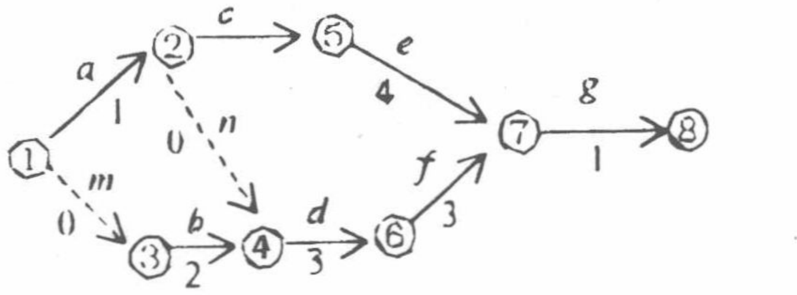
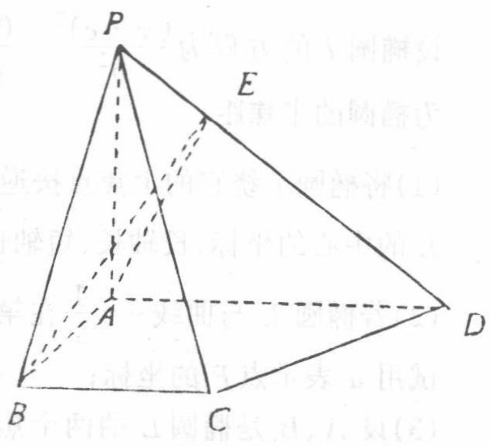
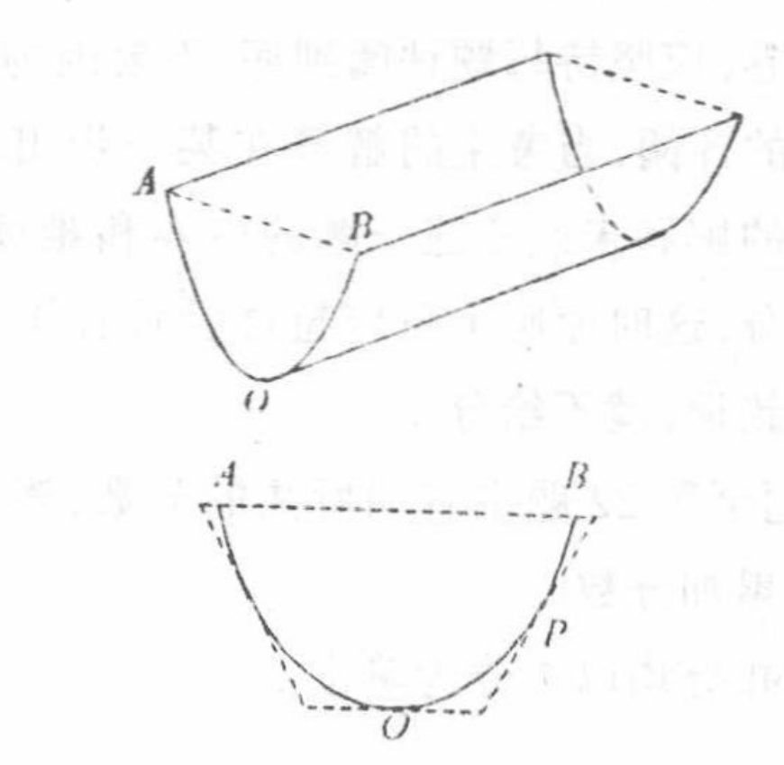

# 1999年上海卷（文）

## 填空题

### 第 1 题

$\tan\left[\arccos\frac{\sqrt{2}}{2}-\frac{\pi}{6}\right]=$＿＿＿＿＿＿.

#### 答案

$2-\sqrt{3}$

#### 解析

因为 $\arccos\frac{\sqrt{2}}{2}=\frac{\pi}{4}$，所以 $\tan\left[\arccos\frac{\sqrt{2}}{2}-\frac{\pi}{6}\right]=\tan\frac{\pi}{12}$. 由正切半角公式，$\tan\frac{\pi}{12}=\frac{1-\cos\frac{\pi}{6}}{\sin\frac{\pi}{6}}=2-\sqrt{3}$，故填 $2-\sqrt{3}$.

### 第 2 题

函数 $f(x)=\log_{2}x+1$（$x\geqslant4$）的反函数 $f^{-1}(x)$ 的定义域是＿＿＿＿＿＿.

#### 答案

$[3,+\infty)$

#### 解析

函数 $f(x)=\log_{2}x+1$ 在 $[4,+\infty)$ 上有定义且严格递增，其值域为 $[f(4),+\infty)=[3,+\infty)$. 反函数的定义域等于原函数的值域，所以填 $[3,+\infty)$.

### 第 3 题

在 $(x^{3}+\frac{2}{x^{2}})^{5}$ 的展开式中，含 $x^{5}$ 项的系数为＿＿＿＿＿＿.

#### 答案

$40$

#### 解析

展开式中取 $\frac{2}{x^{2}}$ 恰好 $r$ 次所得项为 $\mathrm C_{5}^{r}(x^{3})^{5-r}\left(\frac{2}{x^{2}}\right)^{r}=\mathrm C_{5}^{r}2^{r}x^{15-5r}$. 令幂指数 $15-5r=5$，得 $r=2$，所以所求系数为 $\mathrm C_{5}^{2}2^{2}=40$.

### 第 4 题

在$\triangle ABC$中，若$\angle B=30^{\circ}$，$AB=2\sqrt{3}$，$AC=2$，则$\triangle ABC$的面积 $S$ 是＿＿＿＿＿＿.

#### 答案

$2\sqrt{3}$ 或 $\sqrt{3}$

#### 解析

由正弦定理，$\dfrac{AC}{\sin B}=\dfrac{2}{\sin30^{\circ}}=4$，因此 $\sin C=\dfrac{AB}{4}=\dfrac{\sqrt{3}}{2}$. 于是 $C=60^{\circ}$ 或 $120^{\circ}$，相应地 $A=90^{\circ}$ 或 $30^{\circ}$. 由面积公式 $S=\frac12 AB\cdot AC\sin A=2\sqrt{3}\sin A$，故 $S=2\sqrt{3}$ 或 $\sqrt{3}$.

### 第 5 题

若平移坐标系，将曲线方程 $y^{2} + 4x - 4y - 4 = 0$ 化为标准方程，则坐标原点应移到点 $O'(\underline{\qquad\qquad},\underline{\qquad\qquad})$.

#### 答案

$(2,2)$

#### 解析

配方得 $y^{2}-4y+4+4x-8=0$，即 $(y-2)^{2}=-4(x-2)$. 令新坐标为 $X=x-2$，$Y=y-2$，方程化为 $Y^{2}=-4X$，所以新坐标原点在原坐标中的坐标为 $O'(2,2)$.

### 第 6 题

函数 $y = 2\sin x \cos x - 2\sin^{2}x + 1$ 的最小正周期 $T=$＿＿＿＿＿＿.

#### 答案

$\pi$

#### 解析

利用倍角公式，$2\sin x\cos x=\sin2x$，且 $1-2\sin^{2}x=\cos2x$，所以 $y=\sin2x+\cos2x=\sqrt2\sin\left(2x+\frac{\pi}{4}\right)$. 该函数的角频率为 $2$，故最小正周期为 $\dfrac{2\pi}{2}=\pi$.

### 第 7 题

函数 $y = 2\sin(2x + \frac{\pi}{6})$（$x \in [-\pi, 0]$）的单调递减区间是＿＿＿＿＿＿.

#### 答案

$\left(-\frac{5\pi}{6},-\frac{\pi}{3}\right)$

#### 解析

函数在导数为负处递减. 由 $y'=4\cos\left(2x+\frac{\pi}{6}\right)$，得递减条件为 $\frac{\pi}{2}+2k\pi<2x+\frac{\pi}{6}<\frac{3\pi}{2}+2k\pi$. 在 $x\in[-\pi,0]$ 内只有 $k=-1$ 的区间有交集，故 $-\frac{3\pi}{2}<2x+\frac{\pi}{6}< -\frac{\pi}{2}$，解得 $-\frac{5\pi}{6}<x< -\frac{\pi}{3}$. 所以填 $\left(-\frac{5\pi}{6},-\frac{\pi}{3}\right)$.

### 第 8 题

某工程的工序流程图如下（工时单位：天）， 现已知工程总时数为 $10\text{ 天}$，则工序 $c$ 所需工时为＿＿＿＿＿＿.

#### 答案

$4$

#### 解析

从起点到终点的各条路径所需时间分别为 $1+c+4+1=c+6$、$1+0+3+3+1=8$ 和 $0+2+3+3+1=9$. 工程总时数是各路径时间的最大值，因此 $\max\{c+6,8,9\}=10$，从而 $c+6=10$，解得 $c=4$.

### 第 9 题

$\frac{\log_{3}2}{\log_{27}64}=$＿＿＿＿＿＿.

#### 答案

$\frac{1}{2}$

#### 解析

由换底公式，$\log_{3}2=\dfrac{\ln2}{\ln3}$，而 $\log_{27}64=\dfrac{\ln64}{\ln27}=\dfrac{6\ln2}{3\ln3}=2\dfrac{\ln2}{\ln3}$. 因此原式等于 $\dfrac{\ln2/\ln3}{2\ln2/\ln3}=\frac12$.

### 第 10 题

在等差数列 $\{a_{n}\}$ 中满足 $3a_{4}=7a_{7}$，且 $a_{1}>0$，$S_{n}$ 是数列 $\{a_{n}\}$ 前 $n$ 项的和. 若 $S_{n}$ 取得最大值，则 $n=$＿＿＿＿＿＿.

#### 答案

$9$

#### 解析

设公差为 $d$，则 $a_{4}=a_{1}+3d$，$a_{7}=a_{1}+6d$. 由题设 $3(a_{1}+3d)=7(a_{1}+6d)$，得 $d=-\frac{4}{33}a_{1}<0$. 于是 $a_{9}=a_{1}+8d=\frac{1}{33}a_{1}>0$，而 $a_{10}=a_{1}+9d=-\frac{1}{11}a_{1}<0$. 因为数列递减，所以 $a_1$，$\ldots$，$a_9>0$，而 $a_{10}$，$a_{11}$，$\ldots<0$. 又 $S_{n+1}-S_n=a_{n+1}$，故 $S_n$ 在 $n=9$ 时由增转减，最大值对应 $n=9$.

### 第 11 题

若以连续掷两次骰子分别得到的点数 $m$，$n$ 作为点 $P$ 的坐标，则点 $P$ 落在圆 $x^{2} + y^{2} = 16$ 内的概率是＿＿＿＿＿＿.

#### 答案

$\frac{2}{9}$

#### 解析

两次掷骰子的有序结果共有 $6\times6=36$ 个，且等可能. 条件为 $m^{2}+n^{2}<16$. 当 $m=1$ 时，$n=1$，$2$，$3$；当 $m=2$ 时，$n=1$，$2$，$3$；当 $m=3$ 时，$n=1$，$2$；当 $m\geq4$ 时无满足条件的结果，共有 $3+3+2=8$ 个. 因此所求概率为 $\dfrac{8}{36}=\dfrac{2}{9}$.

### 第 12 题

若四面体各棱的长是 $1$ 或 $2$，且该四面体不是正四面体，则其体积的值是（只需写出一个可能的值）＿＿＿＿＿＿.

#### 答案

$\frac{\sqrt{11}}{12}$；$\frac{\sqrt{14}}{12}$；$\frac{\sqrt{11}}{6}$（三者中的任一个）

#### 解析

构造一个底面为边长 $2$ 的等边三角形 $ABC$，取 $A=(0,0,0)$，$B=(2,0,0)$，$C=(1,\sqrt3,0)$，再取 $D=\left(\frac14,\frac{1}{4\sqrt3},\frac{\sqrt{33}}{6}\right)$. 由坐标距离公式， $AB^{2}=BC^{2}=CA^{2}=4$，$DA^{2}=\frac1{16}+\frac1{48}+\frac{33}{36}=1$， $DB^{2}=\frac{49}{16}+\frac1{48}+\frac{33}{36}=4$， $DC^{2}=\frac9{16}+\frac{121}{48}+\frac{33}{36}=4$. 因而 $AB=BC=CA=DB=DC=2$，$DA=1$，六条棱长都为 $1$ 或 $2$，且不是正四面体. 底面面积为 $\sqrt3$，高为 $\frac{\sqrt{33}}{6}$，故体积为 $V=\frac13\cdot\sqrt3\cdot\frac{\sqrt{33}}{6}=\frac{\sqrt{11}}{6}$. 这就是一个满足条件的可能值.

## 单选题

### 第 13 题

直线 $y=\frac{\sqrt{3}}{3}x$ 绕原点按逆时针方向旋转 $30^{\circ}$ 后所得直线与圆 $(x-2)^{2}+y^{2}=3$ 的位置关系是（）

A.  
直线过圆心

B.  
直线与圆相交，但不过圆心

C.  
直线与圆相切

D.  
直线与圆没有公共点

#### 答案

C

#### 解析

原直线的倾斜角为 $30^{\circ}$，逆时针旋转 $30^{\circ}$ 后的倾斜角为 $60^{\circ}$，所以旋转后的直线为 $y=\sqrt3x$. 圆心为 $(2,0)$，半径为 $\sqrt3$，圆心到该直线的距离为 $\dfrac{|\sqrt3\cdot2|}{\sqrt{(\sqrt3)^2+(-1)^2}}=\sqrt3$. 该距离等于半径，且圆心不在直线上，所以直线与圆相切，选 C.

### 第 14 题

下列以 $t$ 为参数的参数方程所表示的曲线中，与方程 $xy = 1$ 所表示的曲线完全一致的是（）

A.  

$$

\begin{cases}
        x=t^{\frac{1}{2}},\\
        y=t^{-\frac{1}{2}}
    \end{cases}

$$

B.  

$$

\begin{cases}
        x=|t|,\\
        y=\frac{1}{|t|}
    \end{cases}

$$

C.  

$$

\begin{cases}
        x=\cos t,\\
        y=\sec t
    \end{cases}

$$

D.  

$$

\begin{cases}
        x=\tan t,\\
        y=\cot t
    \end{cases}

$$

#### 答案

D

#### 解析

第一种参数方程为了使 $x=t^{1/2}$ 和 $y=t^{-1/2}$ 为实数且有定义，必须有 $t>0$，只得到第一象限的部分. 第二种参数方程中 $x=|t|>0$，同样只得到第一象限的部分. 第三种参数方程虽满足 $xy=1$，但 $|x|=|\cos t|\leq1$，不能得到双曲线上的全部点. 第四种参数方程在 $\tan t$ 和 $\cot t$ 有定义时，$xy=\tan t\cot t=1$，且 $\tan t$ 的值域为全部非零实数，故得到所有 $x\ne0$ 且 $y=1/x$ 的点，曲线完全一致，选 D.

### 第 15 题

若 $a < b < 0$，则下列结论中正确的是（）

A.  
不等式

$$

\frac{1}
    {a} > \frac{1}
    {b}

$$

和

$$

\frac{1}
    {|a|} > \frac{1}{|b|}

$$

均不能成立

B.  
不等式 $\frac{1}{a - b} > \frac{1}{a}$ 和 $\frac{1}{|a|} > \frac{1}{|b|}$ 均不能成立

C.  
不等式 $\frac{1}{a - b} > \frac{1}{a}$ 和 $(a + \frac{1}{b})^2 > (b + \frac{1}{a})^2$ 均不能成立

D.  
不等式 $\frac{1}{|a|} > \frac{1}{|b|}$ 和 $(a + \frac{1}{b})^2 > (b + \frac{1}{a})^2$ 均不能成立

#### 答案

B

#### 解析

因为 $a<b<0$，取倒数时不等号反向，得 $\frac1a>\frac1b$. 又 $|a|>|b|$，所以 $\frac1{|a|}<\frac1{|b|}$，第二个不等式不能成立. 还因为 $a-b<0$ 且 $a<a-b$，所以 $\frac1a>\frac1{a-b}$，即 $\frac1{a-b}>\frac1a$ 不能成立. 因此第二个选项中的两个不等式均不能成立.

为排除其余选项，取 $a=-3$，$b=-2$，则 $\left(a+\frac1b\right)^2=\frac{49}{4}>\frac{49}{9}=\left(b+\frac1a\right)^2$，故第三、第四个选项中的第二个不等式并非均不能成立；而第一个选项中的第一个不等式可以成立. 因此正确选项为 B.

### 第 16 题

设有直线 $m$，$n$ 和平面 $\alpha$， $\beta$，则在下列命题中，正确的是（）

A.  
若 $m \parallel n, m \subset \alpha, n \subset \beta$，则 $\alpha \parallel \beta$

B.  
若 $m \perp \alpha$，$m \perp n$，$n \subset \beta$，则 $\alpha \parallel \beta$

C.  
若 $m \parallel n$，$n \perp \beta$，$m \subset \alpha$，则 $\alpha \perp \beta$

D.  
若 $m \parallel n$，$m \perp \alpha$，$n \perp \beta$，则 $\alpha \perp \beta$

#### 答案

C

#### 解析

由 $n\perp\beta$ 且 $m\parallel n$，可知 $m\perp\beta$. 又 $m\subset\alpha$，平面 $\alpha$ 含有一条垂直于平面 $\beta$ 的直线，所以 $\alpha\perp\beta$，故第三个命题正确.

第一个命题不成立. 例如取 $\alpha:z=0$、$\beta:y=1$，并取 $m=\{(t,0,0)\mid t\in\mathbb{R}\}$、$n=\{(t,1,0)\mid t\in\mathbb{R}\}$，则 $m\parallel n$，$m\subset\alpha$，$n\subset\beta$，但 $\alpha$ 与 $\beta$ 相交. 第二个命题也不成立. 例如取 $\alpha:z=0$、$\beta:y=0$，取 $m$ 为 $z$ 轴、$n$ 为 $x$ 轴，则 $m\perp\alpha$、$m\perp n$、$n\subset\beta$，但 $\alpha\perp\beta$，而非 $\alpha\parallel\beta$. 第四个命题中，两条平行且分别垂直于两个平面的直线只能说明两个平面的法向方向平行，两个平面可能平行或重合，不能推出垂直；例如取 $\alpha:z=0$、$\beta:z=1$，取两条互相平行的竖直直线 $m$，$n$，即可满足条件而 $\alpha\parallel\beta$. 因此选 C.

## 解答题

### 第 17 题

设集合 $A = \{x\mid |x - a| < 2\}$，$B = \{x\mid \frac{2x - 1}{x + 2} < 1\}$. 若 $A \subseteq B$，求实数 $a$ 的取值范围.

#### 解析

由 $|x-a|<2$，得 $a-2<x<a+2$，所以 $A=(a-2,a+2)$. 对于 $B$，先注意 $x\ne-2$，并化简不等式得 $\frac{2x-1}{x+2}<1\Longleftrightarrow\frac{x-3}{x+2}<0$. 临界点为 $-2$ 和 $3$，作符号判断可得 $-2<x<3$，所以 $B=(-2,3)$. 要使开区间 $(a-2,a+2)$ 包含于 $(-2,3)$，必须且只需 $a-2\geq-2$ 且 $a+2\leq3$. 因而 $0\leq a\leq1$.

### 第 18 题

设正数数列 $\{a_{n}\}$ 为一等比数列，且 $a_{2}=4$，$a_{4}=16$，求 $\displaystyle\lim\limits_{n\to\infty}\frac{\lg a_{n+1}+\lg a_{n+2}+\cdots+\lg a_{2n}}{n^{2}}$.

#### 解析

设公比为 $q$. 因为数列各项为正数，$q>0$，且 $q^{2}=\dfrac{a_{4}}{a_{2}}=4$，所以 $q=2$. 从而 $a_{1}=a_{2}/q=2$，即 $a_n=2^n$. 因此

$$

\frac{\lg a_{n+1}+\lg a_{n+2}+\cdots+\lg a_{2n}}{n^2}=\frac{(n+1)+(n+2)+\cdots+2n}{n^2}\lg2=\left(\frac32+\frac{1}{2n}\right)\lg2

$$

令 $n\to\infty$，得到

$$

\displaystyle\lim_{n\to\infty}\frac{\lg a_{n+1}+\lg a_{n+2}+\cdots+\lg a_{2n}}{n^2}=\frac32\lg2

$$

### 第 19 题

设复数 $z$ 满足 $4z + 2\overline{z} = 3+\sqrt{3} + \i$，$w = \sin\theta - \i\cos\theta$（$\theta \in \mathbb{R}$），求 $z$ 的值和 $|z - w|$ 的取值范围.

#### 解析

设 $z=u+v\i$，其中 $u$，$v\in\mathbb{R}$，则 $\overline z=u-v\i$. 代入题设得 $4(u+v\i)+2(u-v\i)=3+\sqrt3+\i$，即 $6u+2v\i=3+\sqrt3+\i$. 比较实部和虚部，得 $u=\frac{3+\sqrt3}{6}$，$v=\frac12$，所以 $z=\frac{3+\sqrt3}{6}+\frac12\i$.

记 $\rho=|z|$，则 $\rho^2=\left(\frac{3+\sqrt3}{6}\right)^2+\left(\frac12\right)^2=\frac{7+2\sqrt3}{12}$，即 $\rho=\sqrt{\frac{7+2\sqrt3}{12}}$. 又 $|w|=\sqrt{\sin^2\theta+\cos^2\theta}=1$，并且当 $\theta$ 取遍 $\mathbb{R}$ 时，$w$ 取遍单位圆上的所有点.

由 $7+2\sqrt3<12$ 可知 $\rho<1$. 再由三角不等式和逆三角不等式，$1-\rho\leq|z-w|\leq1+\rho$. 当 $w=z/\rho$ 时取下界，当 $w=-z/\rho$ 时取上界，这两个单位复数都可由某个 $\theta$ 取得. 因此 $|z-w|$ 的取值范围为 $\left[1-\sqrt{\frac{7+2\sqrt3}{12}},1+\sqrt{\frac{7+2\sqrt3}{12}}\right]$.

### 第 20 题

如图，在四棱锥 $P$—$ABCD$ 中，底面 $ABCD$ 是一直角梯形， $\angle BAD = 90^{\circ}$，$AD \parallel BC$，$AB = BC = a$，$AD = 2a$，且 $PA \perp$ 底面 $ABCD$，$PD$ 与底面成 $30^{\circ}$ 角.

1.  若 $AE \perp PD$，$E$ 为垂足，求证：$BE \perp PD$；

2.  求异面直线 $AE$ 与 $CD$ 所成角的大小（用反三角函数表示）.

#### 解析

1.  因为 $PA\perp$ 底面 $ABCD$，所以 $PA\perp AB$. 又因为 $AB\perp AD$，而 $PA$ 与 $AD$ 是平面 $PAD$ 内的两条相交直线，所以 $AB\perp$ 平面 $PAD$，从而 $AB\perp PD$. 由题设 $AE\perp PD$，且 $AB$、$AE$ 是平面 $ABE$ 内的两条相交直线，故 $PD\perp$ 平面 $ABE$，于是 $BE\perp PD$.

2.  建立如图所示的空间直角坐标系，以 $A$ 为原点，以 $AB$、$AD$、$AP$ 所在直线分别为 $x$、$y$、$z$ 轴，则 $C=(a,a,0)$，$D=(0,2a,0)$. 由于 $PA\perp$ 底面，$\angle PDA$ 就是 $PD$ 与底面所成的角，故 $\angle PDA=30^{\circ}$. 在直角三角形 $AED$ 中，$AD=2a$，所以 $AE=AD\sin30^{\circ}=a$. 过 $E$ 作 $EF\perp AD$，垂足为 $F$，则 $\angle EAF=60^{\circ}$，从而 $AF=\frac12a$，$EF=\frac{\sqrt3}{2}a$，即 $E=\left(0,\frac12a,\frac{\sqrt3}{2}a\right)$.

    于是 $\overrightarrow{AE}=\left(0,\frac12a,\frac{\sqrt3}{2}a\right)$，$\overrightarrow{CD}=(-a,a,0)$. 设两向量的夹角为 $\theta$，则

$$

\cos\theta=\frac{\overrightarrow{AE}\cdot\overrightarrow{CD}}{|\overrightarrow{AE}|\,|\overrightarrow{CD}|}=\frac{\frac12a^2}{a\cdot\sqrt2a}=\frac{\sqrt2}{4}

$$

    所以异面直线 $AE$ 与 $CD$ 所成的角为 $\theta=\arccos\frac{\sqrt2}{4}$.

### 第 21 题

平地上有一条水沟，沟沿是两条长 $100\text{ 米}$ 的平行线段，沟宽 $AB$ 为 $2\text{ 米}$，与沟沿垂直的平面与沟的交线是一段抛物线，抛物线顶点为 $O$，对称轴与地面垂直，沟深 $1.5\text{ 米}$，沟中水深 $1\text{ 米}$.

1.  求水面宽；

2.  如图所示形状的几何体为柱体. 已知柱体的体积为底面积乘以高. 问沟中的水有多少立方米？

3.  若要把这条水沟改挖（不准填土）成截面为等腰梯形的沟，使沟的底面与地面平行，则改挖后的沟底宽为多少米时，所挖的土最少？

#### 解析

1.  取抛物线顶点 $O$ 为原点，对称轴为 $y$ 轴，地面为直线 $y=\frac32$. 由于沟沿端点的横坐标为 $\pm1$，设抛物线为 $y=ax^2$，代入点 $\left(1,\frac32\right)$ 得 $a=\frac32$，所以抛物线方程为 $y=\frac32x^2$. 水面距沟底为 $1\text{ 米}$，令 $y=1$，得 $x=\pm\frac{\sqrt6}{3}$，故水面宽为 $\frac{2\sqrt6}{3}\text{ 米}$.

2.  水的横截面积为抛物线与直线 $y=1$ 围成的面积，因此水的体积为

$$

V=100\int_{-\sqrt6/3}^{\sqrt6/3}\left(1-\frac32x^2\right)\,\mathrm dx=2\cdot100\int_0^{\sqrt6/3}\left(1-\frac32x^2\right)\,\mathrm dx=\frac{400\sqrt6}{9}

$$

    所以沟中有 $\frac{400\sqrt6}{9}\text{ 立方米}$ 的水.

3.  为使挖去的土最少，应使新沟的等腰梯形尽可能小而仍包含原抛物线沟槽，因此等腰梯形的两腰分别为抛物线两侧的切线. 设右侧切点为 $P\left(t,\frac32t^2\right)$，其中 $0<t\leq1$. 抛物线在 $P$ 处的切线为 $y=3t(x-t)+\frac32t^2=3tx-\frac32t^2$.

    该切线与底边 $y=0$ 交于 $C\left(\frac12t,0\right)$，与地面 $y=\frac32$ 交于 $D\left(\frac12\left(t+\frac1t\right),\frac32\right)$. 记右半边梯形面积为 $S$，则

$$

S=\frac12\left(\frac12t+\frac12\left(t+\frac1t\right)\right)\cdot\frac32=\frac34\left(t+\frac1{2t}\right)

$$

    原抛物线沟槽的面积是定值，而新等腰梯形的面积为 $2S$，所以只需使 $S$ 最小. 由基本不等式，$t+\frac1{2t}\geq\sqrt2$，且等号当且仅当 $t=\frac{\sqrt2}{2}$. 此时右半边梯形的底边长为 $OC=\frac{t}{2}$，故整个等腰梯形的沟底宽为 $2OC=t=\frac{\sqrt2}{2}\text{ 米}$.

### 第 22 题

设椭圆 $l$ 的方程为 $\frac{(x+c)^{2}}{b^{2}}+\frac{(y+c)^{2}}{a^{2}}=1$，其中 $a>b>0$，$c$ 为椭圆的半焦距.

1.  将椭圆 $l$ 绕它的上焦点按逆时针方向旋转 $\frac{\pi}{2}$，求所得椭圆 $L$ 的中心的坐标，长轴长，短轴长及其方程；

2.  若椭圆 $L$ 与曲线 $y=\frac{1}{x}$ 在第一象限内只有一个公共点 $P$，试用 $a$ 表示点 $P$ 的坐标；

3.  设 $A$，$B$ 是椭圆 $L$ 的两个焦点，当 $a$ 变化时，求 $\triangle ABP$ 的面积函数 $S(a)$ 的值域.

#### 解析

1.  椭圆 $l$ 的中心为 $(-c,-c)$，其上焦点为 $(-c,0)$. 中心相对于上焦点的向量为 $(0,-c)$，逆时针旋转 $\frac\pi2$ 后变为 $(c,0)$，所以旋转后的中心为 $(0,0)$. 原椭圆的长轴方向由 $y$ 轴转到 $x$ 轴，故长轴长为 $2a$，短轴长为 $2b$，所得椭圆方程为 $\frac{x^2}{a^2}+\frac{y^2}{b^2}=1$.

2.  将 $y=1/x$ 代入椭圆方程，得 $\frac{x^2}{a^2}+\frac{1}{b^2x^2}=1$. 令 $u=x^2$，则 $u>0$ 且满足 $b^2u^2-a^2b^2u+a^2=0$. 该方程的两根乘积为 $a^2/b^2>0$，两根和为 $a^2>0$，所以只要有实根就有两个正根. 题设第一象限只有一个公共点，故该二次方程必须有重根，判别式为零： $a^4b^4-4a^2b^2=0$. 由于 $a$，$b>0$，得 $ab=2$. 于是重根为 $u=\frac{a^2}{2}$，第一象限取正根 $x=\frac{a}{\sqrt2}$，再由 $y=1/x$ 得 $y=\frac{\sqrt2}{a}$. 因此 $P=\left(\frac{a}{\sqrt2},\frac{\sqrt2}{a}\right)$.

3.  椭圆 $L$ 的两个焦点在 $x$ 轴上，$|AB|=2\sqrt{a^2-b^2}$. 因为 $AB$ 在 $x$ 轴上，三角形 $ABP$ 的高为 $y_P=\frac{\sqrt2}{a}$，所以

$$

S(a)=\frac12\cdot2\sqrt{a^2-b^2}\cdot\frac{\sqrt2}{a}=\sqrt{2\left(1-\frac{b^2}{a^2}\right)}

$$

    由 $ab=2$ 得 $b=2/a$，而 $a>b>0$ 等价于 $a>\sqrt2$. 因此 $S(a)=\sqrt{2\left(1-\frac4{a^4}\right)}$，且 $0<S(a)<\sqrt2$. 当 $a$ 从 $\sqrt2$ 的右侧趋近于 $\sqrt2$ 时，$S(a)$ 趋近于 $0$；当 $a\to+\infty$ 时，$S(a)$ 趋近于 $\sqrt2$. 该函数在 $(\sqrt2,+\infty)$ 上连续递增，故值域为 $(0,\sqrt2)$.
