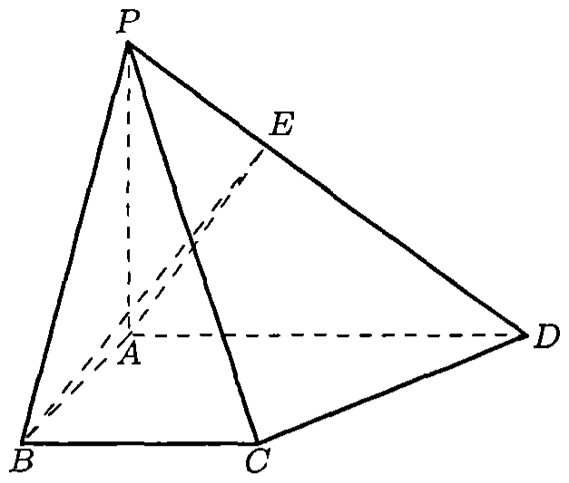
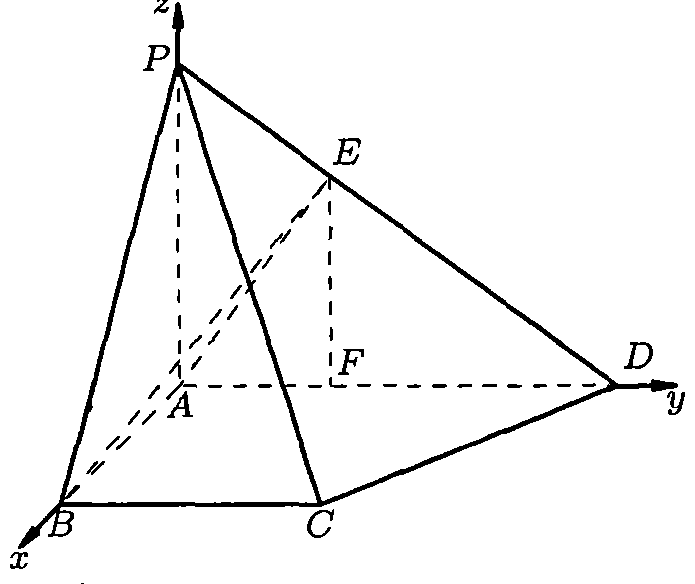
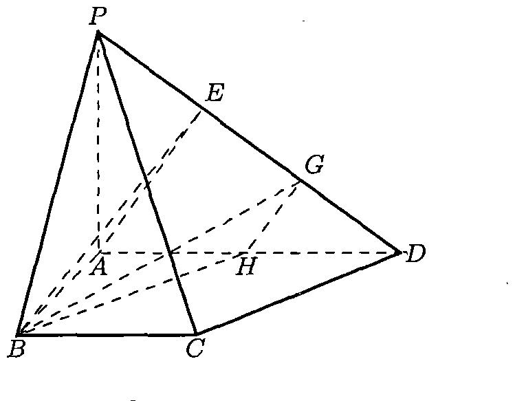
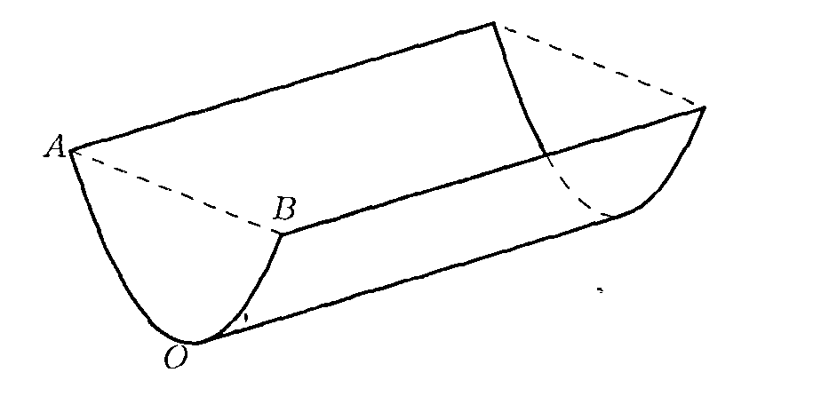
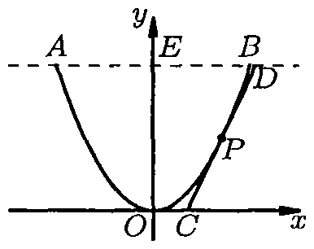

# 1999年上海卷（理）

## 填空题

### 第 1 题

$\tan\left(\arccos \frac{\sqrt{2}}{2} - \frac{\pi}{6}\right)=$＿＿＿＿＿＿.

#### 答案

$2-\sqrt{3}$

#### 解析

因为 $\arccos\dfrac{\sqrt2}{2}=\dfrac\pi4$，所以 $\tan\left(\arccos\dfrac{\sqrt2}{2}-\dfrac\pi6\right)=\tan\dfrac\pi{12}$. 利用正切差角公式，得

$$

\tan\dfrac\pi{12}=\frac{\tan\dfrac\pi4-\tan\dfrac\pi6}{1+\tan\dfrac\pi4\tan\dfrac\pi6}=\frac{1-\dfrac1{\sqrt3}}{1+\dfrac1{\sqrt3}}=2-\sqrt3

$$

因此填 $2-\sqrt3$.

### 第 2 题

函数 $f(x)=\log_2 x+1$（$x\geqslant 4$）的反函数 $f^{-1}(x)$ 的定义域是＿＿＿＿＿＿.

#### 答案

$[3,+\infty)$

#### 解析

函数 $f(x)=\log_2x+1$ 的定义域是 $[4,+\infty)$，且底数 $2>1$，所以 $f$ 在该定义域上单调递增. 于是 $f(4)=3$，并且当 $x$ 遍历 $[4,+\infty)$ 时，$f(x)$ 的值域为 $[3,+\infty)$. 反函数的定义域等于原函数的值域，因此 $f^{-1}(x)$ 的定义域是 $[3,+\infty)$.

### 第 3 题

在 $\left( x^3 + \frac{2}{x^2} \right)^5$ 的展开式中，含 $x^5$ 项的系数为＿＿＿＿＿＿.

#### 答案

$40$

#### 解析

展开式的通项可写为 $\mathrm C_5^k(x^3)^{5-k}\left(\frac2{x^2}\right)^k=\mathrm C_5^k2^k x^{15-5k}$，$k=0$，$1$，$\ldots$，$5$. 含 $x^5$ 项时，指数应满足 $15-5k=5$，故 $k=2$. 该项的系数为 $\mathrm C_5^2\cdot2^2=10\cdot4=40$.

### 第 4 题

在 $\triangle ABC$ 中，若 $\angle B=30^\circ$，$AB=2\sqrt{3}$，$AC=2$，则 $\triangle ABC$ 的面积 $S$ 是＿＿＿＿＿＿.

#### 答案

$2\sqrt{3}$ 或 $\sqrt{3}$

#### 解析

设 $BC=x$，其中 $x>0$. 由余弦定理，

$$

AC^2=AB^2+BC^2-2\cdot AB\cdot BC\cos B

$$

所以 $4=12+x^2-6x$，即 $x^2-6x+8=0$. 解得 $x=2$ 或 $x=4$，且这两个值都满足三角形三边关系.

因此 $S=\dfrac12AB\cdot BC\cdot\sin B=\dfrac12\cdot2\sqrt3\cdot x\cdot\dfrac12=\dfrac{\sqrt3}{2}x$. 当 $x=2$ 时 $S=\sqrt3$，当 $x=4$ 时 $S=2\sqrt3$. 所以填 $2\sqrt3$ 或 $\sqrt3$.

### 第 5 题

若平移坐标系，将曲线方程 $y^2 + 4x - 4y - 4 = 0$ 化为标准方程，则坐标原点应移到点 $O'\left(\underline{\qquad\qquad},\underline{\qquad\qquad} \right)$.

#### 答案

$(2,2)$

#### 解析

配方得

$$

y^2-4y+4x-4=0\quad\Longleftrightarrow\quad (y-2)^2=-4(x-2)

$$

令新坐标为 $X=x-2$，$Y=y-2$，则曲线化为标准方程 $Y^2=-4X$. 因而新坐标原点对应于原坐标中的点 $O'(2,2)$.

### 第 6 题

函数 $y = 2\sin x \cos x - 2\sin^2 x + 1$ 的最小正周期 $T=$＿＿＿＿＿＿.

#### 答案

$\pi$

#### 解析

利用二倍角公式，

$$

y=\sin2x-\left(1-\cos2x\right)+1=\sin2x+\cos2x=\sqrt2\sin\left(2x+\frac\pi4\right)

$$

正弦函数的最小正周期是 $2\pi$，自变量的系数为 $2$，所以该函数的最小正周期为 $T=\dfrac{2\pi}{2}=\pi$.

### 第 7 题

函数 $y = 2\sin\left( 2x + \frac{\pi}{6} \right)$（$x \in \left[ -\pi, 0 \right]$）的单调递减区间是＿＿＿＿＿＿.

#### 答案

$\left(-\frac{5\pi}{6},-\frac{\pi}{3}\right)$

#### 解析

令 $u=2x+\dfrac\pi6$. 当 $x\in[-\pi,0]$ 时，$u\in\left[-\dfrac{11\pi}{6},\dfrac\pi6\right]$. 函数 $2\sin u$ 在 $\left(-\dfrac{3\pi}{2}+2k\pi,-\dfrac\pi2+2k\pi\right)$ 上递减. 与上述 $u$ 的取值范围相交的只有 $k=0$ 对应的区间 $\left(-\dfrac{3\pi}{2},-\dfrac\pi2\right)$. 因而

$$

-\frac{3\pi}{2}<2x+\frac\pi6<-\frac\pi2
\quad\Longleftrightarrow\quad
-\frac{5\pi}{6}<x<-\frac\pi3

$$

所以单调递减区间为 $\left(-\dfrac{5\pi}{6},-\dfrac\pi3\right)$.

### 第 8 题

若将向量 $\boldsymbol{a}= \{2, 1\}$ 围绕原点按逆时针方向旋转 $\frac{\pi}{4}$ 得到向量 $\boldsymbol{b}$，则向量 $\boldsymbol{b}$ 的坐标为＿＿＿＿＿＿.

#### 答案

$\left\{\frac{\sqrt2}{2}, \frac{3\sqrt2}{2}\right\}$

#### 解析

逆时针旋转角 $\dfrac\pi4$ 的坐标变换为

$$

\begin{cases}
x'=x\cos\dfrac\pi4-y\sin\dfrac\pi4,\\
y'=x\sin\dfrac\pi4+y\cos\dfrac\pi4.
\end{cases}

$$

代入 $(x,y)=(2,1)$，得 $x'=2\cdot\frac{\sqrt2}{2}-1\cdot\frac{\sqrt2}{2}=\frac{\sqrt2}{2}$，$y'=2\cdot\frac{\sqrt2}{2}+1\cdot\frac{\sqrt2}{2}=\frac{3\sqrt2}{2}$. 所以 $\bs b=\left\{\dfrac{\sqrt2}{2},\dfrac{3\sqrt2}{2}\right\}$.

### 第 9 题

极坐标方程 $5\rho^2 \cos 2\theta + \rho^2 - 24 = 0$ 所表示的曲线焦点的极坐标为＿＿＿＿＿＿.

#### 答案

$\left(\sqrt{10},0\right)$，$\left(\sqrt{10},\pi\right)$

#### 解析

由 $\rho^2\cos2\theta=x^2-y^2$ 和 $\rho^2=x^2+y^2$，原方程化为

$$

5(x^2-y^2)+x^2+y^2-24=0
\quad\Longleftrightarrow\quad
\frac{x^2}{4}-\frac{y^2}{6}=1

$$

这是双曲线，其中 $a^2=4$，$b^2=6$. 因而焦距参数满足 $c^2=a^2+b^2=10$，两个焦点的直角坐标为 $(\sqrt{10},0)$ 和 $(-\sqrt{10},0)$. 转为极坐标，分别为 $\left(\sqrt{10},0\right)$ 和 $\left(\sqrt{10},\pi\right)$.

### 第 10 题

在等差数列 $\{a_n\}$ 中，满足 $3a_4 = 7a_7$，且 $a_1 > 0$，$S_n$ 是数列 $\{a_n\}$ 前 $n$ 项的和. 若 $S_n$ 取得最大值，则 $n=\underline{\qquad\qquad}$.

#### 答案

$9$

#### 解析

设等差数列的公差为 $d$. 由 $a_n=a_1+(n-1)d$ 及题设，

$$

3(a_1+3d)=7(a_1+6d)

$$

所以 $4a_1+33d=0$，即 $d=-\dfrac{4a_1}{33}<0$. 因而 $a_n=\dfrac{a_1(37-4n)}{33}$. 于是 $a_9=\dfrac{a_1}{33}>0$，而 $a_{10}=-\dfrac{a_1}{11}<0$. 又 $S_{n+1}-S_n=a_{n+1}$，所以 $S_n$ 在到达 $S_9$ 前递增，从 $S_9$ 起递减，最大值在 $n=9$ 时取得.

### 第 11 题

若以连续掷两次骰子分别得到的点数 $m$，$n$ 作为点 $P$ 的坐标，则点 $P$ 落在圆 $x^2 + y^2 = 16$ 内的概率是＿＿＿＿＿＿.

#### 答案

$\frac{2}{9}$

#### 解析

两次掷骰子的结果有 $6\times6=36$ 个等可能的有序点 $(m,n)$. 条件为 $m^2+n^2<16$. 当 $m=1$ 时，$n=1$，$2$，$3$，有 $3$ 个；当 $m=2$ 时，$n=1$，$2$，$3$，有 $3$ 个；当 $m=3$ 时，$n=1$，$2$，有 $2$ 个；当 $m\ge4$ 时不可能满足条件. 因而有利结果数为 $3+3+2=8$，所求概率为

$$

P=\frac{8}{36}=\frac29

$$

### 第 12 题

若四面体各棱的长是 $1$ 或 $2$，且该四面体不是正四面体，则其体积的值是＿＿＿＿＿＿（只需写出一个可能的值）.

#### 答案

$\frac{\sqrt{11}}{12}$，$\frac{\sqrt{14}}{12}$，$\frac{\sqrt{11}}{6}$（三者中的任一个）

#### 解析

给出一种构造：取底面 $ABC$ 为边长为 $1$ 的正三角形，取顶点 $D$ 使 $DA=DB=DC=2$. 这时四面体的六条棱长均为 $1$ 或 $2$，且不是正四面体.

设 $O$ 为正三角形 $ABC$ 的中心. 由于 $DA=DB=DC$，顶点 $D$ 在底面上的射影为 $O$，且 $OA=\dfrac1{\sqrt3}$. 设四面体高为 $h$，则在直角三角形 $DOA$ 中 $h^2=DO^2=DA^2-OA^2=4-\frac13=\frac{11}{3}$，$h=\frac{\sqrt{33}}3$. 底面面积为 $\dfrac{\sqrt3}{4}$，所以体积为

$$

V=\frac13\cdot\frac{\sqrt3}{4}\cdot\frac{\sqrt{33}}3=\frac{\sqrt{11}}{12}

$$

因此 $\dfrac{\sqrt{11}}{12}$ 是一个可能的值.

## 单选题

### 第 13 题

直线 $y = \frac{\sqrt{3}}{3}x$ 绕原点按逆时针方向旋转 $30^\circ$ 后所得直线与圆 $\left( x - 2 \right)^2 + y^2 = 3$ 的位置关系是（）

A.  
直线过圆心

B.  
直线与圆相交，但不过圆心

C.  
直线与圆相切

D.  
直线与圆没有公共点.

#### 答案

C

#### 解析

原直线的倾斜角为 $\dfrac\pi6$. 逆时针旋转 $\dfrac\pi6$ 后，所得直线的倾斜角为 $\dfrac\pi3$，方程为 $y=\sqrt3x$. 圆心为 $(2,0)$，半径为 $\sqrt3$，圆心到该直线的距离为

$$

\frac{|\sqrt3\cdot2|}{\sqrt{(\sqrt3)^2+(-1)^2}}=\frac{2\sqrt3}{2}=\sqrt3

$$

距离等于半径，所以直线与圆相切，故选 C.

### 第 14 题

下列以 $t$ 为参数的参数方程所表示的曲线中，与方程 $xy = 1$ 所表示的曲线完全一致的是（）

A.  

$$

\begin{cases}
        x = t^{\frac{1}{2}} \\
        y = t^{-\frac{1}{2}}
    \end{cases}

$$

B.  

$$

\begin{cases}
        x = |t| \\
        y = \frac{1}{|t|}
    \end{cases}

$$

C.  

$$

\begin{cases}
        x = \cos t \\
        y = \sec t
    \end{cases}

$$

D.  

$$

\begin{cases}
        x = \tan t \\
        y = \cot t
    \end{cases}

$$

#### 答案

D

#### 解析

前两项参数方程只给出 $xy=1$ 的第一象限部分；第三项参数方程满足 $xy=1$，但 $x=\cos t$ 只能取 $[-1,1]$ 内的值，不能表示整条曲线.

对第四项参数方程，在其有定义时有 $xy=\tan t\cot t=1$. 反过来，对任意满足 $xy=1$ 的点，$x\ne0$，可取 $t$ 使 $\tan t=x$，此时 $\cot t=1/x=y$，故第四项表示的曲线正好是 $xy=1$. 因此选第四项.

### 第 15 题

若 $a < b < 0$，则下列结论中正确的是（）

A.  
不等式 $\frac{1}{a} > \frac{1}{b}$ 和 $\frac{1}{|a|} > \frac{1}{|b|}$ 均不能成立

B.  
不等式 $\frac{1}{a - b} > \frac{1}{a}$ 和 $\frac{1}{|a|} > \frac{1}{|b|}$ 均不能成立

C.  
不等式 $\frac{1}{a - b} > \frac{1}{a}$ 和 $\left(a + \frac{1}{b}\right)^2 > \left(b + \frac{1}{a}\right)^2$ 均不能成立

D.  
不等式 $\frac{1}{|a|} > \frac{1}{|b|}$ 和 $\left(a + \frac{1}{b}\right)^2 > \left(b + \frac{1}{a}\right)^2$ 均不能成立.

#### 答案

B

#### 解析

由 $a<b<0$，可知 $ab>0$，$a-b<0$，且 $b-a>0$. 因此

$$

\frac1a-\frac1b=\frac{b-a}{ab}>0

$$

所以 $\dfrac1a>\dfrac1b$ 恒成立，选项 A 不正确.

$$

\frac1{a-b}-\frac1a=\frac{b}{a(a-b)}<0

$$

其中 $a(a-b)>0$，所以 $\dfrac1{a-b}>\dfrac1a$ 不能成立. 又因为 $|a|>|b|>0$，所以 $\dfrac1{|a|}<\dfrac1{|b|}$，从而 $\dfrac1{|a|}>\dfrac1{|b|}$ 也不能成立. 因此选项 B 正确.

对于选项 C、D 中的第二个不等式，有

$$

\left(a+\frac1b\right)^2-\left(b+\frac1a\right)^2
=(a^2-b^2)\left(1+\frac1{ab}\right)^2\ge0

$$

例如取 $a=-3$，$b=-2$，上式严格大于 $0$，所以该不等式可以成立，这两个选项均不正确. 故选 B.

### 第 16 题

设有直线 $m$，$n$ 和平面 $\alpha$，$\beta$，则在下列命题中，正确的是（）

A.  
若 $m \parallel n$，$m \subset \alpha$，$n \subset \beta$，则 $\alpha \parallel \beta$

B.  
若 $m \perp \alpha$，$m \perp n$，$n \subset \beta$，则 $\alpha \parallel \beta$

C.  
若 $m \parallel n$，$n \perp \beta$，$m \subset \alpha$，则 $\alpha \perp \beta$

D.  
若 $m \parallel n$，$m \perp \alpha$，$n \perp \beta$，则 $\alpha \perp \beta$.

#### 答案

C

#### 解析

判断各项. A 不成立，例如取 $\alpha=\beta$，同一平面中可含有两条平行直线，不能推出 $\alpha\parallel\beta$. B 不成立，例如取 $\alpha$ 为水平面，$m$ 为竖直线，取 $n$ 为水平直线并令 $\beta$ 为包含 $m$，$n$ 的竖直平面，此时条件成立但两平面不平行.

对 C，由 $n\perp\beta$ 且 $m\parallel n$，得 $m\perp\beta$. 又 $m\subset\alpha$，所以平面 $\alpha$ 含有一条垂直于平面 $\beta$ 的直线，从而 $\alpha\perp\beta$. D 不成立，因为两个平面都垂直于同一方向时可以互相平行，例如取 $m$，$n$ 为两条平行的竖直线，取 $\alpha$，$\beta$ 为两条平行的水平面. 故选 C.

## 解答题

### 第 17 题

设集合 $A = \{x \mid |x - a| < 2\}$，$B = \left\{ x \mid \frac{2x - 1}{x + 2} < 1 \right\}$. 若 $A \subseteq B$，求实数 $a$ 的取值范围.

#### 解析

由 $|x-a|<2$，得 $a-2<x<a+2$，所以 $A=\{x\mid a-2<x<a+2\}$.

由题目中的分式有意义知 $x\ne-2$. 在此条件下，

$$

\frac{2x-1}{x+2}<1\quad\Longleftrightarrow\quad\frac{x-3}{x+2}<0\quad\Longleftrightarrow\quad -2<x<3

$$

所以 $B=\{x\mid -2<x<3\}$.

因为两个集合都是开区间，$A\subseteq B$ 等价于 $a-2\ge-2$ 且 $a+2\le3$. 解得 $0\le a\le1$.

### 第 18 题

设正数数列 $\{a_n\}$ 为一等比数列，且 $a_2 = 4$，$a_4 = 16$，求 $\displaystyle\lim_{n \to \infty} \frac{\lg a_{n + 1} + \lg a_{n + 2} + \cdots + \lg a_{2n}}{n^2}$.

#### 解析

设公比为 $q$. 因为 $q^2=\dfrac{a_4}{a_2}=4$，又 $a_n>0$，$n\in\mathbb{N}$，所以 $q=2$. 于是 $a_1=\dfrac{a_2}{q}=2$，$a_n=a_1q^{n-1}=2^n$. 因此

$$

\frac{\lg a_{n+1}+\lg a_{n+2}+\cdots+\lg a_{2n}}{n^2}
=\frac{(n+1)\lg2+(n+2)\lg2+\cdots+2n\lg2}{n^2}

$$

$$

=\frac{(n+1)+(n+2)+\cdots+2n}{n^2}\lg2
=\left(\frac32+\frac{1}{2n}\right)\lg2

$$

所以

$$

\lim_{n\to\infty}\frac{\lg a_{n+1}+\lg a_{n+2}+\cdots+\lg a_{2n}}{n^2}
=\frac32\lg2

$$

### 第 19 题

已知方程 $x^2 + (4 + \i)x + 4 + a\i = 0$（$a \in \mathbb{R}$）有实根 $b$，且 $z = a + b\i$，求复数 $\bar z(1 - c\i)$（$c > 0$）的辐角主值的取值范围.

#### 解析

设实根为 $b$. 代入方程得 $b^2+(4+\i)b+4+a\i=0$. 因为 $b$ 是实数，所以实部，虚部分别为 $b^2+4b+4=0$，$b+a=0$. 解得 $b=-2$，$a=2$. 因此 $z=2-2\i$，$\bar z=2+2\i$. 于是 $\bar z(1-c\i)=(2+2\i)(1-c\i)=(2+2c)+(2-2c)\i$.

当 $0<c\le1$ 时，$\bar z(1-c\i)$ 的实部大于 $0$，虚部不小于 $0$，所以其辐角主值在 $[0,\frac{\pi}{2})$ 范围内. 又

$$

\arg\left[\bar z(1-c\i)\right]=\arctan\frac{2-2c}{2+2c}
=\arctan\left(\frac{2}{1+c}-1\right)

$$

且 $0<c\le1$ 时有 $0\le\frac{2}{1+c}-1<1$，所以 $0\le \arg\left[\bar z(1-c\i)\right]<\dfrac{\pi}{4}$.

当 $c>1$ 时，$\bar z(1-c\i)$ 的实部大于 $0$，虚部小于 $0$，所以其辐角主值在 $\left(\frac{3\pi}{2},2\pi\right)$ 范围内. 又

$$

\arg\left[\bar z(1-c\i)\right]=2\pi+\arctan\frac{2-2c}{2+2c}
=2\pi+\arctan\left(\frac{2}{1+c}-1\right)

$$

且 $c>1$ 时有 $-1<\frac{2}{1+c}-1<0$，所以 $-\dfrac{\pi}{4}<\arctan\left(\dfrac{2}{1+c}-1\right)<0$，从而 $\dfrac{7\pi}{4}<\arg\left[\bar z(1-c\i)\right]<2\pi$.

综上，复数 $\bar z(1-c\i)$（$c>0$）的辐角主值的取值范围为

$$

\left[0,\frac{\pi}{4}\right)\cup\left(\frac{7\pi}{4},2\pi\right)

$$

### 第 20 题

如图，在四棱锥 $P-ABCD$ 中，底面 $ABCD$ 是一直角梯形，$\angle BAD = 90^\circ$，$AD \parallel BC$，$AB = BC = a$，$AD = 2a$，且 $PA \perp$ 底面 $ABCD$，$PD$ 与底面成 $30^\circ$ 角. 若 $AE \perp PD$，$E$ 为垂足.

1.  求证：$BE \perp PD$；

2.  求异面直线 $AE$ 与 $CD$ 所成角的大小（用反三角函数表示）.

#### 解析

1.  【证法一】因为 $PA\perp$ 平面 $ABCD$，所以 $PA\perp AB$. 又 $AB\perp AD$，所以 $AB\perp$ 平面 $PAD$. 因此 $AB\perp PD$.

    又因为 $AE\perp PD$，所以 $PD\perp$ 平面 $ABE$. 从而 $BE\perp PD$.

    【证法二】由题设 $AB\perp AD$，$AB\perp AP$，所以 $AB\perp$ 平面 $PAD$. 因此 $AB\perp PD$. 又 $AE\perp PD$，所以 $PD\perp$ 平面 $ABE$. 从而 $BE\perp PD$.

2.  【解法一】设 $A$ 为原点，$AB$，$AD$，$AP$ 所在直线分别为 $x$ 轴，$y$ 轴，$z$ 轴，建立空间直角坐标系，则 $C(a,a,0)$，$D(0,2a,0)$. 因为 $PA\perp$ 平面 $ABCD$，所以 $\angle PDA$ 是 $PD$ 与底面 $ABCD$ 所成的角，且 $\angle PDA=30^\circ$. 在直角三角形 $AED$ 中，由 $AD=2a$ 得 $AE=a$.

    过 $E$ 作 $EF\perp AD$，垂足为 $F$. 在直角三角形 $AFE$ 中，由 $AE=a$，$\angle EAF=60^\circ$，得 $AF=\dfrac12a$，$EF=\dfrac{\sqrt3}{2}a$. 于是 $E\left(0,\dfrac12a,\dfrac{\sqrt3}{2}a\right)$，$\overrightarrow{AE}=\left\{0,\dfrac12a,\dfrac{\sqrt3}{2}a\right\}$. 又 $\overrightarrow{CD}=\{-a,a,0\}$. 设 $\overrightarrow{AE}$ 与 $\overrightarrow{CD}$ 的夹角为 $\theta$，则

$$

\cos\theta=\frac{\overrightarrow{AE}\cdot\overrightarrow{CD}}{\left|\overrightarrow{AE}\right|\left|\overrightarrow{CD}\right|}
    =\frac{0\times(-a)+\frac12a\times a+\frac{\sqrt3}{2}a\times0}{\sqrt{0^2+\left(\frac a2\right)^2+\left(\frac{\sqrt3 a}{2}\right)^2}\sqrt{(-a)^2+a^2+0^2}}
    =\frac{\sqrt2}{4}

$$

    所以 $\theta=\arccos\dfrac{\sqrt2}{4}$. 即异面直线 $AE$ 与 $CD$ 所成角的大小为 $\arccos\frac{\sqrt2}{4}$.

    【解法二】如图，设 $G$，$H$ 分别为 $ED$，$AD$ 的中点，连结 $BH$，$HG$，$GB$. 易知 $DH \cong CB$，所以 $BH\parallel CD$. 又 $G$，$H$ 分别为 $ED$，$AD$ 的中点，所以 $HG\parallel AE$.

    则 $\angle BHG$ 或它的补角就是异面直线 $AE$，$CD$ 所成的角.

    而 $HG=\dfrac12 AE=\dfrac12 a$，$BH=\sqrt{AB^2+AH^2}=\sqrt2\,a$，

$$

BG^2=BE^2+EG^2=AB^2+AE^2+EG^2=\dfrac{11}{4}a^2

$$

    在 $\triangle BHG$ 中，由余弦定理可得

$$

\cos\angle BHG=\frac{BH^2+HG^2-BG^2}{2\cdot BH\cdot HG}=-\frac{\sqrt2}{4}

$$

    $\angle BHG=\pi-\arccos\dfrac{\sqrt2}{4}$. 所以异面直线 $AE$，$CD$ 所成角的大小为 $\arccos\frac{\sqrt2}{4}$.

### 第 21 题

平地上有一条水沟，沟沿是两条长 $100\mathrm{~m}$ 的平行线段，沟宽 $AB$ 为 $2\mathrm{~m}$. 与沟沿垂直的平面与沟的交线是一段抛物线，抛物线顶点为 $O$，对称轴与地面垂直，沟深 $1.5\mathrm{~m}$，沟中水深 $1\mathrm{~m}$.

1.  求水面宽；

2.  如图所示形状的几何体称为柱体. 已知柱体的体积为底面积乘以高，问沟中的水有多少立方米；

3.  若要把这条水沟改挖（不准填土）成截面为等腰梯形的沟，使沟的底面与地面平行，则改挖后的沟底宽为多少米时，所挖的土最少.

#### 解析

1.  如图，建立直角坐标系. 设抛物线的方程为 $y=ax^2$，则由抛物线过点 $\left(1,\dfrac32\right)$，得 $a=\dfrac32$，于是抛物线方程为 $y=\dfrac32x^2$. 当 $y=1$ 时，$x=\pm\dfrac{\sqrt6}{3}$，由此，水面宽为 $\dfrac{2\sqrt6}{3}\text{ 米}$.

2.  水的体积

$$

V=2\cdot100\cdot\int_0^{\frac{\sqrt6}{3}}\left(1-\frac32x^2\right)\,dx
    =\frac{400\sqrt6}{9}

$$

    故沟中有 $\frac{400\sqrt6}{9}\text{ 立方米}$ 的水.

3.  由于不准填土，改挖后的梯形截面必须包含原抛物线截面. 若某一腰在不相切的情况下仍位于抛物线外侧，就可以将该腰向内移动，直到首次与抛物线相切，从而减小所挖土的截面积. 因此在最优情形，等腰梯形的两腰必须同抛物线相切. 设切点 $P\left(t,\frac32t^2\right)$（$0<t\le1$）是抛物线弧 $OB$ 上的一点，过 $P$ 作抛物线的切线得如图所示的直角梯形 $OCDE$，则切线 $CD$ 的方程为

$$

y=3t(x-t)+\frac32t^2=3tx-\frac32t^2

$$

    于是 $C\left(\dfrac{t}{2},0\right)$，$D\left(\dfrac12\left(t+\dfrac1t\right),\dfrac32\right)$. 记梯形 $OCDE$ 的面积为 $S$，则 $S=\dfrac34\left(t+\dfrac1{2t}\right)$（$0<t\le1$）. 整沟截面关于对称轴对称，所挖土的截面面积为 $2S$，所以只需使 $S$ 取得最小值. 由基本不等式，

$$

t+\frac{1}{2t}\ge 2\sqrt{t\cdot\frac{1}{2t}}=\sqrt2

$$

    等号当且仅当 $t=\dfrac{1}{2t}$，即 $t=\dfrac{\sqrt2}{2}$，且该值满足 $0<t\le1$. 又 $OC=\dfrac{t}{2}$，所以改挖后的沟底宽为 $2OC=t=\dfrac{\sqrt2}{2}\text{ 米}$.

### 第 22 题

设椭圆 $C_1$ 的方程为 $\frac{x^2}{a^2} + \frac{y^2}{b^2} = 1$（$a > b > 0$），曲线 $C_2$ 的方程为 $y = \frac{1}{x}$，且 $C_1$ 与 $C_2$ 在第一象限内只有一个公共点 $P$.

1.  试用 $a$ 表示点 $P$ 的坐标；

2.  设 $A$，$B$ 是椭圆 $C_1$ 的两个焦点，当 $a$ 变化时，求 $\triangle ABP$ 的面积函数 $S(a)$ 的值域；

3.  记 $\min\{y_1, y_2, \cdots, y_n\}$ 为 $y_1$，$y_2$，$\cdots$，$y_n$ 中最小的一个. 设 $g(a)$ 是以椭圆 $C_1$ 的半焦距为边长的正方形的面积，试求函数 $f(a) = \min\{g(a), S(a)\}$ 的表达式.

#### 解析

1.  将 $y=\dfrac{1}{x}$ 代入椭圆方程，得 $\dfrac{x^2}{a^2}+\dfrac{1}{b^2x^2}=1$，化简得 $b^2x^4-a^2b^2x^2+a^2=0$. 令 $u=x^2$，这是关于 $u$ 的一元二次方程. 由于第一象限内 $x>0$，每个正根 $u$ 对应一个第一象限公共点；题设只有一个这样的公共点，故该方程有重根，从而 $\Delta=a^4b^4-4a^2b^2=0$. 因 $a$，$b>0$，得 $ab=2$. 于是由方程解得 $x=\dfrac{a}{\sqrt2}$（舍去 $x=-\dfrac{a}{\sqrt2}$），所以 $P\left(\dfrac{a}{\sqrt2},\dfrac{\sqrt2}{a}\right)$.

2.  在 $\triangle ABP$ 中，$|AB|=2\sqrt{a^2-b^2}$，高为 $\dfrac{\sqrt2}{a}$，所以 $S(a)=\dfrac12\cdot2\sqrt{a^2-b^2}\cdot\dfrac{\sqrt2}{a}=\sqrt{2\left(1-\dfrac{4}{a^4}\right)}$. 又 $a>b>0$，$b=\frac{2}{a}$，所以 $a>\sqrt2$，即 $a^4>4$. 令 $u=\dfrac4{a^4}$，则 $0<u<1$，且当 $a$ 遍历 $(\sqrt2,+\infty)$ 时，$u$ 遍历 $(0,1)$. 因而 $S(a)=\sqrt{2(1-u)}$ 的值域为 $(0,\sqrt2)$.

3.  $g(a)=c^2=a^2-b^2=a^2-\dfrac{4}{a^2}$. 因 $a>\sqrt2$，所以 $g(a)>0$，而 $S(a)>0$. 因此 $g(a)\ge S(a)$ 可以等价平方，得 $a^2-\dfrac{4}{a^2}\ge\sqrt{2\left(1-\dfrac{4}{a^4}\right)}$，整理得 $a^8-10a^4+24\ge0$，即 $(a^4-4)(a^4-6)\ge0$. 又 $a^4-4>0$，故 $a\ge\sqrt[4]{6}$. 所以

$$

f(a)=\min\{g(a),S(a)\}=
    \begin{cases}
    a^2-\dfrac{4}{a^2}, & \sqrt2<a\le\sqrt[4]{6},\\
    \sqrt{2\left(1-\dfrac{4}{a^4}\right)}, & a>\sqrt[4]{6}.
    \end{cases}

$$

