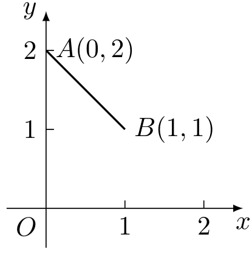
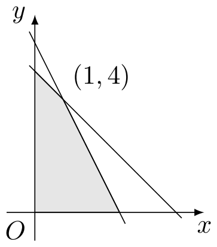
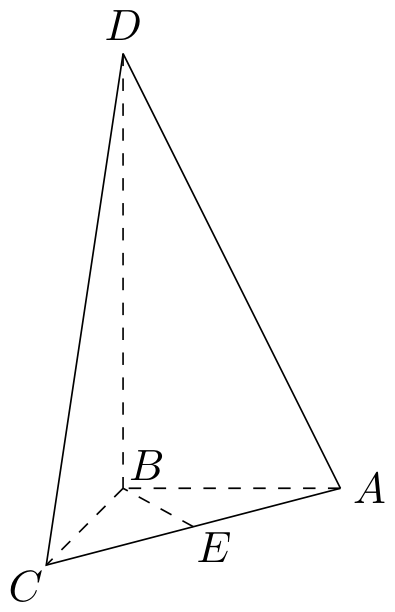

# 2000年上海卷（文）

## 填空题

### 第 1 题

已知向量 $\overrightarrow{OA}=(-1,2)$，$\overrightarrow{OB}=(3,m)$，若 $\overrightarrow{OA}\perp \overrightarrow{OB}$，则 $m=\underline{\qquad\qquad}$.

#### 答案

$\dfrac{3}{2}$

#### 解析

由两向量垂直可知它们的数量积为零，因此 $(-1)\cdot3+2m=0$， 解得 $m=\dfrac32$.

### 第 2 题

函数 $y=\log_2\frac{2x-1}{3-x}$ 的定义域为＿＿＿＿＿＿.

#### 答案

$\left(\frac{1}{2},3\right)$

#### 解析

对数的真数必须为正，所以定义域由 $\frac{2x-1}{3-x}>0$ 确定. 临界点为 $\dfrac12$ 和 $3$，作符号判断可知分式只在两临界点之间为正，故定义域为 $\left(\dfrac12,3\right)$.

### 第 3 题

圆锥曲线 $\frac{(x-1)^2}{16}-\frac{y^2}{9}=1$ 的焦点坐标是＿＿＿＿＿＿.

#### 答案

$\left(-4,0\right)$，$\left(6,0\right)$

#### 解析

将方程写成标准形式 $\frac{(x-1)^2}{16}-\frac{y^2}{9}=1$. 这是中心为 $(1,0)$ 的双曲线，其中 $a^2=16$，$b^2=9$. 双曲线的半焦距满足 $c^2=a^2+b^2=25$，所以 $c=5$. 因而两个焦点为 $(1-5,0)=(-4,0)$ 和 $(1+5,0)=(6,0)$.

### 第 4 题

计算：$\displaystyle\lim_{n\to\infty}\left(\frac{n}{n+2}\right)^n=\underline{\qquad\qquad}$.

#### 答案

$\e^{-2}$

#### 解析

将括号内的式子改写为

$$

\left(\frac{n}{n+2}\right)^n
=\left(1+\frac{2}{n}\right)^{-n}
=\left[\left(1+\frac{2}{n}\right)^{n/2}\right]^{-2}

$$

由于 $\left(1+\dfrac{2}{n}\right)^{n/2}\to\e$，故原极限为 $\e^{-2}$.

### 第 5 题

已知 $f(x)=2^x+b$ 的反函数为 $f^{-1}(x)$，若 $y=f^{-1}(x)$ 的图象经过点 $Q(5,2)$，则 $b=\underline{\qquad\qquad}$.

#### 答案

$1$

#### 解析

点 $Q(5,2)$ 在反函数 $y=f^{-1}(x)$ 的图象上，当且仅当交换横、纵坐标后点 $(2,5)$ 在函数 $y=f(x)$ 的图象上. 因此 $5=f(2)=2^2+b=4+b$， 解得 $b=1$.

### 第 6 题

根据上海市人大十一届三次会议上的市政府工作报告，$1999$ 年上海市完成 $\mathrm{GDP}$（$\mathrm{GDP}$ 是指国内生产总值）$4035\text{ 亿元}$，$2000$ 年上海市 $\mathrm{GDP}$ 预期增长 $9\%$，市委、市府提出本市常住人口每年的自然增长率将控制在 $0.08\%$，若 $\mathrm{GDP}$ 与人口均按这样的速度增长，则要使本市年人均 $\mathrm{GDP}$ 达到或超过 $1999$ 年的 $2$ 倍，至少需＿＿＿＿＿＿$\text{年}$.按：$1999$ 年本市常住人口总数约 $1300\text{ 万}$.

#### 答案

$9$

#### 解析

设从 $1999$ 年起经过 $t$ 年. 则该年的人均 $\mathrm{GDP}$ 与 $1999$ 年人均 $\mathrm{GDP}$ 的比值为 $\frac{4035\cdot1.09^t/(1300\cdot1.0008^t)}{4035/1300}=\left(\frac{1.09}{1.0008}\right)^t$. 令 $r=\dfrac{1.09}{1.0008}=\dfrac{2725}{2502}>1$. 要达到两倍，需有 $r^t\geqslant2$. 直接计算得 $r^8\approx1.97986<2$，$r^9\approx2.15632>2$. 由于 $r>1$，最小整数 $t$ 为 $9$，故至少需 $9$ 年.

### 第 7 题

命题 A：底面为正三角形，且顶点在底面的射影为底面中心的三棱锥是正三棱锥，命题 A 的等价命题 B 可以是：底面为正三角形，且＿＿＿＿＿＿的三棱锥是正三棱锥.

#### 答案

侧棱相等

#### 解析

设底面为正三角形 $ABC$，顶点为 $D$，且 $H$ 是 $D$ 在底面上的射影. 若 $H$ 是底面中心，则按正三棱锥的定义可知该三棱锥是正三棱锥.

反过来，若三条侧棱相等，即 $DA=DB=DC$，由直角三角形的勾股定理 $DA^2=DH^2+HA^2$，$DB^2=DH^2+HB^2$，$DC^2=DH^2+HC^2$， 可得 $HA=HB=HC$. 正三角形中到三个顶点距离相等的点唯一，即为底面中心，所以 $H$ 是底面中心. 因此与命题 A 等价的条件可以是“侧棱相等”.

### 第 8 题

设函数 $y=f(x)$ 是最小正周期为 $2$ 的偶函数，它在区间 $[0,1]$ 上的图象为如图所示的线段 $AB$，则在区间 $[1,2]$ 上 $f(x)=\underline{\qquad\qquad}$.

#### 答案

$x$

#### 解析

由图中 $A(0,2)$、$B(1,1)$ 可知，在 $[0,1]$ 上 $f(x)=2-x$. 对任意 $x\in[1,2]$，由周期为 $2$ 及偶性分别有 $f(x)=f(x-2)=f(2-x)$. 因为 $2-x\in[0,1]$，所以 $f(x)=2-(2-x)=x$.

### 第 9 题

在二项式 $(x-1)^{11}$ 的展开式中，系数最小的项的系数为＿＿＿＿＿＿. （结果用数值表示）

#### 答案

$-462$

#### 解析

展开式的通项为 $T_{k+1}=\mathrm C_{11}^k x^{11-k}(-1)^k$，其中 $k=0$，$1$，$\ldots$，$11$. 所以第 $k+1$ 项的系数为 $(-1)^k\mathrm C_{11}^k$. 负系数对应奇数 $k$，其绝对值依次为 $\mathrm C_{11}^1=11$，$\mathrm C_{11}^3=165$，$\mathrm C_{11}^5=462$，$\mathrm C_{11}^7=330$，$\mathrm C_{11}^9=55$，$\mathrm C_{11}^{11}=1$. 其中最大值为 $462$，故系数最小的项的系数为 $-462$.

### 第 10 题

有红、黄、蓝三种颜色的旗帜各 $3$ 面，在每种颜色的 $3$ 面旗帜上分别标上号码 $1$、$2$ 和 $3$，现任取出 $3$ 面，它们的颜色与号码均不相同的概率是＿＿＿＿＿＿.

#### 答案

$\dfrac{1}{14}$

#### 解析

九面旗帜彼此不同，任取三面共有 $\mathrm C_9^3=84$ 种取法. 要使颜色与号码均不相同，必须从三种颜色中各取一面，并且三个号码恰好为 $1$，$2$，$3$. 将三个号码分配给三种颜色有 $3!=6$ 种取法，因此所求概率为

$$

\frac{3!}{\mathrm C_9^3}=\frac{6}{84}=\frac1{14}

$$

### 第 11 题

图中阴影部分的点满足不等式组

$$

\begin{cases}
x+y\leqslant 5,\\
2x+y\leqslant 6,\\
x\geqslant 0,\ y\geqslant 0,
\end{cases}

$$

在这些点中，使目标函数 $k = 6x + 8y$ 取得最大值的点的坐标是＿＿＿＿＿＿.

#### 答案

$(0,5)$

#### 解析

可行域的边界交点为 $(0,0)$，$(3,0)$，$(0,5)$，$(1,4)$， 其中 $(1,4)$ 由 $x+y=5$ 与 $2x+y=6$ 联立得到. 目标函数为线性函数，只需比较各顶点处的值： $k(0,0)=0$，$k(3,0)=18$，$k(0,5)=40$，$k(1,4)=38$. 最大值在 $(0,5)$ 处取得，所以所求点的坐标为 $(0,5)$.

### 第 12 题

在等差数列 $\{a_n\}$ 中，若 $a_{10}=0$，则有等式 $a_1+a_2+\cdots+a_n=a_1+a_2+\cdots+a_{19-n}$（$n<19$，$n\in\mathbb{N}^{*}$）成立，类比上述性质，相应地：在等比数列 $\{b_n\}$ 中，若 $b_9=1$，则有等式＿＿＿＿＿＿ 成立.

#### 答案

$b_1b_2\cdots b_n=b_1b_2\cdots b_{17-n}$，$(n<17,\ n\in\mathbb{N}^{*})$

#### 解析

设等比数列的首项为 $b_1$，公比为 $q$. 由 $b_9=1$ 得 $b_1q^8=1$， 故 $b_1=q^{-8}$，且 $q\neq0$. 记前 $n$ 项积为 $P_n$，则

$$

P_n=b_1^nq^{\frac{n(n-1)}2}
=q^{-8n+\frac{n(n-1)}2}
=q^{\frac{n(n-17)}2}

$$

另一方面，$P_{17-n}=q^{\frac{(17-n)(17-n-17)}2}=q^{\frac{n(n-17)}2}=P_n$. 所以 $b_1b_2\cdots b_n=b_1b_2\cdots b_{17-n}$，其中 $n<17$ 且 $n\in\mathbb{N}^{*}$.

## 单选题

### 第 13 题

函数 $y=\sin\left(x+\frac{\pi}{2}\right)$ 在 $\left[-\frac{\pi}{2},\frac{\pi}{2}\right]$ 上是（）

A.  
增函数

B.  
减函数

C.  
偶函数

D.  
奇函数

#### 答案

C

#### 解析

由三角恒等式 $y=\sin\left(x+\frac\pi2\right)=\cos x$. 定义域 $\left[-\dfrac\pi2,\dfrac\pi2\right]$ 关于原点对称，且 $\cos(-x)=\cos x$，所以该函数是偶函数，选择 C.

### 第 14 题

设有不同的直线 $a$，$b$ 和不同的平面 $\alpha$，$\beta$，$\gamma$，给出下列三个命题：

1.  若 $a\parallel \alpha$，$b\parallel \alpha$，则 $a\parallel b$；

2.  若 $a\parallel \alpha$，$a\parallel \beta$，则 $\alpha\parallel \beta$；

3.  若 $\alpha\perp \gamma$，$\beta\perp \gamma$，则 $\alpha\parallel \beta$.

其中正确的个数是（）

A.  
$0$

B.  
$1$

C.  
$2$

D.  
$3$

#### 答案

A

#### 解析

三个命题都不成立.

对于命题 1，取平面 $\alpha:z=0$，令两条不同直线都经过 $(0,0,1)$，方向向量分别为 $(1,0,0)$ 和 $(0,1,0)$. 它们都平行于 $\alpha$，但彼此相交，故命题 1 错误.

对于命题 2，取 $\alpha:x=0$、$\beta:y=0$，令直线 $a$ 为 $\{(1,1,t)\mid t\in\mathbb{R}\}$. 直线 $a$ 同时平行于两个平面，而 $\alpha$ 与 $\beta$ 相交，故命题 2 错误.

对于命题 3，取 $\gamma:z=0$、$\alpha:x=0$、$\beta:y=0$. 两个竖直平面 $\alpha$、$\beta$ 都垂直于水平面 $\gamma$，但 $\alpha$ 与 $\beta$ 相交，故命题 3 错误.

因此正确命题的个数为 $0$，选择 A.

### 第 15 题

若集合 $S=\{y\mid y=3^x,\ x\in\mathbb{R}\}$，$T=\{y\mid y=x^2-1,\ x\in\mathbb{R}\}$，则 $S\cap T$ 是（）

A.  
$S$

B.  
$T$

C.  
$\varnothing$

D.  
有限集

#### 答案

A

#### 解析

因为指数函数 $3^x$ 的值域为 $(0,+\infty)$，所以 $S=(0,+\infty)$. 又因为 $x^2\geqslant0$，集合 $T$ 的值域为 $[-1,+\infty)$. 因而 $S\cap T=(0,+\infty)=S$， 选择 A.

### 第 16 题

下列命题中正确的命题是（）

A.  
若点 $P(a,2a)$（$a\neq 0$）为角 $\alpha$ 终边上一点，则 $\sin\alpha=\frac{2\sqrt{5}}{5}$

B.  
同时满足 $\sin\alpha=\frac{1}{2}$，$\cos\alpha=\frac{\sqrt{3}}{2}$ 的角 $\alpha$ 有且只有一个

C.  
当 $|a|<1$ 时，$\tan\left(\arcsin a\right)$ 的值恒正

D.  
三角方程 $\tan\left(x+\frac{\pi}{3}\right)=\sqrt{3}$ 的解集为 $\{x\mid x=k\pi,\ k\in\mathbb{Z}\}$

#### 答案

D

#### 解析

逐项判断.

A. 点 $P(a,2a)$ 到原点的距离为 $\sqrt5|a|$，故 $\sin\alpha=\frac{2a}{\sqrt5|a|}$. 当 $a<0$ 时该值为负，不恒等于 $\dfrac{2\sqrt5}{5}$，所以 A 错误.

B. 同时满足给定正弦、余弦值的角为 $\alpha=\frac\pi6+2k\pi$，其中 $k\in\mathbb{Z}$， 不止一个，所以 B 错误.

C. 当 $a<0$ 且 $|a|<1$ 时，$\arcsin a\in\left(-\dfrac\pi2,0\right)$，从而 $\tan(\arcsin a)<0$，所以 C 错误.

D. 由正切函数的周期性， $\tan\left(x+\frac\pi3\right)=\sqrt3\Longleftrightarrow x+\frac\pi3=\frac\pi3+k\pi$，其中 $k\in\mathbb{Z}$， 即 $x=k\pi$. 所以 D 正确，选择 D.

## 解答题

### 第 17 题

已知椭圆 $C$ 的焦点分别为 $F_1(-2\sqrt{2},0)$ 和 $F_2(2\sqrt{2},0)$，长轴长为 $6$，设直线 $y=x+2$ 交椭圆 $C$ 于 $A$，$B$ 两点，求线段 $AB$ 的中点坐标.

#### 解析

设椭圆 $C$ 的方程为 $\dfrac{x^2}{a^2}+\dfrac{y^2}{b^2}=1$，半焦距为 $c$. 由题意，$a=3$，$c=2\sqrt{2}$，所以 $b^2=a^2-c^2=1$，椭圆方程为 $\dfrac{x^2}{9}+y^2=1$.

将直线方程 $y=x+2$ 代入椭圆方程，得 $\dfrac{x^2}{9}+(x+2)^2=1$，即 $10x^2+36x+27=0$. 该方程的判别式为 $36^2-4\cdot10\cdot27=216>0$，故直线与椭圆有两个交点. 设两交点的横坐标为 $x_1$，$x_2$，由韦达定理得 $x_1+x_2=-\dfrac{18}{5}$. 两交点的纵坐标分别为 $x_1+2$，$x_2+2$，所以它们的和为 $x_1+x_2+4=\dfrac{2}{5}$.

因此，线段 $AB$ 的中点坐标为 $\left(\dfrac{x_1+x_2}{2},\dfrac{x_1+x_2+4}{2}\right)=\left(-\dfrac95,\dfrac15\right)$.

### 第 18 题

如图所示四面体 $ABCD$ 中，$AB$，$BC$，$BD$ 两两互相垂直，且 $AB=BC=2$，$E$ 是 $AC$ 中点，异面直线 $AD$ 与 $BE$ 所成的角的大小为 $\arccos\frac{\sqrt{10}}{10}$，求四面体 $ABCD$ 的体积.

#### 解析

以点 $B$ 为原点，分别以 $BA$，$BC$，$BD$ 所在直线为三个坐标轴，建立空间直角坐标系. 设 $BD=d$，则 $d>0$，且可取 $B(0,0,0)$，$A(2,0,0)$，$C(0,2,0)$，$D(0,0,d)$.

因为 $E$ 是 $AC$ 的中点，所以 $E(1,1,0)$. 于是 $\overrightarrow{AD}=(-2,0,d)$，$\overrightarrow{BE}=(1,1,0)$.

异面直线所成的角取锐角，故

$$

\cos\angle(AD,BE)=\frac{\left|\overrightarrow{AD}\cdot\overrightarrow{BE}\right|}{\left|\overrightarrow{AD}\right|\left|\overrightarrow{BE}\right|}=\frac{2}{\sqrt{d^2+4}\sqrt{2}}=\frac{\sqrt{10}}{10}

$$

两边平方，得 $\dfrac{2}{d^2+4}=\dfrac{1}{10}$，所以 $d^2=16$. 因为 $d>0$，故 $BD=4$.

三角形 $ABC$ 在 $B$ 处为直角，且 $AB=BC=2$，所以 $S_{\triangle ABC}=\dfrac12\cdot2\cdot2=2$. 因此 $V_{ABCD}=\dfrac13S_{\triangle ABC}\cdot BD=\dfrac13\cdot2\cdot4=\dfrac83$.

### 第 19 题

已知函数 $f(x)=\frac{x^2+2x+a}{x}$，$x\in\left[1,+\infty\right)$.

1.  当 $a=\frac{1}{2}$ 时，求函数 $f(x)$ 的最小值；

2.  若对任意 $x\in\left[1,+\infty\right)$，$f(x)>0$ 恒成立，试求实数 $a$ 的取值范围.

#### 解析

1.  当 $a=\dfrac12$ 时，$f(x)=x+2+\dfrac{1}{2x}$. 对 $x\in[1,+\infty)$，有 $f'(x)=1-\dfrac{1}{2x^2}\geqslant\dfrac12>0$，所以 $f(x)$ 在该区间上单调递增，最小值在 $x=1$ 处取得，即 $f(1)=1+2+\dfrac12=\dfrac72$.

2.  因为 $x\in[1,+\infty)$，所以 $x>0$. 因此 $f(x)>0$ 等价于 $x^2+2x+a>0$. 令 $g(x)=x^2+2x+a$，则 $g'(x)=2x+2>0$，所以 $g(x)$ 在 $[1,+\infty)$ 上单调递增，最小值为 $g(1)=a+3$. 要使对任意 $x\in[1,+\infty)$ 都有 $g(x)>0$，必须且只需 $a+3>0$，故 $a\in(-3,+\infty)$.

### 第 20 题

根据指令 $(r,\theta)$（$r\geqslant 0$，$-180^{\circ}\leqslant \theta\leqslant 180^{\circ}$），机器人在平面上能完成下列动作：先原地旋转角度 $\theta$（$\theta$ 为正时，按逆时针方向旋转 $\theta$，$\theta$ 为负时，按顺时针方向旋转 $-\theta$），再朝其面对的方向沿直线行走距离 $r$.

1.  现机器人在直角坐标系的坐标原点，且面对 $x$ 轴正方向，试给机器人下一个指令，使其移动到点 $(4,4)$；

2.  机器人在完成该指令后，发现在点 $(17,0)$ 处有一小球正向坐标原点作匀速直线滚动，已知小球滚动的速度为机器人直线行走速度的 $2$ 倍，若忽略机器人原地旋转所需的时间，问机器人最快可在何处截住小球？并给出机器人截住小球所需的指令.（结果精确到小数点后两位）

#### 解析

1.  机器人从原点移动到 $(4,4)$，所需行走距离为 $r=\sqrt{4^2+4^2}=4\sqrt{2}$. 初始面对 $x$ 轴正方向，目标方向与 $x$ 轴正方向成 $45^{\circ}$ 角，所以可取 $\theta=45^{\circ}$. 第一个指令为 $(4\sqrt{2},45^{\circ})$.

2.  设机器人直线行走速度为 $v$，并设机器人在点 $P(x,0)$ 处截住小球. 因为小球从 $(17,0)$ 向原点滚动，所以 $0\leqslant x\leqslant17$. 机器人从 $(4,4)$ 到 $P$ 的距离为 $\sqrt{(x-4)^2+16}$，小球滚过的距离为 $17-x$. 由于原地旋转不计时间，若二者同时到达 $P$，则 $\frac{\sqrt{(x-4)^2+16}}{v}=\frac{17-x}{2v}$，从而 $4\bigl((x-4)^2+16\bigr)=(17-x)^2$. 化简得 $3x^2+2x-161=0$，所以 $x=7$ 或 $x=-\dfrac{23}{3}$. 结合 $0\leqslant x\leqslant17$，只能取 $x=7$，此时机器人和小球到达 $P$ 所需时间均为 $\dfrac{5}{v}$.

    当 $x<7$ 时，小球到达 $P$ 所需时间为 $\dfrac{17-x}{2v}>\dfrac{5}{v}$；当 $x>7$ 时，机器人到达 $P$ 所需时间为 $\dfrac{\sqrt{(x-4)^2+16}}{v}>\dfrac{5}{v}$. 所以最快截住的位置为 $P(7,0)$.

    第一次指令完成后，机器人面对的方向为相对 $x$ 轴正方向的 $45^{\circ}$ 方向. 从 $(4,4)$ 指向 $(7,0)$ 的方向向量为 $(3,-4)$，该方向相对 $x$ 轴正方向的角为 $-\arctan\dfrac43\approx-53.13^{\circ}$. 因而第二次应旋转 $-53.13^{\circ}-45^{\circ}=-98.13^{\circ}$，并直线行走 $5.00$. 所需的第二个指令为 $(5.00,-98.13^{\circ})$.

### 第 21 题

在 $xOy$ 平面上有一点列 $P_1(a_1,b_1)$，$\ P_2(a_2,b_2)$，$\ \cdots$，$\ P_n(a_n,b_n)$，$\ \cdots$，对每个自然数 $n$，点 $P_n$ 位于函数 $y=2000\cdot \left(\frac{a}{10}\right)^x$（$0<a<10$）的图象上，且点 $P_n$，点 $(n,0)$ 与点 $(n+1,0)$ 构成一个以 $P_n$ 为顶点的等腰三角形.

1.  求点 $P_n$ 的纵坐标 $b_n$ 的表达式；

2.  若对每个自然数 $n$，以 $b_n$，$\ b_{n+1}$，$\ b_{n+2}$ 为边长能构成一个三角形，求 $a$ 取值范围；

3.  设 $c_n=\lg(b_n)$（$n\in\mathbb{N}$），若 $a$ 取（2）中确定的范围内的最小整数，问数列 $\{c_n\}$ 前多少项的和最大？试说明理由.

#### 解析

1.  设 $q=\dfrac{a}{10}$，则 $0<q<1$. 因为三角形 $P_n(n,0)(n+1,0)$ 是等腰三角形，故 $P_n$ 到 $(n,0)$ 和 $(n+1,0)$ 的距离相等，即 $(a_n-n)^2+b_n^2=(a_n-n-1)^2+b_n^2$. 化简得 $a_n=n+\dfrac12$. 又 $P_n$ 在函数图象上，所以 $b_n=2000q^{a_n}=2000\left(\dfrac{a}{10}\right)^{n+\frac12}$.

2.  因为 $0<q<1$，所以 $b_n>b_{n+1}>b_{n+2}>0$. 因此三数作为边长构成三角形的充要条件是最长边小于另外两边之和，即 $b_{n+1}+b_{n+2}>b_n$. 代入 $b_{n+1}=qb_n$，$b_{n+2}=q^2b_n$，并除以正数 $b_n$，得 $q+q^2>1$. 解不等式 $q^2+q-1>0$，结合 $q>0$，得 $q>\dfrac{\sqrt{5}-1}{2}$. 所以 $a>5(\sqrt{5}-1)$，故 $a$ 的取值范围为 $\bigl(5(\sqrt{5}-1),10\bigr)$.

3.  因为 $5(\sqrt{5}-1)\approx6.18$，所以该范围内的最小整数为 $a=7$. 此时 $q=0.7$，且 $c_n=\lg(b_n)=\lg2000+\left(n+\dfrac12\right)\lg0.7$. 由于 $\lg0.7<0$，数列 $\{c_n\}$ 严格递减. 设 $S_N=c_1+c_2+\cdots+c_N$，则 $S_{N+1}-S_N=c_{N+1}$. 直接计算得 $b_{20}=2000(0.7)^{20.5}\approx1.33>1$，而 $b_{21}=2000(0.7)^{21.5}\approx0.93<1$，所以 $c_{20}>0$，$c_{21}<0$. 因此 $S_N$ 在加入第 $20$ 项前递增，加入第 $21$ 项后递减，前 $20$ 项的和最大.

### 第 22 题

已知复数 $z_0=1-m\i$（$m>0$），$z=x+y\i$ 和 $\omega=x'+y'\i$，其中 $x$，$y$，$x'$，$y'$ 均为实数，$\i$ 为虚数单位，且对于任意复数 $z$，有 $\omega=\overline{z_0}\cdot\overline{z}$，$\ |\omega|=2|z|$.

1.  试求 $m$ 的值，并分别写出 $x'$ 和 $y'$ 用 $x$，$y$ 表示的关系式；

2.  将 $(x,y)$ 作为点 $P$ 的坐标，$(x',y')$ 作为点 $Q$ 的坐标，上述关系可以看作是坐标平面上点的一个变换：它将平面上的点 $P$ 变到这一平面上的点 $Q$，已知点 $P$ 经该变换后得到的点 $Q$ 的坐标为 $(\sqrt{3},2)$，试求点 $P$ 的坐标；

3.  若直线 $y=kx$ 上的任一点经上述变换后得到的点仍在该直线上，试求 $k$ 的值.

#### 解析

1.  对任意非零复数 $z$，由 $\omega=\overline{z_0}\cdot\overline{z}$ 得 $|\omega|=|z_0||z|$. 题设又给出 $|\omega|=2|z|$，所以 $|z_0|=2$. 因为 $z_0=1-m\i$ 且 $m>0$，故 $\sqrt{1+m^2}=2$，从而 $m=\sqrt{3}$.

    此时 $\overline{z_0}=1+\sqrt{3}\i$，$\overline{z}=x-y\i$，所以

$$

\omega=(1+\sqrt{3}\i)(x-y\i)=x+\sqrt{3}y+\left(\sqrt{3}x-y\right)\i

$$

    比较实部和虚部，得 $x'=x+\sqrt{3}y$，$y'=\sqrt{3}x-y$.

2.  因为点 $Q$ 的坐标为 $(\sqrt{3},2)$，所以 $x+\sqrt{3}y=\sqrt{3}$，$\sqrt{3}x-y=2$. 由第一式得 $x=\sqrt{3}(1-y)$. 代入第二式，得 $3-3y-y=2$，即 $y=\dfrac14$，从而 $x=\dfrac{3\sqrt{3}}{4}$. 因此点 $P$ 的坐标为 $\left(\dfrac{3\sqrt{3}}{4},\dfrac14\right)$.

3.  设直线 $y=kx$ 上任一点为 $P(x,kx)$. 由变换关系，该点的像为 $Q\bigl((1+\sqrt{3}k)x,\, (\sqrt{3}-k)x\bigr)$. 要使像点仍在直线 $y=kx$ 上，对任意 $x$ 都必须有 $\sqrt{3}-k=k(1+\sqrt{3}k)$，即 $\sqrt{3}k^2+2k-\sqrt{3}=0$. 解得 $k=\dfrac{\sqrt{3}}{3}$ 或 $k=-\sqrt{3}$. 将这两个值代回变换关系均成立，故所求为 $k=\dfrac{\sqrt{3}}{3}$ 或 $k=-\sqrt{3}$.
