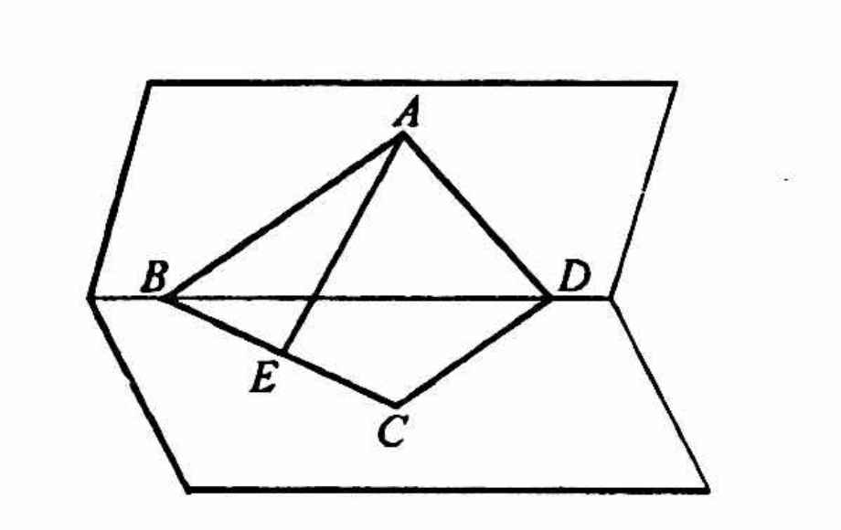
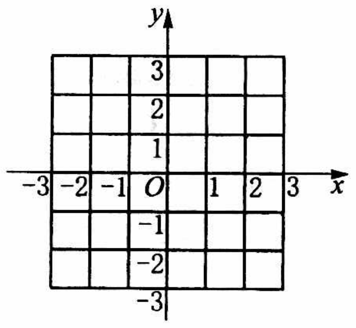
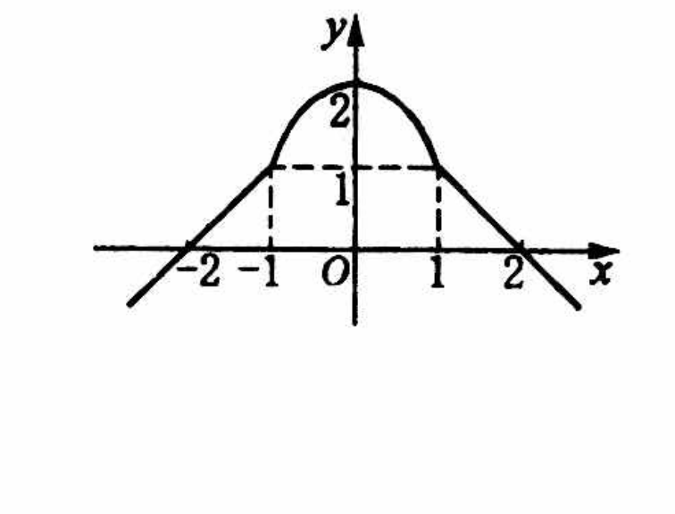
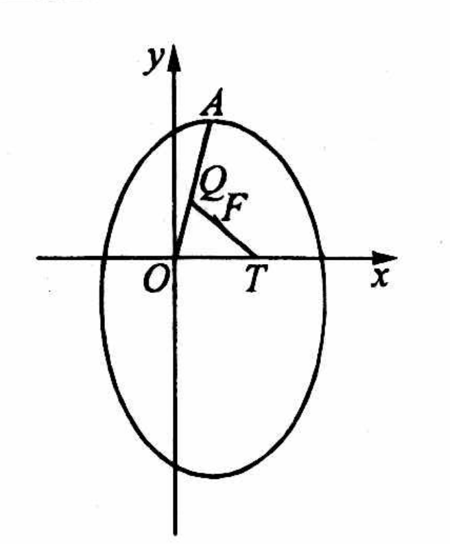

# 2000年上海卷（春）

## 填空题

### 第 1 题

若 $\sin \left(\frac{\pi}{2} + \alpha\right) = \frac{3}{5}$，则 $\cos 2\alpha =$＿＿＿＿＿＿.

#### 答案

$-\dfrac{7}{25}$

#### 解析

由诱导公式，$\sin\left(\frac{\pi}{2}+\alpha\right)=\cos\alpha$，所以 $\cos\alpha=\frac35$. 因而 $\cos2\alpha=2\cos^2\alpha-1=2\left(\frac35\right)^2-1=-\frac7{25}$.

### 第 2 题

若函数 $f(x)=-\frac{x}{x+2}$，则 $f^{-1}\left(\frac{1}{3}\right) =$＿＿＿＿＿＿.

#### 答案

$-\dfrac12$

#### 解析

设 $f(x)=y$，则 $y=-\frac{x}{x+2}$，从而 $y(x+2)=-x$，即 $x(y+1)=-2y$. 因此 $x=-\frac{2y}{y+1}$. 代入 $y=\frac13$，得 $f^{-1}\left(\frac13\right)=-\frac{2\times\frac13}{1+\frac13}=-\frac12$.

### 第 3 题

方程 $\log_{4}(3x-1)=\log_{4}(x-1)+\log_{4}(3+x)$ 的解是＿＿＿＿＿＿.

#### 答案

$x=2$

#### 解析

对数有意义的条件是 $x-1>0$，即 $x>1$. 在此条件下，$3x-1>0$ 且 $x+3>0$，原方程可化为 $\log_4(3x-1)=\log_4\bigl((x-1)(x+3)\bigr)$. 由于底数 $4>1$，对数函数是单调函数，所以 $3x-1=(x-1)(x+3)=x^2+2x-3$，即 $(x-2)(x+1)=0$. 结合 $x>1$，得 $x=2$.

### 第 4 题

若 $(\sqrt{x}+a)^{5}$ 的展开式中的第四项是 $10a^{2}$（$a$ 为大于零的常数），则 $x=$＿＿＿＿＿＿.

#### 答案

$\dfrac{1}{a}$

#### 解析

由二项式定理，展开式的第四项为 $\mathrm C_5^3(\sqrt{x})^{5-3}a^3=10xa^3$. 题设给出 $10xa^3=10a^2$. 因为 $a>0$，可除以 $10a^2$，得到 $ax=1$，所以 $x=\frac1a$.

### 第 5 题

在三角形 $ABC$ 中，$\sqrt{2} \sin A = \sqrt{3\cos A}$，则 $\angle A =$＿＿＿＿＿＿.

#### 答案

$60^\circ$

#### 解析

三角形内角满足 $0<A<\pi$，故 $\sin A>0$. 由题设等式右侧有意义且等式左侧为正数，得 $\cos A>0$，所以可以平方且不会引入本题范围外的符号条件. 平方得 $2\sin^2A=3\cos A$. 令 $u=\cos A$，利用 $\sin^2A=1-u^2$，得 $2(1-u^2)=3u$，即 $2u^2+3u-2=0$，所以 $(2u-1)(u+2)=0$. 由于 $-1\leqslant u\leqslant1$，只能有 $u=\frac12$. 又 $0<A<\frac\pi2$，因此 $A=60^\circ$.

### 第 6 题

若直线 $l$ 的倾角为 $\pi - \arctan\frac{1}{2}$，且过点 $(1,0)$，则直线 $l$ 的方程为＿＿＿＿＿＿.

#### 答案

$x+2y-1=0$

#### 解析

设 $\theta=\arctan\frac12$，则 $\tan\theta=\frac12$. 直线的斜率为 $k=\tan(\pi-\theta)=-\tan\theta=-\frac12$. 由点斜式，直线经过 $(1,0)$，故 $y=-\frac12(x-1)$，整理得 $x+2y-1=0$.

### 第 7 题

若数列 $\{a_{n}\}$ 的通项为 $\frac{1}{n(n + 1)}$（$n \in \mathbb{N}$），则 $\displaystyle\lim_{n \to \infty} (a_{1} + n^{2} a_{n}) =$＿＿＿＿＿＿.

#### 答案

$\dfrac{3}{2}$

#### 解析

由通项公式，$a_1=\frac1{1\cdot2}=\frac12$，且 $n^2a_n=\frac{n^2}{n(n+1)}=\frac{n}{n+1}$. 因而 $\lim_{n\to\infty}(a_1+n^2a_n)=\frac12+\lim_{n\to\infty}\frac{n}{n+1}=\frac12+1=\frac32$.

### 第 8 题

如图，$\angle BAD = 90^{\circ}$ 的等腰直角三角形 $ABD$ 与正三角形 $CBD$ 所在平面互相垂直，$E$ 是 $BC$ 的中点，则 $AE$ 与平面 $BCD$ 所成角的大小为＿＿＿＿＿＿.

#### 答案

$45^\circ$

#### 解析

设 $H$ 为 $BD$ 的中点. 因为三角形 $ABD$ 是以 $A$ 为直角顶点的等腰直角三角形，所以 $AH\perp BD$，且 $AH=\frac12BD$. 两平面 $ABD$ 和 $BCD$ 的交线为 $BD$，故在平面 $ABD$ 内垂直于 $BD$ 的直线 $AH$ 垂直于平面 $BCD$. 因此，$H$ 是点 $A$ 在平面 $BCD$ 上的射影，$HE$ 是 $AE$ 在该平面上的射影.

在正三角形 $CBD$ 中，$E$ 是 $BC$ 的中点，$H$ 是 $BD$ 的中点，所以 $HE$ 是三角形 $BCD$ 的中位线，$HE=\frac12CD=\frac12BD=AH$. 设 $AE$ 与平面 $BCD$ 所成的角为 $\theta$，则 $\tan\theta=\frac{AH}{HE}=1$. 由于该角为锐角，得 $\theta=45^\circ$.

### 第 9 题

若两个长方体的长，宽，高分别为 $5\mathrm{~cm}$，$4\mathrm{~cm}$，$3\mathrm{~cm}$，把它们两个全等的面重合在一起组成大长方体，则大长方体的对角线最长为＿＿＿＿＿＿$\mathrm{cm}$.

#### 答案

$5\sqrt{5}$

#### 解析

两个长方体可以分别沿三种不同类型的全等面重合.

沿 $4\mathrm{~cm}\times3\mathrm{~cm}$ 的面重合时，所得长方体的三条棱为 $10\mathrm{~cm}$，$4\mathrm{~cm}$，$3\mathrm{~cm}$，对角线为 $\sqrt{10^2+4^2+3^2}=\sqrt{125}=5\sqrt5\mathrm{~cm}$.

沿 $5\mathrm{~cm}\times3\mathrm{~cm}$ 的面重合时，对角线为 $\sqrt{5^2+8^2+3^2}=\sqrt{98}\mathrm{~cm}$. 沿 $5\mathrm{~cm}\times4\mathrm{~cm}$ 的面重合时，对角线为 $\sqrt{5^2+4^2+6^2}=\sqrt{77}\mathrm{~cm}$. 比较三者，最长对角线为 $5\sqrt5\mathrm{~cm}$，所以填 $5\sqrt5$.

### 第 10 题

有 $n$（$n \in \mathbb{N}$）件不同的产品排成一排，若其中 $A$，$B$ 两件产品排在一起的不同排法有 48 种，则 $n =$＿＿＿＿＿＿.

#### 答案

$5$

#### 解析

把相邻的 $A$，$B$ 看成一个整体，该整体与其余 $n-2$ 件产品共有 $n-1$ 个对象，可排成 $(n-1)!$ 种. 在整体内部，$A$，$B$ 还可以按 $AB$ 或 $BA$ 排列，因此总排法数为 $2(n-1)!$. 由题设 $2(n-1)!=48$，得 $(n-1)!=24=4!$. 因而 $n-1=4$，即 $n=5$.

### 第 11 题

集合 $A = \{(x, y) | x^2 + y^2 = 4\}$，$B = \{(x, y) | (x - 3)^2 + (y - 4)^2 = r^2\}$，其中 $r > 0$，若 $A \cap B$ 中有且仅有一个元素，则 $r$ 的值是＿＿＿＿＿＿.

#### 答案

$3$ 或 $7$

#### 解析

集合 $A$ 是圆心为 $O(0,0)$、半径为 $2$ 的圆，集合 $B$ 是圆心为 $C(3,4)$、半径为 $r$ 的圆. 两圆心之间的距离为 $OC=\sqrt{3^2+4^2}=5$. 两圆有且仅有一个公共点，等价于两圆相切.

外切时，$5=2+r$，得 $r=3$. 内切时，$5=|r-2|$. 由 $r>0$，解得 $r=7$ 或舍去的负值 $r=-3$. 所以 $r=3$ 或 $r=7$.

### 第 12 题

设 $I$ 是全集，非空集合 $P$，$Q$ 满足 $P \subset Q \subset I$. 若含 $P$，$Q$ 的一个集合运算表达式，使运算结果为空集 $\varnothing$，则这个运算表达式可以是（只要写出一个表达式）＿＿＿＿＿＿.

#### 答案

$\overline{Q}\cap P$

#### 解析

由 $P\subset Q$，任取 $x\in P$，都有 $x\in Q$，所以 $x\notin\overline Q$. 因而没有元素能够同时属于 $P$ 和 $\overline Q$，即 $\overline Q\cap P=\varnothing$. 所以可填 $\overline Q\cap P$.

## 单选题

### 第 13 题

抛物线 $y = -x^{2}$ 的焦点坐标为（）

A.  
$\left(0, \frac{1}{4}\right)$.

B.  
$\left(0, -\frac{1}{4}\right)$.

C.  
$\left(\frac{1}{4}, 0\right)$.

D.  
$\left(-\frac{1}{4},0\right)$.

#### 答案

B

#### 解析

抛物线方程可写为 $x^2=-y$，与标准方程 $x^2=4py$ 比较，得 $4p=-1$，所以焦点为 $(0,p)=\left(0,-\frac14\right)$. 因而选 B.

### 第 14 题

$x = \sqrt{1 - 3y^2}$ 所表示的曲线是（）

A.  
双曲线.

B.  
椭圆.

C.  
双曲线的一部分.

D.  
椭圆的一部分.

#### 答案

D

#### 解析

由根式定义，必须有 $x\geqslant0$，且平方后得到 $x^2+3y^2=1$，即 $\frac{x^2}{1}+\frac{y^2}{1/3}=1$，这是椭圆方程. 条件 $x\geqslant0$ 只保留该椭圆在 $y$ 轴右侧的部分，所以选 D.

### 第 15 题

“$a=1$”是“函数 $y=\cos^{2}ax-\sin^{2}ax$ 的最小正周期为 $\pi$ ”的（）

A.  
充分不必要条件.

B.  
必要不充分条件.

C.  
充要条件.

D.  
既非充分条件也非必要条件.

#### 答案

A

#### 解析

利用恒等式 $\cos^2u-\sin^2u=\cos2u$，函数为 $f(x)=\cos(2ax)$. 当 $a=1$ 时，$f(x)=\cos2x$，其最小正周期为 $\pi$，所以 $a=1$ 是充分条件.

当 $a\neq0$ 时，$\cos(2ax)$ 的最小正周期为 $\frac\pi{|a|}$，该周期等于 $\pi$ 只需 $|a|=1$，其中还包括 $a=-1$. 当 $a=0$ 时函数为常数，不存在最小正周期. 因此周期为 $\pi$ 不能推出 $a=1$，所以该条件是不必要的，选 A.

### 第 16 题

若 $0 < a < 1$，$b < -1$，则函数 $f(x) = a^x + b$ 的图像不经过（）

A.  
第一象限.

B.  
第二象限.

C.  
第三象限.

D.  
第四象限.

#### 答案

A

#### 解析

当 $x>0$ 时，$0<a^x<1$，从而 $f(x)=a^x+b<1+b<0$，所以图像在 $x>0$ 时不可能有正的函数值，因而不经过第一象限.

当 $x\to-\infty$ 时，$a^x\to+\infty$，故可取负的 $x$ 使 $f(x)>0$，图像经过第二象限. 当 $x<0$ 且充分接近于零时，$a^x$ 接近于 $1$，于是 $f(x)<0$，图像经过第三象限. 对任意 $x>0$，已有 $f(x)<0$，所以图像也经过第四象限. 因此选 A.

## 解答题

### 第 17 题

设 $f(x)$ 为定义在 $\mathbb{R}$ 上的偶函数，当 $x \leqslant -1$ 时，$y = f(x)$ 的图像是经过点 $(-2,0)$，斜率为 1 的射线. 又在 $y = f(x)$ 的图像中有一部分是顶点在 $(0,2)$，且过点 $(-1,1)$ 的一段抛物线. 试写出函数 $f(x)$ 的表达式，并作出其图像.

#### 解析

当 $x\leqslant-1$ 时，射线斜率为 $1$，故设其方程为 $f(x)=x+b$. 代入点 $(-2,0)$，得 $0=-2+b$，所以 $b=2$，从而 $f(x)=x+2$.

中间一段抛物线的顶点为 $(0,2)$，且对称轴为 $y$ 轴，故可设为 $f(x)=cx^2+2$. 代入点 $(-1,1)$，得 $1=c+2$，所以 $c=-1$，从而 $f(x)=2-x^2$. 这一段对应 $-1<x<1$；在端点处两种表达式的函数值均为 $1$，因此端点归入相邻任一段都不影响函数.

由于 $f$ 是偶函数，当 $x\geqslant1$ 时，$f(x)=f(-x)=-x+2$. 因而

$$

f(x)=\begin{cases}
x+2,&x\leqslant-1,\\
2-x^2,&-1<x<1,\\
-x+2,&x\geqslant1.
\end{cases}

$$

图像由左侧射线 $y=x+2$、中间抛物线段 $y=2-x^2$ 和关于 $y$ 轴对称的右侧射线 $y=-x+2$ 组成.

### 第 18 题

设复数 $z$ 满足 $|z| = 5$，且 $(3 + 4\i)z$ 在复平面上对应的点在第二，四象限的角平分线上，$|\sqrt{2}z - m| = 5\sqrt{2}$（$m \in \mathbb{R}$），求 $z$ 和 $m$ 的值.

#### 解析

设 $z=x+y\i$，其中 $x$，$y\in\mathbb{R}$. 由 $|z|=5$，得 $x^2+y^2=25$. 又 $(3+4\i)z=(3+4\i)(x+y\i)=(3x-4y)+(4x+3y)\i$.

第二、四象限的角平分线是直线 $v=-u$，其中 $u$ 和 $v$ 分别表示复数的实部和虚部. 因此 $(3+4\i)z$ 的实部与虚部之和为零，即 $(3x-4y)+(4x+3y)=0$，所以 $y=7x$. 代入模长条件，得 $50x^2=25$，于是 $x=\pm\frac{\sqrt2}{2}$，且 $y=\pm\frac{7\sqrt2}{2}$，其中两个符号同号. 因而

$$

z=\frac{\sqrt2}{2}+\frac{7\sqrt2}{2}\i
\quad\text{或}\quad
z=-\frac{\sqrt2}{2}-\frac{7\sqrt2}{2}\i

$$

第一种情形下，$\sqrt2z=1+7\i$，由模长条件 $\left|1+7\i-m\right|=5\sqrt2$，得 $(1-m)^2+49=50$，所以 $m=0$ 或 $m=2$.

第二种情形下，$\sqrt2z=-1-7\i$，由模长条件 $\left|-1-7\i-m\right|=5\sqrt2$，得 $(-1-m)^2+49=50$，所以 $m=0$ 或 $m=-2$.

所以所有解为 $\left(z,m\right)=\left(\frac{1+7\i}{\sqrt2},0\right)$，$\left(\frac{1+7\i}{\sqrt2},2\right)$，$\left(-\frac{1+7\i}{\sqrt2},0\right)$，$\left(-\frac{1+7\i}{\sqrt2},-2\right)$.

### 第 19 题

有一批影碟机（VCD）原销售价为每台 $800\text{ 元}$，在甲乙两家家电商场均有销售. 甲商场用如下的方法促销：买一台单价为 $780\text{ 元}$，买两台每台单价都为 $760\text{ 元}$，依次类推，每多买一台则所买各台单价均再减少 $20\text{ 元}$，但每台最低价不能低于 $440\text{ 元}$；乙商场一律都按原价的 $75\%$ 销售. 某单位需购买一批此类影碟机，问去哪家商场购买花费较少？

#### 解析

设购买 $x$ 台，其中 $x\in\mathbb{N}$ 且 $x\geqslant1$. 甲商场在购买 $x$ 台时的单价先按 $800-20x$ 元计算；当该数低于最低价时，单价固定为 $440$ 元. 因为 $800-20x\geqslant440$ 等价于 $x\leqslant18$，所以甲商场总价为

$$

C(x)=\begin{cases}
(800-20x)x,&1\leqslant x\leqslant18,\\
440x,&x\geqslant19.
\end{cases}

$$

乙商场单价为 $800\times75\%=600\text{ 元}$，总价为 $600x$. 令 $y=C(x)-600x$，则

$$

y=\begin{cases}
200x-20x^2=20x(10-x),&1\leqslant x\leqslant18,\\
-160x,&x\geqslant19.
\end{cases}

$$

当 $1\leqslant x<10$ 时，$y>0$，甲商场花费较多；当 $x=10$ 时，$y=0$，两商场花费相同；当 $10<x\leqslant18$ 时，$y<0$，甲商场花费较少；当 $x\geqslant19$ 时，$y=-160x<0$，甲商场仍花费较少. 因此，买少于 $10$ 台去乙商场，买 $10$ 台任选一家，买超过 $10$ 台去甲商场.

### 第 20 题

已知 $\{a_{n}\}$ 是等差数列，$a_{1} = -393$，$a_{2} + a_{3} = -768$，$\{b_{n}\}$ 是公比为 $q$（$0 < q < 1$）的无穷等比数列，$b_{1} = 2$，且 $\{b_{n}\}$ 的各项和为 20.

1.  写出 $\{a_{n}\}$ 和 $\{b_{n}\}$ 的通项公式；

2.  试求满足下列不等式的正整数 $m$： $\displaystyle \frac{a_{m + 1} + a_{m + 2} + \cdots + a_{2m}}{m + 1} \leqslant -160b_{2}$.

#### 解析

1.  设等差数列 $\{a_n\}$ 的公差为 $d$. 由 $a_2=a_1+d$，$a_3=a_1+2d$，得 $a_2+a_3=2a_1+3d$. 所以 $2(-393)+3d=-768$，解得 $d=6$，从而 $a_n=a_1+(n-1)d=-393+6(n-1)=6n-399$.

    设等比数列 $\{b_n\}$ 的公比为 $q$. 由无穷等比数列求和公式，$\frac{b_1}{1-q}=20$，即 $\frac2{1-q}=20$，解得 $q=\frac9{10}$. 因而 $b_n=2\left(\frac9{10}\right)^{n-1}$.

2.  由等差数列前 $k$ 项和公式，得 $S_k=ka_1+\frac{k(k-1)d}{2}=-393k+3k(k-1)$. 因此 $a_{m+1}+\cdots+a_{2m}=S_{2m}-S_m=9m^2-396m$.

    又 $b_2=2\times\frac9{10}=\frac95$，所以 $-160b_2=-288$. 因为 $m+1>0$，原不等式等价于 $9m^2-396m\leqslant-288(m+1)$，即 $9m^2-108m+288\leqslant0$，再除以 $9$ 得 $(m-4)(m-8)\leqslant0$. 结合 $m$ 为正整数，得到 $m=4$，$5$，$6$，$7$，$8$.

### 第 21 题

四棱锥 $P$—$ABCD$ 中，底面 $ABCD$ 是一个平行四边形，$\overrightarrow{AB}=\{2,-1,-4\}$，$\overrightarrow{AD}=\{4,2,0\}$，$\overrightarrow{AP}=\{-1,2,-1\}$.

1.  求证：$PA \perp$ 底面 $ABCD$；

2.  求四棱锥 $P$—$ABCD$ 的体积；

3.  对于向量 $\boldsymbol{a}=\{x_{1},y_{1},z_{1}\}$，$\boldsymbol{b}=\{x_{2},y_{2},z_{2}\}$，$\boldsymbol{c}=\{x_{3},y_{3},z_{3}\}$，定义一种运算：$\displaystyle (\boldsymbol{a}\times \boldsymbol{b}) \cdot \boldsymbol{c}= x_{1} y_{2} z_{3} + x_{2} y_{3} z_{1} + x_{3} y_{1} z_{2} - x_{1} y_{3} z_{2} - x_{2} y_{1} z_{3} - x_{3} y_{2} z_{1}$. 试计算 $(\overrightarrow{AB}\times\overrightarrow{AD})\cdot\overrightarrow{AP}$ 的绝对值的值；说明其与四棱锥 $P$—$ABCD$ 体积的关系，并由此猜想向量这一运算 $(\overrightarrow{AB}\times\overrightarrow{AD})\cdot\overrightarrow{AP}$ 的绝对值的几何意义.

#### 解析

1.  由坐标计算 $\overrightarrow{AP}\cdot\overrightarrow{AB}=(-1)\times2+2\times(-1)+(-1)\times(-4)=0$，所以 $AP\perp AB$. 又 $\overrightarrow{AP}\cdot\overrightarrow{AD}=(-1)\times4+2\times2+(-1)\times0=0$，所以 $AP\perp AD$. 直线 $AB$，$AD$ 是底面内相交的两条直线，故由直线与平面垂直的判定定理，$AP\perp$ 平面 $ABCD$.

2.  有 $|\overrightarrow{AB}|=\sqrt{2^2+(-1)^2+(-4)^2}=\sqrt{21}$，$|\overrightarrow{AD}|=\sqrt{4^2+2^2}=\sqrt{20}$，且 $\overrightarrow{AB}\cdot\overrightarrow{AD}=8-2=6$. 设两向量夹角为 $\theta$，则底面平行四边形面积为

$$

|\overrightarrow{AB}|\,|\overrightarrow{AD}|\sin\theta
    =\sqrt{|\overrightarrow{AB}|^2|\overrightarrow{AD}|^2-(\overrightarrow{AB}\cdot\overrightarrow{AD})^2}
    =\sqrt{21\times20-6^2}=8\sqrt6

$$

    又 $|\overrightarrow{AP}|=\sqrt{(-1)^2+2^2+(-1)^2}=\sqrt6$，所以四棱锥的高为 $\sqrt6$. 因此体积 $V=\frac13\times8\sqrt6\times\sqrt6=16$.

3.  按题设运算直接代入，得

$$

\begin{aligned}
    (\overrightarrow{AB}\times\overrightarrow{AD})\cdot\overrightarrow{AP}
    &=2\times2\times(-1)+4\times2\times(-4)+(-1)\times(-1)\times0\\
    &\quad-2\times2\times0-4\times(-1)\times(-1)-(-1)\times2\times(-4)\\
    &=-4-32+0-0-4-8=-48.
    \end{aligned}

$$

    所以其绝对值为 $48$，并且 $48=3V$. 由此可猜想，$|(\overrightarrow{AB}\times\overrightarrow{AD})\cdot\overrightarrow{AP}|$ 的几何意义是以 $\overrightarrow{AB}$，$\overrightarrow{AD}$，$\overrightarrow{AP}$ 为三条棱的平行六面体的体积.

    本题中 $AP\perp$ 底面，所以该平行六面体是以平行四边形为底面的直平行六面体.

### 第 22 题

如图所示， $A$，$F$ 分别是椭圆 $\frac{(y + 1)^2}{16} +\frac{(x - 1)^2}{12} = 1$ 的一个顶点与一个焦点，位于 $x$ 轴的正半轴上的动点 $T(t,0)$ 与 $F$ 的连线交射线 $OA$ 于 $Q$. 求：

1.  点 $A$，$F$ 的坐标及直线 $TQ$ 的方程；

2.  $\triangle OTQ$ 的面积 $S$ 与 $t$ 的函数关系式 $S = f(t)$ 及该函数的最小值；

3.  写出 $S = f(t)$ 的单调递增区间，并证明之.

#### 解析

1.  椭圆中心为 $(1,-1)$，竖直半轴长为 $4$，水平半轴长为 $2\sqrt3$. 因此其上下顶点为 $(1,3)$，$(1,-5)$，焦距参数满足 $c^2=4^2-(2\sqrt3)^2=4$，上下焦点为 $(1,1)$，$(1,-3)$. 根据图中位置，$A=(1,3)$，$F=(1,1)$，所以射线 $OA$ 的方程为 $y=3x$，且 $x\geqslant0$.

    当 $t\neq1$ 时，直线 $TQ$ 经过 $T(t,0)$ 和 $F(1,1)$，其方程为 $y=\frac{x-t}{1-t}$. 当 $t=1$ 时，$T=(1,0)$，故直线 $TQ$ 为 $x=1$.

2.  当 $t\neq1$ 时，联立 $y=3x$ 与 $y=\frac{x-t}{1-t}$，得 $3x(1-t)=x-t$，所以 $x_Q=\frac{t}{3t-2}$，$y_Q=\frac{3t}{3t-2}$. 当 $t=1$ 时，交点为 $Q=(1,3)$，上述坐标公式仍给出同样结果.

    因为 $T$ 位于 $x$ 轴正半轴，$t>0$. 又 $Q$ 在射线 $OA$ 上，需有 $x_Q\geqslant0$，从而 $t>\frac23$. 三角形 $OTQ$ 的底边 $OT=t$，高为 $y_Q$，因此 $S=f(t)=\frac12t\,y_Q=\frac{3t^2}{2(3t-2)}$，$t>\frac23$. 令 $u=3t-2>0$，则 $f(t)=\frac{(u+2)^2}{6u}=\frac16\left(u+\frac4u+4\right)$. 由基本不等式，$u+\frac4u\geqslant2\sqrt{4}=4$，等号当且仅当 $u=2$. 所以 $S\geqslant\frac16(4+4)=\frac43$，且 $u=2$ 对应 $t=\frac43$. 因此最小值为 $\frac43$.

3.  函数定义域为 $\left(\frac23,+\infty\right)$. 取任意 $t_2>t_1>\frac43$，则

$$

f(t_2)-f(t_1)=\frac12(t_2-t_1)\left(1-\frac4{(3t_1-2)(3t_2-2)}\right)

$$

    由于 $t_1$，$t_2>\frac43$，有 $3t_1-2>2$，$3t_2-2>2$，故乘积大于 $4$. 因而上式右侧为正，即 $f(t_2)>f(t_1)$. 所以 $S=f(t)$ 的单调递增区间为 $\left(\frac43,+\infty\right)$.
