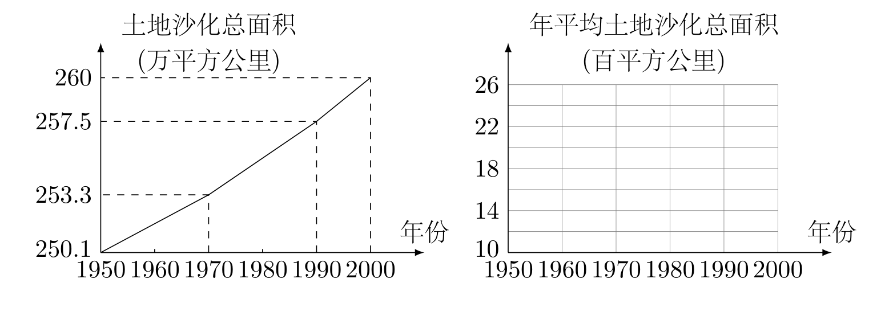
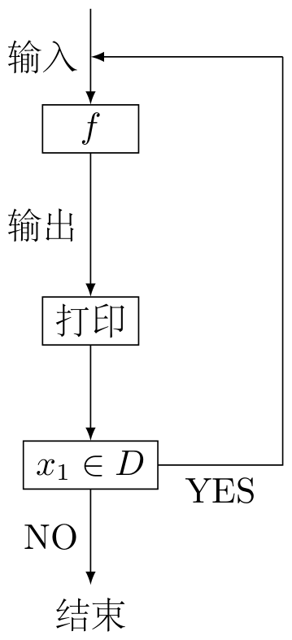

# 2001年上海卷（秋理）

## 填空题

### 第 1 题

设函数

$$

f(x)=\begin{cases}
2^{-x},&x\in(-\infty,1]\\
\log_{81}x,&x\in(1,+\infty)
\end{cases}

$$

，则满足 $f(x)=\frac14$ 的 $x$ 值为＿＿＿＿＿＿.

#### 答案

$3$

#### 解析

当 $x\leqslant1$ 时，$2^{-x}=\frac14=2^{-2}$，所以 $-x=-2$，即 $x=2$，但 $2\notin(-\infty,1]$，舍去. 当 $x>1$ 时，$\log_{81}x=\frac14$，所以 $x=81^{1/4}=3$，且满足定义域条件. 因此填 $3$.

### 第 2 题

设数列 $\{a_n\}$ 的通项为 $a_n=2n-7$（$n\in\mathbb{N}$），则 $|a_1|+|a_2|+\dots+|a_{10}|=$＿＿＿＿＿＿.

#### 答案

$58$

#### 解析

由 $a_n=2n-7$ 可知 $a_1=-5$，$a_2=-3$，$a_3=-1$，且当 $4\leqslant n\leqslant10$ 时 $a_n>0$. 因此 $|a_1|+\cdots+|a_{10}|=(5+3+1)+\sum_{n=4}^{10}(2n-7)=9+\left(2\cdot\frac{(4+10)\cdot7}{2}-7\cdot7\right)=9+49=58$.

### 第 3 题

设 $P$ 为双曲线 $\frac{x^2}{4}-y^2=1$ 上一动点，$O$ 为坐标原点，$M$ 为线段 $OP$ 的中点，则点 $M$ 的轨迹方程为＿＿＿＿＿＿.

#### 答案

$x^2-4y^2=1$

#### 解析

设 $P=(u,v)$，则 $\frac{u^2}{4}-v^2=1$. 由于 $M$ 是 $OP$ 的中点，设 $M=(x,y)$，于是 $u=2x$，$v=2y$. 代入双曲线方程得 $x^2-4y^2=1$. 反之，轨迹上任一点 $(x,y)$ 取 $P=(2x,2y)$ 即满足原双曲线方程，所以轨迹方程为 $x^2-4y^2=1$.

### 第 4 题

设集合 $A=\{x\mid2\lg x=\lg(8x-15),x\in\mathbb{R}\}$，$B=\{x\mid\cos\frac{x}{2}>0,x\in\mathbb{R}\}$，则 $A\cap B$ 的元素个数为＿＿＿＿＿＿ 个.

#### 答案

$1$

#### 解析

由对数定义域得 $x>0$ 且 $8x-15>0$，即 $x>\frac{15}{8}$. 在此条件下，$2\lg x=\lg x^2$，故 $x^2=8x-15$，即 $(x-3)(x-5)=0$. 所以 $A=\{3,5\}$. 因为 $0<\frac32<\frac\pi2$，有 $\cos\frac32>0$；又因为 $\frac\pi2<\frac52<\pi$，有 $\cos\frac52<0$. 故 $A\cap B=\{3\}$，元素个数为 $1$.

### 第 5 题

抛物线 $x^2-4y-3=0$ 的焦点坐标为＿＿＿＿＿＿.

#### 答案

$\left(0,\frac14\right)$

#### 解析

原方程可化为 $x^2=4\left(y+\frac34\right)$，与标准方程 $x^2=4p(y-k)$ 比较得 $p=1$，$k=-\frac34$. 因此焦点为 $(0,k+p)=\left(0,\frac14\right)$.

### 第 6 题

设数列 $\{a_n\}$ 是公比 $q>0$ 的等比数列，$S_n$ 是它的前 $n$ 项和. $\displaystyle\lim_{n\to\infty}S_n=7$，则此数列的首项 $a_1$ 的取值范围是＿＿＿＿＿＿.

#### 答案

$(0,7)$

#### 解析

若 $q\geqslant1$，则 $S_n$ 不可能收敛到非零有限值：$q=1$ 时 $S_n=na_1$，$q>1$ 时 $S_n=\frac{a_1(q^n-1)}{q-1}$，除非 $a_1=0$ 否则均不收敛，而 $a_1=0$ 又使极限为 $0$. 故必须有 $0<q<1$，此时 $\displaystyle\lim_{n\to\infty}S_n=\frac{a_1}{1-q}=7$，所以 $a_1=7(1-q)$. 因而 $0<a_1<7$. 反之，任取 $a_1\in(0,7)$，令 $q=1-\frac{a_1}{7}\in(0,1)$，即可满足条件. 因此取值范围为 $(0,7)$.

### 第 7 题

某餐厅供应客饭，每位顾客可以在餐厅提供的菜肴中任选 $2$ 荤 $2$ 素共 $4$ 种不同的品种. 现在餐厅准备了 $5$ 种不同的荤菜，若要保证每位顾客有 $200$ 种以上不同的选择，则餐厅至少还需要准备不同的素菜品种＿＿＿＿＿＿ 种. （结果用数值表示）

#### 答案

$7$

#### 解析

设素菜有 $m$ 种，则不同选择的总数为 $\mathrm C_5^2\mathrm C_m^2=10\mathrm C_m^2$. 当 $m\leqslant6$ 时，$\mathrm C_m^2\leqslant\mathrm C_6^2=15$，选择数至多为 $150<200$；当 $m=7$ 时，选择数为 $10\times\mathrm C_7^2=210\geqslant200$. 所以至少需要 $7$ 种素菜.

### 第 8 题

在代数式 $(4x^2-2x-5)\left(1+\frac1{x^2}\right)^5$ 的展开式中，常数项为＿＿＿＿＿＿.

#### 答案

$15$

#### 解析

在 $\left(1+\frac1{x^2}\right)^5$ 中，$k=0$，$1$，$\ldots$，$5$ 时含 $x^{-2k}$ 的项为 $\mathrm C_5^k x^{-2k}$. 与 $4x^2$ 相乘成为常数项时需 $2-2k=0$，即 $k=1$，贡献 $4\mathrm C_5^1=20$；与 $-2x$ 相乘时需 $1-2k=0$，不存在整数 $k$；与 $-5$ 相乘成为常数项时需 $k=0$，贡献 $-5$. 所以常数项为 $20-5=15$.

### 第 9 题

设 $x=\sin\alpha$，$\alpha\in\left[-\frac\pi6,\frac{5\pi}6\right]$，则 $\arccos x$ 的取值范围为＿＿＿＿＿＿.

#### 答案

$\left[0,\frac{2\pi}{3}\right]$

#### 解析

在 $\left[-\frac\pi6,\frac{5\pi}6\right]$ 上，$\sin\alpha$ 的最小值为 $-\frac12$，最大值为 $1$，故 $x\in\left[-\frac12,1\right]$. 由于 $\arccos x$ 在 $[-1,1]$ 上单调递减，$\arccos x$ 的最小值为 $\arccos1=0$，最大值为 $\arccos\left(-\frac12\right)=\frac{2\pi}3$. 所以取值范围为 $\left[0,\frac{2\pi}{3}\right]$.

### 第 10 题

直线 $y=2x-\frac12$ 与曲线

$$

\begin{cases}
x=\sin\varphi,\\
y=\cos2\varphi
\end{cases}

$$

（$\varphi$ 为参数）的交点坐标为＿＿＿＿＿＿.

#### 答案

$\left(\frac12,\frac12\right)$

#### 解析

由 $x=\sin\varphi$ 得 $y=\cos2\varphi=1-2\sin^2\varphi=1-2x^2$. 联立直线方程得 $1-2x^2=2x-\frac12$，即 $4x^2+4x-3=0$，所以 $x=\frac12$ 或 $x=-\frac32$. 因 $x=\sin\varphi\in[-1,1]$，舍去 $x=-\frac32$，从而 $y=2\times\frac12-\frac12=\frac12$. 交点为 $\left(\frac12,\frac12\right)$.

### 第 11 题

已知两个圆：

1.  $x^2+y^2=1$；

2.  $x^2+(y-3)^2=1$.

由前一个方程减去后一个方程可得上述两圆的对称轴方程. 将上述命题在曲线的情况下加以推广，即要求得到一个更一般的命题，而已知命题应成为所推广命题的一个特例，推广的命题为＿＿＿＿＿＿.

#### 答案

若两圆方程为 $(x-a)^2+(y-b)^2=r^2$ 与 $(x-c)^2+(y-d)^2=r^2$，且 $a\ne c$ 或 $b\ne d$，则由两式相减可得两圆的对称轴方程.

#### 解析

设两圆方程为 $(x-a)^2+(y-b)^2=r^2$ 和 $(x-c)^2+(y-d)^2=r^2$，且圆心不同，即 $a\ne c$ 或 $b\ne d$. 两式相减，平方项和半径项消去，得到 $2(c-a)x+2(d-b)y+a^2+b^2-c^2-d^2=0$. 该直线是两圆圆心连线的垂直平分线，也就是两圆的对称轴. 取 $a=b=0$，$c=0$，$d=3$，$r=1$ 即得到题中的两个圆，所以这是所要求的推广命题.

### 第 12 题

据报道，我国目前已成为世界上受荒漠化危害最严重的国家之一. 下左图表示我国土地沙化总面积在上个世纪五六十年代，七八十年代，九十年代的变化情况. 由图中的相关信息，可将上述有关年代中，我国年平均土地沙化面积在右下图中图示为：＿＿＿＿＿＿

#### 答案

阶梯图在 $1950$ 至 $1970$、$1970$ 至 $1990$、$1990$ 至 $2000$ 年间的纵坐标分别为 $16$、$21$、$25$（百平方公里）.

#### 解析

由图可知，$1950$ 至 $1970$ 年土地沙化总面积增加 $253.3-250.1=3.2$ 万平方公里，年平均增加 $3.2\div20=0.16$ 万平方公里. 因为 $1$ 万平方公里等于 $100$ 百平方公里，所以对应高度为 $16$ 百平方公里；$1970$ 至 $1990$ 年年平均增加 $(257.5-253.3)\div20=0.21$ 万平方公里，即 $21$ 百平方公里；$1990$ 至 $2000$ 年年平均增加 $(260-257.5)\div10=0.25$ 万平方公里，即 $25$ 百平方公里. 因此右图三个时间段的阶梯高度依次为 $16$、$21$、$25$ 百平方公里.

## 单选题

### 第 13 题

$a=3$ 是直线 $ax+2y+3a=0$ 和直线 $3x+(a-1)y=a-7$ 平行且不重合的（）

A.  
充分非必要条件

B.  
必要非充分条件

C.  
充要条件

D.  
既非充分也非必要条件

#### 答案

C

#### 解析

当 $a=3$ 时，两直线分别为 $3x+2y+9=0$ 和 $3x+2y+4=0$，所以平行且不重合. 反之，两直线平行需要满足 $a(a-1)-2\times3=0$，即 $a^2-a-6=0$，解得 $a=3$ 或 $a=-2$. 当 $a=-2$ 时，两直线都化为 $-x+y-3=0$，重合，不符合“不重合”. 所以平行且不重合等价于 $a=3$，故选 C.

### 第 14 题

在平行六面体 $ABCD-A_1B_1C_1D_1$ 中，$M$ 为 $AC$ 与 $BD$ 的交点，若 $\overrightarrow{A_1B_1}=\bs a$，$\overrightarrow{A_1D_1}=\bs b$，$\overrightarrow{A_1A}=\bs c$，则下列向量中与 $\overrightarrow{B_1M}$ 相等的向量是（）

A.  
$-\frac12\bs a+\frac12\bs b+\bs c$

B.  
$\frac12\bs a+\frac12\bs b+\bs c$

C.  
$\frac12\bs a-\frac12\bs b+\bs c$

D.  
$-\frac12\bs a-\frac12\bs b+\bs c$

#### 答案

A

#### 解析

以 $A_1$ 为向量起点，则 $\overrightarrow{A_1B_1}=\bs a$，$\overrightarrow{A_1D_1}=\bs b$，$\overrightarrow{A_1A}=\bs c$. 于是 $\overrightarrow{A_1C}=\bs a+\bs b+\bs c$，$M$ 是 $AC$ 的中点，故 $\overrightarrow{A_1M}=\frac12\bs a+\frac12\bs b+\bs c$. 因此 $\overrightarrow{B_1M}=\overrightarrow{A_1M}-\overrightarrow{A_1B_1}=-\frac12\bs a+\frac12\bs b+\bs c$，故选 A.

### 第 15 题

已知 $a$，$b$ 为两条不同的直线，$\alpha$，$\beta$ 为两个不同的平面，且 $a\perp\alpha$，$b\perp\beta$，则下列命题中的假命题是（）

A.  
若 $a\parallel b$，则 $\alpha\parallel\beta$

B.  
若 $\alpha\perp\beta$，则 $a\perp b$

C.  
若 $a$，$b$ 相交，则 $\alpha$，$\beta$ 相交

D.  
若 $\alpha$，$\beta$ 相交，则 $a$，$b$ 相交

#### 答案

D

#### 解析

直线垂直于平面就是该平面的法线方向. 若 $a\parallel b$，两平面的法线方向平行，因两平面不同，故 $\alpha\parallel\beta$；若 $\alpha\perp\beta$，两平面的法线互相垂直，故 $a\perp b$. 若 $a$，$b$ 相交而 $\alpha$，$\beta$ 不相交，则两平面平行，从而其法线方向平行，导致 $a\parallel b$，矛盾，所以 $\alpha$，$\beta$ 相交.

命题 D 不成立. 例如取 $\alpha:z=0$，$\beta:x=0$，它们相交；取 $a$ 为 $z$ 轴，取 $b$ 为直线 $y=1$，$z=1$ 且平行于 $x$ 轴，则 $a\perp\alpha$，$b\perp\beta$，但 $a$，$b$ 是异面直线而不相交. 因此假命题为 D.

### 第 16 题

用计算器验算函数 $y=\frac{\lg x}{x}$（$x>1$）的若干个值，可以猜想下列命题中的真命题只能是（）

A.  
$y=\frac{\lg x}{x}$ 在 $(1,+\infty)$ 上是单调减函数

B.  
$y=\frac{\lg x}{x}$，$x\in(1,+\infty)$ 的值域为 $\left(0,\frac{\lg3}{3}\right]$

C.  
$y=\frac{\lg x}{x}$，$x\in(1,+\infty)$ 有最小值

D.  
$\displaystyle\lim_{n\to+\infty}\frac{\lg n}{n}=0$，$n\in\mathbb{N}$

#### 答案

D

#### 解析

记 $g(x)=\frac{\lg x}{x}$. 有 $g(2)=\frac{\lg2}{2}<\frac{\lg3}{3}=g(3)$，因为 $\lg8<\lg9$，所以选项 A 错. 又 $g'(x)=\frac{1-\ln x}{x^2\ln10}$，故 $g$ 在 $(1,\e)$ 上递增、在 $(\e,+\infty)$ 上递减；由于 $1<\e<3$，$g(\e)>g(3)$，所以选项 B 给出的最大值也不正确. 又 $g(x)>0$，但当 $x\to1^+$ 时 $g(x)\to0$，因此 $g$ 没有最小值，选项 C 错.

对任意 $\varepsilon>0$，取正整数 $M>\max\left\{2,\frac{8}{81\varepsilon}\right\}$. 当 $n\geqslant10^M$ 时，令 $m=\lfloor\lg n\rfloor$，则 $m\geqslant M$，且 $10^m\leqslant n<10^{m+1}$. 因而

$$

0\leqslant\frac{\lg n}{n}\leqslant\frac{m+1}{10^m}

$$

由二项式定理，$10^m=(1+9)^m\geqslant\mathrm C_m^2 9^2=\frac{81m(m-1)}2$. 当 $m\geqslant2$ 时，$m+1\leqslant2m$，$m-1\geqslant\frac m2$，所以

$$

0\leqslant\frac{\lg n}{n}\leqslant\frac{m+1}{10^m}\leqslant\frac{8}{81m}\leqslant\frac{8}{81M}<\varepsilon

$$

这证明 $\displaystyle\lim_{n\to+\infty}\frac{\lg n}{n}=0$. 因此只有选项 D 正确，故选 D.

## 解答题

### 第 17 题

已知 $a$，$b$，$c$ 是 $\triangle ABC$ 中 $\angle A$，$\angle B$，$\angle C$ 的对边，$S$ 是 $\triangle ABC$ 的面积. 若 $a=4$，$b=5$，$S=5\sqrt3$，求 $c$ 的长度.

#### 解析

由三角形面积公式 $S=\frac12ab\sin C$，得 $5\sqrt3=\frac12\times4\times5\sin C$，即 $\sin C=\frac{\sqrt3}{2}$. 因为 $0<C<\pi$，故 $C=\frac\pi3$ 或 $C=\frac{2\pi}3$. 由余弦定理 $c^2=a^2+b^2-2ab\cos C$. 当 $C=\frac\pi3$ 时，$c^2=16+25-40\times\frac12=21$，所以 $c=\sqrt{21}$；当 $C=\frac{2\pi}3$ 时，$c^2=16+25-40\times\left(-\frac12\right)=61$，所以 $c=\sqrt{61}$. 这两种情形分别由两边及其夹角确定一个三角形，且 $1<\sqrt{21}<9$、$1<\sqrt{61}<9$，均满足三角形边长条件，故 $c=\sqrt{21}$ 或 $c=\sqrt{61}$.

### 第 18 题

设 $F_1$，$F_2$ 为椭圆 $\frac{x^2}{9}+\frac{y^2}{4}=1$ 的两个焦点，$P$ 为椭圆上的一点. 已知 $P$，$F_1$，$F_2$ 是一个直角三角形的三个顶点，且 $|PF_1|>|PF_2|$. 求 $\frac{|PF_1|}{|PF_2|}$ 的值.

#### 解析

椭圆的长半轴为 $3$，短半轴为 $2$，焦距半长为 $\sqrt{3^2-2^2}=\sqrt5$，所以 $|F_1F_2|=2\sqrt5$. 设 $r_1=|PF_1|$，$r_2=|PF_2|$，则椭圆定义给出 $r_1+r_2=6$，且 $r_1>r_2$. 若直角在 $P$，则 $r_1^2+r_2^2=20$. 由 $(r_1+r_2)^2=36$ 得 $r_1r_2=8$，所以 $r_1$，$r_2$ 是 $t^2-6t+8=0$ 的两个根，即 $r_1=4$，$r_2=2$，比值为 $2$. 若直角在 $F_2$，则 $r_1^2=r_2^2+20$，从而 $(r_1-r_2)(r_1+r_2)=20$，即 $r_1-r_2=\frac{10}{3}$. 结合 $r_1+r_2=6$ 得 $r_1=\frac{14}{3}$，$r_2=\frac43$，比值为 $\frac72$. 若直角在 $F_1$，则 $r_2^2=r_1^2+20$，从而 $r_2>r_1$，与已知 $r_1>r_2$ 矛盾. 前两种情形所得距离均满足 $|r_1-r_2|<2\sqrt5<r_1+r_2$，故确能构成相应三角形. 因此 $\frac{|PF_1|}{|PF_2|}=2$ 或 $\frac72$.

### 第 19 题

在棱长为 $a$ 的正方体 $OABC-O'A'B'C'$ 中，$E$，$F$ 分别是棱 $AB$，$BC$ 上的动点，且 $AE=BF$.

1.  求证：$A'F\perp C'E$；

2.  当三棱锥 $B'-BEF$ 的体积取得最大值时，求二面角 $B'-EF-B$ 的大小. （结果用反三角函数表示）

#### 解析

建立空间直角坐标系，取 $A=(0,0,0)$，$B=(a,0,0)$，$C=(a,a,0)$，$A'=(0,0,a)$，$B'=(a,0,a)$，$C'=(a,a,a)$. 设 $AE=BF=x$，则 $0\leqslant x\leqslant a$，且 $E=(x,0,0)$，$F=(a,x,0)$.

1.  有 $\overrightarrow{A'F}=(a,x,-a)$，$\overrightarrow{C'E}=(x-a,-a,-a)$，故 $\overrightarrow{A'F}\cdot\overrightarrow{C'E}=a(x-a)-ax+a^2=0$. 因此 $A'F\perp C'E$.

2.  三角形 $BEF$ 在底面内，且 $BE=a-x$，$BF=x$，两边互相垂直. 三棱锥的高为 $a$，所以 $V=\frac13\cdot\frac12x(a-x)\cdot a=\frac a6x(a-x)$. 由 $x(a-x)\leqslant\frac{a^2}{4}$，等号当且仅当 $x=\frac a2$，故体积最大时 $E$，$F$ 分别为 $AB$，$BC$ 的中点.

    此时 $\overrightarrow{EF}=\left(\frac a2,\frac a2,0\right)$，$\overrightarrow{EB'}=\left(\frac a2,0,a\right)$. 平面 $B'EF$ 的一个法向量可取 $\overrightarrow{n_1}=\overrightarrow{EF}\times\overrightarrow{EB'}=\left(\frac{a^2}{2},-\frac{a^2}{2},-\frac{a^2}{4}\right)$，平面 $BEF$ 的法向量为 $\overrightarrow{n_2}=(0,0,1)$. 设所求二面角的锐角为 $\theta$，则 $\cos\theta=\frac{|\overrightarrow{n_1}\cdot\overrightarrow{n_2}|}{|\overrightarrow{n_1}|\,|\overrightarrow{n_2}|}=\frac{a^2/4}{(3a^2/4)\cdot1}=\frac13$，从而 $\tan\theta=2\sqrt2$. 因此二面角大小为 $\arctan(2\sqrt2)$.

### 第 20 题

对任意一个非零复数 $z$，定义集合 $M_z=\{\omega\mid\omega=z^{2n-1},n\in\mathbb{N}\}$.

1.  设 $a$ 是方程 $x+\frac1x=\sqrt2$ 的一个根，试用列举法表示集合 $M_a$. 若在 $M_a$ 中任取两个数，求其和为零的概率 $P$；

2.  设复数 $\omega\in M_z$，求证：$M_\omega\subset M_z$.

#### 解析

1.  方程 $x+\frac1x=\sqrt2$ 等价于 $x^2-\sqrt2x+1=0$，所以 $a=\frac{\sqrt2}{2}(1+\i)$ 或 $a=\frac{\sqrt2}{2}(1-\i)$. 无论取哪一个根，都有 $a^4=-1$，从而奇次幂只产生四个不同的值：$M_a=\left\{\frac{\sqrt2}{2}(1+\i),\frac{\sqrt2}{2}(1-\i),-\frac{\sqrt2}{2}(1+\i),-\frac{\sqrt2}{2}(1-\i)\right\}$. 四个数中互为相反数的无序数对有 $2$ 个；从四个不同数中不放回任取两个且不计顺序，共有 $\mathrm C_4^2=6$ 个等可能结果，故 $P=\frac{2}{6}=\frac13$.

2.  任取 $\eta\in M_\omega$，则存在 $n\in\mathbb{N}$ 使 $\eta=\omega^{2n-1}$. 又因 $\omega\in M_z$，存在 $m\in\mathbb{N}$ 使 $\omega=z^{2m-1}$. 令 $k=\frac{(2m-1)(2n-1)+1}{2}\in\mathbb{N}$，则 $(2m-1)(2n-1)=2k-1$，所以 $\eta=z^{2k-1}\in M_z$. 因此 $M_\omega\subset M_z$.

### 第 21 题

用水清洗一堆蔬菜上残留的农药，对用一定量的水清洗一次的效果作如下假定：用 $1$ 个单位量的水可洗掉蔬菜上残留农药用量的 $\frac12$，用水越多洗掉的农药量也越多，但总还有农药残留在蔬菜上. 设用 $x$ 单位量的水清洗一次以后，蔬菜上残留的农药与本次清洗前残留有农药量之比为函数 $f(x)$.

1.  试规定 $f(0)$ 的值，并解释其实际意义；

2.  试根据假定写出函数 $f(x)$ 应该满足的条件和具有的性质；

3.  设 $f(x)=\frac{1}{1+x^2}$，现有 $a$（$a>0$）单位量的水，可以清洗一次，也可以把水平均分成 $2$ 份后清洗两次. 试问用哪种方案清洗后蔬菜上的农药量比较少？说明理由.

#### 解析

1.  没有用水时残留农药量不变，所以规定 $f(0)=1$，表示不进行清洗时清洗后与清洗前的残留量之比为 $1$.

2.  水量 $x$ 的取值范围为 $[0,+\infty)$. 由题意，$f(0)=1$，$f(1)=\frac12$；用水越多，洗掉的农药越多，所以清洗后残留量占清洗前残留量的比例越小，$f$ 在 $[0,+\infty)$ 上严格递减；又总有农药残留，所以对每个有限的 $x\geqslant0$，$0<f(x)\leqslant1$.

3.  设清洗前残留量为 $R>0$. 一次清洗后的残留量为 $R_1=\frac{R}{1+a^2}$；分两次、每次用水 $\frac a2$ 后，残留量为 $R_2=R\left[\frac{1}{1+(a/2)^2}\right]^2=\frac{16R}{(a^2+4)^2}$. 于是 $R_1-R_2=\frac{Ra^2(a^2-8)}{(1+a^2)(a^2+4)^2}$. 因此，当 $a>2\sqrt2$ 时 $R_1>R_2$，两次清洗较好；当 $a=2\sqrt2$ 时两种方案效果相同；当 $0<a<2\sqrt2$ 时 $R_1<R_2$，一次清洗较好.

### 第 22 题

对任意函数 $f(x)$，$x\in D$，可按图示构造一个数列发生器，其工作原理如下：

1.  输入数据 $x_0\in D$，经数列发生器输出 $x_1=f(x_0)$；

2.  若 $x_1\notin D$，则数列发生器结束工作；若 $x_1\in D$，则将 $x_1$ 反馈回输入端，再输出 $x_2=f(x_1)$，并依此规律继续下去. 现定义 $f(x)=\frac{4x-2}{x+1}$.

<!-- -->

1.  若输入 $x_0=\frac{49}{65}$，则由数列发生器产生数列 $\{x_n\}$. 请写出数列 $\{x_n\}$ 的所有项；

2.  若要数列发生器产生一个无穷的常数数列，试求输入的初始数据 $x_0$ 的值；

3.  若输入 $x_0$ 时，产生的无穷数列 $\{x_n\}$ 满足：对任意正整数 $n$ 均有 $x_n<x_{n+1}$，求 $x_0$ 的取值范围.

#### 解析

函数的定义域为 $D=\mathbb{R}\backslash\{-1\}$.

1.  逐项计算得 $x_1=f\left(\frac{49}{65}\right)=\frac{11}{19}$，$x_2=f\left(\frac{11}{19}\right)=\frac15$，$x_3=f\left(\frac15\right)=-1$. 由于 $x_3\notin D$，发生器停止，所以所有项为 $\frac{49}{65}$，$\frac{11}{19}$，$\frac15$，$-1$.

2.  常数数列要求 $f(x_0)=x_0$，且后续各项仍在 $D$. 解 $\frac{4x_0-2}{x_0+1}=x_0$ 得 $x_0^2-3x_0+2=0$，所以 $x_0=1$ 或 $x_0=2$. 两值均不等于 $-1$，且均为不动点，故都能产生无穷的常数数列.

3.  对 $x\ne-1$，有 $f(x)-x=-\frac{(x-1)(x-2)}{x+1}$. 因此 $x<f(x)$ 当且仅当 $x<-1$ 或 $1<x<2$. 若 $x_1<-1$，则 $f(x_1)-2=\frac{2(x_1-2)}{x_1+1}>0$，即 $x_2>2$，从而 $x_2<x_3$ 不成立. 所以必须有 $x_1\in(1,2)$. 而当 $1<x<2$ 时，$f(x)-1=\frac{3(x-1)}{x+1}>0$，$f(x)-2=\frac{2(x-2)}{x+1}<0$，故 $f$ 将 $(1,2)$ 映射到自身，且每一步严格增加. 最后，$x_1=f(x_0)\in(1,2)$ 等价于 $\frac{3(x_0-1)}{x_0+1}>0$ 且 $\frac{2(x_0-2)}{x_0+1}<0$，解得 $x_0\in(1,2)$.
