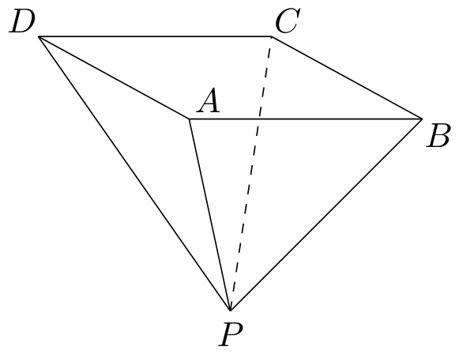
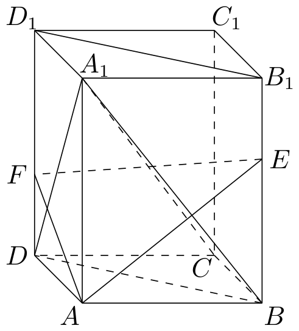

# 2001年上海卷（春）

## 填空题

### 第 1 题

函数 $f(x)=x^{2}+1$（$x\leqslant 0$）的反函数 $f^{-1}(x)=\underline{\qquad\qquad}$.

#### 答案

$-\sqrt{x-1}$（$x\geqslant1$）

#### 解析

设 $y=f(x)=x^{2}+1$，且 $x\leqslant0$. 因为 $x\leqslant0$，所以由 $y=x^{2}+1$ 解得 $x=-\sqrt{y-1}$，同时 $y\geqslant1$. 交换 $x$，$y$ 后，得到反函数为 $f^{-1}(x)=-\sqrt{x-1}$，定义域为 $x\geqslant1$.

### 第 2 题

若复数 $z$ 满足方程 $z\i=\i-1$（$\i$ 是虚数单位），则 $z=\underline{\qquad\qquad}$.

#### 答案

$1+\i$

#### 解析

由 $z\i=\i-1$，两边同除以 $\i$，得 $z=\dfrac{\i-1}{\i}=1-\dfrac{1}{\i}=1+\i$，其中用到了 $\dfrac{1}{\i}=-\i$.

### 第 3 题

函数 $y=\frac{\sin x}{1-\cos x}$ 的最小正周期为＿＿＿＿＿＿.

#### 答案

$2\pi$

#### 解析

函数的定义域满足 $1-\cos x\ne0$，即 $x\ne2k\pi$（$k\in\mathbb{Z}$）. 在定义域内，$\dfrac{\sin x}{1-\cos x}=\dfrac{2\sin\frac{x}{2}\cos\frac{x}{2}}{2\sin^{2}\frac{x}{2}}=\cot\frac{x}{2}$. 函数 $\cot t$ 的最小正周期为 $\pi$，所以 $\cot\frac{x}{2}$ 的最小正周期为 $2\pi$，且这也保持了原函数的定义域.

### 第 4 题

二项式 $\left(x+\frac{1}{x}\right)^{6}$ 的展开式中常数项的值为＿＿＿＿＿＿.

#### 答案

$20$

#### 解析

展开式的通项为 $\mathrm C_6^k x^{6-k}\left(\dfrac{1}{x}\right)^k=\mathrm C_6^k x^{6-2k}$. 要得到常数项，必须有 $6-2k=0$，所以 $k=3$. 因此常数项的值为 $\mathrm C_6^3=20$.

### 第 5 题

若双曲线的一个顶点坐标为 $(3,0)$，焦距为 $10$，则它的标准方程为＿＿＿＿＿＿.

#### 答案

$\dfrac{x^{2}}{9}-\dfrac{y^{2}}{16}=1$

#### 解析

顶点为 $(3,0)$ 表明双曲线的焦点轴为 $x$ 轴，且 $a=3$. 焦距为 $10$，所以 $2c=10$，即 $c=5$. 由双曲线关系 $c^{2}=a^{2}+b^{2}$，得 $b^{2}=25-9=16$. 因此标准方程为 $\dfrac{x^{2}}{9}-\dfrac{y^{2}}{16}=1$.

### 第 6 题

圆心在直线 $y=x$ 上且与 $x$ 轴相切于点 $(1,0)$ 的圆的方程为＿＿＿＿＿＿.

#### 答案

$(x-1)^{2}+(y-1)^{2}=1$

#### 解析

圆与 $x$ 轴相切于 $(1,0)$，所以圆心的横坐标为 $1$，且圆心到切点的连线垂直于 $x$ 轴. 设圆心为 $(1,r)$，则半径为 $|r|$. 又圆心在 $y=x$ 上，故 $r=1$. 因此圆心为 $(1,1)$，半径为 $1$，圆的方程为 $(x-1)^{2}+(y-1)^{2}=1$.

### 第 7 题

计算：$\displaystyle\lim_{n\to\infty}\left(\frac{n+3}{n+1}\right)^{n}=\underline{\qquad\qquad}$.

#### 答案

$\e^{2}$

#### 解析

将底数化为 $1+\dfrac{2}{n+1}$，则

$$

\displaystyle\lim_{n\to\infty}\left(\frac{n+3}{n+1}\right)^{n}=\lim_{n\to\infty}\left(1+\frac{2}{n+1}\right)^{n}=\lim_{n\to\infty}\left[\left(1+\frac{2}{n+1}\right)^{\frac{n+1}{2}}\right]^{\frac{2n}{n+1}}=\e^{2}

$$

### 第 8 题

若向量 $\alpha$，$\beta$ 满足 $|\alpha+\beta|=|\alpha-\beta|$，则 $\alpha$ 与 $\beta$ 所成角的大小为＿＿＿＿＿＿.

#### 答案

$\dfrac{\pi}{2}$

#### 解析

将已知等式两边平方，得 $|\alpha|^{2}+2\alpha\cdot\beta+|\beta|^{2}=|\alpha|^{2}-2\alpha\cdot\beta+|\beta|^{2}$，所以 $\alpha\cdot\beta=0$. 设两向量所成的角为 $\theta$，则 $\alpha\cdot\beta=|\alpha||\beta|\cos\theta$. 由于向量夹角有定义，$|\alpha|$ 与 $|\beta|$ 均不为零，故 $\cos\theta=0$，从而 $\theta=\dfrac{\pi}{2}$.

### 第 9 题

在大小相同的 $6$ 个球中，$2$ 个红球，$4$ 个是白球. 若从中任意选取 $3$ 个，则所选的 $3$ 个球中至少有 $1$ 个红球的概率是＿＿＿＿＿＿.（结果用分数表示）

#### 答案

$\dfrac{4}{5}$

#### 解析

从 $6$ 个球中任取 $3$ 个的总取法数为 $\mathrm C_6^3$. 不含红球的取法是从 $4$ 个白球中取出 $3$ 个，共有 $\mathrm C_4^3$ 种. 因此至少含有一个红球的概率为 $1-\dfrac{\mathrm C_4^3}{\mathrm C_6^3}=1-\dfrac{4}{20}=\dfrac{4}{5}$.

### 第 10 题

若记号“\*”表示求两个实数 $a$ 与 $b$ 的算术平均数的运算，即 $a\ast b=\frac{a+b}{2}$，则两边均含有运算符号“\*”和“+”，且对于任意 $3$ 个实数 $a$，$b$，$c$ 都能成立的一个等式可以是＿＿＿＿＿＿.

#### 答案

$a\ast b+b\ast c=a\ast c+b$

#### 解析

取等式 $a\ast b+b\ast c=a\ast c+b$. 由运算定义，等式左边为 $\dfrac{a+b}{2}+\dfrac{b+c}{2}=\dfrac{a+2b+c}{2}$，右边为 $\dfrac{a+c}{2}+b=\dfrac{a+2b+c}{2}$. 两边恒相等，所以该等式对任意实数 $a$，$b$，$c$ 都成立，且两边均含有“\*”和“+”.

### 第 11 题

关于 $x$ 的函数 $f(x)=\sin(x+\varphi)$ 有以下命题：

1.  对任意的 $\varphi$，$f(x)$ 都是非奇非偶函数；

2.  不存在 $\varphi$，使 $f(x)$ 既是奇函数，又是偶函数；

3.  存在 $\varphi$，使 $f(x)$ 是奇函数；

4.  对任意的 $\varphi$，$f(x)$ 都不是偶函数.

其中一个假命题的序号是＿＿＿＿＿＿. 因为当 $\varphi=\underline{\qquad\qquad}$ 时，该命题的结论不成立.

#### 答案

序号为 $1$，取 $\varphi=k\pi$（$k\in\mathbb{Z}$）.

#### 解析

函数的定义域为 $\mathbb{R}$，故可直接按奇、偶函数定义判断. 先计算 $f(-x)=\sin(\varphi-x)=\sin\varphi\cos x-\cos\varphi\sin x$，而 $-f(x)=-\sin(x+\varphi)=-\sin\varphi\cos x-\cos\varphi\sin x$，$f(x)=f(-x)$ 等价于 $2\cos\varphi\sin x=0$ 对任意 $x$ 成立，故 $f$ 为偶函数的充要条件是 $\cos\varphi=0$，即 $\varphi=\dfrac{\pi}{2}+k\pi$（$k\in\mathbb{Z}$）. 同理，$f(-x)=-f(x)$ 等价于 $2\sin\varphi\cos x=0$ 对任意 $x$ 成立，故 $f$ 为奇函数的充要条件是 $\sin\varphi=0$，即 $\varphi=k\pi$（$k\in\mathbb{Z}$）. 两个条件不可能同时成立，因为 $\sin\varphi$ 与 $\cos\varphi$ 不可能同时为零.

因此命题（2）正确，命题（3）正确，命题（4）错误，例如取 $\varphi=\dfrac{\pi}{2}$ 时，$f(x)=\cos x$ 是偶函数；命题（1）也错误，例如取 $\varphi=0$ 时，$f(x)=\sin x$ 是奇函数. 题目要求填写一个假命题，故可填命题序号 $1$，并取 $\varphi=0$.

### 第 12 题

甲，乙两人于同一天分别携款 $1\text{ 万元}$ 到银行储蓄，甲存五年期定期储蓄，年利率为 $2.88\%$. 乙存一年期定期储蓄，年利率为 $2.25\%$，并在每年到期时将本息续存一年期定期储蓄. 按规定每次计息时，储户须交纳利息的 $20\%$ 作为利息税，若存满五年后两人同时从银行取出存款，则甲与乙所得本息之和的差为＿＿＿＿＿＿元.（假定利率五年内保持不变，结果精确到 $1$ 分）

#### 答案

$219.01$

#### 解析

本金为 $10000\text{ 元}$. 甲存五年期定期储蓄，五年获得的税前利息为 $10000\times5\times2.88\%$，扣除其中的 $20\%$ 利息税后，甲取出的本息为 $A=10000\left[1+5\times2.88\%\times\left(1-20\%\right)\right]=11152\text{ 元}$.

乙每年获得的税后利率为 $2.25\%\times(1-20\%)=1.8\%$，每年将本息续存，因此五年后取出的本息为 $B=10000(1+1.8\%)^5=10000\times1.018^5=10932.988468\text{ 元}$.

所以两人所得本息之和的差为 $A-B=11152-10932.988468=219.011532\text{ 元}$，精确到 $1$ 分为 $219.01\text{ 元}$.

## 单选题

### 第 13 题

若 $a$，$b$ 为实数，则 $a>b>0$ 是 $a^{2}>b^{2}$ 的（）

A.  
充分不必要条件

B.  
必要不充分条件

C.  
充要条件

D.  
既非充分条件也非必要条件

#### 答案

A

#### 解析

由 $a>b>0$ 可知 $a-b>0$，且 $a+b>0$，所以 $a^{2}-b^{2}=(a-b)(a+b)>0$，即 $a^{2}>b^{2}$. 反过来，取 $a=2$，$b=-1$，虽然 $a^{2}>b^{2}$，但不满足 $a>b>0$. 因此 $a>b>0$ 是 $a^{2}>b^{2}$ 的充分不必要条件，选 A.

### 第 14 题

若直线 $x=1$ 的倾斜角为 $\alpha$，则 $\alpha$（）

A.  
等于 $0$

B.  
等于 $\frac{\pi}{4}$

C.  
等于 $\frac{\pi}{2}$

D.  
不存在

#### 答案

C

#### 解析

直线 $x=1$ 是竖直直线，与 $y$ 轴平行，方向向量可取 $(0,1)$. 竖直直线的斜率不存在；按倾斜角的定义，其倾斜角取 $[0,\pi)$ 内与竖直方向一致的角，即 $\alpha=\dfrac{\pi}{2}$. 故选 C.

### 第 15 题

若有平面 $\alpha$ 与 $\beta$，且 $\alpha\cap\beta=l$，$\alpha\perp\beta$，$P\in\alpha$，$P\notin l$，则下列命题中的假命题为（）

A.  
过点 $P$ 且垂直于 $\alpha$ 的直线平行于 $\beta$

B.  
过点 $P$ 且垂直于 $l$ 的平面垂直于 $\beta$

C.  
过点 $P$ 且垂直于 $\beta$ 的直线在 $\alpha$ 内

D.  
过点 $P$ 且垂直于 $l$ 的直线在 $\alpha$ 内

#### 答案

D

#### 解析

建立空间直角坐标系，使 $\alpha\colon z=0$，$\beta\colon x=0$，则 $l$ 为 $x=0$，$z=0$，其方向向量为 $(0,1,0)$. 取 $P=(1,0,0)$. 过 $P$ 且垂直于 $l$ 的直线可以取直线 $x=1$，$y=0$，其方向向量为 $(0,0,1)$，确实与 $l$ 垂直，但这条直线不在 $\alpha$ 内，因为除点 $P$ 外的点都有 $z\ne0$，所以命题（D）为假.

再验证其余命题. 过 $P$ 且垂直于 $\alpha$ 的直线方向向量为 $(0,0,1)$，而 $\beta$ 的方向向量可取 $(0,1,0)$、$(0,0,1)$，故该直线平行于 $\beta$，命题（A）正确. 过 $P$ 且垂直于 $l$ 的平面可取 $y=0$，其法向量为 $(0,1,0)$，而 $\beta$ 的法向量为 $(1,0,0)$，两法向量垂直，所以这两个平面垂直，命题（B）正确. 过 $P$ 且垂直于 $\beta$ 的直线方向向量为 $(1,0,0)$，它完全位于 $z=0$ 的平面 $\alpha$ 内，命题（C）正确. 因此假命题为（D），选 D.

### 第 16 题

若数列 $\{a_n\}$ 前 $8$ 项的值各异，且 $a_{n+8}=a_n$ 对任意的 $n\in\mathbb{N}$ 都成立，则下列数列中可取遍 $\{a_n\}$ 前 $8$ 项值的数列为（）

A.  
$\{a_{2k+1}\}$

B.  
$\{a_{3k+1}\}$

C.  
$\{a_{4k+1}\}$

D.  
$\{a_{6k+1}\}$

#### 答案

B

#### 解析

由 $a_{n+8}=a_n$，下标相差 $8$ 的项相等，所以项值只由下标模 $8$ 的余数决定. 又因前 $8$ 项的值各不相同，要取遍 $a_1$，$a_2$，$\ldots$，$a_8$ 的全部值，就必须使所取下标模 $8$ 的余数遍历 $0$，$1$，$\ldots$，$7$. 对选项 $\{a_{mk+1}\}$，这等价于判断 $mk+1$ 模 $8$ 的余数是否遍历全部剩余类，其中 $m$ 分别为 $2$，$3$，$4$，$6$，并取 $k\in\mathbb{N}$.

当 $m=2$ 时，$2k+1$ 始终为奇数，只能得到四个余数；当 $m=4$ 时，$4k+1$ 只能得到两个余数；当 $m=6$ 时，$6k+1$ 只能得到四个余数，因此选项（A）、（C）、（D）都不能取遍前八项的值. 当 $m=3$ 时，连续取 $k=0$，$1$，$\ldots$，$7$，有 $3k+1\equiv1$，$4$，$7$，$2$，$5$，$0$，$3$，$6\pmod 8$，正好遍历模 $8$ 的全部余数. 因而可取遍前八项值的数列是 $\{a_{3k+1}\}$，故选 B.

## 解答题

### 第 17 题

已知 $\mathbb{R}$ 为全集，$A=\{x\mid \log_{\frac{1}{2}}(3-x)\geqslant -2\}$，$B=\{x\mid \frac{5}{x+2}\geqslant 1\}$，求 $\overline{A}\cap B$.

#### 解析

由对数真数的条件得 $3-x>0$，即 $x<3$. 因为对数的底数 $\frac{1}{2}$ 小于 $1$，所以不等式变号为 $3-x\leqslant\left(\frac{1}{2}\right)^{-2}=4$，解得 $x\geqslant-1$. 因此 $A=[-1,3)$，从而 $\overline{A}=(-\infty,-1)\cup[3,+\infty)$.

对集合 $B$，有 $\frac{5}{x+2}-1=\frac{3-x}{x+2}$，且 $x\ne-2$. 当 $x<-2$ 时，分子为正、分母为负；当 $-2<x\leqslant3$ 时，分子、分母同号或分子为零；当 $x>3$ 时，分子为负、分母为正. 所以 $B=(-2,3]$. 因此 $\overline{A}\cap B=((-\infty,-1)\cup[3,+\infty))\cap(-2,3]=(-2,-1)\cup\{3\}$.

### 第 18 题

已知 $\frac{2\sin^{2}\alpha+\sin 2\alpha}{1+\tan\alpha}=k$（$\frac{\pi}{4}<\alpha<\frac{\pi}{2}$），试用 $k$ 表示 $\sin\alpha-\cos\alpha$ 的值.

#### 解析

由于 $\frac{\pi}{4}<\alpha<\frac{\pi}{2}$，有 $\sin\alpha>0$，$\cos\alpha>0$，且 $\sin\alpha+\cos\alpha>0$. 将 $\sin2\alpha=2\sin\alpha\cos\alpha$ 和 $\tan\alpha=\frac{\sin\alpha}{\cos\alpha}$ 代入已知式，得

$$

\frac{2\sin^{2}\alpha+\sin2\alpha}{1+\tan\alpha}=\frac{2\sin\alpha(\sin\alpha+\cos\alpha)}{\frac{\sin\alpha+\cos\alpha}{\cos\alpha}}=2\sin\alpha\cos\alpha=\sin2\alpha=k

$$

又因为 $\alpha\in\left(\frac{\pi}{4},\frac{\pi}{2}\right)$，所以 $\sin\alpha-\cos\alpha>0$. 因而 $\left(\sin\alpha-\cos\alpha\right)^{2}=\sin^{2}\alpha+\cos^{2}\alpha-2\sin\alpha\cos\alpha=1-k$，故 $\sin\alpha-\cos\alpha=\sqrt{1-k}$，且由 $\alpha$ 的范围知 $0<k<1$.

### 第 19 题

用一块钢锭浇铸一个厚度均匀，且全面积为 $2\text{ 平方米}$ 的正四棱锥形有盖容器（如图），设容器的高为 $h\text{ 米}$，盖子边长为 $a\text{ 米}$.

1.  求 $a$ 关于 $h$ 的函数解析式；

2.  设容器的容积为 $V\text{ 立方米}$，则当 $h$ 为何值时，$V$ 最大？求出 $V$ 的最大值.

注：求解本题时，不计容器的厚度.

#### 解析

1.  设正四棱锥的侧面斜高为 $l$，由正四棱锥的高、斜高和底面半边长构成直角三角形，得 $l=\sqrt{h^{2}+\frac{a^{2}}{4}}$. 容器的全面积由正方形盖子和四个等腰三角形侧面组成，所以 $a^{2}+4\cdot\frac{1}{2}al=2$，即 $a^{2}+2a\sqrt{h^{2}+\frac{a^{2}}{4}}=2$. 因而 $2-a^{2}=2a\sqrt{h^{2}+\frac{a^{2}}{4}}>0$，平方得 $(2-a^{2})^{2}=4a^{2}h^{2}+a^{4}$，从而 $4-4a^{2}=4a^{2}h^{2}$，所以 $a^{2}=\dfrac{1}{h^{2}+1}$. 因为 $a>0$，故 $a=\dfrac{1}{\sqrt{h^{2}+1}}$.

2.  容器的容积为 $V=\dfrac{1}{3}a^{2}h=\dfrac{h}{3(h^{2}+1)}$. 对 $h>0$ 求导，得 $V'(h)=\dfrac{1-h^{2}}{3(h^{2}+1)^{2}}$. 因此当 $0<h<1$ 时 $V'(h)>0$，当 $h>1$ 时 $V'(h)<0$，所以 $h=1$ 时容积取得最大值，且 $V_{\max}=\dfrac{1}{3(1+1)}=\dfrac{1}{6}$.

### 第 20 题

在长方体 $ABCD-A_{1}B_{1}C_{1}D_{1}$ 中，点 $E$，$F$ 分别在 $BB_{1}$，$DD_{1}$ 上，且 $AE\perp A_{1}B$，$AF\perp A_{1}D$.

1.  求证：$A_{1}C\perp$ 平面 $AEF$；

2.  若规定两个平面所成的角是这两个平面所组成的二面角中的锐角（或直角），则在空间中有定理：若两条直线分别垂直于两个平面，则这两条直线所成的角与这两个平面所成的角相等. 试根据上述定理，在 $AB=4$，$AD=3$，$AA_{1}=5$ 时，求平面 $AEF$ 与平面 $D_{1}B_{1}BD$ 所成的角的大小.（用反三角函数值表示）

#### 解析

建立空间直角坐标系，取 $A=(0,0,0)$，$B=(4,0,0)$，$D=(0,3,0)$，$A_{1}=(0,0,5)$. 于是 $C=(4,3,0)$，$\overrightarrow{A_{1}C}=(4,3,-5)$.

1.  设 $E=(4,0,t)$，则 $\overrightarrow{AE}=(4,0,t)$，$\overrightarrow{A_{1}B}=(4,0,-5)$. 由 $AE\perp A_{1}B$，得 $\overrightarrow{AE}\cdot\overrightarrow{A_{1}B}=16-5t=0$. 因而 $\overrightarrow{AE}\cdot\overrightarrow{A_{1}C}=16-5t=0$.

    设 $F=(0,3,s)$，则 $\overrightarrow{AF}=(0,3,s)$，$\overrightarrow{A_{1}D}=(0,3,-5)$. 由 $AF\perp A_{1}D$，得 $\overrightarrow{AF}\cdot\overrightarrow{A_{1}D}=9-5s=0$. 因而 $\overrightarrow{AF}\cdot\overrightarrow{A_{1}C}=9-5s=0$. 由于 $AE$ 与 $AF$ 是平面 $AEF$ 内两条相交直线，且 $A_{1}C$ 同时垂直于它们，所以 $A_{1}C\perp$ 平面 $AEF$.

2.  平面 $D_{1}B_{1}BD$ 内含有方向向量 $\overrightarrow{BD}=(-4,3,0)$ 和竖直方向向量 $(0,0,1)$，所以其法向量可取 $\boldsymbol{n}=(3,4,0)$. 由第（1）问，$\overrightarrow{A_{1}C}=(4,3,-5)$ 是平面 $AEF$ 的法向量. 根据题设定理，所求两平面所成的角等于这两个法向量所成的锐角，设为 $\theta$，则

$$

\cos\theta=\frac{(4,3,-5)\cdot(3,4,0)}{\sqrt{4^{2}+3^{2}+(-5)^{2}}\sqrt{3^{2}+4^{2}}}=\frac{24}{5\sqrt{2}\cdot5}=\frac{12\sqrt{2}}{25}

$$

    因此所求角为 $\arccos\dfrac{12\sqrt{2}}{25}$.

### 第 21 题

已知椭圆 $C$ 的方程为 $x^{2}+\frac{y^{2}}{2}=1$，点 $P(a,b)$ 的坐标满足 $a^{2}+\frac{b^{2}}{2}\leqslant 1$. 过点 $P$ 的直线 $l$ 与椭圆交于 $A$，$B$ 两点，点 $Q$ 为线段 $AB$ 的中点，求：

1.  点 $Q$ 的轨迹方程；

2.  点 $Q$ 的轨迹与坐标轴的交点的个数.

#### 解析

1.  设 $Q=(x,y)$，并设弦 $AB$ 的方向向量为 $(u,v)$，则可写成 $A=Q+(u,v)$，$B=Q-(u,v)$. 由于 $A$，$B$ 都在椭圆上，代入椭圆方程并作差，得 $4xu+2yv=0$，即 $2xu+yv=0$. 又因为 $P=(a,b)$ 在直线 $AB$ 上，所以 $(a-x,b-y)$ 与 $(u,v)$ 平行，从而 $2x(a-x)+y(b-y)=0$. 整理得点 $Q$ 的轨迹方程为 $2x^{2}+y^{2}-2ax-by=0$.

    反过来，设点 $Q=(x,y)$ 满足上述方程，且先设 $Q\ne P$. 令 $u=a-x$，$v=b-y$，则 $P=Q+(u,v)$，且由轨迹方程有 $2xu+yv=0$. 考虑过 $Q$ 且方向向量为 $(u,v)$ 的直线，其参数方程为 $(X,Y)=(x+tu,y+tv)$. 记 $F(X,Y)=X^{2}+\dfrac{Y^{2}}{2}-1$，则

$$

F(x+tu,y+tv)=F(Q)+t(2xu+yv)+t^{2}\left(u^{2}+\frac{v^{2}}{2}\right)=F(Q)+t^{2}\left(u^{2}+\frac{v^{2}}{2}\right)

$$

    又因为 $P=Q+(u,v)$，所以 $F(P)=F(Q)+u^{2}+\dfrac{v^{2}}{2}\leqslant0$. 当 $Q\ne P$ 时，$u^{2}+\dfrac{v^{2}}{2}>0$，从而 $F(Q)<0$，上述方程有两个相异的根

$$

t=\pm\sqrt{\frac{-F(Q)}{u^{2}+\frac{v^{2}}{2}}}

$$

    这两个根对应椭圆上的两个交点，且参数互为相反数，所以 $Q$ 是线段 $AB$ 的中点. 当 $Q=P$ 且 $P$ 在椭圆内部时，可取非零方向向量 $(r,s)$ 满足 $2ar+bs=0$，对直线 $(X,Y)=(a+tr,b+ts)$ 作同样计算，所得两个参数互为相反数且不等于零，故 $P$ 也可作为弦中点. 当 $P$ 在椭圆边界上时，方程中的点 $Q=P$ 对应椭圆在 $P$ 处的切线；按本题轨迹方程的标准代数口径，把切点视为重合的两个交点，故 $Q=P$ 也计入轨迹. 因此点 $Q$ 的轨迹方程为 $2x^{2}+y^{2}-2ax-by=0$.

2.  令轨迹方程中的 $y=0$，得 $2x(x-a)=0$，所以轨迹与 $x$ 轴的交点为 $(0,0)$ 和 $(a,0)$. 令 $x=0$，得 $y(y-b)=0$，所以轨迹与 $y$ 轴的交点为 $(0,0)$ 和 $(0,b)$. 当 $P=(0,0)$ 时，除原点外的两个交点分别退化为原点，交点个数为 $1$；当 $P$ 在坐标轴上且不为原点时，只有一个非原点交点，交点个数为 $2$；当 $a\ne0$ 且 $b\ne0$ 时，三个点 $(0,0)$，$(a,0)$，$(0,b)$ 互不相同，交点个数为 $3$.

### 第 22 题

已知 $\{a_n\}$ 是首项为 $2$，公比为 $\frac{1}{2}$ 的等比数列，$S_n$ 为它的前 $n$ 项和.

1.  用 $S_n$ 表示 $S_{n+1}$；

2.  是否存在自然数 $c$ 和 $k$，使得 $\frac{S_{k+1}-c}{S_k-c}>2$ 成立.

#### 解析

1.  等比数列的前 $n$ 项和为 $S_n=\dfrac{2\left(1-\left(\frac12\right)^n\right)}{1-\frac12}=4\left(1-2^{-n}\right)$. 因而 $S_{n+1}=4\left(1-2^{-(n+1)}\right)=\dfrac12S_n+2$.

2.  由上式知 $S_{k+1}=\dfrac12S_k+2$，且 $S_k$ 随 $k$ 增大而增大，并满足 $2\leqslant S_k<4$. 若 $S_k-c<0$，当 $c>S_{k+1}$ 时分子、分母都为负，且 $S_{k+1}-c<S_k-c<0$，所以分式介于 $0$ 与 $1$ 之间；当 $c=S_{k+1}$ 时分式为 $0$；当 $S_k<c<S_{k+1}$ 时分式为负. 这些情形都不可能使分式大于 $2$.

    若 $S_k-c>0$，不等式等价于 $S_{k+1}-c>2(S_k-c)$，即 $c>2S_k-S_{k+1}=\dfrac32S_k-2=4-6\cdot2^{-k}$. 当 $k=1$ 时，正分母要求 $c<2$，而右端为 $1$，没有自然数 $c$ 严格大于它；当 $k=2$ 时，正分母要求 $c<3$，而右端为 $\frac52$，也没有符合条件的自然数；当 $k\geqslant3$ 时，正分母要求自然数 $c\leqslant3$，而 $4-6\cdot2^{-k}>3$，仍不可能. 分母为零时原分式无意义. 所以不存在这样的自然数 $c$ 和 $k$.
