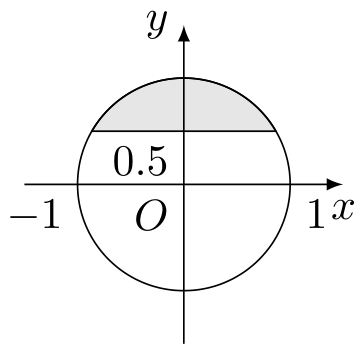
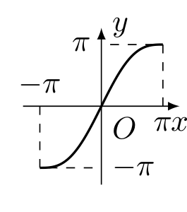
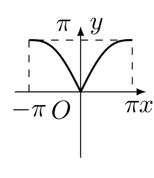
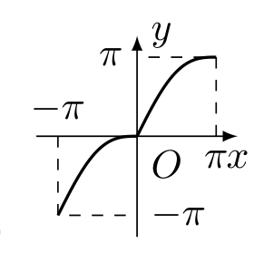
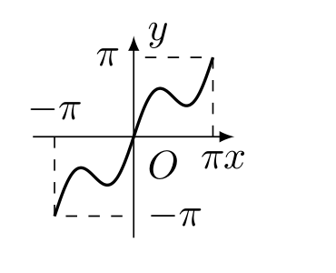

# 2002年上海卷（秋文）

## 填空题

### 第 1 题

若 $z \in \mathbf{C}$，$(3 + z)\i = 1$（$\i$ 为虚数单位），则 $z=$＿＿＿＿＿＿.

#### 答案

$-3-\i$

#### 解析

由 $\i^2=-1$ 可得 $\dfrac{1}{\i}=-\i$. 原式两边同除以 $\i$，得 $3+z=\dfrac{1}{\i}=-\i$，所以 $z=-3-\i$.

### 第 2 题

已知向量 $\boldsymbol{a}$ 和 $\boldsymbol{b}$ 的夹角为 $120^{\circ}$，且 $|\boldsymbol{a}| = 2$，$|\boldsymbol{b}| = 5$，则 $(2\boldsymbol{a}- \boldsymbol{b}) \cdot \boldsymbol{a}=$＿＿＿＿＿＿.

#### 答案

$13$

#### 解析

由向量点积公式，$\boldsymbol{b}\cdot\boldsymbol{a}=|\boldsymbol{b}|\,|\boldsymbol{a}|\cos120^{\circ}=5\times2\times\left(-\dfrac{1}{2}\right)=-5$. 因而 $(2\boldsymbol{a}-\boldsymbol{b})\cdot\boldsymbol{a}=2|\boldsymbol{a}|^2-\boldsymbol{b}\cdot\boldsymbol{a}=2\times2^2-(-5)=13$.

### 第 3 题

方程 $\log_{3}(1 - 2 \times 3^{x}) = 2x + 1$ 的解 $x=$＿＿＿＿＿＿.

#### 答案

$-1$

#### 解析

令 $u=3^x$，则 $u>0$，且原方程的定义域要求 $1-2u>0$. 又 $2x+1=\log_3(3u^2)$，所以由对数函数的单调性，$1-2u=3u^2$，即 $(3u-1)(u+1)=0$. 结合 $u>0$，得 $u=\dfrac{1}{3}$，从而 $x=-1$，并且此时 $1-2u=\dfrac{1}{3}>0$，满足定义域.

### 第 4 题

若正四棱锥的底面边长为 $2\sqrt{3}\mathrm{~cm}$，体积为 $4\mathrm{~cm}^{3}$，则它的侧面与底面所成的二面角的大小是＿＿＿＿＿＿.

#### 答案

$30^{\circ}$

#### 解析

设正四棱锥的高为 $h$，底面中心为 $O$，底面一边的中点为 $M$，顶点为 $S$. 底面面积为 $(2\sqrt{3})^2=12$，由体积公式 $\dfrac{1}{3}\times12h=4$，得 $h=SO=1$. 又 $OM=\sqrt{3}$，且 $SO\perp OM$. 侧面与底面所成的二面角等于 $\angle SMO$，所以 $\tan\angle SMO=\dfrac{SO}{OM}=\dfrac{1}{\sqrt{3}}$，故其大小为 $30^{\circ}$.

### 第 5 题

在二项式 $(1 + 3x)^n$ 和 $(2x + 5)^n$ 的展开式中，各项系数之和分别记为 $a_n$，$b_n$，$n$ 是正整数，则 $\displaystyle\lim_{n \to \infty} \frac{a_n - 2b_n}{3a_n - 4b_n}=$＿＿＿＿＿＿.

#### 答案

$\dfrac{1}{2}$

#### 解析

各项系数之和等于令 $x=1$ 时的二项式值，因此 $a_n=(1+3)^n=4^n$，$b_n=(2+5)^n=7^n$. 于是 $\displaystyle\frac{a_n-2b_n}{3a_n-4b_n}=\frac{(4/7)^n-2}{3(4/7)^n-4}$. 因为 $0<\dfrac{4}{7}<1$，所以 $\displaystyle\lim_{n\to\infty}\left(\dfrac{4}{7}\right)^n=0$，所求极限为 $\dfrac{-2}{-4}=\dfrac{1}{2}$.

### 第 6 题

已知圆 $x^{2} + (y - 1)^{2} = 1$ 和圆外一点 $P(-2,0)$，过点 $P$ 作圆的切线，则两条切线夹角的正切值是＿＿＿＿＿＿.

#### 答案

$\dfrac{4}{3}$

#### 解析

圆心为 $O(0,1)$，半径为 $1$. 设过 $P(-2,0)$ 的切线斜率为 $m$，则切线方程为 $y=m(x+2)$，即 $mx-y+2m=0$. 圆心到切线的距离等于半径，故 $\displaystyle\frac{|2m-1|}{\sqrt{m^2+1}}=1$，从而 $(2m-1)^2=m^2+1$，即 $m(3m-4)=0$. 两条切线的斜率为 $0$ 和 $\dfrac{4}{3}$，所以它们的锐角夹角 $\theta$ 满足 $\displaystyle\tan\theta=\left|\frac{\frac{4}{3}-0}{1+0\cdot\frac{4}{3}}\right|=\frac{4}{3}$.

### 第 7 题

在某次花样滑冰比赛中，发生裁判受贿事件，竞赛委员会决定将裁判由原来的 $9$ 名增至 $14$ 名，但只任取其中 $7$ 名裁判的评分作为有效分，若 $14$ 名裁判中有 $2$ 人受贿，则有效分中没有受贿裁判的评分的概率是＿＿＿＿＿＿.（结果用数值表示）

#### 答案

$\dfrac{3}{13}$

#### 解析

从 $14$ 名裁判中任取 $7$ 名共有 $\mathrm C_{14}^{7}$ 种等可能结果. 要使有效分中没有受贿裁判，必须从 $12$ 名未受贿裁判中任取 $7$ 名，共有 $\mathrm C_{12}^{7}$ 种结果. 因而所求概率为 $\displaystyle\frac{\mathrm C_{12}^{7}}{\mathrm C_{14}^{7}}=\frac{792}{3432}=\frac{3}{13}$.

### 第 8 题

抛物线 $(y - 1)^2 = 4(x - 1)$ 的焦点坐标是＿＿＿＿＿＿.

#### 答案

$(2,1)$

#### 解析

将方程改写为 $(y-1)^2=4(x-1)$，与标准形式 $(y-k)^2=4p(x-h)$ 比较，得 $h=1$，$k=1$，$p=1$. 因此顶点为 $(1,1)$，焦点为 $(h+p,k)=(2,1)$.

### 第 9 题

某工程由下列工序组成，则工程总时数为＿＿＿＿＿＿$\text{天}$.

|     工序     | $a$ | $b$ |    $c$     | $d$ | $e$ |    $f$     |
|:------------:|:-----:|:-----:|:------------:|:-----:|:-----:|:------------:|
|   紧前工序   |  \-   |  \-   | $a$，$b$ | $c$ | $c$ | $d$，$e$ |
| 工时数（天） | $2$ | $3$ |    $2$     | $5$ | $4$ |    $1$     |

#### 答案

$11$

#### 解析

设各工序最早完成时刻分别为 $T_a$，$T_b$，$T_c$，$T_d$，$T_e$，$T_f$. 由工序之间的先后关系，$T_a=2$，$T_b=3$，$T_c=\max\{2,3\}+2=5$，$T_d=5+5=10$，$T_e=5+4=9$. 工序 $f$ 必须等 $d$，$e$ 都完成后才能开始，所以 $T_f=\max\{10,9\}+1=11$，工程总时数为 $11\text{ 天}$.

### 第 10 题

设函数 $f(x)=\sin 2x$，若 $f(x+t)$ 是偶函数，则 $t$ 的一个可能值是＿＿＿＿＿＿.

#### 答案

$\dfrac{(2k+1)\pi}{4}$，$k\in\mathbb{Z}$

#### 解析

有 $f(x+t)=\sin(2x+2t)=\sin2t\cos2x+\cos2t\sin2x$. 要使它成为偶函数，奇函数项 $\cos2t\sin2x$ 的系数必须为零，因此 $\cos2t=0$. 所以 $2t=\dfrac{(2k+1)\pi}{2}$，即 $t=\dfrac{(2k+1)\pi}{4}$，其中 $k\in\mathbb{Z}$.

### 第 11 题

若数列 $\{a_n\}$ 中，$a_1 = 3$，且 $a_{n+1} = a_{n}^{2}$（$n$ 是正整数），则数列的通项 $a_n=$＿＿＿＿＿＿.

#### 答案

$3^{2^{n-1}}$

#### 解析

当 $n=1$ 时，$3^{2^{n-1}}=3=a_1$. 假设某个正整数 $n$ 时 $a_n=3^{2^{n-1}}$，则由递推式 $a_{n+1}=a_n^2=\left(3^{2^{n-1}}\right)^2=3^{2^n}$. 由数学归纳法，$a_n=3^{2^{n-1}}$ 对一切正整数 $n$ 成立.

### 第 12 题

已知函数 $y = f(x)$（定义域为 $D$，值域为 $A$）有反函数 $y = f^{-1}(x)$，则方程 $f(x)=0$ 有解 $x=a$，且 $f(x)>x$（$x \in D$）的充要条件是 $y = f^{-1}(x)$ 满足＿＿＿＿＿＿.

#### 答案

其图象在直线 $y=x$ 的下方，且与 $y$ 轴的交点为 $(0,a)$

#### 解析

因为 $f(a)=0$，所以反函数满足 $f^{-1}(0)=a$，故反函数图象经过点 $(0,a)$. 对任意 $x\in D$，条件 $f(x)>x$ 表明原函数图象上的点 $(x,f(x))$ 在直线 $y=x$ 上方. 反函数图象是原函数图象关于直线 $y=x$ 的对称图形，因此对应点 $(f(x),x)$ 全在直线 $y=x$ 下方. 反过来，若反函数图象在该直线下方且经过 $(0,a)$，关于直线 $y=x$ 对称后就得到 $f(x)>x$ 且 $f(a)=0$. 所以所给条件的充要条件正是：$y=f^{-1}(x)$ 的图象在直线 $y=x$ 下方，且与 $y$ 轴交于 $(0,a)$.

## 单选题

### 第 13 题

如图，与复平面中的阴影部分（含边界）对应的复数集合是（）

A.  
$\left\{z\mid |z| = 1,\operatorname{Re} z \geqslant \frac{1}{2}, z \in \mathbf{C}\right\}$

B.  
$\left\{z\mid |z| \leqslant 1,\operatorname{Re} z \geqslant \frac{1}{2}, z \in \mathbf{C}\right\}$

C.  
$\left\{z\mid |z| = 1,\operatorname{Im} z \geqslant \frac{1}{2}, z \in \mathbf{C}\right\}$

D.  
$\left\{z\mid |z| \leqslant 1,\operatorname{Im} z \geqslant \frac{1}{2}, z \in \mathbf{C}\right\}$

#### 答案

D

#### 解析

令 $z=x+\i y$，则 $|z|\leqslant1$ 表示点 $(x,y)$ 在单位圆面内（含边界），而 $\operatorname{Im}z=y\geqslant\dfrac{1}{2}$ 表示点在直线 $y=\dfrac{1}{2}$ 的上方（含直线）. 两个条件的交集正是图中的阴影部分，因此选 D.

### 第 14 题

已知直线 $l$，$m$，平面 $\alpha$，$\beta$，且 $l \perp \alpha$，$m \subset \beta$，给出下列四个命题.

1.  若 $\alpha \parallel \beta$，$l \perp m$；

2.  若 $l \perp m$，则 $\alpha \parallel \beta$；

3.  若 $\alpha \perp \beta$，则 $l \parallel m$；

4.  若 $l \parallel m$，$\alpha \perp \beta$.

其中正确命题的个数是（）

A.  
$1$ 个

B.  
$2$ 个

C.  
$3$ 个

D.  
$4$ 个

#### 答案

B

#### 解析

第一个命题中，若 $\alpha\parallel\beta$，则 $l\perp\beta$，因而 $l$ 垂直于平面 $\beta$ 内的任意直线，故命题正确. 第二个命题不成立：取 $\alpha\colon z=0$、$\beta\colon x=0$，令 $l$ 为 $z$ 轴、$m$ 为 $y$ 轴，则 $l\perp\alpha$、$m\subset\beta$、$l\perp m$，但 $\alpha$ 与 $\beta$ 不平行. 这个例子同时说明第三个命题不成立，因为此时 $\alpha\perp\beta$，而 $l$ 与 $m$ 垂直而非平行. 第四个命题中，若 $l\parallel m$，则平面 $\beta$ 内含有一条垂直于平面 $\alpha$ 的直线，故 $\beta\perp\alpha$，命题正确. 所以正确命题有两个，选 B.

### 第 15 题

函数 $y = x + \sin |x|$，$x \in [-\pi, \pi]$ 的大致图象是（）

A.  

B.  

C.  

D.  

#### 答案

C

#### 解析

当 $-\pi\leqslant x\leqslant0$ 时，$y=x-\sin x$；当 $0\leqslant x\leqslant\pi$ 时，$y=x+\sin x$. 两段都从左向右递增，且图象经过 $(-\pi,-\pi)$，$(0,0)$，$(\pi,\pi)$. 在原点左侧，$y'=1-\cos x$，到原点时斜率为 $0$；在原点右侧，$y'=1+\cos x$，到原点时右导数为 $2$. 因而图象在原点左侧逐渐变平，在原点右侧立即以较大斜率上升，符合选项 C.

### 第 16 题

一般地，家庭用电量（千瓦时）与气温（$^{\circ}\mathrm{C}$）有一定的关系. 图（1）表示某年 $12$ 个月中每月的平均气温，图（2）表示某家庭在这 $12$ 个月中每月的用电量，根据这些信息，以下关于该家庭用电量与气温间关系的叙述中，正确的是（）

A.  
气温最高时，用电量最多

B.  
气温最低时，用电量最少

C.  
当气温大于某一值时，用电量随气温增高而增加

D.  
当气温小于某一值时，用电量随气温降低而增加

#### 答案

C

#### 解析

由两幅图逐月对应比较可知，最高气温出现在第 $7$ 个月，而最高用电量出现在第 $2$ 个月和第 $8$ 个月，故选项 A 不成立；最低气温月份的用电量也不是最少，选项 B 不成立. 在低温段，气温降低并不总使用电量增加，选项 D 也不能由图得到. 在较高气温的第 $5$ 至第 $7$ 个月，气温逐月升高，用电量也逐月增加，图示支持选项 C 所述的高温段趋势，因此正确叙述为选项 C.

## 解答题

### 第 17 题

如图，在直三棱柱 $ABO-A'B'O'$ 中，$OO' = 4$，$OA = 4$，$OB = 3$，$\angle AOB = 90^\circ$，$D$ 是线段 $A'B'$ 的中点，$P$ 是侧棱 $BB'$ 上的一点，若 $OP \perp BD$，求 $OP$ 与底面 $AOB$ 所成角的大小. （结果用反三角函数值表示）

#### 解析

取 $O$ 为原点，以 $OA$、$OB$、$OO'$ 所在直线分别为三个坐标轴建立空间直角坐标系，则 $A(4,0,0)$，$B(0,3,0)$，$A'(4,0,4)$，$B'(0,3,4)$. 因为 $D$ 是 $A'B'$ 的中点，所以 $D\left(2,\dfrac{3}{2},4\right)$. 设 $P(0,3,t)$，其中 $0\leqslant t\leqslant4$，则 $\overrightarrow{BD}=\left(2,-\dfrac{3}{2},4\right)$，$\overrightarrow{OP}=(0,3,t)$.

由 $OP\perp BD$，得 $\overrightarrow{OP}\cdot\overrightarrow{BD}=0$，即 $3\times\left(-\dfrac{3}{2}\right)+4t=0$，所以 $t=\dfrac{9}{8}$. 直线 $OP$ 在底面 $AOB$ 上的射影为 $OB$，设 $OP$ 与底面所成的角为 $\theta$，则 $\displaystyle\tan\theta=\frac{t}{OB}=\frac{9/8}{3}=\frac{3}{8}$. 因此 $\theta=\arctan\dfrac{3}{8}$.

### 第 18 题

已知点 $A(-\sqrt{3},0)$ 和 $B(\sqrt{3},0)$，动点 $C$ 到 $A$，$B$ 两点的距离之差的绝对值为 $2$，点 $C$ 的轨迹与直线 $y = x - 2$ 交于 $D$，$E$ 两点，求线段 $DE$ 的长.

#### 解析

设动点 $C(x,y)$，则 $CA$、$CB$ 是到两个定点 $A(-\sqrt{3},0)$、$B(\sqrt{3},0)$ 的距离. 因为 $|CA-CB|=2$，动点轨迹是双曲线，且实半轴 $a=1$，焦半距 $c=\sqrt{3}$. 由 $b^2=c^2-a^2=2$，轨迹方程为 $\dfrac{x^2}{1^2}-\dfrac{y^2}{2}=1$.

与直线 $y=x-2$ 联立，得 $x^2-\dfrac{(x-2)^2}{2}=1$，即 $x^2+4x-6=0$. 两交点的横坐标之差为 $2\sqrt{10}$. 因为直线斜率为 $1$，所以 $\displaystyle DE=\sqrt{(2\sqrt{10})^2+(2\sqrt{10})^2}=4\sqrt{5}$.

### 第 19 题

已知函数 $f(x)=x^2 + 2ax + 2$，$x \in [-5, 5]$.

1.  当 $a=-1$ 时，求函数 $f(x)$ 的最大值与最小值；

2.  求实数 $a$ 的取值范围，使 $y = f(x)$ 在区间 $[-5, 5]$ 上是单调函数.

#### 解析

1.  当 $a=-1$ 时，$f(x)=x^2-2x+2=(x-1)^2+1$. 因为 $1\in[-5,5]$，所以最小值为 $f(1)=1$. 在区间两端，$f(-5)=37$，$f(5)=17$，故最大值为 $37$.

2.  对任意 $-5\leqslant x_1<x_2\leqslant5$，有 $f(x_2)-f(x_1)=(x_2-x_1)(x_1+x_2+2a)$. 当 $a\geqslant5$ 时，$x_1+x_2+2a>0$，函数在区间上单调递增；当 $a\leqslant-5$ 时，$x_1+x_2+2a<0$，函数在区间上单调递减. 若 $-5<a<5$，抛物线顶点横坐标 $-a$ 位于区间内部，函数先减后增，不能单调. 因此 $a\leqslant-5$ 或 $a\geqslant5$.

### 第 20 题

某商场在促销期间规定：商场内所有商品按标价的 $80\%$ 出售，同时，当顾客在该商场内消费满一定金额后，按如下方案获得相应金额的奖券：

| 消费金额的范围 | $[200,400)$ | $[400,500)$ | $[500,700)$ | $[700,900)$ | $\cdots$ |
|:--:|:--:|:--:|:--:|:--:|:--:|
| 获得奖券的金额 | $30$ | $60$ | $100$ | $130$ | $\cdots$ |

根据上述促销方法，顾客在该商场购物可以获得双重优惠，例如，购买标价为 $400\text{ 元}$ 的商品，则消费金额为 $320\text{ 元}$. 获得的优惠额为：$400 \times 0.2 + 30 = 110\text{ 元}$，设购买商品得到的优惠率=$\dfrac{\text{购买商品获得的优惠额}}{\text{商品的标价}}$，试问：

1.  若购买一件标价为 $1000\text{ 元}$ 的商品，顾客得到的优惠率是多少？

2.  对于标价在 $[500,800]\text{ 元}$ 内的商品，顾客购买标价为多少$\text{元}$的商品，可得到不小于 $\dfrac{1}{3}$ 的优惠率？

#### 解析

1.  标价为 $1000\text{ 元}$ 时，消费金额为 $0.8\times1000=800\text{ 元}$，获得 $130\text{ 元}$奖券. 优惠额为 $0.2\times1000+130=330\text{ 元}$，所以优惠率为 $\dfrac{330}{1000}=33\%$.

2.  设商品标价为 $x\text{ 元}$，则消费金额为 $0.8x\text{ 元}$. 当 $500\leqslant x<625$ 时，$400\leqslant0.8x<500$，奖券金额为 $60\text{ 元}$，优惠率为 $0.2+\dfrac{60}{x}$. 要使其不小于 $\dfrac{1}{3}$，需 $x\leqslant450$，与 $x\geqslant500$ 矛盾.

    当 $625\leqslant x\leqslant800$ 时，$500\leqslant0.8x\leqslant640$，奖券金额为 $100\text{ 元}$，优惠率为 $0.2+\dfrac{100}{x}$. 因而 $0.2+\dfrac{100}{x}\geqslant\dfrac{1}{3}$ 等价于 $x\leqslant750$. 结合取值范围，所求标价为 $[625,750]\text{ 元}$.

### 第 21 题

已知函数 $f(x)=a \times b^x$ 的图象过点 $A\left(4, \frac{1}{4}\right)$ 和 $B(5,1)$.

1.  求函数 $f(x)$ 的解析式；

2.  记 $a_n = \log_2 f(n)$，$n$ 是正整数，$S_n$ 是数列 $\{a_n\}$ 的前 $n$ 项和，解关于 $n$ 的不等式 $a_nS_n \leqslant 0$；

3.  对于（2）中的 $a_n$ 与 $S_n$，整数 $96$ 是否为数列 $\{a_nS_n\}$ 中的项？若是，则求出相应的项数；若不是，则说明理由.

#### 解析

1.  由 $ab^4=\dfrac{1}{4}$，$ab^5=1$，两式相除得 $b=4$. 再代入得 $a=\dfrac{1}{1024}$，所以 $f(x)=\dfrac{1}{1024}\times4^x$.

2.  $f(n)=\dfrac{4^n}{4^5}=2^{2n-10}$，故 $a_n=\log_2f(n)=2n-10$. 因此 $\displaystyle S_n=\sum_{k=1}^{n}(2k-10)=n(n+1)-10n=n(n-9)$. 因为 $n$ 是正整数，$a_nS_n=2n(n-5)(n-9)\leqslant0$ 等价于 $(n-5)(n-9)\leqslant0$，所以 $5\leqslant n\leqslant9$，即 $n=5$，$6$，$7$，$8$，$9$.

3.  数列各项为 $a_nS_n=2n(n-5)(n-9)$. 当 $n=1$，$2$，$3$，$4$ 时，所得值依次为 $64$，$84$，$72$，$40$；当 $5\leqslant n\leqslant9$ 时，所得值不大于 $0$；当 $n=10$ 时所得值为 $100$；当 $n\geqslant11$ 时，所得值至少为 $2\times11\times6\times2=264$. 因此 $96$ 不是数列 $\{a_nS_n\}$ 中的项.

### 第 22 题

规定 $\mathrm C_{x}^{m} = \dfrac{x(x - 1)\cdots(x - m + 1)}{m!}$，其中 $x \in \mathbb{R}$，$m$ 是正整数，且 $\mathrm C_{x}^{0} = 1$，这是组合数 $\mathrm C_{n}^{m}$（$n$，$m$ 是正整数，且 $m \leqslant n$）的一种推广.

1.  求 $\mathrm C_{-15}^{3}$ 的值；

2.  设 $x > 0$，当 $x$ 为何值时，$\dfrac{\mathrm C_{x}^{3}}{(\mathrm C_{x}^{1})^{2}}$ 取得最小值？

3.  组合数的两个性质：

    1.  $\mathrm C_{n}^{m} = \mathrm C_{n}^{n - m}$；

    2.  $\mathrm C_{n}^{m} + \mathrm C_{n}^{m - 1} = \mathrm C_{n + 1}^{m}$.

    是否都能推广到 $\mathrm C_{x}^{m}$（$x \in \mathbb{R}$，$m$ 是正整数）的情形？若能推广，则写出推广的形式并给出证明；若不能，则说明理由.

#### 解析

1.  $\displaystyle\mathrm C_{-15}^{3}=\frac{(-15)(-16)(-17)}{3!}=-\frac{15\times16\times17}{6}=-680$.

2.  因为 $\mathrm C_x^1=x$，所以 $\displaystyle\frac{\mathrm C_x^3}{(\mathrm C_x^1)^2}=\frac{x(x-1)(x-2)}{6x^2}=\frac{1}{6}\left(x-3+\frac{2}{x}\right)$. 对 $x>0$，由基本不等式 $x+\dfrac{2}{x}\geqslant2\sqrt{2}$，等号当且仅当 $x=\sqrt{2}$. 所以原式在 $x=\sqrt{2}$ 时取得最小值.

3.  第一个性质若推广到实数参数，形式只能写成 $\mathrm C_x^m=\mathrm C_x^{x-m}$，但定义中的下标 $x-m$ 一般不是正整数，右端通常没有定义；因此该性质不能推广到一般的 $x\in\mathbb{R}$ 情形.

    第二个性质可以推广为 $\mathrm C_x^m+\mathrm C_x^{m-1}=\mathrm C_{x+1}^m$. 当 $m=1$ 时， $\mathrm C_x^1+\mathrm C_x^0=x+1=\mathrm C_{x+1}^1$. 当 $m\geqslant2$ 时， $\displaystyle\mathrm C_x^m+\mathrm C_x^{m-1}=\frac{x(x-1)\cdots(x-m+1)}{m!}+\frac{x(x-1)\cdots(x-m+2)}{(m-1)!}$ $\displaystyle=\frac{x(x-1)\cdots(x-m+2)\bigl((x-m+1)+m\bigr)}{m!}=\frac{(x+1)x(x-1)\cdots(x-m+2)}{m!}=\mathrm C_{x+1}^m$.
