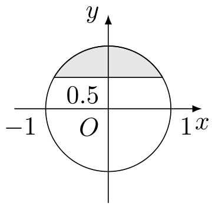
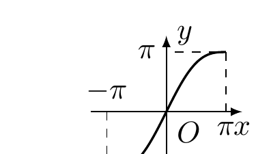
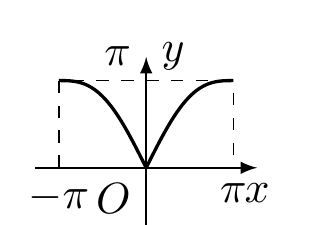
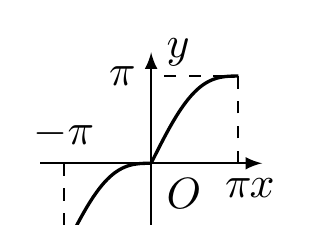
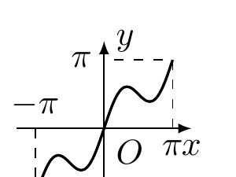
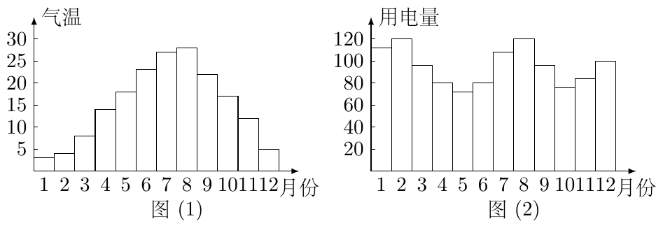
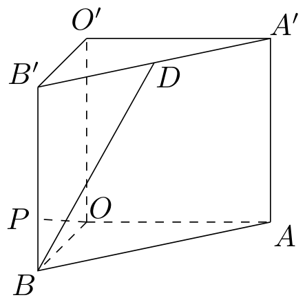

# 2002年上海卷（秋理）

## 填空题

### 第 1 题

若 $z \in \mathbf{C}$，$(3 + z)\i = 1$（$\i$ 为虚数单位），则 $z =$＿＿＿＿＿＿.

#### 答案

$-3-\i$

#### 解析

由 $\i^2=-1$，且 $\i\ne0$，原式两边同除以 $\i$，得 $3+z=\frac{1}{\i}=-\i$，所以 $z=-3-\i$.

### 第 2 题

已知向量 $\boldsymbol{a}$ 和 $\boldsymbol{b}$ 的夹角为 $120^\circ$，且 $|\boldsymbol{a}| = 2$，$|\boldsymbol{b}| = 5$，则 $(2\boldsymbol{a}- \boldsymbol{b}) \cdot \boldsymbol{a}=$＿＿＿＿＿＿.

#### 答案

$13$

#### 解析

由向量数量积公式，$\boldsymbol{a}\cdot\boldsymbol{b}=|\boldsymbol{a}|\,|\boldsymbol{b}|\cos120^\circ=2\times5\times\left(-\frac12\right)=-5$. 因此 $(2\boldsymbol{a}-\boldsymbol{b})\cdot\boldsymbol{a}=2|\boldsymbol{a}|^2-\boldsymbol{b}\cdot\boldsymbol{a}=2\times2^2-(-5)=13$.

### 第 3 题

方程 $\log_{3}(1 - 2\times 3^{x}) = 2x + 1$ 的解 $x =$＿＿＿＿＿＿.

#### 答案

$-1$

#### 解析

由对数的真数为正，得 $1-2\times3^x>0$. 令 $u=3^x$，则 $u>0$，且原方程化为 $\log_3(1-2u)=2x+1$，从而 $1-2u=3^{2x+1}=3u^2$. 因此 $3u^2+2u-1=0$，即 $(3u-1)(u+1)=0$. 因为 $u>0$，所以 $u=\frac13$，故 $x=-1$. 此时真数为 $1-2\times\frac13=\frac13>0$，满足定义域，故解为 $x=-1$.

### 第 4 题

若正四棱锥的底面边长为 $2\sqrt{3}\mathrm{~cm}$，体积为 $4\mathrm{~cm}^{3}$，则它的侧面与底面所成的二面角的大小是＿＿＿＿＿＿.

#### 答案

$30^\circ$

#### 解析

设正四棱锥的高为 $h$，底面中心为 $O$，取一条底面棱的中点 $M$，设棱锥顶点为 $S$. 底面正方形的面积为 $(2\sqrt{3})^2=12$，由体积公式 $\frac13\times12h=4$，得 $h=SO=1$. 又 $OM$ 是正方形的内切半径，所以 $OM=\sqrt{3}$. 过 $M$ 作底面棱的垂线，得到侧面与底面的二面角的平面角 $\angle SMO$. 在直角三角形 $SOM$ 中，$\tan\angle SMO=\frac{SO}{OM}=\frac1{\sqrt3}$，故二面角为 $30^\circ$.

### 第 5 题

在二项式 $(1 + 3x)^{n}$ 和 $(2x + 5)^{n}$ 的展开式中，各项系数之和分别记为 $a_{n}$，$b_{n}$，$n$ 是正整数，则 $\displaystyle\lim_{n\to\infty}\frac{a_n - 2b_n}{3a_n - 4b_n} =$＿＿＿＿＿＿.

#### 答案

$\frac{1}{2}$

#### 解析

令 $x=1$，二项式 $(1+3x)^n$ 和 $(2x+5)^n$ 的各项系数之和分别为 $a_n=4^n$，$b_n=7^n$. 因而

$$

\frac{a_n-2b_n}{3a_n-4b_n}=\frac{(4/7)^n-2}{3(4/7)^n-4}

$$

由于 $0<\frac47<1$，有 $\left(\frac47\right)^n\to0$，所以原极限为 $\frac{-2}{-4}=\frac12$.

### 第 6 题

已知圆 $(x + 1)^2 + y^2 = 1$ 和圆外一点 $P(0,2)$，过点 $P$ 作圆的切线，则两条切线夹角的正切值是＿＿＿＿＿＿.

#### 答案

$\frac{4}{3}$

#### 解析

圆心为 $C_0(-1,0)$，半径为 $1$. 过 $P(0,2)$ 的非竖直直线可设为 $y-2=m x$. 它与圆相切当且仅当圆心到直线的距离等于半径，即

$$

\frac{|2-m|}{\sqrt{m^2+1}}=1

$$

平方并化简得 $(2-m)^2=m^2+1$，所以 $m=\frac34$. 另一条切线为竖直直线 $x=0$，它与圆在 $(0,0)$ 相切. 设两切线的夹角为 $\varphi$，则斜率为 $\frac34$ 的直线与竖直线的夹角满足 $\tan\varphi=\frac{1}{3/4}=\frac43$，故正切值为 $\frac43$.

### 第 7 题

在某次花样滑冰比赛中，发生裁判受贿事件，竞赛委员会决定将裁判由原来的 $9$ 名增至 $14$ 名，但只任取其中 $7$ 名裁判的评分作为有效分，若 $14$ 名裁判中有 $2$ 人受贿，则有效分中没有受贿裁判的评分的概率是＿＿＿＿＿＿. （结果用数值表示）

#### 答案

$\frac{3}{13}$

#### 解析

从 $14$ 名裁判中任取 $7$ 名作为有效评分，共有 $\mathrm C_{14}^{7}$ 种等可能结果. 若有效分中没有受贿裁判，则必须从 $12$ 名未受贿裁判中任取 $7$ 名，共有 $\mathrm C_{12}^{7}$ 种结果. 所求概率为

$$

\frac{\mathrm C_{12}^{7}}{\mathrm C_{14}^{7}}=\frac{12!}{7!5!}\frac{7!7!}{14!}=\frac{3}{13}

$$

### 第 8 题

曲线

$$

\begin{cases}
x = t^2 - 1,\\
y = 2t + 1,
\end{cases}

$$

（$t$ 为参数）的焦点坐标是＿＿＿＿＿＿.

#### 答案

$(0,1)$

#### 解析

由参数方程 $y=2t+1$ 得 $t=\frac{y-1}{2}$，代入 $x=t^2-1$，得

$$

x=\frac{(y-1)^2}{4}-1

$$

即

$$

(y-1)^2=4(x+1)

$$

这是顶点为 $(-1,1)$、焦参数为 $1$ 的抛物线，焦点坐标为 $(-1+1,1)=(0,1)$.

### 第 9 题

若 $A$，$B$ 两点的极坐标 $A\left(4, \frac{\pi}{3}\right)$，$B(6,0)$，则 $AB$ 中点的极坐标是＿＿＿＿＿＿.

#### 答案

$\left(\sqrt{19},\arctan\frac{\sqrt{3}}{4}\right)$

#### 解析

将极坐标化为直角坐标，得 $A\left(4\cos\frac{\pi}{3},4\sin\frac{\pi}{3}\right)=(2,2\sqrt{3})$，$B(6,0)$. 因此 $AB$ 的中点为

$$

M\left(\frac{2+6}{2},\frac{2\sqrt{3}+0}{2}\right)=(4,\sqrt{3})

$$

点 $M$ 在第一象限，所以其极径为 $r=\sqrt{4^2+(\sqrt{3})^2}=\sqrt{19}$，极角满足 $\tan\theta=\frac{\sqrt{3}}4$，从而

$$

\theta=\arctan\frac{\sqrt{3}}4

$$

故中点的极坐标为 $\left(\sqrt{19},\arctan\frac{\sqrt{3}}4\right)$.

### 第 10 题

设函数 $f(x) = \sin 2x$，若 $f(x + t)$ 是偶函数，则 $t$ 的一个可能值是＿＿＿＿＿＿.

#### 答案

$\frac{\pi}{4}$

#### 解析

令 $g(x)=f(x+t)=\sin(2x+2t)$. 利用和角公式，得

$$

g(x)=\sin2x\cos2t+\cos2x\sin2t

$$

而

$$

g(-x)=-\sin2x\cos2t+\cos2x\sin2t

$$

要使 $g(x)$ 为偶函数，必须对任意 $x$ 有 $g(x)=g(-x)$，于是

$$

2\sin2x\cos2t=0

$$

该等式对任意 $x$ 成立，当且仅当 $\cos2t=0$，即 $2t=\frac{\pi}{2}+k\pi$，其中 $k\in\mathbb{Z}$. 因而 $t=\frac{\pi}{4}+\frac{k\pi}{2}$，取 $k=0$，得到一个可能值 $t=\frac{\pi}{4}$.

### 第 11 题

若数列 $\{a_{n}\}$ 中，$a_{1} = 3$，且 $a_{n+1} = a_{n}^{2}$（$n$ 是正整数），则数列的通项 $a_{n} =$＿＿＿＿＿＿.

#### 答案

$3^{2^{n-1}}$

#### 解析

由 $a_1=3$，有 $a_1=3^{2^0}$. 若对某个正整数 $n$ 有 $a_n=3^{2^{n-1}}$，则

$$

a_{n+1}=a_n^2=\left(3^{2^{n-1}}\right)^2=3^{2^n}

$$

因此由数学归纳法，对任意正整数 $n$，数列的通项为 $a_n=3^{2^{n-1}}$.

### 第 12 题

已知函数 $y = f(x)$（定义域为 $D$，值域为 $A$）有反函数 $y = f^{-1}(x)$，则方程 $f(x) = 0$ 有解 $x = a$，且 $f(x) > x$（$x \in D$）的充要条件是 $y = f^{-1}(x)$ 满足＿＿＿＿＿＿.

#### 答案

$f^{-1}(0)=a$，且 $f^{-1}(x)<x$（$x\in A$）

#### 解析

由方程 $f(x)=0$ 有解 $x=a$，可知 $f(a)=0$. 因为 $f$ 有反函数，故 $0\in A$，且对等式两边作用 $f^{-1}$，得 $f^{-1}(0)=a$.

再设 $x\in D$，令 $y=f(x)$，则 $y\in A$，并且

$$

f(x)>x\Longleftrightarrow y>x\Longleftrightarrow f^{-1}(y)=x<y

$$

所以 $f(x)>x$ 对任意 $x\in D$ 成立，当且仅当 $f^{-1}(y)<y$ 对任意 $y\in A$ 成立. 将 $y$ 改记为 $x$，所求条件为 $f^{-1}(x)<x$（$x\in A$）.

## 单选题

### 第 13 题

如图，与复平面中的阴影部分（含边界）对应的复数集合是（）

A.  
$\left\{z \mid |z| = 1, \frac{\pi}{6} \leqslant \arg z \leqslant \frac{5\pi}{6}, z \in \mathbf{C}\right\}$

B.  
$\left\{z \mid |z| \leqslant 1, \frac{\pi}{6} \leqslant \arg z \leqslant \frac{5\pi}{6}, z \in \mathbf{C}\right\}$

C.  
$\left\{z \mid |z| = 1, \operatorname{Im} z \geqslant \frac{1}{2}, z \in \mathbf{C}\right\}$

D.  
$\left\{z \mid |z| \leqslant 1, \operatorname{Im} z \geqslant \frac{1}{2}, z \in \mathbf{C}\right\}$

#### 答案

D

#### 解析

设复数 $z=x+y\i$，则 $|z|\leqslant1$ 表示点 $(x,y)$ 在单位圆及其内部，$\operatorname{Im}z=y$. 图中的阴影部分位于直线 $y=\frac12$ 的上方，并且包含边界，因此还需满足 $\operatorname{Im}z\geqslant\frac12$. 所以阴影部分对应的集合为

$$

\left\{z\mid |z|\leqslant1,\ \operatorname{Im}z\geqslant\frac12,\ z\in\mathbf C\right\}

$$

故选 D.

### 第 14 题

已知直线 $l$，$m$，平面 $\alpha$，$\beta$，且 $l \perp \alpha$，$m \subset \beta$，给出下列四个命题.

1.  若 $\alpha \parallel \beta$，$l \perp m$；

2.  若 $l \perp m$，则 $\alpha \parallel \beta$；

3.  若 $\alpha \perp \beta$，则 $l \parallel m$；

4.  若 $l \parallel m$，$\alpha \perp \beta$.

其中正确命题的个数是（）

A.  
$1$ 个

B.  
$2$ 个

C.  
$3$ 个

D.  
$4$ 个

#### 答案

B

#### 解析

第一项中，若 $\alpha\parallel\beta$，且 $l\perp\alpha$，则 $l\perp\beta$，从而 $l\perp m$，所以该命题正确.

第二项不能由 $l\perp m$ 推出 $\alpha\parallel\beta$. 例如取 $\alpha\perp\beta$，则垂直于 $\alpha$ 的直线 $l$ 的方向在平面 $\beta$ 内；再在 $\beta$ 内取一条与 $l$ 垂直的直线 $m$，此时 $l\perp m$，但 $\alpha$ 与 $\beta$ 不平行，所以该命题错误.

第三项即使 $\alpha\perp\beta$，平面 $\beta$ 内也有许多方向不同的直线，不一定都有与 $l$ 相同的方向，因此不能推出 $l\parallel m$，该命题错误.

第四项若 $l\parallel m$，由 $l\perp\alpha$ 可得 $m\perp\alpha$. 又因为 $m\subset\beta$，平面 $\beta$ 经过一条垂直于平面 $\alpha$ 的直线，所以 $\beta\perp\alpha$，即 $\alpha\perp\beta$，该命题正确.

因此正确命题有 $2$ 个，故选 B.

### 第 15 题

函数 $y = x + \sin |x|$，$x \in [-\pi, \pi]$ 的大致图象是（）

A.  

B.  

C.  

D.  

#### 答案

C

#### 解析

当 $-\pi\leqslant x\leqslant0$ 时，$|x|=-x$，所以

$$

f(x)=x-\sin x

$$

当 $0\leqslant x\leqslant\pi$ 时，$|x|=x$，所以

$$

f(x)=x+\sin x

$$

在左半段，$f'(x)=1-\cos x\geqslant0$，且 $f''(x)=\sin x\leqslant0$；在右半段，$f'(x)=1+\cos x\geqslant0$，且 $f''(x)=-\sin x\leqslant0$. 因而函数在整个区间上单调增加，两段图象均向下弯曲.

又 $f(-\pi)=-\pi$，$f(0)=0$，$f(\pi)=\pi$，且在 $x=0$ 处左导数为 $0$、右导数为 $2$，图象在原点处有折点. 这些特征与选项 C 的图象一致，故选 C.

### 第 16 题

一般地，家庭用电量（千瓦时）与气温（$^{\circ}\mathrm{C}$）有一定的关系. 图（1）表示某年 $12$ 个月中每月的平均气温，图（2）表示某家庭在这年 $12$ 个月中每月的用电量，根据这些信息，以下关于该家庭用电量与气温间关系的叙述中，正确的是（）

A.  
气温最高时，用电量最多

B.  
气温最低时，用电量最少

C.  
当气温大于某一值时，用电量随气温增高而增加

D.  
当气温小于某一值时，用电量随气温降低而增加

#### 答案

C

#### 解析

比较两幅柱状图可知，气温最高的月份与用电量最多的月份并不相同，所以“气温最高时，用电量最多”不正确；气温最低的月份用电量也不是最少，所以“气温最低时，用电量最少”不正确.

在高温段，例如气温从约 $27\,^{\circ}\mathrm{C}$ 升高到约 $28\,^{\circ}\mathrm{C}$ 时，用电量也从约 $110\text{ 千瓦时}$ 增加到约 $120\text{ 千瓦时}$，因此存在某个温度值，使气温大于该值时，用电量随气温增高而增加. 低温段的柱高不能支持“气温降低时用电量增加”的说法，所以第四项不正确.

故选 C.

## 解答题

### 第 17 题

如图，在直三棱柱 $ABO - A'B'O'$ 中，$OO' = 4$，$OA = 4$，$OB = 3$，$\angle AOB = 90^\circ$，$D$ 是线段 $A'B'$ 的中点，$P$ 是侧棱 $BB'$ 上的一点，若 $OP \perp BD$，求 $OP$ 与底面 $AOB$ 所成角的大小. （结果用反三角函数值表示）

#### 解析

取 $O$ 为原点，以 $OA$，$OB$，$OO'$ 的方向分别为 $x$，$y$，$z$ 轴，建立空间直角坐标系，则 各点坐标为 $O(0,0,0)$，$A(4,0,0)$，$B(0,3,0)$，$A'(4,0,4)$，$B'(0,3,4)$. 因为 $D$ 是 $A'B'$ 的中点，所以 $D\left(2,\frac{3}{2},4\right)$. 设 $P(0,3,p)$，其中 $0\leqslant p\leqslant4$，则 从而 $\overrightarrow{OP}=(0,3,p)$，$\overrightarrow{BD}=\left(2,-\frac{3}{2},4\right)$. 由 $OP\perp BD$，得 $\overrightarrow{OP}\cdot\overrightarrow{BD}=3\cdot\left(-\frac{3}{2}\right)+4p=0$，解得 $p=\frac{9}{8}$.

设 $OP$ 与底面 $AOB$ 所成的角为 $\alpha$. 设 $P$ 在底面 $AOB$ 内的射影为 $P_0$，则 $P_0=B$，且 $PP_0=\frac{9}{8}$，$OP_0=OB=3$. 因此

$$

\tan\alpha=\frac{PP_0}{OP_0}=\frac{9/8}{3}=\frac{3}{8}

$$

所以 $\alpha=\arctan\frac{3}{8}$.

### 第 18 题

已知点 $A(-\sqrt{3},0)$ 和 $B(\sqrt{3},0)$，动点 $C$ 到 $A$，$B$ 两点的距离之差的绝对值为 $2$，点 $C$ 的轨迹与直线 $y = x - 2$ 交于 $D$，$E$ 两点，求线段 $DE$ 的长.

#### 解析

点 $A$，$B$ 是动点 $C$ 轨迹双曲线的两个焦点，且由 $2c=AB=2\sqrt{3}$，$2a=2$，所以 $a=1$，$c=\sqrt{3}$，从而 $b^2=c^2-a^2=2$. 取 $AB$ 所在直线为 $x$ 轴，双曲线方程为 $\frac{x^2}{a^2}-\frac{y^2}{b^2}=1$，即 $x^2-\frac{y^2}{2}=1$. 将直线 $y=x-2$ 代入，得 $x^2-\frac{(x-2)^2}{2}=1$， 即 $x^2+4x-6=0$. 因此交点 $D$，$E$ 的横坐标分别为 $x_1=-2-\sqrt{10}$，$x_2=-2+\sqrt{10}$，横坐标之差为 $2\sqrt{10}$. 由于两点在直线 $y=x-2$ 上，纵坐标之差也为 $2\sqrt{10}$，故 $DE=\sqrt{(2\sqrt{10})^2+(2\sqrt{10})^2}=4\sqrt{5}$.

### 第 19 题

已知函数 $f(x) = x^2 + 2x \cdot \tan \theta - 1$，$x \in [-1, \sqrt{3}]$，其中 $\theta \in \left(-\frac{\pi}{2}, \frac{\pi}{2}\right)$.

1.  当 $\theta = -\frac{\pi}{6}$ 时，求函数 $y = f(x)$ 的最大值与最小值.

2.  求实数 $\theta$ 的取值范围，使 $y = f(x)$ 在区间 $[-1, \sqrt{3}]$ 上是单调函数.

#### 解析

1.  当 $\theta=-\frac{\pi}{6}$ 时，$\tan\theta=-\frac{1}{\sqrt{3}}$，所以

$$

f(x)=x^2-\frac{2}{\sqrt{3}}x-1=\left(x-\frac{1}{\sqrt{3}}\right)^2-\frac{4}{3}

$$

    因为 $\frac{1}{\sqrt{3}}\in[-1,\sqrt{3}]$，所以函数的最小值为 $-\frac{4}{3}$. 又 $f(-1)=\frac{2}{\sqrt{3}}$，$f(\sqrt{3})=0$， 故函数的最大值为 $\frac{2}{\sqrt{3}}$.

2.  由 $f'(x)=2x+2\tan\theta$，要使函数在给定区间上单调递增，需对区间内任意 $x$ 有 $f'(x)\geqslant0$. 因为 $f'(x)$ 随 $x$ 增大而增大，只需 $f'(-1)=2(\tan\theta-1)\geqslant0$， 即 $\tan\theta\geqslant1$，从而 $\theta\in\left[\frac{\pi}{4},\frac{\pi}{2}\right)$.

    要使函数在给定区间上单调递减，需对区间内任意 $x$ 有 $f'(x)\leqslant0$. 只需 $f'(\sqrt{3})=2(\sqrt{3}+\tan\theta)\leqslant0$， 即 $\tan\theta\leqslant-\sqrt{3}$，从而 $\theta\in\left(-\frac{\pi}{2},-\frac{\pi}{3}\right]$.

    所以所求 $\theta$ 的取值范围为 $\left(-\frac{\pi}{2},-\frac{\pi}{3}\right]\cup\left[\frac{\pi}{4},\frac{\pi}{2}\right)$.

### 第 20 题

某商场在促销期间规定：商场内所有商品按标价的 $80\%$ 出售，同时，当顾客在该商场内消费满一定金额后，按如下方案获得相应金额的奖券：

| 消费金额的范围 | $[200,400)$ | $[400,500)$ | $[500,700)$ | $[700,900)$ | $\cdots$ |
|:--:|:--:|:--:|:--:|:--:|:--:|
| 获得奖券的金额 | $30$ | $60$ | $100$ | $130$ | $\cdots$ |

根据上述促销方法，顾客在该商场购物可以获得双重优惠，例如，购买标价为 $400\text{ 元}$ 的商品，则消费金额为 $320\text{ 元}$. 获得的优惠额为：$400 \times 0.2 + 30 = 110\text{ 元}$，设购买商品得到的优惠率=$\dfrac{\text{购买商品获得的优惠额}}{\text{商品的标价}}$，试问：

1.  若购买一件标价为 $1000\text{ 元}$ 的商品，顾客得到的优惠率是多少？

2.  对于标价在 $[500,800]\text{ 元}$ 内的商品，顾客购买标价为多少元的商品，可得到不小于 $\dfrac{1}{3}$ 的优惠率？

#### 解析

1.  标价为 $1000\text{ 元}$ 时，消费金额为 $0.8\times1000=800\text{ 元}$，所得奖券金额为 $130\text{ 元}$. 因此优惠额为 $0.2\times1000+130=330\text{ 元}$，优惠率为 $\frac{330}{1000}=0.33=33\%$.

2.  设商品标价为 $x\text{ 元}$，其中 $500\leqslant x\leqslant800$. 消费金额为 $0.8x$，于是

$$

\begin{cases}
    500\leqslant x<625,&400\leqslant0.8x<500,\\
    625\leqslant x\leqslant800,&500\leqslant0.8x\leqslant640.
    \end{cases}

$$

    在第一种情形中，奖券金额为 $60\text{ 元}$，优惠率为 $0.2+\frac{60}{x}$. 由 $0.2+\frac{60}{x}\geqslant\frac{1}{3}$， 得 $x\leqslant450$，与 $x\geqslant500$ 矛盾，因此第一种情形无解.

    在第二种情形中，奖券金额为 $100\text{ 元}$，优惠率为 $0.2+\frac{100}{x}$. 由 $0.2+\frac{100}{x}\geqslant\frac{1}{3}$， 得 $x\leqslant750$. 结合 $625\leqslant x\leqslant800$，可得 $625\leqslant x\leqslant750$. 故标价在 $[625,750]\text{ 元}$ 内的商品均可得到不小于 $\frac{1}{3}$ 的优惠率.

### 第 21 题

已知函数 $f(x) = a \times b^x$ 的图象过点 $A\left(4, \frac{1}{4}\right)$ 和 $B(5,1)$.

1.  求函数 $f(x)$ 的解析式；

2.  记 $a_{n} = \log_{2}f(n)$，$n$ 是正整数，$S_{n}$ 是数列 $\{a_{n}\}$ 的前 $n$ 项和，解关于 $n$ 的不等式 $a_{n}S_{n} \leqslant 0$；

3.  对于（2）中的 $a_{n}$ 与 $S_{n}$，整数 $10^{4}$ 是否为数列 $\{a_{n}S_{n}\}$ 中的项？若是，则求出相应的项数；若不是，则说明理由.

#### 解析

1.  由图象过点 $A$，$B$，得 $ab^4=\frac{1}{4}$，$ab^5=1$. 两式相除得 $b=4$，代入第一式得 $a=\frac{1}{1024}$. 所以 $f(x)=\frac{1}{1024}\times4^x=2^{2x-10}$.

2.  由上式，$a_n=\log_2f(n)=2n-10$. 因此

$$

S_n=\sum_{k=1}^{n}(2k-10)=n(n+1)-10n=n(n-9)

$$

    于是 $a_nS_n=2n(n-5)(n-9)$. 因为 $n$ 是正整数，所以 $n>0$，不等式 $a_nS_n\leqslant0$ 等价于 $(n-5)(n-9)\leqslant0$. 故 $n=5$，$6$，$7$，$8$，$9$.

3.  设 $g(n)=a_nS_n=2n(n-5)(n-9)$. 当 $1\leqslant n\leqslant9$ 时，$g(n)$ 的值依次为 $64$，$84$，$72$，$40$，$0$，$-36$，$-56$，$-48$，$0$，均不等于 $10^4$.

    当 $n\geqslant9$ 时， $g(n+1)-g(n)=6n^2-50n+64=6n(n-9)+4n+64>0$， 所以 $g(n)$ 在正整数 $n\geqslant9$ 上递增. 又

$$

g(22)=9724<10^4<11592=g(23)

$$

    故不存在正整数 $n$ 使 $g(n)=10^4$. 因此整数 $10^4$ 不是数列 $\{a_nS_n\}$ 中的项.

### 第 22 题

规定 $\mathrm C_{x}^{m} = \dfrac{x(x - 1)\cdots(x - m + 1)}{m!}$，其中 $x \in \mathbb{R}$，$m$ 是正整数，且 $\mathrm C_{x}^{0} = 1$，这是组合数 $\mathrm C_{n}^{m}$（$n$，$m$ 是正整数，且 $m \leqslant n$）的一种推广.

1.  求 $\mathrm C_{-15}^{5}$ 的值.

2.  组合数的两个性质：

    1.  $\mathrm C_{n}^{m} = \mathrm C_{n}^{n - m}$；

    2.  $\mathrm C_{n}^{m} + \mathrm C_{n}^{m - 1} = \mathrm C_{n + 1}^{m}$.

    是否都能推广到 $\mathrm C_{x}^{m}$（$x \in \mathbb{R}$，$m$ 是正整数）的情形？若能推广，则写出推广的形式并给出证明；若不能，则说明理由；

3.  已知组合数 $\mathrm C_{n}^{m}$ 是正整数，证明：当 $x \in \mathbb{Z}$，$m$ 是正整数时，$\mathrm C_{x}^{m} \in \mathbb{Z}$.

#### 解析

1.  

$$

\mathrm C_{-15}^{5}=\frac{(-15)(-16)(-17)(-18)(-19)}{5!}=-\frac{15\times16\times17\times18\times19}{120}=-11628

$$

2.  第一个性质若推广到实数 $x$，其自然形式应为 $\mathrm C_x^m=\mathrm C_x^{x-m}$. 但按题中定义，上标 $m$ 必须是正整数；例如取 $x=\frac{1}{2}$，$m=1$，右端 $\mathrm C_{1/2}^{-1/2}$ 没有定义，所以第一个性质不能推广到所有 $x\in\mathbb{R}$ 的情形.

    第二个性质可以推广为：对任意 $x\in\mathbb{R}$ 和正整数 $m$，有 $\mathrm C_x^m+\mathrm C_x^{m-1}=\mathrm C_{x+1}^m$. 当 $m=1$ 时，左端为 $x+1$，等于 $\mathrm C_{x+1}^{1}$. 当 $m\geqslant2$ 时，

$$

\mathrm C_x^m+\mathrm C_x^{m-1}
    =\frac{x(x-1)\cdots(x-m+2)}{m!}\left[(x-m+1)+m\right]
    =\frac{(x+1)x(x-1)\cdots(x-m+2)}{m!}
    =\mathrm C_{x+1}^m

$$

    这就证明了推广后的第二个性质.

3.  当 $x\geqslant m$ 时，$\mathrm C_x^m$ 是通常意义下的组合数，由题设为正整数.

    当 $0\leqslant x<m$ 时，因 $x$ 为整数，分子中的因子 $x-x$ 出现，故 $\mathrm C_x^m=0\in\mathbb{Z}$.

    当 $x<0$ 时，

$$

\mathrm C_x^m=\frac{x(x-1)\cdots(x-m+1)}{m!}=(-1)^m\frac{(-x)(-x+1)\cdots(-x+m-1)}{m!}=(-1)^m\mathrm C_{-x+m-1}^m

$$

    此时 $-x+m-1$ 是不小于 $m$ 的正整数，所以 $\mathrm C_{-x+m-1}^m$ 是正整数，从而 $\mathrm C_x^m\in\mathbb{Z}$. 综上，当 $x\in\mathbb{Z}$，$m$ 为正整数时，均有 $\mathrm C_x^m\in\mathbb{Z}$.
