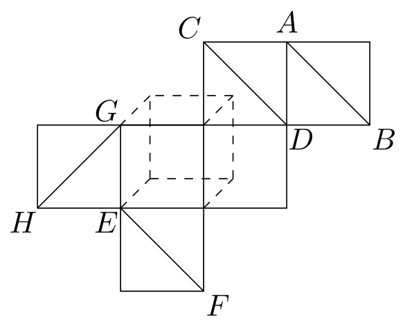
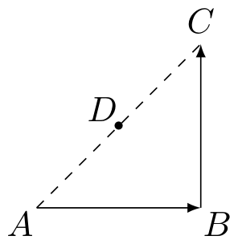
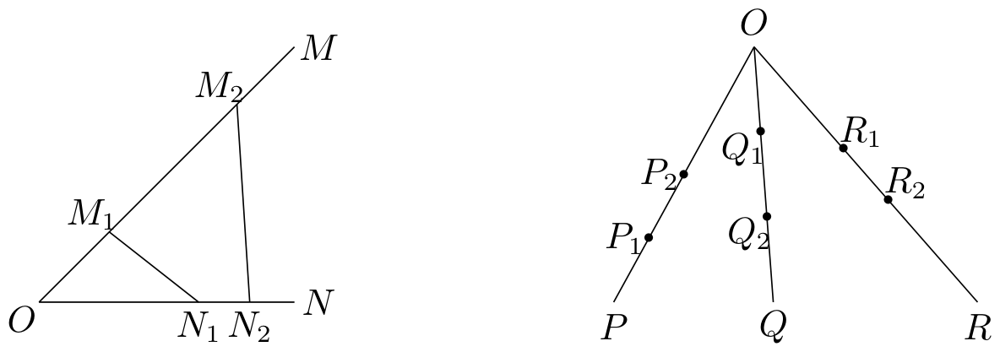
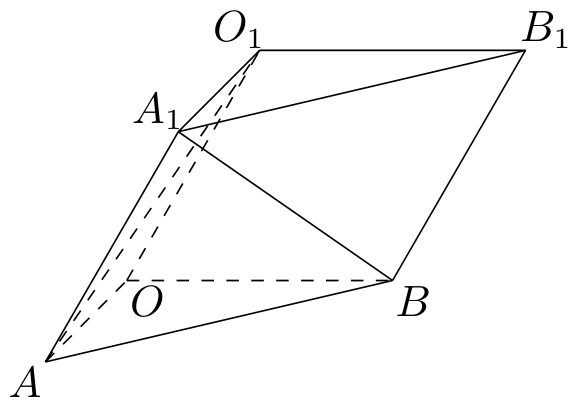

# 2002年上海卷（春）

## 填空题

### 第 1 题

函数 $y = \frac{1}{3 - 2x - x^2}$ 的定义域为＿＿＿＿＿＿.

#### 答案

$\left(-\infty,-3\right)\cup\left(-3,1\right)\cup\left(1,+\infty\right)$

#### 解析

分母不能为零. 由 $3-2x-x^2=0$，得 $x^2+2x-3=0$，即 $(x+3)(x-1)=0$，所以 $x\ne-3$，且 $x\ne1$. 因此定义域为 $\left(-\infty,-3\right)\cup\left(-3,1\right)\cup\left(1,+\infty\right)$.

### 第 2 题

若椭圆的两个焦点坐标为 $F_{1}(-1,0)$，$F_{2}(5,0)$，长轴长为 $10$，则椭圆的方程为＿＿＿＿＿＿.

#### 答案

$\frac{(x-2)^2}{25}+\frac{y^2}{16}=1$

#### 解析

椭圆中心是两焦点的中点，所以中心为 $(2,0)$，焦半距为 $c=3$. 长轴长为 $10$，故 $2a=10$，即 $a=5$. 由 $c^2=a^2-b^2$，得 $b^2=a^2-c^2=25-9=16$. 因而椭圆方程为 $\frac{(x-2)^2}{25}+\frac{y^2}{16}=1$.

### 第 3 题

若全集 $I = \mathbb{R}$，$f(x)$，$g(x)$ 均为 $x$ 的二次函数，$P = \{x \mid f(x) < 0\}$，$Q = \{x \mid g(x) \geqslant 0\}$，则不等式组

$$

\begin{cases}
f(x) < 0,\\
g(x) < 0
\end{cases}

$$

的解集可用 $P$，$Q$ 表示为＿＿＿＿＿＿.

#### 答案

$P\mathbin{\backslash}Q$

#### 解析

不等式组的第一个不等式 $f(x)<0$ 的解集是 $P$. 又因为全集为 $I=\mathbb{R}$，而 $Q=\{x\mid g(x)\geqslant0\}$，所以 $g(x)<0$ 的解集是 $\mathbb{R}\mathbin{\backslash}Q$. 两个不等式要同时成立，故解集为 $P\cap(\mathbb{R}\mathbin{\backslash}Q)=P\mathbin{\backslash}Q$.

### 第 4 题

设 $f(x)$ 是定义在 $\mathbb{R}$ 上的奇函数. 若当 $x \geqslant 0$ 时，$f(x) = \log_3(1 + x)$，则 $f(-2) =$＿＿＿＿＿＿.

#### 答案

$-1$

#### 解析

因为 $f(x)$ 是奇函数，所以 $f(-2)=-f(2)$. 由已知，当 $x=2$ 时，$f(2)=\log_3(1+2)=\log_3 3=1$. 因此 $f(-2)=-1$.

### 第 5 题

若在 $\left(\sqrt[5]{x} - \frac{1}{x}\right)^n$ 的展开式中，第 4 项是常数项，则 $n =$＿＿＿＿＿＿.

#### 答案

$18$

#### 解析

展开式的通项为

$$

T_{k+1}=\mathrm C_n^k\left(\sqrt[5]{x}\right)^{n-k}\left(-\frac{1}{x}\right)^k=\mathrm C_n^k(-1)^k x^{\frac{n-k}{5}-k}=\mathrm C_n^k(-1)^k x^{\frac{n-6k}{5}}

$$

第 4 项对应 $k=3$. 它是常数项，当且仅当 $\frac{n-18}{5}=0$，所以 $n=18$.

### 第 6 题

已知 $f(x) = \sqrt{\frac{1 - x}{1 + x}}$，若 $\alpha \in \left(\frac{\pi}{2}, \pi\right)$，则 $f(\cos \alpha) + f(-\cos \alpha)$ 可化简为＿＿＿＿＿＿.

#### 答案

$\frac{2}{\sin\alpha}$

#### 解析

令 $u=\frac{\alpha}{2}$. 因为 $\alpha\in\left(\frac{\pi}{2},\pi\right)$，所以 $u\in\left(\frac{\pi}{4},\frac{\pi}{2}\right)$，从而 $\sin u>0$，$\cos u>0$. 由半角公式， $f(\cos\alpha)=\sqrt{\frac{1-\cos\alpha}{1+\cos\alpha}}=\tan u$，且 $f(-\cos\alpha)=\sqrt{\frac{1+\cos\alpha}{1-\cos\alpha}}=\cot u$. 因此

$$

f(\cos\alpha)+f(-\cos\alpha)=\tan u+\cot u=\frac{1}{\sin u\cos u}=\frac{2}{\sin\alpha}

$$

### 第 7 题

六位身高全不相同的同学拍照留念. 摄影师要求前后两排各三人，则后排每人均比前排同学高的概率是＿＿＿＿＿＿.

#### 答案

$\frac{1}{20}$

#### 解析

设六位同学按身高从低到高为 $h_1<h_2<\cdots<h_6$. 由于每个三人集合成为后排的可能性相同，后排人员集合共有 $\mathrm C_6^3$ 种等可能选择. 若后排每人均比前排每人高，则后排必须恰好是身高最高的三人 $\{h_4,h_5,h_6\}$；反之，选这三人为后排时条件成立. 有利情况只有 1 种，所以概率为 $\frac{1}{\mathrm C_6^3}=\frac{1}{20}$.

### 第 8 题

设曲线 $C_1$ 和 $C_2$ 的方程分别为 $F_1(x,y) = 0$ 和 $F_2(x,y) = 0$，则点 $P(a,b) \notin C_1 \cap C_2$ 的一个充分条件为＿＿＿＿＿＿.

#### 答案

$F_1(a,b)\ne0$（或 $F_2(a,b)\ne0$）

#### 解析

若 $P(a,b)\in C_1\cap C_2$，则必有 $F_1(a,b)=0$ 且 $F_2(a,b)=0$. 因此只要 $F_1(a,b)\ne0$，点 $P(a,b)$ 就不在 $C_1$ 上，当然不在 $C_1\cap C_2$ 中. 同理，$F_2(a,b)\ne0$ 也成立.

### 第 9 题

若 $f(x) = 2 \sin \omega x$（$0 < \omega < 1$）在区间 $\left[0, \frac{\pi}{3}\right]$ 上的最大值是 $\sqrt{2}$，则 $\omega =$＿＿＿＿＿＿.

#### 答案

$\frac{3}{4}$

#### 解析

当 $x\in\left[0,\frac{\pi}{3}\right]$ 时，$\omega x\in\left[0,\frac{\omega\pi}{3}\right]\subset\left[0,\frac{\pi}{3}\right)$. 正弦函数在该区间上递增，所以 $f(x)$ 的最大值在 $x=\frac{\pi}{3}$ 处取得. 因而 $2\sin\frac{\omega\pi}{3}=\sqrt2$，即 $\sin\frac{\omega\pi}{3}=\frac{\sqrt2}{2}$. 又 $0<\frac{\omega\pi}{3}<\frac{\pi}{3}$，故 $\frac{\omega\pi}{3}=\frac{\pi}{4}$，从而 $\omega=\frac34$.

### 第 10 题

如图表示一个正方体表面的一种展开图，图中的四条线段 $AB$，$CD$，$EF$ 和 $GH$ 在原正方体中相互异面的有＿＿＿＿＿＿对.

#### 答案

$3$

#### 解析

将展开图折成立方体，并取立方体顶点坐标如下：$A=(1,1,0)$，$B=(1,0,1)$，$C=(0,1,0)$，$D=(1,1,1)$，$E=(0,0,0)$，$F=(1,0,1)$，$G=(0,1,0)$，$H=(1,0,0)$. 其中折叠后 $B$ 与 $F$ 重合，$C$ 与 $G$ 重合. 四条直线的方向向量分别可取 $\overrightarrow{AB}=(0,-1,1)$，$\overrightarrow{CD}=(1,0,1)$，$\overrightarrow{EF}=(1,0,1)$，$\overrightarrow{GH}=(1,-1,0)$.

由于 $B=F$，所以 $AB$ 与 $EF$ 相交；由于 $C=G$，所以 $CD$ 与 $GH$ 相交；而 $CD$ 与 $EF$ 的方向向量相同且两直线不重合，所以二者平行. 对其余三对直线逐一检验：若 $AB$ 与 $CD$ 相交，则由 $A+t\overrightarrow{AB}=C+u\overrightarrow{CD}$ 得 $1=u$、$1-t=1$ 和 $t=u$，从而 $u=1$、$t=0$，与 $t=u$ 矛盾；若 $AB$ 与 $GH$ 相交，则由 $A+t\overrightarrow{AB}=G+u\overrightarrow{GH}$ 得 $1=u$、$1-t=1-u$ 和 $t=0$，从而 $u=1$、$t=0$，与 $1-t=1-u$ 矛盾；若 $EF$ 与 $GH$ 相交，则由 $E+t\overrightarrow{EF}=G+u\overrightarrow{GH}$ 得 $t=u$、$0=1-u$ 和 $t=0$，从而 $u=0$，与 $0=1-u$ 矛盾. 这三对直线均不相交且不平行，故均为异面直线. 因此相互异面的共有 3 对.

### 第 11 题

如图所示，客轮以速度 $2v$ 由 $A$ 至 $B$ 再到 $C$ 匀速航行，货轮从 $AC$ 的中点 $D$ 出发，以速度 $v$ 沿直线匀速航行，将货物送达客轮. 已知 $AB \perp BC$，且 $AB = BC = 50\text{ 海里}$. 若两船同时出发，则两船相遇之处距 $C$ 点＿＿＿＿＿＿$\text{海里}$. （结果精确到小数点后 1 位）

#### 答案

$40.8$

#### 解析

设相遇点为 $M$，并设 $CM=s\text{ 海里}$. 取 $B=(0,0)$，$A=(50,0)$，$C=(0,50)$，则 $D=(25,25)$，$M=(0,50-s)$. 客轮航行的路程为 $AB+BM=50+(50-s)=100-s$，所以客轮用时为 $\frac{100-s}{2v}$. 货轮航行路程为

$$

DM=\sqrt{25^2+(25-s)^2}

$$

货轮用时为 $\frac{DM}{v}$. 两船同时出发并相遇，故

$$

\sqrt{25^2+(25-s)^2}=\frac{100-s}{2}

$$

两边平方并化简，得 $4\left[25^2+(25-s)^2\right]=(100-s)^2$，即 $3s^2=5000$. 因为 $0<s<50$，所以 $s=\sqrt{\frac{5000}{3}}\approx40.8248$，精确到小数点后 1 位为 $40.8\text{ 海里}$.

### 第 12 题

如图，若从点 $O$ 所作的两条射线 $OM$，$ON$ 分别有点 $M_{1}$，$M_{2}$ 与点 $N_{1}$，$N_{2}$，则三角形面积之比 $\frac{S_{\triangle O M_{1}N_{1}}}{S_{\triangle O M_{2}N_{2}}} = \frac{OM_{1}}{OM_{2}} \cdot \frac{ON_{1}}{ON_{2}}$，若从点 $O$ 所作的不在同一平面内的三条射线 $OP$，$OQ$ 和 $OR$ 上，分别有点 $P_{1}$，$P_{2}$，点 $Q_{1}$，$Q_{2}$ 和点 $R_{1}$，$R_{2}$ 则类似的结论为＿＿＿＿＿＿.

#### 答案

$\frac{V_{O-P_{1}Q_{1}R_{1}}}{V_{O-P_{2}Q_{2}R_{2}}} = \frac{OP_{1}}{OP_{2}} \cdot \frac{OQ_{1}}{OQ_{2}} \cdot \frac{OR_{1}}{OR_{2}}$

#### 解析

四面体体积可表示为

$$

V_{O-PQR}=\frac16\left|\overrightarrow{OP}\cdot\left(\overrightarrow{OQ}\times\overrightarrow{OR}\right)\right|

$$

因为同一条射线上的向量方向相同，所以存在正数 $\lambda_P=\frac{OP_1}{OP_2}$、$\lambda_Q=\frac{OQ_1}{OQ_2}$、$\lambda_R=\frac{OR_1}{OR_2}$，使得 $\overrightarrow{OP_1}=\lambda_P\overrightarrow{OP_2}$，$\overrightarrow{OQ_1}=\lambda_Q\overrightarrow{OQ_2}$，$\overrightarrow{OR_1}=\lambda_R\overrightarrow{OR_2}$. 代入混合积，得

$$

V_{O-P_1Q_1R_1}=\lambda_P\lambda_Q\lambda_R V_{O-P_2Q_2R_2}

$$

由于 $OP$，$OQ$，$OR$ 不在同一平面内，两个体积均非零，故

$$

\frac{V_{O-P_1Q_1R_1}}{V_{O-P_2Q_2R_2}}=\lambda_P\lambda_Q\lambda_R=\frac{OP_1}{OP_2}\cdot\frac{OQ_1}{OQ_2}\cdot\frac{OR_1}{OR_2}

$$

## 单选题

### 第 13 题

若 $\boldsymbol{a}$，$\boldsymbol{b}$，$\boldsymbol{c}$ 为任意向量，$m \in \mathbb{R}$，则下列等式不一定成立的是（）

A.  
$(\boldsymbol{a}+ \boldsymbol{b}) + \boldsymbol{c}= \boldsymbol{a}+ (\boldsymbol{b}+ \boldsymbol{c})$

B.  
$(\boldsymbol{a}+ \boldsymbol{b}) \cdot \boldsymbol{c}= \boldsymbol{a}\cdot \boldsymbol{c}+ \boldsymbol{b}\cdot \boldsymbol{c}$

C.  
$m(\boldsymbol{a}+ \boldsymbol{b}) = m\boldsymbol{a}+ m\boldsymbol{b}$

D.  
$(\boldsymbol{a}\cdot \boldsymbol{b})\boldsymbol{c}= \boldsymbol{a}(\boldsymbol{b}\cdot \boldsymbol{c})$

#### 答案

D

#### 解析

向量加法满足结合律，所以 A 恒成立；数量积对向量加法满足分配律，所以 B 恒成立；数乘对向量加法满足分配律，所以 C 恒成立. 取 $\boldsymbol{a}=\boldsymbol{b}=(1,0)$，$\boldsymbol{c}=(0,1)$，则 $(\boldsymbol{a}\cdot\boldsymbol{b})\boldsymbol{c}=(0,1)$，而 $\boldsymbol{a}(\boldsymbol{b}\cdot\boldsymbol{c})=(0,0)$. 两者不相等，故 D 中等式不一定成立.

### 第 14 题

在 $\triangle ABC$ 中，若 $2\cos B\sin A = \sin C$，则 $\triangle ABC$ 的形状一定是（）

A.  
等腰直角三角形

B.  
直角三角形

C.  
等腰三角形

D.  
等边三角形

#### 答案

C

#### 解析

在三角形中 $A+B+C=\pi$，所以 $\sin C=\sin(A+B)=\sin A\cos B+\cos A\sin B$. 代入已知条件，得 $2\sin A\cos B=\sin A\cos B+\cos A\sin B$，即 $\sin A\cos B=\cos A\sin B$. 于是 $\sin(A-B)=0$. 由于 $A$，$B\in(0,\pi)$，且 $A-B\in(-\pi,\pi)$，故只能有 $A-B=0$，即 $A=B$. 因而三角形为等腰三角形，选 C.

### 第 15 题

设 $a > 0$，$a \neq 1$，函数 $y = \log_a x$ 的反函数和 $y = \log_a \frac{1}{x}$ 的反函数的图象关于（）

A.  
$x$ 轴对称

B.  
$y$ 轴对称

C.  
$y = x$ 对称

D.  
原点对称

#### 答案

B

#### 解析

函数 $y=\log_a x$ 的反函数为 $y=a^x$. 对于函数 $y=\log_a\frac1x$，有 $a^y=\frac1x$，所以其反函数为 $y=a^{-x}$. 将 $y=a^x$ 的图象关于 $y$ 轴对称，所得方程正是 $y=a^{-x}$. 因此应选 B.

### 第 16 题

设 $\{a_{n}\}$（$n \in \mathbb{N}$）是等差数列，$S_{n}$ 是其前 $n$ 项的和，且 $S_{5} < S_{6}$，$S_{6} = S_{7} > S_{8}$，则下列结论错误的是（）

A.  
$d < 0$

B.  
$a_{7} = 0$

C.  
$S_{9} > S_{5}$

D.  
$S_{6}$ 和 $S_{7}$ 均为 $S_{n}$ 的最大值

#### 答案

C

#### 解析

由 $S_{n+1}-S_n=a_{n+1}$，已知条件给出 $a_6>0$、$a_7=0$、$a_8<0$. 因为 $\{a_n\}$ 是等差数列，故 $a_6=a_7-d=-d$，从而 $d<0$，A、B 正确. 又由于 $d<0$，前面的各项均不小于 $a_6>0$，后面的各项均不大于 $a_8<0$，所以 $S_n$ 先递增，在 $S_6=S_7$ 处取得最大值，再递减，D 正确. 此外 $a_9=2d$，所以

$$

S_9-S_5=a_6+a_7+a_8+a_9=(-d)+0+d+2d=2d<0

$$

即 $S_9<S_5$，故错误的结论是 C.

## 解答题

### 第 17 题

已知 $z$，$\omega$ 为复数，$(1 + 3\i)z$ 为纯虚数，$\omega = \frac{z}{2 + \i}$ 且 $|\omega| = 5\sqrt{2}$，求 $\omega$.

#### 解析

设 $z=x+y\i$，其中 $x$，$y\in\mathbb{R}$. 由

$$

(1+3\i)(x+y\i)=(x-3y)+(3x+y)\i

$$

为纯虚数，得其实部为零，即 $x-3y=0$，所以 $z=(3+\i)y$.

又因为 $|2+\i|=\sqrt5$，所以

$$

|z|=|\omega|\cdot|2+\i|=5\sqrt2\cdot\sqrt5=5\sqrt{10}

$$

而 $|z|=|3+\i|\cdot|y|=\sqrt{10}|y|$，故 $|y|=5$. 因而 $z=5(3+\i)$ 或 $z=-5(3+\i)$.

当 $z=5(3+\i)$ 时，

$$

\omega=\frac{15+5\i}{2+\i}=\frac{(15+5\i)(2-\i)}{5}=7-\i

$$

当 $z=-5(3+\i)$ 时，$\omega=-7+\i$. 所以 $\omega=\pm(7-\i)$.

### 第 18 题

已知 $F_{1}$，$F_{2}$ 为双曲线 $\frac{x^{2}}{a^{2}} - \frac{y^{2}}{b^{2}} = 1$（$a > 0$，$b > 0$）的焦点. 过 $F_{2}$ 作垂直 $x$ 轴的直线交双曲线于点 $P$，且 $\angle PF_{1}F_{2} = 30^{\circ}$，求双曲线的渐近方程.

#### 解析

设双曲线的焦半距为 $c$，则 $c^2=a^2+b^2$，且 $F_1=(-c,0)$，$F_2=(c,0)$. 过 $F_2$ 的垂线为 $x=c$. 代入双曲线方程，得 $\frac{c^2}{a^2}-\frac{y^2}{b^2}=1$，整理得 $y^2=\frac{b^4}{a^2}$. 所以点 $P$ 的纵坐标的绝对值为 $\frac{b^2}{a}$. 在直角三角形 $PF_1F_2$ 中，水平直角边和竖直直角边的长度分别为 $2c$ 与 $\frac{b^2}{a}$，故

$$

\tan30^\circ=\frac{b^2/a}{2c}=\frac1{\sqrt3}

$$

于是 $3b^4=4a^2c^2=4a^2(a^2+b^2)$. 令 $t=\frac{b^2}{a^2}>0$，上式化为 $3t^2=4(1+t)$，即 $3t^2-4t-4=0$，因式分解为 $(3t+2)(t-2)=0$. 因为 $t>0$，所以 $t=2$，即 $b^2=2a^2$. 双曲线的渐近方程为 $y=\pm\frac{b}{a}x$，因此为 $y=\pm\sqrt2x$.

### 第 19 题

如图，三棱柱 $OAB - O_{1}A_{1}B_{1}$，平面 $OBB_{1}O_{1} \perp$ 平面 $OAB$，$\angle O_{1}OB = 60^{\circ}$，$\angle AOB = 90^{\circ}$，且 $OB = OO_{1} = 2$，$OA = \sqrt{3}$. 求：

1.  二面角 $O_{1} - AB - O$ 的大小；

2.  异面直线 $A_{1}B$ 与 $AO_{1}$ 所成角的大小. （上述结果用反三角函数值表示）

#### 解析

建立如图所示的直角坐标系，使 $OAB$ 为 $xy$ 平面，令 $O=(0,0,0)$，$B=(2,0,0)$，$A=(0,\sqrt3,0)$. 由于平面 $OBB_1O_1$ 垂直于平面 $OAB$，且 $O_1O=2$、$\angle O_1OB=60^\circ$，可取 $O_1=(1,0,\sqrt3)$，$A_1=(1,\sqrt3,\sqrt3)$.

1.  取平面 $O_1AB$ 内的两个方向向量 $\overrightarrow{AB}=(2,-\sqrt3,0)$，$\overrightarrow{AO_1}=(1,-\sqrt3,\sqrt3)$. 其法向量可取

$$

\boldsymbol{n}=\overrightarrow{AB}\times\overrightarrow{AO_1}=(-3,-2\sqrt3,-\sqrt3)

$$

    平面 $OAB$ 的法向量为 $\boldsymbol{k}=(0,0,1)$. 设二面角的平面角为 $\theta$，则

$$

\cos\theta=\frac{|\boldsymbol{n}\cdot\boldsymbol{k}|}{|\boldsymbol{n}|\,|\boldsymbol{k}|}=\frac{\sqrt3}{\sqrt{9+12+3}}=\frac1{2\sqrt2}

$$

    所以 $\tan\theta=\sqrt7$，从而 $\theta=\arctan\sqrt7$.

2.  取两条异面直线的方向向量 $\overrightarrow{A_1B}=(1,-\sqrt3,-\sqrt3)$，$\overrightarrow{AO_1}=(1,-\sqrt3,\sqrt3)$. 它们的数量积为 $1+3-3=1$，且两者的长度都为 $\sqrt7$. 设两异面直线所成的锐角为 $\varphi$，则

$$

\cos\varphi=\frac{|\overrightarrow{A_1B}\cdot\overrightarrow{AO_1}|}{|\overrightarrow{A_1B}|\,|\overrightarrow{AO_1}|}=\frac17

$$

    于是 $\tan\varphi=\sqrt{\frac{1}{(1/7)^2}-1}=4\sqrt3$，故 $\varphi=\arctan(4\sqrt3)$.

### 第 20 题

已知函数 $f(x) = a^x + \frac{x - 2}{x + 1}$（$a > 1$）.

1.  证明：函数 $f(x)$ 在 $(-1, +\infty)$ 上为增函数；

2.  用反证法证明方程 $f(x)=0$ 没有负数根.

#### 解析

1.  任取 $x_1$，$x_2\in(-1,+\infty)$，且 $x_1<x_2$. 因为 $a>1$，所以 $a^{x_1}<a^{x_2}$. 另一方面，

$$

\frac{x_2-2}{x_2+1}-\frac{x_1-2}{x_1+1}=\frac{3(x_2-x_1)}{(x_2+1)(x_1+1)}>0

$$

    因为 $x_1+1>0$，$x_2+1>0$. 两式相加得到 $f(x_1)<f(x_2)$，所以 $f(x)$ 在 $(-1,+\infty)$ 上为增函数.

2.  假设方程 $f(x)=0$ 有负数根 $x_0$. 因为 $x=-1$ 不在定义域内，所以分两种情况讨论.

    若 $x_0<-1$，则 $a^{x_0}>0$，且 $x_0-2<0$、$x_0+1<0$，从而 $\frac{x_0-2}{x_0+1}>0$，于是 $f(x_0)>0$，与 $f(x_0)=0$ 矛盾.

    若 $-1<x_0<0$，则 $0<a^{x_0}<1$，并且 $0<x_0+1<1$，所以

$$

\frac{x_0-2}{x_0+1}=1-\frac{3}{x_0+1}<-2

$$

    于是 $f(x_0)<1-2<0$，同样与 $f(x_0)=0$ 矛盾. 因此方程 $f(x)=0$ 没有负数根.

### 第 21 题

某公司全年的利润为 $b\text{ 元}$，其中一部分作为奖金发给 $n$ 位职工，奖金分配方案如下：首先将职工按工作业绩（工作业绩均不相同）从大到小，由 1 到 $n$ 排序. 第 1 位职工得奖金 $\frac{b}{n}\text{ 元}$，然后再将余额除以 $n$ 发给第 2 位职工，按此方法将奖金逐一发给每位职工，并将最后剩余部分作为公司发展基金.

1.  设 $a_k$（$1 \leqslant k \leqslant n$）为第 $k$ 位职工所得奖金额，试求 $a_2$，$a_3$，并用 $k$，$n$ 和 $b$ 表示 $a_k$（不必证明）；

2.  证明 $a_{k} > a_{k + 1}$（$k = 1$，$2$，$\dots$，$n - 1$），并解释此不等式关于分配原则的实际意义；

3.  发展基金与 $n$ 和 $b$ 有关，记为 $P_{n}(b)$，对常数 $b$，当 $n$ 变化时，求 $\displaystyle\lim_{n \to \infty} P_{n}(b)$.

#### 解析

1.  第 1 位职工得到 $a_1=\frac{b}{n}$ 元，发放后余额为 $b-\frac{b}{n}=\frac{b(n-1)}{n}$ 元. 因此 $a_2=\frac{b(n-1)}{n^2}$，$a_3=\frac{b(n-1)^2}{n^3}$. 每次发放后余额都乘以 $\frac{n-1}{n}$，所以

$$

a_k=\frac{b}{n}\left(\frac{n-1}{n}\right)^{k-1}=\frac{b(n-1)^{k-1}}{n^k}

$$

    其中 $1\leqslant k\leqslant n$.

2.  由利润为正知 $b>0$，所以 $a_k>0$. 由上式，$a_{k+1}=a_k\frac{n-1}{n}$，所以 $a_k-a_{k+1}=a_k\frac1n>0$. 所以 $a_k>a_{k+1}$（$k=1$，$2$，$\dots$，$n-1$）. 这说明奖金严格按照工作业绩由高到低递减分配，业绩排名越靠前，所得奖金越多.

3.  发放第 $n$ 位职工后，剩余的比例为 $\left(\frac{n-1}{n}\right)^n$，所以

$$

P_n(b)=b\left(\frac{n-1}{n}\right)^n=b\left(1-\frac1n\right)^n

$$

    利用经典极限 $\displaystyle\lim_{n\to\infty}\left(1-\frac1n\right)^n=\frac1{\e}$，得

$$

\lim_{n\to\infty}P_n(b)=\frac{b}{\e}

$$

### 第 22 题

对于函数 $f(x)$，若存在 $x_0 \in \mathbb{R}$，使 $f(x_0) = x_0$ 成立，则称 $x_0$ 为 $f(x)$ 的不动点. 已知函数 $f(x) = ax^2 + (b + 1)x + (b - 1)$（$a \neq 0$）.

1.  当 $a = 1$，$b = -2$ 时，求函数 $f(x)$ 的不动点；

2.  若对任意实数 $b$，函数 $f(x)$ 恒有两个相异的不动点，求 $a$ 的取值范围；

3.  在（2）的条件下，若 $y = f(x)$ 图上 $A$，$B$ 两点的横坐标是函数 $f(x)$ 的不动点，且 $A$，$B$ 两点关于直线 $y = kx + \frac{1}{2a^2 + 1}$ 对称，求 $b$ 的最小值.

#### 解析

不动点满足 $f(x)=x$，即 $ax^2+(b+1)x+(b-1)=x\Longleftrightarrow ax^2+bx+(b-1)=0$.

1.  当 $a=1$，$b=-2$ 时，不动点方程为 $x^2-2x-3=0$，即 $(x-3)(x+1)=0$. 所以不动点为 $-1$ 和 $3$.

2.  对任意实数 $b$，上述关于 $x$ 的二次方程有两个相异实根，当且仅当判别式 $\Delta=b^2-4a(b-1)=(b-2a)^2+4a(1-a)$ 对任意实数 $b$ 都大于零. 因为 $(b-2a)^2$ 可以取零，所以必须且只需 $4a(1-a)>0$，即 $0<a<1$.

3.  设两个不动点为 $x_1$，$x_2$. 由于它们是不动点，图像上的两点为 $A=(x_1,x_1)$，$B=(x_2,x_2)$，故直线 $AB$ 的斜率为 $1$. 两点关于给定直线对称时，该直线是线段 $AB$ 的垂直平分线，因此 $k=-1$.

    由韦达定理，$x_1+x_2=-\frac{b}{a}$. 线段 $AB$ 的中点为 $\left(-\frac{b}{2a},-\frac{b}{2a}\right)$. 将它代入垂直平分线 $y=-x+\frac{1}{2a^2+1}$，得 $-\frac{b}{2a}=\frac{b}{2a}+\frac{1}{2a^2+1}$，即 $-\frac{b}{a}=\frac{1}{2a^2+1}$，从而 $b=-\frac{a}{2a^2+1}$. 在 $0<a<1$ 时，由 $(\sqrt2a-1)^2\geqslant0$ 得 $2\sqrt2a\leqslant2a^2+1$，从而 $\frac{a}{2a^2+1}\leqslant\frac{1}{2\sqrt2}$. 因此 $b\geqslant-\frac{1}{2\sqrt2}$. 当 $a=\frac1{\sqrt2}$ 时取等号，且该值满足 $0<a<1$. 所以 $b$ 的最小值为 $-\frac{1}{2\sqrt2}=-\frac{\sqrt2}{4}$.
