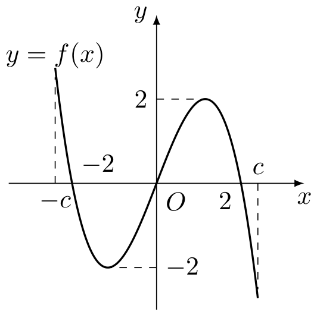
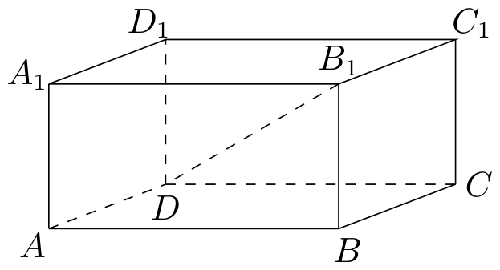
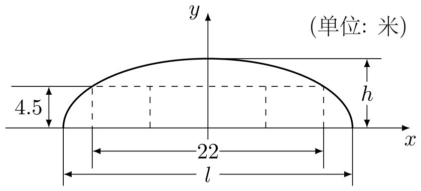

# 2003年上海卷（秋文）

## 填空题

### 第 1 题

函数 $y = \sin x \cos \left( x + \frac{\pi}{4} \right) + \cos x \sin \left( x + \frac{\pi}{4} \right)$ 的最小正周期 $T =$＿＿＿＿＿＿.

#### 答案

$\pi$

#### 解析

由和角公式，原函数可化为 $y=\sin\left(2x+\frac{\pi}{4}\right)$. 正弦函数的最小正周期为 $2\pi$，所以原函数的最小正周期为 $\frac{2\pi}{2}=\pi$.

### 第 2 题

若 $x = \frac{\pi}{3}$ 是方程 $2\cos (x + \alpha) = 1$ 的解，其中 $\alpha \in (0,2\pi)$，则 $\alpha =$＿＿＿＿＿＿.

#### 答案

$\frac{4\pi}{3}$

#### 解析

将 $x=\frac{\pi}{3}$ 代入方程，得 $\cos\left(\frac{\pi}{3}+\alpha\right)=\frac{1}{2}$. 因为 $\alpha\in(0,2\pi)$，所以 $\frac{\pi}{3}+\alpha\in\left(\frac{\pi}{3},\frac{7\pi}{3}\right)$. 在此区间内满足余弦值为 $\frac{1}{2}$ 的角只有 $\frac{5\pi}{3}$，故 $\alpha=\frac{4\pi}{3}$.

### 第 3 题

在等差数列 $\{a_{n}\}$ 中，$a_{5} = 3$，$a_{6} = -2$，则 $a_{4} + a_{5} + \cdots + a_{10} =$＿＿＿＿＿＿.

#### 答案

$-49$

#### 解析

等差数列的公差为 $d=a_6-a_5=-5$，所以 $a_4=8$，$a_{10}=-22$. 从 $a_4$ 到 $a_{10}$ 共 $7$ 项，故 $a_4+a_5+\cdots+a_{10}=\frac{7(a_4+a_{10})}{2}=-49$.

### 第 4 题

已知定点 $A(0,1)$，点 $B$ 在直线 $x + y = 0$ 上运动，当线段 $AB$ 最短时，点 $B$ 的坐标是＿＿＿＿＿＿.

#### 答案

$\left(-\frac{1}{2},\frac{1}{2}\right)$

#### 解析

设 $B=(x,y)$，由 $B$ 在线 $x+y=0$ 上，得 $y=-x$. 因此 $|AB|^2=x^2+(y-1)^2=x^2+(-x-1)^2=2\left(x+\frac{1}{2}\right)^2+\frac{1}{2}$. 当且仅当 $x=-\frac{1}{2}$ 时取得最小值，此时 $y=\frac{1}{2}$，所以 $B$ 的坐标为 $\left(-\frac{1}{2},\frac{1}{2}\right)$.

### 第 5 题

在正四棱锥 $P - ABCD$ 中，若侧面与底面所成二面角的大小为 $60^{\circ}$，则异面直线 $PA$ 与 $BC$ 所成角的大小等于＿＿＿＿＿＿.（结果用反三角函数值表示）

#### 答案

$\arctan 2$

#### 解析

设正方形底面边长为 $a$，底面中心为 $O$，侧棱高为 $h$，并设 $M$ 为 $AB$ 的中点. 侧面与底面所成的二面角为 $\angle PMO=60^{\circ}$，且 $OM=\frac{a}{2}$，所以在直角三角形 $POM$ 中，$h=PO=OM\tan60^{\circ}=\frac{\sqrt{3}}{2}a$.

取底面为水平面，令 $A=\left(-\frac{a}{2},-\frac{a}{2},0\right)$，$B=\left(\frac{a}{2},-\frac{a}{2},0\right)$，$P=(0,0,h)$. 则可取 $\overrightarrow{PA}=\left(-\frac{a}{2},-\frac{a}{2},-h\right)$，$\overrightarrow{BC}=(0,a,0)$. 设异面直线所成的锐角为 $\varphi$，则 $\cos\varphi=\frac{\left|\overrightarrow{PA}\cdot\overrightarrow{BC}\right|}{|PA|\,|BC|}=\frac{a^2/2}{a\sqrt{a^2/2+h^2}}=\frac{1}{\sqrt{5}}$. 因此 $\tan\varphi=2$，故 $\varphi=\arctan 2$.

### 第 6 题

设集合 $A = \{x \mid |x| < 4\}$，$B = \{x \mid x^2 - 4x + 3 > 0\}$，则集合 $\{x \mid x \in A \text{ 且 } x \notin A \cap B\} =$＿＿＿＿＿＿.

#### 答案

$\left[1,3\right]$

#### 解析

由 $|x|<4$，得 $A=(-4,4)$. 又因为 $x^2-4x+3=(x-1)(x-3)>0$，所以 $B=(-\infty,1)\cup(3,+\infty)$. 于是 $A\cap B=(-4,1)\cup(3,4)$，题目所求集合为 $A\setminus(A\cap B)=[1,3]$.

### 第 7 题

在 $\triangle ABC$ 中，$\sin A: \sin B: \sin C = 2:3:4$，则 $\angle ABC =$＿＿＿＿＿＿.（结果用反三角函数值表示）

#### 答案

$\arccos\frac{11}{16}$

#### 解析

由正弦定理，三角形的边长满足 $a:b:c=\sin A:\sin B:\sin C=2:3:4$. 设 $a=2k$，$b=3k$，$c=4k$，由余弦定理 $b^2=a^2+c^2-2ac\cos B$，得 $9k^2=4k^2+16k^2-16k^2\cos B$，即 $\cos B=\frac{11}{16}$. 因此 $\angle ABC=B=\arccos\frac{11}{16}$.

### 第 8 题

若首项为 $a_{1}$，公比为 $q$ 的等比数列 $\{a_{n}\}$ 的前 $n$ 项和总小于这个数列的各项和，则首项 $a_{1}$，公比 $q$ 的一组取值可以是 $(a_{1}, q) =\underline{\qquad\qquad}$.

#### 答案

$\left(1,\frac{1}{2}\right)$

#### 解析

取 $a_1=1$，$q=\frac{1}{2}$. 因为 $a_1>0$ 且 $0<q<1$，等比数列各项和为 $S_\infty=\frac{a_1}{1-q}=2$，前 $n$ 项和为 $S_n=\frac{a_1(1-q^n)}{1-q}=2\left(1-\left(\frac{1}{2}\right)^n\right)$. 所以 $S_\infty-S_n=2\left(\frac{1}{2}\right)^n>0$，即对任意正整数 $n$，前 $n$ 项和都小于数列各项的总和，故这组取值符合题意.

### 第 9 题

某国际科研合作项目成员由 11 个美国人，4 个法国人和 5 个中国人组成，现从中随机选出两位作为成果发布人，则此两人不属于同一个国家的概率为＿＿＿＿＿＿. （结果用分数表示）

#### 答案

$\frac{119}{190}$

#### 解析

成员总数为 $11+4+5=20$，从中选出两人的总选法数为 $\mathrm C_{20}^{2}=190$. 两人属于同一个国家的选法数为 $\mathrm C_{11}^{2}+\mathrm C_{4}^{2}+\mathrm C_{5}^{2}=55+6+10=71$. 因此两人不属于同一个国家的概率为 $\frac{190-71}{190}=\frac{119}{190}$.

### 第 10 题

方程 $x^{3} + \lg x = 18$ 的根 $x \approx$＿＿＿＿＿＿.（结果精确到 $0.1$）

#### 答案

$2.6$

#### 解析

令 $F(x)=x^3+\lg x-18$，定义域为 $x>0$. 因为 $F'(x)=3x^2+\frac{1}{x\ln10}>0$，所以 $F(x)$ 在 $(0,+\infty)$ 上严格递增，方程至多有一个根. 又 $F(2.55)=2.55^3+\lg2.55-18\approx16.5814+0.4065-18<0$，$F(2.65)=2.65^3+\lg2.65-18\approx18.6096+0.4232-18>0$. 由连续性，方程的根在 $(2.55,2.65)$ 内，精确到 $0.1$ 为 $2.6$.

### 第 11 题

已知点 $A\left(0, \frac{2}{n}\right)$，$B\left(0, -\frac{2}{n}\right)$，$C\left(4 + \frac{2}{n}, 0\right)$，其中 $n$ 为正整数，设 $S_{n}$ 表示 $\triangle ABC$ 外接圆的面积，则 $\displaystyle\lim_{n \to \infty} S_{n} =$＿＿＿＿＿＿.

#### 答案

$4\pi$

#### 解析

由于 $A$、$B$ 关于 $x$ 轴对称，线段 $AB$ 的垂直平分线为 $x$ 轴，设三角形外接圆圆心为 $O_n=(u_n,0)$. 由 $O_nA=O_nC$，得 $u_n^2+\frac{4}{n^2}=\left(u_n-4-\frac{2}{n}\right)^2$，从而 $u_n=\frac{4(n+1)}{2n+1}$. 外接圆半径满足 $R_n^2=u_n^2+\frac{4}{n^2}$，所以 $u_n\to2$，$R_n\to2$. 因此 $\lim_{n\to\infty}S_n=\lim_{n\to\infty}\pi R_n^2=4\pi$.

### 第 12 题

给出问题：$F_{1}$，$F_{2}$ 是双曲线 $\frac{x^{2}}{16} - \frac{y^{2}}{20} = 1$ 的焦点，点 $P$ 在双曲线上. 若点 $P$ 到焦点 $F_{1}$ 的距离等于 9，求点 $P$ 到焦点 $F_{2}$ 的距离. 某学生的解答如下：双曲线的实轴长为 8，由 $\left|PF_{1}\right| - \left|PF_{2}\right| = 8$，即 $\left|9 - \left|PF_{2}\right|\right| = 8$，得 $\left|PF_{2}\right| = 1$ 或 17. 该学生的解答是否正确？若正确，请将他的解题依据填在下面空格内，若不正确，将正确的结果填在下面空格内＿＿＿＿＿＿.

#### 答案

$\left|PF_{2}\right|=17$

#### 解析

双曲线的标准方程中 $a^2=16$，所以 $a=4$，焦距参数满足 $c^2=a^2+20=36$，从而两焦点距离 $|F_1F_2|=2c=12$. 双曲线上任一点满足 $\left||PF_1|-|PF_2|\right|=2a=8$. 代入 $|PF_1|=9$，得 $|9-|PF_2||=8$，形式上得到 $|PF_2|=1$ 或 $17$.

但若 $|PF_2|=1$，则 $|PF_1|+|PF_2|=10<|F_1F_2|=12$，违反三角形两边之和大于第三边，故该值不可能. 所以学生把两个代数结果都保留是不正确的，正确结果为 $|PF_2|=17$.

## 单选题

### 第 13 题

下列函数中，既为偶函数又在 $(0, \pi)$ 上单调递增的是（）

A.  
$y = \tan |x|$

B.  
$y = \cos (-x)$

C.  
$y = \sin \left(x - \frac{\pi}{2}\right)$

D.  
$y = \left|\cot \frac{x}{2}\right|$

#### 答案

C

#### 解析

选项 A 中，$y=\tan|x|$ 虽为偶函数，但在 $(0,\pi)$ 内经过 $x=\frac{\pi}{2}$ 处的间断点，不是单调递增函数. 选项 B 中，$y=\cos(-x)=\cos x$ 为偶函数，但在 $(0,\pi)$ 上单调递减. 选项 C 中，$y=\sin\left(x-\frac{\pi}{2}\right)=-\cos x$ 为偶函数，且其导数为 $\sin x>0$，所以在 $(0,\pi)$ 上单调递增. 选项 D 中，$x\in(0,\pi)$ 时 $\left|\cot\frac{x}{2}\right|=\cot\frac{x}{2}$ 单调递减. 故选 C.

### 第 14 题

在下列条件中，可判断平面 $\alpha$ 与 $\beta$ 平行的是（）

A.  
$\alpha$，$\beta$ 都垂直于平面 $\gamma$

B.  
$\alpha$ 内存在不共线的三点到 $\beta$ 的距离相等

C.  
$l$，$m$ 是 $\alpha$ 内两条直线，且 $l \parallel \beta$，$m \parallel \beta$

D.  
$l$，$m$ 是两条异面直线，且 $l \parallel \alpha$，$m \parallel \alpha$，$l \parallel \beta$，$m \parallel \beta$

#### 答案

D

#### 解析

若两个平面相交，则一条同时平行于这两个平面的直线必平行于它们的交线. 选项 D 中，$l$、$m$ 都同时平行于 $\alpha$、$\beta$，若 $\alpha$ 与 $\beta$ 相交，则 $l$、$m$ 都平行于交线，从而彼此平行，这与 $l$、$m$ 为异面直线矛盾. 因此 $\alpha\parallel\beta$.

选项 A 只说明两个平面有同一个法向方向，不能排除相交；选项 B 中三点可能分别落在 $\beta$ 两侧的等距平面上；选项 C 中两条直线不一定相交，均不足以判断两平面平行. 故选 D.

### 第 15 题

在 $P(1,1)$，$Q(1,2)$，$M(2,3)$ 和 $N\left(\frac{1}{2},\frac{1}{4}\right)$ 四点中，函数 $y = a^x$ 的图象与其反函数的图象的公共点只可能是点（）

A.  
$P$

B.  
$Q$

C.  
$M$

D.  
$N$

#### 答案

D

#### 解析

若点 $(x,y)$ 同时在函数 $y=a^x$ 及其反函数的图象上，则必须满足 $y=a^x$ 且 $x=a^y$，其中 $a>0$ 且 $a\ne1$. 对 $P(1,1)$，由 $1=a$ 得 $a=1$，函数没有反函数，故不可能. 对 $Q(1,2)$，由 $2=a$ 得 $a=2$，但 $1\ne2^2$，故不可能. 对 $M(2,3)$，由 $3=a^2$ 得 $a=\sqrt{3}$，但 $2\ne(\sqrt{3})^3$，故不可能. 对 $N\left(\frac{1}{2},\frac{1}{4}\right)$，由 $\frac{1}{4}=a^{1/2}$ 得 $a=\frac{1}{16}$，并且 $\left(\frac{1}{16}\right)^{1/4}=\frac{1}{2}$，满足两个条件. 因此公共点只可能是点 $N$，选 D.

### 第 16 题

$f(x)$ 是定义在区间 $[-c, c]$ 上的奇函数，其图象如图所示：令 $g(x) = af(x) + b$，则下列关于函数 $g(x)$ 的叙述正确的是（）

A.  
若 $a < 0$，则函数 $g(x)$ 的图象关于原点对称

B.  
若 $a = -1$，$-2 < b < 0$，则方程 $g(x) = 0$ 有大于 2 的实根

C.  
若 $a \neq 0$，$b = 2$，则方程 $g(x) = 0$ 有两个实根

D.  
若 $a \geqslant 1$，$b < 2$，则方程 $g(x) = 0$ 有三个实根

#### 答案

B

#### 解析

选项 A 不成立，因为 $g(0)=b$，当 $b\ne0$ 时图象不可能关于原点对称. 选项 B 中，方程 $g(x)=0$ 等价于 $f(x)=b$. 由图象可见，在 $x=2$ 处函数值为正，而在 $x=c$ 处函数值小于 $-2$，当 $-2<b<0$ 时由连续性可知存在 $x\in(2,c)$ 使 $f(x)=b$，故方程有大于 $2$ 的实根.

选项 C 并非对所有 $a\ne0$ 成立，例如取 $a=2$，方程化为 $f(x)=-1$，由图象可见它有三个实根. 选项 D 也不成立，例如取 $a=1$ 且令 $b$ 为充分小的负数，则方程化为 $f(x)=-b$，右端超过图象的最大值，方程无实根. 故选 B.

## 解答题

### 第 17 题

已知复数 $z_{1} = \cos \theta - \i$，$z_{2} = \sin \theta + \i$，求 $|z_{1} \cdot z_{2}|$ 的最大值和最小值.

#### 解析

由复数模的乘法性质， $|z_1z_2|^2=|z_1|^2|z_2|^2=(1+\cos^2\theta)(1+\sin^2\theta)=2+\sin^2\theta\cos^2\theta=2+\frac{1}{4}\sin^22\theta$. 因为 $0\leq\sin^22\theta\leq1$，所以 $2\leq|z_1z_2|^2\leq\frac{9}{4}$. 当 $\sin^22\theta=0$ 时取得下界，当 $\sin^22\theta=1$ 时取得上界，故 $|z_1z_2|$ 的最小值为 $\sqrt{2}$，最大值为 $\frac{3}{2}$.

### 第 18 题

已知平行六面体 $ABCD - A_{1}B_{1}C_{1}D_{1}$ 中，$A_{1}A \perp$ 平面 $ABCD$，$AB = 4$，$AD = 2$. 若 $B_{1}D \perp BC$，直线 $B_{1}D$ 与平面 $ABCD$ 所成的角等于 $30^{\circ}$，求平行六面体 $ABCD - A_{1}B_{1}C_{1}D_{1}$ 的体积.

#### 解析

因为 $B_1B\perp$ 平面 $ABCD$，所以 $B_1B\perp BC$. 又 $B_1D\perp BC$，且 $\overrightarrow{DB_1}=\overrightarrow{DB}+\overrightarrow{BB_1}$，从而 $\overrightarrow{DB}\mathbin{\cdot}\overrightarrow{BC}=\overrightarrow{DB_1}\mathbin{\cdot}\overrightarrow{BC}-\overrightarrow{BB_1}\mathbin{\cdot}\overrightarrow{BC}=0$. 因此 $BD\perp BC$.

在直角三角形 $BCD$ 中，$BC=AD=2$，$CD=AB=4$，所以 $BD=\sqrt{CD^2-BC^2}=2\sqrt{3}$. 于是底面平行四边形的面积为 $S_{ABCD}=2S_{BCD}=BC\cdot BD=4\sqrt{3}$.

直线 $B_1D$ 与底面所成的角为 $\angle B_1DB=30^{\circ}$，故在直角三角形 $B_1BD$ 中，$B_1B=BD\tan30^{\circ}=2$. 因而平行六面体的体积为 $V=S_{ABCD}\cdot B_1B=8\sqrt{3}$.

### 第 19 题

已知函数 $f(x) = \frac{1}{x} - \log_2 \frac{1 + x}{1 - x}$，求函数 $f(x)$ 的定义域. 并讨论它的奇偶性和单调性.

#### 解析

由 $x\ne0$ 且 $\frac{1+x}{1-x}>0$，得函数定义域为 $(-1,0)\cup(0,1)$.

对定义域内的任意 $x$，有 $f(-x)=-\frac{1}{x}-\log_2\frac{1-x}{1+x}=-\frac{1}{x}+\log_2\frac{1+x}{1-x}=-f(x)$，所以 $f(x)$ 是奇函数.

在定义域的任一连通区间内，$f'(x)=-\frac{1}{x^2}-\frac{1}{\ln2}\left(\frac{1}{1+x}+\frac{1}{1-x}\right)=-\frac{1}{x^2}-\frac{2}{(1-x^2)\ln2}<0$. 因此 $f(x)$ 在 $(-1,0)$ 和 $(0,1)$ 上均严格单调递减.

### 第 20 题

如图，某隧道设计为双向四车道，车道总宽 $22\text{ 米}$，要求通行车辆限高 $4.5\text{ 米}$，隧道全长 $2.5\text{ 千米}$，隧道的拱线近似地看成半个椭圆形状.

1.  若最大拱高 $h$ 为 $6\text{ 米}$，则隧道设计的拱宽 $l$ 是多少？

2.  若最大拱高 $h$ 不小于 $6\text{ 米}$，则应如何设计拱高 $h$ 和拱宽 $l$，才能使半个椭圆形隧道的土方工程量最小？

半个椭圆的面积公式为 $S = \frac{\pi}{4}lh$，柱体体积等于底面积乘以高，结果精确到 $0.1\text{ 米}$.

#### 解析

1.  设半椭圆的长、短半轴分别为 $a=\frac{l}{2}$ 和 $b=h$，则其方程为 $\frac{x^2}{a^2}+\frac{y^2}{b^2}=1$. 由图中点 $(11,4.5)$ 在椭圆上，且 $h=b=6$，得 $\frac{11^2}{a^2}+\frac{4.5^2}{6^2}=1$，即 $\frac{121}{a^2}=\frac{7}{16}$. 所以 $a=\frac{44}{\sqrt{7}}$，$l=2a=\frac{88}{\sqrt{7}}\approx33.3\mathrm{~m}$.

2.  车道总宽和隧道长度固定，土方工程量与半椭圆截面积 $S=\frac{\pi}{2}ab$ 成正比. 当 $h=b\ge6$ 时，仍有 $\frac{11^2}{a^2}+\frac{4.5^2}{b^2}=1$. 由均值不等式，$1=\frac{11^2}{a^2}+\frac{4.5^2}{b^2}\ge\frac{2\cdot11\cdot4.5}{ab}$，所以 $ab\ge99$. 等号成立的条件为 $\frac{11^2}{a^2}=\frac{4.5^2}{b^2}=\frac{1}{2}$，从而 $a=11\sqrt{2}$，$b=\frac{9\sqrt{2}}{2}$. 此时 $h=b\approx6.4\mathrm{~m}\ge6\mathrm{~m}$，且 $l=2a=22\sqrt{2}\approx31.1\mathrm{~m}$. 因此应设计为拱高约 $6.4\mathrm{~m}$，拱宽约 $31.1\mathrm{~m}$.

### 第 21 题

在以 $O$ 为原点的直角坐标系中，点 $A(4, -3)$ 为 $\triangle OAB$ 的直角顶点. 已知 $|AB| = 2|OA|$，且点 $B$ 的纵坐标大于零.

1.  求向量 $\overrightarrow{AB}$ 的坐标；

2.  求圆 $x^{2} - 6x + y^{2} + 2y = 0$ 关于直线 $OB$ 对称的圆的方程；

3.  是否存在实数 $a$，使抛物线 $y = ax^2 - 1$ 上总有关于直线 $OB$ 对称的两个点？若不存在，说明理由；若存在，求 $a$ 的取值范围.

#### 解析

1.  设 $\overrightarrow{AB}=(u,v)$. 因为 $\triangle OAB$ 在 $A$ 处为直角，且 $|OA|=5$，所以 $u^2+v^2=|AB|^2=4|OA|^2=100$，$4u-3v=0$. 解得 $(u,v)=(6,8)$ 或 $(-6,-8)$. 又 $B=A+(u,v)$ 的纵坐标大于零，排除 $(-6,-8)$，所以 $\overrightarrow{AB}=(6,8)$，$B=(10,5)$.

2.  原圆可化为 $(x-3)^2+(y+1)^2=10$，圆心为 $C_0=(3,-1)$，半径为 $\sqrt{10}$. 由 $B=(10,5)$，直线 $OB$ 的方程为 $x-2y=0$. 点 $C_0$ 关于此直线的对称点 $C_1=(x,y)$ 满足 $\frac{x+3}{2}-2\cdot\frac{y-1}{2}=0$，$\frac{y+1}{x-3}=-2$，解得 $C_1=(1,3)$. 反射保持半径不变，所以所求圆的方程为 $(x-1)^2+(y-3)^2=10$.

3.  若 $a=0$，抛物线为直线 $y=-1$，它关于斜率为 $\frac{1}{2}$ 的直线 $OB$ 的对称图形是另一条直线，至多与原直线有一个交点，不可能存在关于 $OB$ 对称的两个不同点. 因此只需讨论 $a\ne0$. 此时设抛物线上关于直线 $OB$ 对称的两个不同点为 $P_1(x_1,y_1)$、$P_2(x_2,y_2)$. 线段 $P_1P_2$ 的中点在直线 $OB$ 上，且 $P_1P_2\perp OB$，故 $\frac{x_1+x_2}{2}-\left(y_1+y_2\right)=0$，$\frac{y_1-y_2}{x_1-x_2}=-2$. 又因为 $y_i=ax_i^2-1$，第二个等式给出 $a(x_1+x_2)=-2$，即 $x_1+x_2=-\frac{2}{a}$. 代入第一个等式，得 $x_1x_2=\frac{5-2a}{2a^2}$. 因此 $x_1$，$x_2$ 是方程 $x^2+\frac{2}{a}x+\frac{5-2a}{2a^2}=0$ 的两个根. 要有两个不同实根，必须且只需 $\Delta=\frac{4}{a^2}-4\cdot\frac{5-2a}{2a^2}=\frac{4a-6}{a^2}>0$，即 $a>\frac{3}{2}$. 对任意这样的 $a$，由所得两根构造的两点满足中点在对称轴上且连线垂直于对称轴，确为关于 $OB$ 对称的两个点，故取值范围为 $a>\frac{3}{2}$.

### 第 22 题

已知数列 $\{a_{n}\}$ （$n$ 为正整数）是首项是 $a_{1}$，公比为 $q$ 的等比数列.

1.  求和：$a_{1}\mathrm C_{2}^{0} - a_{2}\mathrm C_{2}^{1} + a_{3}\mathrm C_{2}^{2}$，$a_{1}\mathrm C_{3}^{0} - a_{2}\mathrm C_{3}^{1} + a_{3}\mathrm C_{3}^{2} - a_{4}\mathrm C_{3}^{3}$；

2.  由前一问的结果归纳概括出关于正整数 $n$ 的一个结论，并加以证明；

3.  设 $q \neq 1$，$S_n$ 是等比数列 $\{a_n\}$ 的前 $n$ 项和. 求：$S_1\mathrm C_n^0 - S_2\mathrm C_n^1 + S_3\mathrm C_n^2 - S_4\mathrm C_n^3 + \cdots + (-1)^n S_{n+1}\mathrm C_n^n$.

#### 解析

1.  因为 $a_2=a_1q$，$a_3=a_1q^2$，$a_4=a_1q^3$，所以 $a_1\mathrm C_2^0-a_2\mathrm C_2^1+a_3\mathrm C_2^2=a_1-2a_1q+a_1q^2=a_1(1-q)^2$，$a_1\mathrm C_3^0-a_2\mathrm C_3^1+a_3\mathrm C_3^2-a_4\mathrm C_3^3=a_1-3a_1q+3a_1q^2-a_1q^3=a_1(1-q)^3$.

2.  归纳结论为：对任意正整数 $n$，有 $a_1\mathrm C_n^0-a_2\mathrm C_n^1+a_3\mathrm C_n^2-\cdots+(-1)^n a_{n+1}\mathrm C_n^n=a_1(1-q)^n$. 证明如下：由 $a_{k+1}=a_1q^k$，左端等于 $a_1\sum_{k=0}^{n}\mathrm C_n^k(-q)^k$. 根据二项式定理，该式等于 $a_1(1-q)^n$，结论成立.

3.  因为 $q\ne1$，所以 $S_j=\frac{a_1(1-q^j)}{1-q}$. 设所求式为 $T$，则 $T=\frac{a_1}{1-q}\sum_{k=0}^{n}\mathrm C_n^k(-1)^k(1-q^{k+1})=\frac{a_1}{1-q}\left[\sum_{k=0}^{n}\mathrm C_n^k(-1)^k-q\sum_{k=0}^{n}\mathrm C_n^k(-q)^k\right]$. 因为 $n$ 为正整数，第一项为 $(1-1)^n=0$，第二项为 $q(1-q)^n$，故 $T=-\frac{a_1q}{1-q}(1-q)^n=\frac{a_1q}{q-1}(1-q)^n$.
