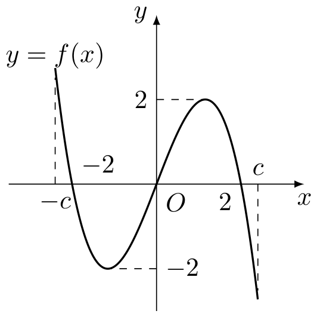

# 2003年上海卷（秋理）

## 填空题

### 第 1 题

函数 $y = \sin x \cos \left( x + \frac{\pi}{4} \right) + \cos x \sin \left( x + \frac{\pi}{4} \right)$ 的最小正周期 $T =$＿＿＿＿＿＿.

#### 答案

$\pi$

#### 解析

由正弦的和角公式，原函数为 $y=\sin\left(2x+\frac{\pi}{4}\right)$. 函数 $\sin(2x+\frac{\pi}{4})$ 的角频率为 $2$，所以最小正周期为 $T=\frac{2\pi}{2}=\pi$.

### 第 2 题

若 $x = \frac{\pi}{3}$ 是方程 $2\cos (x + \alpha) = 1$ 的解，其中 $\alpha \in \left(0, 2\pi\right)$，则 $\alpha =$＿＿＿＿＿＿.

#### 答案

$\frac{4\pi}{3}$

#### 解析

把 $x=\frac{\pi}{3}$ 代入方程，得 $\cos\left(\alpha+\frac{\pi}{3}\right)=\frac{1}{2}$. 因为 $\alpha\in(0,2\pi)$，所以 $\alpha+\frac{\pi}{3}\in\left(\frac{\pi}{3},\frac{7\pi}{3}\right)$. 在此区间内满足余弦值为 $\frac{1}{2}$ 的角为 $\frac{5\pi}{3}$，从而 $\alpha=\frac{5\pi}{3}-\frac{\pi}{3}=\frac{4\pi}{3}$.

### 第 3 题

在等差数列 $\{a_{n}\}$ 中，$a_{5} = 3$，$a_{6} = -2$，则 $a_{4} + a_{5} + \cdots + a_{10} =\underline{\qquad\qquad}$.

#### 答案

$-49$

#### 解析

等差数列的公差为 $d=a_{6}-a_{5}=-5$，所以 $a_{4}=a_{5}-d=8$，$a_{10}=a_{5}+5d=-22$. 共有 $7$ 项，故 $a_{4}+a_{5}+\cdots+a_{10}=\frac{7(a_{4}+a_{10})}{2}=\frac{7(8-22)}{2}=-49$.

### 第 4 题

在极坐标系中，定点 $A\left(1, \frac{\pi}{2}\right)$，点 $B$ 在直线 $\rho \cos \theta + \rho \sin \theta = 0$ 上运动，当线段 $AB$ 最短时，点 $B$ 的极坐标是＿＿＿＿＿＿.

#### 答案

$\left(\frac{\sqrt{2}}{2}, \frac{3\pi}{4}\right)$

#### 解析

极坐标点 $A\left(1,\frac{\pi}{2}\right)$ 的直角坐标为 $A(0,1)$，动点所在直线的方程为 $x+y=0$. 线段 $AB$ 最短时，$B$ 是点 $A$ 到直线 $x+y=0$ 的垂足. 设垂足为 $B(x,y)$，则 $y=-x$，且 $AB$ 的方向与直线垂直，所以 $y-1=x$. 联立得 $x=-\frac{1}{2}$，$y=\frac{1}{2}$. 因而 $B$ 的极径为 $\rho=\sqrt{x^{2}+y^{2}}=\frac{\sqrt{2}}{2}$，极角为 $\theta=\frac{3\pi}{4}$，故 $B$ 的极坐标为 $\left(\frac{\sqrt{2}}{2},\frac{3\pi}{4}\right)$.

### 第 5 题

在正四棱锥 $P - ABCD$ 中，若侧面与底面所成二面角的大小为 $60^{\circ}$，则异面直线 $PA$ 与 $BC$ 所成角的大小等于＿＿＿＿＿＿. （结果用反三角函数值表示）

#### 答案

$\arctan 2$

#### 解析

设正方形底面边长为 $a$，设 $M$ 是 $AB$ 的中点，$O$ 是底面中心. 在过 $POM$ 且垂直于 $AB$ 的截面内，二面角为 $\angle PMO=60^{\circ}$，且 $OM=\frac{a}{2}$. 因此 $\tan60^{\circ}=\frac{PM}{OM}=\frac{h}{a/2}$，从而棱锥高 $h=\frac{\sqrt{3}}{2}a$.

取坐标系使 $A\left(-\frac{a}{2},-\frac{a}{2},0\right)$，$B\left(\frac{a}{2},-\frac{a}{2},0\right)$，$C\left(\frac{a}{2},\frac{a}{2},0\right)$，$P\left(0,0,\frac{\sqrt{3}}{2}a\right)$. 则 $\overrightarrow{AP}=\left(\frac{a}{2},\frac{a}{2},\frac{\sqrt{3}}{2}a\right)$，$\overrightarrow{BC}=(0,a,0)$. 于是

$$

\cos\varphi=\frac{|\overrightarrow{AP}\cdot\overrightarrow{BC}|}{|\overrightarrow{AP}|\,|\overrightarrow{BC}|}=\frac{a^{2}/2}{(\sqrt{5}a/2)a}=\frac{1}{\sqrt{5}}

$$

所以 $\tan\varphi=2$，异面直线所成的锐角为 $\varphi=\arctan2$.

### 第 6 题

设集合 $A = \{x \mid |x| < 4\}$，$B = \{x \mid x^2 - 4x + 3 > 0\}$，则集合 $\{x \mid x \in A \text{且} x \notin A \cap B\} =\underline{\qquad\qquad}$.

#### 答案

$[1,3]$

#### 解析

由 $|x|<4$，得 $A=(-4,4)$. 又因为 $x^{2}-4x+3=(x-1)(x-3)$，所以 $B=(-\infty,1)\cup(3,+\infty)$. 因而 $A\cap B=(-4,1)\cup(3,4)$，从 $A$ 中去掉这部分后，剩下的集合为 $[1,3]$.

### 第 7 题

在 $\triangle ABC$ 中，$\sin A: \sin B: \sin C = 2:3:4$，则 $\angle ABC =$＿＿＿＿＿＿. （结果用反三角函数值表示）

#### 答案

$\arccos\frac{11}{16}$

#### 解析

由正弦定理，三角形的边长满足 $a:b:c=\sin A:\sin B:\sin C=2:3:4$. 设 $a=2t$，$b=3t$，$c=4t$，其中 $t>0$. 由余弦定理，

$$

\cos B=\frac{a^{2}+c^{2}-b^{2}}{2ac}=\frac{4t^{2}+16t^{2}-9t^{2}}{2\cdot2t\cdot4t}=\frac{11}{16}

$$

因为三角形内角 $B\in(0,\pi)$，所以 $B=\arccos\frac{11}{16}$.

### 第 8 题

若首项为 $a_1$，公比为 $q$ 的等比数列 $\{a_n\}$ 的前 $n$ 项和总小于这个数列的各项和，则首项 $a_1$，公比 $q$ 的一组取值可以是 $(a_1, q) =\underline{\qquad\qquad}$.

#### 答案

$\left(1,\frac{1}{2}\right)$

#### 解析

取 $a_1=1$，$q=\frac{1}{2}$，则该等比数列各项为 $1$，$\frac12$，$\frac14$，$\ldots$，其各项和为 $\frac{1}{1-1/2}=2$. 对任意正整数 $n$，前 $n$ 项和为 $S_n=\frac{1-(1/2)^n}{1-1/2}=2\left(1-\frac{1}{2^n}\right)<2$. 因此这组取值满足题意，答案可以为 $\left(1,\frac12\right)$.

### 第 9 题

某国际科研合作项目成员由 $11$ 个美国人，$4$ 个法国人和 $5$ 个中国人组成，现从中随机选出两位作为成果发布人，则此两人不属于同一个国家的概率为＿＿＿＿＿＿. （结果用分数表示）

#### 答案

$\frac{119}{190}$

#### 解析

从 $20$ 人中任选两人的总数为 $\mathrm C_{20}^{2}=190$. 两人属于同一国家的选法数为 $\mathrm C_{11}^{2}+\mathrm C_{4}^{2}+\mathrm C_{5}^{2}=55+6+10=71$. 所以两人不属于同一国家的选法数为 $190-71=119$，所求概率为 $\frac{119}{190}$.

### 第 10 题

方程 $x^{3} + \lg x = 18$ 的根 $x \approx\underline{\qquad\qquad}$. （结果精确到 $0.1$）

#### 答案

$2.6$

#### 解析

定义域为 $x>0$. 函数 $F(x)=x^{3}+\lg x$ 在 $(0,+\infty)$ 上严格递增，因为 $x^{3}$ 与 $\lg x$ 都在该区间上严格递增，所以方程至多有一个根. 直接代入相邻数值可得

$$

F(2.60)=2.60^{3}+\lg2.60\approx17.576+0.415=17.991<18

$$

$$

F(2.61)=2.61^{3}+\lg2.61\approx17.781+0.416=18.197>18

$$

因此唯一根在 $(2.60,2.61)$ 内，精确到 $0.1$ 得 $x\approx2.6$.

### 第 11 题

已知点 $A\left(0, \frac{2}{n}\right)$，$B\left(0, -\frac{2}{n}\right)$，$C\left(4 + \frac{2}{n}, 0\right)$，其中 $n$ 为正整数. 设 $S_{n}$ 表示 $\triangle ABC$ 外接圆的面积，则 $\displaystyle\lim_{n \to \infty} S_{n} =$＿＿＿＿＿＿.

#### 答案

$4\pi$

#### 解析

设三角形外接圆圆心为 $O_n=(u,0)$. 点 $A$、$B$ 关于 $x$ 轴对称，所以外心在 $x$ 轴上. 令 $r_n$ 为外接圆半径，则由 $O_nA=O_nC$ 得

$$

u^{2}+\frac{4}{n^{2}}=\left(u-4-\frac{2}{n}\right)^{2}

$$

展开并整理，得到 $u=\frac{4(n+1)}{2n+1}$. 因而

$$

r_n^{2}=u^{2}+\frac{4}{n^{2}}

$$

所以 $u\to2$，$r_n^{2}\to4$. 于是

$$

\lim_{n\to\infty}S_n=\lim_{n\to\infty}\pi r_n^{2}=4\pi

$$

### 第 12 题

给出问题： $F_{1}$，$F_{2}$ 是双曲线 $\frac{x^{2}}{16}-\frac{y^{2}}{20}=1$ 的焦点，点 $P$ 在双曲线上. 若点 $P$ 到焦点 $F_{1}$ 的距离等于 $9$，求点 $P$ 到焦点 $F_{2}$ 的距离. 某学生的解答如下：双曲线的实轴长为 $8$，由 $\left|PF_{1}\right| - \left|PF_{2}\right| = 8$，即 $\left|9 - \left|PF_{2}\right|\right| = 8$，得 $\left|PF_{2}\right| = 1$ 或 $17$. 该学生的解答是否正确？若正确，请将他的解题依据填在下面空格内，若不正确，将正确的结果填在下面空格内＿＿＿＿＿＿.

#### 答案

$17$

#### 解析

双曲线的实半轴为 $a=4$，所以由双曲线定义，点 $P$ 到两焦点距离之差的绝对值为 $2a=8$，即 $\left|9-|PF_2|\right|=8$. 代数上得到 $|PF_2|=1$ 或 $|PF_2|=17$. 但由 $c^{2}=a^{2}+b^{2}=16+20=36$，两焦点间距离为 $|F_1F_2|=2c=12$. 若 $|PF_2|=1$，则 $|PF_1|+|PF_2|=9+1=10<12=|F_1F_2|$，违反三角形两边之和大于第三边，故该值不能取. 因而 $|PF_2|=17$. 题解中列出的绝对值方程给出了两个代数候选值，但未排除不符合几何条件的根，所以其解答结论不完整；填空结果为 $17$.

## 单选题

### 第 13 题

下列函数中，既为偶函数又在 $(0, \pi)$ 上单调递增的是（）

A.  
$y = \tan |x|$

B.  
$y = \cos (-x)$

C.  
$y = \sin \left(x - \frac{\pi}{2}\right)$

D.  
$y = \left|\cot \frac{x}{2}\right|$

#### 答案

C

#### 解析

选项 A 中 $y=\tan|x|$ 虽为偶函数，但在 $(0,\pi)$ 内含有渐近点 $x=\frac{\pi}{2}$，不能在整个区间上单调递增. 选项 B 中 $\cos(-x)=\cos x$ 为偶函数，但在 $(0,\pi)$ 上单调递减. 选项 C 中 $\sin\left(x-\frac{\pi}{2}\right)=-\cos x$ 为偶函数，且其导数为 $\sin x>0$，所以在 $(0,\pi)$ 上单调递增. 选项 D 在 $(0,\pi)$ 上等于 $\cot\frac{x}{2}$，单调递减. 因此选 C.

### 第 14 题

在下列条件中，可判断平面 $\alpha$ 与 $\beta$ 平行的是（）

A.  
$\alpha$，$\beta$ 都垂直于平面 $\gamma$

B.  
$\alpha$ 内存在不共线的三点到 $\beta$ 的距离相等

C.  
$l$，$m$ 是 $\alpha$ 内两条直线，且 $l \parallel \beta$，$m \parallel \beta$

D.  
$l$，$m$ 是两条异面直线，且 $l \parallel \alpha$，$m \parallel \alpha$，$l \parallel \beta$，$m \parallel \beta$

#### 答案

D

#### 解析

选项 A 中两个平面可以同时垂直于同一平面而相交，不能推出彼此平行. 选项 B 中若两平面相交，平面 $\alpha$ 内到 $\beta$ 距离相等的点可能分别位于交线两侧的两条平行直线上，仍可取三点不共线，所以条件不足. 选项 C 未说明 $l$、$m$ 相交，若它们平行，条件也不能确定两个平面的关系.

对于选项 D，若 $\alpha$ 与 $\beta$ 相交，则所有同时平行于这两个平面的直线的方向都必须平行于交线 $\alpha\cap\beta$. 于是 $l$、$m$ 将具有相同方向而成为平行直线，不可能异面. 因此 $\alpha$ 与 $\beta$ 不相交，故 $\alpha\parallel\beta$，选 D.

### 第 15 题

$a_{1}$，$b_{1}$，$c_{1}$，$a_{2}$，$b_{2}$，$c_{2}$ 均为非零实数，不等式 $a_{1}x^{2} + b_{1}x + c_{1} > 0$ 和 $a_{2}x^{2} + b_{2}x + c_{2} > 0$ 的解集分别为集 $M$ 和 $N$，那么 $\frac{a_1}{a_2} = \frac{b_1}{b_2} = \frac{c_1}{c_2}$ 是“$M = N$”的（）

A.  
充分非必要条件

B.  
必要非充分条件

C.  
充要条件

D.  
既非充分又非必要条件

#### 答案

D

#### 解析

设 $\frac{a_1}{a_2}=\frac{b_1}{b_2}=\frac{c_1}{c_2}=k$，则第一个二次式等于第二个二次式的 $k$ 倍. 若 $k>0$，两不等式同解；但题设允许 $k<0$，这时不等式方向会改变，不能保证解集相同. 例如取 $a_2=b_2=c_2=1$，$a_1=b_1=c_1=-1$，则比例条件成立，而 $x^2+x+1>0$ 的解集为 $\mathbb{R}$，$-x^2-x-1>0$ 的解集为空集，故比例条件不是充分条件.

反过来，解集相同也不要求三个系数分别成同一比例. 例如 $x^2+x+1>0$ 与 $2x^2+x+1>0$ 的判别式都小于零且二次项系数为正，所以二者解集都为 $\mathbb{R}$，但对应系数比不全相等. 因此比例条件也不是必要条件，选 D.

### 第 16 题

$f(x)$ 是定义在区间 $[-c, c]$ 上的奇函数，其图象如图所示：令 $g(x) = a f(x) + b$，则下列关于函数 $g(x)$ 的叙述正确的是（）

A.  
若 $a < 0$，则函数 $g(x)$ 的图象关于原点对称

B.  
若 $a = -1$，$-2 < b < 0$，则方程 $g(x) = 0$ 有大于 2 的实根

C.  
若 $a \neq 0$，$b = 2$，则方程 $g(x) = 0$ 有两个实根

D.  
若 $a \geqslant 1$，$b < 2$，则方程 $g(x) = 0$ 有三个实根

#### 答案

B

#### 解析

选项 A 中，$g(x)$ 的图象关于原点对称需要 $g(-x)=-g(x)$. 由 $f(-x)=-f(x)$ 得 $g(-x)=-af(x)+b$，而 $-g(x)=-af(x)-b$，两式对任意 $x$ 相等还需要 $b=0$，所以仅有 $a<0$ 不能保证结论.

选项 B 中，$a=-1$ 时方程 $g(x)=0$ 等价于 $f(x)=b$. 由图象可见 $f(2)>0$，且函数在 $x>2$ 的一段区间内连续下降到小于 $-2$ 的值. 当 $-2<b<0$ 时，$b$ 位于这两个函数值之间，由连续性定理可知存在 $x>2$ 使 $f(x)=b$，所以方程有大于 $2$ 的实根.

选项 C 不成立. 取 $a=2$，$b=2$，方程变为 $f(x)=-1$. 由图象可见，直线 $y=-1$ 分别与左侧下降段、中间上升段和右侧下降段相交，因而方程有三个实根而不是两个. 选项 D 中 $b<2$ 没有下界，取固定的 $a\geqslant1$ 并使 $b$ 足够小，则方程等价于 $f(x)=-b/a$，其右端可大于函数图象的最大值，因而没有实根. 因此正确选项为 B.

## 解答题

### 第 17 题

已知复数 $z_{1} = \cos \theta - \i$，$z_{2} = \sin \theta + \i$，求 $|z_{1} \cdot z_{2}|$ 的最大值和最小值.

#### 解析

令 $c=\cos\theta$，$s=\sin\theta$，则 $c^{2}+s^{2}=1$. 先计算乘积：

$$

z_{1}z_{2}=(c-\i)(s+\i)=1+cs+\i(c-s)

$$

因此

$$

|z_{1}z_{2}|^{2}=(1+cs)^{2}+(c-s)^{2}=2+c^{2}s^{2}=2+\frac14\sin^{2}2\theta

$$

因为 $0\leqslant\sin^{2}2\theta\leqslant1$，所以

$$

2\leqslant |z_{1}z_{2}|^{2}\leqslant\frac94

$$

当 $\sin2\theta=0$ 时取得下界，当 $|\sin2\theta|=1$ 时取得上界，故 $|z_{1}z_{2}|$ 的最小值为 $\sqrt2$，最大值为 $\frac32$.

### 第 18 题

已知平行六面体 $ABCD - A_{1}B_{1}C_{1}D_{1}$ 中，$A_{1}A \perp$ 平面 $ABCD$，$AB = 4$，$AD = 2$. 若 $B_{1}D \perp BC$，直线 $B_{1}D$ 与平面 $ABCD$ 所成的角等于 $30^{\circ}$，求平行六面体 $ABCD - A_{1}B_{1}C_{1}D_{1}$ 的体积.

#### 解析

设 $\overrightarrow{AB}=\bs b$，$\overrightarrow{AD}=\bs d$，$\overrightarrow{AA_1}=\bs u$. 因为 $A_1A\perp$ 平面 $ABCD$，所以 $\bs u\cdot\bs d=0$. 又 $\overrightarrow{B_1D}=\bs d-\bs b-\bs u$，$\overrightarrow{BC}=\bs d$，由 $B_1D\perp BC$ 得

$$

0=(\bs d-\bs b-\bs u)\cdot\bs d=|\bs d|^{2}-\bs b\cdot\bs d

$$

故 $\bs b\cdot\bs d=|\bs d|^{2}=4$. 底面平行四边形的面积为

$$

S_{ABCD}=\sqrt{|\bs b|^{2}|\bs d|^{2}-(\bs b\cdot\bs d)^{2}}=\sqrt{4^{2}\cdot2^{2}-4^{2}}=4\sqrt3

$$

直线 $B_1D$ 在底面上的射影为 $BD$，其方向向量为 $\bs d-\bs b$，所以

$$

|BD|=\sqrt{|\bs d|^{2}+|\bs b|^{2}-2\bs b\cdot\bs d}=\sqrt{4+16-8}=2\sqrt3

$$

设平行六面体高 $AA_1=h$. 直线与平面所成角为 $30^{\circ}$，所以 $\tan30^{\circ}=\frac{h}{|BD|}=\frac{h}{2\sqrt3}$，从而 $h=2$. 因此体积为 $V=S_{ABCD}h=4\sqrt3\cdot2=8\sqrt3$.

### 第 19 题

已知数列 $\{a_{n}\}$ （$n$ 为正整数）是首项是 $a_{1}$，公比为 $q$ 的等比数列.

1.  求和：$a_{1}\mathrm C_{2}^{0} - a_{2}\mathrm C_{2}^{1} + a_{3}\mathrm C_{2}^{2}$，$a_{1}\mathrm C_{3}^{0} - a_{2}\mathrm C_{3}^{1} + a_{3}\mathrm C_{3}^{2} - a_{4}\mathrm C_{3}^{3}$.

2.  由前一问的结果归纳概括出关于正整数 $n$ 的一个结论，并加以证明；

#### 解析

1.  由等比数列的通项关系，$a_2=a_1q$，$a_3=a_1q^2$，$a_4=a_1q^3$. 因而第一个和为

$$

a_1\mathrm C_2^0-a_2\mathrm C_2^1+a_3\mathrm C_2^2=a_1-2a_1q+a_1q^2=a_1(1-q)^2

$$

    第二个和为

$$

a_1\mathrm C_3^0-a_2\mathrm C_3^1+a_3\mathrm C_3^2-a_4\mathrm C_3^3=a_1-3a_1q+3a_1q^2-a_1q^3=a_1(1-q)^3

$$

2.  对任意正整数 $n$，有

$$

a_1\mathrm C_n^0-a_2\mathrm C_n^1+a_3\mathrm C_n^2-\cdots+(-1)^na_{n+1}\mathrm C_n^n=a_1(1-q)^n

$$

    证明如下：由 $a_{k+1}=a_1q^k$，左端等于

$$

a_1\sum_{k=0}^{n}\mathrm C_n^k(-q)^k

$$

    根据二项式定理，$\sum_{k=0}^{n}\mathrm C_n^k(-q)^k=(1-q)^n$，所以原式等于 $a_1(1-q)^n$，结论得证.

### 第 20 题

如图，某隧道设计为双向四车道，车道总宽 $22\text{ 米}$，要求通行车辆限高 $4.5\text{ 米}$，隧道全长 $2.5\text{ 千米}$，隧道的拱线近似地看成半个椭圆形状.

1.  若最大拱高 $h$ 为 $6\text{ 米}$，则隧道设计的拱宽 $l$ 是多少？

2.  若最大拱高 $h$ 不小于 $6\text{ 米}$，则应如何设计拱高 $h$ 和拱宽 $l$，才能使半个椭圆形隧道的土方工程量最小？

注：半个椭圆的面积公式为 $S = \frac{\pi}{4} lh$，柱体体积为：底面积乘以高，本题结果精确到 $0.1\text{ 米}$.

#### 解析

1.  取隧道横截面的对称轴为坐标轴，半个椭圆所在椭圆的方程为

$$

\frac{x^2}{(l/2)^2}+\frac{y^2}{h^2}=1

$$

    在高度 $4.5\text{ 米}$ 处，通道两侧边界点的横坐标为 $x=\pm11$，所以点 $(11,4.5)$ 在椭圆上. 当 $h=6$ 时，

$$

\frac{121}{(l/2)^2}+\frac{4.5^2}{6^2}=1

$$

    即 $\frac{484}{l^2}+\frac{20.25}{36}=1$. 整理得 $l^2=\frac{7744}{7}$，所以 $l=\frac{88}{\sqrt7}\approx33.3\text{ 米}$.

2.  由点 $(11,4.5)$ 在椭圆上，任意满足条件的 $h$ 和 $l$ 都满足

$$

\frac{484}{l^2}+\frac{81}{4h^2}=1

$$

    从而 $l=\frac{44h}{\sqrt{4h^2-81}}$，$h\geqslant6$. 隧道全长固定，所以土方工程量与横截面半椭圆面积 $S=\frac{\pi}{4}lh$ 成正比，只需使 $lh$ 最小. 令 $t=h^2$，则 $t\geqslant36$，且

$$

lh=\frac{44t}{\sqrt{4t-81}}

$$

    令 $F(t)=\frac{t}{\sqrt{4t-81}}$，则

$$

F'(t)=\frac{2t-81}{(4t-81)^{3/2}}

$$

    当 $36\leqslant t<\frac{81}{2}$ 时，$F'(t)<0$；当 $t>\frac{81}{2}$ 时，$F'(t)>0$. 所以 $F(t)$ 在 $t=\frac{81}{2}$ 处取得最小值. 因而 $h=\sqrt{\frac{81}{2}}=\frac{9}{\sqrt2}\approx6.4\text{ 米}$，$l=\frac{44}{\sqrt2}=22\sqrt2\approx31.1\text{ 米}$. 此时横截面面积为 $\frac{\pi}{4}lh=\frac{99\pi}{2}\text{ 平方米}$，隧道全长为 $2500\text{ 米}$，所以最小土方工程量为 $\frac{99\pi}{2}\times2500=123750\pi\text{ 立方米}$.

### 第 21 题

在以 $O$ 为原点的直角坐标系中，点 $A(4, -3)$ 为 $\triangle OAB$ 的直角顶点. 已知 $|AB| = 2|OA|$，且点 $B$ 的纵坐标大于零.

1.  求向量 $\overrightarrow{AB}$ 的坐标；

2.  求圆 $x^{2} - 6x + y^{2} + 2y = 0$ 关于直线 $OB$ 对称的圆的方程；

3.  是否存在实数 $a$，使抛物线 $y = ax^2 - 1$ 上总有关于直线 $OB$ 对称的两个点？若不存在，说明理由；若存在，求 $a$ 的取值范围.

#### 解析

1.  由 $A(4,-3)$，得 $\overrightarrow{AO}=(-4,3)$，所以 $|OA|=5$，$|AB|=10$. 设 $\overrightarrow{AB}=(u,v)$. 因为 $A$ 是直角顶点，所以 $\overrightarrow{AO}\cdot\overrightarrow{AB}=0$，即 $-4u+3v=0$，又 $u^2+v^2=100$. 由 $v=\frac{4u}{3}$ 得 $\frac{25u^2}{9}=100$，所以 $(u,v)=(6,8)$ 或 $(-6,-8)$. 相应的点 $B$ 的纵坐标分别为 $5$ 和 $-11$，由题意取 $\overrightarrow{AB}=(6,8)$，并得 $B=(10,5)$.

2.  原圆方程化为 $(x-3)^2+(y+1)^2=10$，所以圆心为 $C_0=(3,-1)$，半径平方为 $10$. 直线 $OB$ 的方向向量可取 $\bs d=(2,1)$，其方程为 $y=\frac{x}{2}$. 圆心 $C_0$ 在该直线上的射影为

$$

H=\frac{C_0\cdot\bs d}{|\bs d|^2}\bs d=\frac{5}{5}(2,1)=(2,1)

$$

    关于直线 $OB$ 对称后，圆心变为 $C_0'=2H-C_0=(1,3)$，半径不变，故所求圆为 $(x-1)^2+(y-3)^2=10$，即 $x^2-2x+y^2-6y=0$.

3.  直线 $OB$ 的方向向量为 $(2,1)$. 设关于该直线对称的两个不同点为 $P$，$Q$，它们的中点为 $M=(2t,t)$. 取垂直于 $OB$ 的方向向量 $(-1,2)$，可设 $P=(2t-r,t+2r)$，$Q=(2t+r,t-2r)$，$r\neq0$. 若两点都在抛物线 $y=ax^2-1$ 上，则

$$

\begin{cases}
    t+2r=a(2t-r)^2-1,\\
    t-2r=a(2t+r)^2-1.
    \end{cases}

$$

    两式相减，利用 $r\neq0$，得 $4r=-8atr$，所以 $at=-\frac12$. 两式相加后除以 $2$，得 $t=a(4t^2+r^2)-1$. 代入 $t=-\frac{1}{2a}$，得到

$$

r^2=\frac{2a-3}{2a^2}

$$

    由于 $r\neq0$，必须有 $r^2>0$，所以 $a>\frac32$. 反之，当 $a>\frac32$ 时，取 $t=-\frac{1}{2a}$，并取 $r=\sqrt{\frac{2a-3}{2a^2}}$，上述两个点彼此不同且都满足抛物线方程. 因此存在这样的两个点，且 $a$ 的取值范围为 $\left(\frac32,+\infty\right)$.

### 第 22 题

已知集合 $M$ 是满足下列性质的函数 $f(x)$ 的全体：存在非零常数 $T$，对任意 $x \in \mathbb{R}$，有 $f(x + T) = Tf(x)$ 成立.

1.  函数 $f(x) = x$ 是否属于集合 $M$？说明理由.

2.  设函数 $f(x) = a^x$（$a > 0$，且 $a \neq 1$）的图象与 $y = x$ 的图象有公共点，证明：$f(x) = a^x \in M$.

3.  若函数 $f(x) = \sin kx \in M$，求实数 $k$ 的取值范围.

#### 解析

1.  若 $f(x)=x$ 属于 $M$，则存在非零常数 $T$，使对任意 $x\in\mathbb{R}$ 有 $x+T=Tx$. 取 $x=0$ 立即得到 $T=0$，与 $T\neq0$ 矛盾，所以 $f(x)=x$ 不属于 $M$.

2.  设图象的公共点为 $(x_0,x_0)$，则 $a^{x_0}=x_0$. 因为 $a^{x_0}>0$，所以 $x_0>0$，从而 $T=x_0$ 是非零常数，并且 $a^T=T$. 对任意 $x\in\mathbb{R}$，有

$$

f(x+T)=a^{x+T}=a^x a^T=T a^x=Tf(x)

$$

    所以 $f(x)=a^x\in M$.

3.  当 $k=0$ 时，$f(x)=0$，任取非零常数 $T$ 都有 $f(x+T)=Tf(x)=0$，所以 $k=0$ 满足条件. 下面设 $k\neq0$. 由 $f\in M$，存在非零常数 $T$，使对任意 $x$ 有

$$

\sin(kx+kT)=T\sin(kx)

$$

    由于 $k\neq0$，令 $u=kx$，则 $u$ 可取任意实数，故恒有 $\sin(u+kT)=T\sin u$. 取 $u=0$，得 $\sin(kT)=0$；取 $u=\frac\pi2$，得 $\cos(kT)=T$. 因而 $T=1$ 或 $T=-1$.

    当 $T=1$ 时，$\cos k=1$，所以 $k=2m\pi$，其中 $m\in\mathbb{Z}$. 当 $T=-1$ 时，$\cos(-k)=-1$，所以 $\cos k=-1$，从而 $k=(2m+1)\pi$，其中 $m\in\mathbb{Z}$. 两种情况合并为 $k=m\pi$，$m\in\mathbb{Z}$.

    反之，若 $k=m\pi$，当 $m$ 为偶数时取 $T=1$，当 $m$ 为奇数时取 $T=-1$，均有 $\sin(kx+kT)=T\sin(kx)$. 所以实数 $k$ 的取值范围为 $\pi\mathbb{Z}$.
