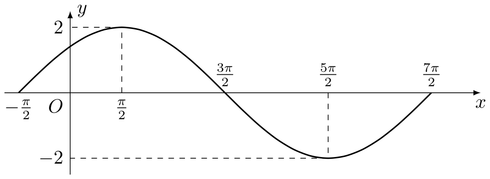
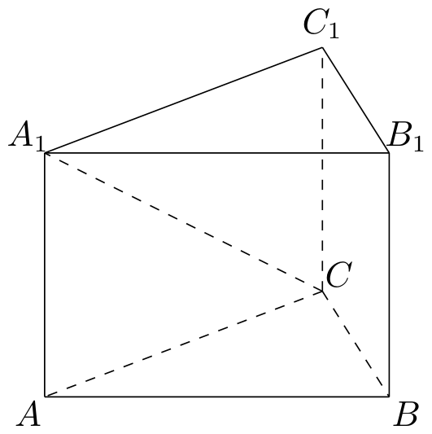

# 2003年上海卷（春）

## 填空题

### 第 1 题

已知函数 $f(x) = \sqrt{x} + 1$，则 $f^{-1}(3) =$＿＿＿＿＿＿.

#### 答案

$4$

#### 解析

函数 $f(x)=\sqrt{x}+1$ 的定义域为 $[0,+\infty)$，且在该区间上单调递增，因此反函数值 $f^{-1}(3)$ 就是方程 $f(x)=3$ 的解. 解得 $\sqrt{x}+1=3$，即 $\sqrt{x}=2$，所以 $x=4$，且 $4$ 满足定义域条件. 因此 $f^{-1}(3)=4$.

### 第 2 题

直线 $y = 1$ 与直线 $y = \sqrt{3}x + 3$ 的夹角为＿＿＿＿＿＿.

#### 答案

$\dfrac{\pi}{3}$

#### 解析

两条直线的斜率分别为 $m_1=0$ 和 $m_2=\sqrt{3}$. 设它们的锐角夹角为 $\theta$，则由两直线夹角公式

$$

\tan\theta=\left|\frac{m_2-m_1}{1+m_1m_2}\right|=\left|\frac{\sqrt{3}-0}{1+0\cdot\sqrt{3}}\right|=\sqrt{3}

$$

由于锐角夹角满足 $0<\theta<\dfrac{\pi}{2}$，而在此区间内 $\tan\theta=\sqrt{3}$ 的唯一解为 $\theta=\dfrac{\pi}{3}$，故夹角为 $\dfrac{\pi}{3}$.

### 第 3 题

已知点 $P(\tan \alpha,\cos \alpha)$ 在第三象限，则角 $\alpha$ 的终边在第＿＿＿＿＿＿象限.

#### 答案

二

#### 解析

点 $P(\tan\alpha,\cos\alpha)$ 在第三象限，所以其横、纵坐标都为负，即 $\tan\alpha<0$ 且 $\cos\alpha<0$. 条件 $\cos\alpha<0$ 说明角 $\alpha$ 的终边在第二或第三象限；条件 $\tan\alpha<0$ 说明终边在第二或第四象限. 两个范围的交集为第二象限，因此角 $\alpha$ 的终边在第二象限.

### 第 4 题

直线 $y = x - 1$ 被抛物线 $y^{2} = 4x$ 截得线段的中点坐标是＿＿＿＿＿＿.

#### 答案

$(3,2)$

#### 解析

联立直线和抛物线方程. 由 $y=x-1$ 得 $x=y+1$，代入 $y^2=4x$，得到 $y^2=4(y+1)$，$y^2-4y-4=0$. 解得 $y=2\pm2\sqrt{2}$，于是两个交点分别为 $\left(3+2\sqrt{2},2+2\sqrt{2}\right)$ 和 $\left(3-2\sqrt{2},2-2\sqrt{2}\right)$. 线段中点的横、纵坐标分别为两交点对应坐标的平均值，因此中点为

$$

\left(\frac{3+2\sqrt{2}+3-2\sqrt{2}}{2},\frac{2+2\sqrt{2}+2-2\sqrt{2}}{2}\right)=(3,2)

$$

### 第 5 题

已知集合 $A = \{x \mid |x| \leqslant 2,\ x \in \mathbb{R}\}$，$B = \{x \mid x \geqslant a\}$，且 $A \subseteq B$，则实数 $a$ 的取值范围是＿＿＿＿＿＿.

#### 答案

$(-\infty,-2]$

#### 解析

由 $|x|\leqslant2$ 可得 $-2\leqslant x\leqslant2$，所以 $A=[-2,2]$. 又由 $x\geqslant a$ 得 $B=[a,+\infty)$. 要使区间 $A$ 中的每个数都属于 $B$，只需使其中的最小数 $-2$ 也满足 $-2\geqslant a$，即 $a\leqslant-2$. 反之，当 $a\leqslant-2$ 时，任意 $x\in[-2,2]$ 都有 $x\geqslant-2\geqslant a$，故确有 $A\subseteq B$. 因此 $a\in(-\infty,-2]$.

### 第 6 题

已知 $z$ 为复数，则 $z + \overline{z} > 2$ 的一个充要条件是 $z$ 满足＿＿＿＿＿＿.

#### 答案

$z=u+\i v$，其中 $u>1$，$u$，$v\in\mathbb{R}$

#### 解析

任取复数 $z$，可唯一写成 $z=u+\i v$，其中 $u$，$v\in\mathbb{R}$. 于是 $\overline{z}=u-\i v$，从而 $z+\overline{z}=2u$，$z+\overline{z}>2\Longleftrightarrow2u>2\Longleftrightarrow u>1$. 因此，$z=u+\i v$，其中 $u$，$v\in\mathbb{R}$ 且 $u>1$，是所求的一个充要条件；反过来满足该条件的复数也都满足原不等式.

### 第 7 题

若过两点 $A(-1,0)$，$B(0,2)$ 的直线 $l$ 与圆 $(x-1)^{2}+(y-a)^{2}=1$ 相切，则 $a=$＿＿＿＿＿＿.

#### 答案

$4-\sqrt{5}$ 或 $4+\sqrt{5}$

#### 解析

由两点式，直线 $l$ 的斜率为

$$

\frac{2-0}{0-(-1)}=2

$$

所以 $l$ 的方程为 $y=2x+2$，即 $2x-y+2=0$. 圆的圆心为 $C(1,a)$，半径为 $1$. 直线与圆相切，当且仅当圆心到直线的距离等于半径，因此

$$

\frac{|2\cdot1-a+2|}{\sqrt{2^2+(-1)^2}}=1

$$

化简得 $|4-a|=\sqrt{5}$，于是 $4-a=\pm\sqrt{5}$，从而 $a=4-\sqrt{5}$ 或 $a=4+\sqrt{5}$.

### 第 8 题

不等式 $(\lg 20)^{2\cos x} > 1$（$x \in (0,\pi)$）的解为＿＿＿＿＿＿.

#### 答案

$\left(0,\dfrac{\pi}{2}\right)$

#### 解析

因为 $20>10$，所以 $\lg20>1$. 对于底数大于 $1$ 的指数函数，函数值大于 $1$ 当且仅当指数大于 $0$，故

$$

(\lg20)^{2\cos x}>1\Longleftrightarrow2\cos x>0\Longleftrightarrow\cos x>0

$$

在给定区间 $x\in(0,\pi)$ 内，余弦函数在第一象限为正，在第二象限为负，并且 $\cos\dfrac{\pi}{2}=0$. 所以解集为 $x\in\left(0,\dfrac{\pi}{2}\right)$.

### 第 9 题

$8$ 名世界网球顶级选手在上海大师赛上分成两组，每组各 $4$ 人，分别进行单循环赛，每组决出前两名，再由每组的第一名与另一组的第二名进行淘汰赛，获胜者角逐冠、亚军，败者角逐第三、四名，则该大师赛共有＿＿＿＿＿＿$\text{场}$比赛.

#### 答案

$16$

#### 解析

每组有 $4$ 人，单循环赛中任意两人恰比赛一次，所以每组比赛场数为 $\mathrm C_4^2=\dfrac{4\cdot3}{2}=6$，两组共 $12$ 场. 两组第一名分别与另一组第二名比赛，产生 $2$ 场交叉淘汰赛；这两场的胜者争夺冠、亚军，败者争夺第三、四名，再进行 $2$ 场. 因而总场数为 $12+2+2=16$ 场.

### 第 10 题

若正三棱锥底面边长为 $4$，体积为 $1$，则侧面和底面所成二面角的大小等于＿＿＿＿＿＿（结果用反三角函数值表示）.

#### 答案

$\arctan\dfrac{3}{8}$

#### 解析

设正三棱锥顶点为 $S$，底面中心为 $O$，底面一边的中点为 $M$，高为 $SO=h$. 底面是边长为 $4$ 的正三角形，其面积为 $\dfrac{1}{2}\cdot4\cdot2\sqrt{3}=4\sqrt{3}$. 由棱锥体积公式

$$

1=\frac{1}{3}\cdot4\sqrt{3}\cdot h

$$

得 $h=\dfrac{3}{4\sqrt{3}}=\dfrac{\sqrt{3}}{4}$. 正三角形的内切半径为 $\dfrac{4\sqrt{3}}{6}=\dfrac{2\sqrt{3}}{3}$，所以 $OM=\dfrac{2\sqrt{3}}{3}$. 由于 $SO\perp$ 底面，且 $OM\perp BC$，平面 $SOM$ 垂直于棱 $BC$；其中 $SM$ 与 $OM$ 的夹角就是侧面与底面所成的二面角 $\theta$. 在直角三角形 $SOM$ 中

$$

\tan\theta=\frac{SO}{OM}=\frac{\sqrt{3}/4}{2\sqrt{3}/3}=\frac{3}{8}

$$

因此 $\theta=\arctan\dfrac{3}{8}$.

### 第 11 题

若函数 $y = x^{2} + (a + 2)x + 3$，$x \in [a,b]$ 的图象关于直线 $x = 1$ 对称，则 $b =$＿＿＿＿＿＿.

#### 答案

$6$

#### 解析

抛物线方程为 $y=x^2+(a+2)x+3$，其对称轴为

$$

x=-\frac{a+2}{2}

$$

题设对称轴为 $x=1$，所以 $-\dfrac{a+2}{2}=1$，得 $a=-4$. 函数图象只取定义区间 $[a,b]$. 要使这个区间截得的图象仍关于 $x=1$ 对称，区间端点必须关于 $x=1$ 对称，即

$$

\frac{a+b}{2}=1

$$

代入 $a=-4$，得 $\dfrac{-4+b}{2}=1$，所以 $b=6$.

### 第 12 题

设 $f(x) = \frac{1}{2^{x} + \sqrt{2}}$，利用课本中推导等差数列前 $n$ 项和公式的方法，可求得 $f(-5) + f(-4) + \cdots + f(0) + \cdots + f(5) + f(6)$ 的值为＿＿＿＿＿＿.

#### 答案

$3\sqrt{2}$

#### 解析

把 $f(k)$ 与 $f(1-k)$ 配成一对. 对任意实数 $k$，令 $t=2^{k-1/2}>0$，则 $2^k=\sqrt{2}t$，且 $2^{1-k}=\sqrt{2}t^{-1}$. 因此 $f(k)=\frac{1}{\sqrt{2}(t+1)}$，$f(1-k)=\frac{1}{\sqrt{2}(1+t^{-1})}=\frac{t}{\sqrt{2}(t+1)}$ 从而 $f(k)+f(1-k)=\dfrac{1}{\sqrt{2}}$. 题中各项正好可配成 $f(-5)+f(6)$，$f(-4)+f(5)$，$f(-3)+f(4)$，$f(-2)+f(3)$，$f(-1)+f(2)$，$f(0)+f(1)$，共 $6$ 对. 每对和均为 $\dfrac{1}{\sqrt{2}}$，所以原式等于 $\dfrac{6}{\sqrt{2}}=3\sqrt{2}$.

## 单选题

### 第 13 题

关于直线$a$，$b$，$l$ 以及平面 $M$，$N$，下列命题中正确的是（）

A.  
若 $a \parallel M,\ b \parallel M$，则 $a \parallel b$

B.  
若 $a \parallel M$，$b \perp a$，则 $b \perp M$

C.  
若 $a \subset M$，$b \subset M$，且 $l \perp a$，$l \perp b$，则 $l \perp M$

D.  
若 $a \perp M$，$a \parallel N$，则 $M \perp N$

#### 答案

D

#### 解析

逐项判断. 选项 A 中，两条直线分别平行于同一平面时，它们可以取同一方向，也可以取不同方向，因此不能推出 $a\parallel b$. 选项 B 只说明 $b\perp a$，没有说明 $b$ 垂直于平面 $M$ 内两条相交直线，所以不能推出 $b\perp M$. 选项 C 中，若 $a\parallel b$ 且二者都在平面 $M$ 内，可以在 $M$ 内取一条同时垂直于 $a$，$b$ 的直线 $l$，此时条件成立但 $l$ 不垂直于 $M$，故条件不足.

选项 D 中，$a\perp M$ 表明直线 $a$ 的方向是平面 $M$ 的法向方向；又因 $a\parallel N$，这个法向方向平行于平面 $N$. 因而平面 $N$ 含有一个垂直于平面 $M$ 的方向，按照平面垂直的判定定理，$M\perp N$. 所以正确命题为 D.

### 第 14 题

复数 $z = \frac{m - 2\i}{1 + 2\i}$（$m \in \mathbb{R}$，$\i$ 为虚数单位）在复平面上对应的点不可能位于（）

A.  
第一象限

B.  
第二象限

C.  
第三象限

D.  
第四象限

#### 答案

A

#### 解析

分子、分母同乘以分母的共轭 $1-2\i$，得到

$$

z=\frac{(m-2\i)(1-2\i)}{(1+2\i)(1-2\i)}
=\frac{m-4-(2m+2)\i}{5}
=\frac{m-4}{5}-\frac{2m+2}{5}\i

$$

所以对应点的横坐标和纵坐标分别为 $X=\dfrac{m-4}{5}$ 和 $Y=-\dfrac{2m+2}{5}$. 若点在第一象限，则应同时满足 $X>0$ 与 $Y>0$，即 $m>4$ 且 $m<-1$，矛盾，所以第一象限不可能.

另一方面，取 $m<-1$ 时 $X<0$，$Y>0$，可在第二象限；取 $-1<m<4$ 时 $X<0$，$Y<0$，可在第三象限；取 $m>4$ 时 $X>0$，$Y<0$，可在第四象限. 因此不可能位于第一象限，选 A.

### 第 15 题

把曲线$y \cos x + 2y - 1 = 0$ 先沿 $x$ 轴向右平移 $\frac{\pi}{2}$ 个单位，再沿 $y$ 轴向下平移一个单位，得到的曲线方程是（）

A.  
$(1 - y)\sin x + 2y - 3 = 0$

B.  
$(y - 1)\sin x + 2y - 3 = 0$

C.  
$(y + 1)\sin x + 2y + 1 = 0$

D.  
$-(y + 1)\sin x + 2y + 1 = 0$

#### 答案

C

#### 解析

设原曲线上点的坐标为 $(X,Y)$，平移后的点坐标为 $(x,y)$. 先向右平移 $\dfrac{\pi}{2}$，有 $X=x-\dfrac{\pi}{2}$，$Y=y$，代入原方程得

$$

y\cos\left(x-\frac{\pi}{2}\right)+2y-1=0

$$

即 $y\sin x+2y-1=0$. 再向下平移 $1$ 个单位，此时原曲线中的纵坐标应取 $Y=y+1$，所以

$$

(y+1)\sin x+2(y+1)-1=0

$$

整理得 $(y+1)\sin x+2y+1=0$，对应选项 C.

### 第 16 题

关于函数 $f(x) = (\sin x)^2 - \left(\frac{2}{3}\right)^{|x|} + \frac{1}{2}$，有下面四个结论：

1.  $f(x)$ 是奇函数；

2.  当 $x > 2003$ 时，$f(x) > \frac{1}{2}$ 恒成立；

3.  $f(x)$ 的最大值是 $\frac{3}{2}$；

4.  $f(x)$ 的最小值是 $-\frac{1}{2}$.

其中正确结论的个数为（）

A.  
$1$ 个

B.  
$2$ 个

C.  
$3$ 个

D.  
$4$ 个

#### 答案

A

#### 解析

先逐项判断. 因为 $(\sin x)^2$ 是偶函数，$\left(\dfrac{2}{3}\right)^{|x|}$ 也是偶函数，常数函数 $\dfrac{1}{2}$ 亦为偶函数，所以 $f(x)$ 是偶函数. 例如 $f(1)=f(-1)$，而 $f(1)\ne0$，故它不可能是奇函数，第一条结论错误.

第二条结论也不成立. 取任意整数 $k$ 使 $k\pi>2003$，令 $x=k\pi$，则 $\sin^2x=0$，且 $|x|=x$，从而

$$

f(x)=\frac{1}{2}-\left(\frac{2}{3}\right)^x<\frac{1}{2}

$$

这与第二条结论所说的恒有 $f(x)>\dfrac{1}{2}$ 矛盾.

由于 $0\leqslant\sin^2x\leqslant1$，且 $\left(\dfrac{2}{3}\right)^{|x|}>0$，对一切实数 $x$ 都有

$$

f(x)=\sin^2x-\left(\frac{2}{3}\right)^{|x|}+\frac{1}{2}<1+\frac{1}{2}=\frac{3}{2}

$$

因此 $\dfrac{3}{2}$ 不可能是函数的最大值. 另一方面，在 $x=\dfrac{\pi}{2}+k\pi$ 时 $\sin^2x=1$，而当 $|x|\to+\infty$ 时 $\left(\dfrac{2}{3}\right)^{|x|}\to0$，函数值可无限接近 $\dfrac{3}{2}$，但始终达不到它，故第三条结论错误.

最后，由 $\sin^2x\geqslant0$ 和 $0<\left(\dfrac{2}{3}\right)^{|x|}\leqslant1$，有

$$

f(x)\geqslant0-1+\frac{1}{2}=-\frac{1}{2}

$$

当 $x=0$ 时，$f(0)=0-1+\dfrac{1}{2}=-\dfrac{1}{2}$，所以最小值确为 $-\dfrac{1}{2}$，第四条结论正确. 正确结论只有 $1$ 个，故选 A.

## 解答题

### 第 17 题

解不等式组：

$$

\begin{cases}
x^{2} - 6x + 8 > 0,\\
\dfrac{x + 3}{x - 1} > 2.
\end{cases}

$$

#### 解析

先解第一个不等式：

$$

x^2-6x+8=(x-2)(x-4)>0

$$

二次函数开口向上，所以其解集为 $x<2$ 或 $x>4$，即 $(-\infty,2)\cup(4,+\infty)$.

第二个不等式要求 $x\ne1$，并且

$$

\frac{x+3}{x-1}>2\Longleftrightarrow\frac{x+3-2x+2}{x-1}>0\Longleftrightarrow\frac{5-x}{x-1}>0

$$

临界点为 $1,5$. 在 $x<1$ 时分子为正、分母为负；在 $1<x<5$ 时分子和分母都为正；在 $x>5$ 时分子为负、分母为正. 因而第二个不等式的解集为 $(1,5)$.

两个解集取交集，得到

$$

\bigl((-\infty,2)\cup(4,+\infty)\bigr)\cap(1,5)=(1,2)\cup(4,5)

$$

所以不等式组的解集为 $x\in(1,2)\cup(4,5)$.

### 第 18 题

已知函数 $f(x) = A \sin (\omega x + \varphi)$，（$A > 0$，$\omega > 0$，$x \in \mathbb{R}$）在一个周期内的图象如图所示，求直线 $y = \sqrt{3}$ 与函数 $f(x)$ 图象的所有交点的坐标.

#### 解析

由图象可读出最大值为 $2$，最小值为 $-2$，所以振幅 $A=2$. 图象在 $x=\dfrac{\pi}{2}$ 处取得最大值，在 $x=\dfrac{5\pi}{2}$ 处取得最小值，这两点相隔半个周期，因此 $\frac{T}{2}=\frac{5\pi}{2}-\frac{\pi}{2}=2\pi$，$T=4\pi$. 又 $T=\dfrac{2\pi}{\omega}$，故 $\omega=\dfrac{1}{2}$. 图象在 $x=-\dfrac{\pi}{2}$ 处过原点且向上穿过 $x$ 轴，所以可取相位为 $\dfrac{\pi}{4}$，从而

$$

f(x)=2\sin\left(\frac{x}{2}+\frac{\pi}{4}\right)

$$

令函数值等于直线的纵坐标 $\sqrt{3}$，得到 $2\sin\left(\frac{x}{2}+\frac{\pi}{4}\right)=\sqrt{3}$，$\sin\left(\frac{x}{2}+\frac{\pi}{4}\right)=\frac{\sqrt{3}}{2}$. 因此 $\frac{x}{2}+\frac{\pi}{4}=\frac{\pi}{3}+2k\pi \quad\text{或}\quad \frac{2\pi}{3}+2k\pi$，$k\in\mathbb{Z}$. 分别解得 $x=\dfrac{\pi}{6}+4k\pi$ 或 $x=\dfrac{5\pi}{6}+4k\pi$. 所有交点为 $\left(\frac{\pi}{6}+4k\pi,\sqrt{3}\right) \quad\text{或}\quad \left(\frac{5\pi}{6}+4k\pi,\sqrt{3}\right)$，$k\in\mathbb{Z}$.

### 第 19 题

已知三棱柱 $ABC - A_{1}B_{1}C_{1}$，在某个空间直角坐标系中，

$$

\overrightarrow{AB}=\begin{pmatrix}
\frac{m}{2},\\
-\frac{\sqrt{3}m}{2},\\
0
\end{pmatrix}

$$

，$\overrightarrow{AC}=\left\{m,0,0\right\}$，$\overrightarrow{AA_1}=\left\{0,0,n\right\}$，其中 $m$，$n>0$.

1.  证明：三棱柱 $ABC - A_{1}B_{1}C_{1}$ 是正三棱柱；

2.  若 $m = \sqrt{2}n$，求直线 $CA_{1}$ 与平面 $A_{1}ABB_{1}$ 所成角的大小.

#### 解析

1.  由题给向量的长度， $|AB|=\sqrt{\left(\frac{m}{2}\right)^2+\left(-\frac{\sqrt{3}m}{2}\right)^2}=m$，$|AC|=m$. 又

$$

\overrightarrow{BC}=\overrightarrow{AC}-\overrightarrow{AB}
    =\left(\frac{m}{2},\frac{\sqrt{3}m}{2},0\right)

$$

    所以 $|BC|=m$. 因而 $AB=BC=CA=m$，底面三角形 $ABC$ 是正三角形.

    向量 $\overrightarrow{AA_1}=(0,0,n)$ 与 $\overrightarrow{AB}$、$\overrightarrow{AC}$ 的内积分别为 $0$，所以 $AA_1\perp AB$ 且 $AA_1\perp AC$. 由于 $AB$，$AC$ 是平面 $ABC$ 内相交的两条直线，得 $AA_1\perp$ 平面 $ABC$. 三棱柱的另两条侧棱分别平行于 $AA_1$，故它是直三棱柱；其底面又是正三角形，所以 $ABC-A_1B_1C_1$ 是正三棱柱.

2.  平面 $A_1ABB_1$ 内有相交直线 $AB$ 和 $AA_1$. 取该平面的法向量

$$

\boldsymbol{n}=\overrightarrow{AB}\times\overrightarrow{AA_1}
    =\left(-\frac{\sqrt{3}mn}{2},-\frac{mn}{2},0\right)

$$

    则 $|\boldsymbol{n}|=mn$. 直线 $CA_1$ 的方向向量可取 $\boldsymbol{d}=\overrightarrow{CA_1}=(-m,0,n)$，$|\boldsymbol{d}|=\sqrt{m^2+n^2}$. 计算得

$$

\left|\boldsymbol{d}\cdot\boldsymbol{n}\right|=\frac{\sqrt{3}m^2n}{2}

$$

    设直线 $CA_1$ 与平面 $A_1ABB_1$ 所成的角为 $\theta$. 由直线与平面所成角的向量公式，

$$

\sin\theta=\frac{|\boldsymbol{d}\cdot\boldsymbol{n}|}{|\boldsymbol{d}|\,|\boldsymbol{n}|}
    =\frac{\sqrt{3}m}{2\sqrt{m^2+n^2}}

$$

    当 $m=\sqrt{2}n$ 时，$\sqrt{m^2+n^2}=\sqrt{3}\,n$，故

$$

\sin\theta=\frac{\sqrt{3}\cdot\sqrt{2}n}{2\sqrt{3}n}=\frac{\sqrt{2}}{2}

$$

    由于线面角满足 $0\leqslant\theta\leqslant\dfrac{\pi}{2}$，所以 $\theta=\dfrac{\pi}{4}$.

### 第 20 题

已知函数 $f(x) = \frac{x^{\frac{1}{3}} - x^{-\frac{1}{3}}}{5}$，$g(x) = \frac{x^{\frac{1}{3}} + x^{-\frac{1}{3}}}{5}$.

1.  证明 $f(x)$ 是奇函数，并求 $f(x)$ 的单调区间；

2.  分别计算 $f(4) - 5f(2)g(2)$ 和 $f(9) - 5f(3)g(3)$ 的值，由此概括出涉及函数 $f(x)$ 和 $g(x)$ 的对所有不等于零的实数 $x$ 都成立的一个等式，并加以证明.

#### 解析

1.  函数中的负一次方根要求 $x\ne0$，故定义域为 $\mathbb{R}\mathbin{\backslash}\{0\}$. 对任意定义域内的 $x$，利用实数立方根的奇性， $(-x)^{1/3}=-x^{1/3}$，$(-x)^{-1/3}=-x^{-1/3}$. 于是

$$

f(-x)=\frac{-x^{1/3}+x^{-1/3}}{5}=-\frac{x^{1/3}-x^{-1/3}}{5}=-f(x)

$$

    所以 $f(x)$ 是奇函数.

    对 $x\ne0$ 求导，得

$$

f'(x)=\frac{1}{5}\left(\frac{1}{3}x^{-2/3}+\frac{1}{3}x^{-4/3}\right)
    =\frac{x^{-2/3}+x^{-4/3}}{15}
    =\frac{x^{2/3}+1}{15x^{4/3}}

$$

    由于 $x^{2/3}>0$ 且 $x^{4/3}>0$，所以 $f'(x)>0$. 因此 $f(x)$ 在 $(-\infty,0)$ 和 $(0,+\infty)$ 上都单调递增.

2.  令 $a=2^{1/3}$. 则 $4^{1/3}=a^2$，$4^{-1/3}=a^{-2}$，从而

$$

f(4)=\frac{a^2-a^{-2}}{5}

$$

    另一方面，

$$

5f(2)g(2)=5\cdot\frac{(a-a^{-1})(a+a^{-1})}{25}
    =\frac{a^2-a^{-2}}{5}=f(4)

$$

    故 $f(4)-5f(2)g(2)=0$. 再令 $b=3^{1/3}$，则

$$

f(9)=\frac{b^2-b^{-2}}{5}
    =5\cdot\frac{(b-b^{-1})(b+b^{-1})}{25}
    =5f(3)g(3)

$$

    所以 $f(9)-5f(3)g(3)=0$.

    由这两个计算可猜想恒等式为 $f(x^2)=5f(x)g(x)$. 对任意 $x\ne0$，实数立方根满足 $(x^2)^{1/3}=x^{2/3}$ 和 $(x^2)^{-1/3}=x^{-2/3}$，因此

$$

f(x^2)=\frac{x^{2/3}-x^{-2/3}}{5}

$$

    又

$$

5f(x)g(x)=5\cdot\frac{(x^{1/3}-x^{-1/3})(x^{1/3}+x^{-1/3})}{25}
    =\frac{x^{2/3}-x^{-2/3}}{5}

$$

    两式相等，故对所有 $x\in\mathbb{R}\mathbin{\backslash}\{0\}$，恒有 $f(x^2)=5f(x)g(x)$.

### 第 21 题

设 $F_{1}$，$F_{2}$ 分别为椭圆 $C: \frac{x^{2}}{a^{2}} + \frac{y^{2}}{b^{2}} = 1$（$a > 0$，$b > 0$）的左、右两个焦点.

1.  若椭圆 $C$ 上的点 $A\left(1,\frac{3}{2}\right)$ 到 $F_{1}$，$F_{2}$ 两点的距离之和等于 $4$，写出椭圆 $C$ 的方程；

2.  设 $K$ 是（1）中所得椭圆上的动点，求线段 $F_{1}K$ 的中点的轨迹方程；

3.  已知椭圆具有性质：若 $M$，$N$ 是椭圆 $C$ 上关于原点对称的两个点，点 $P$ 是椭圆上任意一点，当直线 $PM$，$PN$ 的斜率都存在，并记为 $k_{PM}$，$k_{PN}$ 时，那么 $k_{PM}$ 与 $k_{PN}$ 之积是与点 $P$ 位置无关的定值. 试对双曲线 $\frac{x^{2}}{a^{2}} - \frac{y^{2}}{b^{2}} = 1$ 写出具有类似特性的性质，并加以证明.

#### 解析

1.  椭圆上任一点到左、右两焦点的距离之和为 $2a$. 题设点 $A$ 的距离和为 $4$，所以 $2a=4$，得 $a=2$. 又因 $A\left(1,\dfrac{3}{2}\right)$ 在椭圆上，有

$$

\frac{1^2}{2^2}+\frac{(3/2)^2}{b^2}=1

$$

    即 $\dfrac{1}{4}+\dfrac{9}{4b^2}=1$. 解得 $b^2=3$，故椭圆方程为

$$

\frac{x^2}{4}+\frac{y^2}{3}=1

$$

2.  对所得椭圆，焦点参数满足 $c^2=a^2-b^2=4-3=1$，所以 $c=1$，左焦点为 $F_1=(-1,0)$. 设动点 $K(x,y)$，线段 $F_1K$ 的中点为 $Q(u,v)$. 则 $u=\frac{x-1}{2}$，$v=\frac{y}{2}$ 即 $x=2u+1$，$y=2v$. 代入椭圆方程，得

$$

\frac{(2u+1)^2}{4}+\frac{(2v)^2}{3}=1

$$

    整理为

$$

\left(u+\frac{1}{2}\right)^2+\frac{4v^2}{3}=1

$$

    这就是中点 $Q$ 的轨迹方程.

3.  对双曲线，设 $M(u,v)$、$N(-u,-v)$ 是关于原点对称的两个点，$P(x,y)$ 是双曲线上任意一点，并假设直线 $PM$，$PN$ 的斜率存在. 由于斜率存在，$x-u\ne0$ 且 $x+u\ne0$. 于是 $k_{PM}=\frac{y-v}{x-u}$，$k_{PN}=\frac{y+v}{x+u}$ 从而

$$

k_{PM}k_{PN}
    =\frac{y-v}{x-u}\cdot\frac{y+v}{x+u}
    =\frac{y^2-v^2}{x^2-u^2}

$$

    点 $P$，$M$ 都在双曲线 $\dfrac{x^2}{a^2}-\dfrac{y^2}{b^2}=1$ 上，所以 $y^2=\frac{b^2}{a^2}x^2-b^2$，$v^2=\frac{b^2}{a^2}u^2-b^2$. 两式相减，得

$$

y^2-v^2=\frac{b^2}{a^2}(x^2-u^2)

$$

    代回斜率乘积，得到

$$

k_{PM}k_{PN}=\frac{b^2}{a^2}

$$

    因此，双曲线具有如下类似性质：若 $M$，$N$ 是双曲线上关于原点对称的两点，且 $P$ 为双曲线上使 $PM$，$PN$ 的斜率存在的任意一点，则 $k_{PM}k_{PN}$ 恒等于与 $P$ 的位置无关的定值 $\dfrac{b^2}{a^2}$.

### 第 22 题

在一次人才招聘会上，有 A、B 两家公司分别开出了它们的工资标准：A 公司允诺第一个月工资为 $1500\text{ 元}$，以后每年月工资比上一年月工资增加 $230\text{ 元}$；B 公司允诺第一年月工资数为 $2000\text{ 元}$，以后每年月工资在上一年的月工资基础上递增 $5\%$，设某人年初被 A、B 两家公司同时录取. 试问：

1.  若该人分别在 $A$ 公司或 $B$ 公司连续工作 $n\text{ 年}$，则他在第 $n\text{ 年}$的月工资收入分别是多少？

2.  该人打算连续在一家公司工作 $10\text{ 年}$，仅从工资收入总量较多作为应聘的标准（不记其它因素），该人应该选择哪家公司，为什么？

3.  在 $A$ 公司工作比在 $B$ 公司工作的月工资收入最多可以多多少元？（精确到 $1$ 元），并说明理由.

#### 解析

1.  记第 $n$ 年的月工资分别为 $A_n$，$B_n$. A 公司满足 $A_1=1500$，$A_{n+1}=A_n+230$ 所以 $\{A_n\}$ 是首项为 $1500$、公差为 $230$ 的等差数列，故

$$

A_n=1500+230(n-1)\ \text{元}

$$

    B 公司满足 $B_1=2000$，$B_{n+1}=1.05B_n$ 所以 $\{B_n\}$ 是首项为 $2000$、公比为 $1.05$ 的等比数列，故

$$

B_n=2000(1.05)^{n-1}\ \text{元}

$$

2.  连续工作 $10$ 年时，每年的月工资总和最后都要乘以 $12$，所以先比较各年的月工资数之和. A 公司的和为

$$

S_A=\sum_{k=0}^{9}(1500+230k)
    =10\cdot1500+230\cdot\frac{9\cdot10}{2}
    =25350

$$

    B 公司的和为

$$

S_B=\sum_{k=0}^{9}2000(1.05)^k
    =2000\cdot\frac{1.05^{10}-1}{1.05-1}
    \approx25155.79

$$

    因为 $S_A>S_B$，乘以相同的 $12$ 后不改变大小，所以十年工资总量选择 A 公司较多，应选择 A 公司.

3.  设第 $n$ 年两家公司月工资之差为

$$

d_n=A_n-B_n=1500+230(n-1)-2000(1.05)^{n-1}

$$

    相邻两年的差为

$$

d_{n+1}-d_n=230-2000(1.05)^n+2000(1.05)^{n-1}
    =230-100(1.05)^{n-1}

$$

    由于 $1.05^{17}\approx2.2920<2.3<2.4066\approx1.05^{18}$，且 $1.05>1$，当 $1\leqslant n\leqslant18$ 时有 $1.05^{n-1}\leqslant1.05^{17}<2.3$，从而 $d_{n+1}-d_n>0$；当 $n\geqslant19$ 时有 $1.05^{n-1}\geqslant1.05^{18}>2.3$，从而 $d_{n+1}-d_n<0$. 因此 $d_n$ 先递增，且 $d_{19}-d_{18}>0$，再从 $d_{20}-d_{19}<0$ 起递减，所以最大值在 $n=19$ 时取得.

$$

d_{19}=1500+230\cdot18-2000(1.05)^{18}
    \approx5640-4813.24
    \approx826.76\ \text{元}

$$

    精确到 $1$ 元为 $827$ 元.
