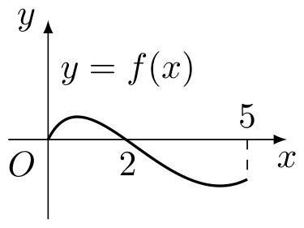
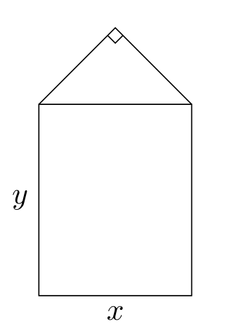
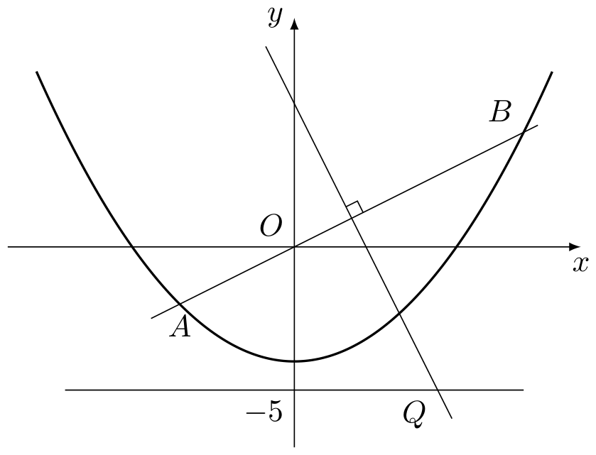
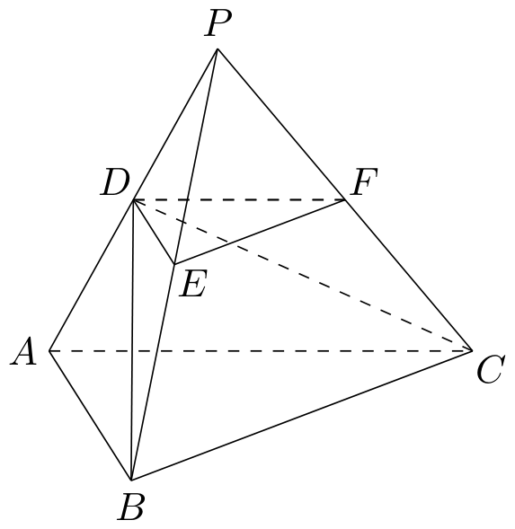

# 2004年上海卷（秋文）

## 填空题

### 第 1 题

若 $\tan \alpha = \frac{1}{2}$，则 $\tan \left(\alpha + \frac{\pi}{4}\right) =\underline{\qquad\qquad}$.

#### 答案

$3$

#### 解析

因为 $\tan\dfrac{\pi}{4}=1$，且 $1-\tan\alpha\tan\dfrac{\pi}{4}=1-\dfrac{1}{2}\ne0$，所以由正切和角公式

$$

\tan\left(\alpha+\frac{\pi}{4}\right)
=\frac{\tan\alpha+\tan\frac{\pi}{4}}{1-\tan\alpha\tan\frac{\pi}{4}}
=\frac{\frac{1}{2}+1}{1-\frac{1}{2}}=3

$$

### 第 2 题

设抛物线的顶点坐标为 $\left(2,0\right)$，准线方程为 $x = -1$，则它的焦点坐标为＿＿＿＿＿＿.

#### 答案

$\left(5,0\right)$

#### 解析

抛物线的轴垂直于准线，因此轴为 $x$ 轴. 设焦点为 $F\left(p,0\right)$，则顶点是焦点与准线的中点，故

$$

\frac{p+(-1)}{2}=2

$$

解得 $p=5$，所以焦点坐标为 $\left(5,0\right)$.

### 第 3 题

设集合 $A = \{5, \log_2(a + 3)\}$，集合 $B = \{a, b\}$. 若 $A \cap B = \{2\}$，则 $A \cup B =\underline{\qquad\qquad}$.

#### 答案

$\{1,2,5\}$

#### 解析

由 $A\cap B=\{2\}$，知 $2\in A$. 集合 $A$ 的一个元素已经是 $5$，且 $5\ne2$，所以只能有

$$

\log_{2}(a+3)=2

$$

于是 $a+3=2^2=4$，得 $a=1$，并且 $A=\{2,5\}$. 又因为 $2\in B=\{1,b\}$，故 $b=2$. 因此

$$

A\cup B=\{1,2,5\}

$$

### 第 4 题

设等比数列 $\{a_n\}$（$n \in \mathbb{N}$）的公比 $q = -\frac{1}{2}$，且 $\displaystyle\lim_{n\to\infty}\left(a_1 + a_3 + a_5 + \cdots + a_{2n-1}\right) = \frac{8}{3}$，则 $a_1 =\underline{\qquad\qquad}$.

#### 答案

$2$

#### 解析

奇数项组成首项为 $a_{1}$、公比为

$$

q^2=\left(-\frac{1}{2}\right)^2=\frac{1}{4}

$$

的等比数列. 因此前 $n$ 个奇数项的和为

$$

a_{1}+a_{3}+\cdots+a_{2n-1}
=a_{1}\frac{1-(\frac14)^n}{1-\frac14}

$$

因为 $\left|\frac14\right|<1$，令 $n\to\infty$ 得

$$

\frac{a_{1}}{1-\frac14}=\frac{4a_{1}}{3}=\frac{8}{3}

$$

所以 $a_{1}=2$.

### 第 5 题

设奇函数 $f(x)$ 的定义域为 $[-5, 5]$. 若当 $x \in [0, 5]$ 时，$f(x)$ 的图象如右图，则不等式 $f(x) < 0$ 的解是＿＿＿＿＿＿.

#### 答案

$\left(-2,0\right)\cup\left(2,5\right]$

#### 解析

由题图，在 $[0,5]$ 上，$f(0)=f(2)=0$，且 $f(x)>0$，$(0<x<2)$，$f(x)<0$，$(2<x\leqslant5)$ 当 $-5\leqslant x<0$ 时，由奇函数性质 $f(x)=-f(-x)$. 因而 $f(x)<0$ 等价于 $f(-x)>0$，即 $0<-x<2$，所以 $-2<x<0$. 结合正半轴上的解，并排除零点 $-2$，$0$，$2$，得

$$

x\in\left(-2,0\right)\cup\left(2,5\right]

$$

### 第 6 题

已知点 $A\left(-1,5\right)$ 和向量 $\boldsymbol{a}= \left(2,3\right)$，若 $\overrightarrow{AB} = 3\boldsymbol{a}$，则点 $B$ 的坐标为＿＿＿＿＿＿.

#### 答案

$\left(5,14\right)$

#### 解析

由 $\overrightarrow{AB}=3\boldsymbol{a}$，先得

$$

\overrightarrow{AB}=3(2,3)=(6,9)

$$

设 $B=(x_B,y_B)$，则

$$

\overrightarrow{AB}=(x_B-(-1),y_B-5)=(x_B+1,y_B-5)

$$

比较对应坐标，得 $x_B+1=6$、$y_B-5=9$，从而 $x_B=5$、$y_B=14$. 因此 $B$ 的坐标为 $\left(5,14\right)$.

### 第 7 题

当 $x$，$y$ 满足不等式

$$

\begin{cases}
2 \leqslant x \leqslant 4,\\
y \geqslant 3,\\
x + y \leqslant 8
\end{cases}

$$

时，目标函数 $k = 3x - 2y$ 的最大值为＿＿＿＿＿＿.

#### 答案

$6$

#### 解析

由约束条件 $x\leqslant4$、$y\geqslant3$，可得

$$

k=3x-2y\leqslant3\cdot4-2\cdot3=6

$$

点 $(4,3)$ 满足 $2\leqslant x\leqslant4$、$y\geqslant3$ 以及 $x+y=7\leqslant8$，所以这个上界可以取得. 因此目标函数的最大值为 $6$.

### 第 8 题

圆心在直线 $x = 2$ 上的圆 $C$ 与 $y$ 轴交于两点 $A\left(0,-4\right)$，$B\left(0,-2\right)$，则圆 $C$ 的方程为＿＿＿＿＿＿.

#### 答案

$\left(x-2\right)^2+\left(y+3\right)^2=5$

#### 解析

设圆心为 $C_0=(2,c)$，因为圆心在直线 $x=2$ 上. 由 $A$、$B$ 都在圆上，半径相等，得

$$

(2-0)^2+(c+4)^2=(2-0)^2+(c+2)^2

$$

所以 $(c+4)^2=(c+2)^2$，解得 $c=-3$. 圆心为 $(2,-3)$，半径平方为

$$

r^2=(2-0)^2+(-3+4)^2=5

$$

故圆的方程为 $\left(x-2\right)^2+\left(y+3\right)^2=5$.

### 第 9 题

若在二项式 $\left(x + 1\right)^{10}$ 的展开式中任取一项，则该项的系数为奇数的概率是＿＿＿＿＿＿.（结果用分数表示）

#### 答案

$\frac{4}{11}$

#### 解析

由二项式定理，$(x+1)^{10}$ 的第 $k+1$ 项（$k=0$，$1$，$\ldots$，$10$）为

$$

\mathrm C_{10}^{k}x^{10-k}

$$

所以共有 $11$ 项，且任取一项时各项等可能. 各项系数依次为 $1$，$10$，$45$，$120$，$210$，$252$，$210$，$120$，$45$，$10$，$1$ 其中奇数系数为 $1$，$45$，$45$，$1$，共 $4$ 项，故所求概率为 $\dfrac{4}{11}$.

### 第 10 题

若函数 $f(x) = a\left|x - b\right| + 2$ 在 $[0, +\infty)$ 上为增函数，则实数 $a$，$b$ 的取值范围是＿＿＿＿＿＿.

#### 答案

$a>0$，$b\leqslant 0$

#### 解析

分两种情况讨论.

当 $b\leqslant0$ 时，对任意 $x\geqslant0$，都有 $x-b\geqslant0$，于是

$$

f(x)=a(x-b)+2=ax-ab+2

$$

该一次函数在 $[0,+\infty)$ 上严格递增，当且仅当 $a>0$.

当 $b>0$ 时，在 $[0,b]$ 上

$$

f(x)=a(b-x)+2

$$

要递增需 $-a>0$，即 $a<0$；在 $[b,+\infty)$ 上

$$

f(x)=a(x-b)+2

$$

要递增需 $a>0$. 两个条件不能同时成立. 因而实数的取值范围为 $a>0$，$b\leqslant0$.

### 第 11 题

教材中“坐标平面上的直线”与“圆锥曲线”两章内容体现出解析几何的本质是＿＿＿＿＿＿.

#### 答案

用代数的方法研究图形的几何性质

#### 解析

解析几何先把点、直线、圆锥曲线等几何对象用坐标或方程表示，再利用代数运算研究这些对象的位置关系和几何性质. 因此其本质是用代数的方法研究图形的几何性质.

### 第 12 题

若干个能唯一确定一个数列的量称为该数列的“基本量”. 设 $\{a_n\}$ 是公比为 $q$ 的无穷等比数列，下列 $\{a_n\}$ 的四组量中，一定能成为该数列“基本量”的是第＿＿＿＿＿＿组.（写出所有符合要求的组号）

1.  $S_{1}$ 与 $S_{2}$；

2.  $a_{2}$ 与 $S_{3}$；

3.  $a_{1}$ 与 $a_{n}$；

4.  $q$ 与 $a_{n}$.

其中 $n$ 为大于 $1$ 的整数，$S_{n}$ 为 $\{a_{n}\}$ 的前 $n$ 项和.

#### 答案

$\textcircled{1}$，$\textcircled{4}$

#### 解析

对第 $\textcircled{1}$ 组，$S_1=a_1$，所以 $a_1$ 已确定；又

$$

a_2=S_2-S_1

$$

若 $a_1\ne0$，则 $q=a_2/a_1$，从而首项和公比都确定. 若 $a_1=0$，则等比数列的每一项都为零，数列仍唯一确定. 因此第 $\textcircled{1}$ 组一定可以唯一确定数列.

第 $\textcircled{2}$ 组不一定能唯一确定. 例如取 $a_2=1$、$S_3=4$. 由 $a_1q=1$ 及

$$

S_3=a_1+a_1q+a_1q^2=a_1+1+q=4

$$

得 $a_1+q=3$、$a_1q=1$. 因而 $a_1$、$q$ 是方程 $t^2-3t+1=0$ 的两个根，可以交换，得到两个不同的等比数列.

第 $\textcircled{3}$ 组也不一定能唯一确定. 取允许的 $n=3$，并令 $a_1=a_3=1$. 此时 $q^2=1$，所以 $q=1$ 或 $q=-1$，分别得到 $1$，$1$，$1$，$\ldots$ 和 $1$，$-1$，$1$，$\ldots$，数列不唯一.

对第 $\textcircled{4}$ 组，按等比数列公比的定义 $q\ne0$. 已知 $q$ 和 $a_n$，由

$$

a_n=a_1q^{n-1}

$$

得

$$

a_1=\frac{a_n}{q^{n-1}}

$$

因此首项和公比均确定，整个数列唯一确定. 所以符合要求的组号为 $\textcircled{1}$、$\textcircled{4}$.

## 单选题

### 第 13 题

在下列关于直线 $l$，$m$ 与平面 $\alpha$，$\beta$ 的命题中，真命题是（$\quad$）

A.  
若 $l \subset \beta$ 且 $\alpha \perp \beta$，则 $l \perp \alpha$

B.  
若 $l \perp \beta$ 且 $\alpha \parallel \beta$，则 $l \perp \alpha$

C.  
若 $l \perp \beta$ 且 $\alpha \perp \beta$，则 $l \parallel \alpha$

D.  
若 $\alpha \cap \beta = m$ 且 $l \parallel m$，则 $l \parallel \alpha$

#### 答案

B

#### 解析

若 $l\perp\beta$，则 $l$ 的方向是平面 $\beta$ 的法线方向. 当 $\alpha\parallel\beta$ 时，平面 $\alpha$ 与 $\beta$ 的法线方向相同，所以 $l$ 也垂直于 $\alpha$，选项 B 正确.

其余命题不一定成立. 例如取 $\beta:z=0$、$\alpha:y=0$，则 $\alpha\perp\beta$. 取 $l:y=1$，$z=0$，有 $l\subset\beta$，但 $l$ 的方向平行于 $\alpha$，不垂直于 $\alpha$，所以第一项不成立. 取 $l:x=0$，$y=0$，则 $l\perp\beta$，但 $l\subset\alpha$，不满足 $l\parallel\alpha$，所以第三项不成立. 对第四项，取交线 $m:y=z=0$，再取 $l:y=0$，$z=1$，则 $l\parallel m$，但 $l\subset\alpha$，而不是与 $\alpha$ 无公共点的平行直线，所以第四项也不成立. 因此正确选项为 B.

### 第 14 题

三角方程 $2\sin \left(\frac{\pi}{2} - x\right) = 1$ 的解集为（$\quad$）

A.  
$\left\{x\mid x = 2k\pi +\frac{\pi}{3},k\in \mathbb{Z}\right\}$

B.  
$\left\{x\mid x = 2k\pi +\frac{5\pi}{3},k\in \mathbb{Z}\right\}$

C.  
$\left\{x\mid x = 2k\pi \pm \frac{\pi}{3},k\in \mathbb{Z}\right\}$

D.  
$\left\{x\mid x = k\pi +(-1)^k,k\in \mathbb{Z}\right\}$

#### 答案

C

#### 解析

利用余函数关系 $\sin\left(\frac{\pi}{2}-x\right)=\cos x$，原方程化为

$$

2\cos x=1,\qquad\text{即}\qquad \cos x=\frac{1}{2}

$$

余弦值为 $\frac12$ 的所有实数解为 $x=2k\pi\pm\frac{\pi}{3}$，$k\in\mathbb{Z}$. 这正是选项 C 所表示的解集，故选 C.

### 第 15 题

若函数 $y = f(x)$ 的图象与函数 $y = \lg\left(x + 1\right)$ 的图象关于直线 $x - y = 0$ 对称，则 $f(x) =$（$\quad$）

A.  
$10^{x} - 1$

B.  
$1 - 10^{x}$

C.  
$1 - 10^{-x}$

D.  
$10^{-x} - 1$

#### 答案

A

#### 解析

直线 $x-y=0$ 即 $y=x$. 图象关于 $y=x$ 对称后，横、纵坐标互换，因此所得函数是原函数的反函数. 由

$$

y=\lg(x+1)

$$

交换变量并求解，得

$$

x=\lg(y+1)
\Longleftrightarrow 10^x=y+1
\Longleftrightarrow y=10^x-1

$$

所以 $f(x)=10^x-1$，对应选项 A.

### 第 16 题

某地 2004 年第一季度应聘和招聘人数排行榜前 5 个行业的情况列表如下：

| 行业名称 | 计算机 |  机械  |  营销  | 物流  | 贸易  |
|:--------:|:------:|:------:|:------:|:-----:|:-----:|
| 应聘人数 | 215830 | 200250 | 154676 | 74570 | 65280 |

| 行业名称 | 计算机 |  营销  | 机械  | 建筑  | 化工  |
|:--------:|:------:|:------:|:-----:|:-----:|:-----:|
| 招聘人数 | 124620 | 102935 | 89115 | 76516 | 70436 |

若用同一行业中应聘人数与招聘人数比值的大小来衡量该行业的就业情况，则根据表中数据，就业形势一定是（$\quad$）

A.  
计算机行业好于化工行业

B.  
建筑行业好于物流行业

C.  
机械行业最紧张

D.  
营销行业比贸易行业紧张

#### 答案

B

#### 解析

设某行业的应聘人数与招聘人数之比为 $r$. $r$ 越小，表示同一招聘岗位对应的竞争人数越少，因而就业形势越好. 由表格的“前 5 个”可知，未进入应聘人数前五名的行业，其应聘人数不超过 $65280$；未进入招聘人数前五名的行业，其招聘人数不超过 $70436$.

建筑行业未列入应聘人数前五名，但招聘人数为 $76516$，所以

$$

r_{\text{建筑}}\leqslant\frac{65280}{76516}

$$

物流行业的应聘人数为 $74570$，但未列入招聘人数前五名，所以

$$

r_{\text{物流}}\geqslant\frac{74570}{70436}

$$

而

$$

\frac{65280}{76516}<\frac{74570}{70436}

$$

故无论两个未列出的实际人数如何，均有 $r_{\text{建筑}}<r_{\text{物流}}$，建筑行业就业形势一定好于物流行业.

其余选项都涉及至少一个未列出的人数，或者仅凭表中数据不能推出“最紧张”的全体比较，因此不能保证成立. 故选 B.

## 解答题

### 第 17 题

已知复数 $z_{1}$ 满足 $(1 + \i)z_{1} = -1 + 5\i$，$z_{2} = a - 2 - \i$，其中 $\i$ 为虚数单位，$a \in \mathbb{R}$，若 $\left|z_{1} - \overline{z_{2}}\right| < |z_{1}|$，求 $a$ 的取值范围.

#### 解析

由 $(1+\i)z_1=-1+5\i$，两边同除以 $1+\i$，并乘以共轭复数 $1-\i$，得

$$

z_1=\frac{-1+5\i}{1+\i}
=\frac{(-1+5\i)(1-\i)}{(1+\i)(1-\i)}
=\frac{4+6\i}{2}=2+3\i

$$

又 $z_2=a-2-\i$，所以 $\overline{z_2}=a-2+\i$. 从而

$$

z_1-\overline{z_2}
=(2+3\i)-(a-2+\i)=4-a+2\i

$$

利用复数模的平方公式，原不等式等价于

$$

\left|z_1-\overline{z_2}\right|^2<|z_1|^2

$$

即

$$

(4-a)^2+2^2<2^2+3^2

$$

化简得 $(a-4)^2<9$，所以

$$

-3<a-4<3

$$

即 $1<a<7$.

### 第 18 题

某单位用木料制作如图所示的框架，框架的下部是边长分别为 $x$，$y$（单位为 $\mathrm{m}$）的矩形. 上部是等腰直角三角形. 要求框架围成的总面积 $8 \mathrm{~cm}^{2}$. 问 $x$，$y$ 分别为多少（精确到 $0.001 \mathrm{~m}$）时用料最省？

#### 解析

原 PDF 将 $x$、$y$ 的单位写为 $\mathrm{m}$，却将总面积写为 $8\mathrm{~cm}^{2}$，这造成量纲矛盾. 结合题目要求精确到 $0.001\mathrm{~m}$ 及公开答案的数值，以下按原题的数值条件将总面积按 $8\mathrm{~m}^{2}$ 计算，并保留原题单位矛盾说明.

由图可知，上部等腰直角三角形的底边是矩形的上边，长度为 $x$，且该底边是斜边. 因此三角形的两条直角边均为 $\dfrac{x}{\sqrt2}$，其面积为

$$

\frac12\left(\frac{x}{\sqrt2}\right)^2=\frac{x^2}{4}

$$

框架围成的总面积为

$$

xy+\frac{x^2}{4}=8

$$

由于 $x>0$，可表示为

$$

y=\frac8x-\frac{x}{4}

$$

同时 $y>0$ 要求 $0<x<4\sqrt2$.

用料长度包括矩形四条边和三角形的两条斜边，矩形上边与三角形底边重合，不重复计算. 因而

$$

L=2x+2y+2\cdot\frac{x}{\sqrt2}
=(2+\sqrt2)x+2y
=\left(\frac32+\sqrt2\right)x+\frac{16}{x}

$$

令 $A=\frac32+\sqrt2>0$，则由基本不等式

$$

L=Ax+\frac{16}{x}\geqslant2\sqrt{16A}=8\sqrt A

$$

等号成立的条件为 $Ax=\dfrac{16}{x}$，即

$$

x=\frac4{\sqrt A}
=\frac4{\sqrt{\frac32+\sqrt2}}
=8-4\sqrt2

$$

代回面积约束，得

$$

y=\frac8x-\frac{x}{4}=2\sqrt2

$$

这两个值满足 $0<x<4\sqrt2$，所以确实可取到最小值. 数值上 $x\approx2.343\mathrm{~m}$，$y\approx2.828\mathrm{~m}$. 故用料最省时，$x=2.343\mathrm{~m}$、$y=2.828\mathrm{~m}$（精确到 $0.001\mathrm{~m}$）.

### 第 19 题

记函数 $f(x) = \sqrt{2 - \frac{x + 3}{x + 1}}$ 的定义域为 $A$，$g(x) = \lg\left[\left(x - a - 1\right)\left(2a - x\right)\right]$（$a < 1$）的定义域为 $D$.

1.  求 $A$；

2.  若 $B \subseteq A$，求实数 $a$ 的取值范围.

#### 解析

1.  根式有意义要求

$$

2-\frac{x+3}{x+1}\geqslant0

$$

    同时分母要求 $x\ne-1$. 化简根式内的式子，得

$$

2-\frac{x+3}{x+1}=\frac{x-1}{x+1}

$$

    在数轴上考察关键点 $-1$、$1$：当 $x<-1$ 或 $x\geqslant1$ 时，$\dfrac{x-1}{x+1}\geqslant0$，而 $-1<x<1$ 时该式小于零. 因此

$$

A=\left(-\infty,-1\right)\cup\left[1,+\infty\right)

$$

2.  题干前文把 $g(x)$ 的定义域记为 $D$，第二问却写成 $B\subseteq A$. 以下按第二问中的 $B$ 指 $g(x)$ 的定义域 $D$ 处理. 由对数真数必须为正，得

$$

(x-a-1)(2a-x)>0

$$

    因 $a<1$，有 $2a<a+1$，所以该不等式的解集为

$$

D=\left(2a,a+1\right)

$$

    要使 $D\subseteq A$，由于 $D$ 是一个区间而 $A$ 是两段互不相交的集合，$D$ 只能完全落在 $(-\infty,-1)$ 或 $[1,+\infty)$ 中.

    若 $D\subset(-\infty,-1)$，需 $a+1\leqslant-1$，即 $a\leqslant-2$. 若 $D\subset[1,+\infty)$，需 $2a\geqslant1$，即 $a\geqslant\dfrac12$. 再结合 $a<1$，得到

$$

a\in\left(-\infty,-2\right]\cup\left[\frac12,1\right)

$$

### 第 20 题

如图，直线 $y = \frac{1}{2}x$ 与抛物线 $y = \frac{1}{8}x^2 - 4$ 交于 $A$，$B$ 两点，线段 $AB$ 的垂直平分线与直线 $y = -5$ 交于 $Q$ 点.

1.  求点 $Q$ 的坐标；

2.  当 $P$ 为抛物线上位于线段 $AB$ 下方（含 $A$，$B$）的动点时，求 $\triangle OPQ$ 面积的最大值.

#### 解析

1.  联立直线与抛物线方程，得

$$

\frac{x}{2}=\frac{x^2}{8}-4
    \Longleftrightarrow x^2-4x-32=0
    \Longleftrightarrow (x-8)(x+4)=0

$$

    对应的交点为 $A=(-4,-2)$、$B=(8,4)$，其中点为

$$

M=\left(\frac{-4+8}{2},\frac{-2+4}{2}\right)=(2,1)

$$

    直线 $AB$ 的斜率为 $\frac12$，故其垂直平分线斜率为 $-2$，方程为

$$

y-1=-2(x-2),\qquad\text{即}\qquad y=-2x+5

$$

    令 $y=-5$，解得 $x=5$，所以 $Q=(5,-5)$.

2.  设动点

$$

P=\left(x,\frac{x^2}{8}-4\right)

$$

    抛物线与弦 $AB$ 的差为

$$

\left(\frac{x^2}{8}-4\right)-\frac{x}{2}
    =\frac{(x-8)(x+4)}{8}

$$

    所以点在弦 $AB$ 下方（含端点）等价于 $-4\leqslant x\leqslant8$. 由 $O=(0,0)$、$Q=(5,-5)$，三角形面积为

$$

S_{\triangle OPQ}
    =\frac12\left|\begin{vmatrix}x&\frac{x^2}{8}-4\\5&-5\end{vmatrix}\right|
    =\frac52\left|x+\frac{x^2}{8}-4\right|
    =\frac52\left|\frac{(x+4)^2}{8}-6\right|

$$

    当 $-4\leqslant x\leqslant8$ 时，$(x+4)^2/8$ 的取值范围为 $[0,18]$，故括号内的量取遍 $[-6,12]$. 其绝对值最大为 $12$，在 $x=8$ 时取得. 因此

$$

S_{\triangle OPQ,\max}=\frac52\cdot12=30

$$

### 第 21 题

如图，$P-ABC$ 是底面边长为 $1$ 的正三棱锥，$D$，$E$，$F$ 分别为棱长 $PA$，$PB$，$PC$ 上的点，截面 $DEF \parallel$ 底面 $ABC$，且棱台 $DEF-ABC$ 与棱锥 $P-ABC$ 的棱长和相等.（棱长和是指多面体中所有棱的长度之和）

1.  证明： $P-ABC$ 为正四面体；

2.  若 $PD = \frac{1}{2}PA$，求二面角 $D-BC-A$ 的大小.（结果用反三角函数值表示）

3.  设棱台 $DEF-ABC$ 的体积为 $V$，是否存在体积为 $V$ 且各棱长均相等的直平行六面体，使得它与棱台 $DEF-ABC$ 有相同的棱长和？ 若存在，请具体构造出这样的一个直平行六面体，并给出证明；若不存在，请说明理由.

#### 解析

1.  设正三棱锥的侧棱长为 $s$，并令

$$

t=\frac{PD}{PA}=\frac{PE}{PB}=\frac{PF}{PC}

$$

    因为截面 $DEF\parallel ABC$，由相似三角形得相似比为 $t$，从而

$$

DE=EF=FD=t\cdot1=t

$$

    以及

$$

AD=BE=CF=(1-t)s

$$

    截面位于棱锥内部，所以 $0<t<1$. 棱台的棱长和为

$$

3\cdot1+3t+3(1-t)s

$$

    棱锥的棱长和为 $3+3s$. 根据题设，

$$

3+3t+3(1-t)s=3+3s
    \Longleftrightarrow 3t(1-s)=0

$$

    由于 $t>0$，得 $s=1$. 底面三条棱长本来均为 $1$，所以正三棱锥的六条棱长均为 $1$，即 $P-ABC$ 为正四面体.

2.  取 $BC$ 的中点 $M$. 由第（1）问，$P-ABC$ 是边长为 $1$ 的正四面体，所以三角形 $ABC$、$PBC$ 都是边长为 $1$ 的等边三角形，进而

$$

AM=PM=\frac{\sqrt3}{2}

$$

    又 $PD=\dfrac12PA$，故 $D$ 是 $PA$ 的中点. 在等腰三角形 $PBC$ 中，$PM\perp BC$；在等腰三角形 $ABC$ 中，$AM\perp BC$. 由于 $PB=PC$、$AB=AC$，且 $PA$ 为公共边，所以 $\triangle PAB\cong\triangle PAC$. 全等关系把 $B$ 对应到 $C$，而 $D$ 是公共边 $PA$ 的中点，故 $DB=DC$，从而 $DM\perp BC$. 因而 $\angle DMA$ 是二面角 $D-BC-A$ 的平面角.

    在等腰三角形 $AMP$ 中，$D$ 是底边 $AP$ 的中点，所以 $MD$ 也是顶角 $\angle AMP$ 的角平分线. 由余弦定理，

$$

AP^2=AM^2+PM^2-2AM\cdot PM\cos\angle AMP

$$

    即

$$

1=\frac34+\frac34-\frac32\cos\angle AMP

$$

    所以

$$

\cos\angle AMP=\frac13

$$

    于是

$$

\sin\angle DMA
    =\sin\left(\frac12\angle AMP\right)
    =\sqrt{\frac{1-\cos\angle AMP}{2}}
    =\frac{\sqrt3}{3}

$$

    因此二面角的大小为 $\arcsin\dfrac{\sqrt3}{3}$.

3.  由相似体积比，设正四面体 $P-ABC$ 的体积为 $V_0$，则棱锥 $P-DEF$ 与 $P-ABC$ 的相似比为 $t$，所以

$$

V=V_0-t^3V_0=V_0(1-t^3)

$$

    正四面体的高为 $\sqrt{\frac23}$，底面面积为 $\frac{\sqrt3}{4}$，故

$$

V_0=\frac13\cdot\frac{\sqrt3}{4}\cdot\sqrt{\frac23}=\frac{\sqrt2}{12}

$$

    由于 $0<t<1$，有 $0<V<\frac{\sqrt2}{12}$，$0<8V<\frac{2\sqrt2}{3}<1$. 令 $\theta=\arcsin(8V)$，则 $0<\theta<\frac{\pi}{2}$. 在空间中取 $\bs u=\left(\frac12,0,0\right)$，$\bs v=\left(\frac12\cos\theta,\frac12\sin\theta,0\right)$，$\bs w=\left(0,0,\frac12\right)$. 以同一顶点为起点，以 $\bs u$，$\bs v$，$\bs w$ 为三条棱构造平行六面体. 三个向量长度均为 $\frac12$，且 $\bs w$ 垂直于 $\bs u$，$\bs v$ 所在的底面，所以该平行六面体是直平行六面体，且各棱长均为 $\frac12$. 它的棱长和为

$$

12\cdot\frac12=6

$$

    其体积为

$$

\left|(\bs u\times\bs v)\cdot\bs w\right|
    =\frac18\sin\theta
    =\frac18\sin\left(\arcsin(8V)\right)=V

$$

    故这样的直平行六面体存在，上述构造同时满足体积和棱长和条件.

### 第 22 题

设 $P_{1}\left(x_{1},y_{1}\right)$，$P_{2}\left(x_{2},y_{2}\right)$，$\cdots$，$P_{n}\left(x_{n},y_{n}\right)$（$n \geqslant 3$，$n \in \mathbb{N}$）是二次曲线 $C$ 上的点，且 $a_{1} = |OP_{1}|^{2}$，$a_{2} = |OP_{2}|^{2}$，$\cdots$，$a_{n} = |OP_{n}|^{2}$ 构成了一个公差为 $d$（$d \neq 0$）的等差数列，其中 $O$ 是坐标原点. 记 $S_{n} = a_{1} + a_{2} + \cdots + a_{n}$.

1.  若 $C$ 的方程为 $\frac{x^2}{9} - y^2 = 1$，$n = 3$. 点 $P_{1}\left(3,0\right)$ 及 $S_{3} = 162$，求点 $P_{3}$ 的坐标；（只需写出一个）

2.  若 $C$ 的方程为 $y^{2} = 2px$（$p \neq 0$）. 点 $P_{1}\left(0,0\right)$，对于给定的自然数 $n$，证明： $(x_{1} + p)^{2}$，$(x_{2} + p)^{2}$，$\cdots$，$(x_{n} + p)^{2}$ 成等差数列；

3.  若 $C$ 的方程为 $\frac{x^2}{a^2} + \frac{y^2}{b^2} = 1$（$a > b > 0$）. 点 $P_{1}\left(a,0\right)$，对于给定的自然数 $n$，当公差 $d$ 变化时，求 $S_{n}$ 的最小值.

#### 解析

1.  因为 $P_1=(3,0)$，所以

$$

a_1=|OP_1|^2=3^2=9

$$

    对前三项等差数列，

$$

S_3=\frac32(a_1+a_3)

$$

    代入 $S_3=162$，得 $162=\frac32(9+a_3)$，$a_3=99$. 设 $P_3=(x_3,y_3)$. 由点在双曲线 $\dfrac{x^2}{9}-y^2=1$ 上，

$$

x_3^2-9y_3^2=9

$$

    又由 $a_3=|OP_3|^2$，

$$

x_3^2+y_3^2=99

$$

    两式相减得 $10y_3^2=90$，所以 $y_3^2=9$，再得 $x_3^2=90$. 取正号即可得到一个符合条件的点

$$

P_3=(3\sqrt{10},3)

$$

2.  对任意 $1\leqslant k\leqslant n$，因为 $P_k$ 在抛物线 $y^2=2px$ 上，所以

$$

y_k^2=2px_k

$$

    于是

$$

a_k=|OP_k|^2=x_k^2+y_k^2=x_k^2+2px_k=(x_k+p)^2-p^2

$$

    又 $P_1=(0,0)$，故 $a_1=0$. 由于 $a_1$，$a_2$，$\ldots$，$a_n$ 是公差为 $d$ 的等差数列，

$$

a_k=a_1+(k-1)d=(k-1)d

$$

    因此

$$

(x_k+p)^2=p^2+a_k=p^2+(k-1)d

$$

    右端关于 $k$ 是首项为 $p^2$、公差为 $d$ 的等差式，故 $(x_1+p)^2$，$(x_2+p)^2$，$\ldots$，$(x_n+p)^2$ 成等差数列.

3.  对椭圆上的任意点 $P_i=(x_i,y_i)$，有

$$

\frac{x_i^2}{a^2}+\frac{y_i^2}{b^2}=1

$$

    由 $x_i^2=a^2\left(1-\dfrac{y_i^2}{b^2}\right)$，得

$$

a_i=x_i^2+y_i^2
    =a^2-\frac{a^2-b^2}{b^2}y_i^2\leqslant a^2

$$

    由 $y_i^2=b^2\left(1-\dfrac{x_i^2}{a^2}\right)$ 可得

$$

a_i=x_i^2+y_i^2=b^2+\frac{a^2-b^2}{a^2}x_i^2\geqslant b^2

$$

    所以

$$

b^2\leqslant a_i\leqslant a^2

$$

    而 $P_1=(a,0)$，故 $a_1=a^2$. 因 $d\ne0$，若 $d>0$ 则 $a_2>a_1=a^2$，与上界矛盾，所以 $d<0$. 又

$$

a_n=a^2+(n-1)d\geqslant b^2

$$

    从而

$$

d\geqslant\frac{b^2-a^2}{n-1}

$$

    等差数列前 $n$ 项和为

$$

S_n=na^2+\frac{n(n-1)}2d

$$

    由于系数 $\frac{n(n-1)}2>0$，$S_n$ 在允许的 $d$ 中随 $d$ 增大而增大，因此最小值在

$$

d=\frac{b^2-a^2}{n-1}

$$

    时取得，并且

$$

S_n\geqslant na^2+\frac{n(n-1)}2\cdot\frac{b^2-a^2}{n-1}
    =\frac n2(a^2+b^2)

$$

    最后说明等号可取. 在椭圆参数方程 $x=a\cos t$、$y=b\sin t$ 下，

$$

|OP|^2=a^2\cos^2t+b^2\sin^2t
    =b^2+(a^2-b^2)\cos^2t

$$

    当 $\cos^2t$ 在 $[0,1]$ 内变化时，$|OP|^2$ 可取得 $[b^2,a^2]$ 内每一个值. 当公差取上述值时，数列各项从 $a^2$ 等差递减到 $b^2$，每一项都能由椭圆上的点实现，所以该下界确实取得. 因此

$$

\boxed{S_{n,\min}=\frac n2(a^2+b^2)}

$$

