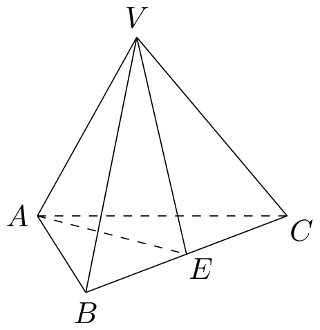
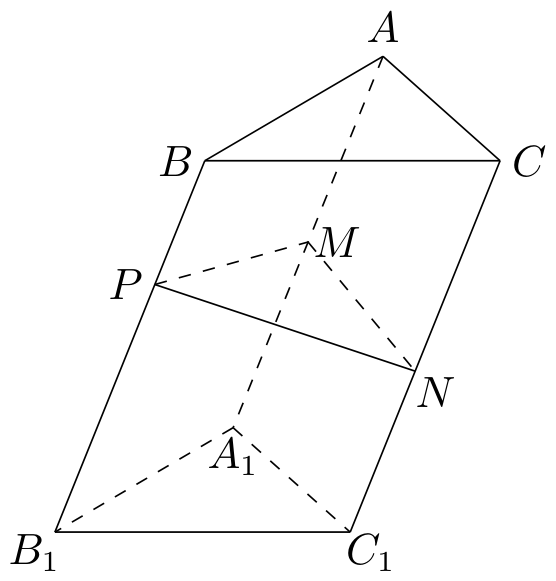

# 2004年上海卷（春）

## 填空题

### 第 1 题

若复数 $z$ 满足 $z(1+\i)=2$，则 $z$ 的实部是＿＿＿＿＿＿.

#### 答案

1

#### 解析

将等式两边同乘 $1-\i$，得

$$

z=\frac{2}{1+\i}=\frac{2(1-\i)}{(1+\i)(1-\i)}=\frac{2(1-\i)}{2}=1-\i

$$

因此 $z$ 的实部为 $1$.

### 第 2 题

方程 $\lg x+\lg(x+3)=1$ 的解 $x=$＿＿＿＿＿＿.

#### 答案

2

#### 解析

由两个对数式都有意义，必须有 $x>0$ 且 $x+3>0$，所以定义域条件合并为 $x>0$. 在此条件下，利用对数的运算法则，原方程等价于 $\lg\left(x(x+3)\right)=1$，$x(x+3)=10$. 于是 $x^2+3x-10=0$，即 $(x+5)(x-2)=0$，解得 $x=-5$ 或 $x=2$. 只有 $x=2$ 满足定义域条件，所以方程的解为 $2$.

### 第 3 题

在 $\triangle ABC$ 中，$a$，$b$，$c$ 分别是 $\angle A$，$\angle B$，$\angle C$ 所对的边. 若 $\angle A=105^{\circ}$，$\angle B=45^{\circ}$，$b=2\sqrt{2}$，则 $c=$＿＿＿＿＿＿.

#### 答案

2

#### 解析

由三角形内角和，

$$

\angle C=180^{\circ}-\angle A-\angle B=180^{\circ}-105^{\circ}-45^{\circ}=30^{\circ}

$$

由正弦定理，$\dfrac{c}{\sin C}=\dfrac{b}{\sin B}$，因此

$$

c=b\frac{\sin C}{\sin B}=2\sqrt{2}\cdot\frac{\sin30^{\circ}}{\sin45^{\circ}}
=2\sqrt{2}\cdot\frac{1/2}{\sqrt{2}/2}=2

$$

所以 $c=2$.

### 第 4 题

过抛物线 $y^{2}=4x$ 的焦点 $F$ 作垂直于 $x$ 轴的直线，交抛物线于 $A$，$B$ 两点，则以 $F$ 为圆心，$AB$ 为直径的圆方程是＿＿＿＿＿＿.

#### 答案

$(x-1)^2+y^2=4$

#### 解析

抛物线的标准形式为 $y^2=4ax$，与题式比较得 $a=1$，所以焦点为 $F(1,0)$. 过 $F$ 作垂直于 $x$ 轴的直线，得到直线 $x=1$. 将其代入抛物线方程，得 $y^2=4$，故 $A(1,2)$，$B(1,-2)$，$AB=4$. 以 $AB$ 为直径的圆半径为 $AB/2=2$，圆心为 $F(1,0)$，所以圆方程为

$$

(x-1)^2+y^2=2^2=4

$$

### 第 5 题

已知函数 $f(x)=\log_3\left(\frac{4}{x}+2\right)$，则方程 $f^{-1}(x)=4$ 的解 $x=$＿＿＿＿＿＿.

#### 答案

1

#### 解析

由反函数的定义，$f^{-1}(x)=4$ 等价于 $x=f(4)$. 代入函数式计算：

$$

x=f(4)=\log_3\left(\frac{4}{4}+2\right)=\log_3 3=1

$$

因此方程的解为 $x=1$.

### 第 6 题

如图，在底面边长为 $2$ 的正三棱锥 $V-ABC$ 中，$E$ 是 $BC$ 的中点，若 $\triangle VAE$ 的面积是 $\frac{1}{4}$，则侧棱 $VA$ 与底面所成角的大小为＿＿＿＿＿＿. （结果用反三角函数值表示） 

#### 答案

$\arctan\dfrac{1}{4}$

#### 解析

设正三角形 $ABC$ 的中心为 $O$. 正三棱锥的顶点在底面上的射影为底面中心，因此 $VO\perp$ 底面，且 $O$ 在中线 $AE$ 上. 由于 $E$ 是边 $BC$ 的中点， $AE=\sqrt{2^2-1^2}=\sqrt{3}$，$AO=\frac{2}{3}AE=\frac{2\sqrt{3}}{3}$. 又因为 $VO$ 垂直于底面内的直线 $AE$，所以 $\triangle VAE$ 以 $AE$ 为底、以 $VO$ 为高，从而 $\frac{1}{2}AE\cdot VO=\frac{1}{4}$，$VO=\frac{1}{2\,AE}=\frac{\sqrt{3}}{6}$. 设侧棱 $VA$ 与底面所成的角为 $\theta$. 由于 $AO$ 是 $VA$ 在底面上的射影，$\theta=\angle VAO$，且 $\triangle VAO$ 在 $O$ 处为直角，因此

$$

\tan\theta=\frac{VO}{AO}=\frac{\sqrt{3}/6}{2\sqrt{3}/3}=\frac{1}{4}

$$

故 $\theta=\arctan\dfrac{1}{4}$.

### 第 7 题

在数列 $\{a_{n}\}$ 中，$a_{1}=3$，且对任意大于 $1$ 的正整数 $n$，点 $(\sqrt{a_n},\sqrt{a_{n-1}})$ 在直线 $x-y-\sqrt{3}=0$ 上，则 $\displaystyle\lim_{n\to\infty} \frac{a_n}{(n+1)^2}=$＿＿＿＿＿＿.

#### 答案

3

#### 解析

由点 $(\sqrt{a_n},\sqrt{a_{n-1}})$ 在直线 $x-y-\sqrt{3}=0$ 上，对每个 $n\geqslant2$ 都有

$$

\sqrt{a_n}-\sqrt{a_{n-1}}=\sqrt{3}

$$

又 $a_1=3$，所以 $\sqrt{a_1}=\sqrt{3}$. 将上述等式从 $2$ 到 $n$ 逐项相加，得到 $\sqrt{a_n}=\sqrt{a_1}+(n-1)\sqrt{3}=n\sqrt{3}$，$a_n=3n^2$. 因此

$$

\lim_{n\to\infty}\frac{a_n}{(n+1)^2}
=\lim_{n\to\infty}3\left(\frac{n}{n+1}\right)^2=3

$$

### 第 8 题

根据下列 $5$ 个图形及相应点的个数的变化规律，试猜测第 $n$ 个图中有＿＿＿＿＿＿个点. 

#### 答案

$n^2-n+1$

#### 解析

设第 $n$ 个图形中的点数为 $u_n$. 第一个图形只有中心点，所以 $u_1=1$. 观察图形可知，从第 $k$ 个图形到第 $k+1$ 个图形时，原有点的位置保留，并在图形两侧各新增一列含 $k$ 个点的点列，因此新增点数为 $2k$. 于是 $u_{k+1}-u_k=2k$，$(k\geqslant1)$. 将其从 $k=1$ 累加到 $k=n-1$，得

$$

u_n=u_1+\sum_{k=1}^{n-1}2k
=1+2\cdot\frac{(n-1)n}{2}
=n^2-n+1

$$

所以第 $n$ 个图中有 $n^2-n+1$ 个点.

### 第 9 题

一次二期课改经验交流会打算交流试点学校的论文 $5$ 篇和非试点学校的论文 $3$ 篇. 若任意排列交流次序，则最先和最后交流的论文都为试点学校的概率是＿＿＿＿＿＿. （结果用分数表示）

#### 答案

$\dfrac{5}{14}$

#### 解析

把 $8$ 篇论文看作彼此不同的论文，任意排列意味着每篇论文出现在每个位置的机会相同. 最先交流的论文为试点学校论文的概率为 $\dfrac{5}{8}$. 在这一事件发生的条件下，剩下 $7$ 篇论文中有 $4$ 篇试点学校论文，因而最后交流的论文为试点学校论文的条件概率为 $\dfrac{4}{7}$. 所求概率为

$$

\frac{5}{8}\cdot\frac{4}{7}=\frac{5}{14}

$$

### 第 10 题

若平移椭圆 $4(x+3)^2+9y^2=36$，使平移后的椭圆中心在第一象限，且它与 $x$ 轴，$y$ 轴分别只有一个交点，则平移后的椭圆方程是＿＿＿＿＿＿.

#### 答案

$\dfrac{(x-3)^2}{9}+\dfrac{(y-2)^2}{4}=1$

#### 解析

原椭圆可写为

$$

\frac{(x+3)^2}{9}+\frac{y^2}{4}=1

$$

所以平移后半长轴和半短轴仍分别为 $3$ 和 $2$. 设平移后的中心为 $(h,k)$. 因中心在第一象限，$h>0$，$k>0$，平移后的方程为

$$

\frac{(x-h)^2}{9}+\frac{(y-k)^2}{4}=1

$$

令 $y=0$ 求椭圆与 $x$ 轴的交点，得到

$$

\frac{(x-h)^2}{9}=1-\frac{k^2}{4}

$$

只有一个交点当且仅当右端为零，即 $k=2$. 同理，令 $x=0$ 求与 $y$ 轴的交点，只有一个交点当且仅当 $h=3$. 因此平移后的椭圆方程为

$$

\frac{(x-3)^2}{9}+\frac{(y-2)^2}{4}=1

$$

### 第 11 题

如图，在由二项式系数所构成的杨辉三角形中，第＿＿＿＿＿＿行中从左至右第$14$与第$15$个数的比为$2:3$.

|            |       |       |        |        |       |       |
|:-----------|:-----:|:-----:|:------:|:------:|:-----:|:-----:|
| 第$0$行  | $1$ |       |        |        |       |       |
| 第$1$行  | $1$ | $1$ |        |        |       |       |
| 第$2$行  | $1$ | $2$ | $1$  |        |       |       |
| 第$3$行  | $1$ | $3$ | $3$  | $1$  |       |       |
| 第$4$行  | $1$ | $4$ | $6$  | $4$  | $1$ |       |
| 第$5$行  | $1$ | $5$ | $10$ | $10$ | $5$ | $1$ |
| $\cdots$ |       |       |        |        |       |       |

#### 答案

34

#### 解析

按题中从第 $0$ 行开始的编号，第 $n$ 行的第 $j+1$ 个数为 $\mathrm C_n^j$. 因此第 $14$、第 $15$ 个数分别为 $\mathrm C_n^{13}$、$\mathrm C_n^{14}$，且必须有 $n\geqslant14$. 由题意

$$

\frac{\mathrm C_n^{13}}{\mathrm C_n^{14}}
=\frac{\dfrac{n!}{13!(n-13)!}}{\dfrac{n!}{14!(n-14)!}}
=\frac{14}{n-13}=\frac{2}{3}

$$

解得 $3\cdot14=2(n-13)$，即 $n=34$，且满足 $n\geqslant14$. 所以应填 $34$.

### 第 12 题

在等差数列 $\{a_{n}\}$ 中，当 $a_{r}=a_{s}$（$r\neq s$）时，$\{a_{n}\}$ 必定是常数数列. 然而在等比数列 $\{a_{n}\}$ 中，对某些正整数 $r$，$s$（$r\neq s$），当 $a_{r}=a_{s}$ 时，非常数数列 $\{a_{n}\}$ 的一个例子是＿＿＿＿＿＿.

#### 答案

$a$，$-a$，$a$，$-a$，$\ldots$（$a\ne0$，$r$ 与 $s$ 同为奇数或偶数）

#### 解析

取首项为非零实数 $a$，公比为 $-1$. 则

$$

a_n=a(-1)^{n-1}

$$

数列为 $a$，$-a$，$a$，$-a$，$\ldots$，因 $a\ne0$ 且相邻两项异号，所以它不是常数数列. 取两个不同且同奇偶性的正整数 $r$，$s$，有

$$

a_r=a(-1)^{r-1}=a(-1)^{s-1}=a_s

$$

例如取 $r=1$、$s=3$，就有 $a_1=a_3$. 这给出了所求例子.

## 单选题

### 第 13 题

下列函数中，周期为 $1$ 的奇函数是（）

A.  
$y = 1 - 2\sin^2\pi x$

B.  
$y = \sin \left(2\pi x + \frac{\pi}{3}\right)$

C.  
$y = \tan \frac{\pi}{2} x$

D.  
$y = \sin \pi x \cos \pi x$

#### 答案

D

#### 解析

逐项判断. 选项 A 中

$$

1-2\sin^2\pi x=\cos2\pi x

$$

它是偶函数，故不是奇函数. 选项 B 的周期为 $1$，但在 $x=0$ 时函数值为 $\sin\dfrac{\pi}{3}\ne0$，所以不可能是奇函数. 选项 C 中 $\tan\dfrac{\pi}{2}x$ 的基本周期为 $\dfrac{\pi}{\pi/2}=2$，不是 $1$. 选项 D 中

$$

\sin\pi x\cos\pi x=\frac{1}{2}\sin2\pi x

$$

因此它满足 $f(-x)=-f(x)$，是奇函数，且周期为 $1$. 所以选 D.

### 第 14 题

若非空集合 $M \subseteq N$，则“$a \in M$ 或 $a \in \mathbb{N}^{*}$”是“$a \in M \cap N^{*}$”的（）

A.  
充分非必要条件

B.  
必要非充分条件

C.  
充要条件

D.  
既非充分又非必要条件

#### 答案

B

#### 解析

记 $P$ 为命题“$a\in M$ 或 $a\in\mathbb{N}^{*}$”，记 $Q$ 为命题“$a\in M\cap\mathbb{N}^{*}$”. 若 $Q$ 成立，则 $a$ 同时属于 $M$ 和 $\mathbb{N}^{*}$，所以 $P$ 必然成立，即 $Q\mathbb{R}ightarrow P$. 因而 $P$ 是 $Q$ 的必要条件.

但 $P$ 不足以推出 $Q$. 例如取允许的非空集合 $M=\{2\}$，取 $a=1$，则 $a\in\mathbb{N}^{*}$，所以 $P$ 成立；但 $a\notin M$，从而 $a\notin M\cap\mathbb{N}^{*}$，即 $Q$ 不成立. 因此 $P$ 不是 $Q$ 的充分条件.

所以“$a\in M$ 或 $a\in\mathbb{N}^{*}$”是“$a\in M\cap\mathbb{N}^{*}$”的必要非充分条件，选 B.

### 第 15 题

在 $\triangle ABC$ 中，有命题

1.  $\overrightarrow{AB}-\overrightarrow{AC}=\overrightarrow{BC}$；

2.  $\overrightarrow{AB}+\overrightarrow{BC}+\overrightarrow{CA}=\overrightarrow{0}$；

3.  若 $(\overrightarrow{AB}+\overrightarrow{AC})\cdot(\overrightarrow{AB}-\overrightarrow{AC})=0$，则 $\triangle ABC$ 为等腰三角形；

4.  若 $\overrightarrow{AC}\cdot\overrightarrow{AB}>0$，则 $\triangle ABC$ 为锐角三角形.

上述命题正确的是（）

A.  
1⃝2⃝

B.  
1⃝4⃝

C.  
2⃝3⃝

D.  
2⃝3⃝4⃝

#### 答案

C

#### 解析

逐条判断. 首先

$$

\overrightarrow{AB}-\overrightarrow{AC}
=\overrightarrow{AB}+\overrightarrow{CA}
=\overrightarrow{CB}

$$

一般不等于 $\overrightarrow{BC}$，所以命题1⃝错误.

三角形的向量首尾相接关系给出

$$

\overrightarrow{AB}+\overrightarrow{BC}+\overrightarrow{CA}=\overrightarrow{0}

$$

所以命题2⃝正确.

对命题3⃝，利用数量积的分配律，条件左端等于

$$

(\overrightarrow{AB}+\overrightarrow{AC})\cdot(\overrightarrow{AB}-\overrightarrow{AC})
=|\overrightarrow{AB}|^2-|\overrightarrow{AC}|^2

$$

若该式为零，则 $|\overrightarrow{AB}|=|\overrightarrow{AC}|$，即 $AB=AC$，故三角形 $ABC$ 为等腰三角形，命题3⃝正确.

命题4⃝的条件只说明 $\angle A$ 为锐角，不能保证 $\angle B$、$\angle C$ 也为锐角. 例如取 $AB=1$、$AC=3$、$\angle A=60^{\circ}$，则 $\overrightarrow{AC}\cdot\overrightarrow{AB}>0$，而由余弦定理 $BC^2=1^2+3^2-2\cdot1\cdot3\cos60^{\circ}=7$，于是 $AC^2=9>1+7=AB^2+BC^2$，$\angle B$ 为钝角，命题4⃝错误.

所以正确的命题是2⃝、3⃝，选 C.

### 第 16 题

若 $p = a + \frac{1}{a} + 2$（$a>0$），$q = \arccos t$（$-1 \leqslant t \leqslant 1$），则下列不等式恒成立的是（）

A.  
$p \geqslant \pi > q$

B.  
$p > q \geqslant 0$

C.  
$4 > p \geqslant q$

D.  
$p \geqslant q > 0$

#### 答案

B

#### 解析

因为 $a>0$，由基本不等式

$$

a+\frac{1}{a}\geqslant2\sqrt{a\cdot\frac{1}{a}}=2

$$

所以 $p\geqslant4$. 又因 $-1\leqslant t\leqslant1$，反余弦函数的值域为 $[0,\pi]$，故

$$

0\leqslant q=\arccos t\leqslant\pi

$$

利用 $\pi<4$，得到

$$

p\geqslant4>\pi\geqslant q

$$

从而必有 $p>q\geqslant0$，所以选项 B 恒成立. 其余选项分别因可能有 $q=\pi$、$p=4$ 或 $q=0$ 而不能恒成立.

## 解答题

### 第 17 题

在直角坐标系 $xOy$ 中，已知点 $P(2\cos x+1, 2\cos 2x+2)$ 和点 $Q(\cos x,-1)$，其中 $x \in [0,\pi]$. 若向量 $\overrightarrow{OP}$ 与 $\overrightarrow{OQ}$ 垂直，求 $x$ 的值.

#### 解析

设 $c=\cos x$. 则 $P=(2c+1,2\cos2x+2)$，$Q=(c,-1)$. 向量 $\overrightarrow{OP}$ 与 $\overrightarrow{OQ}$ 垂直，当且仅当它们的数量积为零，即

$$

(2c+1)c+(2\cos2x+2)(-1)=0

$$

利用 $\cos2x=2c^2-1$，化简得 $2c^2+c-2(2c^2-1)-2=0$，$c-2c^2=0$，$c(1-2c)=0$. 所以 $c=0$ 或 $c=\dfrac{1}{2}$，即 $\cos x=0$ 或 $\cos x=\dfrac{1}{2}$. 由于 $x\in[0,\pi]$，余弦函数在该区间上为一一对应函数，故分别得到

$$

x=\frac{\pi}{2}\quad\text{或}\quad x=\frac{\pi}{3}

$$

因此 $x=\dfrac{\pi}{3}$ 或 $x=\dfrac{\pi}{2}$.

### 第 18 题

已知实数 $p$ 满足不等式 $\frac{2p+1}{p+2}<0$，试判断方程 $z^2-2z+5-p^2=0$ 有无实根，并给出证明.

#### 解析

分式的关键点为分子为零的 $p=-\dfrac{1}{2}$ 和分母为零的 $p=-2$. 作符号判断：

$$

\frac{2p+1}{p+2}<0
\quad\Longleftrightarrow\quad
-2<p<-\frac{1}{2}

$$

端点 $-2$ 不能取，端点 $-\dfrac{1}{2}$ 使分式等于零，也不能取. 因而在上述范围内 $|p|<2$，从而 $p^2<4$.

把方程看作关于 $z$ 的一元二次方程，其判别式为

$$

\Delta=(-2)^2-4\cdot1\cdot(5-p^2)=4p^2-16=4(p^2-4)<0

$$

二次方程有实根的必要充分条件是 $\Delta\geqslant0$，而此处 $\Delta<0$，所以方程无实根.

### 第 19 题

某市 $2003\text{ 年}$ 共有 $1\text{ 万辆}$ 燃油型公交车. 有关部门计划于 $2004\text{ 年}$ 投入 $128\text{ 辆}$ 电力型公交车. 随后电力型公交车每年的投入比上一年增加 $50\%$，试问：

1.  该市在 $2010$ 年应该投入多少辆电力型公交车？

2.  到哪一年底，电力型公交车的数量开始超过该市公交车总量的 $\frac{1}{3}$？

#### 解析

1.  设第 $2003+n$ 年投入的电力型公交车数量为 $a_n$. 题设给出 $a_1=128$，并且每年比上一年增加 $50\%$，所以 $\{a_n\}$ 是首项为 $128$、公比为 $1+50\%=\dfrac{3}{2}$ 的等比数列，

$$

a_n=128\left(\frac{3}{2}\right)^{n-1}

$$

    $2010$ 年对应 $n=2010-2003=7$，因此

$$

a_7=128\left(\frac{3}{2}\right)^6
    =128\cdot\frac{729}{64}=1458

$$

    所以该市在 $2010$ 年应投入 $1458\text{ 辆}$ 电力型公交车.

2.  设截至第 $2003+n$ 年底投入的电力型公交车总数为 $S_n$. 由等比数列求和公式，

$$

S_n=128\left[1+\frac{3}{2}+\cdots+\left(\frac{3}{2}\right)^{n-1}\right]
    =256\left[\left(\frac{3}{2}\right)^n-1\right]

$$

    到该年底，公交车总量为原有的 $10000$ 辆燃油型公交车与新投入的 $S_n$ 辆电力型公交车之和，即 $10000+S_n$. 要使电力型公交车数量超过总量的 $\dfrac{1}{3}$，需要

$$

\frac{S_n}{10000+S_n}>\frac{1}{3}
    \quad\Longleftrightarrow\quad
    3S_n>10000+S_n
    \quad\Longleftrightarrow\quad
    S_n>5000

$$

    数列 $S_n$ 递增，且

$$

S_7=256\left[\left(\frac{3}{2}\right)^7-1\right]=4118<5000

$$

$$

S_8=256\left[\left(\frac{3}{2}\right)^8-1\right]=6305>5000

$$

    因此首次超过发生在 $n=8$，即 $2003+8=2011$ 年底.

### 第 20 题

如图，点 $P$ 为斜三棱柱 $ABC-A_{1}B_{1}C_{1}$ 的侧棱 $BB_{1}$ 上一点，$PM \perp BB_{1}$ 交 $AA_{1}$ 于点 $M$，$PN \perp BB_{1}$ 交 $CC_{1}$ 于点 $N$.

1.  求证： $CC_{1} \perp MN$；

2.  在任意 $\triangle DEF$ 中有余弦定理： $DE^2 = DF^2 + EF^2 - 2DF \cdot EF\cos \angle DFE$. 拓展到空间，类比三角形的余弦定理，写出斜三棱柱的三个侧面面积与其中两个侧面所成的二面角之间的关系，并予以证明.

#### 解析

1.  直线 $PM$ 和 $PN$ 相交于 $P$，且它们都垂直于 $BB_1$. 因此一条直线垂直于平面 $PMN$ 内相交的两条直线，得到

$$

BB_1\perp\text{平面 }PMN

$$

    又因三棱柱的侧棱互相平行，$CC_1\parallel BB_1$，所以 $CC_1\perp$ 平面 $PMN$. 由于 $MN$ 在平面 $PMN$ 内，故 $CC_1\perp MN$.

2.  先取侧面 $BCC_1B_1$ 与侧面 $CAA_1C_1$ 为所说的两个侧面，它们的公共棱为 $CC_1$，设所成二面角的平面角为 $\alpha$. 记三个侧面 $ABB_1A_1$、$BCC_1B_1$、$CAA_1C_1$ 的面积分别为 $S_{AB}$、$S_{BC}$、$S_{CA}$.

    由第一问，$CC_1\perp$ 平面 $PMN$，所以平面 $PMN$ 内的 $PN$ 与 $MN$ 都垂直于公共棱 $CC_1$. 其中 $PN$ 在侧面 $BCC_1B_1$ 内，$MN$ 在侧面 $CAA_1C_1$ 内，因此二面角的平面角为 $\angle MNP=\alpha$. 在 $\triangle PMN$ 中应用余弦定理，得

$$

PM^2=PN^2+MN^2-2PN\cdot MN\cos\alpha

$$

    两边同乘 $CC_1^2$，并利用 $BB_1\parallel CC_1$ 及棱柱侧棱等长，得到

$$

PM^2CC_1^2=PN^2CC_1^2+MN^2CC_1^2-2PN\cdot MN\cdot CC_1^2\cos\alpha

$$

    由于 $PM\perp BB_1$，$PN\perp CC_1$，且由第一问 $MN\perp CC_1$，三个侧面面积分别为 $S_{AB}=PM\cdot BB_1=PM\cdot CC_1$，$S_{BC}=PN\cdot CC_1$，$S_{CA}=MN\cdot CC_1$. 代入上式，得到

$$

S_{AB}^2=S_{BC}^2+S_{CA}^2-2S_{BC}S_{CA}\cos\alpha

$$

    这就是一个侧面面积、另外两个侧面面积及其所夹二面角之间的关系；对另外两组侧面循环使用同样的论证即可.

### 第 21 题

已知函数 $f(x)=|x-a|$，$g(x)=x^2+2ax+1$（$a$ 为正常数），且函数 $f(x)$ 与 $g(x)$ 的图象在 $y$ 轴上的截距相等.

1.  求 $a$ 的值；

2.  求函数 $f(x)+g(x)$ 的单调递增区间；

3.  若 $n$ 为正整数，证明： $10^{f(n)}\cdot\left(\frac45\right)^{g(n)}<4$.

#### 解析

1.  函数图象与 $y$ 轴的交点对应自变量 $x=0$. 因此 $f(0)=|0-a|=a$，$g(0)=0^2+2a\cdot0+1=1$. 由两图象在 $y$ 轴上的截距相等，且 $a$ 为正常数，得 $a=1$.

2.  当 $a=1$ 时，按 $x<1$ 与 $x\geqslant1$ 分情况，

$$

f(x)+g(x)=
    \begin{cases}
    x^2+x+2, & x<1,\\
    x^2+3x, & x\geqslant1.
    \end{cases}

$$

    当 $x<1$ 时，

$$

x^2+x+2=\left(x+\frac{1}{2}\right)^2+\frac{7}{4}

$$

    所以该段在 $\left[-\dfrac{1}{2},1\right)$ 上单调递增. 当 $x\geqslant1$ 且 $x_1<x_2$ 时，

$$

(x_2^2+3x_2)-(x_1^2+3x_1)=(x_2-x_1)(x_1+x_2+3)>0

$$

    所以第二段在 $[1,+\infty)$ 上单调递增. 两段在 $x=1$ 处的函数值均为 $4$，故整体在 $\left[-\dfrac{1}{2},+\infty\right)$ 上单调递增.

3.  由 $a=1$ 且 $n$ 为正整数，得 $n\geqslant1$，从而 $f(n)=|n-1|=n-1$，$g(n)=n^2+2n+1=(n+1)^2$. 记

$$

u_n=10^{f(n)}\left(\frac45\right)^{g(n)}
    =10^{n-1}\left(\frac45\right)^{(n+1)^2}

$$

    则

$$

\frac{u_{n+1}}{u_n}=10\left(\frac45\right)^{(n+2)^2-(n+1)^2}=10\left(\frac45\right)^{2n+3}

$$

    当 $1\leqslant n\leqslant3$ 时，$2n+3\leqslant9$，故

$$

\frac{u_{n+1}}{u_n}\geqslant10\left(\frac45\right)^9
    =\frac{2621440}{1953125}>1

$$

    所以 $u_1<u_2<u_3<u_4$. 当 $n\geqslant4$ 时，$2n+3\geqslant11$，故

$$

\frac{u_{n+1}}{u_n}\leqslant10\left(\frac45\right)^{11}
    =\frac{41943040}{48828125}<1

$$

    所以 $u_n$ 从 $u_4$ 起递减.

    最后估计最大值 $u_4$：由于

$$

\left(\frac45\right)^5=\frac{1024}{3125}<\frac{33}{100}

$$

    有

$$

u_4=10^3\left(\frac45\right)^{25}
    =10^3\left[\left(\frac45\right)^5\right]^5
    <10^3\left(\frac{33}{100}\right)^5
    =\frac{39135393}{10000000}<4

$$

    因此任意正整数 $n$ 都满足 $u_n\leqslant u_4<4$，即

$$

10^{f(n)}\left(\frac45\right)^{g(n)}<4

$$

### 第 22 题

已知倾斜角为 $45^{\circ}$ 的直线 $l$ 过点 $A(1,-2)$ 和点 $B$，$B$ 在第一象限，$|AB|=3\sqrt{2}$.

1.  求点 $B$ 的坐标；

2.  若直线 $l$ 与双曲线 $C:\frac{x^2}{a^2}-y^2=1$（$a>0$）相交于 $E$，$F$ 两点，且线段 $EF$ 的中点坐标为 $(4,1)$，求 $a$ 的值；

3.  对于平面上任一点 $P$，当点 $Q$ 在线段 $AB$ 上运动时，称 $|PQ|$ 的最小值为 $P$ 与线段 $AB$ 的距离. 已知点 $P$ 在 $x$ 轴上运动，写出点 $P(t,0)$ 到线段 $AB$ 的距离 $h$ 关于 $t$ 的函数关系式.

#### 解析

1.  直线 $l$ 的倾斜角为 $45^{\circ}$，所以斜率为 $\tan45^{\circ}=1$. 过 $A(1,-2)$ 的直线方程为 $y+2=x-1$，$y=x-3$. 设 $B$ 在该直线上，则可写为 $B=(1+u,-2+u)$. 由 $|AB|=3\sqrt{2}$， $u^2+u^2=18$，$u=\pm3$. 当 $u=-3$ 时，点为 $(-2,-5)$，不在第一象限；当 $u=3$ 时，点为 $(4,1)$，符合条件. 所以 $B(4,1)$.

2.  将直线 $y=x-3$ 代入双曲线方程，得

$$

\frac{x^2}{a^2}-(x-3)^2=1

$$

    即

$$

\left(\frac{1}{a^2}-1\right)x^2+6x-10=0

$$

    设交点 $E$，$F$ 的横坐标分别为 $x_1$，$x_2$. 因为两交点都在直线 $y=x-3$ 上，且线段 $EF$ 的中点为 $(4,1)$，所以 $\frac{x_1+x_2}{2}=4$，$x_1+x_2=8$. 两点相交意味着上面的二次项系数不能为零，否则只能得到一个一次方程的交点；因此可以用韦达定理，

$$

x_1+x_2=-\frac{6}{1/a^2-1}=8

$$

    解得 $\frac{1}{a^2}-1=-\frac{3}{4}$，$\frac{1}{a^2}=\frac{1}{4}$，$a^2=4$. 由 $a>0$，得 $a=2$.

3.  设线段 $AB$ 上的动点为 $Q(s)=(1+3s,-2+3s)$，$0\leqslant s\leqslant1$. 对 $P(t,0)$，有 $\overrightarrow{AB}=(3,3)$，$\overrightarrow{AP}=(t-1,2)$. 若从 $P$ 向直线 $AB$ 作垂线，垂足对应的参数为

$$

s=\frac{\overrightarrow{AP}\cdot\overrightarrow{AB}}{|\overrightarrow{AB}|^2}
    =\frac{3(t-1)+6}{18}=\frac{t+1}{6}

$$

    当且仅当 $0\leqslant s\leqslant1$，即 $-1\leqslant t\leqslant5$ 时，垂足在线段 $AB$ 上. 这时点到直线 $AB:y=x-3$ 的距离为

$$

\frac{|t-0-3|}{\sqrt{1^2+(-1)^2}}=\frac{|t-3|}{\sqrt{2}}

$$

    当 $t<-1$ 时，垂足在线段 $A$ 的外侧，最近的线段点是 $A$，故距离为

$$

|PA|=\sqrt{(t-1)^2+(0+2)^2}=\sqrt{(t-1)^2+4}

$$

    当 $t>5$ 时，最近的线段点是 $B$，故距离为

$$

|PB|=\sqrt{(t-4)^2+(0-1)^2}=\sqrt{(t-4)^2+1}

$$

    所以

$$

h(t)=
    \begin{cases}
    \sqrt{(t-1)^2+4}, & t<-1,\\
    \dfrac{|t-3|}{\sqrt{2}}, & -1\leqslant t\leqslant5,\\
    \sqrt{(t-4)^2+1}, & t>5.
    \end{cases}

$$

