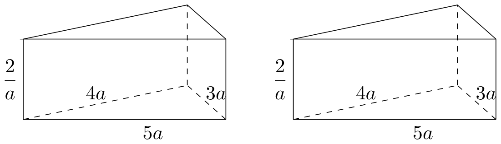
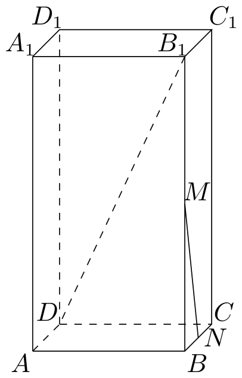
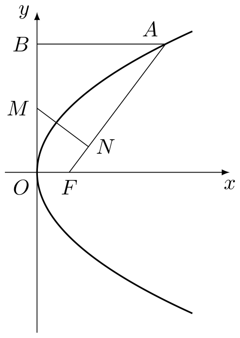

# 2005年上海卷（秋文）

## 填空题

### 第 1 题

函数 $f(x)=\log_{4}(x+1)$ 的反函数 $f^{-1}(x)=$＿＿＿＿＿＿.

#### 答案

$4^x-1$

#### 解析

令 $y=f(x)=\log_{4}(x+1)$，则 $x>-1$. 交换 $x$，$y$ 得 $x=\log_{4}(y+1)$，所以 $y+1=4^x$，从而 $y=4^x-1$. 因此 $f^{-1}(x)=4^x-1$，其定义域为 $\mathbb{R}$.

### 第 2 题

方程 $4^{x} + 2^{x} - 2 = 0$ 的解是＿＿＿＿＿＿.

#### 答案

$x=0$

#### 解析

令 $t=2^x$，则 $t>0$，原方程化为 $t^2+t-2=0$，即 $(t-1)(t+2)=0$. 由于 $t>0$，只能取 $t=1$，所以 $2^x=1$，解得 $x=0$.

### 第 3 题

若 $x$，$y$ 满足条件 $\left\{\begin{aligned} &x + y \leqslant 3, \\ &y \leqslant 2x, \end{aligned}\right.$ 则 $z = 3x + 4y$ 的最大值是＿＿＿＿＿＿.

#### 答案

$11$

#### 解析

由于 $z=3x+4y$ 随 $y$ 增大而增大，对于固定的 $x$，可行点中使 $z$ 最大的点必须取最大的 $y$，所以只需考察两条边界 $y=2x$ 和 $x+y=3$. 当 $y=2x$ 时，由 $2x\leqslant3-x$ 得 $x\leqslant1$，于是 $z=11x\leqslant11$. 当 $x+y=3$ 时，由 $3-x\leqslant2x$ 得 $x\geqslant1$，于是 $z=3x+4(3-x)=12-x\leqslant11$. 两个边界的交点为 $(1,2)$，且在此处 $z=11$，所以最大值为 $11$.

### 第 4 题

直角坐标平面 $xOy$ 中，若定点 $A(1,2)$ 与动点 $P(x,y)$ 满足 $\overrightarrow{OP} \cdot \overrightarrow{OA} = 4$，则点 $P$ 的轨迹方程是＿＿＿＿＿＿.

#### 答案

$x+2y-4=0$

#### 解析

$\overrightarrow{OP}=(x,y)$，$\overrightarrow{OA}=(1,2)$. 由数量积条件

$$

\overrightarrow{OP}\cdot\overrightarrow{OA}=x+2y=4

$$

反过来，直线上任意点 $(x,y)$ 都满足 $x+2y=4$，因而满足原数量积条件. 所以点 $P$ 的轨迹方程为 $x+2y-4=0$.

### 第 5 题

函数 $y = \cos 2x + \sin x \cos x$ 的最小正周期 $T =$＿＿＿＿＿＿.

#### 答案

$\pi$

#### 解析

利用 $\sin x\cos x=\frac12\sin2x$，得

$$

y=\cos2x+\frac12\sin2x

$$

令 $R=\sqrt{1+\left(\frac12\right)^2}=\frac{\sqrt5}{2}$. 由于 $R>0$，存在常数 $\varphi$，使得

$$

y=R\cos(2x-\varphi)

$$

因此 $\pi$ 是它的一个正周期. 若 $T>0$ 是任意正周期，令 $u=2x-\varphi$，则 $u$ 可取任意实数，并有 $\cos(u+2T)=\cos u$. 分别取 $u=0$ 和 $u=\frac\pi2$，得到 $\cos2T=1$ 且 $\sin2T=0$，所以 $2T=2k\pi$（$k\in\mathbb{Z}$）. 因而最小正周期为 $\pi$.

### 第 6 题

若 $\cos\alpha=\frac{1}{7}$，$\alpha\in\left(0,\frac{\pi}{2}\right)$，则 $\cos\left(\alpha+\frac{\pi}{3}\right)=$＿＿＿＿＿＿.

#### 答案

$-\frac{11}{14}$

#### 解析

因为 $\alpha\in(0,\frac\pi2)$，所以 $\sin\alpha>0$，且

$$

\sin\alpha=\sqrt{1-\cos^2\alpha}=\sqrt{1-\frac1{49}}=\frac{4\sqrt3}{7}

$$

于是

$$

\cos\left(\alpha+\frac\pi3\right)=\cos\alpha\cos\frac\pi3-\sin\alpha\sin\frac\pi3=\frac1{14}-\frac{4\sqrt3}{7}\cdot\frac{\sqrt3}{2}=-\frac{11}{14}

$$

### 第 7 题

若椭圆长轴长与短轴长之比为 $2$，它的一个焦点是 $(2\sqrt{15},0)$，则椭圆的标准方程是＿＿＿＿＿＿.

#### 答案

$\frac{x^2}{80}+\frac{y^2}{20}=1$

#### 解析

设椭圆的长半轴、短半轴和焦半距分别为 $a$，$b$，$c$，其中 $a>b>0$. 由于长轴长与短轴长之比为 $2$，有 $a=2b$. 焦点为 $(2\sqrt{15},0)$，故椭圆的长轴在 $x$ 轴上，且 $c=2\sqrt{15}$，$c^2=a^2-b^2$. 代入 $a=2b$ 得 $60=4b^2-b^2=3b^2$，所以 $b^2=20$，$a^2=80$. 因而椭圆的标准方程为 $\frac{x^2}{80}+\frac{y^2}{20}=1$.

### 第 8 题

某班有 $50$ 名学生，其中 $15$ 人选修 $A$ 课程，另外 $35$ 人选修 $B$ 课程. 从班级中任选两名学生，他们是选修不同课程的学生的概率是＿＿＿＿＿＿. （结果用分数表示）

#### 答案

$\frac{3}{7}$

#### 解析

从 $50$ 名学生中任选两人的总数为 $\mathrm C_{50}^{2}$. 两人选修不同课程时，一人选修 $A$，另一人选修 $B$，满足条件的选法有 $15\times35$ 种. 因此所求概率为

$$

\frac{15\times35}{\mathrm C_{50}^{2}}=\frac{525}{1225}=\frac37

$$

### 第 9 题

直线 $y = \frac{1}{2} x$ 关于直线 $x = 1$ 对称的直线方程是＿＿＿＿＿＿.

#### 答案

$x+2y-2=0$

#### 解析

原直线上的点可写为 $(t,\frac12t)$. 关于直线 $x=1$ 对称后，该点变为 $(2-t,\frac12t)$. 令对称后的坐标为 $(x,y)$，则 $t=2-x$，从而 $y=\frac12(2-x)=1-\frac12x$. 整理得对称直线方程为 $x+2y-2=0$.

### 第 10 题

在 $\triangle ABC$ 中，若 $A = 120^{\circ}$，$AB = 5$，$BC = 7$，则 $AC =$＿＿＿＿＿＿.

#### 答案

$3$

#### 解析

设 $AC=x$，由余弦定理

$$

BC^2=AB^2+AC^2-2AB\cdot AC\cos A

$$

代入 $BC=7$，$AB=5$，$A=120^{\circ}$，得

$$

49=25+x^2-10x\cos120^{\circ}=25+x^2+5x

$$

所以 $x^2+5x-24=0$，即 $(x-3)(x+8)=0$. 由于边长必须为正，故 $AC=3$.

### 第 11 题

函数 $f(x)=\sin x+2|\sin x|$，$x\in[0,2\pi]$ 的图象与直线 $y=k$ 有且仅有两个不同的交点，则 $k$ 的取值范围是＿＿＿＿＿＿.

#### 答案

$1<k<3$

#### 解析

当 $x\in[0,\pi]$ 时，$\sin x\geqslant0$，故 $f(x)=3\sin x$. 因此 $0<k<3$ 时有两个交点，$k=0$ 时有两个端点交点，$k=3$ 时有一个交点，其他 $k$ 没有交点.

当 $x\in[\pi,2\pi]$ 时，$\sin x\leqslant0$，故 $f(x)=-\sin x$. 因此 $0<k<1$ 时有两个交点，$k=1$ 时有一个交点，$k=0$ 时两个端点中的 $x=\pi$ 与前一段端点重合，只新增 $x=2\pi$，其他 $k$ 没有交点. 合并两段时，$0<k<1$ 共四个交点，$k=1$ 共三个交点，$k=0$ 共三个交点，$k=3$ 只有一个交点；只有 $1<k<3$ 时恰有两个交点. 因此所求范围为 $1<k<3$.

### 第 12 题

有两个相同的直三棱柱，高为 $\frac{2}{a}$，底面三角形的三边长分别为 $3a$，$4a$，$5a$（$a>0$）. 用它们拼成一个三棱柱或四棱柱，在所有可能的情形中，全面积最小的是一个四棱柱，则 $a$ 的取值范围是＿＿＿＿＿＿.

#### 答案

$0<a<\sqrt{\frac{5}{3}}$

#### 解析

底面三角形为边长 $3a$，$4a$，$5a$ 的直角三角形，面积为 $6a^2$，周长为 $12a$，每个三棱柱的高为 $\frac2a$. 两个三棱柱沿三角形底面拼接时，所得三棱柱的高为 $\frac4a$，全面积为

$$

S_3=2\times6a^2+12a\times\frac4a=12a^2+48

$$

若沿对应于底面边长 $s$ 的侧面拼接，其中 $s\in\{3a,4a,5a\}$，无论拼成三棱柱还是四棱柱，所得几何体的全面积都等于两个原三棱柱全面积之和减去两个相接面的面积，即

$$

S_{\mathrm{side}}(s)=2\left(12a^2+12a\cdot\frac2a\right)-2s\cdot\frac2a=24a^2+48-\frac{4s}{a}

$$

代入 $s=3a$，$4a$，$5a$，得到三种侧面拼接情形的全面积分别为 $24a^2+36$，$24a^2+32$，$24a^2+28$，其中由 $s=5a$ 的拼接可得到一个四棱柱，且其面积最小. 要使这个四棱柱成为所有情形中的最小者，只需比较它与沿底面拼接所得三棱柱的面积，所以

$$

24a^2+28<12a^2+48\iff a^2<\frac53

$$

结合 $a>0$，得 $0<a<\sqrt{\frac53}$.

## 单选题

### 第 13 题

若函数 $f(x) = \frac{1}{2^x + 1}$，则该函数在 $(- \infty, + \infty)$ 上是（）

A.  
单调递减无最小值

B.  
单调递减有最小值

C.  
单调递增无最大值

D.  
单调递增有最大值

#### 答案

A

#### 解析

若 $x_1<x_2$，则 $2^{x_1}<2^{x_2}$，从而 $2^{x_1}+1<2^{x_2}+1$，$\Longrightarrow$，$f(x_1)>f(x_2)$. 所以函数在 $\mathbb{R}$ 上单调递减. 又因为对任意有限的 $x$，都有 $f(x)>0$，且 $\displaystyle\lim_{x\to+\infty}f(x)=0$，故函数没有最小值，正确选项为 A.

### 第 14 题

已知集合 $M = \{x \mid |x - 1| \leqslant 2, x \in \mathbb{R}\}$，$P = \left\{x \mid \frac{5}{x + 1} \geqslant 1, x \in \mathbb{Z}\right\}$，则 $M \cap P$ 等于（）

A.  
$\{x\mid 0 < x\leqslant 3,x\in \mathbb{Z}\}$

B.  
$\{x\mid 0\leqslant x\leqslant 3,x\in \mathbb{Z}\}$

C.  
$\{x\mid -1\leqslant x\leqslant 0,x\in \mathbb{Z}\}$

D.  
$\{x\mid -1\leqslant x < 0,x\in \mathbb{Z}\}$

#### 答案

B

#### 解析

由 $|x-1|\leqslant2$，得 $-1\leqslant x\leqslant3$，所以 $M=[-1,3]$. 对集合 $P$，先注意 $x\neq-1$，并将不等式化为

$$

\frac{5}{x+1}-1=\frac{4-x}{x+1}\geqslant0

$$

当 $x<-1$ 时，$4-x>0$ 而 $x+1<0$，不等式不成立；当 $x>-1$ 时分母为正，不等式等价于 $4-x\geqslant0$. 所以 $-1<x\leqslant4$. 再结合 $x\in\mathbb{Z}$，得到 $P=\{0,1,2,3,4\}$. 因此

$$

M\cap P=\{0,1,2,3\}=\{x\mid0\leqslant x\leqslant3,\ x\in\mathbb{Z}\}

$$

正确选项为 B.

### 第 15 题

条件甲：“$a > 1$”是条件乙：“$a > \sqrt{a}$”的（）

A.  
既不充分也不必要条件

B.  
充要条件

C.  
充分不必要条件

D.  
必要不充分条件

#### 答案

B

#### 解析

条件乙要求 $a\geqslant0$，令 $t=\sqrt a$，则 $t\geqslant0$，且

$$

a>\sqrt a\iff t^2>t\iff t(t-1)>0\iff t>1\iff a>1

$$

所以条件甲与条件乙等价，条件甲既是条件乙的充分条件，也是必要条件，正确选项为 B.

### 第 16 题

用 $n$ 个不同的实数 $a_1$，$a_2$，$\dots$，$a_n$ 可得到 $n!$ 个不同的排列，每个排列为一行写成一个 $n!$ 行的数阵. 对第 $i$ 行 $a_{i1}$，$a_{i2}$，$\dots$，$a_{in}$，记 $b_i = -a_{i1} + 2a_{i2} - 3a_{i3} + \dots + (-1)^n n a_{in}$，$i = 1$，$2$，$3$，$\dots$，$n!$. 例如：用 $1$，$2$，$3$ 可得数阵如图，由于数阵中每一列各数之和都是 $12$，所以，$b_1 + b_2 + \cdots + b_6 = -12 + 2 \times 12 - 3 \times 12 = -24$，那么，在用 $1$，$2$，$3$，$4$，$5$ 形成的数阵中， $b_1 + b_2 + \cdots + b_{120} =$＿＿＿＿＿＿.

|     |     |     |
|:---:|:---:|:---:|
|  1  |  2  |  3  |
|  1  |  3  |  2  |
|  2  |  1  |  3  |
|  2  |  3  |  1  |
|  3  |  1  |  2  |
|  3  |  2  |  1  |

A.  
$-3600$

B.  
1800

C.  
$-1080$

D.  
$-720$

#### 答案

C

#### 解析

在用 $1$，$2$，$3$，$4$，$5$ 组成的 $5!$ 行数阵中，每一列都各出现 $1$，$2$，$3$，$4$，$5$ 各 $4!=24$ 次. 因而每一列的数和都是

$$

24(1+2+3+4+5)=24\times15=360

$$

所以

$$

b_1+b_2+\cdots+b_{120}=\left(-1+2-3+4-5\right)\times360=-3\times360=-1080

$$

故正确选项为 C.

## 解答题

### 第 17 题

已知长方体 $ABCD-A_{1}B_{1}C_{1}D_{1}$ 中，$M$，$N$ 分别是 $BB_{1}$ 和 $BC$ 的中点，$AB = 4$，$AD = 2$，$B_{1}D$ 与平面 $ABCD$ 所成角的大小为 $60^{\circ}$，求异面直线 $B_{1}D$ 与 $MN$ 所成角的大小. （结果用反三角函数值表示） 

#### 解析

1.  在底面矩形 $ABCD$ 中，

$$

BD=\sqrt{AB^2+AD^2}=\sqrt{4^2+2^2}=2\sqrt5

$$

    $B_1D$ 在平面 $ABCD$ 上的射影为 $BD$，所以 $\angle B_1DB=60^{\circ}$. 在直角三角形 $B_1DB$ 中，

$$

BB_1=BD\tan60^{\circ}=2\sqrt5\cdot\sqrt3=2\sqrt{15}

$$

2.  在三角形 $B_1BC$ 中，$M$，$N$ 分别是 $BB_1$，$BC$ 的中点，所以 $MN\parallel B_1C$. 因而所求异面直线的夹角等于直线 $B_1D$ 与 $B_1C$ 的夹角，即 $\angle DB_1C$.

    由于 $DC$ 同时垂直于 $BC$ 和 $BB_1$，所以 $DC\perp$ 平面 $BB_1C_1C$，从而 $DC\perp B_1C$. 在直角三角形 $DCB_1$ 中，

$$

B_1C=\sqrt{BC^2+BB_1^2}=\sqrt{2^2+(2\sqrt{15})^2}=8

$$

    故

$$

\tan\angle DB_1C=\frac{DC}{B_1C}=\frac{AB}{8}=\frac{4}{8}=\frac12

$$

    所以所求角的大小为 $\arctan\frac12$.

### 第 18 题

在复数范围内解方程 $|z|^2 + (z + \overline{z})\i = \frac{3 - \i}{2 + \i}$. （$\i$ 为虚数单位）

#### 解析

先化简等式右端：

$$

\frac{3-\i}{2+\i}=\frac{(3-\i)(2-\i)}{(2+\i)(2-\i)}=1-\i

$$

设 $z=x+y\i$，其中 $x$，$y\in\mathbb{R}$，则 $\overline z=x-y\i$，从而 $|z|^2=x^2+y^2$，$z+\overline z=2x$. 代入原方程并比较实部、虚部，得到

$$

x^2+y^2+2x\i=1-\i\quad\Longrightarrow\quad
\begin{cases}
x^2+y^2=1,\\
2x=-1.
\end{cases}

$$

于是 $x=-\frac12$，且 $y^2=1-\frac14=\frac34$，所以 $y=\pm\frac{\sqrt3}{2}$. 因此方程的解为

$$

z=-\frac12\pm\frac{\sqrt3}{2}\i

$$

这两个值都满足 $x^2+y^2=1$ 及 $2x=-1$，代回即满足原方程.

### 第 19 题

已知函数 $f(x) = kx + b$ 的图象与 $x$，$y$ 轴分别相交于点 $A$，$B$，$\overrightarrow{AB} = 2\boldsymbol{i}+ 2\boldsymbol{j}$（$\boldsymbol{i}$，$\boldsymbol{j}$ 分别是与 $x$，$y$ 轴正半轴同方向的单位向量），函数 $g(x) = x^2 - x - 6$.

1.  求 $k$，$b$ 的值；

2.  当 $x$ 满足 $f(x) > g(x)$ 时，求函数 $\frac{g(x) + 1}{f(x)}$ 的最小值.

#### 解析

1.  设直线 $y=kx+b$ 与 $x$ 轴、$y$ 轴的交点分别为 $A$，$B$. 因为 $\overrightarrow{AB}=2\boldsymbol{i}+2\boldsymbol{j}$，所以从 $A$ 到 $B$ 的横坐标增加 $2$，纵坐标增加 $2$. 又 $A$ 在 $x$ 轴上，$B$ 在 $y$ 轴上，故 $A=(-2,0)$，$B=(0,2)$. 因而 $b=2$，$0=-2k+b$ 解得 $k=1$，$b=2$，即 $f(x)=x+2$.

2.  由 $f(x)>g(x)$，得

$$

x+2>x^2-x-6\iff x^2-2x-8<0\iff -2<x<4

$$

    在此范围内 $f(x)=x+2>0$，且

$$

\frac{g(x)+1}{f(x)}=\frac{x^2-x-5}{x+2}=x-3+\frac1{x+2}

$$

    令 $t=x+2$，则 $t\in(0,6)$，上式化为

$$

t-5+\frac1t\geqslant2\sqrt{t\cdot\frac1t}-5=-3

$$

    等号当且仅当 $t=1$，即 $x=-1$. 因为 $-1\in(-2,4)$，故最小值为 $-3$.

### 第 20 题

假设某市 $2004\text{ 年}$ 新建住房面积 $400\text{ 万平方米}$，其中有 $250\text{ 万平方米}$ 是中低价房. 预计在今后的若干年内，该市每年新建住房面积平均比上一年增长 $8\%$. 另外，每年新建住房中，中低价房的面积均比上一年增加 $50\text{ 万平方米}$. 那么，到哪一年底，

1.  该市历年所建中低价房的累计面积（以 $2004\text{ 年}$ 为累计的第一年）将首次不少于 $4750\text{ 万平方米}$？

2.  当年建造的中低价房的面积占该年建造住房面积的比例首次大于 $85\%$？

#### 解析

设 $a_n$ 为第 $n$ 年建造的中低价房面积，$b_n$ 为第 $n$ 年新建住房总面积，其中第1年对应 $2004$ 年. 由题意， $a_n=250+50(n-1)$，$b_n=400(1.08)^{n-1}$.

1.  $\{a_n\}$ 是首项为 $250$、公差为 $50$ 的等差数列，前 $n$ 项和为

$$

S_n=\frac{n}{2}\bigl(2\times250+(n-1)\times50\bigr)=25n(n+9)

$$

    要求 $S_n\geqslant4750$，即

$$

25n(n+9)\geqslant4750\iff n^2+9n-190\geqslant0\iff(n-10)(n+19)\geqslant0

$$

    由于 $n$ 为正整数，最小的 $n$ 是 $10$. 第10年为 $2004+9=2013$ 年，所以到 $2013$ 年底首次达到要求.

2.  所求比例首次大于 $85\%$，即

$$

\frac{250+50(n-1)}{400(1.08)^{n-1}}>0.85

$$

    记 $r_n=\dfrac{a_n}{b_n}$. 因为 $1.08=\dfrac{27}{25}$，且当 $n=1$，$\dots$，$8$ 时

$$

\frac{r_{n+1}}{r_n}=\frac{n+5}{1.08(n+4)}=\frac{25(n+5)}{27(n+4)}>1

$$

    所以 $r_1$，$r_2$，$\dots$，$r_9$ 依次递增. 又

$$

r_5=\frac{450}{400(1.08)^4}=\frac98\left(\frac{25}{27}\right)^4<\frac{17}{20}=0.85

$$

    而

$$

r_6=\frac{500}{400(1.08)^5}=\frac54\left(\frac{25}{27}\right)^5>\frac{17}{20}=0.85

$$

    因此最小的 $n$ 为 $6$，即到 $2009$ 年底首次大于 $85\%$.

### 第 21 题

已知抛物线 $y^{2} = 2px$ （$p > 0$）的焦点为 $F$，$A$ 是抛物线上横坐标为 $4$，且位于 $x$ 轴上方的点，$A$ 到抛物线准线的距离等于 $5$. 过 $A$ 作 $AB$ 垂直于 $y$ 轴，垂足为 $B$，$OB$ 的中点为 $M$.

1.  求抛物线方程；

2.  过 $M$ 作 $MN \perp FA$，垂足为 $N$，求点 $N$ 的坐标；

3.  以 $M$ 为圆心，$MB$ 为半径作圆 $M$，当 $K(m,0)$ 是 $x$ 轴上一动点时，讨论直线 $AK$ 与圆 $M$ 的位置关系.

#### 解析

1.  抛物线 $y^2=2px$ 的准线为 $x=-\frac p2$. 点 $A$ 的横坐标为 $4$，其到准线的距离为 $4+\frac p2=5$，所以 $p=2$，抛物线方程为 $y^2=4x$. 由于 $A$ 在 $x$ 轴上方且横坐标为 $4$，得 $A=(4,4)$，焦点为 $F=(1,0)$. 又 $AB\perp y$ 轴，故 $B=(0,4)$，从而 $M=(0,2)$.

2.  直线 $FA$ 的斜率为 $\frac43$，所以过 $M$ 且垂直于 $FA$ 的直线 $MN$ 方程为

$$

y-2=-\frac34x

$$

    直线 $FA$ 方程为 $y=\frac43(x-1)$. 联立两式，得

$$

\frac43(x-1)=2-\frac34x\iff25x=40\iff x=\frac85

$$

    代回得 $y=\frac45$. 所以 $N\left(\frac85,\frac45\right)$.

3.  圆 $M$ 的圆心为 $M=(0,2)$，半径为 $MB=2$. 当 $m=4$ 时，直线 $AK$ 为 $x=4$，圆心到该直线的距离为 $4>2$，所以相离.

    当 $m\neq4$ 时，过 $A=(4,4)$，$K=(m,0)$ 的直线方程为

$$

4x-(4-m)y-4m=0

$$

    圆心 $M$ 到该直线的距离为

$$

d=\frac{|4\times0-(4-m)\times2-4m|}{\sqrt{16+(4-m)^2}}=\frac{2|m+4|}{\sqrt{16+(m-4)^2}}

$$

    与半径比较：

$$

d<2\iff (m+4)^2<16+(m-4)^2\iff m<1

$$

$$

d=2\iff m=1

$$

$$

d>2\iff m>1

$$

    因此，当 $m<1$ 时相交；当 $m=1$ 时相切；当 $m>1$ 时相离，其中 $m=4$ 已包含在 $m>1$ 的相离情形中.

### 第 22 题

对定义域是 $D_f$，$D_g$ 的函数 $y = f(x)$，$y = g(x)$，规定：函数

$$

h(x) = \begin{cases}
f(x)g(x), & \text{当 } x \in D_f \text{ 且 } x \in D_g,\\
f(x), & \text{当 } x \in D_f \text{ 且 } x \notin D_g,\\
g(x), & \text{当 } x \notin D_f \text{ 且 } x \in D_g.
\end{cases}

$$

1.  若函数 $f(x) = -2x + 3$，$x \geqslant 1$，$g(x) = x - 2$，$x \in \mathbb{R}$，写出函数 $h(x)$ 的解析式；

2.  求问题（1）中函数 $h(x)$ 的最大值；

3.  若 $g(x) = f(x + \alpha)$，其中 $\alpha$ 是常数，且 $\alpha \in [0,\pi]$，请设计一个定义域为 $\mathbb{R}$ 的函数 $y = f(x)$，及一个 $\alpha$ 的值，使得 $h(x) = \cos 4x$，并予以证明.

#### 解析

1.  这里 $D_f=[1,+\infty)$，$D_g=\mathbb{R}$. 当 $x\geqslant1$ 时，两个函数都有定义，故

$$

h(x)=f(x)g(x)=(-2x+3)(x-2)

$$

    当 $x<1$ 时，只有 $g$ 有定义，故 $h(x)=g(x)=x-2$. 因此

$$

h(x)=\begin{cases}
    (-2x+3)(x-2),&x\in[1,+\infty),\\
    x-2,&x\in(-\infty,1).
    \end{cases}

$$

2.  当 $x\geqslant1$ 时，

$$

h(x)=(-2x+3)(x-2)=-2x^2+7x-6=-2\left(x-\frac74\right)^2+\frac18\leqslant\frac18

$$

    且在 $x=\frac74$ 时取等号. 当 $x<1$ 时，$h(x)=x-2<-1<\frac18$. 所以函数 $h(x)$ 的最大值为 $\frac18$.

3.  取定义域为 $\mathbb{R}$ 的函数

$$

f(x)=\sin2x+\cos2x

$$

    并取 $\alpha=\frac\pi4$. 则 $g(x)=f(x+\alpha)$，且 $D_f=D_g=\mathbb{R}$，所以对任意 $x\in\mathbb{R}$，

$$

h(x)=f(x)g(x)=f(x)f\left(x+\frac\pi4\right)

$$

    又因为

$$

g(x)=f\left(x+\frac\pi4\right)=\sin\left(2x+\frac\pi2\right)+\cos\left(2x+\frac\pi2\right)=\cos2x-\sin2x

$$

    所以

$$

h(x)=(\sin2x+\cos2x)(\cos2x-\sin2x)=\cos^22x-\sin^22x=\cos4x

$$

    因此该函数和 $\alpha$ 满足题设要求.
