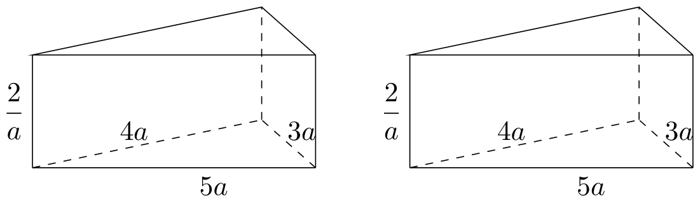
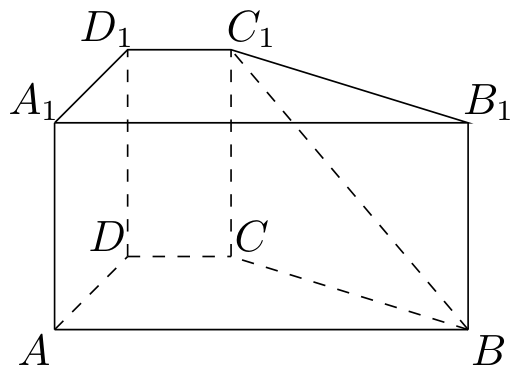
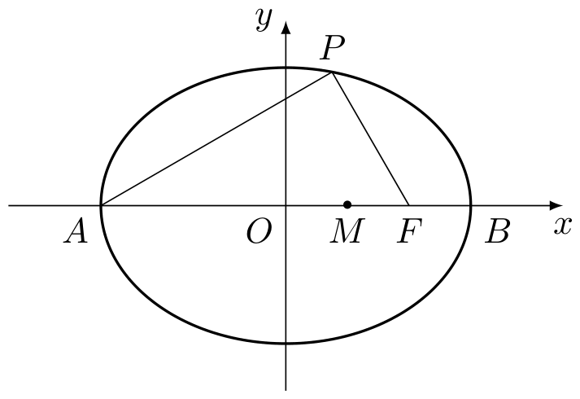

# 2005年上海卷（秋理）

## 填空题

### 第 1 题

函数 $f(x)=\log_{4}(x+1)$ 的反函数 $f^{-1}(x)=$＿＿＿＿＿＿.

#### 答案

$4^x-1$

#### 解析

令 $y=f(x)=\log_{4}(x+1)$，则 $x+1=4^y$，从而 $x=4^y-1$. 交换 $x$，$y$ 的位置，得到反函数为 $f^{-1}(x)=4^x-1$.

### 第 2 题

方程 $4^{x} + 2^{x} - 2 = 0$ 的解是＿＿＿＿＿＿.

#### 答案

$x=0$

#### 解析

令 $t=2^x$，则 $t>0$，且 $4^x=t^2$. 原方程化为 $t^2+t-2=0$，即 $(t-1)(t+2)=0$. 由于 $t>0$，只能取 $t=1$，所以 $2^x=1$，解得 $x=0$.

### 第 3 题

直角坐标平面 $xOy$ 中，若定点 $A(1,2)$ 与动点 $P(x,y)$ 满足 $\overrightarrow{OP} \cdot \overrightarrow{OA} = 4$，则点 $P$ 的轨迹方程是＿＿＿＿＿＿.

#### 答案

$x+2y-4=0$

#### 解析

由 $\overrightarrow{OP}=(x,y)$，$\overrightarrow{OA}=(1,2)$，得 $\overrightarrow{OP}\cdot\overrightarrow{OA}=x+2y$. 由题设 $x+2y=4$，所以点 $P$ 的轨迹方程为 $x+2y-4=0$.

### 第 4 题

在 $(x - a)^10$ 的展开式中，$x^7$ 的系数是 $15$，则实数 $a =$＿＿＿＿＿＿.

#### 答案

$-\frac{1}{2}$

#### 解析

在 $(x-a)^{10}$ 的展开式中，含 $x^7$ 的项取 $x^{7}$ 与 $(-a)^3$，故其系数为 $\mathrm C_{10}^{3}(-a)^3=-120a^3$. 由题设 $-120a^3=15$，得 $a^3=-\frac18$. 因为 $a$ 为实数，所以 $a=-\frac12$.

### 第 5 题

若双曲线的渐近线方程为 $y = \pm 3x$，它的一个焦点是 $(\sqrt{10}, 0)$，则双曲线的方程是＿＿＿＿＿＿.

#### 答案

$x^2-\frac{y^2}{9}=1$

#### 解析

设双曲线的标准方程为 $\dfrac{x^2}{a^2}-\dfrac{y^2}{b^2}=1$，其中 $a>0$，$b>0$. 其渐近线为 $y=\pm\dfrac ba x$，所以 $\dfrac ba=3$，即 $b=3a$. 焦点横坐标满足 $c^2=a^2+b^2$，由焦点为 $(\sqrt{10},0)$ 得 $a^2+b^2=10$. 代入 $b=3a$，得 $10a^2=10$，故 $a=1$，$b=3$. 因此双曲线方程为 $x^2-\dfrac{y^2}{9}=1$.

### 第 6 题

将参数方程

$$

\begin{cases}
x=1+2\cos\theta,\\
y=2\sin\theta,
\end{cases}

$$

（$\theta$ 为参数）化为普通方程，所得方程是＿＿＿＿＿＿.

#### 答案

$(x-1)^2+y^2=4$

#### 解析

由参数方程得 $x-1=2\cos\theta$，$y=2\sin\theta$. 两式平方后相加，得 $(x-1)^2+y^2=4(\cos^2\theta+\sin^2\theta)=4$. 反之，满足该方程的点可写成 $x-1=2\cos\theta$，$y=2\sin\theta$，故普通方程为 $(x-1)^2+y^2=4$.

### 第 7 题

计算： $\displaystyle\lim_{n\to\infty}\frac{3^{n+1}-2^{n}}{3^{n}+2^{n-1}}=$＿＿＿＿＿＿.

#### 答案

$3$

#### 解析

分子、分母同除以 $3^n$，得

$$

\lim_{n\to\infty}\frac{3-\left(\frac23\right)^n}{1+\frac12\left(\frac23\right)^n}

$$

由于 $0<\frac23<1$，所以 $\left(\frac23\right)^n\to0$，从而原极限为 $\dfrac{3}{1}=3$.

### 第 8 题

某班有 $50$ 名学生. 其中 $15$ 人选修 $A$ 课程，另外 $35$ 人选修 $B$ 课程. 从班级中任选两名学生，他们是选修不同课程的学生的概率是＿＿＿＿＿＿. （结果用分数表示）

#### 答案

$\frac{3}{7}$

#### 解析

从 $50$ 名学生中任选两人的总数为 $\mathrm C_{50}^{2}$. 选到不同课程学生的情形是选 $A$ 课程学生一人、选 $B$ 课程学生一人，共有 $15\times35$ 种. 因此所求概率为

$$

\frac{15\times35}{\mathrm C_{50}^{2}}=\frac{525}{1225}=\frac37

$$

### 第 9 题

在 $\triangle ABC$ 中，若 $A = 120^{\circ}$，$AB = 5$，$BC = 7$，则 $\triangle ABC$ 的面积 $S =$＿＿＿＿＿＿.

#### 答案

$\frac{15\sqrt{3}}{4}$

#### 解析

设 $AC=b$. 由余弦定理，$BC^2=AB^2+AC^2-2AB\cdot AC\cos A$，所以 $49=25+b^2-10b\cos120^{\circ}=25+b^2+5b$. 整理得 $b^2+5b-24=0$，即 $(b-3)(b+8)=0$. 因为 $b>0$，所以 $AC=3$. 因此

$$

S=\frac12 AB\cdot AC\sin A=\frac12\times5\times3\times\frac{\sqrt3}{2}=\frac{15\sqrt3}{4}

$$

### 第 10 题

函数 $f(x) = \sin x + 2|\sin x|$，$x \in [0, 2\pi]$ 的图象与直线 $y = k$ 有且仅有两个不同的交点，则 $k$ 的取值范围是＿＿＿＿＿＿.

#### 答案

$1<k<3$

#### 解析

当 $x\in[0,\pi]$ 时，$\sin x\geqslant0$，故 $f(x)=3\sin x$，其值域为 $[0,3]$；当 $x\in[\pi,2\pi]$ 时，$\sin x\leqslant0$，故 $f(x)=-\sin x$，其值域为 $[0,1]$. 对 $0<k<1$，方程 $3\sin x=k$ 在 $(0,\pi)$ 内有两个解，方程 $-\sin x=k$ 在 $(\pi,2\pi)$ 内也有两个解，共有四个交点；$k=1$ 时前一方程有两个解，后一方程只有 $x=\dfrac{3\pi}{2}$ 一个解，共有三个交点；$1<k<3$ 时只有 $3\sin x=k$ 有两个解，所以恰有两个交点；$k=3$ 时只有 $x=\dfrac{\pi}{2}$ 一个交点；$k=0$ 时交点为 $x=0$，$\pi$，$2\pi$，共有三个；$k<0$ 或 $k>3$ 时没有交点. 因此所求范围为 $1<k<3$.

### 第 11 题

有两个相同的直三棱柱，高为 $\frac{2}{a}$，底面三角形的三边长分别为 $3a$，$4a$，$5a$（$a > 0$）. 用它们拼成一个三棱柱或四棱柱，在所有可能的情形中，全面积最小的是一个四棱柱，则 $a$ 的取值范围是＿＿＿＿＿＿.

#### 答案

$0<a<\frac{\sqrt{15}}{3}$

#### 解析

底面直角三角形的面积为 $\dfrac12\cdot3a\cdot4a=6a^2$，周长为 $3a+4a+5a=12a$，每个棱柱的高为 $\dfrac2a$. 若两个棱柱以三角形底面相接，所得仍为三棱柱，其高为 $\dfrac4a$，全面积为

$$

S_{3}=2\times6a^2+12a\times\frac4a=12a^2+48

$$

若以矩形侧面相接，所得为四棱柱. 沿边长 $3a$，$4a$，$5a$ 的侧面相接时，四棱柱底面的周长分别为 $18a$，$16a$，$14a$，底面面积均为 $12a^2$. 因此三种四棱柱的全面积分别为 $24a^2+36$，$24a^2+32$，$24a^2+28$，其中最小值为

$$

S_{4}=24a^2+28

$$

题设说明所有可能情形中全面积最小的是四棱柱，所以 $S_4<S_3$，即 $24a^2+28<12a^2+48$. 整理得 $a^2<\dfrac53$. 结合 $a>0$，得到 $0<a<\dfrac{\sqrt{15}}3$.

### 第 12 题

用 $n$ 个不同的实数 $a_1$，$a_2$，$\cdots$，$a_n$ 可得到 $n!$ 个不同的排列，每个排列为一行写成一个 $n!$ 行的数阵. 对第 $i$ 行 $a_{i1}$，$a_{i2}$，$\cdots$，$a_{in}$，记 $b_i = -a_{i1} + 2a_{i2} - 3a_{i3} + \cdots + (-1)^n na_{in}$，$i = 1$，$2$，$3$，$\cdots$，$n!$. 例如：用 $1$，$2$，$3$ 可得数阵如图，由于此数阵中每一列各数之和都是 $12$，所以，$b_1 + b_2 + \cdots + b_6 = -12 + 2 \times 12 - 3 \times 12 = -24$. 那么，在用 $1$，$2$，$3$，$4$，$5$ 形成的数阵中，$b_1 + b_2 + \cdots + b_{120} =\underline{\qquad\qquad}$.

|       |       |       |
|:-----:|:-----:|:-----:|
| $1$ | $2$ | $3$ |
| $1$ | $3$ | $2$ |
| $2$ | $1$ | $3$ |
| $2$ | $3$ | $1$ |
| $3$ | $1$ | $2$ |
| $3$ | $2$ | $1$ |

#### 答案

$-1080$

#### 解析

在由 $1$，$2$，$3$，$4$，$5$ 组成的全部排列中，每个数在每一列均出现 $4!=24$ 次，所以每一列的数之和都是 $24(1+2+3+4+5)=360$. 因此

$$

b_1+\cdots+b_{120}=(-1+2-3+4-5)\times360=-3\times360=-1080

$$

## 单选题

### 第 13 题

若函数 $f(x) = \frac{1}{2^x + 1}$，则该函数在 $(- \infty, +\infty)$ 上是（）

A.  
单调递减无最小值

B.  
单调递减有最小值

C.  
单调递增无最大值

D.  
单调递增有最大值

#### 答案

A

#### 解析

对 $f(x)=\dfrac1{2^x+1}$ 求导，得 $f'(x)=-\dfrac{2^x\ln2}{(2^x+1)^2}<0$，所以函数在 $\mathbb{R}$ 上单调递减. 又 $\lim_{x\to+\infty}f(x)=0$，但对任意有限的 $x$ 都有 $f(x)>0$，故函数没有最小值. 所以选 A.

### 第 14 题

已知集合 $M = \{x \mid |x - 1| \leqslant 2, x \in \mathbb{R}\}$，$P = \left\{x \mid \frac{5}{x + 1} \geqslant 1, x \in \mathbb{Z}\right\}$，则 $M \cap P$ 等于（）

A.  
$\{x\mid 0 < x\leqslant 3,x\in \mathbb{Z}\}$

B.  
$\{x\mid 0\leqslant x\leqslant 3,x\in \mathbb{Z}\}$

C.  
$\{x\mid -1\leqslant x\leqslant 0,x\in \mathbb{Z}\}$

D.  
$\{x\mid -1\leqslant x < 0,x\in \mathbb{Z}\}$

#### 答案

B

#### 解析

由 $\lvert x-1\rvert\leqslant2$，得 $-1\leqslant x\leqslant3$. 对集合 $P$，因 $x\neq-1$，不等式等价于 $\dfrac{4-x}{x+1}\geqslant0$，故 $-1<x\leqslant4$. 结合 $x\in\mathbb{Z}$，得 $P=\{0,1,2,3,4\}$. 所以

$$

M\cap P=\{0,1,2,3\}=\{x\mid0\leqslant x\leqslant3,\ x\in\mathbb{Z}\}

$$

故选 B.

### 第 15 题

过抛物线 $y^{2}=4x$ 的焦点作一条直线与抛物线相交于 $A$，$B$ 两点，它们的横坐标之和等于 $5$，则这样的直线（）

A.  
有且仅有一条

B.  
有且仅有两条

C.  
有无穷多条

D.  
不存在

#### 答案

B

#### 解析

抛物线 $y^2=4x$ 的焦点为 $F(1,0)$. 先考虑非竖直直线，设其方程为 $y=k(x-1)$. 代入抛物线方程，得

$$

k^2(x-1)^2=4x

$$

即 $k^2x^2-(2k^2+4)x+k^2=0$. 当交点为 $A$，$B$ 时，由韦达定理，横坐标之和为 $2+\dfrac4{k^2}$. 令其等于 $5$，得 $k^2=\dfrac43$，从而 $k=\pm\dfrac2{\sqrt3}$，对应两条直线，且两交点不同. 竖直直线 $x=1$ 与抛物线交点的横坐标之和为 $2$，不符合条件. 因此这样的直线有且仅有两条，选 B.

### 第 16 题

设定义域为 $\mathbb{R}$ 的函数

$$

f(x) = \begin{cases}
|\lg |x - 1||, & x \neq 1,\\
0, & x = 1,
\end{cases}

$$

则关于 $x$ 的方程 $f^2(x) + bf(x) + c = 0$ 有 $7$ 个不同实数解的充要条件是（）

A.  
$b < 0$ 且 $c > 0$

B.  
$b > 0$ 且 $c < 0$

C.  
$b < 0$ 且 $c = 0$

D.  
$b \geqslant 0$ 且 $c = 0$

#### 答案

C

#### 解析

令 $t=f(x)$. 当 $t>0$ 时，$\lvert\lg\lvert x-1\rvert\rvert=t$ 等价于 $\lvert x-1\rvert=10^t$ 或 $\lvert x-1\rvert=10^{-t}$，每种情形各有两个实数解，所以每个正根 $t$ 对应四个不同的 $x$. 当 $t=0$ 时，除分段定义给出的 $x=1$ 外，$\lvert x-1\rvert=1$ 给出 $x=0$，$2$，共三个不同的 $x$；当 $t<0$ 时没有对应的 $x$.

因此方程 $t^2+bt+c=0$ 要有七个不同的 $x$ 解，必须且只需有一个正根和根 $t=0$，因为 $4+3=7$. 这等价于 $c=0$，且另一个根 $-b$ 为正数，即 $b<0$. 反之，若 $b<0$，$c=0$，两根为 $0$，$-b>0$，确实产生 $3+4=7$ 个不同实数解. 所以选 C.

## 解答题

### 第 17 题

如图，已知直四棱柱 $ABCD - A_{1}B_{1}C_{1}D_{1}$ 中，$AA_{1} = 2$. 底面 $ABCD$ 是直角梯形，$\angle A$ 是直角，$AB \parallel CD$，$AB = 4$，$AD = 2$，$DC = 1$，求异面直线 $BC_{1}$ 与 $DC$ 所成角的大小. （结果用反三角函数值表示）

#### 解析

建立空间直角坐标系，使原点为 $A$，$x$ 轴沿 $AB$ 方向，$y$ 轴沿 $AD$ 方向，$z$ 轴沿 $AA_{1}$ 方向. 由题意可得 $A(0,0,0)$，$B(4,0,0)$，$D(0,2,0)$，$C(1,2,0)$，$C_{1}(1,2,2)$.

因此 $\overrightarrow{BC_{1}}=(-3,2,2)$，$\overrightarrow{DC}=(1,0,0)$. 异面直线所成的角取两方向向量所成的锐角，设其为 $\theta$，则

$$

\cos\theta=\frac{\left|\overrightarrow{BC_{1}}\cdot\overrightarrow{DC}\right|}{\left|\overrightarrow{BC_{1}}\right|\left|\overrightarrow{DC}\right|}
=\frac{3}{\sqrt{17}}=\frac{3\sqrt{17}}{17}

$$

所以所求角为 $\arccos\dfrac{3\sqrt{17}}{17}$.

### 第 18 题

证明：在复数范围内，方程 $|z|^2 + (1 - \i)\overline{z} - (1 + \i)z = \frac{5 - 5\i}{2 + \i}$ （$\i$ 为虚数单位）无解.

#### 解析

设 $z=x+y\i$，其中 $x$，$y\in\mathbb{R}$，则 $\overline{z}=x-y\i$，且 $|z|^2=x^2+y^2$. 先化简等式右端：

$$

\frac{5-5\i}{2+\i}=\frac{(5-5\i)(2-\i)}{(2+\i)(2-\i)}=1-3\i

$$

另一方面，

$$

(1-\i)\overline{z}-(1+\i)z=-2(x+y)\i

$$

原方程因而等价于

$$

x^2+y^2-2(x+y)\i=1-3\i

$$

比较实部和虚部，得到 $x^2+y^2=1$，$x+y=\frac{3}{2}$. 但由基本不等式

$$

(x+y)^2\leqslant 2(x^2+y^2)=2

$$

而 $(x+y)^2=\dfrac{9}{4}>2$，矛盾. 因此不存在满足条件的实数 $x$，$y$，原方程在复数范围内无解.

### 第 19 题

如图，点 $A$，$B$ 分别是椭圆 $\frac{x^{2}}{36} + \frac{y^{2}}{20} = 1$ 长轴的左，右端点，点 $F$ 是椭圆的右焦点，点 $P$ 在椭圆上，且位于 $x$ 轴上方，$PA \perp PF$.

1.  求点 $P$ 的坐标；

2.  设 $M$ 是椭圆长轴 $AB$ 上的一点，$M$ 到直线 $AP$ 的距离等于 $|MB|$，求椭圆上的点到点 $M$ 的距离 $d$ 的最小值.

#### 解析

1.  椭圆的长半轴、短半轴分别为 $6$，$2\sqrt{5}$，所以 $c=\sqrt{6^2-(2\sqrt{5})^2}=4$. 从而 $A(-6,0)$，$B(6,0)$，$F(4,0)$. 设 $P(x,y)$，由 $P$ 在椭圆上及 $PA\perp PF$，有 $\frac{x^2}{36}+\frac{y^2}{20}=1$，$\overrightarrow{PA}\cdot\overrightarrow{PF}=0$. 其中 $\overrightarrow{PA}=(-6-x,-y)$，$\overrightarrow{PF}=(4-x,-y)$. 故

$$

(-6-x)(4-x)+y^2=0

$$

    由椭圆方程 $y^2=20-\dfrac{5}{9}x^2$，代入得

$$

x^2+2x-24+20-\frac{5}{9}x^2=0

$$

    即

$$

2x^2+9x-18=0

$$

    解得 $x=\dfrac{3}{2}$ 或 $x=-6$. 当 $x=-6$ 时 $y=0$，不满足点 $P$ 位于 $x$ 轴上方，所以 $x=\dfrac{3}{2}$. 于是

$$

y^2=20\left(1-\frac{(3/2)^2}{36}\right)=\frac{75}{4}

$$

    因为 $y>0$，所以

$$

P\left(\frac{3}{2},\frac{5\sqrt{3}}{2}\right)

$$

2.  设 $M=(m,0)$，其中 $-6\leqslant m\leqslant6$. 由上问，直线 $AP$ 的斜率为

$$

\frac{5\sqrt{3}/2}{15/2}=\frac{\sqrt{3}}{3}

$$

    所以直线 $AP$ 的方程为

$$

\sqrt{3}x-3y+6\sqrt{3}=0

$$

    点 $M$ 到直线 $AP$ 的距离为

$$

\frac{|\sqrt{3}m+6\sqrt{3}|}{\sqrt{3+9}}=\frac{m+6}{2}

$$

    而 $|MB|=6-m$. 由题设

$$

\frac{m+6}{2}=6-m

$$

    解得 $m=2$，即 $M=(2,0)$.

    设椭圆上任意一点为 $Q(x,y)$，则

$$

d^2=MQ^2=(x-2)^2+y^2

$$

    利用 $y^2=20-\dfrac{5}{9}x^2$，且 $-6\leqslant x\leqslant6$，得

$$

d^2=(x-2)^2+20-\frac{5}{9}x^2
    =\frac{4}{9}x^2-4x+24
    =\frac{4}{9}\left(x-\frac{9}{2}\right)^2+15\geqslant15

$$

    当 $x=\dfrac{9}{2}$ 时该点在椭圆上，等号可以取得，所以 $d$ 的最小值为 $\sqrt{15}$.

### 第 20 题

假设某市 $2004$ 年新建住房面积 $400$ 万平方米，其中有 $250$ 万平方米是中低价房. 预计在今后的若干年内，该市每年新建住房面积平均比上一年增长 $8\%$. 另外，每年新建住房中，中低价房的面积均比上一年增加 $50$ 万平方米. 那么，到哪一年底，

1.  该市历年所建中低价房的累计面积（以 $2004$ 年为累计的第一年）将首次不少于 $4750$ 万平方米？

2.  当年建造的中低价房的面积占该年建造住房面积的比例首次大于 $85\%$？

#### 解析

设 $n$ 表示从 $2004$ 年起的第 $n$ 年，则 $2004$ 年对应 $n=1$. 第 $n$ 年新建住房总面积和中低价房面积分别为 $T_n=400(1.08)^{n-1}$，$L_n=250+50(n-1)=50(n+4)$. 单位均为万平方米.

1.  前 $n$ 年中低价房的累计面积为

$$

S_n=\sum_{k=1}^{n}L_k=\frac{n}{2}\bigl(250+50(n+4)\bigr)=25n(n+9)

$$

    要求 $S_n\geqslant4750$，即

$$

n(n+9)\geqslant190

$$

    由于 $n$ 为正整数，且 $25\times9\times18=4050<4750$，$25\times10\times19=4750$， 所以最小的 $n$ 为 $10$. 对应年份为 $2004+10-1=2013$，即到 $2013$ 年底首次达到条件.

2.  记第 $n$ 年中低价房所占比例为

$$

r_n=\frac{L_n}{T_n}=\frac{n+4}{8(1.08)^{n-1}}

$$

    当 $1\leqslant n\leqslant8$ 时，

$$

\frac{r_{n+1}}{r_n}=\frac{n+5}{1.08(n+4)}=\frac{25(n+5)}{27(n+4)}>1

$$

    所以 $r_n$ 在前 $9$ 年递增. 计算得

$$

r_5=\frac{450}{400(1.08)^4}=\frac{3515625}{4251528}<\frac{17}{20}=0.85

$$

    而

$$

r_6=\frac{500}{400(1.08)^5}=\frac{48828125}{57395628}>\frac{17}{20}=0.85

$$

    因此首次满足比例大于 $85\%$ 的年份对应 $n=6$，即 $2004+6-1=2009$ 年底.

### 第 21 题

对定义域是 $D_f$，$D_g$ 的函数 $y = f(x)$，$y = g(x)$，规定：函数

$$

h(x) = \begin{cases}
f(x)g(x), & \text{当 } x \in D_f \text{且} x \in D_g,\\
f(x), & \text{当 } x \in D_f \text{且} x \notin D_g,\\
g(x), & \text{当 } x \notin D_f \text{且} x \in D_g.
\end{cases}

$$

1.  若函数 $f(x) = \frac{1}{x - 1}$，$g(x) = x^2$，写出函数 $h(x)$ 的解析式；

2.  求问题（1）中函数 $h(x)$ 的值域；

3.  若 $g(x) = f(x + \alpha)$，其中 $\alpha$ 是常数，且 $\alpha \in [0, \pi]$，请设计一个定义域为 $\mathbb{R}$ 的函数 $y = f(x)$，及一个 $\alpha$ 的值，使得 $h(x) = \cos 4x$，并予以证明.

#### 解析

1.  由 $f(x)=\dfrac{1}{x-1}$ 可知 $D_f=\{x\in\mathbb{R}\mid x\neq1\}$，而 $g(x)=x^2$ 的定义域为 $D_g=\mathbb{R}$. 因而

$$

h(x)=\begin{cases}
    \dfrac{x^2}{x-1},&x\in(-\infty,1)\cup(1,+\infty),\\
    1,&x=1.
    \end{cases}

$$

2.  当 $x\neq1$ 时，令 $y=\dfrac{x^2}{x-1}$，则 $x$ 满足

$$

x^2-yx+y=0

$$

    这个关于 $x$ 的一元二次方程有实根的充要条件为

$$

\Delta=y^2-4y=y(y-4)\geqslant0

$$

    即 $y\leqslant0$ 或 $y\geqslant4$. 反之，对任意满足上述条件的 $y$，方程都有实根，且 $x=1$ 代入左端得 $1\neq0$，所以所得实根均符合 $x\neq1$. 当 $x=1$ 时，$h(1)=1$. 因此函数 $h(x)$ 的值域为

$$

(-\infty,0]\cup\{1\}\cup[4,+\infty)

$$

3.  取 $f(x)=\sin2x+\cos2x$，$\alpha=\frac{\pi}{4}$. 此时 $D_f=D_g=\mathbb{R}$，且

$$

g(x)=f\left(x+\frac{\pi}{4}\right)
    =\sin\left(2x+\frac{\pi}{2}\right)+\cos\left(2x+\frac{\pi}{2}\right)
    =\cos2x-\sin2x

$$

    因此对任意 $x\in\mathbb{R}$，

$$

h(x)=f(x)g(x)=(\sin2x+\cos2x)(\cos2x-\sin2x)=\cos4x

$$

    又 $\alpha=\dfrac{\pi}{4}\in[0,\pi]$，故构造满足题设.

### 第 22 题

在直角坐标平面中，已知点 $P_{1}(1,2)$，$P_{2}(2,2^{2})$，$P_{3}(3,2^{3})$，$\cdots$，$P_{n}(n,2^{n})$，其中 $n$ 是正整数，对平面上任一点 $A_{0}$，记 $A_{1}$ 为 $A_{0}$ 关于点 $P_{1}$ 的对称点，$A_{2}$ 为 $A_{1}$ 关于点 $P_{2}$ 的对称点，$\cdots$，$A_{n}$ 为 $A_{n-1}$ 关于点 $P_{n}$ 的对称点.

1.  求向量 $\overrightarrow{A_{0}A_{2}}$ 的坐标；

2.  当点 $A_{0}$ 在曲线 $C$ 上移动时，点 $A_{2}$ 的轨迹是函数 $y = f(x)$ 的图象，其中 $f(x)$ 是以 3 为周期的周期函数，且当 $x \in (0,3]$ 时，$f(x) = \lg x$. 求以曲线 $C$ 为图象的函数在 $(1,4]$ 上的解析式；

3.  对任意偶数 $n$，用 $n$ 表示向量 $\overrightarrow{A_{0}A_{n}}$ 的坐标.

#### 解析

1.  关于点 $P_k$ 的中心对称满足 $A_k=2P_k-A_{k-1}$. 因而 $A_1=2P_1-A_0$，$A_2=2P_2-A_1=A_0+2(P_2-P_1)$. 由于 $P_1=(1,2)$，$P_2=(2,4)$，所以

$$

\overrightarrow{A_0A_2}=A_2-A_0=2(P_2-P_1)=(2,4)

$$

2.  设 $A_0=(u,v)$ 在曲线 $C$ 上，则由（1）可知 $A_2=(u+2,v+4)$. 记 $A_2=(x,y)$，则 $u=x-2$，$v=y-4$. 因为点 $A_2$ 的轨迹是 $y=f(x)$，所以曲线 $C$ 上横坐标为 $x$ 的点的纵坐标为

$$

f(x+2)-4

$$

    当 $x\in(1,4]$ 时，$x+2\in(3,6]$，利用 $f(x)$ 的周期为 $3$，有

$$

f(x+2)=f(x-1)=\lg(x-1)

$$

    其中 $x-1\in(0,3]$. 因此，以曲线 $C$ 为图象的函数在 $(1,4]$ 上的解析式为

$$

y=\lg(x-1)-4

$$

3.  递推式 $A_k=2P_k-A_{k-1}$ 展开可得

$$

A_n=(-1)^nA_0+2\sum_{k=1}^{n}(-1)^{n-k}P_k

$$

    当 $n$ 为偶数时，

$$

\overrightarrow{A_0A_n}=A_n-A_0=2\sum_{k=1}^{n}(-1)^kP_k

$$

    由 $P_k=(k,2^k)$，分别计算两个坐标：

$$

2\sum_{k=1}^{n}(-1)^k k
    =2\bigl((-1+2)+(-3+4)+\cdots+(-(n-1)+n)\bigr)=n

$$

    以及

$$

2\sum_{k=1}^{n}(-1)^k2^k
    =2\bigl((-2+4)+(-8+16)+\cdots+(-2^{n-1}+2^n)\bigr)
    =2\sum_{j=1}^{n/2}2^{2j-1}
    =\frac{4(2^n-1)}{3}

$$

    所以

$$

\overrightarrow{A_0A_n}=\left(n,\frac{4(2^n-1)}{3}\right)

$$

