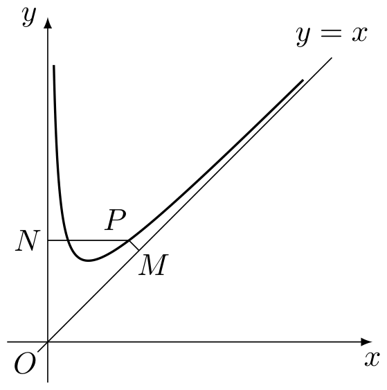
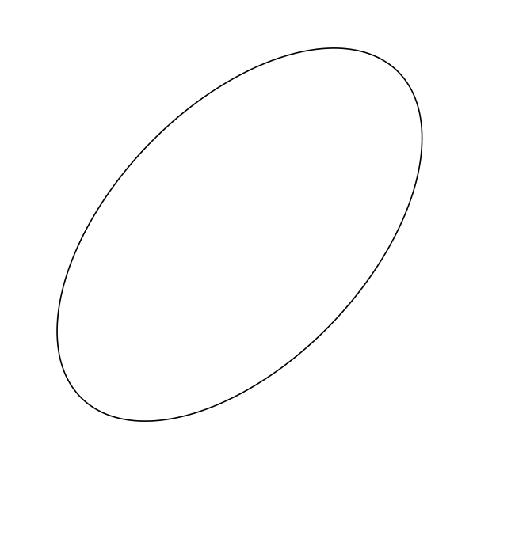

# 2005年上海卷（春）

## 填空题

### 第 1 题

方程 $\lg x^{2}-\lg(x+2)=0$ 的解集是＿＿＿＿＿＿.

#### 答案

$\{-1,2\}$

#### 解析

由对数的定义域，得 $x^{2}>0$ 且 $x+2>0$，所以 $x>-2$ 且 $x\neq0$. 原方程等价于 $\lg\dfrac{x^{2}}{x+2}=0$，从而 $\dfrac{x^{2}}{x+2}=1$，即 $x^{2}-x-2=0$. 因此 $x=2$ 或 $x=-1$，两根都满足定义域条件，故解集为 $\{-1,2\}$.

### 第 2 题

$\displaystyle\lim_{n\to \infty}\frac{n + 2}{1 + 2 + \cdots + n} =$＿＿＿＿＿＿.

#### 答案

0

#### 解析

因为 $1+2+\cdots+n=\dfrac{n(n+1)}{2}$，所以 $\displaystyle\frac{n+2}{1+2+\cdots+n}=\frac{2(n+2)}{n(n+1)}=\frac{2(1+2/n)}{n+1}$. 当 $n\to\infty$ 时，分子趋于 $2$，分母趋于 $+\infty$，故极限为 $0$.

### 第 3 题

若 $\cos \alpha = \frac{3}{5}$，且 $\alpha \in \left(0, \frac{\pi}{2}\right)$，则 $\tan \frac{\alpha}{2} =$＿＿＿＿＿＿.

#### 答案

$\dfrac{1}{2}$

#### 解析

由于 $\alpha\in\left(0,\dfrac{\pi}{2}\right)$，$\sin\alpha>0$，所以 $\sin\alpha=\sqrt{1-\cos^{2}\alpha}=\dfrac45$. 又由半角公式， $\displaystyle\tan\frac\alpha2=\frac{\sin\alpha}{1+\cos\alpha}=\frac{4/5}{1+3/5}=\frac12$.

### 第 4 题

函数 $f(x) = -x^{2}$（$x \in (-\infty, -2]$）的反函数 $f^{-1}(x) =$＿＿＿＿＿＿.

#### 答案

$f^{-1}(x)=-\sqrt{-x}$（$x\leqslant-4$）

#### 解析

由 $y=-x^{2}$ 且 $x\leqslant-2$，可知值域为 $y\leqslant-4$. 交换 $x$，$y$ 得 $x=-y^{2}$，即 $y^{2}=-x$. 因为原函数的自变量满足 $y\leqslant-2$，所以应取负平方根，得到 $y=-\sqrt{-x}$，且 $x\leqslant-4$. 因此 $f^{-1}(x)=-\sqrt{-x}$（$x\leqslant-4$）.

### 第 5 题

在 $\triangle ABC$ 中，若 $\angle C = 90^{\circ}$，$AC = BC = 4$，则 $\overrightarrow{BA} \cdot \overrightarrow{BC} =$＿＿＿＿＿＿.

#### 答案

16

#### 解析

取直角坐标系使 $C=(0,0)$，$A=(4,0)$，$B=(0,4)$. 则 $\overrightarrow{BA}=A-B=(4,-4)$，$\overrightarrow{BC}=C-B=(0,-4)$，从而 $\overrightarrow{BA}\cdot\overrightarrow{BC}=4\times0+(-4)\times(-4)=16$.

### 第 6 题

某班共有 $40$ 名学生，其中只有一对双胞胎，若从中一次随机抽查三位学生的作业，则这对双胞胎的作业同时被抽中的概率是＿＿＿＿＿＿. （结果用最简分数表示）

#### 答案

$\dfrac{1}{260}$

#### 解析

从 $40$ 名学生中抽取三人，共有 $\mathrm C_{40}^{3}$ 种等可能结果. 若双胞胎同时被抽中，第三人可从其余 $38$ 人中任选，有 $\mathrm C_{38}^{1}$ 种结果. 因此所求概率为 $\displaystyle\frac{\mathrm C_{38}^{1}}{\mathrm C_{40}^{3}}=\frac{38}{40\times39\times38/6}=\frac{1}{260}$.

### 第 7 题

双曲线 $9x^{2}-16y^{2}=1$ 的焦距是＿＿＿＿＿＿.

#### 答案

$\dfrac{5}{6}$

#### 解析

将方程化为 $\displaystyle\frac{x^{2}}{1/9}-\frac{y^{2}}{1/16}=1$，所以 $a=\dfrac13$，$b=\dfrac14$. 双曲线的焦半距参数满足 $c^{2}=a^{2}+b^{2}$，因此 $\displaystyle c=\sqrt{\frac19+\frac1{16}}=\sqrt{\frac{25}{144}}=\frac5{12}$. 焦距是两焦点间的距离 $2c$，故焦距为 $\dfrac56$.

### 第 8 题

若 $(x+2)^{n}=x^{n}+\cdots+ax^{3}+bx^{2}+cx+2^{n}$（$n\in\mathbb{N}$，$n\geqslant3$），且 $a:b=3:2$，则 $n=$＿＿＿＿＿＿.

#### 答案

11

#### 解析

二项式展开式中，$x^{3}$ 的系数为 $a=\mathrm C_{n}^{3}2^{n-3}$，$x^{2}$ 的系数为 $b=\mathrm C_{n}^{2}2^{n-2}$. 因而 $\displaystyle\frac{a}{b}=\frac{\mathrm C_{n}^{3}2^{n-3}}{\mathrm C_{n}^{2}2^{n-2}}=\frac{n-2}{6}$. 由 $a:b=3:2$，得 $\dfrac{n-2}{6}=\dfrac{3}{2}$，所以 $n=11$.

### 第 9 题

设数列 $\{a_n\}$ 的前 $n$ 项和为 $S_{n}$（$n \in \mathbb{N}$）.关于数列 $\{a_n\}$ 有下列三个命题：

1.  若 $\{a_{n}\}$ 既是等差数列又是等比数列，则 $a_{n} = a_{n + 1}$（$n \in \mathbb{N}$）；

2.  若 $S_{n} = an^{2} + bn$（$a$，$b \in \mathbb{R}$），则 $\{a_{n}\}$ 是等差数列；

3.  若 $S_{n} = 1 - (-1)^{n}$，则 $\{a_{n}\}$ 是等比数列.

这些命题中，真命题的序号是＿＿＿＿＿＿.

#### 答案

$\textcircled{1}\textcircled{2}\textcircled{3}$

#### 解析

设首项为 $a_1$，公差为 $d$. 若 $a_1=0$，因为它同时是等比数列，$a_2=a_1q=0$，从而各项均为 $0$，命题$\textcircled{1}$成立. 若 $a_1\neq0$，等差数列和等比数列的前三项分别满足 $a_2=a_1+d$，$a_3=a_1+2d$ 以及 $a_2^2=a_1a_3$. 因此 $(a_1+d)^2=a_1(a_1+2d)$，化简得 $d^2=0$，即 $d=0$. 此时各项相等，故命题$\textcircled{1}$正确.

令 $a_0=0$. 由 $S_n=an^{2}+bn$，对 $n\in\mathbb{N}$ 有

$$

a_n=S_n-S_{n-1}=an^2+bn-\bigl(a(n-1)^2+b(n-1)\bigr)=a(2n-1)+b

$$

这是关于 $n$ 的一次式，相邻两项之差恒为 $2a$，所以 $\{a_n\}$ 是等差数列，命题$\textcircled{2}$正确.

由 $S_n=1-(-1)^n$，并令 $S_0=0$，得 $a_n=S_n-S_{n-1}=2(-1)^{n+1}$. 于是 $\displaystyle\frac{a_{n+1}}{a_n}=-1$，各项均非零，故 $\{a_n\}$ 是等比数列，命题$\textcircled{3}$正确. 因此真命题的序号是 $\textcircled{1}$，$\textcircled{2}$，$\textcircled{3}$.

### 第 10 题

若集合 $A = \{x \mid 3\cos 2\pi x = 3^x, x \in \mathbb{R}\}$，集合 $B = \{y \mid y^2 = 1, y \in \mathbb{R}\}$，则 $A \cap B =\underline{\qquad\qquad}$.

#### 答案

$\{1\}$

#### 解析

由 $y^{2}=1$ 且 $y\in\mathbb{R}$，得 $B=\{-1,1\}$. 当 $x=-1$ 时，$3\cos(-2\pi)=3$，而 $3^{-1}=\dfrac{1}{3}$，不满足方程；当 $x=1$ 时，$3\cos(2\pi)=3=3^{1}$，满足方程. 所以 $A\cap B=\{1\}$.

### 第 11 题

函数 $y = \sin x + \arcsin x$ 的值域是＿＿＿＿＿＿.

#### 答案

$\left[-\dfrac{\pi}{2}-\sin1,\dfrac{\pi}{2}+\sin1\right]$

#### 解析

函数的定义域由 $\arcsin x$ 确定为 $[-1,1]$. 在 $[-1,1]$ 上，$\sin x$ 严格递增，$\arcsin x$ 也严格递增，所以两者之和 $y=\sin x+\arcsin x$ 在该区间上严格递增. 因此 $y(-1)=-\sin1-\dfrac\pi2$ 为最小值， $y(1)=\sin1+\dfrac\pi2$ 为最大值，值域为 $\left[-\dfrac\pi2-\sin1,\dfrac\pi2+\sin1\right]$.

### 第 12 题

已知函数 $f(x) = 2^x + \log_2 x$，数列 $\{a_n\}$ 的通项公式是 $a_n = 0.1n$（$n \in \mathbb{N}$），当 $|f(a_n) - 2005|$ 取得最小值时，$n =$＿＿＿＿＿＿.

#### 答案

110

#### 解析

在 $x>0$ 上， $\displaystyle f'(x)=2^x\ln2+\frac1{x\ln2}>0$，所以 $f$ 严格递增. 由于 $a_n=0.1n$，只需比较 $a_{110}=11$ 与相邻的 $a_{109}=10.9$. 计算得 $f(10.9)=2^{10.9}+\log_2(10.9)\approx1914.30$， $f(11)=2^{11}+\log_2 11\approx2051.46$，于是

$$

2005-f(10.9)\approx90.70>46.46\approx f(11)-2005

$$

因此 $f(11)$ 比 $f(10.9)$ 更接近 $2005$. 对 $n\leqslant109$，由单调性有 $f(a_n)\leqslant f(10.9)<2005$，其距离不小于 $2005-f(10.9)$；对 $n\geqslant111$，有 $f(a_n)\geqslant f(11.1)>f(11)>2005$，其距离大于 $f(11)-2005$. 所以最小值在 $a_{110}=11$ 时取得，故 $n=110$.

## 单选题

### 第 13 题

已知直线 $l$，$m$，$n$ 及平面 $\alpha$，下列命题中的假命题是（）

A.  
若 $l \parallel m$，$m \parallel n$，则 $l \parallel n$

B.  
若 $l \perp \alpha$，$n \parallel \alpha$，则 $l \perp n$

C.  
若 $l \perp m$，$m \parallel n$，则 $l \perp n$

D.  
若 $l \parallel \alpha$，$n \parallel \alpha$，则 $l \parallel n$

#### 答案

D

#### 解析

直线的平行关系具有传递性，所以命题 A 正确；若 $l\perp\alpha$，而 $n\parallel\alpha$，则 $n$ 的方向与平面 $\alpha$ 平行，故 $l\perp n$，命题 B 正确. 直线 $m$ 与 $n$ 平行时，$l\perp m$ 可推出 $l\perp n$，命题 C 正确. 但两条分别平行于同一平面的直线不一定互相平行，例如它们可以有不同方向，故命题 D 错误. 因此假命题为 D.

### 第 14 题

在 $\triangle ABC$ 中，若 $\frac{a}{\cos A} = \frac{b}{\cos B} = \frac{c}{\cos C}$，则 $\triangle ABC$ 是（）

A.  
直角三角形

B.  
等边三角形

C.  
钝角三角形

D.  
等腰直角三角形

#### 答案

B

#### 解析

三角形的角不能为直角，否则相应的余弦为零，题设比值无意义. 若有一个角为钝角，则该角的余弦为负，而另外两个角为锐角、余弦为正；由于 $a$，$b$，$c>0$，三个比值不可能相等. 因而 $A$，$B$，$C$ 均为锐角. 由正弦定理，存在外接圆半径 $R$，使得 $a=2R\sin A$，$b=2R\sin B$，$c=2R\sin C$. 题设等式遂等价于 $\tan A=\tan B=\tan C$. 正切函数在 $\left(0,\dfrac\pi2\right)$ 上严格递增，所以 $A=B=C$. 又 $A+B+C=\pi$，故 $A=B=C=\dfrac\pi3$，三角形为等边三角形，选 B.

### 第 15 题

若 $a$，$b$，$c$ 是常数，则“$a > 0$ 且 $b^2 - 4ac < 0$”是对“任意 $x \in \mathbb{R}$，有 $ax^2 + bx + c > 0$”的（）

A.  
充分不必要条件

B.  
必要不充分条件

C.  
充要条件

D.  
既不充分也不必要条件

#### 答案

A

#### 解析

若 $a>0$ 且 $\Delta=b^{2}-4ac<0$，二次函数的图象开口向上且没有与 $x$ 轴的交点，因此对任意 $x\in\mathbb{R}$，都有 $ax^{2}+bx+c>0$，题设条件是充分条件. 但它不是必要条件. 例如取 $a=0$，$b=0$，$c=1$，则对任意 $x\in\mathbb{R}$ 有 $ax^{2}+bx+c=1>0$，而 $a>0$ 不成立. 因此该条件是充分不必要条件，选 A.

### 第 16 题

设函数 $f(x)$ 的定义域为 $\mathbb{R}$，有下列三个命题：

1.  若存在常数 $M$，使得对任意 $x \in \mathbb{R}$，有 $f(x) \leqslant M$，则 $M$ 是函数 $f(x)$ 的最大值；

2.  若存在 $x_0 \in \mathbb{R}$，使得对任意 $x \in \mathbb{R}$，且 $x \neq x_0$，有 $f(x) < f(x_0)$，则 $f(x_0)$ 是函数 $f(x)$ 的最大值；

3.  若存在 $x_0 \in \mathbb{R}$，使得对任意 $x \in \mathbb{R}$，有 $f(x) \leqslant f(x_0)$，则 $f(x_0)$ 是函数 $f(x)$ 的最小值.

这些命题中，真命题的个数是（）

A.  
$0$ 个

B.  
$1$ 个

C.  
$2$ 个

D.  
$3$ 个

#### 答案

B

#### 解析

第一个命题不正确. 例如取 $f(x)=0$，常数 $M=1$ 满足对任意 $x\in\mathbb{R}$ 有 $f(x)\leqslant M$，但函数的最大值是 $0$，不是 $1$.

第二个命题正确. 当 $x=x_0$ 时有 $f(x)=f(x_0)$；当 $x\neq x_0$ 时题设给出 $f(x)<f(x_0)$. 因而对所有 $x\in\mathbb{R}$ 都有 $f(x)\leqslant f(x_0)$，且等号在 $x=x_0$ 处取得，所以 $f(x_0)$ 是最大值.

第三个命题不正确. 题设不等式恰好说明 $f(x_0)$ 是最大值，而不能说明它是最小值. 例如取 $f(x)=-(x-1)^2$，$x_0=1$，则对任意 $x\in\mathbb{R}$ 有 $f(x)\leqslant f(1)=0$，但函数没有最小值，故 $f(1)$ 不是最小值. 因此只有一个命题为真，选 B.

## 解答题

### 第 17 题

已知 $z$ 是复数，$z + 2\i$，$\frac{z}{2 - \i}$ 均为实数（$\i$ 为虚数单位），且复数 $(z + a\i)^2$ 在复平面上对应的点在第一象限，求实数 $a$ 的取值范围.

#### 解析

设 $z=x+y\i$，其中 $x$，$y\in\mathbb{R}$. 因为 $z+2\i$ 为实数，其虚部为零，所以 $y+2=0$，即 $y=-2$，从而 $z=x-2\i$.

又

$$

\frac{z}{2-\i}=\frac{(x-2\i)(2+\i)}{(2-\i)(2+\i)}
=\frac{2x+2+(x-4)\i}{5}
=\frac{2x+2}{5}+\frac{x-4}{5}\i

$$

该复数为实数，当且仅当虚部为零，即 $x-4=0$. 因此 $z=4-2\i$.

于是

$$

(z+a\i)^2=\left(4+(a-2)\i\right)^2
=\left(16-(a-2)^2\right)+8(a-2)\i

$$

复平面上对应的点在第一象限，当且仅当实部、虚部均为正，即 $16-(a-2)^2>0$ 且 $8(a-2)>0$. 前一个不等式等价于 $-2<a<6$，后一个不等式等价于 $a>2$. 联立得 $2<a<6$.

### 第 18 题

已知正三棱锥 $P - ABC$ 的体积为 $72\sqrt{3}$，侧面与底面所成的二面角的大小为 $60^{\circ}$.

1.  证明： $PA \perp BC$；

2.  求底面中心 $O$ 到侧面的距离.

#### 解析

设正三角形底面 $ABC$ 的边长为 $s$，中心为 $O$，$M$ 为 $AB$ 的中点. 正三棱锥的高为 $PO$，且 $PO\perp$ 平面 $ABC$. 由于 $P$ 在底面中心 $O$ 的正上方，侧面三角形 $PAB$ 为等腰三角形，所以 $PM\perp AB$；同时 $OM\perp AB$. 因而平面 $POM\perp AB$，侧面与底面所成的二面角为 $\angle PMO=60^\circ$.

正三角形的内切半径为 $\displaystyle OM=\frac{\sqrt3}{6}s$. 在直角三角形 $POM$ 中， $\displaystyle PO=OM\tan60^\circ=\frac{s}{2}$. 底面面积为 $\displaystyle\frac{\sqrt3}{4}s^2$，所以由体积条件

$$

72\sqrt3=\frac13\cdot\frac{\sqrt3}{4}s^2\cdot\frac{s}{2}
=\frac{\sqrt3}{24}s^3

$$

故 $s^3=1728$，且 $s>0$，从而 $s=12$. 因此 $PO=6$，$OM=2\sqrt3$，并由勾股定理得 $PM=\sqrt{PO^2+OM^2}=\sqrt{36+12}=4\sqrt3$.

1.  在底面正三角形 $ABC$ 中，中心线 $AO$ 垂直于边 $BC$. 又 $PO\perp$ 平面 $ABC$，故 $PO\perp BC$. 直线 $AO$ 与 $PO$ 在平面 $PAO$ 内相交，且 $BC$ 同时垂直于这两条相交直线，所以 $BC\perp$ 平面 $PAO$. 由于 $PA\subset$ 平面 $PAO$，得到 $PA\perp BC$.

2.  以侧面 $PAB$ 为例. 平面 $POM$ 垂直于 $AB$，它与平面 $PAB$ 的交线为 $PM$，故点 $O$ 到平面 $PAB$ 的距离等于点 $O$ 到直线 $PM$ 的距离. 在直角三角形 $POM$ 中，$O$ 到斜边 $PM$ 的高为

$$

d=\frac{PO\cdot OM}{PM}
    =\frac{6\cdot2\sqrt3}{4\sqrt3}=3

$$

    由正三棱锥的对称性，$O$ 到任一侧面的距离都相同，所以所求距离为 $3$.

### 第 19 题

已知 $\tan \alpha$ 是方程 $x^{2} + 2x\sec \alpha + 1 = 0$ 的两个根中较小的根，求 $\alpha$ 的值.

#### 解析

因为题设说 $\tan\alpha$ 是根，所以 $\tan\alpha$ 有定义，即 $\cos\alpha\neq0$. 将 $x=\tan\alpha$ 代入方程，得

$$

\tan^2\alpha+2\tan\alpha\sec\alpha+1
=\sec^2\alpha+2\tan\alpha\sec\alpha
=\sec\alpha\left(\sec\alpha+2\tan\alpha\right)=0

$$

由于 $\sec\alpha\neq0$，所以 $\sec\alpha+2\tan\alpha=0$. 两边同乘 $\cos\alpha$，得 $1+2\sin\alpha=0$，即 $\sin\alpha=-\dfrac12$.

因此 $\displaystyle\alpha=\frac{7\pi}{6}+2k\pi$ 或 $\displaystyle\alpha=\frac{11\pi}{6}+2k\pi$，其中 $k\in\mathbb{Z}$. 当 $\displaystyle\alpha=\frac{7\pi}{6}+2k\pi$ 时， $\displaystyle\tan\alpha=\frac1{\sqrt3}$， $\displaystyle\sec\alpha=-\frac2{\sqrt3}$. 原方程为 $x^2-\dfrac4{\sqrt3}x+1=0$，其两根为 $\displaystyle\frac1{\sqrt3}$ 和 $\sqrt3$，所以 $\tan\alpha$ 是较小根.

当 $\displaystyle\alpha=\frac{11\pi}{6}+2k\pi$ 时， $\displaystyle\tan\alpha=-\frac1{\sqrt3}$， $\displaystyle\sec\alpha=\frac2{\sqrt3}$. 原方程为 $x^2+\dfrac4{\sqrt3}x+1=0$，其两根为 $-\sqrt3$ 和 $-\dfrac1{\sqrt3}$，此时 $\tan\alpha=-\dfrac1{\sqrt3}$ 是较大根，不合题意. 故 $\displaystyle\alpha=\frac{7\pi}{6}+2k\pi$，$k\in\mathbb{Z}$.

### 第 20 题

某市 $2004$ 年底有住房面积 $1200\text{ 万平方米}$，计划从 $2005$ 年起，每年拆除 $20\text{ 万平方米}$ 的旧住房，假定该市每年新建住房面积是上年年底住房面积的 $5\%$.

1.  分别求 $2005$ 年底和 $2006$ 年底的住房面积；

2.  求 $2024$ 年底的住房面积. （计算结果以万平方米为单位，且精确到 $0.01$）

#### 解析

设 $A_n$ 表示第 $2004+n$ 年年底的住房面积，单位为万平方米. 由题意，$A_0=1200$. 从第 $2005$ 年起，第 $n$ 年新建面积为上一年年底面积的 $5\%$，同时拆除 $20$ 万平方米，所以 $A_n=A_{n-1}+0.05A_{n-1}-20=1.05A_{n-1}-20$.

1.  由递推式得 $A_1=1.05\times1200-20=1240$，$A_2=1.05\times1240-20=1282$. 因此 2005 年底和 2006 年底的住房面积分别为 $1240$ 万平方米和 $1282$ 万平方米.

2.  令 $B_n=A_n-400$. 由递推式得 $B_n=1.05A_{n-1}-420=1.05(A_{n-1}-400)=1.05B_{n-1}$，且 $B_0=800$. 因此 $B_n=800\times1.05^n$，即 $A_n=400+800\times1.05^n$. 2024 年底对应 $n=2024-2004=20$，所以 $A_{20}=400+800\times1.05^{20}\approx2522.6382$. 精确到 $0.01$ 得 $A_{20}\approx2522.64$，即 2024 年底住房面积为 $2522.64$ 万平方米.

### 第 21 题

已知函数 $f(x) = x + \frac{a}{x}$ 的定义域为 $(0, +\infty)$，且 $f(2) = 2 + \frac{\sqrt{2}}{2}$. 设点 $P$ 是函数图象上的任意一点，过点 $P$ 分别作直线 $y = x$ 和 $y$ 轴的垂线，垂足分别为 $M$，$N$.

1.  求 $a$ 的值；

2.  问： $|PM| \cdot |PN|$ 是否为定值？若是，则求出该定值；若不是，则说明理由；

3.  设 $O$ 为坐标原点，求四边形 $OMPN$ 面积的最小值.

#### 解析

1.  由 $f(2)=2+\dfrac{a}{2}=2+\dfrac{\sqrt2}{2}$，得 $a=\sqrt2$. 设 $P=(x,y)$，则 $x>0$，且 $y=x+\dfrac{\sqrt2}{x}$.

2.  点 $N$ 是点 $P$ 在 $y$ 轴上的垂足，所以 $N=(0,y)$，从而 $PN=x$. 点 $M$ 是点 $P$ 到直线 $y=x$ 的垂足. 由 $x>0$ 和 $a=\sqrt2>0$，有 $y-x=\dfrac{\sqrt2}{x}>0$，故点到直线 $y=x$ 的距离为 $\displaystyle PM=\frac{y-x}{\sqrt2}=\frac1x$. 于是 $\displaystyle |PM|\cdot|PN|=\frac1x\cdot x=1$，与 $P$ 的位置无关，所以是定值 $1$.

3.  记 $d=y-x=\dfrac{\sqrt2}{x}>0$. 由于 $PM\perp y=x$，垂足为 $\displaystyle M=\left(x+\frac d2,x+\frac d2\right)$，而 $N=(0,x+d)$. 四边形 $OMPN$ 的对角线 $OP$ 将其分成三角形 $OMP$ 和 $OPN$. 因此

$$

S_{OMPN}
    =\frac12\left(x+\frac d2\right)d+\frac12x(x+d)
    =\frac{x^2}{2}+xd+\frac{d^2}{4}

$$

    代入 $\displaystyle d=\frac{\sqrt2}{x}$，得

$$

S_{OMPN}
    =\frac{x^2}{2}+\sqrt2+\frac1{2x^2}
    =\sqrt2+\frac12\left(x^2+\frac1{x^2}\right)

$$

    因为 $x>0$，由基本不等式 $\displaystyle x^2+\frac1{x^2}\geqslant2$，等号当且仅当 $x^2=1$，结合 $x>0$ 得 $x=1$. 所以四边形 $OMPN$ 面积的最小值为 $1+\sqrt2$.

### 第 22 题

1.  求右焦点坐标是 $(2,0)$，且经过点 $(-2, -\sqrt{2})$ 的椭圆的标准方程；

2.  已知椭圆 $C$ 的方程是 $\frac{x^2}{a^2} + \frac{y^2}{b^2} = 1$（$a > b > 0$）.设斜率为 $k$ 的直线 $l$ 交椭圆 $C$ 于 $A$，$B$ 两点，$AB$ 的中点为 $M$.证明：当直线 $l$ 平行移动时，动点 $M$ 在一条过原点的定直线上；

3.  利用上一问所揭示的椭圆几何性质，用作图方法找出下面给定椭圆的中心，简要写出作图步骤，并在图中标出椭圆的中心.

#### 解析

1.  右焦点为 $(2,0)$，所以椭圆焦半距 $c=2$，且长轴在 $x$ 轴上. 设其标准方程为 $\displaystyle\frac{x^2}{a^2}+\frac{y^2}{b^2}=1$，其中 $a > b > 0$. 由 $c^2=a^2-b^2$ 得 $a^2-b^2=4$. 又因为 $(-2,-\sqrt2)$ 在椭圆上， $\displaystyle\frac4{a^2}+\frac2{b^2}=1$. 令 $A=a^2$，则 $b^2=A-4$，且 $A>4$. 代入得 $\frac4A+\frac2{A-4}=1$，$\Longrightarrow$，$4(A-4)+2A=A(A-4)$，$\Longrightarrow$，$A^2-10A+16=0$. 故 $A=2$ 或 $A=8$，由 $A>4$ 舍去 $A=2$，得到 $a^2=8$，$b^2=4$. 所求椭圆方程为 $\displaystyle\frac{x^2}{8}+\frac{y^2}{4}=1$.

2.  设直线 $l$ 的方程为 $y=kx+t$，其中斜率 $k$ 固定，截距 $t$ 随平行移动而变化. 代入椭圆方程并整理，得

$$

(b^2+a^2k^2)x^2+2a^2ktx+a^2(t^2-b^2)=0

$$

    设交点 $A$，$B$ 的横坐标分别为 $x_1$，$x_2$，则由韦达定理，

$$

x_M=\frac{x_1+x_2}{2}
    =-\frac{a^2kt}{b^2+a^2k^2}

$$

    又因为 $M$ 在直线 $l$ 上，

$$

y_M=kx_M+t
    =\frac{b^2t}{b^2+a^2k^2}

$$

    消去 $t$，可得 $a^2k y_M+b^2x_M=0$. 这是一条过原点的直线，且方程中不含平行移动参数 $t$，所以当 $l$ 平行移动时，弦 $AB$ 的中点 $M$ 始终在这条定直线上. 当 $k=0$ 时，方程变为 $x_M=0$，仍是过原点的定直线.

3.  在给定椭圆内任选一个方向，作两条互不重合且与椭圆相交的平行弦，分别作出两条弦的中点，并连接这两个中点. 由上一问，所得直线必经过椭圆中心. 再取一个不同的方向，重复上述作图，得到另一条经过椭圆中心的直线. 两条中点连线不平行，故其交点唯一，该交点就是椭圆中心，在图中将它标为 $O$.
