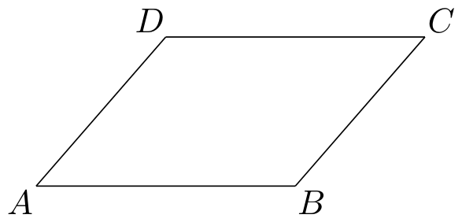
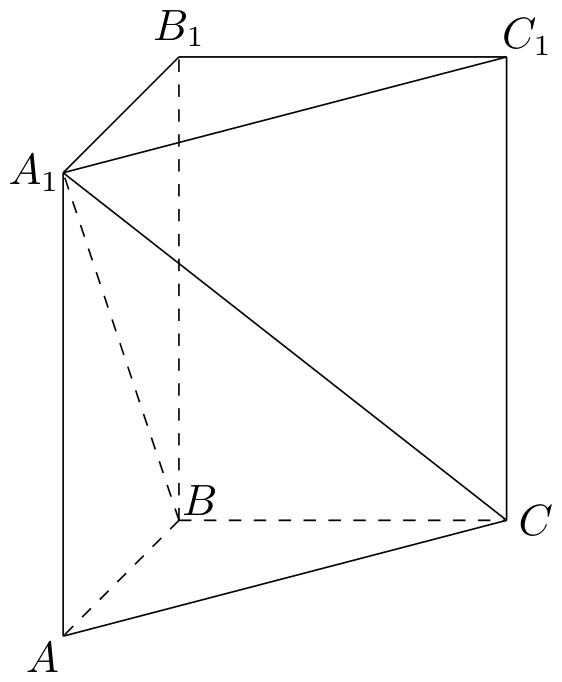

# 2006年上海卷（秋文）

## 填空题

### 第 1 题

已知集合 $A = \{-1, 3, m\}$，集合 $B = \{3, 4\}$. 若 $B \subseteq A$，则实数 $m =$＿＿＿＿＿＿.

#### 答案

$4$

#### 解析

因为 $B\subseteq A$，而 $4\in B$，所以 $4\in A$. 集合 $A$ 中已经有 $-1$ 和 $3$，故只能由 $m$ 提供元素 $4$，于是 $m=4$.

### 第 2 题

已知两条直线 $l_{1}$：$ax + 3y - 3 = 0$，$l_{2}$：$4x + 6y - 1 = 0$. 若 $l_{1}\parallel l_{2}$，则 $a =$＿＿＿＿＿＿.

#### 答案

$2$

#### 解析

两条直线平行时，其法向量平行，因此 $(a,3)$ 与 $(4,6)$ 成比例，即 $6a-12=0$. 解得 $a=2$. 此时两直线常数项不同，确为两条平行直线.

### 第 3 题

若函数 $f(x) = a^x$（$a > 0$，且 $a \neq 1$）的反函数的图象过点 $\left(2,-1\right)$，则 $a =$＿＿＿＿＿＿.

#### 答案

$\dfrac{1}{2}$

#### 解析

反函数的图象上的点与原函数图象上的点关于直线 $y=x$ 对称，所以 $(2,-1)$ 在反函数图象上等价于 $(-1,2)$ 在原函数图象上. 因而 $a^{-1}=2$，解得 $a=\dfrac{1}{2}$.

### 第 4 题

计算：$\displaystyle\lim_{n\to\infty}\frac{n(n^2 + 1)}{6n^3 + 1} =$＿＿＿＿＿＿.

#### 答案

$\dfrac{1}{6}$

#### 解析

分子、分母同除以 $n^3$，得

$$

\lim_{n\to\infty}\frac{n(n^2+1)}{6n^3+1}=\lim_{n\to\infty}\frac{1+\frac{1}{n^2}}{6+\frac{1}{n^3}}=\frac{1}{6}

$$

### 第 5 题

若复数 $z = (m - 2) + (m + 1)\i$ 为纯虚数（$\i$ 为虚单位），其中 $m \in \mathbb{R}$，则 $|z| =$＿＿＿＿＿＿.

#### 答案

$3$

#### 解析

复数为纯虚数时其实部为零，因此 $m-2=0$，得 $m=2$. 于是 $z=3\i$，所以 $|z|=3$.

### 第 6 题

函数 $y = \sin x \cos x$ 的最小正周期是＿＿＿＿＿＿.

#### 答案

$\pi$

#### 解析

由二倍角公式，$y=\sin x\cos x=\dfrac{1}{2}\sin 2x$. 当 $x$ 增加 $\pi$ 时，$2x$ 增加 $2\pi$，函数值不变；而 $\sin 2x$ 的最小正周期为 $\pi$，故原函数的最小正周期为 $\pi$.

### 第 7 题

已知双曲线的中心在原点，一个顶点的坐标是 $(3,0)$，且焦距与虚轴长之比为 $5:4$，则双曲线的标准方程是＿＿＿＿＿＿.

#### 答案

$\dfrac{x^2}{9} - \dfrac{y^2}{16} = 1$

#### 解析

顶点为 $(3,0)$，故双曲线焦点在 $x$ 轴上，且实半轴 $a=3$. 设虚半轴为 $b$，焦半距为 $c$，则 $c^2=a^2+b^2$. 由焦距与虚轴长之比为 $5:4$，得 $c:b=5:4$. 令 $c=5k$，$b=4k$，则 $25k^2=9+16k^2$，从而 $k=1$，即 $b=4$. 因此标准方程为 $\dfrac{x^2}{9}-\dfrac{y^2}{16}=1$.

### 第 8 题

方程 $\log_{3}(x^{2}-10)=1+\log_{3}x$ 的解是＿＿＿＿＿＿.

#### 答案

$5$

#### 解析

对数的真数必须为正，且 $\log_3x$ 要求 $x>0$，所以定义域为 $x>\sqrt{10}$. 原方程等价于 $x^2-10=3x$，即 $x^2-3x-10=0$，所以 $(x-5)(x+2)=0$. 由定义域舍去 $x=-2$，故解为 $x=5$.

### 第 9 题

已知实数 $x$，$y$ 满足

$$

\begin{cases}
x + y - 3 \geqslant 0,\\
x + 2y - 5 \leqslant 0,\\
x \geqslant 0,\\
y \geqslant 0,
\end{cases}

$$

则 $y - 2x$ 的最大值是＿＿＿＿＿＿.

#### 答案

$0$

#### 解析

可行域的边界为 $x+y=3$、$x+2y=5$、$x=0$ 和 $y=0$. 由 $x$，$y\geqslant0$ 及两条斜边界的交点，得到可行域的三个顶点为 $(3,0)$、$(5,0)$、$(1,2)$. 目标函数 $y-2x$ 是线性函数，最大值在顶点处取得. 逐点计算得 $y-2x$ 分别为 $-6$、$-10$、$0$，所以最大值为 $0$.

### 第 10 题

在一个小组中有 $8\text{ 名}$ 女同学和 $4\text{ 名}$ 男同学，从中任意地挑选 $2\text{ 名}$ 同学担任交通安全宣传志愿者，那么选到的两名都是女同学的概率是＿＿＿＿＿＿（结果用分数表示）.

#### 答案

$\dfrac{14}{33}$

#### 解析

从 $12$ 名同学中任取 $2$ 名共有 $\mathrm C_{12}^{2}$ 种等可能结果，其中两名都是女同学的结果有 $\mathrm C_{8}^{2}$ 种. 因此所求概率为

$$

P=\frac{\mathrm C_{8}^{2}}{\mathrm C_{12}^{2}}=\frac{8\times7}{12\times11}=\frac{14}{33}

$$

### 第 11 题

若曲线 $|y| = 2^x + 1$ 与直线 $y = b$ 没有公共点，则 $b$ 的取值范围是＿＿＿＿＿＿.

#### 答案

$-1\leqslant b\leqslant 1$

#### 解析

由 $|y|=2^x+1$ 且 $2^x>0$，可知曲线上任意点都满足 $|y|>1$. 直线 $y=b$ 与曲线有公共点，当且仅当 $|b|>1$，因此没有公共点的充要条件是 $|b|\leqslant1$，即 $-1\leqslant b\leqslant1$.

### 第 12 题

如图，平面中两条直线 $l_{1}$ 和 $l_{2}$ 相交于点 $O$. 对于平面上任意一点 $M$，若 $p$，$q$ 分别是 $M$ 到直线 $l_{1}$ 和 $l_{2}$ 的距离，则称有序非负实数对 $(p, q)$ 是点 $M$ 的“距离坐标”. 根据上述定义，“距离坐标”是 $(1,2)$ 的点的个数是＿＿＿＿＿＿.

#### 答案

$4$

#### 解析

到直线 $l_1$ 的距离为 $1$ 的点在 $l_1$ 两侧、与 $l_1$ 平行且距离为 $1$ 的两条直线上；到直线 $l_2$ 的距离为 $2$ 的点在 $l_2$ 两侧、与 $l_2$ 平行且距离为 $2$ 的两条直线上. 因为 $l_1$ 与 $l_2$ 相交，所以这两组平行线中的每一条都与另一组的每一条相交，得到 $2\times2=4$ 个交点，且交点彼此不同.

## 单选题

### 第 13 题

如图，在平行四边形 $ABCD$ 中，下列结论中错误的是（）

A.  
$\overrightarrow{AB} = \overrightarrow{DC}$

B.  
$\overrightarrow{AD} + \overrightarrow{AB} = \overrightarrow{AC}$

C.  
$\overrightarrow{AB} - \overrightarrow{AD} = \overrightarrow{BD}$

D.  
$\overrightarrow{AD} + \overrightarrow{CB} = \overrightarrow{0}$

#### 答案

C

#### 解析

设 $\overrightarrow{AB}=\bs b$，$\overrightarrow{AD}=\bs d$. 则 $\overrightarrow{DC}=\bs b$，$\overrightarrow{AC}=\bs b+\bs d$，且 $\overrightarrow{CB}=-\bs d$，所以 A、B、D 均正确. 另一方面，$\overrightarrow{AB}-\overrightarrow{AD}=\bs b-\bs d=\overrightarrow{DB}=-\overrightarrow{BD}$，不等于 $\overrightarrow{BD}$，故错误的是 C.

### 第 14 题

如果 $a < 0$，$b > 0$，那么，下列不等式中正确的是（）

A.  
$\frac{1}{a} < \frac{1}{b}$

B.  
$\sqrt{-a} < \sqrt{b}$

C.  
$a^2 < b^2$

D.  
$|a| > |b|$

#### 答案

A

#### 解析

由 $a<0$、$b>0$，可得 $\dfrac{1}{a}<0<\dfrac{1}{b}$，所以 $\dfrac{1}{a}<\dfrac{1}{b}$ 必然成立，故选 A.

### 第 15 题

若空间中有两条直线，则“这两条直线为异面直线”是“这两条直线没有公共点”的（）

A.  
充分非必要条件

B.  
必要非充分条件

C.  
充分必要条件

D.  
既非充分又非必要条件

#### 答案

A

#### 解析

异面直线不在同一平面内，因此不可能相交，故一定没有公共点. 反过来，没有公共点的两条空间直线也可能是平行直线，平行直线在同一平面内，并非异面直线. 所以“异面直线”是“没有公共点”的充分非必要条件，选 A.

### 第 16 题

如果一条直线与一个平面垂直，那么，称此直线与平面构成一个“正交线面对”. 在一个正方体中，由两个顶点确定的直线与含有四个顶点的平面构成的“正交线面对”的个数是（）

A.  
$48$

B.  
$18$

C.  
$24$

D.  
$36$

#### 答案

D

#### 解析

把正方体棱长取为 $1$，顶点坐标取为 $(0,0,0)$ 与 $(1,1,1)$ 的所有组合. 含有四个顶点的平面分为六个面和六个对角截面.

对于每一个面，垂直于它的直线必须沿该面的法向方向；例如对平面 $x=0$，有四条棱方向的顶点连线垂直于它. 因而六个面贡献 $6\times4=24$ 个线面对象对. 对于每一个对角截面，例如平面 $x=y$，其法向方向为 $(1,-1,0)$，有两条由顶点确定的直线平行于该方向并垂直于该平面. 六个对角截面贡献 $6\times2=12$ 个. 总数为 $24+12=36$，故选 D.

## 解答题

### 第 17 题

已知 $\alpha$ 是第一象限的角，且 $\cos \alpha = \frac{5}{13}$，求 $\frac{\sin\left(\alpha + \frac{\pi}{4}\right)}{\cos(2\alpha + 4\pi)}$ 的值.

#### 解析

因为 $\alpha$ 是第一象限角，且 $\cos\alpha=\dfrac{5}{13}$，所以

$$

\sin\alpha=\sqrt{1-\cos^2\alpha}
=\sqrt{1-\frac{25}{169}}
=\frac{12}{13}

$$

于是

$$

\sin\left(\alpha+\frac{\pi}{4}\right)
=\sin\alpha\cos\frac{\pi}{4}
+\cos\alpha\sin\frac{\pi}{4}
=\frac{12}{13}\cdot\frac{\sqrt2}{2}
+\frac{5}{13}\cdot\frac{\sqrt2}{2}
=\frac{17\sqrt2}{26}

$$

又因为三角函数的周期性以及二倍角公式，

$$

\cos(2\alpha+4\pi)=\cos2\alpha
=2\cos^2\alpha-1
=2\cdot\frac{25}{169}-1
=-\frac{119}{169}

$$

故原式为

$$

\frac{\frac{17\sqrt2}{26}}{-\frac{119}{169}}
=-\frac{17\sqrt2}{26}\cdot\frac{169}{119}
=-\frac{13\sqrt2}{14}

$$

### 第 18 题

如图，当甲船位于 $A$ 处时获悉，在其正东方向相距 $20\text{ 海里}$ 的 $B$ 处有一艘渔船遇险等待营救. 甲船立即前往救援，同时把消息告知在甲船的南偏西 $30^{\circ}$，相距 $10\text{ 海里}$ $C$ 处的乙船，试问乙船应朝北偏东多少度的方向沿直线前往 $B$ 处救援？（角度精确到 $1^{\circ}$）

#### 解析

建立直角坐标系：取 $A$ 为原点，正东方向为 $x$ 轴正向，正北方向为 $y$ 轴正向. 则 $A=(0,0)$，$B=(20,0)$. “南偏西 $30^\circ$”表示从正南方向向西偏 $30^\circ$，所以

$$

C=\bigl(-10\sin30^\circ,-10\cos30^\circ\bigr)
=\left(-5,-5\sqrt3\right)

$$

因此乙船从 $C$ 驶向 $B$ 的方向向量为

$$

\overrightarrow{CB}=B-C=\left(25,5\sqrt3\right)

$$

若该方向为北偏东 $\theta$，则其向东分量与向北分量之比满足

$$

\tan\theta=\frac{25}{5\sqrt3}=\frac{5}{\sqrt3}

$$

所以 $\theta\approx70.9^\circ$，精确到 $1^\circ$ 得乙船应沿北偏东 $71^\circ$ 的方向前往 $B$.

### 第 19 题

在直三棱柱 $ABC - A_{1}B_{1}C_{1}$ 中，$\angle ABC = 90^{\circ}$，$AB = BC = 1$.

1.  求异面直线 $B_{1}C_{1}$ 与 $AC$ 所成角的大小；

2.  若 $A_{1}C$ 与平面 $ABC$ 所成角为 $45^{\circ}$，求三棱锥 $A_{1} - ABC$ 的体积.

#### 解析

1.  取 $B=(0,0,0)$，令 $A=(1,0,0)$、$C=(0,1,0)$，并设直三棱柱高为 $h$. 则 $B_1=(0,0,h)$，$C_1=(0,1,h)$. 异面直线 $B_1C_1$ 与 $AC$ 所成的角，等于它们方向向量的夹角. 取 $\overrightarrow{B_1C_1}=(0,1,0)$，$\overrightarrow{AC}=(-1,1,0)$. 于是

$$

\cos\theta
    =\frac{\overrightarrow{B_1C_1}\cdot\overrightarrow{AC}}
    {|\overrightarrow{B_1C_1}|\,|\overrightarrow{AC}|}
    =\frac{1}{1\cdot\sqrt2}
    =\frac{\sqrt2}{2}

$$

    故 $\theta=45^\circ$.

2.  直线 $A_1C$ 与平面 $ABC$ 所成的角为 $45^\circ$. 其在平面 $ABC$ 上的射影为 $AC$，且

$$

AC=\sqrt{AB^2+BC^2}=\sqrt2

$$

    在直角三角形 $A_1AC$ 中，$AA_1\perp\text{平面 }ABC$，所以 $\tan45^\circ=\frac{AA_1}{AC}$，$AA_1=\sqrt2$. 底面 $ABC$ 的面积为

$$

S_{\triangle ABC}=\frac12 AB\cdot BC=\frac12

$$

    因此三棱锥 $A_1-ABC$ 的体积为

$$

V=\frac13S_{\triangle ABC}\cdot AA_1
    =\frac13\cdot\frac12\cdot\sqrt2
    =\frac{\sqrt2}{6}

$$

### 第 20 题

设数列 $\{a_n\}$ 的前 $n$ 项和为 $S_n$，且对任意正整数 $n$，$a_n + S_n = 4096$.

1.  求数列 $\{a_n\}$ 的通项公式；

2.  设数列 $\{\log_2 a_n\}$ 的前 $n$ 项和为 $T_n$，对数列 $\{T_n\}$，从第几项起 $T_n < -509$？

#### 解析

1.  当 $n=1$ 时，$S_1=a_1$，由题设 $a_1+S_1=2a_1=4096$，$a_1=2048$. 对任意 $n\geqslant2$，由 $S_n=S_{n-1}+a_n$ 以及题设分别有 $a_n+S_n=4096$，$a_{n-1}+S_{n-1}=4096$. 两式相减得

$$

a_n+S_{n-1}+a_n-\left(a_{n-1}+S_{n-1}\right)=0

$$

    即 $2a_n=a_{n-1}$，$a_n=\frac12a_{n-1}$. 所以 $\{a_n\}$ 是首项为 $2048$、公比为 $\dfrac12$ 的等比数列，从而

$$

a_n=2048\left(\frac12\right)^{n-1}=2^{12-n}

$$

2.  由上式

$$

\log_2a_n=12-n

$$

    因此

$$

T_n=\sum_{k=1}^{n}(12-k)
    =12n-\frac{n(n+1)}2
    =\frac{-n^2+23n}{2}

$$

    要求 $T_n<-509$，即 $T_{45}=\frac{-45^2+23\cdot45}{2}=-495>-509$，$T_{46}=\frac{-46^2+23\cdot46}{2}=-529<-509$. 又

$$

T_n-T_{n-1}=12-n

$$

    所以当 $n\geqslant12$ 时，$\{T_n\}$ 严格递减；由 $T_{45}>-509$ 和 $T_{46}<-509$ 可知，从第 $46$ 项起 $T_n<-509$.

### 第 21 题

已知在平面直角坐标系 $xOy$ 中的一个椭圆. 它的中心在原点，左焦点为 $F(-\sqrt{3}, 0)$，且右顶点为 $D(2, 0)$. 设点 $A$ 的坐标是 $\left(1, \frac{1}{2}\right)$.

1.  求该椭圆的标准方程；

2.  若 $P$ 是椭圆上的动点，求线段 $PA$ 中点 $M$ 的轨迹方程；

3.  过原点 $O$ 的直线交椭圆于点 $B$，$C$，求 $\triangle ABC$ 面积的最大值.

#### 解析

1.  椭圆中心在原点，右顶点为 $D(2,0)$，所以长半轴 $a=2$. 左焦点为 $F(-\sqrt3,0)$，故焦距的一半 $c=\sqrt3$. 由

$$

b^2=a^2-c^2=4-3=1

$$

    得 $b=1$，所以椭圆的标准方程为

$$

\frac{x^2}{4}+y^2=1

$$

2.  设线段 $PA$ 的中点为 $M(x,y)$，动点 $P$ 的坐标为 $(u,v)$. 由中点坐标公式， $x=\frac{u+1}{2}$，$y=\frac{v+\frac12}{2}$ 即 $u=2x-1$，$v=2y-\frac12$. 因为 $P$ 在椭圆上，

$$

\frac{u^2}{4}+v^2=1

$$

    代入 $u$，$v$ 得

$$

\frac{(2x-1)^2}{4}+\left(2y-\frac12\right)^2=1

$$

    化简为

$$

\left(x-\frac12\right)^2+4\left(y-\frac14\right)^2=1

$$

3.  过原点的直线与椭圆交于 $B$，$C$. 设该直线的单位方向向量为

$$

(\cos\theta,\sin\theta)

$$

    则由于椭圆关于原点中心对称，可设 $B=t(\cos\theta,\sin\theta)$，$C=-B$ 其中 $\frac{t^2\cos^2\theta}{4}+t^2\sin^2\theta=1$，$t=\frac{1}{\sqrt{\frac{\cos^2\theta}{4}+\sin^2\theta}}$. 三角形 $ABC$ 的面积为

$$

S=\frac12\left|\det(B-A,C-A)\right|

$$

    因 $C=-B$，有

$$

\det(B-A,C-A)
    =\det(B-A,-B-A)
    =2\det(A,B)

$$

    所以

$$

S=|\det(A,B)|
    =t\left|\frac12\cos\theta-\sin\theta\right|
    =\frac{|\cos\theta-2\sin\theta|}
    {\sqrt{\cos^2\theta+4\sin^2\theta}}

$$

    令 $u=\cos\theta$、$v=\sin\theta$. 要证明 $S^2\leqslant2$，只需验证

$$

(u-2v)^2\leqslant2(u^2+4v^2)
    \iff 0\leqslant(u+2v)^2

$$

    这恒成立. 当 $u+2v=0$ 时取等号，因此

$$

S_{\max}=\sqrt2

$$

### 第 22 题

已知函数 $y = x + \frac{a}{x}$ 有如下性质：如果常数 $a > 0$，那么该函数在 $(0, \sqrt{a}]$ 上是减函数，在 $[\sqrt{a}, +\infty)$ 上是增函数.

1.  如果函数 $y = x + \frac{2^b}{x}$（$x > 0$）在 $(0,4]$ 上是减函数，在 $[4, +\infty)$ 上是增函数，求 $b$ 的值；

2.  设常数 $c \in [1,4]$，求函数 $f(x) = x + \frac{c}{x}$（$1 \leqslant x \leqslant 2$）的最大值和最小值；

3.  当 $n$ 是正整数时，研究函数 $g(x) = x^n + \frac{c}{x^n}$（$c > 0$）的单调性，并说明理由.

#### 解析

1.  题设给出的性质中，函数 $x+\dfrac{a}{x}$ 的转折点是 $x=\sqrt a$. 这里 $a=2^b$，而转折点为 $4$，所以

$$

\sqrt{2^b}=4
    \iff 2^b=16
    \iff b=4

$$

2.  在 $x>0$ 时，题设性质表明 $f(x)=x+\dfrac{c}{x}$ 在

$$

\left(0,\sqrt c\right]\text{ 上递减，在 }\left[\sqrt c,+\infty\right)\text{ 上递增}

$$

    由于 $c\in[1,4]$，所以 $\sqrt c\in[1,2]$，转折点属于定义域 $[1,2]$，因此最小值为

$$

f(\sqrt c)=2\sqrt c

$$

    最大值只能在端点 $x=1$，$2$ 处取得. 两个端点函数值为 $f(1)=1+c$，$f(2)=2+\frac c2$. 比较二者：

$$

f(1)-f(2)=\frac c2-1

$$

    所以

$$

\max f(x)=
    \begin{cases}
    2+\dfrac c2,&1\leqslant c\leqslant2,\\
    1+c,&2\leqslant c\leqslant4,
    \end{cases}
    \qquad
    \min f(x)=2\sqrt c

$$

3.  令 $r=\sqrt[2n]{c}>0$，并令 $t=x^n$. 此时

$$

g(x)=t+\frac ct

$$

    当 $x>0$ 时，$t=x^n$ 随 $x$ 增大而增大；而 $t+\dfrac ct$ 在 $(0,\sqrt c]$ 上递减、在 $[\sqrt c,+\infty)$ 上递增. 转折点 $t=\sqrt c$ 对应 $x=r$，所以 $g$ 在 $(0,r]$ 上递减，在 $[r,+\infty)$ 上递增.

    当 $x<0$ 时，考察 $h(t)=t+\frac ct$，$h'(t)=1-\frac{c}{t^2}$. 因此 $h$ 在 $(-\infty,-\sqrt c]$ 上递增，在 $[-\sqrt c,0)$ 上递减.

    若 $n$ 为奇数，$x^n$ 随 $x$ 增大而增大，且

$$

(-\infty,-r]\xrightarrow{x^n}(-\infty,-\sqrt c],\qquad
    [-r,0)\xrightarrow{x^n}[-\sqrt c,0)

$$

    故 $g$ 在 $(-\infty,-r]$ 上递增，在 $[-r,0)$ 上递减.

    若 $n$ 为偶数，$x^n$ 在负半轴上随 $x$ 增大而减小. 当

$$

(-\infty,-r]\xrightarrow{x^n}[\sqrt c,+\infty),\qquad
    [-r,0)\xrightarrow{x^n}(0,\sqrt c]

$$

    结合 $h$ 在正数上的增减性，得 $g$ 在 $(-\infty,-r]$ 上递减，在 $[-r,0)$ 上递增.
