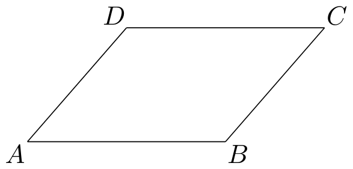
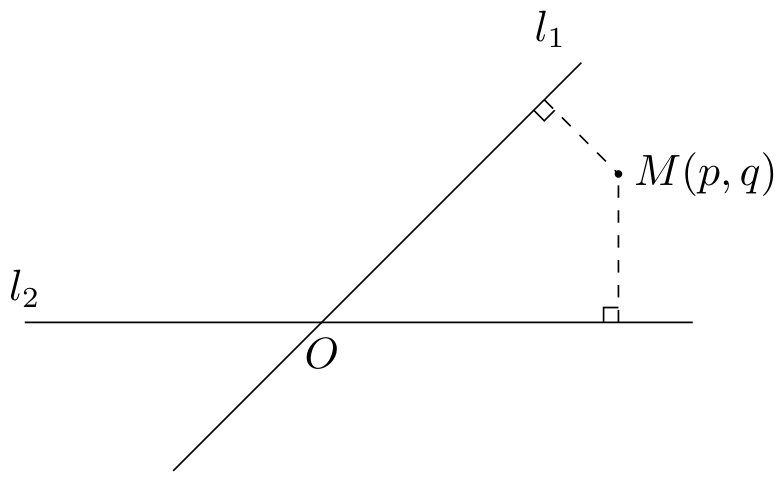
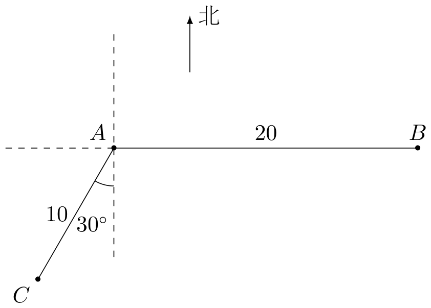
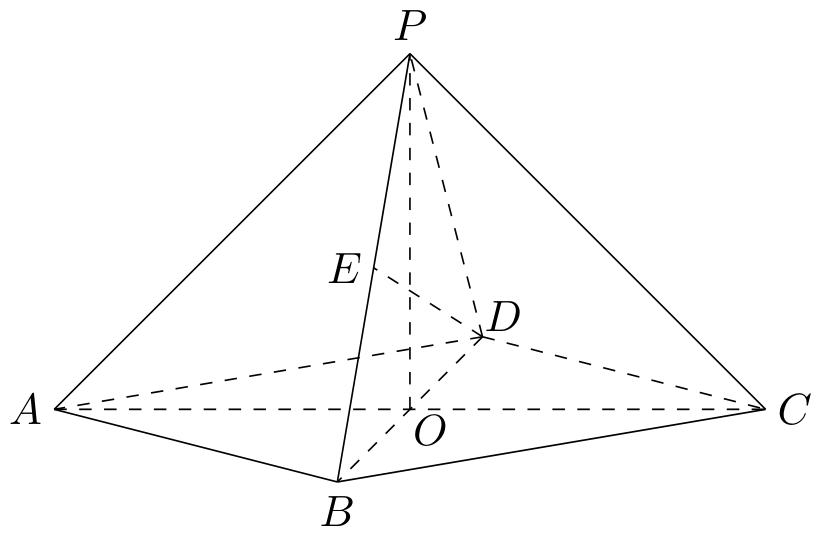

# 2006年上海卷（秋理）

## 填空题

### 第 1 题

已知集合 $A = \{-1, 3, 2m - 1\}$，集合 $B = \{3, m^2\}$，若 $B \subseteq A$，则实数 $m =$＿＿＿＿＿＿.

#### 答案

$\left\{-\sqrt{3},1,\sqrt{3}\right\}$

#### 解析

由于 $-1\in A$ 且 $-1\notin B$，所以只需使 $m^2\in A$ 即可保证 $B\subseteq A$. 又 $m$ 为实数，所以 $m^2\neq-1$，从而 $m^2=3$ 或 $m^2=2m-1$. 前一种情况给出 $m=\pm\sqrt{3}$，后一种情况给出 $(m-1)^2=0$，即 $m=1$. 当 $m=\pm\sqrt{3}$ 时，集合 $B$ 中的两个表示元素相同，重复元素只计一次，故 $B=\{3\}\subseteq A$；当 $m=1$ 时 $B=\{1,3\}\subseteq A$. 因此 $m\in\left\{-\sqrt{3},1,\sqrt{3}\right\}$.

### 第 2 题

已知圆 $x^{2} - 4x - 4 + y^{2} = 0$ 的圆心是点 $P$，则点 $P$ 到直线 $x - y - 1 = 0$ 的距离是＿＿＿＿＿＿.

#### 答案

$\frac{\sqrt{2}}{2}$

#### 解析

将圆的方程配方得 $(x-2)^2+y^2=8$，所以圆心为 $P(2,0)$. 点 $P$ 到直线 $x-y-1=0$ 的距离为 $\displaystyle \frac{|2-0-1|}{\sqrt{1^2+(-1)^2}}=\frac{1}{\sqrt{2}}=\frac{\sqrt{2}}{2}$.

### 第 3 题

若函数 $f(x) = a^x$（$a > 0$，且 $a \neq 1$）的反函数的图象过点 $(2,-1)$，则 $a =$＿＿＿＿＿＿.

#### 答案

$\frac{1}{2}$

#### 解析

点 $(2,-1)$ 在 $f(x)=a^x$ 的反函数图象上，当且仅当点 $(-1,2)$ 在 $f$ 的图象上. 因此 $a^{-1}=2$，结合 $a>0$ 得 $a=\frac{1}{2}$.

### 第 4 题

计算 $\lim\limits_{n\to \infty}\frac{\mathrm C_n^3}{n^3 + 1} =$＿＿＿＿＿＿.

#### 答案

$\frac{1}{6}$

#### 解析

由组合数公式， $\displaystyle \frac{\mathrm C_n^3}{n^3+1}=\frac{n(n-1)(n-2)}{6(n^3+1)}=\frac{1}{6}\cdot\frac{\left(1-\frac{1}{n}\right)\left(1-\frac{2}{n}\right)}{1+\frac{1}{n^3}}$. 令 $n\to\infty$，得到极限为 $\frac{1}{6}$.

### 第 5 题

若复数 $z$ 同时满足 $z - \overline{z} = 2\i$，$\overline{z} = \i z$ （$\i$ 为虚数单位），则 $z =\underline{\qquad\qquad}$.

#### 答案

$-1+\i$

#### 解析

设 $z=x+y\i$，其中 $x$，$y\in\mathbb{R}$，则 $\overline z=x-y\i$. 由 $z-\overline z=2\i$ 得 $2y\i=2\i$，所以 $y=1$. 又 $\overline z=\i z=\i(x+y\i)=-y+x\i$，比较实部得 $x=-y=-1$. 因此 $z=-1+\i$.

### 第 6 题

如果 $\cos \alpha = \frac{1}{5}$，且 $\alpha$ 是第四象限的角，那么 $\cos \left(\alpha + \frac{\pi}{2}\right) =$＿＿＿＿＿＿.

#### 答案

$\frac{2\sqrt{6}}{5}$

#### 解析

因为 $\alpha$ 是第四象限的角， $\sin\alpha=-\sqrt{1-\cos^2\alpha}=-\sqrt{1-\frac{1}{25}}=-\frac{2\sqrt{6}}{5}$. 由和角公式， $\cos\left(\alpha+\frac{\pi}{2}\right)=-\sin\alpha=\frac{2\sqrt{6}}{5}$.

### 第 7 题

已知椭圆中心在原点，一个焦点为 $F(-2\sqrt{3}, 0)$，且长轴长是短轴长的 2 倍，则该椭圆的标准方程是＿＿＿＿＿＿.

#### 答案

$\frac{x^2}{16}+\frac{y^2}{4}=1$

#### 解析

设椭圆的长、短半轴分别为 $a$、$b$，焦距的一半为 $c$. 由焦点坐标知 $c=2\sqrt{3}$，由长轴长是短轴长的 $2$ 倍知 $a=2b$. 又 $c^2=a^2-b^2$，所以 $12=3b^2$，即 $b^2=4$，$a^2=16$. 焦点在 $x$ 轴上，故椭圆的标准方程为 $\frac{x^2}{16}+\frac{y^2}{4}=1$.

### 第 8 题

在极坐标系中，$O$ 是极点，设点 $A\left(4, \frac{\pi}{3}\right)$，$B\left(5, -\frac{5\pi}{6}\right)$，则 $\triangle OAB$ 的面积是＿＿＿＿＿＿.

#### 答案

$5$

#### 解析

极坐标中三角形 $OAB$ 的两边长为 $OA=4$、$OB=5$，两边夹角的一个有向表示为 $\frac{\pi}{3}-\left(-\frac{5\pi}{6}\right)=\frac{7\pi}{6}$. 因此 $S_{\triangle OAB}=\frac{1}{2}\cdot4\cdot5\left|\sin\frac{7\pi}{6}\right|=10\cdot\frac{1}{2}=5$.

### 第 9 题

两部不同的长篇小说各由第一、二、三、四卷组成. 每卷 $1\text{ 本}$，共 $8\text{ 本}$. 将它们任意地排成一排，左边 $4\text{ 本}$ 恰好都属于同一部小说的概率是＿＿＿＿＿＿. （结果用分数表示）

#### 答案

$\frac{1}{35}$

#### 解析

把两部小说的 $8\text{ 本}$ 书看成互不相同的书，任意排列共有 $8!$ 种. 若左边 $4\text{ 本}$ 都属于第一部小说，有 $4!\cdot4!$ 种排列；若都属于第二部小说，也有同样多的排列. 因此所求概率为 $\displaystyle \frac{2\cdot4!\cdot4!}{8!}=\frac{1}{35}$.

### 第 10 题

如果一条直线与一个平面垂直，那么，称此直线与平面构成一个“正交线面对”. 在一个正方体中，由两个顶点确定的直线与含有四个顶点的平面构成的“正交线面对”的个数是＿＿＿＿＿＿.

#### 答案

$36$

#### 解析

把正方体顶点坐标化为 $\{0,1\}^3$. 设一个平面方程为 $ux+vy+wz=d$. 其在八个顶点处的取值为 $0$，$u$，$v$，$w$，$u+v$，$u+w$，$v+w$，$u+v+w$. 若其中两个系数为零，平面是六个面平面之一. 若恰有一个系数为零，不妨设 $w=0$，且 $u$，$v\neq0$，则每个 $(x,y)$ 对应的取值在 $z=0$，$1$ 时各出现一次；要得到四个顶点，四个数 $0$，$u$，$v$，$u+v$ 中必须有两个相同. 在 $u$，$v\neq0$ 的条件下，这只可能是 $u=v$ 或 $u=-v$，分别给出 $x=y$ 或 $x+y=1$ 型的六个对角平面. 若 $u$，$v$，$w$ 均非零，则分别考察平面与两个正方形面 $x=0$、$x=1$ 的交点. 每个正方形面上至多有两个顶点在平面内；若总共有四个顶点，就必须在两个正方形面上各有两个. 在正方形面内，连接两个顶点的直线若为边，则两条平行交线确定的平面是一个面平面或一个只含另外两个坐标的对角平面，方程中至少有一个系数为零，与 $u$，$v$，$w$ 均非零矛盾；若不是边，就只能是对角线. 由于两个交线彼此平行，这两对顶点必须是对应的对角线端点. 于是平面方程与 $y+z=1$ 或 $y=z$ 等价，均不含 $x$ 项，与 $u\neq0$ 矛盾. 因此含有四个顶点的平面只有上述两类.

对面平面 $x=0$，法向量为 $(1,0,0)$，由两个顶点确定且垂直于该平面的直线必须连接一对只在 $x$ 坐标上不同的顶点，共有 $4$ 条. 六个面平面贡献 $6\cdot4=24$ 个“正交线面对”.

对角平面 $x=y$，法向量可取 $(1,-1,0)$，符合条件的顶点对只能是 $(0,1,0)$ 与 $(1,0,0)$，以及 $(0,1,1)$ 与 $(1,0,1)$，共 $2$ 条. 六个对角平面贡献 $6\cdot2=12$ 个. 因此总数为 $24+12=36$.

### 第 11 题

若曲线 $y^{2} = |x| + 1$ 与直线 $y = kx + b$ 没有公共点，则 $k$，$b$ 分别应满足的条件是＿＿＿＿＿＿.

#### 答案

$k=0$，$b\in(-1,1)$

#### 解析

令 $G(x)=(kx+b)^2-|x|-1$. 直线与曲线有公共点，当且仅当 $G(x)=0$ 有实根.

若 $k=0$，则直线为 $y=b$. 曲线在每个 $x$ 处的纵坐标为 $\pm\sqrt{|x|+1}$，且 $\sqrt{|x|+1}\geq1$. 所以当 $|b|<1$ 时直线始终位于两支曲线之间，没有公共点；当 $|b|=1$ 时在 $x=0$ 相交；当 $|b|>1$ 时取 $|x|=b^2-1$ 即可相交.

若 $k\neq0$，则 $G(x)\to+\infty$（当 $x\to\pm\infty$）. 取 $x_0=-b/k$，有 $G(x_0)=-|x_0|-1<0$. 由连续性，$G$ 必有实根，直线必与曲线相交. 因此没有公共点的充要条件为 $k=0$，$b\in\left(-1,1\right)$.

### 第 12 题

三个同学对问题“关于 $x$ 的不等式 $x^{2} + 25 + |x^{3} - 5x^{2}| \geqslant ax$ 在 $[1, 12]$ 上恒成立，求实数 $a$ 的取值范围”提出各自的解题思路. 甲说：“只须不等式左边的最小值不小于右边的最大值”. 乙说：“把不等式变形为左边含变量 $x$ 的函数，右边仅含常数，求函数的最值”. 丙说：“把不等式两边看成关于 $x$ 的函数，作出函数图象”. 参考上述解题思路，你认为他们所讨论的问题的正确结论，即 $a$ 的取值范围是＿＿＿＿＿＿.

#### 答案

$a\in(-\infty,10]$

#### 解析

因为 $x\in\left[1,12\right]$ 时 $x>0$，原不等式等价于 $a\leq\frac{x^2+25+|x^3-5x^2|}{x}$. 记右端为 $h(x)$.

当 $1\leq x\leq5$ 时， $h(x)=\frac{x^2+25+x^2(5-x)}{x}=6x-x^2+\frac{25}{x}$，且 $h'(x)=6-2x-\frac{25}{x^2}=-\frac{2x^3-6x^2+25}{x^2}$. 令 $\varphi(x)=2x^3-6x^2+25$，则 $\varphi'(x)=6x(x-2)$，所以 $\varphi$ 在 $[1,2]$ 上递减、在 $[2,5]$ 上递增，且 $\varphi(x)\geq\varphi(2)=17>0$. 因此 $h'(x)<0$，$h$ 在此区间递减.

当 $5\leq x\leq12$ 时， $h(x)=\frac{x^2+25+x^2(x-5)}{x}=x^2-4x+\frac{25}{x}$，且 $h'(x)=2x-4-\frac{25}{x^2}=\frac{2x^3-4x^2-25}{x^2}$. 令 $\psi(x)=2x^3-4x^2-25$，则 $\psi'(x)=2x(3x-4)>0$，且 $\psi(5)=125>0$，所以 $h'(x)>0$，$h$ 在此区间递增. 故 $h$ 的最小值在 $x=5$ 处取得，且 $h(5)=10$. 因此原不等式在整个区间上恒成立当且仅当 $a\leq10$，即 $a\in\left(-\infty,10\right]$.

## 单选题

### 第 13 题

如图，在平行四边形 $ABCD$ 中，下列结论中错误的是（）

A.  
$\overrightarrow{AB} = \overrightarrow{DC}$

B.  
$\overrightarrow{AD} +\overrightarrow{AB} = \overrightarrow{AC}$

C.  
$\overrightarrow{AB} -\overrightarrow{AD} = \overrightarrow{BD}$

D.  
$\overrightarrow{AD} +\overrightarrow{CB} = \overrightarrow{0}$

#### 答案

C

#### 解析

设 $\overrightarrow{AB}=\bs b$，$\overrightarrow{AD}=\bs d$. 平行四边形中 $\overrightarrow{DC}=\bs b$，$\overrightarrow{AC}=\bs b+\bs d$，且 $\overrightarrow{CB}=-\bs d$. 因此其余三个选项分别成立，而 $\overrightarrow{AB}-\overrightarrow{AD}=\bs b-\bs d=\overrightarrow{DB}=-\overrightarrow{BD}$，不等于 $\overrightarrow{BD}$. 故错误的是 C.

### 第 14 题

若空间中有四个点，则“这四个点中有三点在同一条直线上”是“这四个点在同一个平面上”的（）

A.  
充分非必要条件

B.  
必要非充分条件

C.  
充分必要条件

D.  
既非充分又非必要条件

#### 答案

A

#### 解析

若四个点中有三点在同一直线上，取该直线与第四点（若第四点也在该直线上则任取包含此直线的平面），即可得到一个包含四点的平面，所以这是充分条件. 反之，在同一平面内取正方形的四个顶点，四点共面但任意三点不共线，因此原条件不是必要条件. 故选 A.

### 第 15 题

若关于 $x$ 的不等式 $(1 + k^2)x \leqslant k^4 + 4$ 的解集是 $M$，则对任意实数 $k$，总有（）

A.  
$2 \in M$，$0 \in M$

B.  
$2$ 不属于 $M$，$0$ 不属于 $M$

C.  
$2 \in M$，$0$ 不属于 $M$

D.  
$2$ 不属于 $M$，$0 \in M$

#### 答案

A

#### 解析

由于 $1+k^2>0$，不等式的解集为 $M=\left(-\infty,\frac{k^4+4}{1+k^2}\right]$. 显然 $0\in M$，且 $\displaystyle \frac{k^4+4}{1+k^2}-2=\frac{k^4-2k^2+2}{1+k^2}=\frac{(k^2-1)^2+1}{1+k^2}>0$，所以 $2\in M$. 故选 A.

### 第 16 题

如图，平面中两条直线 $l_{1}$ 和 $l_{2}$ 相交于点 $O$，对于平面上任意一点 $M$，若 $p$，$q$ 分别是 $M$ 到直线 $l_{1}$ 和 $l_{2}$ 的距离，则称有序非负实数对 $(p, q)$ 是点 $M$ 的“距离坐标”. 已知常数 $p \geqslant 0$，$q \geqslant 0$，给出下列命题：

1.  若 $p = q = 0$，则“距离坐标”为 $(0, 0)$ 的点有且仅有 1 个；

2.  若 $pq = 0$，且 $p + q \neq 0$，则“距离坐标”为 $(p, q)$ 的点有且仅有 2 个；

3.  若 $pq \neq 0$，则“距离坐标”为 $(p, q)$ 的点有且仅有 4 个.

上述命题中，正确命题的个数是（）

A.  
0

B.  
1

C.  
2

D.  
3

#### 答案

D

#### 解析

两条相交直线把平面分成四个角区. 若 $p=q=0$，点必须同时在两条直线上，因而只能是交点 $O$，第一个命题正确.

若 $pq=0$ 且 $p+q\neq0$，不妨设 $p>0$，$q=0$. 点在 $l_2$ 上，而点到 $l_1$ 的距离沿 $l_2$ 离开 $O$ 时连续增大，并在 $O$ 两侧各取一次 $p$，所以恰有 $2$ 个点；交换 $p$，$q$ 时同理，第二个命题正确.

若 $pq\neq0$，分别作两条与 $l_1$ 平行且距 $l_1$ 为 $p$ 的直线，以及两条与 $l_2$ 平行且距 $l_2$ 为 $q$ 的直线. 每条前者与每条后者各交于一点，共有 $2\cdot2=4$ 个点，第三个命题正确. 因此正确命题的个数为 $3$，故选 D.

## 解答题

### 第 17 题

求函数 $y = 2\cos \left( x + \frac{\pi}{4} \right) \cos \left( x - \frac{\pi}{4} \right) + \sqrt{3} \sin 2x$ 的值域和最小正周期.

#### 解析

利用积化和差公式， $2\cos\left(x+\frac{\pi}{4}\right)\cos\left(x-\frac{\pi}{4}\right)=\cos2x$. 所以 $y=\cos2x+\sqrt{3}\sin2x=2\sin\left(2x+\frac{\pi}{6}\right)$. 由于正弦函数的值域为 $[-1,1]$，故 $y$ 的值域为 $[-2,2]$. 又 $2x+\frac{\pi}{6}$ 的最小正周期需增加 $2\pi$，所以 $x$ 的最小正周期为 $\pi$.

### 第 18 题

如图，当甲船位于 $A$ 处时获悉，在其正东方向相距 $20\text{ 海里}$ 的 $B$ 处有一艘渔船遇险等待营救. 甲船立即前往救援，同时把消息告知在甲船的南偏西 $30^{\circ}$，相距 $10\text{ 海里}$ 的 $C$ 处的乙船，试问乙船应朝北偏东多少度的方向沿直线前往 $B$ 处救援. （角度精确到 $1^{\circ}$）

#### 解析

在三角形 $ABC$ 中，$AB=20$，$AC=10$，且从 $AB$ 转向 $AC$ 的角为 $120^{\circ}$. 由余弦定理， $BC^2=20^2+10^2-2\cdot20\cdot10\cos120^{\circ}=700$，所以 $BC=10\sqrt{7}$. 设 $\angle ABC=\beta$，则再由余弦定理 $\displaystyle \cos\beta=\frac{AB^2+BC^2-AC^2}{2\cdot AB\cdot BC}=\frac{400+700-100}{400\sqrt{7}}=\frac{5}{2\sqrt{7}}$. 因此 $\beta\approx19.1^{\circ}$. 从 $C$ 到 $B$ 的方向为北偏东 $90^{\circ}-\beta$，约为 $70.9^{\circ}$，按题意精确到 $1^{\circ}$ 得乙船应朝北偏东 $71^{\circ}$ 的方向前往 $B$.

### 第 19 题

在四棱锥 $P - ABCD$ 中，底面是边长为 $2$ 的菱形. $\angle DAB = 60^{\circ}$，对角线 $AC$ 与 $BD$ 相交于点 $O$，$PO \perp$ 平面 $ABCD$，$PB$ 与平面 $ABCD$ 所成的角为 $60^{\circ}$.

1.  求四棱锥 $P-ABCD$ 的体积；

2.  若 $E$ 是 $PB$ 的中点，求异面直线 $DE$ 与 $PA$ 所成角的大小. （结果用反三角函数值表示）

#### 解析

1.  由 $AB=AD=2$、$\angle DAB=60^{\circ}$ 及余弦定理，$BD^2=2^2+2^2-2\cdot2\cdot2\cos60^{\circ}=4$，所以 $BD=2$，$OB=\frac{BD}{2}=1$. 菱形的两条对角线互相垂直，故 $AO\perp BO$，在直角三角形 $AOB$ 中 $AO=\sqrt{AB^2-OB^2}=\sqrt{3}$. 因为 $PO\perp$ 平面 $ABCD$，所以 $\angle PBO$ 是 $PB$ 与底面所成的角，故 $\angle PBO=60^{\circ}$. 在直角三角形 $PBO$ 中，$PO=BO\tan60^{\circ}=\sqrt{3}$. 底面菱形的两条对角线长为 $2AO=2\sqrt{3}$、$2BO=2$，面积为 $\frac{1}{2}\cdot2\sqrt{3}\cdot2=2\sqrt{3}$. 因此四棱锥体积为 $\frac{1}{3}\cdot2\sqrt{3}\cdot\sqrt{3}=2$.

2.  以 $O$ 为原点，分别以 $OB$、$OA$、$OP$ 所在的射线为 $x$、$y$、$z$ 轴正半轴，建立空间直角坐标系，则 $A=(0,\sqrt{3},0)$，$B=(1,0,0)$，$D=(-1,0,0)$，$P=(0,0,\sqrt{3})$. 因 $E$ 是 $PB$ 的中点，$E=\left(\frac{1}{2},0,\frac{\sqrt{3}}{2}\right)$. 取方向向量 $\overrightarrow{DE}=\left(\frac{3}{2},0,\frac{\sqrt{3}}{2}\right)$，$\overrightarrow{AP}=(0,-\sqrt{3},\sqrt{3})$. 设异面直线 $DE$ 与 $PA$ 所成的锐角为 $\theta$，则 $\displaystyle \cos\theta=\frac{\overrightarrow{DE}\cdot\overrightarrow{AP}}{|\overrightarrow{DE}|\,|\overrightarrow{AP}|}=\frac{\frac{3}{2}}{\sqrt{3}\cdot\sqrt{6}}=\frac{\sqrt{2}}{4}$. 所以 $\theta=\arccos\frac{\sqrt{2}}{4}$.

### 第 20 题

在平面直角坐标系 $xOy$ 中，直线 $l$ 与抛物线 $y^{2} = 2x$ 相交于 $A$，$B$ 两点.

1.  求证：“如果直线 $l$ 过点 $T(3,0)$，那么 $\overrightarrow{OA} \cdot \overrightarrow{OB} = 3$” 是真命题；

2.  写出第一问中命题的逆命题，判断它是真命题还是假命题，并说明理由.

#### 解析

1.  先考虑直线 $l$ 垂直于 $x$ 轴的情形. 此时 $l:x=3$，与抛物线交于 $A=(3,\sqrt{6})$、$B=(3,-\sqrt{6})$，故 $\overrightarrow{OA}\cdot\overrightarrow{OB}=3\cdot3+\sqrt{6}(-\sqrt{6})=3$.

    若 $l$ 不垂直于 $x$ 轴，设其斜率为 $t$. 因 $l$ 过 $T(3,0)$，其方程为 $y=t(x-3)$. 由于 $l$ 与抛物线有两个交点，$t\neq0$. 设交点的纵坐标为 $y_1$，$y_2$，由 $x=\frac{y^2}{2}$ 得 $t y^2-2y-6t=0$. 所以 $y_1y_2=-6$. 又 $x_i=\frac{y_i^2}{2}$，从而 $\displaystyle \overrightarrow{OA}\cdot\overrightarrow{OB}=x_1x_2+y_1y_2=\frac{y_1^2y_2^2}{4}+y_1y_2=\frac{36}{4}-6=3$. 综上，第一问中的命题是真命题.

2.  逆命题是：如果 $\overrightarrow{OA}\cdot\overrightarrow{OB}=3$，那么直线 $l$ 过点 $T(3,0)$. 取抛物线上的两点 $A=(2,2)$、$B=\left(\frac{1}{2},1\right)$，有 $\overrightarrow{OA}\cdot\overrightarrow{OB}=2\cdot\frac{1}{2}+2\cdot1=3$. 但直线 $AB$ 的方程为 $y=\frac{2}{3}x+\frac{2}{3}$，在 $x=3$ 时 $y=\frac{8}{3}\neq0$，所以点 $T(3,0)$ 不在直线 $AB$ 上. 因此逆命题是假命题.

### 第 21 题

已知有穷数列 $\{a_{n}\}$ 共有 $2k$ 项（整数 $k \geqslant 2$），首项 $a_{1} = 2$. 设该数列的前 $n$ 项和为 $S_{n}$，且 $a_{n+1} = (a-1)S_{n} + 2$（$n = 1$，$2$，$\cdots$，$2k-1$）. 其中常数 $a > 1$.

1.  求证：数列 $\{a_{n}\}$ 是等比数列；

2.  若 $a = 2^{\frac{2}{2k-1}}$，数列 $\{b_n\}$ 满足 $b_n = \frac{1}{n}\log_2(a_1a_2\cdots a_n)$（$n = 1$，$2$，$\cdots$，$2k$），求数列 $\{b_n\}$ 的通项公式；

3.  若第二问中的数列 $\{b_n\}$ 满足不等式 $\left|b_1 - \frac{3}{2}\right| + \left|b_2 - \frac{3}{2}\right| + \cdots + \left|b_{2k-1} - \frac{3}{2}\right| + \left|b_{2k} - \frac{3}{2}\right| \leqslant 4$，求 $k$ 的值.

#### 解析

1.  当 $n=1$ 时，$S_1=a_1=2$，所以 $a_2=(a-1)S_1+2=2a=aa_1$. 当 $n\geq2$ 时， $a_{n+1}-a_n=(a-1)S_n+2-\bigl((a-1)S_{n-1}+2\bigr)=(a-1)a_n$，从而 $a_{n+1}=aa_n$. 因此 $\{a_n\}$ 是首项为 $2$、公比为 $a$ 的等比数列，且 $a_n=2a^{n-1}$.

2.  由上一问，$a_1a_2\cdots a_n=2^n a^{1+2+\cdots+(n-1)}=2^n a^{\frac{n(n-1)}{2}}$. 代入 $a=2^{\frac{2}{2k-1}}$，得 $\log_2(a_1a_2\cdots a_n)=n+\frac{n(n-1)}{2k-1}$，所以 $b_n=1+\frac{n-1}{2k-1}$，其中 $n=1$，$2$，$\ldots$，$2k$.

3.  有 $b_k<\frac{3}{2}<b_{k+1}$，且 $b_n+b_{2k+1-n}=3$. 因此 $\displaystyle \sum_{n=1}^{2k}\left|b_n-\frac{3}{2}\right|=\sum_{n=1}^{k}\left(3-2b_n\right)=\sum_{n=1}^{k}\left(1-\frac{2(n-1)}{2k-1}\right)=\frac{k^2}{2k-1}$. 由题设，$\frac{k^2}{2k-1}\leq4$，即 $k^2-8k+4\leq0$. 所以 $4-2\sqrt{3}\leq k\leq4+2\sqrt{3}$. 结合整数条件 $k\geq2$，得到 $k=2$，$3$，$4$，$5$，$6$，$7$.

### 第 22 题

已知函数 $y = x + \frac{a}{x}$ 有如下性质：如果常数 $a > 0$，那么该函数在 $(0, \sqrt{a}]$ 上是减函数，在 $[\sqrt{a}, +\infty)$ 上是增函数.

1.  如果函数 $y = x + \frac{2^{b}}{x}$（$x > 0$）的值域为 $[6, +\infty)$，求 $b$ 的值；

2.  研究函数 $y = x^{2} + \frac{c}{x^{2}}$ （常数 $c > 0$） 在定义域内的单调性，并说明理由；

3.  对函数 $y = x + \frac{a}{x}$ 和 $y = x^{2} + \frac{a}{x^{2}}$ （常数 $a > 0$） 作出推广，使它们都是你所推广的函数的情况. 研究推广后的函数的单调性（只须写出结论，不必证明），并求函数 $F(x) = \left(x^{2} + \frac{1}{x}\right)^{n} + \left(\frac{1}{x^{2}} + x\right)^{n}$ （$n$ 是正整数）在区间 $\left[\frac{1}{2}, 2\right]$ 上的最大值和最小值. （可利用你的研究结论）

#### 解析

1.  对 $x>0$，函数 $x+\frac{2^b}{x}$ 在 $x=\sqrt{2^b}$ 处取得最小值 $2\sqrt{2^b}$. 由值域为 $[6,+\infty)$，得 $2\sqrt{2^b}=6$，即 $2^b=9$，所以 $b=\log_2 9$.

2.  定义域为 $x\neq0$. 令 $t=x^2$，则 $t>0$，且 $y=t+\frac{c}{t}$ 在 $(0,\sqrt{c})$ 上递减、在 $(\sqrt{c},+\infty)$ 上递增. 令 $r=\sqrt[4]{c}$，由 $t=x^2$ 随 $x$ 的变化可知，$y$ 在 $(-\infty,-r)$ 和 $(0,r)$ 上递减，在 $(-r,0)$ 和 $(r,+\infty)$ 上递增.

3.  可推广为 $f_{r,s}(x)=x^r+\frac{a}{x^s}$，其中 $a>0$，$r$，$s$ 为正整数. 令 $\rho=\left(\frac{sa}{r}\right)^{\frac{1}{r+s}}$. 在 $(0,\rho)$ 上为减函数，在 $(\rho,+\infty)$ 上为增函数；在负半轴上，当 $r$，$s$ 都为奇数时，在 $(-\infty,-\rho)$ 上为增函数、在 $(-\rho,0)$ 上为减函数；当 $r$，$s$ 都为偶数时，在 $(-\infty,-\rho)$ 上为减函数、在 $(-\rho,0)$ 上为增函数；当 $r$ 为偶数、$s$ 为奇数时，在 $(-\infty,0)$ 上为减函数；当 $r$ 为奇数、$s$ 为偶数时，在 $(-\infty,0)$ 上为增函数.

    令 $u=x^2+\frac{1}{x}$，$v=\frac{1}{x^2}+x$. 由上面的结论，$u$ 在正半轴上先减后增，$v$ 也在正半轴上先减后增. 进一步，在 $1\leq x\leq2$ 上有 $u-v=\frac{(x-1)(x^3+1)}{x^2}\geq0$，$u'=2x-\frac{1}{x^2}>0$，$v'=1-\frac{2}{x^3}$，以及 $\displaystyle u'+v'=\frac{(x-1)(2x^3+3x^2+3x+2)}{x^3}\geq0$. 当 $v'\geq0$ 时，显然 $F'(x)\geq0$；当 $v'<0$ 时，$u^{n-1}\geq v^{n-1}>0$，并且 $\displaystyle \frac{F'(x)}{n}=u^{n-1}u'+v^{n-1}v'=u^{n-1}(u'+v')+\left(u^{n-1}-v^{n-1}\right)(-v')\geq0$. 故 $F$ 在 $[1,2]$ 上递增. 又 $F(1/x)=F(x)$，所以 $F$ 在 $\left[\frac{1}{2},1\right]$ 上递减，最大值在 $x=\frac{1}{2}$ 或 $x=2$ 处取得，最小值在 $x=1$ 处取得. 于是 $\displaystyle F_{\max}=\left(\frac{9}{2}\right)^n+\left(\frac{9}{4}\right)^n$，$F_{\min}=2^{n+1}$.
