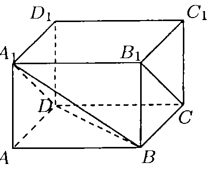
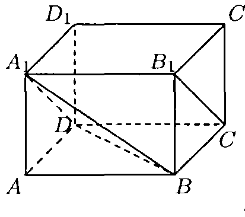
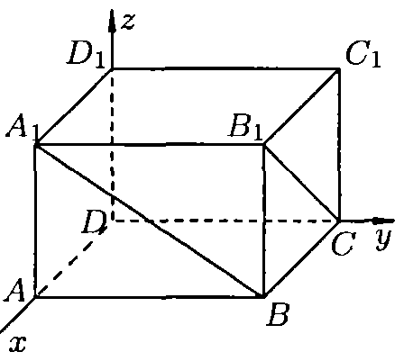
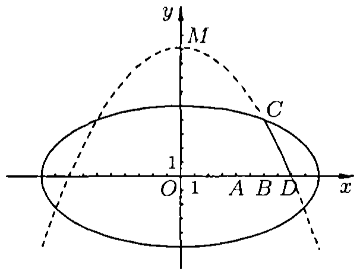
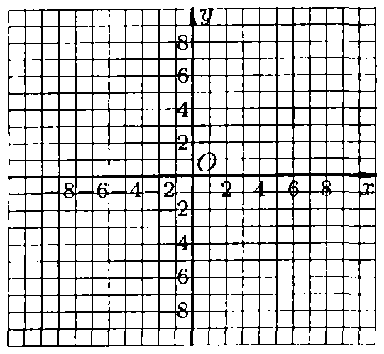
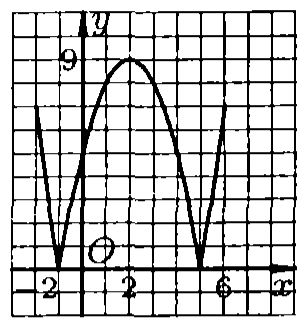

# 2006年上海卷（春）

## 填空题

### 第 1 题

计算：$\displaystyle\lim_{n\to\infty}\dfrac{3n-2}{4n+3}=$＿＿＿＿＿＿.

#### 答案

$\dfrac34$

#### 解析

将分子、分母同除以 $n$，得

$$

\frac{3n-2}{4n+3}=\frac{3-\frac2n}{4+\frac3n}

$$

当 $n\to\infty$ 时，$\frac2n\to0$，$\frac3n\to0$，所以

$$

\lim_{n\to\infty}\frac{3n-2}{4n+3}=\frac{3}{4}

$$

因此填 $\dfrac34$.

### 第 2 题

方程 $\log_3(2x-1)=1$ 的解 $x=$＿＿＿＿＿＿.

#### 答案

$2$

#### 解析

由对数的真数必须为正，得 $2x-1>0$. 由方程

$$

\log_3(2x-1)=1

$$

可得 $2x-1=3^1=3$，从而 $x=2$. 由于 $2>\frac12$，满足定义域条件，因此方程的解为 $2$.

### 第 3 题

函数 $f(x)=3x+5$（$x\in[0,1]$）的反函数 $f^{-1}(x)=$＿＿＿＿＿＿.

#### 答案

$\dfrac13(x-5)$，$x\in[5,8]$

#### 解析

设 $y=3x+5$，且 $0\le x\le1$. 因为一次函数 $3x+5$ 在 $[0,1]$ 上递增，所以其值域为 $[5,8]$. 由 $y=3x+5$ 解得

$$

x=\frac{y-5}{3}

$$

交换自变量和因变量，得到反函数 $f^{-1}(x)=\frac{x-5}{3}$，$x\in[5,8]$.

### 第 4 题

不等式 $\dfrac{1-2x}{x+1}>0$ 的解集是＿＿＿＿＿＿.

#### 答案

$\left(-1,\dfrac12\right)$

#### 解析

分式的分子、分母分别在 $x=\frac12$、$x=-1$ 处为零或无意义. 当 $x<-1$ 时，分子为正、分母为负，分式为负；当 $-1<x<\frac12$ 时，分子、分母均为正，分式为正；当 $x>\frac12$ 时，分子为负、分母为正，分式为负. 由于不等式要求分式大于零，且 $x=-1$ 不在定义域内、$x=\frac12$ 使分式等于零，故解集为 $\left(-1,\frac12\right)$.

### 第 5 题

已知圆 $C:(x+5)^2+y^2=r^2$（$r>0$）和直线 $l:3x+y+5=0$. 若圆 $C$ 与直线 $l$ 没有公共点，则 $r$ 的取值范围是＿＿＿＿＿＿.

#### 答案

$(0,\sqrt{10})$

#### 解析

圆心为 $C_0(-5,0)$. 圆心到直线 $l:3x+y+5=0$ 的距离为

$$

d=\frac{|3(-5)+0+5|}{\sqrt{3^2+1^2}}=\frac{10}{\sqrt{10}}=\sqrt{10}

$$

圆与直线没有公共点，当且仅当圆心到直线的距离大于半径，即 $r<\sqrt{10}$. 又已知 $r>0$，所以

$$

0<r<\sqrt{10}

$$

### 第 6 题

已知函数 $f(x)$ 是定义在 $(-\infty,+\infty)$ 上的偶函数. 当 $x\in(-\infty,0)$ 时，$f(x)=x-x^4$，则当 $x\in(0,+\infty)$ 时，$f(x)=$＿＿＿＿＿＿.

#### 答案

$-x-x^4$

#### 解析

当 $x>0$ 时，$-x<0$. 由偶函数的定义，$f(x)=f(-x)$. 将 $-x$ 代入已知的负半轴解析式，得

$$

f(x)=f(-x)=(-x)-(-x)^4=-x-x^4

$$

因此当 $x\in(0,+\infty)$ 时，$f(x)=-x-x^4$.

### 第 7 题

电视台连续播放 $6$ 个广告，其中含 $4$ 个不同的商业广告和 $2$ 个不同的公益广告，要求首尾必须播放公益广告，则共有＿＿＿＿＿＿ 种不同的播放方式（结果用数值表示）.

#### 答案

$48$

#### 解析

首、尾位置必须放置两个不同的公益广告，两个公益广告在首尾的排列方式有 $2!$ 种. 中间四个位置放置四个不同的商业广告，排列方式有 $4!$ 种. 因此播放方式共有

$$

2!\cdot4!=2\cdot24=48

$$

种.

### 第 8 题

正四棱锥底面边长为 $4$，侧棱长为 $3$，则其体积为＿＿＿＿＿＿.

#### 答案

$\dfrac{16}{3}$

#### 解析

设正四棱锥的顶点为 $S$，底面中心为 $O$，底面正方形的一个顶点为 $A$. 由于是正四棱锥，$SO\perp$ 底面，且

$$

OA=\frac{4\sqrt2}{2}=2\sqrt2

$$

在直角三角形 $SOA$ 中，侧棱 $SA=3$，所以

$$

SO=\sqrt{SA^2-OA^2}=\sqrt{3^2-(2\sqrt2)^2}=1

$$

底面积为 $4^2=16$，故体积为

$$

V=\frac13\cdot16\cdot1=\frac{16}{3}

$$

### 第 9 题

在 $\triangle ABC$ 中，已知 $BC=8$，$AC=5$，三角形面积为 $12$，则 $\cos2C=$＿＿＿＿＿＿.

#### 答案

$\dfrac{7}{25}$

#### 解析

由三角形面积公式

$$

12=\frac12\cdot AC\cdot BC\cdot\sin C
 =\frac12\cdot5\cdot8\cdot\sin C

$$

得 $\sin C=\frac35$. 因为 $C$ 是三角形内角，虽不能仅由正弦值确定 $\cos C$ 的正负，但有

$$

\cos^2C=1-\sin^2C=1-\frac9{25}=\frac{16}{25}

$$

于是

$$

\cos2C=2\cos^2C-1=2\cdot\frac{16}{25}-1=\frac7{25}

$$

### 第 10 题

若向量 $\boldsymbol{a}$，$\boldsymbol{b}$ 的夹角为 $150^\circ$，$|\boldsymbol{a}|=\sqrt3$，$|\boldsymbol{b}|=4$，则 $|2\boldsymbol{a}+\boldsymbol{b}|=$＿＿＿＿＿＿.

#### 答案

$2$

#### 解析

由向量夹角公式，

$$

\bs a\cdot\bs b=|\bs a|\,|\bs b|\cos150^\circ
 =\sqrt3\cdot4\cdot\left(-\frac{\sqrt3}{2}\right)=-6

$$

因此

$$

|2\bs a+\bs b|^2=4|\bs a|^2+4\bs a\cdot\bs b+|\bs b|^2=4\cdot3+4(-6)+16=4

$$

由于向量的模非负，得 $|2\bs a+\bs b|=2$.

### 第 11 题

已知直线 $l$ 过点 $P(2,1)$，且与 $x$ 轴，$y$ 轴的正半轴分别交于 $A$，$B$ 两点，$O$ 为坐标原点，则三角形 $OAB$ 面积的最小值为＿＿＿＿＿＿.

#### 答案

$4$

#### 解析

设直线与正半轴的交点为 $A(a,0)$、$B(0,b)$，其中 $a>0$、$b>0$. 直线方程为

$$

\frac{x}{a}+\frac{y}{b}=1

$$

点 $P(2,1)$ 在直线上，所以

$$

\frac2a+\frac1b=1

$$

令 $u=\frac2a$、$v=\frac1b$，则 $u>0$、$v>0$、$u+v=1$. 三角形面积为

$$

S_{\triangle OAB}=\frac12ab=\frac12\cdot\frac2u\cdot\frac1v=\frac1{uv}

$$

由 $u+v=1$ 及均值不等式，$uv\le\left(\frac{u+v}{2}\right)^2=\frac14$，故

$$

S_{\triangle OAB}\ge4

$$

当且仅当 $u=v=\frac12$，即 $a=4$、$b=2$ 时取等号. 所以面积的最小值为 $4$.

### 第 12 题

同学们都知道，在一次考试后，如果按顺序去掉一些高分，那么班级的平均分将降低；反之，如果按顺序去掉一些低分，那么班级的平均分将提高. 这两个事实可以用数学语言描述为：若有限数列 $a_1$，$a_2$，$\cdots$，$a_n$ 满足 $a_1\le a_2\le\cdots\le a_n$，则（结论用数学式子表示）＿＿＿＿＿＿.

#### 答案

$\dfrac{a_1+a_2+\cdots+a_m}{m}\le\dfrac{a_1+a_2+\cdots+a_n}{n}$（$1\le m<n$），且 $\dfrac{a_{m+1}+a_{m+2}+\cdots+a_n}{n-m}\ge\dfrac{a_1+a_2+\cdots+a_n}{n}$（$1\le m<n$）.

#### 解析

取任意 $1\le m<n$. 因为 $a_1\le\cdots\le a_m\le a_{m+1}\le\cdots\le a_n$，所以

$$

\frac{a_1+\cdots+a_m}{m}\le a_m\le a_{m+1}\le\frac{a_{m+1}+\cdots+a_n}{n-m}

$$

记前一部分的平均数为 $u$，后一部分的平均数为 $v$，则 $u\le v$. 全部数列的平均数是两部分平均数按项数加权的平均：

$$

\frac{a_1+\cdots+a_n}{n}=\frac{m}{n}u+\frac{n-m}{n}v

$$

因此 $u\le\frac{m}{n}u+\frac{n-m}{n}v\le v$，即 $\frac{a_1+\cdots+a_m}{m}\le\frac{a_1+\cdots+a_n}{n}$，$\frac{a_{m+1}+\cdots+a_n}{n-m}\ge\frac{a_1+\cdots+a_n}{n}$.

## 单选题

### 第 13 题

抛物线 $y^2=4x$ 的焦点坐标为（）

A.  
$(0,1)$

B.  
$(1,0)$

C.  
$(0,2)$

D.  
$(2,0)$

#### 答案

B

#### 解析

抛物线的标准形式为 $y^2=2px$，其焦点为 $\left(\frac p2,0\right)$. 由 $y^2=4x$ 得 $2p=4$，所以 $p=2$，焦点为 $(1,0)$，对应选项 B.

### 第 14 题

若 $a$，$b$，$c\in\mathbb{R}$，$a>b$，则下列不等式成立的是（）

A.  
$\dfrac1a<\dfrac1b$

B.  
$a^2>b^2$

C.  
$\dfrac{a}{c^2+1}>\dfrac{b}{c^2+1}$

D.  
$a|c|>b|c|$

#### 答案

C

#### 解析

因为 $c^2+1>0$，所以不等式 $a>b$ 两边同除以 $c^2+1$ 后方向不变，恒有

$$

\frac{a}{c^2+1}>\frac{b}{c^2+1}

$$

故选项 C 一定成立. 其余选项不恒成立：取 $a=1$，$b=-1$ 可否定 A，取 $a=-1$，$b=-2$ 可否定 B，取 $c=0$ 可否定 D. 因此选 C.

### 第 15 题

若 $k\in\mathbb{R}$，则“$k>3$”是“方程 $\dfrac{x^2}{k-3}-\dfrac{y^2}{k+3}=1$ 表示双曲线”的（）

A.  
充分不必要条件

B.  
必要不充分条件

C.  
充要条件

D.  
既不充分也不必要条件

#### 答案

A

#### 解析

当 $k>3$ 时，$k-3>0$、$k+3>0$，方程可写为

$$

\frac{x^2}{k-3}-\frac{y^2}{k+3}=1

$$

这是实轴在 $x$ 轴上的双曲线，所以 $k>3$ 是充分条件.

但它不是必要条件. 例如取 $k=-4$，则

$$

\frac{x^2}{-7}-\frac{y^2}{-1}=1
\quad\Longleftrightarrow\quad
\frac{y^2}{1}-\frac{x^2}{7}=1

$$

仍表示双曲线，而 $-4\not>3$. 因此“$k>3$”是“方程表示双曲线”的充分不必要条件，选 A.

### 第 16 题

若集合 $A=\left\{y\mid y=x^{\frac13},-1\le x\le1\right\}$，$B=\left\{y\mid y=2-\dfrac1x,0<x\le1\right\}$，则 $A\cap B$ 等于（）

A.  
$(-\infty,1]$

B.  
$[-1,1]$

C.  
$\varnothing$

D.  
$\{1\}$

#### 答案

B

#### 解析

因为函数 $y=x^{\frac13}$ 在实数集上递增，且 $-1\le x\le1$，所以

$$

A=\left[-1,1\right]

$$

对 $B$，当 $0<x\le1$ 时，$\frac1x\ge1$，从而 $2-\frac1x\le1$. 当 $x\to0^+$ 时，$2-\frac1x\to-\infty$，且在 $x=1$ 时取到最大值 $1$，所以

$$

B=(-\infty,1]

$$

于是

$$

A\cap B=[-1,1]

$$

故选 B.

## 解答题

### 第 17 题

在长方体 $ABCD-A_1B_1C_1D_1$ 中，已知 $DA=DC=4$，$DD_1=3$，求异面直线 $A_1B$ 与 $B_1C$ 所成角的大小（结果用反三角函数值表示）.

#### 解析

【法一】连接 $A_1D$. 因为 $A_1D\parallel B_1C$，所以 $\angle BA_1D$ 为异面直线 $A_1B$ 与 $B_1C$ 所成的角. 连接 $BD$. 在 $\triangle A_1DB$ 中，$A_1B=A_1D=5$，$BD=4\sqrt2$，故

$$

\cos\angle BA_1D=\dfrac{A_1B^2+A_1D^2-BD^2}{2A_1B\cdot A_1D}=\dfrac{25+25-32}{2\cdot5\cdot5}=\dfrac{9}{25}

$$

因此，异面直线 $A_1B$ 与 $B_1C$ 所成角的大小为 $\arccos\dfrac{9}{25}$.

【法二】以 $D$ 为坐标原点，分别以 $DA$，$DC$，$DD_1$ 所在直线为 $x$ 轴，$y$ 轴，$z$ 轴，建立空间直角坐标系. 则 $A_1(4,0,3)$，$B(4,4,0)$，$B_1(4,4,3)$，$C(0,4,0)$，从而 $\overrightarrow{A_1B}=(0,4,-3)$，$\overrightarrow{B_1C}=(-4,0,-3)$.

设 $\overrightarrow{A_1B}$ 与 $\overrightarrow{B_1C}$ 的夹角为 $\theta$，则 $\cos\theta=\dfrac{\overrightarrow{A_1B}\cdot\overrightarrow{B_1C}}{|\overrightarrow{A_1B}|\cdot|\overrightarrow{B_1C}|}=\dfrac{9}{25}$. 因此，异面直线 $A_1B$ 与 $B_1C$ 所成角的大小为 $\arccos\dfrac{9}{25}$.

### 第 18 题

已知复数 $w$ 满足 $w-4=(3-2w)\i$（$\i$ 为虚数单位），$z=\dfrac{5}{w}+|w-2|$，求一个以 $z$ 为根的实系数一元二次方程.

#### 解析

【法一】因为 $w(1+2\i)=4+3\i$，所以 $w=\dfrac{4+3\i}{1+2\i}=2-\i$. 从而 $z=\dfrac{5}{2-\i}+|-\i|=3+\i$. 若实系数一元二次方程有虚根 $z=3+\i$，则必有共轭虚根 $\bar z=3-\i$. 又 $z+\bar z=6$，$z\bar z=10$，所以所求的一个一元二次方程可以是 $x^2-6x+10=0$.

【法二】设 $w=a+b\i$（$a$，$b\in\mathbb{R}$）. 由 $a+b\i-4=3\i-2a\i+2b$ 得

$$

\begin{cases}
a-4=2b,\\
b=3-2a.
\end{cases}

$$

解得

$$

\begin{cases}
a=2,\\
b=-1.
\end{cases}

$$

故 $w=2-\i$. 以下同【法一】所求的一个一元二次方程可以是 $x^2-6x+10=0$.

### 第 19 题

已知函数 $f(x)=2\sin\left(x+\dfrac{\pi}{6}\right)-2\cos x$，$x\in\left[\dfrac{\pi}{2},\pi\right]$.

1.  若 $\sin x=\dfrac45$，求函数 $f(x)$ 的值；

2.  求函数 $f(x)$ 的值域.

#### 解析

1.  因为 $\sin x=\dfrac45$，且 $x\in\left[\dfrac{\pi}{2},\pi\right]$，所以 $\cos x=-\dfrac35$. 又 $f(x)=2\left(\dfrac{\sqrt3}{2}\sin x+\dfrac12\cos x\right)-2\cos x=\sqrt3\sin x-\cos x$，故 $f(x)=\dfrac{4\sqrt3}{5}+\dfrac35$.

2.  由 $f(x)=2\sin\left(x-\dfrac{\pi}{6}\right)$，且 $x\in\left[\dfrac{\pi}{2},\pi\right]$，得 $\dfrac{\pi}{3}\le x-\dfrac{\pi}{6}\le\dfrac{5\pi}{6}$. 因此 $\dfrac12\le \sin\left(x-\dfrac{\pi}{6}\right)\le1$，从而函数 $f(x)$ 的值域为 $[1,2]$.

### 第 20 题

学校科技小组在计算机上模拟航天器变轨返回试验. 设计方案如图：航天器运行（按顺时针方向）的轨迹方程为 $\dfrac{x^2}{100}+\dfrac{y^2}{25}=1$，变轨（即航天器运行轨迹由椭圆变为抛物线）后返回的轨迹是以 $y$ 轴为对称轴，$M\left(0,\dfrac{64}{7}\right)$ 为顶点的抛物线的实线部分，降落点为 $D(8,0)$. 观测点 $A(4,0)$，$B(6,0)$ 同时跟踪航天器.

1.  求航天器变轨后的运行轨迹所在的曲线方程；

2.  当航天器在 $x$ 轴上方时，观测点 $A$，$B$ 测得离航天器的距离分别为多少时，应向航天器发出变轨指令？

#### 解析

1.  设曲线方程为 $y=ax^2+\dfrac{64}{7}$. 由题意知抛物线过点 $D(8,0)$，故 $0=64a+\dfrac{64}{7}$，所以 $a=-\dfrac17$. 因此，航天器变轨后的运行轨迹所在的曲线方程为 $y=-\dfrac17x^2+\dfrac{64}{7}$.

1.  设变轨点为 $C(x,y)$. 由题意可知

$$

\begin{cases}
    \dfrac{x^2}{100}+\dfrac{y^2}{25}=1,\\
    y=-\dfrac17x^2+\dfrac{64}{7}.
    \end{cases}

$$

    消去 $x$ 得 $4y^2-7y-36=0$，故 $y=4$ 或 $y=-\dfrac94$. 因为航天器在 $x$ 轴上方，所以 $y=4$. 再代回得 $x=6$ 或 $x=-6$. 结合图形取 $x=6$，故 $C(6,4)$.

    于是 $|AC|=\sqrt{(6-4)^2+4^2}=2\sqrt5$，$|BC|=\sqrt{(6-6)^2+4^2}=4$. 答：当观测点 $A$，$B$ 测得离航天器的距离分别为 $2\sqrt5$ 和 $4$ 时，应向航天器发出变轨指令.

### 第 21 题

设函数 $f(x)=|x^2-4x-5|$.

1.  在区间 $[-2,6]$ 上画出函数 $f(x)$ 的图象；

2.  设集合 $A=\{x\mid f(x)\ge5\}$，$B=(-\infty,-2]\cup[0,4]\cup[6,+\infty)$. 试判断集合 $A$ 和 $B$ 之间的关系，并给出证明；

3.  当 $k>2$ 时，求证：在区间 $[-1,5]$ 上，$y=k(x+3)$ 的图象位于函数 $f(x)$ 图象的上方.

#### 解析

1.  函数 $y=x^2-4x-5$ 的零点为 $-1,5$，顶点为 $(2,-9)$. 因此，在区间 $[-2,6]$ 上，函数 $f(x)=|x^2-4x-5|$ 的图象由抛物线 $y=x^2-4x-5$ 在 $x\le-1$ 与 $x\ge5$ 部分，以及其在 $[-1,5]$ 上关于 $x$ 轴对称所得的曲线组成.

1.  方程 $f(x)=5$ 的解分别是 $2-\sqrt{14}$，$0$，$4$，$2+\sqrt{14}$. 由于 $f(x)$ 在 $(-\infty,-1]$ 和 $[2,5]$ 上单调递减，在 $[-1,2]$ 和 $[5,+\infty)$ 上单调递增，所以 $A=(-\infty,2-\sqrt{14}]\cup[0,4]\cup[2+\sqrt{14},+\infty)$. 又因为 $2+\sqrt{14}<6$，$2-\sqrt{14}>-2$，所以 $B\subset A$.

2.  【法一】当 $x\in[-1,5]$ 时，$f(x)=-(x^2-4x-5)=-x^2+4x+5$. 令

$$

g(x)=k(x+3)-f(x)=x^2+(k-4)x+(3k-5)=\left(x-\dfrac{4-k}{2}\right)^2-\dfrac{k^2-20k+36}{4}

$$

    因为 $k>2$，所以 $\dfrac{4-k}{2}<1$.

    1.  当 $-1\le\dfrac{4-k}{2}<1$，即 $2<k\le6$ 时，取 $x=\dfrac{4-k}{2}$，则 $g(x)_{\min}=-\dfrac{k^2-20k+36}{4}=-\dfrac14\bigl[(k-10)^2-64\bigr]$. 因为 $16\le(k-10)^2<64$，所以 $g(x)_{\min}>0$.

    2.  当 $\dfrac{4-k}{2}<-1$，即 $k>6$ 时，取 $x=-1$，则 $g(x)_{\min}=2k>0$.

    由上述两种情况可知，当 $k>2$ 时，$g(x)>0$（$x\in[-1,5]$）. 因此，在区间 $[-1,5]$ 上，$y=k(x+3)$ 的图象位于函数 $f(x)$ 图象的上方.

    【法二】当 $x\in[-1,5]$ 时，$f(x)=-x^2+4x+5$. 联立

$$

\begin{cases}
    y=k(x+3),\\
    y=-x^2+4x+5
    \end{cases}

$$

    得 $x^2+(k-4)x+(3k-5)=0$. 令 $\Delta=(k-4)^2-4(3k-5)=0$，解得 $k=2$ 或 $k=18$. 在区间 $[-1,5]$ 上，当 $k=2$ 时，直线 $y=2(x+3)$ 与函数 $f(x)$ 的图象只交于一点 $(1,8)$；当 $k=18$ 时，直线 $y=18(x+3)$ 与函数 $f(x)$ 的图象没有交点.

    又直线 $y=k(x+3)$ 过点 $(-3,0)$，当 $k>2$ 时，它由直线 $y=2(x+3)$ 绕点 $(-3,0)$ 逆时针方向旋转得到，所以在区间 $[-1,5]$ 上，$y=k(x+3)$ 的图象位于函数 $f(x)$ 图象的上方.

### 第 22 题

已知数列 $a_1$，$a_2$，$\cdots$，$a_{30}$，其中 $a_1$，$a_2$，$\cdots$，$a_{10}$ 是首项为 $1$，公差为 $1$ 的等差数列；$a_{10}$，$a_{11}$，$\cdots$，$a_{20}$ 是公差为 $d$ 的等差数列；$a_{20}$，$a_{21}$，$\cdots$，$a_{30}$ 是公差为 $d^2$ 的等差数列（$d\ne0$）.

1.  若 $a_{20}=40$，求 $d$；

2.  试写出 $a_{30}$ 关于 $d$ 的关系式，并求 $a_{30}$ 的取值范围；

3.  续写已知数列，使得 $a_{30}$，$a_{31}$，$\cdots$，$a_{40}$ 是公差为 $d^3$ 的等差数列，……，依次类推，把已知数列推广为无穷数列. 提出同第 $2$ 问类似的问题，并使第 $2$ 问作为特例进行研究，你能得到什么样的结论？

#### 解析

1.  $a_{10}=10$. 又 $a_{20}=10+10d=40$，所以 $d=3$.

2.  由题意，$a_{30}=a_{20}+10d^2=10(1+d+d^2)$（$d\ne0$）. 于是 $a_{30}=10\left[\left(d+\dfrac12\right)^2+\dfrac34\right]$. 当 $d\in(-\infty,0)\cup(0,+\infty)$ 时，$a_{30}\in\left[\dfrac{15}{2},+\infty\right)$.

3.  所给数列可推广为无穷数列 $\{a_n\}$. 其中 $a_1$，$a_2$，$\cdots$，$a_{10}$ 是首项为 $1$，公差为 $1$ 的等差数列；当 $n\ge1$ 时，数列 $a_{10n}$，$a_{10n+1}$，$\cdots$，$a_{10(n+1)}$ 是公差为 $d^n$ 的等差数列.

    研究的问题可以是：试写出 $a_{10(n+1)}$ 关于 $d$ 的关系式，并在 $d\ne0$ 的条件下求 $a_{10(n+1)}$ 的取值范围，其中 $n$ 为正整数.

    每个长度为 10 的等差数列区段包含 10 个公差，因此对 $n\ge1$ 有递推关系 $a_{10(n+1)}=a_{10n}+10d^n$，$a_{10}=10$. 逐项展开可得

$$

a_{10(n+1)}=10(1+d+\cdots+d^n)=
    \begin{cases}
    10\times\dfrac{1-d^{n+1}}{1-d}, & d\ne1,\\
    10(n+1), & d=1.
    \end{cases}

$$

    令 $F_n(d)=10(1+d+\cdots+d^n)$. 当 $n=2$ 时，$F_2(d)=10\left[\left(d+\dfrac12\right)^2+\dfrac34\right]$，所以 $F_2(d)$ 的取值范围为 $\left[\dfrac{15}{2},+\infty\right)$，正好得到第 $2$ 问的结论.

    下面研究一般的固定正整数 $n$. 若 $n$ 为奇数，则

$$

F_n(d)-10=10d(1+d+\cdots+d^{n-1})

$$

    当 $d=1$ 时，$1+d+\cdots+d^{n-1}=n>0$；当 $d\ne1$ 时，

$$

1+d+\cdots+d^{n-1}=\frac{d^n-1}{d-1}>0

$$

    这里不等号成立是因为 $n$ 为奇数：当 $d<0$ 时分子、分母均为负；当 $0<d<1$ 时分子、分母也均为负；当 $d>1$ 时分子、分母均为正. 所以 $F_n(d)<10$（$d<0$）或 $F_n(d)>10$（$d>0$）. 又当 $d\to-\infty$ 时 $F_n(d)\to-\infty$，当 $d\to0^-$ 时 $F_n(d)\to10$，由连续性可知负数 $d$ 对应的取值范围为 $(-\infty,10)$；同理，正数 $d$ 对应的取值范围为 $(10,+\infty)$. 因而当 $n$ 为奇数时，

$$

F_n(d)\in(-\infty,10)\cup(10,+\infty)

$$

    若 $n$ 为偶数，则 $F_n(d)$ 是偶次多项式，且首项系数为正，所以当 $|d|\to+\infty$ 时 $F_n(d)\to+\infty$，从而它在实数集上有最小值. 记

$$

m_n=10\min_{d\in\mathbb{R}}(1+d+\cdots+d^n)

$$

    去掉题设不允许的 $d=0$ 不会改变值域，因为 $F_n(0)=10$，而 $n$ 为偶数时 $F_n(-1)=10$. 因此当 $n$ 为偶数时，

$$

F_n(d)\in[m_n,+\infty)

$$

    最小值点满足

$$

1+2d+3d^2+\cdots+nd^{n-1}=0

$$

    综上，推广后的结论是：

$$

a_{10(n+1)}\in
    \begin{cases}
    (-\infty,10)\cup(10,+\infty), & n\text{为奇数},\\
    [m_n,+\infty), & n\text{为偶数},
    \end{cases}
    \qquad d\ne0

$$

    其中 $m_n=10\min_{d\in\mathbb{R}}(1+d+\cdots+d^n)$. 当 $n=2$ 时，$m_2=\dfrac{15}{2}$，故确实包含第 $2$ 问作为特例.
