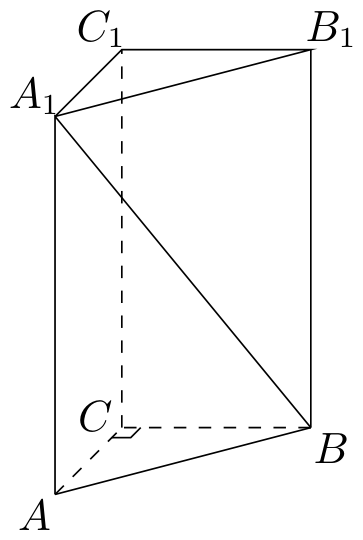
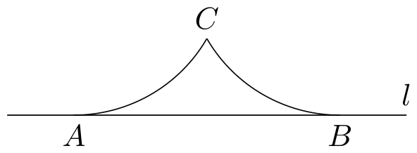
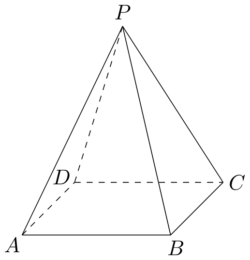
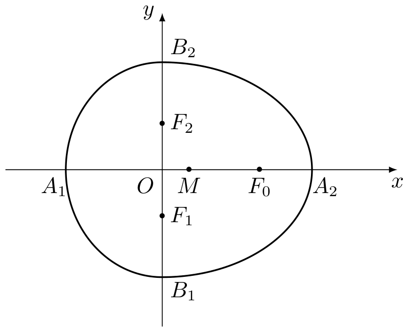

# 2007年上海卷（秋文）

## 填空题

### 第 1 题

方程 $3^{x-1} = \frac{1}{9}$ 的解是＿＿＿＿＿＿.

#### 答案

$-1$

#### 解析

因为 $\frac{1}{9}=3^{-2}$，所以 $3^{x-1}=3^{-2}$，从而 $x-1=-2$，解得 $x=-1$.

### 第 2 题

函数 $f(x)=\frac{1}{x-1}$ 的反函数 $f^{-1}(x)=$＿＿＿＿＿＿.

#### 答案

$\frac{x+1}{x}$（$x\neq0$）

#### 解析

设 $y=f(x)=\frac{1}{x-1}$，则 $y\neq0$，且 $x-1=\frac{1}{y}$，所以 $x=1+\frac{1}{y}=\frac{y+1}{y}$. 因而 $f^{-1}(x)=\frac{x+1}{x}$，定义域为 $x\neq0$.

### 第 3 题

直线 $4x + y - 1 = 0$ 的倾斜角 $\theta =$＿＿＿＿＿＿.

#### 答案

$\pi-\arctan4$

#### 解析

直线方程化为 $y=-4x+1$，斜率为 $-4$. 设直线的倾斜角为 $\theta$，则 $0\leqslant\theta<\pi$，且 $\tan\theta=-4$. 因为 $\arctan4\in\left(0,\frac{\pi}{2}\right)$，所以 $\theta=\pi-\arctan4$.

### 第 4 题

函数 $y = \sec x \cdot \cos \left( x + \frac{\pi}{2} \right)$ 的最小正周期 $T =$＿＿＿＿＿＿.

#### 答案

$\pi$

#### 解析

在函数的定义域 $\cos x\neq0$ 上，

$$

y=\sec x\cdot\cos\left(x+\frac{\pi}{2}\right)=\frac{1}{\cos x}(-\sin x)=-\tan x

$$

正切函数的最小正周期为 $\pi$，所以该函数的最小正周期为 $T=\pi$.

### 第 5 题

以双曲线 $\frac{x^2}{4} - \frac{y^2}{5} = 1$ 的中心为顶点，且以该双曲线的右焦点为焦点的抛物线方程是＿＿＿＿＿＿.

#### 答案

$y^2=12x$

#### 解析

双曲线的半实轴长为 $2$，半虚轴长为 $\sqrt{5}$，所以其焦半距满足 $c_0^2=2^2+\left(\sqrt{5}\right)^2=9$，右焦点为 $(3,0)$. 以双曲线的中心 $(0,0)$ 为顶点、以 $(3,0)$ 为焦点的抛物线满足 $p=3$，故其标准方程为 $y^2=4px=12x$.

### 第 6 题

若向量 $\boldsymbol{a}$，$\boldsymbol{b}$ 的夹角为 $60^{\circ}$，$|\boldsymbol{a}| = |\boldsymbol{b}| = 1$，则 $\boldsymbol{a}\cdot (\boldsymbol{a}- \boldsymbol{b}) =$＿＿＿＿＿＿.

#### 答案

$\frac{1}{2}$

#### 解析

由数量积公式，

$$

\boldsymbol{a}\cdot(\boldsymbol{a}-\boldsymbol{b})=\boldsymbol{a}\cdot\boldsymbol{a}-\boldsymbol{a}\cdot\boldsymbol{b}=|\boldsymbol{a}|^2-|\boldsymbol{a}|\,|\boldsymbol{b}|\cos60^{\circ}=1-\frac{1}{2}=\frac{1}{2}

$$

### 第 7 题

如图，在直三棱柱 $ABC - A_{1}B_{1}C_{1}$ 中，$\angle ACB = 90^{\circ}$，$AA_{1} = 2$，$AC = BC = 1$，则异面直线 $A_{1}B$ 与 $AC$ 所成角的大小是＿＿＿＿＿＿.（结果用反三角函数值表示）

#### 答案

$\arccos\frac{\sqrt{6}}{6}$

#### 解析

取 $C$ 为原点，令 $A=(1,0,0)$，$B=(0,1,0)$，则可取 $A_{1}=(1,0,2)$. 因而 $\overrightarrow{A_{1}B}=(-1,1,-2)$，$\overrightarrow{AC}=(-1,0,0)$. 设异面直线 $A_{1}B$ 与 $AC$ 所成的锐角为 $\theta$，则

$$

\cos\theta=\frac{\left|\overrightarrow{A_{1}B}\cdot\overrightarrow{AC}\right|}{|\overrightarrow{A_{1}B}|\,|\overrightarrow{AC}|}=\frac{1}{\sqrt{6}}=\frac{\sqrt{6}}{6}

$$

所以 $\theta=\arccos\frac{\sqrt{6}}{6}$.

### 第 8 题

某工程由 $A$，$B$，$C$，$D$ 四道工序组成，完成它们需用时间依次为 $2\text{ 天}$，$5\text{ 天}$，$x\text{ 天}$，$4\text{ 天}$. 四道工序的先后顺序及相互关系是： $A$，$B$ 可以同时开工； $A$ 完成后，$C$ 可以开工； $BC$ 完成后，$D$ 可以开工. 若该工程总时数为 $9$ 天，则完成工序 $C$ 需要的天数 $x$ 最大是＿＿＿＿＿＿.

#### 答案

$3$

#### 解析

令 $A$、$B$ 同时在时刻 $0$ 开工，则工序 $A$ 在时刻 $2$ 完成，工序 $B$ 在时刻 $5$ 完成. 工序 $C$ 需在 $A$ 完成后开工，因此最早在时刻 $2$ 开工，并在时刻 $2+x$ 完成. 工序 $D$ 需在 $B$、$C$ 都完成后开工，所以工程完成时刻为

$$

\max\{5,2+x\}+4

$$

由总时数为 $9$ 天，得 $\max\{5,2+x\}=5$，从而 $2+x\leqslant5$，即 $x\leqslant3$. 因而 $x$ 的最大值为 $3$.

### 第 9 题

在五个数字 $1$，$2$，$3$，$4$，$5$ 中，若随机取出三个数字，则剩下两个数字都是奇数的概率是＿＿＿＿＿＿.（结果用数值表示）

#### 答案

$0.3$

#### 解析

从五个数字中随机取出三个数字，共有 $\mathrm C_5^3=10$ 种等可能结果. 若剩下的两个数字都是奇数，则剩下的两个数字应从 $1$，$3$，$5$ 中选取，共有 $\mathrm C_3^2=3$ 种结果. 所求概率为

$$

\frac{\mathrm C_3^2}{\mathrm C_5^3}=\frac{3}{10}=0.3

$$

### 第 10 题

对于非零实数 $a$，$b$，以下四个命题都成立：

1.  $a + \frac{1}{a} \neq 0$；

2.  $(a + b)^2 = a^2 + 2ab + b^2$；

3.  若 $|a| = |b|$，则 $a = \pm b$；

4.  若 $a^2 = ab$，则 $a = b$.

那么，对于非零复数 $a$，$b$，仍然成立的命题的所有序号是＿＿＿＿＿＿.

#### 答案

$\textcircled{2}\textcircled{4}$

#### 解析

命题 $1$ 在复数范围内不一定成立. 例如取 $a=\i$，则 $a+\frac{1}{a}=\i-\i=0$.

命题 $2$ 中，$(a+b)^2=(a+b)(a+b)=a^2+ab+ba+b^2=a^2+2ab+b^2$，所以对任意复数 $a$，$b$ 都成立.

命题 $3$ 不一定成立. 例如取 $a=1$，$b=\i$，则 $|a|=|b|=1$，但 $a\neq b$ 且 $a\neq-b$.

命题 $4$ 中，由 $a^2=ab$ 得 $a(a-b)=0$. 因为 $a\neq0$，所以 $a=b$，对任意非零复数仍成立. 因此仍然成立的命题序号为 $2$、$4$.

### 第 11 题

如图，$AB$ 是直线 $l$ 上的两点，且 $AB = 2$. 两个半径相等的动圆分别与 $l$ 相切于 $A$，$B$ 点，$C$ 是这两个圆的公共点，则圆弧 $AC$，$CB$ 与线段 $AB$ 围成图形面积 $S$ 的取值范围是＿＿＿＿＿＿.

#### 答案

$\left(0,2-\frac{\pi}{2}\right]$

#### 解析

设两个圆的半径为 $r$. 取 $A=(0,0)$，$B=(2,0)$，则两个圆心可取为 $O_{1}=(0,r)$、$O_{2}=(2,r)$. 两圆有公共点的必要条件为 $r\geqslant1$. 记 $h=\sqrt{r^2-1}$，则图中位于两圆之间的公共点为 $C=(1,r-h)$. 令 $\alpha=\arcsin\frac{1}{r}$，且 $0<\alpha\leqslant\frac{\pi}{2}$. 在等腰三角形 $O_{1}AC$ 中，圆心角 $\angle AO_{1}C=\alpha$. 由 $O_{1}A=(0,-r)$、$O_{1}C=(1,-h)$ 可得 $\cos\alpha=\frac{h}{r}$，从而 $\sin\alpha=\frac{1}{r}$. 由对称性，所围图形的面积等于三角形 $ABC$ 的面积减去两个相同的弓形面积. 其中

$$

\frac{1}{2}AB\cdot(r-h)=r-h

$$

每个弓形面积为扇形面积减去三角形面积，即

$$

\frac{1}{2}r^2\alpha-\frac{1}{2}r^2\sin\alpha

$$

因此

$$

S=r-h-r^2\left(\alpha-\sin\alpha\right)=2r-\sqrt{r^2-1}-r^2\arcsin\frac{1}{r}

$$

当 $r=1$ 时，$S=2-\frac{\pi}{2}$. 对 $r>1$，求导得

$$

S'(r)=2-\frac{r}{\sqrt{r^2-1}}-2r\arcsin\frac{1}{r}+\frac{r}{\sqrt{r^2-1}}=2-2r\arcsin\frac{1}{r}<0

$$

其中，对 $0<u<1$，有 $(\arcsin u)'=\frac{1}{\sqrt{1-u^2}}>1$，且 $\arcsin0=0$，所以 $\arcsin u>u$. 取 $u=\frac{1}{r}$，即得 $r\arcsin\frac{1}{r}>1$. 所以 $S$ 在 $[1,+\infty)$ 上递减. 当 $r\to+\infty$ 时，公共点 $C$ 的纵坐标 $r-\sqrt{r^2-1}$ 趋于 $0$，从而 $S\to0$. 因此

$$

0<S\leqslant2-\frac{\pi}{2}

$$

## 单选题

### 第 12 题

已知 $a\in\mathbb{R}$，$b\in\mathbb{R}$，且 $2 + a\i$，$b + 3\i$（$\i$ 是虚数单位）是一个实系数一元二次方程的两个根，那么 $a$，$b$ 的值分别是（）

A.  
$a=-3$，$b=2$

B.  
$a=3$，$b=-2$

C.  
$a=-3$，$b=-2$

D.  
$a=3$，$b=2$

#### 答案

A

#### 解析

实系数一元二次方程的非实根成共轭复数对. 因为 $2+a\i$ 与 $b+3\i$ 是两个根，所以

$$

b+3\i=2-a\i

$$

比较实部和虚部，得 $b=2$，$3=-a$，即 $a=-3$. 因此选 A.

### 第 13 题

圆 $x^{2} + y^{2} - 2x - 1 = 0$ 关于直线 $2x - y + 3 = 0$ 对称的圆的方程是（）

A.  
$(x + 3)^2 + (y - 2)^2 = \frac{1}{2}$

B.  
$(x - 3)^2 + (y + 2)^2 = \frac{1}{2}$

C.  
$(x + 3)^2 + (y - 2)^2 = 2$

D.  
$(x - 3)^2 + (y + 2)^2 = 2$

#### 答案

C

#### 解析

原圆方程可化为

$$

(x-1)^2+y^2=2

$$

所以圆心为 $O=(1,0)$，半径为 $\sqrt{2}$. 设 $O$ 关于直线 $2x-y+3=0$ 的对称点为 $O'=(x',y')$. 由点关于直线的对称公式，$x'=1-\frac{2\cdot2(2\cdot1-0+3)}{2^2+(-1)^2}=-3$，$y'=0-\frac{2\cdot(-1)(2\cdot1-0+3)}{2^2+(-1)^2}=2$. 对称后的圆半径不变，故方程为

$$

(x+3)^2+(y-2)^2=2

$$

因此选 C.

### 第 14 题

数列 $\{a_{n}\}$ 中，

$$

a_{n} = \begin{cases}
\frac{1}{n^{2}}, & 1 \leqslant n \leqslant 1000,\\
\frac{n^{2}}{n^{2} - 2n}, & n \geqslant 1001,
\end{cases}

$$

则数列 $\{a_{n}\}$ 的极限值（）

A.  
等于 0

B.  
等于 1

C.  
等于 0 或 1

D.  
不存在

#### 答案

B

#### 解析

前 $1000$ 项只改变数列的有限项，不影响极限. 当 $n\geqslant1001$ 时，

$$

a_n=\frac{n^2}{n^2-2n}=\frac{1}{1-\frac{2}{n}}

$$

因为 $\displaystyle\lim_{n\to\infty}\frac{2}{n}=0$，所以

$$

\lim_{n\to\infty}a_n=\frac{1}{1-0}=1

$$

因此选 B.

### 第 15 题

设 $f(x)$ 是定义在正整数集上的函数，且 $f(x)$ 满足：“当 $f(k) \geq k^2$ 成立时，总可推出 $f(k+1) \geq (k+1)^2$ 成立”. 那么，下列命题总成立的是（）

A.  
若 $f(1) < 1$ 成立，则 $f(10) < 100$ 成立

B.  
若 $f(2) < 4$ 成立，则 $f(1) \geqslant 1$ 成立

C.  
若 $f(3) \geqslant 9$ 成立，则当 $k \geqslant 1$ 时，均有 $f(k) \geqslant k^2$ 成立

D.  
若 $f(4) \geqslant 25$ 成立，则当 $k \geqslant 4$ 时，均有 $f(k) \geqslant k^2$ 成立

#### 答案

D

#### 解析

记命题 $P_k$ 为 $f(k)\geqslant k^2$. 题设条件是对每个正整数 $k$，均有 $P_k\mathbb{R}ightarrow P_{k+1}$.

若 $f(4)\geqslant25$，则必有 $f(4)\geqslant16=4^2$，即 $P_4$ 成立. 由题设可推出 $P_5$，再依次推出 $P_6$，$P_7$，$\ldots$，所以当 $k\geqslant4$ 时均有 $f(k)\geqslant k^2$. 因此第四个命题总成立.

其余选项均不能由题设条件推出. 对于选项 A，令 $f(1)=0$，且当 $k\geqslant2$ 时 $f(k)=k^2$，则题设递推条件成立，但 $f(1)<1$ 且 $f(10)=100$，所以 A 不成立. 对于选项 B，令 $f(k)=0$（$k\geqslant1$），则题设递推条件因前件永不成立而成立，但 $f(2)<4$ 且 $f(1)<1$，所以 B 不成立. 对于选项 C，令 $f(1)=f(2)=0$，且当 $k\geqslant3$ 时 $f(k)=k^2$，则题设递推条件成立，$f(3)\geqslant9$ 成立，但 $f(1)\geqslant1$ 不成立，所以 C 不成立.

## 解答题

### 第 16 题

在正四棱锥 $P - ABCD$ 中，$PA = 2$，直线 $PA$ 与平面 $ABCD$ 所成的角为 $60^{\circ}$，求正四棱锥 $P - ABCD$ 的体积 $V$.

#### 解析

设正四棱锥的高为 $PO$，其中 $O$ 是正方形 $ABCD$ 的中心. 连接 $AO$，则 $PO\perp$ 平面 $ABCD$，且 $AO$ 是 $PA$ 在底面上的射影，所以 $\angle PAO=60^{\circ}$. 在直角三角形 $PAO$ 中，

$\sin\angle PAO=\frac{PO}{PA}$，$\cos\angle PAO=\frac{AO}{PA}$. 因此 $PO=PA\sin60^{\circ}=2\cdot\frac{\sqrt{3}}{2}=\sqrt{3}$，$AO=PA\cos60^{\circ}=2\cdot\frac{1}{2}=1$. 设正方形边长为 $s$，则 $AO$ 是其对角线的一半，故 $AO=\frac{\sqrt{2}}{2}s$，从而 $s=\sqrt{2}$. 底面积为 $s^2=2$，所以

$$

V=\frac{1}{3}s^2\cdot PO=\frac{1}{3}\cdot2\cdot\sqrt{3}=\frac{2\sqrt{3}}{3}

$$

### 第 17 题

在 $\triangle ABC$ 中，$a$，$b$，$c$ 分别是三个内角 $A$，$B$，$C$ 的对边. 若 $a = 2$，$C = \frac{\pi}{4}$，$\cos \frac{B}{2} = \frac{2\sqrt{5}}{5}$，求 $\triangle ABC$ 的面积 $S$.

#### 解析

因为 $0<B<\pi$，所以 $0<\frac{B}{2}<\frac{\pi}{2}$，从而

$$

\sin\frac{B}{2}=\sqrt{1-\cos^2\frac{B}{2}}=\sqrt{1-\frac{4}{5}}=\frac{\sqrt{5}}{5}

$$

于是

$$

\sin B=2\sin\frac{B}{2}\cos\frac{B}{2}=2\cdot\frac{\sqrt{5}}{5}\cdot\frac{2\sqrt{5}}{5}=\frac{4}{5}

$$

$$

\cos B=2\cos^2\frac{B}{2}-1=2\cdot\frac{4}{5}-1=\frac{3}{5}

$$

由 $A=\pi-B-C$，得 $\sin A=\sin(B+C)$. 因此

$$

\sin A=\sin B\cos C+\cos B\sin C
=\frac{4}{5}\cdot\frac{\sqrt{2}}{2}+\frac{3}{5}\cdot\frac{\sqrt{2}}{2}=\frac{7\sqrt{2}}{10}

$$

由正弦定理，$\frac{a}{\sin A}=\frac{c}{\sin C}$. 所以

$$

c=\frac{a\sin C}{\sin A}=\frac{2\cdot\frac{\sqrt{2}}{2}}{\frac{7\sqrt{2}}{10}}=\frac{10}{7}

$$

所以

$$

S=\frac{1}{2}ac\sin B=\frac{1}{2}\cdot2\cdot\frac{10}{7}\cdot\frac{4}{5}=\frac{8}{7}

$$

### 第 18 题

近年来，太阳能技术运用的步伐日益加快. $2002$ 年全球太阳电池的年生产量达到 $670\text{ 兆瓦}$，年生产量的增长率为 $34\%$. 以后四年中，年生产量的增长率逐年递增 $2\%$（如，$2003$ 年的年生产量的增长率为 $36\%$）.

1.  求 $2006$ 年全球太阳电池的年生产量（结果精确到 $0.1\text{ 兆瓦}$）；

2.  目前太阳电池产业存在的主要问题是市场安装量远小于生产量，$2006$ 年的实际安装量为 $1420\text{ 兆瓦}$. 假设以后若干年内太阳电池的年生产量的增长率保持在 $42\%$，到 $2010$ 年，要使年安装量与年生产量基本持平（即年安装量不少于年生产量的 $95\%$），这四年中太阳电池的年安装量的平均增长率至少应达到多少（结果精确到 $0.1\%$）？

#### 解析

1.  由题意，$2003$，$2004$，$2005$，$2006$ 年的年生产量增长率依次为 $36\%$，$38\%$，$40\%$，$42\%$. 设第 $n$ 年的年生产量为 $P_n$，则

$$

P_{2006}=670(1+0.36)(1+0.38)(1+0.40)(1+0.42)=2499.822528\text{ 兆瓦}

$$

    所以 $2006$ 年全球太阳电池的年生产量约为 $2499.8\text{ 兆瓦}$.

2.  设这四年中太阳电池年安装量的平均增长率为 $r$，则 $2006$ 年至 $2010$ 年的年生产量为

$$

P_{2010}=P_{2006}(1+0.42)^4

$$

    由年安装量不少于年生产量的 $95\%$，得

$$

1420(1+r)^4\geqslant0.95P_{2006}(1.42)^4

$$

    因为 $1+r>0$，所以

$$

r\geqslant\sqrt[4]{\frac{0.95\times2499.822528\times1.42^4}{1420}}-1
    \approx0.614821

$$

    因此平均增长率至少应达到 $61.5\%$.

### 第 19 题

已知函数 $f(x) = x^2 + \frac{a}{x}$（$x \neq 0$，常数 $a \in \mathbb{R}$）.

1.  当 $a = 2$ 时，解不等式 $f(x) - f(x - 1) > 2x - 1$；

2.  讨论函数 $f(x)$ 的奇偶性，并说明理由.

#### 解析

1.  当 $a=2$ 时，原不等式的定义域要求 $x\neq0$ 且 $x-1\neq0$，即 $x\neq0$，$1$. 在此定义域内，

$$

f(x)-f(x-1)=x^2+\frac{2}{x}-\left((x-1)^2+\frac{2}{x-1}\right)=2x-1-\frac{2}{x(x-1)}

$$

    所以

$$

f(x)-f(x-1)>2x-1\Longleftrightarrow-\frac{2}{x(x-1)}>0\Longleftrightarrow x(x-1)<0

$$

    结合定义域，解得 $0<x<1$.

2.  函数定义域为 $\{x\in\mathbb{R}\mid x\neq0\}$，关于原点对称. 对任意 $x\neq0$，

$$

f(-x)=x^2-\frac{a}{x}

$$

    若 $f(x)$ 为偶函数，则对任意非零 $x$ 有 $f(-x)=f(x)$，于是 $\frac{2a}{x}=0$，从而 $a=0$. 当 $a=0$ 时，$f(x)=x^2$，确为偶函数.

    若 $f(x)$ 为奇函数，则应有 $f(-x)=-f(x)$，即

$$

x^2-\frac{a}{x}=-x^2-\frac{a}{x}

$$

    从而 $2x^2=0$，这不可能对定义域内所有 $x$ 成立. 因此不存在使该函数成为奇函数的实数 $a$. 综上，当 $a=0$ 时函数为偶函数；当 $a\neq0$ 时函数既不是奇函数也不是偶函数.

### 第 20 题

如果有穷数列 $a_1$，$a_2$，$a_3$，$\cdots$，$a_m$（$m$ 为正整数）满足条件 $a_1 = a_m$，$a_2 = a_{m-1}$，$\cdots$，$a_m = a_1$，即 $a_i = a_{m-i+1}$（$i = 1$，$2$，$\cdots$，$m$），我们称其为“对称数列”. 例如，数列 $1$，$2$，$5$，$2$，$1$ 与数列 $8$，$4$，$2$，$2$，$4$，$8$ 都是“对称数列”.

1.  设 $\{b_n\}$ 是项数为 $7$ 的“对称数列”，其中 $b_1$，$b_2$，$b_3$，$b_4$ 是等差数列，且 $b_1 = 2$，$b_4 = 11$. 依次写出 $\{b_n\}$ 的每一项；

2.  设 $\{c_n\}$ 是 $49$ 项的“对称数列”，其中 $c_{25}$，$c_{26}$，$\cdots$，$c_{49}$ 是首项为 $1$，公比为 $2$ 的等比数列，求 $\{c_n\}$ 各项的和 $S$；

3.  设 $\{d_n\}$ 是 $100$ 项的“对称数列”，其中 $d_{51}$，$d_{52}$，$\cdots$，$d_{100}$ 是首项为 $2$，公差为 $3$ 的等差数列. 求 $\{d_n\}$ 前 $n$ 项的和 $S_n$（$n = 1$，$2$，$\cdots$，$100$）.

#### 解析

1.  设 $b_1$，$b_2$，$b_3$，$b_4$ 所成等差数列的公差为 $d$. 由 $b_1=2$，$b_4=11$，得 $2+3d=11$，从而 $d=3$. 所以 $b_1$，$b_2$，$b_3$，$b_4=2$，$5$，$8$，$11$. 由对称性，$b_5=b_3=8$，$b_6=b_2=5$，$b_7=b_1=2$，故数列各项依次为 $2$，$5$，$8$，$11$，$8$，$5$，$2$.

2.  由题意，$c_{25}$，$c_{26}$，$\ldots$，$c_{49}$ 为首项 $1$、公比 $2$ 的等比数列，所以 $c_{25+k}=2^k$，$(0\leqslant k\leqslant24)$. 利用对称性，前 $24$ 项分别与后 $24$ 项相等，而中间项 $c_{25}=1$ 只计算一次. 因此

$$

S=2\sum_{k=0}^{24}2^k-1=2\left(2^{25}-1\right)-1=2^{26}-3

$$

3.  由题意，后 $50$ 项 $d_{51}$，$d_{52}$，$\ldots$，$d_{100}$ 是首项为 $2$、公差为 $3$ 的等差数列，即 $d_k=2+3(k-51)$，$(51\leqslant k\leqslant100)$. 由对称性，对 $1\leqslant i\leqslant50$，

$$

d_i=d_{101-i}=2+3(50-i)=152-3i

$$

    因此前 $50$ 项构成首项 $149$、公差 $-3$ 的等差数列. 当 $1\leqslant n\leqslant50$ 时，

$$

S_n=\frac{n}{2}\left[2\cdot149+(n-1)(-3)\right]=\frac{n(301-3n)}{2}

$$

    先求前 $50$ 项和：

$$

S_{50}=\frac{50}{2}(149+2)=3775

$$

    当 $51\leqslant n\leqslant100$ 时，令 $m=n-50$，则后半段取了前 $m$ 项，故

$$

S_n=3775+\frac{m}{2}\left[2\cdot2+(m-1)3\right]
    =3775+\frac{(n-50)\left[3(n-50)+1\right]}{2}

$$

    所以

$$

S_n=\begin{cases}
    \dfrac{n(301-3n)}{2},&1\leqslant n\leqslant50,\\[6pt]
    3775+\dfrac{(n-50)\left[3(n-50)+1\right]}{2},&51\leqslant n\leqslant100.
    \end{cases}

$$

### 第 21 题

我们把由半椭圆 $\frac{x^2}{a^2} + \frac{y^2}{b^2} = 1$（$x \geqslant 0$）与半椭圆 $\frac{y^2}{b^2} + \frac{x^2}{c^2} = 1$（$x \leqslant 0$）合成的曲线称作“果圆”，其中 $a^2 = b^2 + c^2$，$a > 0$，$b > c > 0$. 如图，设点 $F_0$，$F_1$，$F_2$ 是相应椭圆的焦点，$A_1$，$A_2$ 和 $B_1$，$B_2$ 分别是“果圆”与 $x$，$y$ 轴的交点，$M$ 是线段 $A_1A_2$ 的中点.

1.  若 $\triangle F_0F_1F_2$ 是边长为 $1$ 的等边三角形，求该“果圆”的方程；

2.  设 $P$ 是“果圆”的半椭圆 $\frac{y^2}{b^2} + \frac{x^2}{c^2} = 1$（$x \leqslant 0$）上任意一点. 求证：当 $|PM|$ 取得最小值时，$P$ 在点 $B_1$，$B_2$ 或 $A_1$ 处；

3.  若 $P$ 是“果圆”上任意一点，求 $|PM|$ 取得最小值时点 $P$ 的横坐标.

#### 解析

记 $d=\sqrt{b^2-c^2}$. 右侧椭圆的焦点为 $(\pm c,0)$，左侧椭圆的焦点为 $(0,\pm d)$. 图中取 $F_0=(c,0)$，$F_1=(0,-d)$，$F_2=(0,d)$. 又有 $A_1=(-c,0)$，$A_2=(a,0)$，且 $M=\left(\frac{a-c}{2},0\right)$.

1.  若 $\triangle F_0F_1F_2$ 为边长 $1$ 的等边三角形，则 由 $2d=F_1F_2=1$，$c^2+d^2=F_0F_1^2=1$，得 $d=\frac{1}{2}$，$c=\frac{\sqrt{3}}{2}$. 从 $b^2=c^2+d^2$ 和 $a^2=b^2+c^2$ 得 $b=1$，$a=\frac{\sqrt{7}}{2}$. 因此该“果圆”的方程为

$$

\begin{cases}
    \dfrac{4x^2}{7}+y^2=1,&x\geqslant0,\\[6pt]
    \dfrac{4x^2}{3}+y^2=1,&x\leqslant0.
    \end{cases}

$$

2.  设 $P=(x,y)$ 在左侧半椭圆上，则 $-c\leqslant x\leqslant0$，且

$$

y^2=b^2\left(1-\frac{x^2}{c^2}\right)

$$

    令 $m=\frac{a-c}{2}$，则

$$

|PM|^2=(x-m)^2+y^2=m^2+b^2-2mx+\left(1-\frac{b^2}{c^2}\right)x^2

$$

    由于 $b>c$，二次项系数 $1-\frac{b^2}{c^2}<0$，所以右端是区间 $[-c,0]$ 上开口向下的二次函数，其最小值只能在端点处取得. 当 $x=-c$ 时，$P=A_1$；当 $x=0$ 时，$P=B_1$ 或 $P=B_2$. 因此，当 $|PM|$ 取得最小值时，$P$ 在 $B_1$，$B_2$ 或 $A_1$ 处.

3.  先研究右侧半椭圆. 设 $P=(x,y)$，则 $0\leqslant x\leqslant a$，且

$$

y^2=b^2\left(1-\frac{x^2}{a^2}\right)

$$

    于是

$$

|PM|^2=(x-m)^2+y^2=m^2+b^2-2mx+\frac{c^2}{a^2}x^2

$$

    这是开口向上的二次函数，其顶点横坐标为

$$

x_0=\frac{m a^2}{c^2}=\frac{a^2(a-c)}{2c^2}

$$

    因为 $a>c$，所以 $x_0>0$. 又有

$$

x_0<a\Longleftrightarrow a(a-c)<2c^2\Longleftrightarrow(a-2c)(a+c)<0\Longleftrightarrow a<2c

$$

    当 $a<2c$ 时，$x_0\in(0,a)$，故右侧半椭圆上的距离平方在 $x=x_0$ 处取得最小值. 与左侧半椭圆端点对应的距离相比，

$$

|PM|^2\big|_{x=x_0}=m^2+b^2-\frac{m^2a^2}{c^2}<m^2+b^2=|MB_1|^2=|MB_2|^2

$$

    且顶点值小于端点 $x=a$ 处的值 $|MA_2|^2=|MA_1|^2$. 所以全曲线上取得最小值时，点 $P$ 的横坐标为

$$

x=\frac{a^2(a-c)}{2c^2}

$$

    当 $a\geqslant2c$ 时，右侧半椭圆上的最小值在 $x=a$ 处取得，对应点为 $A_2$. 此时 $|MA_2|^2=\frac{(a+c)^2}{4}$，$|MB_1|^2=|MB_2|^2=\frac{(a-c)^2}{4}+b^2$. 且

$$

|MA_2|^2-|MB_1|^2=ac-b^2=-a^2+ac+c^2<0

$$

    其中最后一个不等式由 $a\geqslant2c$ 和 $a$，$c>0$ 得到. 因此此时全曲线上的最小值在 $A_1$、$A_2$ 处同时取得，点 $P$ 的横坐标为 $-c$ 或 $a$.
