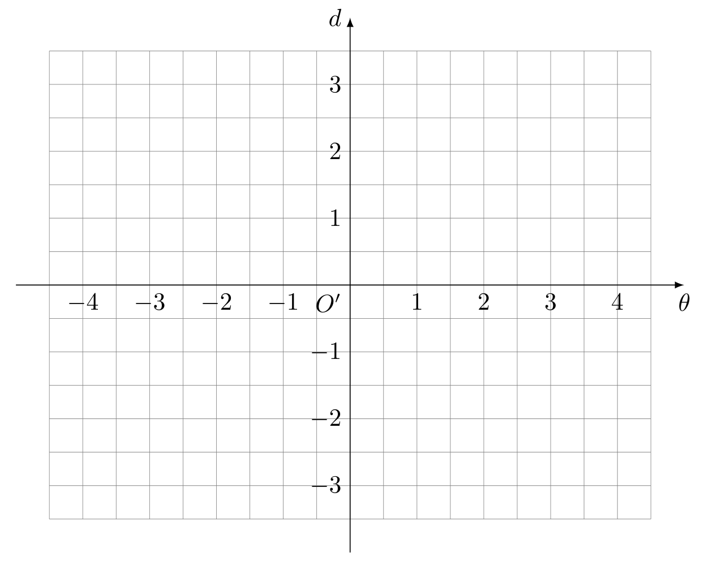
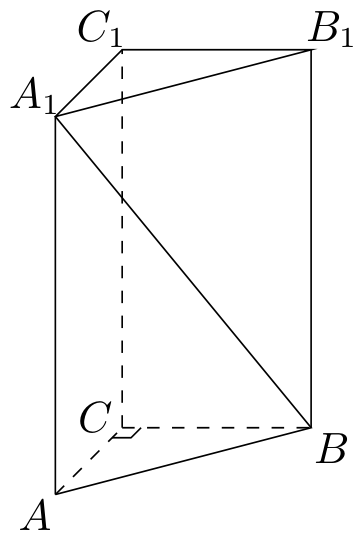
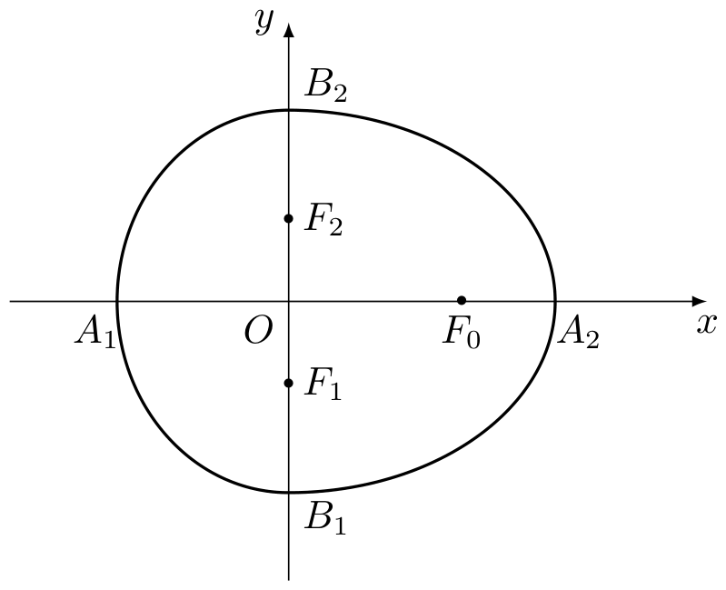

# 2007年上海卷（秋理）

## 填空题

### 第 1 题

函数 $f(x)=\frac{\lg(4-x)}{x-3}$ 的定义域是＿＿＿＿＿＿.

#### 答案

$\{x\mid x<4,\ x\ne3\}$

#### 解析

对数的真数必须为正，因此 $4-x>0$，即 $x<4$；同时分母不能为零，所以 $x\ne3$. 故定义域为 $\{x\mid x<4,\ x\ne3\}$.

### 第 2 题

若直线 $l_{1}: 2x + my + 1 = 0$ 与直线 $l_{2}: y = 3x - 1$ 平行，则 $m =$＿＿＿＿＿＿.

#### 答案

$-\frac{2}{3}$

#### 解析

当 $m=0$ 时，$l_1$ 为竖直直线，不可能与斜率为 $3$ 的 $l_2$ 平行，所以 $m\ne0$. 直线 $l_1$ 的斜率为 $-\frac{2}{m}$，由平行直线斜率相等，得 $-\frac{2}{m}=3$，所以 $m=-\frac{2}{3}$.

### 第 3 题

函数 $f(x)=\frac{x}{x-1}$ 的反函数 $f^{-1}(x)=$＿＿＿＿＿＿.

#### 答案

$\frac{x}{x-1}$，$x\ne1$

#### 解析

设 $y=\frac{x}{x-1}$，则 $y(x-1)=x$，从而 $x(y-1)=y$. 因为 $y\ne1$，所以 $x=\frac{y}{y-1}$. 交换 $x$，$y$ 得 $f^{-1}(x)=\frac{x}{x-1}$，且 $x\ne1$.

### 第 4 题

方程 $9^x - 6 \cdot 3^x - 7 = 0$ 的解是＿＿＿＿＿＿.

#### 答案

$x=\log_{3}7$

#### 解析

令 $t=3^x$，则 $t>0$，且 $9^x=t^2$. 原方程化为 $t^2-6t-7=0$，即 $(t-7)(t+1)=0$. 由于 $t>0$，只能取 $t=7$，故 $x=\log_{3}7$.

### 第 5 题

若 $x$，$y \in \mathbb{R}^+$，且 $x + 4y = 1$，则 $x \cdot y$ 的最大值是＿＿＿＿＿＿.

#### 答案

$\frac{1}{16}$

#### 解析

由 $x+4y=1$ 及 $x$，$y>0$，有 $xy=x\cdot4y\div4\leqslant\frac{(x+4y)^2}{16}=\frac{1}{16}$. 当且仅当 $x=4y$ 时取等号；结合 $x+4y=1$，得 $x=\frac12$，$y=\frac18$，它们均为正数. 因此 $xy$ 的最大值为 $\frac{1}{16}$.

### 第 6 题

函数 $y = \sin\left(x + \frac{\pi}{3}\right)\sin\left(x + \frac{\pi}{2}\right)$ 的最小正周期 $T =$＿＿＿＿＿＿.

#### 答案

$\pi$

#### 解析

利用积化和差公式，$y=\frac12\left[\cos\left(-\frac{\pi}{6}\right)-\cos\left(2x+\frac{5\pi}{6}\right)\right]=\frac{\sqrt3}{4}-\frac12\cos\left(2x+\frac{5\pi}{6}\right)$. 余弦项的自变量系数为 $2$，且其系数不为零，所以 $y$ 的最小正周期为 $\frac{2\pi}{2}=\pi$.

### 第 7 题

在五个数 $1$，$2$，$3$，$4$，$5$ 中，若随机取出三个数字，则剩下两个数字都是奇数的概率是＿＿＿＿＿＿.（结果用数值表示）

#### 答案

$0.3$

#### 解析

从 $5$ 个数字中取出 $3$ 个，等价于确定剩下的 $2$ 个数字. 基本情况共有 $\mathrm C_5^2=10$ 种；剩下的两个数字都是奇数时，必须从 $1$，$3$，$5$ 中选 $2$ 个，共有 $\mathrm C_3^2=3$ 种. 因此所求概率为 $\frac{3}{10}=0.3$.

### 第 8 题

以双曲线 $\frac{x^2}{4} - \frac{y^2}{5} = 1$ 的中心为焦点，且以该双曲线的左焦点为顶点的抛物线方程是＿＿＿＿＿＿.

#### 答案

$y^2=12(x+3)$

#### 解析

双曲线的半实轴平方为 $4$，半虚轴平方为 $5$，所以焦半距满足 $c^2=4+5=9$，即 $c=3$. 双曲线中心为 $O(0,0)$，左焦点为 $(-3,0)$. 以 $O$ 为焦点、以 $(-3,0)$ 为顶点的抛物线开口向右，焦点到顶点的距离为 $p=3$. 因而其标准方程为 $y^2=4p(x+3)=12(x+3)$.

### 第 9 题

对于非零实数 $a$，$b$，以下四个命题都成立：

1.  $a + \frac{1}{a} \neq 0$；

2.  $(a + b)^2 = a^2 + 2ab + b^2$；

3.  若 $|a| = |b|$，则 $a = \pm b$；

4.  若 $a^2 = ab$，则 $a = b$.

那么，对于非零复数 $a$，$b$，仍然成立命题的所有序号是＿＿＿＿＿＿.

#### 答案

2⃝4⃝

#### 解析

命题 $\textcircled{1}$ 在复数中不一定成立，例如取 $a=\i$，则 $a+\frac1a=\i-\i=0$. 命题 $\textcircled{2}$ 只是复数的乘法分配律展开式，对任意复数均成立.

命题 $\textcircled{3}$ 在复数中不一定成立，例如 $a=1$，$b=\i$ 时，$|a|=|b|=1$，但 $a\ne b$ 且 $a\ne-b$. 命题 $\textcircled{4}$ 中由 $a^2=ab$ 得 $a(a-b)=0$，因 $a\ne0$，所以 $a=b$. 因此仍成立的命题序号为 $\textcircled{2}\textcircled{4}$.

### 第 10 题

在平面上，两条直线的位置关系有相交，平行，重合三种. 已知 $\alpha$，$\beta$ 是两个相交平面，空间两条直线 $l_{1}$，$l_{2}$ 在 $\alpha$ 上的射影是直线 $s_{1}$，$s_{2}$，$l_{1}$，$l_{2}$ 在 $\beta$ 上的射影是直线 $t_{1}$，$t_{2}$. 用 $s_{1}$ 与 $s_{2}$，$t_{1}$ 与 $t_{2}$ 的位置关系，写出一个总能确定 $l_{1}$ 与 $l_{2}$ 是异面直线的充分条件：＿＿＿＿＿＿.

#### 答案

$s_{1}\parallel s_{2}$，且 $t_{1}$ 与 $t_{2}$ 相交.

#### 解析

取充分条件为 $s_{1}\parallel s_{2}$，且 $t_{1}$ 与 $t_{2}$ 相交. 若 $l_1$ 与 $l_2$ 相交，则交点在平面 $\alpha$ 上的射影同时属于 $s_1$ 与 $s_2$，这与 $s_1\parallel s_2$ 矛盾，所以 $l_1$ 与 $l_2$ 不相交.

若 $l_1\parallel l_2$，它们的方向向量相同，分别投影到两个平面后所得的直线方向也应分别平行，即 $s_1\parallel s_2$ 且 $t_1\parallel t_2$，这与 $t_1$ 与 $t_2$ 相交矛盾. 因而两直线既不相交也不平行，只能是异面直线.

### 第 11 题

已知 $P$ 为圆 $x^{2} + (y - 1)^{2} = 1$ 上任意一点（原点 $O$ 除外），直线 $OP$ 的倾斜角为 $\theta$ 弧度，记 $d = |OP|$. 在右侧的坐标系中，画出以 $(\theta, d)$ 为坐标的点的轨迹的大致图形为＿＿＿＿＿＿.

#### 答案

$d=2\sin\theta$，$0<\theta<\pi$

#### 解析

设圆心为 $C(0,1)$. 直线 $OP$ 与 $x$ 轴正方向的夹角为 $\theta$，由于圆除原点外的点均在 $x$ 轴上方，故 $0<\theta<\pi$. 圆心到直线 $OP$ 的距离为 $|\cos\theta|$，而圆半径为 $1$. 因此弦 $OP$ 的长度为 $d=2\sqrt{1-\cos^2\theta}=2\sin\theta$.

所以轨迹是第一象限内曲线 $d=2\sin\theta$ 在 $0<\theta<\pi$ 上的部分，端点对应原点而不取.

## 单选题

### 第 12 题

已知 $a$，$b \in \mathbb{R}$，且 $2 + a\i$，$b + \i$（$\i$ 是虚数单位）是实系数一元二次方程 $x^{2} + px + q = 0$ 的两个根，那么 $p$，$q$ 的值分别是（）

A.  
$p = -4, q = 5$

B.  
$p = -4$，$q = 3$

C.  
$p = 4$，$q = 5$

D.  
$p = 4$，$q = 3$

#### 答案

A

#### 解析

实系数二次方程的非实根必为共轭复数. 因此 $2+a\i$ 与 $b+\i$ 互为共轭，得 $b=2$，$a=-1$. 两根之和为 $4$，两根之积为 $(2-\i)(2+\i)=5$. 由韦达定理 $p=-4$，$q=5$，故选 A.

### 第 13 题

设 $a$，$b$ 是非零实数，若 $a < b$，则下列不等式成立的是（）

A.  
$a^2 < b^2$

B.  
$ab^{2} < a^{2}b$

C.  
$\frac{1}{ab^2} < \frac{1}{a^2b}$

D.  
$\frac{b}{a} < \frac{a}{b}$

#### 答案

C

#### 解析

对选项 C，$\frac{1}{ab^2}-\frac{1}{a^2b}=\frac{a-b}{a^2b^2}<0$，因为 $a^2b^2>0$ 且 $a<b$，所以 C 对任意满足条件的 $a$，$b$ 均成立.

其余选项并非恒成立：取 $a=-2$，$b=1$ 可否定 A；取 $a=1$，$b=2$ 时 B 为 $4<2$，D 为 $2<\frac12$，均不成立. 故选 C.

### 第 14 题

直角坐标系 $xOy$ 中，$\boldsymbol{i}$，$\boldsymbol{j}$ 分别是与 $x$，$y$ 轴正方向同向的单位向量. 在直角三角形 $ABC$ 中，若 $\overrightarrow{AB} = 2\boldsymbol{i}+ \boldsymbol{j}$，$\overrightarrow{AC} = 3\boldsymbol{i}+ k\boldsymbol{j}$，则 $k$ 的可能个数是（）

A.  
1

B.  
2

C.  
3

D.  
4

#### 答案

B

#### 解析

由 $\overrightarrow{AB}=(2,1)$，$\overrightarrow{AC}=(3,k)$，分别讨论直角所在的顶点.

若 $\angle A=90^\circ$，则 $\overrightarrow{AB}\cdot\overrightarrow{AC}=0$，即 $6+k=0$，得 $k=-6$.

若 $\angle B=90^\circ$，则 $\overrightarrow{BA}=(-2,-1)$，$\overrightarrow{BC}=(1,k-1)$，从而 $\overrightarrow{BA}\cdot\overrightarrow{BC}=-2-(k-1)=0$，得 $k=-1$.

若 $\angle C=90^\circ$，则 $\overrightarrow{CA}=(-3,-k)$，$\overrightarrow{CB}=(-1,1-k)$，应有 $3-k+k^2=0$. 该方程的判别式为 $1-12<0$，无实数解. 所以 $k$ 有 $2$ 个可能值，选 B.

### 第 15 题

设 $f(x)$ 是定义在正整数集上的函数，且 $f(x)$ 满足：“当 $f(k) \geqslant k^2$ 成立时，总可推出 $f(k + 1) \geqslant (k + 1)^2$ 成立”. 那么，下列命题总成立的是（）

A.  
若 $f(3) \geqslant 9$ 成立，则当 $k \geqslant 1$ 时，均有 $f(k) \geqslant k^2$ 成立

B.  
若 $f(5) \geqslant 25$ 成立，则当 $k \leqslant 5$ 时，均有 $f(k) \geqslant k^2$ 成立

C.  
若 $f(7) < 49$ 成立，则当 $k \geqslant 8$ 时，均有 $f(k) < k^2$ 成立

D.  
若 $f(4) = 25$ 成立，则当 $k \geqslant 4$ 时，均有 $f(k) \geqslant k^2$ 成立

#### 答案

D

#### 解析

记命题 $P(k)$ 为 $f(k)\geqslant k^2$. 题设给出对每个正整数 $k$，$P(k)\mathbb{R}ightarrow P(k+1)$.

选项 D 中 $f(4)=25\geqslant16$，所以 $P(4)$ 成立. 由题设依次得到 $P(5)$，$P(6)$，$\ldots$，故对所有 $k\geqslant4$，均有 $f(k)\geqslant k^2$.

A、B 把只能向后的推出关系误用于向前推出；例如令 $f(1)=f(2)=0$，并令 $f(k)=k^2$ 对所有 $k\geqslant3$，即可否定它们的向前结论. C 也不成立：令 $f(k)=0$（$1\leqslant k\leqslant7$），$f(k)=k^2$（$k\geqslant8$），则题设蕴含关系仍满足，但 $f(7)<49$ 而 $f(8)=8^2$，所以 C 的结论不成立. 故选 D.

## 解答题

### 第 16 题

如图，在体积为 1 的直三棱柱 $ABC - A_{1}B_{1}C_{1}$ 中，$\angle ACB = 90^{\circ}$，$AC = BC = 1$，求直线 $A_{1}B$ 与平面 $BB_{1}C_{1}C$ 所成角.（结果用反三角函数值表示）

#### 解析

设 $C$ 为原点，取 $CA$，$CB$，$CC_1$ 分别为三个坐标轴正方向. 由底面为直角等腰三角形，底面积为 $\frac12$；又棱柱体积为 $1$，所以 $CC_1=2$. 因而可设 $A=(1,0,0)$，$B=(0,1,0)$，$A_1=(1,0,2)$.

平面 $BB_1C_1C$ 的方程为 $x=0$. 直线 $A_1B$ 的方向向量可取 $\boldsymbol{v}=(-1,1,-2)$，其长度为 $\sqrt6$，在该平面上的投影方向向量为 $(0,1,-2)$，长度为 $\sqrt5$. 设直线与平面所成角为 $\alpha$，则 $\tan\alpha$ 等于方向向量的法向分量与平面内投影分量之比，即 $\tan\alpha=\frac{1}{\sqrt5}=\frac{\sqrt5}{5}$. 所以 $\alpha=\arctan\frac{\sqrt5}{5}$.

### 第 17 题

在 $\triangle ABC$ 中，$a$，$b$，$c$ 分别是三个内角 $A$，$B$，$C$ 的对边. 若 $a = 2$，$C = \frac{\pi}{4}$，$\cos \frac{B}{2} = \frac{2\sqrt{5}}{5}$，求 $\triangle ABC$ 的面积 $S$.

#### 解析

因为 $0<B<\pi$，所以 $0<\frac B2<\frac{\pi}{2}$. 由 $\cos\frac B2=\frac{2\sqrt5}{5}$，得 $\sin\frac B2=\frac{\sqrt5}{5}$. 从而 $\cos B=2\cos^2\frac B2-1=\frac35$，$\sin B=2\sin\frac B2\cos\frac B2=\frac45$.

又 $A=\pi-B-C$，所以 $\sin A=\sin(B+C)=\sin B\cos C+\cos B\sin C=\frac{7}{5\sqrt2}$. 由正弦定理，$b=\frac{a\sin B}{\sin A}$，$c=\frac{a\sin C}{\sin A}$. 因此 $S=\frac12bc\sin A=\frac{a^2\sin B\sin C}{2\sin A}=\frac{8}{7}$.

### 第 18 题

近年来，太阳能技术运用的步伐日益加快. $2002$ 年全球太阳电池的年生产量达到 $670\text{ 兆瓦}$，年生产量的增长率为 $34\%$. 以后 $4$ 年中，年生产量的增长率逐年递增 $2\%$（如，$2003$ 年的年生产量的增长率为 $36\%$）.

1.  求 $2006$ 年全球太阳电池的年生产量（结果精确到 $0.1\text{ 兆瓦}$）；

2.  目前太阳电池产业存在的主要问题是市场安装量远小于生产量，$2006$ 年的实际安装量为 $1420\text{ 兆瓦}$. 假设以后若干年内太阳电池的年生产量的增长率保持在 $42\%$，到 $2010$ 年，要使年安装量与年生产量基本持平（即年安装量不少于年生产量的 $95\%$），这四年中太阳电池的年安装量的平均增长率至少应达到多少（结果精确到 $0.1\%$）？

#### 解析

1.  2003，2004，2005，2006 年的年生产量增长率依次为 $36\%$，$38\%$，$40\%$，$42\%$. 所以 $2006$ 年的年生产量为 $670\times1.36\times1.38\times1.40\times1.42=2499.822528\text{ 兆瓦}$，精确到 $0.1\text{ 兆瓦}$ 为 $2499.8\text{ 兆瓦}$.

2.  设这四年中年安装量的平均增长率为 $x$，则 $2010$ 年的安装量为 $1420(1+x)^4$，生产量为 $2499.822528(1.42)^4$. 由安装量不少于生产量的 $95\%$，得 $1420(1+x)^4\geqslant0.95\times2499.822528(1.42)^4$. 因 $1+x>0$，所以 $1+x\geqslant\sqrt[4]{\frac{0.95\times2499.822528\times1.42^4}{1420}}$，即 $x\geqslant0.614821\ldots$. 因此至少应达到 $61.5\%$.

### 第 19 题

已知函数 $f(x) = x^2 + \frac{a}{x}$（$x \neq 0$，常数 $a \in \mathbb{R}$）.

1.  讨论函数 $f(x)$ 的奇偶性，并说明理由；

2.  若函数 $f(x)$ 在 $x \in [2, +\infty)$ 上为增函数，求 $a$ 的取值范围.

#### 解析

1.  函数定义域为全体非零实数，关于原点对称. 对任意 $x\ne0$，$f(-x)=x^2-\frac{a}{x}$. 当 $a=0$ 时，$f(-x)=f(x)=x^2$，所以函数为偶函数；当 $a\ne0$ 时，$f(-x)\ne f(x)$，且 $f(-x)=-f(x)$ 会导致 $x^2-\frac{a}{x}=-x^2-\frac{a}{x}$，即 $2x^2=0$，不可能对所有 $x\ne0$ 成立. 所以此时函数既不是奇函数，也不是偶函数.

2.  在 $x\geqslant2$ 上，$f'(x)=2x-\frac{a}{x^2}=\frac{2x^3-a}{x^2}$. 因为 $x^2>0$，要使函数在该区间上为增函数，必须且只需 $2x^3-a\geqslant0$ 对所有 $x\geqslant2$ 成立. 左端随 $x$ 增大而增大，最小值在 $x=2$ 处，为 $16-a$，故 $a\leqslant16$. 当 $a>16$ 时，$f'(2)<0$，函数不可能在该区间上为增函数. 所以 $a\in(-\infty,16]$.

### 第 20 题

如果有穷数列 $a_1$，$a_2$，$a_3$，$\cdots$，$a_n$（$n$ 为正整数）满足条件 $a_1 = a_n$，$a_2 = a_{n-1}$，$\cdots$，$a_n = a_1$，即 $a_i = a_{n-i+1}$（$i = 1$，$2$，$\cdots$，$n$），我们称其为“对称数列”. 例如，由组合数组成的数列 $\mathrm{C}_m^0$，$\mathrm{C}_m^1$，$\cdots$，$\mathrm{C}_m^m$ 就是“对称数列”.

1.  设 $\{b_n\}$ 是项数为 7 的“对称数列”，其中 $b_1$，$b_2$，$b_3$，$b_4$ 是等差数列，且 $b_1 = 2$，$b_4 = 11$. 依次写出 $\{b_n\}$ 的每一项；

2.  设 $\{c_n\}$ 是项数为 $2k - 1$（正整数 $k > 1$）的“对称数列”，其中 $c_k$，$c_{k+1}$，$\cdots$，$c_{2k-1}$ 是首项为 50，公差为 $-4$ 的等差数列. 记 $\{c_n\}$ 各项的和为 $S_{2k-1}$. 当 $k$ 为何值时，$S_{2k-1}$ 取得最大值？并求出 $S_{2k-1}$ 的最大值；

3.  对于确定的正整数 $m > 1$，写出所有项数不超过 $2m$ 的“对称数列”，使得 $1$，$2$，$2^2$，$\cdots$，$2^{m-1}$ 依次是该数列中连续的项；当 $m > 1500$ 时，求其中一个“对称数列”前 2008 项的和 $S_{2008}$.

#### 解析

1.  设 $b_1$，$b_2$，$b_3$，$b_4$ 的公差为 $d$. 则 $2+3d=11$，所以 $d=3$. 由对称性 $b_5=b_3$，$b_6=b_2$，$b_7=b_1$，故 $\{b_n\}=\{2,5,8,11,8,5,2\}$.

2.  对 $j=0$，$1$，$\ldots$，$k-1$，有 $c_{k+j}=50-4j$. 由对称性，中心项只计算一次，其余各项成对出现，因此 $S_{2k-1}=50+2\sum_{j=1}^{k-1}(50-4j)=-4k^2+104k-50=626-4(k-13)^2$. 因 $k>1$ 为整数，故在 $k=13$ 时取得最大值 $626$.

3.  记连续出现的 $m$ 项为 $1$，$2$，$\ldots$，$2^{m-1}$. 对称性要求这段连续项的逆序列也出现在原数列中. 由于 $1$，$2$，$\ldots$，$2^{m-1}$ 两两不同，这两段长度为 $m$ 的连续项至多重合一个位置；否则重合位置会要求两个不同的幂相等. 因此原数列的项数至少为 $2m-1$.

    当项数为 $2m-1$ 时，两段只能恰好重合一个中心项，且其中一段从首项开始，得到下面的第一个或第三个数列；当项数为 $2m$ 时，两段不能重合，且分别占据首尾两端，得到下面的第二个或第四个数列. 故所有可能的数列如下.

    $\{1,2,2^2,\cdots,2^{m-2},2^{m-1},2^{m-2},\cdots,2^2,2,1\}$，

    $\{1,2,2^2,\cdots,2^{m-2},2^{m-1},2^{m-1},2^{m-2},\cdots,2^2,2,1\}$，

    $\{2^{m-1},2^{m-2},\cdots,2^2,2,1,2,2^2,\cdots,2^{m-2},2^{m-1}\}$，

    $\{2^{m-1},2^{m-2},\cdots,2^2,2,1,1,2,2^2,\cdots,2^{m-2},2^{m-1}\}$.

    若 $m\geqslant2008$，四种数列的前 $2008$ 项和分别为 $2^{2008}-1$，$2^{2008}-1$，$2^m-2^{m-2008}$，$2^m-2^{m-2008}$. 若 $1500<m\leqslant2007$，令 $r=2008-m$，则四种数列的前 $2008$ 项和分别为 $2^m+2^{m-1}-2^{2m-2009}-1$，$2^{m+1}-2^{2m-2008}-1$，$2^m+2^{2009-m}-3$，$2^m+2^{2008-m}-2$.

### 第 21 题

我们把由半椭圆 $\frac{x^2}{a^2} + \frac{y^2}{b^2} = 1$（$x \geqslant 0$）与半椭圆 $\frac{y^2}{b^2} + \frac{x^2}{c^2} = 1$（$x \leqslant 0$）合成的曲线称作“果圆”，其中 $a^2 = b^2 + c^2$，$a > 0$，$b > c > 0$. 如图，设点 $F_0$，$F_1$，$F_2$ 是相应椭圆的焦点，$A_1$，$A_2$ 和 $B_1$，$B_2$ 分别是“果圆”与 $x$，$y$ 轴的交点.

1.  若 $\triangle F_0F_1F_2$ 是边长为 1 的等边三角形，求“果圆”的方程；

2.  当 $\left|A_1A_2\right| > \left|B_1B_2\right|$ 时，求 $\frac{b}{a}$ 的取值范围；

3.  连接“果圆”上任意两点的线段称为“果圆”的弦. 试研究：是否存在实数 $k$，使斜率为 $k$ 的“果圆”平行弦的中点轨迹总是落在某个椭圆上？若存在，求出所有可能的 $k$ 值；若不存在，说明理由.

#### 解析

1.  右侧椭圆的焦半距为 $\sqrt{a^2-b^2}=c$，所以 $F_0=(c,0)$. 左侧椭圆的焦半距为 $d=\sqrt{b^2-c^2}$，所以 $F_1=(0,-d)$，$F_2=(0,d)$. 若三点构成边长为 $1$ 的等边三角形，则 $2d=1$，且 $c^2+d^2=1$. 因而 $d=\frac12$，$c^2=\frac34$，$b^2=c^2+d^2=1$，再由 $a^2=b^2+c^2$ 得 $a^2=\frac74$. 所以“果圆”方程为 $\frac47x^2+y^2=1\ (x\geqslant0)$，$y^2+\frac43x^2=1\ (x\leqslant0)$.

2.  $A_1=(-c,0)$，$A_2=(a,0)$，$B_1=(0,-b)$，$B_2=(0,b)$，所以 $\lvert A_1A_2\rvert=a+c$，$\lvert B_1B_2\rvert=2b$. 令 $t=\frac ba$，则 $t>\frac{\sqrt2}{2}$，且 $\frac ca=\sqrt{1-t^2}$. 条件化为 $1+\sqrt{1-t^2}>2t$. 在 $t>\frac{\sqrt2}{2}>\frac12$ 下可平方，得 $1-t^2>(2t-1)^2$，即 $t(5t-4)<0$. 因 $t>0$，所以 $\frac{\sqrt2}{2}<\frac ba<\frac45$.

3.  当 $k=0$ 时，水平弦的两个端点分别为 $\left(a\sqrt{1-\frac{y^2}{b^2}},y\right)$ 与 $\left(-c\sqrt{1-\frac{y^2}{b^2}},y\right)$. 其中点 $M=(x,y)$ 满足 $x=\frac{a-c}{2}\sqrt{1-\frac{y^2}{b^2}}$，即 $\frac{4x^2}{(a-c)^2}+\frac{y^2}{b^2}=1$，故这些中点均落在一个椭圆上.

    设 $k\ne0$. 考察右侧椭圆内、斜率为 $k$ 的弦，令其所在直线为 $y=kx+t$，并记 $A=\frac1{a^2}+\frac{k^2}{b^2}$. 代入右侧椭圆后，两个交点的横坐标是方程 $Ax^2+\frac{2kt}{b^2}x+\frac{t^2}{b^2}-1=0$ 的两根. 由韦达定理，其中点 $M=(x_M,y_M)$ 满足 $x_M=-\frac{kt}{b^2A}$，$y_M=\frac{t}{a^2A}$，从而 $y_M=-\frac{b^2}{a^2k}x_M$.

    对右侧椭圆上任意一个横坐标为正的斜率为 $k$ 的切点，切线附近有一段同斜率的直线与右侧椭圆交于两个横坐标均为正的点；改变这段直线的截距 $t$，中点 $M$ 连续变化，并且 $x_M=-\frac{kt}{b^2A}$ 也连续变化，因此中点轨迹含有直线 $y_M=-\frac{b^2}{a^2k}x_M$ 上的无穷多个点. 非退化椭圆与任一直线至多有两个交点，所以这些中点不可能总落在某个椭圆上. 因而所有可能的斜率只有 $k=0$.
