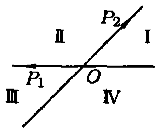
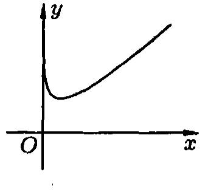
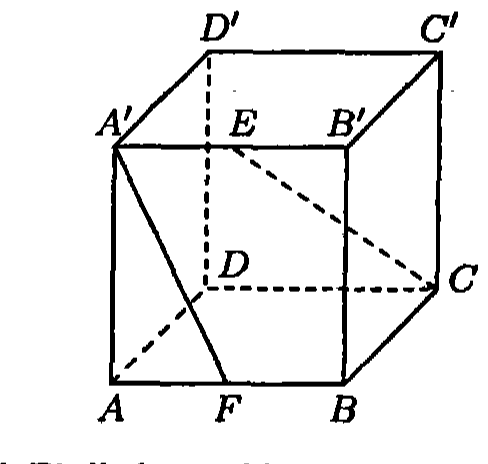
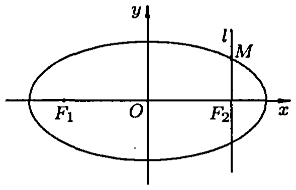
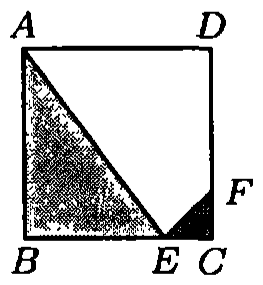
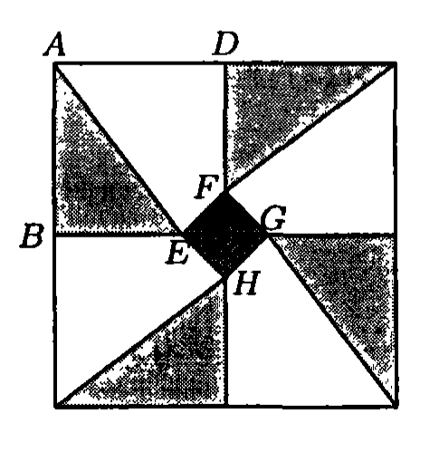
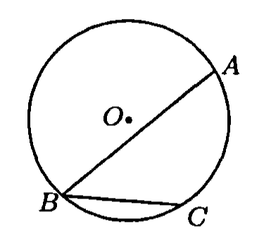

# 2007年上海卷（春）

## 填空题

### 第 1 题

计算 $\displaystyle\lim_{n\to\infty}\frac{2n^{2}+1}{3n(n+1)}=$＿＿＿＿＿＿.

#### 答案

$\frac{2}{3}$

#### 解析

分子、分母同除以 $n^2$，得 $\frac{2n^{2}+1}{3n(n+1)}=\frac{2+\frac{1}{n^{2}}}{3\left(1+\frac{1}{n}\right)}$. 当 $n\to\infty$ 时，$\frac{1}{n}\to0$，$\frac{1}{n^2}\to0$，所以原极限为 $\frac{2+0}{3(1+0)}=\frac{2}{3}$.

### 第 2 题

若关于 $x$ 的一元二次实系数方程 $x^{2}+px+q=0$ 有一个根为 $1+\i$（$\i$ 是虚数单位），则 $q=$＿＿＿＿＿＿.

#### 答案

$2$

#### 解析

因为方程的系数 $p$，$q$ 都是实数，非实根 $1+\i$ 的共轭数 $1-\i$ 也必为方程的根. 因此原方程可写为 $(x-(1+\i))(x-(1-\i))=0$. 展开得 $x^2-2x+\left(1+\i\right)\left(1-\i\right)=x^2-2x+2=0$. 与 $x^2+px+q=0$ 比较常数项，得 $q=2$.

### 第 3 题

若关于 $x$ 的不等式 $\frac{x-a}{x+1}>0$ 的解集为 $(-\infty,-1)\cup(4,+\infty)$，则实数 $a=$＿＿＿＿＿＿.

#### 答案

$4$

#### 解析

不等式的分母不能为零，所以 $x\neq-1$. 分子为零的临界点是 $x=a$. 题设解集的两个端点分别为分母的零点 $-1$ 和分子的零点 $4$，故 $a=4$. 直接检验符号也可得 $\frac{x-4}{x+1}>0\Longleftrightarrow x<-1\ \text{或}\ x>4$，这与题设解集一致，所以 $a=4$.

### 第 4 题

函数 $y=(\sin x+\cos x)^2$ 的最小正周期为＿＿＿＿＿＿.

#### 答案

$\pi$

#### 解析

利用二倍角公式，

$$

(\sin x+\cos x)^2=\sin^2x+\cos^2x+2\sin x\cos x=1+\sin2x

$$

函数 $\sin2x$ 的周期为 $\pi$，所以 $1+\sin2x$ 的周期为 $\pi$. 又若 $T>0$ 是其周期，则 $\sin(2x+2T)=\sin2x\quad\text{对任意 }x\text{成立}$. 取 $x=0$ 和 $x=\frac{\pi}{4}$，可得 $\sin2T=0$ 且 $\cos2T=1$，从而 $2T=2k\pi$，即 $T=k\pi$. 因此最小正周期为 $\pi$.

### 第 5 题

设函数 $y=f(x)$ 是奇函数. 若 $f(-2)+f(-1)-3=f(1)+f(2)+3$，则 $f(1)+f(2)=$＿＿＿＿＿＿.

#### 答案

$-3$

#### 解析

由 $f(x)$ 为奇函数，得 $f(-2)=-f(2)$，$f(-1)=-f(1)$. 令 $S=f(1)+f(2)$，代入题设等式得 $-S-3=S+3$. 所以 $2S=-6$，从而 $f(1)+f(2)=S=-3$.

### 第 6 题

在平面直角坐标系 $xOy$ 中，若抛物线 $y^2=4x$ 上的点 $P$ 到该抛物线的焦点的距离为 $6$，则点 $P$ 的横坐标 $x=$＿＿＿＿＿＿.

#### 答案

$5$

#### 解析

将抛物线 $y^2=4x$ 与标准方程 $y^2=4px$ 比较，得 $p=1$，所以焦点为 $F(1,0)$. 设 $P(x,y)$ 在抛物线上，则 $y^2=4x$，且 $x\geqslant0$. 因而

$$

\begin{aligned}PF&=\sqrt{(x-1)^2+y^2}=\sqrt{x^2-2x+1+4x}\\&=\sqrt{(x+1)^2}=x+1.\end{aligned}

$$

由 $PF=6$ 得 $x+1=6$，所以 $x=5$.

### 第 7 题

在平面直角坐标系 $xOy$ 中，若曲线 $x=\sqrt{4-y^2}$ 与直线 $x=m$ 有且只有一个公共点，则实数 $m=$＿＿＿＿＿＿.

#### 答案

$2$

#### 解析

由 $x=\sqrt{4-y^2}$ 可知 $x\geqslant0$，且平方后得到 $x^2+y^2=4$. 因此该曲线是圆 $x^2+y^2=4$ 的右半圆. 直线 $x=m$ 与它相交时，必须有 $0\leqslant m\leqslant2$. 当 $0\leqslant m<2$ 时，交点为 $\left(m,\sqrt{4-m^2}\right)$ 和 $\left(m,-\sqrt{4-m^2}\right)$，共有两个；当 $m=2$ 时，两个交点合并为 $(2,0)$，只有一个公共点；当 $m<0$ 或 $m>2$ 时没有公共点. 所以 $m=2$.

### 第 8 题

若向量 $\boldsymbol{a}$，$\boldsymbol{b}$ 满足 $|\boldsymbol{a}|=\sqrt{2}$，$|\boldsymbol{b}|=1$，$\boldsymbol{a}\cdot(\boldsymbol{a}+\boldsymbol{b})=1$，则向量 $\boldsymbol{a}$，$\boldsymbol{b}$ 的夹角的大小为＿＿＿＿＿＿.

#### 答案

$\frac{3\pi}{4}$

#### 解析

由数量积的分配律，$\boldsymbol{a}\cdot(\boldsymbol{a}+\boldsymbol{b})=\boldsymbol{a}\cdot\boldsymbol{a}+\boldsymbol{a}\cdot\boldsymbol{b}$. 因为 $\boldsymbol{a}\cdot\boldsymbol{a}=|\boldsymbol{a}|^2=2$，所以 $2+\boldsymbol{a}\cdot\boldsymbol{b}=1$，即 $\boldsymbol{a}\cdot\boldsymbol{b}=-1$. 设 $\boldsymbol{a}$，$\boldsymbol{b}$ 的夹角为 $\theta$，则 $\boldsymbol{a}\cdot\boldsymbol{b}=|\boldsymbol{a}||\boldsymbol{b}|\cos\theta$，从而 $\sqrt{2}\cos\theta=-1$，即 $\cos\theta=-\frac{\sqrt{2}}{2}$. 由于 $0\leqslant\theta\leqslant\pi$，得 $\theta=\frac{3\pi}{4}$.

### 第 9 题

若 $x_1$，$x_2$ 为方程 $2^x=\left(\frac{1}{2}\right)^{-\frac{1}{x}+1}$ 的两个实数解，则 $x_1+x_2=$＿＿＿＿＿＿.

#### 答案

$-1$

#### 解析

原方程要求 $x\neq0$. 将右边化为以 $2$ 为底的幂，得 $\left(\frac12\right)^{-\frac1x+1}=2^{\frac1x-1}$. 由于指数函数 $2^t$ 在 $\mathbb{R}$ 上单调递增，方程等价于 $x=\frac1x-1$. 两边同乘以 $x\neq0$，得 $x^2+x-1=0$. 这是一个有两个实根的二次方程，且根的和为 $-1$，所以 $x_1+x_2=-1$.

### 第 10 题

在一次教师联欢会上，到会的女教师比男教师多 $12$ 人，从这些教师中随机挑选一人表演节目. 若选到男教师的概率为 $\frac{9}{20}$，则参加联欢会的教师共有＿＿＿＿＿＿人.

#### 答案

$120$

#### 解析

设男教师人数为 $M$，女教师人数为 $W$. 由题意，$W-M=12$，又随机选到男教师的概率为 $\frac{M}{M+W}=\frac{9}{20}$. 因而 $M:W=9:11$，设 $M=9k$，$W=11k$，其中 $k>0$. 由 $W-M=2k=12$ 得 $k=6$，所以参加联欢会的教师共有 $M+W=20k=120$ 人.

### 第 11 题

函数

$$

y=
\begin{cases}
x^2+1, & x\geqslant 0,\\
\frac{2}{x}, & x<0
\end{cases}

$$

的反函数是＿＿＿＿＿＿.

#### 答案

$$

y=
\begin{cases}
\sqrt{x-1}, & x\geqslant 1,\\
\frac{2}{x}, & x<0
\end{cases}

$$

#### 解析

当原函数的自变量 $x\geqslant0$ 时，$y=x^2+1$，其值域为 $[1,+\infty)$. 交换 $x$，$y$ 并解出 $y$，得 $x=y^2+1$，且 $y\geqslant0$，所以反函数在 $x\geqslant1$ 时为 $y=\sqrt{x-1}$. 当原函数的自变量 $x<0$ 时，$y=\frac2x<0$，其值域为 $(-\infty,0)$. 交换 $x$，$y$ 得 $y=\frac2x$，并且反函数的自变量满足 $x<0$. 因此反函数为

$$

y=
\begin{cases}
\sqrt{x-1}, & x\geqslant1,\\
\frac2x, & x<0.
\end{cases}

$$

## 单选题

### 第 12 题

若集合 $A=\{1,m^2\}$，$B=\{2,4\}$，则“$m=2$”是“$A\cap B=\{4\}$”的（）

A.  
充分不必要条件.

B.  
必要不充分条件.

C.  
充要条件.

D.  
既不充分也不必要条件.

#### 答案

A

#### 解析

若 $m=2$，则 $A=\{1,4\}$，所以 $A\cap B=\{4\}$，故“$m=2$”是“$A\cap B=\{4\}$”的充分条件. 反之，若 $A\cap B=\{4\}$，则必须有 $m^2=4$，从而 $m=2$ 或 $m=-2$. 取 $m=-2$ 时前一命题不成立，故“$m=2$”不是必要条件. 因此选 A.

### 第 13 题

如图，平面内的两条相交直线 $OP_1$ 和 $OP_2$ 将该平面分割成四个部分 $\mathrm{I}$，$\mathrm{II}$，$\mathrm{III}$，$\mathrm{IV}$（不包括边界）. 若 $\overrightarrow{OP}=a\overrightarrow{OP_1}+b\overrightarrow{OP_2}$，且点 $P$ 落在第 $\mathrm{III}$ 部分，则实数 $a$，$b$ 满足（）

A.  
$a>0$，$b>0$.

B.  
$a>0$，$b<0$.

C.  
$a<0$，$b>0$.

D.  
$a<0$，$b<0$.

#### 答案

B

#### 解析

把 $\overrightarrow{OP_1}$ 和 $\overrightarrow{OP_2}$ 作为两个不共线的基向量. 当 $a>0$，$b>0$ 时，点 $P$ 落在两条射线 $OP_1$，$OP_2$ 所夹的部分；改变其中一个系数的符号，点 $P$ 就转到相应的一侧. 图中第 $\mathrm{III}$ 部分位于射线 $OP_1$ 与射线 $OP_2$ 的反向延长线之间，所以 $a>0$，$b<0$. 因此选 B.

### 第 14 题

下列四个函数中，图象如图所示的只能是（）

A.  
$y=x+\lg x$.

B.  
$y=x-\lg x$.

C.  
$y=-x+\lg x$.

D.  
$y=-x-\lg x$.

#### 答案

B

#### 解析

四个函数的定义域都是 $x>0$. 对 $y=x+\lg x$，有 $y'=1+\frac{1}{x\ln10}>0$，所以它在定义域上递增，且 $x\to0^+$ 时 $y\to-\infty$，不符合图象. 对 $y=x-\lg x$，有 $y'=1-\frac{1}{x\ln10}$，函数先减后增，并且 $x\to0^+$ 和 $x\to+\infty$ 时函数值都趋于 $+\infty$，符合图示的“先降后升”形状. 对 $y=-x+\lg x$，有 $y'=-1+\frac{1}{x\ln10}$，函数先增后减；对 $y=-x-\lg x$，有 $y'=-1-\frac{1}{x\ln10}<0$，函数递减. 所以只能选 B.

### 第 15 题

设 $a$，$b$ 是正实数，以下不等式：

1.  $\sqrt{ab}>\frac{2ab}{a+b}$；

2.  $a>|a-b|-b$；

3.  $a^2+b^2>4ab-3b^2$；

4.  $ab+\frac{2}{ab}>2$.

恒成立的序号为（）

A.  
$\textcircled{1}$，$\textcircled{3}$.

B.  
$\textcircled{1}$，$\textcircled{4}$.

C.  
$\textcircled{2}$，$\textcircled{3}$.

D.  
$\textcircled{2}$，$\textcircled{4}$.

#### 答案

D

#### 解析

对第一个不等式，由均值不等式 $a+b\geqslant2\sqrt{ab}$，只能得到 $\frac{2ab}{a+b}\leqslant\sqrt{ab}$，当 $a=b$ 时取等号，因此严格不等式不恒成立. 对第二个不等式分情况：当 $a\geqslant b$ 时，$|a-b|-b=a-2b<a$；当 $a<b$ 时，$|a-b|-b=-a<a$，所以第二个不等式恒成立. 第三个不等式等价于 $(a-2b)^2>0$，当 $a=2b$ 时不成立，故不恒成立. 对第四个不等式，令 $t=ab>0$，则由均值不等式 $t+\frac{2}{t}\geqslant2\sqrt2>2$，所以它恒成立. 因而恒成立的序号为 $\textcircled{2}$，$\textcircled{4}$，选 D.

## 解答题

### 第 16 题

如图，在棱长为 $2$ 的正方体 $ABCD-A'B'C'D'$ 中，点 $E$，$F$ 分别是 $A'B'$ 和 $AB$ 的中点，求异面直线 $A'F$ 与 $CE$ 所成角的大小（结果用反三角函数值表示）.

#### 解析

【法一】建立空间直角坐标系，取 $A=(2,0,0)$，使 $AB$、$AA'$、$AD$ 分别沿 $y$ 轴正方向、$z$ 轴正方向、$x$ 轴负方向. 由题意可知 $A'(2,0,2)$，$C(0,2,0)$，$E(2,1,2)$，$F(2,1,0)$，$\overrightarrow{A'F}=(0,1,-2)$，$\overrightarrow{CE}=(2,-1,2)$. 设直线 $A'F$ 与 $CE$ 所成角为 $\theta$，则

$$

\cos\theta=
\frac{\left|\overrightarrow{A'F}\cdot\overrightarrow{CE}\right|}{\left|\overrightarrow{A'F}\right|\cdot\left|\overrightarrow{CE}\right|}
=\frac{5}{\sqrt{5}\cdot 3}
=\frac{\sqrt{5}}{3}

$$

因此 $\theta=\arccos\frac{\sqrt{5}}{3}$，即异面直线 $A'F$ 与 $CE$ 所成角的大小为 $\arccos\frac{\sqrt{5}}{3}$.

【法二】连结 $EB$. 因为 $A'E\parallel BF$，且 $A'E=BF$，所以 $A'FBE$ 是平行四边形，从而 $A'F\parallel EB$. 因此异面直线 $A'F$ 与 $CE$ 所成的角就是 $CE$ 与 $EB$ 所成的角. 又因为 $CB\perp$ 平面 $ABB'A'$，所以 $CB\perp BE$. 在直角三角形 $CEB$ 中，$CB=2$，$BE=\sqrt{5}$，于是 $\tan\angle CEB=\frac{2\sqrt{5}}{5}$. 故 $\angle CEB=\arctan\frac{2\sqrt{5}}{5}$. 因此异面直线 $A'F$ 与 $CE$ 所成角的大小为 $\arctan\frac{2\sqrt{5}}{5}$.

### 第 17 题

求出一个数学问题的正确结论后，将其作为条件之一，提出与原来问题有关的新问题，我们把它称为原来问题的一个“逆向”问题. 例如，原来问题是“若正四棱锥底面边长为 $4$，侧棱长为 $3$，求该正四棱锥的体积”. 求出体积 $\frac{16}{3}$ 后，它的一个“逆向”问题可以是“若正四棱锥底面边长为 $4$，体积为 $\frac{16}{3}$，求侧棱长”；也可以是“若正四棱锥的体积为 $\frac{16}{3}$，求所有侧面面积之和的最小值”. 试给出问题“在平面直角坐标系 $xOy$ 中，求点 $P(2,1)$ 到直线 $3x+4y=0$ 的距离.”的一个有意义的“逆向”问题，并解答你所给出的“逆向”问题.

#### 解析

点 $P(2,1)$ 到直线 $3x+4y=0$ 的距离为 $\frac{|3\cdot 2+4\cdot 1|}{\sqrt{3^2+4^2}}=2$.

“逆向”问题可以是：

求到直线 $3x+4y=0$ 的距离为 $2$ 的点的轨迹方程. 设所求轨迹上任意一点为 $P(x,y)$，则 $\frac{|3x+4y|}{5}=2$，所求轨迹为 $3x+4y-10=0$ 或 $3x+4y+10=0$.

若点 $P(2,1)$ 到直线 $l:ax+by=0$ 的距离为 $2$，求直线 $l$ 的方程. 由 $\frac{|2a+b|}{\sqrt{a^2+b^2}}=2$，化简得 $4ab-3b^2=0$，即 $b=0$ 或 $4a=3b$. 所以直线 $l$ 的方程为 $x=0$ 或 $3x+4y=0$.

意义不大的“逆向”问题可能是：

点 $P(2,1)$ 是不是到直线 $3x+4y=0$ 的距离为 $2$ 的一个点？因为 $\frac{|3\cdot2+4\cdot1|}{\sqrt{3^2+4^2}}=2$，所以点 $P(2,1)$ 是到直线 $3x+4y=0$ 的距离为 $2$ 的一个点.

点 $Q(1,1)$ 是不是到直线 $3x+4y=0$ 的距离为 $2$ 的一个点？因为 $\frac{|3\cdot1+4\cdot1|}{\sqrt{3^2+4^2}}=\frac{7}{5}\neq 2$，所以点 $Q(1,1)$ 不是到直线 $3x+4y=0$ 的距离为 $2$ 的一个点.

点 $P(2,1)$ 是不是到直线 $5x+12y=0$ 的距离为 $2$ 的一个点？因为 $\frac{|5\cdot2+12\cdot1|}{\sqrt{5^2+12^2}}=\frac{22}{13}\neq 2$，所以点 $P(2,1)$ 不是到直线 $5x+12y=0$ 的距离为 $2$ 的一个点.

### 第 18 题

如图，在直角坐标系 $xOy$ 中，设椭圆 $C:\frac{x^2}{a^2}+\frac{y^2}{b^2}=1$（$a>b>0$）的左右两个焦点分别为 $F_1$，$F_2$. 过右焦点 $F_2$ 且与 $x$ 轴垂直的直线 $l$ 与椭圆 $C$ 相交，其中一个交点为 $M(\sqrt{2},1)$.

1.  求椭圆 $C$ 的方程；

2.  设椭圆 $C$ 的一个顶点为 $B(0,-b)$，直线 $BF_2$ 交椭圆 $C$ 于另一点 $N$，求 $\triangle F_1BN$ 的面积.

#### 解析

1.  【法一】因为 $l$ 垂直于 $x$ 轴，所以 $F_2$ 的坐标为 $(\sqrt{2},0)$. 由题意可知 $\frac{2}{a^2}+\frac{1}{b^2}=1$，$a^2-b^2=2$. 由 $a^2-b^2=2$ 得 $b^2=a^2-2$，代入前式得

$$

\frac{2}{a^2}+\frac{1}{a^2-2}=1
    \Longleftrightarrow 2\left(a^2-2\right)+a^2=a^2\left(a^2-2\right)
    \Longleftrightarrow a^4-5a^2+4=0
    \Longleftrightarrow \left(a^2-1\right)\left(a^2-4\right)=0

$$

    因为 $a>b>0$，所以 $a^2-b^2=2$ 且 $b^2>0$，从而 $a^2>2$，故 $a^2=4$，$b^2=2$. 因此所求椭圆方程为 $\frac{x^2}{4}+\frac{y^2}{2}=1$.

    【法二】由椭圆定义可知 $|MF_1|+|MF_2|=2a$. 由题意 $|MF_2|=1$，因此 $|MF_1|=2a-1$. 又由直角三角形 $MF_1F_2$ 可知 $(2a-1)^2=(2\sqrt{2})^2+1$，且 $a>0$，所以 $a=2$. 再由 $a^2-b^2=2$ 得 $b^2=2$. 因此椭圆 $C$ 的方程为 $\frac{x^2}{4}+\frac{y^2}{2}=1$.

2.  直线 $BF_2$ 的方程为 $y=x-\sqrt{2}$. 将其代入椭圆方程，得

$$

\frac{x^2}{4}+\frac{(x-\sqrt{2})^2}{2}=1
    \Longleftrightarrow 3x^2-4\sqrt{2}x=0
    \Longleftrightarrow x=0\text{ 或 }x=\frac{4\sqrt{2}}{3}

$$

    其中 $x=0$ 对应已知顶点 $B$，故另一交点为 $N\left(\frac{4\sqrt{2}}{3},\frac{\sqrt{2}}{3}\right)$. 点 $B$，$F_2$，$N$ 共线，且 $B$，$N$ 分居 $x$ 轴两侧，所以

$$

S_{\triangle F_1BN}=S_{\triangle F_1F_2B}+S_{\triangle F_1F_2N}
    =\frac{1}{2}|F_1F_2|\left(\sqrt{2}+\frac{\sqrt{2}}{3}\right)
    =\frac{1}{2}\cdot2\sqrt{2}\left(\sqrt{2}+\frac{\sqrt{2}}{3}\right)=\frac{8}{3}

$$

### 第 19 题

某人定制了一批地砖. 每块地砖（如图 1 所示）是边长为 $0.4\text{ 米}$ 的正方形 $ABCD$，点 $E$，$F$ 分别在边 $BC$ 和 $CD$ 上，$\triangle CFE$，$\triangle ABE$ 和四边形 $AEFD$ 均由单一材料制成，制成 $\triangle CFE$，$\triangle ABE$ 和四边形 $AEFD$ 的三种材料的每平方米价格之比依次为 $3:2:1$. 若将此种地砖按图 2 所示的形式铺设，能使中间的深色阴影部分成四边形 $EFGH$.

1.  求证：四边形 $EFGH$ 是正方形；

2.  $E$，$F$ 在什么位置时，定制这批地砖所需的材料费用最省？

 

#### 解析

1.  按图 2，四块地砖以各自的顶点 $C$ 重合于中心，并依次绕公共点旋转 $90^\circ$. 对相邻的两块地砖，前一块的 $F$ 点与后一块的 $E$ 点在铺设中重合；旋转保持距离，所以 $CF=CE$. 记 $CE=CF=x$，则 $\triangle CFE$ 是等腰直角三角形. 设 $\overrightarrow{CE}=(x,0)$，$\overrightarrow{CF}=(0,x)$，则 $\overrightarrow{EF}=(-x,x)$. 相邻地砖分别旋转 $90^\circ$ 后，$\overrightarrow{FG}=(x,x)$，$\overrightarrow{GH}=(x,-x)$，$\overrightarrow{HE}=(-x,-x)$. 因而 $EF=FG=GH=HE=\sqrt{2}x$，且 $\overrightarrow{EF}\cdot\overrightarrow{FG}=(-x,x)\cdot(x,x)=0$，所以四边形 $EFGH$ 四边相等且有一个直角，是正方形.

2.  设 $CE=CF=x$，则 $BE=0.4-x$，且 $0<x<0.4$. 设三种材料的每平方米价格依次为 $3k$，$2k$，$k$，其中 $k>0$. 每块地砖的费用为 $W$，于是

$$

\begin{aligned}
    W&=\frac{1}{2}x^2\cdot 3k+\frac{1}{2}\times 0.4\times(0.4-x)\times 2k\\
    &\quad+\left[0.16-\frac{1}{2}x^2-\frac{1}{2}\times 0.4\times(0.4-x)\right]k\\
    &=k(x^2-0.2x+0.24)
    =k\left[(x-0.1)^2+0.23\right],\quad 0<x<0.4.
    \end{aligned}

$$

    由 $k>0$ 可知，当且仅当 $x=0.1$ 时，$W$ 有最小值，即总费用最省. 答：当 $CE=CF=0.1\text{ 米}$ 时，总费用最省.

### 第 20 题

通常用 $a$，$b$，$c$ 分别表示 $\triangle ABC$ 的三个内角 $A$，$B$，$C$ 所对边的边长，$R$ 表示 $\triangle ABC$ 的外接圆半径.

1.  如图，在以 $O$ 为圆心，半径为 $2$ 的 $\odot O$ 中，$BC$ 和 $BA$ 是 $\odot O$ 的弦，其中 $BC=2$，$\angle ABC=45^\circ$，求弦 $AB$ 的长；

2.  在 $\triangle ABC$ 中，若 $\angle C$ 是钝角，求证：$a^2+b^2<4R^2$；

3.  给定三个正实数 $a$，$b$，$R$，其中 $b\leqslant a$. 问：$a$，$b$，$R$ 满足怎样的关系时，以 $a$，$b$ 为边长，$R$ 为外接圆半径的 $\triangle ABC$ 不存在，存在一个或存在两个（全等三角形算作同一个）？在 $\triangle ABC$ 存在的情况下，用 $a$，$b$，$R$ 表示 $c$.

#### 解析

1.  $\triangle ABC$ 的外接圆半径为 $2$. 在 $\triangle ABC$ 中，$AC=2R\sin B=2\sqrt{2}$，$\sin A=\frac{BC}{2R}=\frac{1}{2}$. 由于 $A+B<180^\circ$ 且 $B=45^\circ$，有 $A<135^\circ$，所以 $A=30^\circ$. 因而

$$

AB^2=BC^2+AC^2-2BC\cdot AC\cdot\cos C
    =4+8+8\sqrt{2}\cos(A+B)=4(\sqrt{3}+2)=2(\sqrt{3}+1)^2

$$

    所以 $AB=\sqrt{6}+\sqrt{2}$.

2.  由 $\sin A=\frac{a}{2R}$，$\sin B=\frac{b}{2R}$. 因为 $\angle C$ 是钝角，所以 $\angle A$，$\angle B$ 都是锐角，于是 $\cos A=\frac{1}{2R}\sqrt{4R^2-a^2}$，$\cos B=\frac{1}{2R}\sqrt{4R^2-b^2}$，且

$$

\cos C=-\cos(A+B)=\frac{1}{4R^2}\left(ab-\sqrt{4R^2-a^2}\sqrt{4R^2-b^2}\right)<0

$$

    因此 $a^2b^2<(4R^2-a^2)(4R^2-b^2)$，从而 $16R^4-4R^2(a^2+b^2)>0$. 即 $a^2+b^2<4R^2$.

3.  当 $a>2R$ 或 $a=b=2R$ 时，所求的 $\triangle ABC$ 不存在.

    当 $a=2R$ 且 $b<a$ 时，$\angle A=90^\circ$，所求的 $\triangle ABC$ 只存在一个，且 $c=\sqrt{a^2-b^2}$.

    当 $a<2R$ 且 $b=a$ 时，$\angle A=\angle B$，且 $A$，$B$ 都是锐角. 由 $\sin A=\frac{a}{2R}=\frac{b}{2R}=\sin B$，可知 $A$，$B$ 唯一确定. 因此所求的 $\triangle ABC$ 只存在一个，且 $c=2a\cos A=\frac{a}{R}\sqrt{4R^2-a^2}$.

    当 $b<a<2R$ 时，$\angle B$ 总是锐角，$\angle A$ 可以是钝角，也可以是锐角，因此所求的 $\triangle ABC$ 存在两个. 由 $\sin A=\frac{a}{2R}$，$\sin B=\frac{b}{2R}$ 得：

    若 $\angle A<90^\circ$，则 $\cos A=\frac{1}{2R}\sqrt{4R^2-a^2}$，

$$

c=\sqrt{a^2+b^2+\frac{ab}{2R^2}\left(\sqrt{4R^2-a^2}\sqrt{4R^2-b^2}-ab\right)}

$$

    若 $\angle A>90^\circ$，则 $\cos A=-\frac{1}{2R}\sqrt{4R^2-a^2}$，

$$

c=\sqrt{a^2+b^2-\frac{ab}{2R^2}\left(\sqrt{4R^2-a^2}\sqrt{4R^2-b^2}+ab\right)}

$$

### 第 21 题

我们在下面的表格内填写数值：先将第 1 行的所有空格填上 $1$；再把一个首项为 $1$，公比为 $q$ 的数列 $\{a_n\}$ 依次填入第一列的空格内；然后按照“任意一格的数是它上面一格的数与它左边一格的数之和”的规则填写其他空格.

|             |   第 1 列   | 第 2 列 | 第 3 列 | $\cdots$ | 第 $n$ 列 |
|:-----------:|:-----------:|:-------:|:-------:|:----------:|:-----------:|
|   第 1 行   |    $1$    |  $1$  |  $1$  | $\cdots$ |    $1$    |
|   第 2 行   |    $q$    |         |         |            |             |
|   第 3 行   |   $q^2$   |         |         |            |             |
| $\cdots$  | $\cdots$  |         |         |            |             |
| 第 $n$ 行 | $q^{n-1}$ |         |         |            |             |

1.  设第 2 行的数依次为 $B_1$，$B_2$，$\cdots$，$B_n$，试用 $n$，$q$ 表示 $B_1+B_2+\cdots+B_n$ 的值；

2.  设第 3 列的数依次为 $c_1$，$c_2$，$c_3$，$\cdots$，$c_n$，求证：对于任意非零实数 $q$，$c_1+c_3>2c_2$；

3.  请在以下两个问题中选择一个进行研究（只能选择一个问题，如果都选，被认为选择了第一问）：

    1.  能否找到 $q$ 的值，使得第二问中的数列 $c_1$，$c_2$，$c_3$，$\cdots$，$c_n$ 的前 $m$ 项 $c_1$，$c_2$，$c_3$，$\cdots$，$c_m$（$m\geqslant3$）成为等比数列？若能找到，$m$ 的值有多少个？若不能找到，说明理由；

    2.  能否找到 $q$ 的值，使得填完表格后，除第 1 列外，还有不同的两列数的前三项各自依次成等比数列？并说明理由.

#### 解析

1.  $B_1=q$，$B_2=1+q$，$B_3=1+(1+q)=2+q$，$\cdots$，$B_n=(n-1)+q$. 所以 $B_1+B_2+\cdots+B_n=1+2+\cdots+(n-1)+nq=\frac{n(n-1)}{2}+nq$.

2.  $c_1=1$，$c_2=1+(1+q)=2+q$，$c_3=(2+q)+(1+q+q^2)=3+2q+q^2$. 因而

$$

c_1+c_3-2c_2=1+3+2q+q^2-2(2+q)=q^2>0

$$

    所以 $c_1+c_3>2c_2$.

3.  1.  先设 $c_1$，$c_2$，$c_3$ 成等比数列. 由 $c_1c_3=c_2^2$，得 $3+2q+q^2=(2+q)^2$，所以 $q=-\frac{1}{2}$. 此时 $c_1=1$，$c_2=\frac{3}{2}$，$c_3=\frac{9}{4}$，所以 $c_1$，$c_2$，$c_3$ 是一个公比为 $\frac{3}{2}$ 的等比数列. 如果 $m\geqslant4$ 时 $c_1$，$c_2$，$\cdots$，$c_m$ 为等比数列，那么 $c_1$，$c_2$，$c_3$ 一定是等比数列. 由上所述，此时 $q=-\frac{1}{2}$，且 $c_4=\frac{23}{8}$. 因为 $\frac{c_4}{c_3}\neq\frac{3}{2}$，所以对于任意 $m\geqslant4$，数列 $c_1$，$c_2$，$\cdots$，$c_m$ 一定不是等比数列. 综上所述，当且仅当 $m=3$ 且 $q=-\frac{1}{2}$ 时，数列 $c_1$，$c_2$，$\cdots$，$c_m$ 是等比数列.

    2.  设 $x_1$，$x_2$，$x_3$ 和 $y_1$，$y_2$，$y_3$ 分别是第 $k+1$ 列和第 $m+1$ 列的前三项，其中 $1\leqslant k<m\leqslant n-1$. 第 $k+1$ 列第二行的数为 $k+q$，而由逐格相加可得第 $k+1$ 列第三行的数为 $\frac{k(k+1)}{2}+kq+q^2$，因此 $x_1=1$，$x_2=k+q$，$x_3=\frac{k(k+1)}{2}+kq+q^2$. 若第 $k+1$ 列的前三项 $x_1$，$x_2$，$x_3$ 是等比数列，则由 $x_1x_3=x_2^2$ 得 $\frac{k(k+1)}{2}+kq+q^2=(k+q)^2$， 从而 $\frac{k^2-k}{2}+kq=0$，所以 $q=\frac{1-k}{2}$. 同理，若第 $m+1$ 列的前三项 $y_1$，$y_2$，$y_3$ 是等比数列，则 $q=\frac{1-m}{2}$. 当 $k\neq m$ 时，$\frac{1-k}{2}\neq\frac{1-m}{2}$. 所以无论怎样的 $q$，都不能同时找到两列数（除第 1 列外），使它们的前三项都成等比数列.
