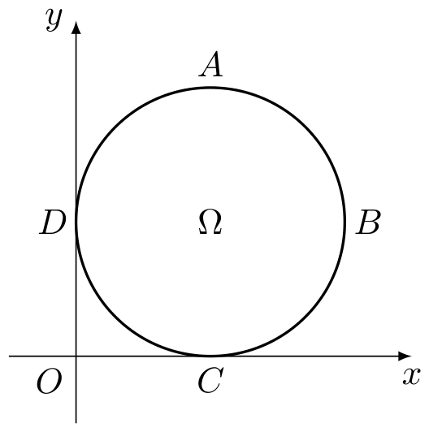
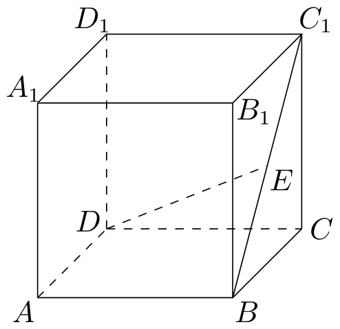
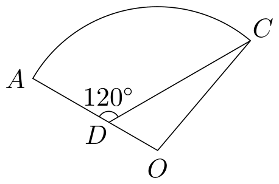

# 2008年上海卷（秋文）

## 填空题

### 第 1 题

不等式 $|x - 1| < 1$ 的解集是＿＿＿＿＿＿.

#### 答案

$\left(0,2\right)$

#### 解析

由绝对值不等式的等价关系，

$$

|x-1|<1\Longleftrightarrow -1<x-1<1\Longleftrightarrow 0<x<2

$$

所以解集为 $\left(0,2\right)$.

### 第 2 题

若集合 $A = \{x \mid x \leqslant 2\}$，$B = \{x \mid x \geqslant a\}$ 满足 $A \cap B = \{2\}$，则实数 $a =$＿＿＿＿＿＿.

#### 答案

$2$

#### 解析

当 $a\leqslant2$ 时，$A\cap B=\{x\mid a\leqslant x\leqslant2\}$. 若 $a<2$，交集含有无穷多个数；若 $a>2$，交集为空集. 只有 $a=2$ 时交集恰为 $\{2\}$，所以 $a=2$.

### 第 3 题

若复数 $z$ 满足 $z = \i(2 - z)$ （$\i$ 是虚数单位），则 $z =$＿＿＿＿＿＿.

#### 答案

$1+\i$

#### 解析

将题设等式移项，得 $(1+\i)z=2\i$. 因为 $1+\i\neq0$，所以

$$

z=\frac{2\i}{1+\i}=\frac{2\i(1-\i)}{(1+\i)(1-\i)}=\i(1-\i)=1+\i

$$

### 第 4 题

若函数 $f(x)$ 的反函数为 $f^{-1}(x)=\log_{2}x$，则 $f(x)=$＿＿＿＿＿＿.

#### 答案

$2^x$

#### 解析

函数 $y=\log_{2}x$ 的定义域为 $x>0$，值域为 $\mathbb{R}$，其反函数由交换变量得到 $y=2^x$. 题设给出的反函数为 $f^{-1}(x)=\log_{2}x$，因此原函数为 $f(x)=2^x$.

### 第 5 题

若向量 $\boldsymbol{a}$，$\boldsymbol{b}$ 满足 $|\boldsymbol{a}| = 1$，$|\boldsymbol{b}| = 2$，且 $\boldsymbol{a}$ 与 $\boldsymbol{b}$ 的夹角为 $\frac{\pi}{3}$，则 $|\boldsymbol{a}+ \boldsymbol{b}| =$＿＿＿＿＿＿.

#### 答案

$\sqrt{7}$

#### 解析

由向量和的模的平方公式，

$$

|\boldsymbol{a}+\boldsymbol{b}|^2=|\boldsymbol{a}|^2+|\boldsymbol{b}|^2+2|\boldsymbol{a}||\boldsymbol{b}|\cos\frac{\pi}{3}=1^2+2^2+2\cdot1\cdot2\cdot\frac12=7

$$

由于模长非负，得 $|\boldsymbol{a}+\boldsymbol{b}|=\sqrt7$.

### 第 6 题

若直线 $ax - y + 1 = 0$ 经过抛物线 $y^{2} = 4x$ 的焦点，则实数 $a =$＿＿＿＿＿＿.

#### 答案

$-1$

#### 解析

抛物线 $y^2=4x$ 的标准形式为 $y^2=4px$，故 $p=1$，焦点为 $(1,0)$. 将焦点坐标代入直线方程，得 $a\cdot1-0+1=0$， 所以 $a=-1$.

### 第 7 题

若 $z$ 是实系数方程 $x^{2} + 2x + p = 0$ 的一个虚根，且 $|z| = 2$，则 $p =$＿＿＿＿＿＿.

#### 答案

$4$

#### 解析

设虚根为 $z$. 因为方程是实系数方程，且 $z$ 为非实根，所以其另一根为 $\overline{z}$. 由韦达定理， $p=z\overline{z}=|z|^2=2^2=4$. 因此 $p=4$.

### 第 8 题

在平面直角坐标系中，从五个点：$A(0,0)$，$B(2,0)$，$C(1,1)$，$D(0,2)$，$E(2,2)$ 中任取三个，这三点能构成三角形的概率是＿＿＿＿＿＿. （结果用分数表示）

#### 答案

$\frac{4}{5}$

#### 解析

从五个点中任取三个点的取法总数为 $\mathrm C_5^3=10$. 对平面向量 $(u_1,v_1)$、$(u_2,v_2)$，记 $\det((u_1,v_1),(u_2,v_2))=u_1v_2-v_1u_2$. 三点共线当且仅当以其中一点为起点的两条向量的行列式为零. 十组点对应的行列式（取绝对值）依次为 $|\det(\overrightarrow{AB},\overrightarrow{AC})|=2$，$|\det(\overrightarrow{AB},\overrightarrow{AD})|=4$，$|\det(\overrightarrow{AB},\overrightarrow{AE})|=4$. $|\det(\overrightarrow{AC},\overrightarrow{AD})|=2$，$|\det(\overrightarrow{AC},\overrightarrow{AE})|=0$，$|\det(\overrightarrow{AD},\overrightarrow{AE})|=4$. $|\det(\overrightarrow{BC},\overrightarrow{BD})|=0$，$|\det(\overrightarrow{BC},\overrightarrow{BE})|=2$，$|\det(\overrightarrow{BD},\overrightarrow{BE})|=4$，$|\det(\overrightarrow{CD},\overrightarrow{CE})|=2$. 因此只有 $A$，$C$，$E$ 和 $B$，$C$，$D$ 三点共线，不能构成三角形的取法有 $2$ 种.

所以能构成三角形的取法有 $10-2=8$ 种，所求概率为

$$

\frac{8}{10}=\frac45

$$

### 第 9 题

若函数 $f(x) = (x + a)(bx + 2a)$ （常数 $a$，$b \in \mathbb{R}$）是偶函数，且它的值域为 $\left(-\infty, 4\right]$，则该函数的解析式 $f(x)=$＿＿＿＿＿＿.

#### 答案

$-2x^2+4$

#### 解析

展开函数式，得

$$

f(x)=(x+a)(bx+2a)=bx^2+a(b+2)x+2a^2

$$

函数为偶函数，所以一次项系数必须为零，即 $a(b+2)=0$.

若 $a=0$，则 $f(x)=bx^2$. 当 $b<0$ 时值域为 $\left(-\infty,0\right]$，当 $b=0$ 时值域为 $\{0\}$，当 $b>0$ 时值域为 $\left[0,+\infty\right)$，均不可能是 $\left(-\infty,4\right]$. 因而只能有 $b=-2$，此时

$$

f(x)=-2x^2+2a^2

$$

其值域为 $\left(-\infty,2a^2\right]$. 由题设 $2a^2=4$，故 $f(x)=-2x^2+4$.

### 第 10 题

已知总体的各个体的值由小到大依次为 $2$，$3$，$3$，$7$，$a$，$b$，$12$，$13.7$，$18.3$，$20$，且总体的中位数为 $10.5$. 若要使该总体的方差最小，则 $a$，$b$ 的取值分别是＿＿＿＿＿＿.

#### 答案

$a=10.5$，$b=10.5$

#### 解析

总体共有 $10$ 个数据，中位数为中间两个数据的平均数，因此 $\frac{a+b}{2}=10.5$，$a+b=21$. 由于其余数据固定，且 $a+b$ 固定，总体平均数也固定. 于是方差最小时，等价于 $a^2+b^2$ 最小. 由

$$

a^2+b^2\geqslant\frac{(a+b)^2}{2}=\frac{21^2}{2}

$$

等号成立当且仅当 $a=b$. 结合 $a+b=21$，得到 $a=b=10.5$，且满足原数据的大小顺序. 因此取值分别为 $a=10.5$，$b=10.5$.

### 第 11 题

在平面直角坐标系中，点 $A$，$B$，$C$ 的坐标分别为 $(0,1)$，$(4,2)$，$(2,6)$. 如果 $P(x,y)$ 是 $\triangle ABC$ 围成的区域（含边界）上的点，那么当 $w = xy$ 取到最大值时，点 $P$ 的坐标是＿＿＿＿＿＿.

#### 答案

$\left(\frac{5}{2},5\right)$

#### 解析

三角形区域的两条上边界所在直线分别为 $AC:y=1+\frac52x$，$BC:y=-2x+10$. 区域内 $x\geqslant0$，所以固定 $x$ 时，$w=xy$ 随 $y$ 增大而增大，只需考察上边界 $AC$ 与 $BC$.

当 $0\leqslant x\leqslant2$ 时，点在边 $AC$ 上方界，

$$

w=x\left(1+\frac52x\right)=x+\frac52x^2\leqslant2+\frac52\cdot2^2=12

$$

当 $2\leqslant x\leqslant4$ 时，点在边 $BC$ 上方界，

$$

w=x(10-2x)=-2\left(x-\frac52\right)^2+\frac{25}{2}\leqslant\frac{25}{2}

$$

等号在 $x=\frac52$ 时取得，此时 $y=10-2\cdot\frac52=5$. 因此最大值取得时点 $P$ 的坐标为 $\left(\frac52,5\right)$.

## 单选题

### 第 12 题

设 $P$ 是椭圆 $\frac{x^2}{25} + \frac{y^2}{16} = 1$ 上的点. 若 $F_1$，$F_2$ 是椭圆的两个焦点，则 $\left|PF_1\right| + \left|PF_2\right|$ 等于（）

A.  
$4$

B.  
$5$

C.  
$8$

D.  
$10$

#### 答案

D

#### 解析

椭圆 $\frac{x^2}{25}+\frac{y^2}{16}=1$ 的长半轴为 $5$. 椭圆上任一点到两个焦点的距离之和等于长轴长，即 $|PF_1|+|PF_2|=2\times5=10$. 所以正确选项为 D.

### 第 13 题

给定空间中的直线 $l$ 及平面 $\alpha$，条件“直线 $l$ 与平面 $\alpha$ 内无数条直线都垂直”是“直线 $l$ 与平面 $\alpha$ 垂直”的（）

A.  
充分非必要条件

B.  
必要非充分条件

C.  
充要条件

D.  
既非充分又非必要条件

#### 答案

B

#### 解析

若 $l\perp\alpha$，则直线 $l$ 垂直于平面 $\alpha$ 内所有与其相交的直线，因而必垂直于平面内无数条直线，所以题述条件是必要条件.

反之，取 $\alpha$ 为 $xOy$ 平面，取 $l$ 为 $x$ 轴. 对任意 $c\in\mathbb{R}$，平面 $\alpha$ 内的直线 $m_c\colon x=c$ 都与 $l$ 相交且垂直，因此 $l$ 与平面 $\alpha$ 内无数条直线垂直；但 $l\subset\alpha$，所以 $l$ 不垂直于 $\alpha$. 因此题述条件不是充分条件，故为必要非充分条件，正确选项为 B.

### 第 14 题

若数列 $\{a_{n}\}$ 是首项为 $1$，公比为 $a - \frac{3}{2}$ 的无穷等比数列，且 $\{a_{n}\}$ 各项的和为 $a$，则 $a$ 的值是（）

A.  
$1$

B.  
$2$

C.  
$\frac{1}{2}$

D.  
$\frac{5}{4}$

#### 答案

B

#### 解析

设无穷等比数列的公比为 $q=a-\frac32$. 由于各项和存在，必须满足 $|q|<1$，且

$$

a=\frac{1}{1-q}=\frac{1}{1-(a-\frac32)}=\frac{1}{\frac52-a}

$$

于是

$$

a\left(\frac52-a\right)=1
\Longleftrightarrow 2a^2-5a+2=0

$$

解得 $a=2$ 或 $a=\frac12$. 当 $a=\frac12$ 时，$q=-1$，不满足 $|q|<1$，舍去；当 $a=2$ 时，$q=\frac12$，满足收敛条件. 因此正确选项为 B.

### 第 15 题

如图，在平面直角坐标系中，$\Omega$ 是一个与 $x$ 轴的正半轴，$y$ 轴的正半轴分别相切于点 $C$，$D$ 的定圆所围成区域（含边界），$A$，$B$，$C$，$D$ 是该圆的四等分点. 若点 $P(x, y)$，点 $P'(x', y')$ 满足 $x \leqslant x'$ 且 $y \geqslant y'$，则称 $P$ 优于 $P'$. 如果 $\Omega$ 中的点 $Q$ 满足：不存在 $\Omega$ 中的其它点优于 $Q$，那么所有这样的点 $Q$ 组成的集合是劣弧（）

A.  
弧 $AB$

B.  
弧 $BC$

C.  
弧 $CD$

D.  
弧 $DA$

#### 答案

D

#### 解析

设圆的半径为 $r>0$，则其圆心为 $(r,r)$，四等分点可表示为 $A=(r,2r)$，$B=(2r,r)$，$C=(r,0)$，$D=(0,r)$. 先看圆盘内部的点. 若点在内部，向左上方作足够短的移动仍在圆盘内，所得点的横坐标更小、纵坐标更大，因此该点不可能是题述集合中的点.

在劣弧 $AB$（不含端点 $A$）和劣弧 $BC$ 上，点 $A$ 的横坐标不大于该点、纵坐标不小于该点，所以这些点均被 $A$ 优于. 在劣弧 $CD$（不含端点 $D$）上，沿圆弧向 $D$ 移动可得到横坐标更小且纵坐标更大的圆盘内点，所以这些点也都不满足条件.

对劣弧 $DA$ 上任一点 $Q$，若圆盘内另有点 $P$ 满足 $x_P\leqslant x_Q$、$y_P\geqslant y_Q$，则相对于圆心有 $r-x_P\geqslant r-x_Q$，$y_P-r\geqslant y_Q-r$ 且至少一个不等号严格成立，从而 $P$ 到圆心的距离大于 $Q$ 到圆心的距离 $r$，这与 $P$ 在圆盘内矛盾. 因此劣弧 $DA$ 上的点恰好满足题设条件，正确选项为 D.

## 解答题

### 第 16 题

如图，在棱长为 $2$ 的正方体 $ABCD-A_1B_1C_1D_1$ 中，$E$ 是 $BC_1$ 的中点. 求直线 $DE$ 与平面 $ABCD$ 所成角的大小.（结果用反三角函数表示）

#### 解析

建立空间直角坐标系，令 $A=(0,0,0)$，$B=(2,0,0)$，$D=(0,2,0)$，$A_1=(0,0,2)$，则 $C_1=(2,2,2)$. 由于 $E$ 是 $BC_1$ 的中点，所以 $E=(2,1,1)$. 设 $E_0=(2,1,0)$，则 $E_0$ 是点 $E$ 在平面 $ABCD$ 上的射影，且

$DE_0=\sqrt{(2-0)^2+(1-2)^2}=\sqrt{5}$，$EE_0=1$. 因此，直线 $DE$ 与平面 $ABCD$ 所成角就是直角三角形 $DEE_0$ 的锐角 $\theta$，从而

$$

\tan\theta=\frac{EE_0}{DE_0}=\frac{1}{\sqrt{5}}=\frac{\sqrt{5}}{5}

$$

所以直线 $DE$ 与平面 $ABCD$ 所成角为 $\arctan\frac{\sqrt{5}}{5}$.

### 第 17 题

如图，某住宅小区的平面图呈扇形 $AOC$. 小区的两个出入口设置在点 $A$ 及点 $C$ 处，小区里有两条笔直的小路 $AD$，$DC$，且拐弯处的转角为 $120^{\circ}$. 已知某人从 $C$ 沿 $CD$ 走到 $D$ 用了 $10\text{ 分钟}$，从 $D$ 沿 $DA$ 走到 $A$ 用了 $6\text{ 分钟}$. 若此人步行的速度为每分钟 $50\text{ 米}$，求该扇形的半径 $OA$ 的长.（精确到 $1\text{ 米}$）

#### 解析

由图可知 $A$，$D$，$O$ 共线，且 $D$ 在线段 $AO$ 上. 设扇形半径 $OA=R$. 由步行速度可得

$AD=6\times50=300\text{ 米}$，$CD=10\times50=500\text{ 米}$，所以 $OD=R-300$. 又因为 $\angle CDA=120^{\circ}$，而射线 $DO$ 与射线 $DA$ 方向相反，所以 $\angle ODC=60^{\circ}$.

在三角形 $ODC$ 中，由余弦定理，

$$

R^2=(R-300)^2+500^2-2(R-300)\times500\cos60^{\circ}

$$

整理得

$$

R^2=R^2-1100R+490000

$$

所以 $R=\frac{490000}{1100}=445.\overline{45}\text{ 米}$. 按题意精确到 $1$ 米，得扇形半径 $OA$ 的长约为 $445\text{ 米}$.

### 第 18 题

已知函数 $f(x) = \sin 2x$，$g(x) = \cos \left(2x + \frac{\pi}{6}\right)$，直线 $x = t$（$t \in \mathbb{R}$）与函数 $f(x)$，$g(x)$ 的图象分别交于 $M$，$N$ 两点.

1.  当 $t = \frac{\pi}{4}$ 时，求 $|MN|$ 的值；

2.  求 $\left|MN\right|$ 在 $t \in \left[0, \frac{\pi}{2}\right]$ 时的最大值.

#### 解析

1.  当 $t=\frac{\pi}{4}$ 时，

$$

\lvert MN\rvert=\left|\sin\frac{\pi}{2}-\cos\frac{2\pi}{3}\right|=\left|1+\frac{1}{2}\right|=\frac{3}{2}

$$

2.  由于 $M$，$N$ 的横坐标相同，

$$

\lvert MN\rvert=\left|\sin2t-\cos\left(2t+\frac{\pi}{6}\right)\right|=\left|\sin2t-\sin\left(\frac{\pi}{3}-2t\right)\right|=\sqrt{3}\left|\sin\left(2t-\frac{\pi}{6}\right)\right|

$$

    当 $t\in\left[0,\frac{\pi}{2}\right]$ 时，$2t-\frac{\pi}{6}\in\left[-\frac{\pi}{6},\frac{5\pi}{6}\right]$，其中包含 $\frac{\pi}{2}$，因此 $\left|\sin\left(2t-\frac{\pi}{6}\right)\right|$ 的最大值为 $1$. 所以 $\lvert MN\rvert$ 的最大值为 $\sqrt{3}$，此时 $t=\frac{\pi}{3}$.

### 第 19 题

已知函数 $f(x) = 2^x - \frac{1}{2^{|x|}}$.

1.  若 $f(x) = 2$，求 $x$ 的值；

2.  若 $2^{t}f(2t) + mf(t) \geqslant 0$ 对于 $t \in \left[1,2\right]$ 恒成立，求实数 $m$ 的取值范围.

#### 解析

1.  当 $x<0$ 时，$|x|=-x$，所以 $f(x)=2^x-\frac{1}{2^{-x}}=2^x-2^x=0$，不可能满足 $f(x)=2$.

    当 $x\geqslant0$ 时，令 $u=2^x>0$，则 $f(x)=u-\frac{1}{u}=2$. 因而 $u^2-2u-1=0$， 解得 $u=1+\sqrt{2}$ 或 $u=1-\sqrt{2}$. 因为 $u>0$，所以 $u=1+\sqrt{2}$，从而 $x=\log_{2}(1+\sqrt{2})$.

2.  当 $t\in\left[1,2\right]$ 时，$t>0$，故 $f(t)=2^t-2^{-t}>0$. 令 $u=2^t$，则 $u\in\left[2,4\right]$，且 $f(t)=u-\frac{1}{u}=\frac{u^2-1}{u}$，$f(2t)=u^2-\frac{1}{u^2}=\frac{(u^2-1)(u^2+1)}{u^2}$. 因此

$$

\frac{2^tf(2t)}{f(t)}
    =\frac{u\cdot\frac{(u^2-1)(u^2+1)}{u^2}}{\frac{u^2-1}{u}}=u^2+1=2^{2t}+1

$$

    原不等式等价于 $m\geqslant-(2^{2t}+1)$. 这里 $t\in\left[1,2\right]$，右端的最大值为 $-5$，所以不等式对所有 $t\in\left[1,2\right]$ 恒成立的充要条件是 $m\geqslant-5$. 因此 $m$ 的取值范围为 $\left[-5,+\infty\right)$.

### 第 20 题

已知双曲线 $C: \frac{x^2}{2} - y^2 = 1$.

1.  求双曲线 $C$ 的渐近线方程；

2.  已知点 $M$ 的坐标为 $(0,1)$. 设 $P$ 是双曲线 $C$ 上的点，$Q$ 是点 $P$ 关于原点的对称点. 记 $\lambda = \overrightarrow{MP} \cdot \overrightarrow{MQ}$，求 $\lambda$ 的取值范围；

3.  已知点 $D$，$E$，$M$ 的坐标分别为 $(-2, -1)$，$(2, -1)$，$(0, 1)$，$P$ 为双曲线 $C$ 上在第一象限内的点. 记 $l$ 为经过原点与点 $P$ 的直线，$s$ 为 $\triangle DEM$ 截直线 $l$ 所得线段的长. 试将 $s$ 表示为直线 $l$ 的斜率 $k$ 的函数.

#### 解析

1.  将双曲线方程中的常数项 $1$ 换成 $0$，得到渐近线方程 $\frac{x^2}{2}-y^2=0$， 即 $y=\pm\frac{\sqrt{2}}{2}x$.

2.  设 $P=(x,y)$，则 $Q=(-x,-y)$. 因而

$$

\lambda=\overrightarrow{MP}\cdot\overrightarrow{MQ}=(x,y-1)\cdot(-x,-y-1)=1-x^2-y^2

$$

    由 $P\in C$ 得 $x^2=2y^2+2$，所以

$$

\lambda=1-(2y^2+2)-y^2=-3y^2-1\leqslant-1

$$

    当 $y=0$ 时取到 $-1$，而当 $|y|$ 无限增大时，$\lambda$ 趋于负无穷，因此 $\lambda$ 的取值范围为 $\left(-\infty,-1\right]$.

3.  设直线 $l$ 的方程为 $y=kx$. 因为 $P$ 在双曲线 $C$ 的第一象限内，所以 $k>0$，且

$$

\frac{x^2}{2}-k^2x^2=1

$$

    要有第一象限内的交点，必须 $\frac{1}{2}-k^2>0$，故 $k\in\left(0,\frac{\sqrt{2}}{2}\right)$.

    直线 $EM$ 的方程为 $y=-x+1$，它与 $l$ 的交点在第一象限方向上. 解得交点横坐标为 $\frac{1}{k+1}$，所以从原点到该交点的长度为

$$

\frac{\sqrt{1+k^2}}{k+1}

$$

    直线与边 $DM$ 的交点满足 $kx=x+1$，故其横坐标为 $x=\frac{1}{k-1}=-\frac{1}{1-k}$. 这个交点在线段 $DM$ 上当且仅当 $-2\leqslant-\frac{1}{1-k}<0$，即 $0<k\leqslant\frac{1}{2}$. 此时交点到原点的长度为 $\frac{\sqrt{1+k^2}}{1-k}$，于是

$$

s(k)=\frac{\sqrt{1+k^2}}{k+1}+\frac{\sqrt{1+k^2}}{1-k}=\frac{2\sqrt{1+k^2}}{1-k^2}

$$

    当 $\frac{1}{2}<k<\frac{\sqrt{2}}{2}$ 时，直线的另一侧不能与 $DM$ 相交，而与边 $DE$ 相交. 交点满足 $y=-1$，故 $x=-\frac{1}{k}$，且到原点的长度为 $\frac{\sqrt{1+k^2}}{k}$，于是

$$

s(k)=\frac{\sqrt{1+k^2}}{k+1}+\frac{\sqrt{1+k^2}}{k}=\frac{(2k+1)\sqrt{1+k^2}}{k(k+1)}

$$

### 第 21 题

已知数列 $\{a_{n}\}$：$a_{1} = 1$，$a_{2} = 2$，$a_{3} = r$，$a_{n+3} = a_{n} + 2$（$n$ 是正整数），与数列 $\{b_{n}\}$：$b_{1} = 1$，$b_{2} = 0$，$b_{3} = -1$，$b_{4} = 0$，$b_{n+4} = b_{n}$（$n$ 是正整数）. 记 $T_{n} = b_{1}a_{1} + b_{2}a_{2} + b_{3}a_{3} + \cdots + b_{n}a_{n}$.

1.  若 $a_1 + a_2 + a_3 + \cdots + a_{12} = 64$，求 $r$ 的值；

2.  求证：当 $n$ 是正整数时，$T_{12n} = -4n$；

3.  已知 $r > 0$，且存在正整数 $m$，使得在 $T_{12m+1}$，$T_{12m+2}$，$\cdots$，$T_{12m+12}$ 中有 4 项为 100，求 $r$ 的值，并指出哪 4 项为 100.

#### 解析

1.  由递推关系，前 $12$ 项为 $1$，$2$，$r$，$3$，$4$，$r+2$，$5$，$6$，$r+4$，$7$，$8$，$r+6$. 因而 $a_1+a_2+\cdots+a_{12}=48+4r$. 由题设 $48+4r=64$，解得 $r=4$.

2.  由 $a_{n+3}=a_n+2$ 可知，对 $1\leqslant j\leqslant12$，有 $a_{12k+j}=a_j+8k$. 又因为 $b_n$ 的一个周期为 $1$，$0$，$-1$，$0$，所以每连续 $12$ 项中只有下标 $12k+1$，$12k+3$，$12k+5$，$12k+7$，$12k+9$，$12k+11$ 对 $T_n$ 有贡献. 因此

$$

T_{12(k+1)}-T_{12k}=a_{12k+1}-a_{12k+3}+a_{12k+5}-a_{12k+7}+a_{12k+9}-a_{12k+11}

$$

    代入各项的表达式，得

$$

T_{12(k+1)}-T_{12k}=(8k+1)-(8k+r)+(8k+4)-(8k+5)+(8k+r+4)-(8k+8)=-4

$$

    直接计算 $T_{12}=a_1-a_3+a_5-a_7+a_9-a_{11}=-4$，所以每个长度为 $12$ 的分组贡献 $-4$，从而 $T_{12n}=-4n$.

3.  由上面的结论 $T_{12m}=-4m$，并利用 $a_{12m+1}=8m+1$、$a_{12m+3}=8m+r$、$a_{12m+5}=8m+4$、$a_{12m+7}=8m+5$、$a_{12m+9}=8m+r+4$、$a_{12m+11}=8m+8$，以及相应的 $b_n$ 周期，逐项累加得到 $T_{12m+1}=T_{12m+2}=1+4m$， $T_{12m+3}=T_{12m+4}=1-r-4m$， $T_{12m+5}=T_{12m+6}=5-r+4m$， $T_{12m+7}=T_{12m+8}=-r-4m$， $T_{12m+9}=T_{12m+10}=4+4m$， $T_{12m+11}=T_{12m+12}=-4-4m$.

    其中 $m$ 为正整数、$r>0$，所以第二、第四和第六组的值均小于 $0$. 若第一组的值等于 $100$，则 $m=\frac{99}{4}$，与 $m$ 为正整数矛盾. 要有四项为 $100$，只能使第三组和第五组同时等于 $100$. 于是

$$

\begin{cases}
    5-r+4m=100,\\
    4+4m=100.
    \end{cases}

$$

    由此得 $m=24$，$r=1$. 所以为 $100$ 的四项是 $T_{12m+5}$，$T_{12m+6}$，$T_{12m+9}$，$T_{12m+10}$.
