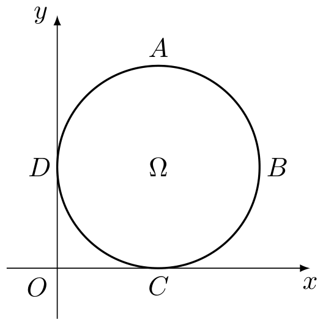
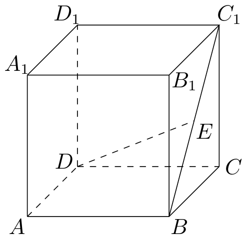
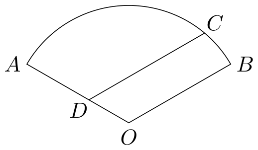

# 2008年上海卷（秋理）

## 填空题

### 第 1 题

不等式 $|x - 1| < 1$ 的解集是＿＿＿＿＿＿.

#### 答案

$(0,2)$

#### 解析

由绝对值不等式的定义，$|x-1|<1$ 等价于 $-1<x-1<1$，所以 $0<x<2$. 因此解集为 $(0,2)$.

### 第 2 题

若集合 $A = \{x \mid x \leq 2\}$，$B = \{x \mid x \geqslant a\}$ 满足 $A \cap B = \{2\}$，则实数 $a =$＿＿＿＿＿＿.

#### 答案

$2$

#### 解析

由 $A=\{x\mid x\leqslant2\}$，$B=\{x\mid x\geqslant a\}$ 可知：当 $a>2$ 时，$A\cap B=\varnothing$；当 $a\leqslant2$ 时，$A\cap B=[a,2]$. 题设交集为单元素集合 $\{2\}$，所以只能取 $a\leqslant2$ 且 $a=2$，故 $a=2$.

### 第 3 题

若复数 $z$ 满足 $z = \i(2 - z)$（$\i$ 是虚数单位），则 $z=$＿＿＿＿＿＿.

#### 答案

$1+\i$

#### 解析

由 $z=\i(2-z)$ 得 $(1+\i)z=2\i$. 于是

$$

z=\frac{2\i}{1+\i}=\frac{2\i(1-\i)}{(1+\i)(1-\i)}=1+\i

$$

### 第 4 题

若函数 $f(x)$ 的反函数为 $f^{-1}(x) = x^2$（$x > 0$），则 $f(4) =$＿＿＿＿＿＿.

#### 答案

$2$

#### 解析

因为 $f^{-1}(x)=x^2$（$x>0$），所以对 $x>0$，函数 $f$ 是平方函数在正数范围内的反函数，即 $f(x)=\sqrt{x}$. 因此 $f(4)=\sqrt4=2$.

### 第 5 题

若向量 $\boldsymbol{a}$，$\boldsymbol{b}$ 满足 $|\boldsymbol{a}| = 1$，$|\boldsymbol{b}| = 2$，且 $\boldsymbol{a}$ 与 $\boldsymbol{b}$ 的夹角为 $\frac{\pi}{3}$，则 $|\boldsymbol{a}+ \boldsymbol{b}| =$＿＿＿＿＿＿.

#### 答案

$\sqrt{7}$

#### 解析

由向量模长平方公式，

$$

|\boldsymbol{a}+\boldsymbol{b}|^2=|\boldsymbol{a}|^2+|\boldsymbol{b}|^2+2|\boldsymbol{a}|\,|\boldsymbol{b}|\cos\frac{\pi}{3}=1^2+2^2+2\cdot1\cdot2\cdot\frac12=7

$$

由于模长非负，$|\boldsymbol{a}+\boldsymbol{b}|=\sqrt7$.

### 第 6 题

函数 $f(x) = \sqrt{3}\sin x + \sin \left(\frac{\pi}{2} + x\right)$ 的最大值是＿＿＿＿＿＿.

#### 答案

$2$

#### 解析

由 $\sin\left(\frac{\pi}{2}+x\right)=\cos x$，得

$$

f(x)=\sqrt3\sin x+\cos x=2\sin\left(x+\frac{\pi}{6}\right)

$$

正弦函数的最大值为 $1$，所以 $f(x)$ 的最大值为 $2$.

### 第 7 题

在平面直角坐标系中，从六个点： $A(0,0)$，$B(2,0)$，$C(1,1)$，$D(0,2)$，$E(2,2)$，$F(3,3)$ 中任取三个，这三点能构成三角形的概率是＿＿＿＿＿＿. （结果用分数表示）

#### 答案

$\frac{3}{4}$

#### 解析

从六个点中任取三个共有 $\mathrm C_6^3=20$ 种取法. $A(0,0)$、$C(1,1)$、$E(2,2)$、$F(3,3)$ 在直线 $y=x$ 上，由其中任取三个得到 $\mathrm C_4^3=4$ 个不能构成三角形的取法. 逐一考察各点对的直线：$AC$、$AE$、$AF$、$CE$、$CF$、$EF$ 的斜率均为 $1$，正好对应直线 $y=x$ 上的四点；$BC$、$BD$、$CD$ 的斜率均为 $-1$，正好对应直线 $x+y=2$ 上的三点. 其余点对中，$AB$、$DE$ 虽斜率均为 $0$，但分别位于直线 $y=0$、$y=2$ 上；$AD$、$BE$ 分别为直线 $x=0$、$x=2$；$BF$、$DF$ 的斜率分别为 $3$、$\frac13$，均不能再与第三个给定点共线. 因而不能构成三角形的取法只有上述两类，共 $\mathrm C_4^3+1=5$ 种，能构成三角形的取法有 $20-5=15$ 种，所求概率为 $\frac{15}{20}=\frac34$.

### 第 8 题

设函数 $f(x)$ 是定义在 $\mathbb{R}$ 上的奇函数. 若当 $x \in (0, +\infty)$ 时，$f(x) = \lg x$，则满足 $f(x) > 0$ 的 $x$ 的取值范围是＿＿＿＿＿＿.

#### 答案

$(-1,0)\cup(1,+\infty)$

#### 解析

当 $x>0$ 时，$f(x)=\lg x>0$ 等价于 $x>1$. 当 $x<0$ 时，由奇函数性质，$f(x)=-f(-x)=-\lg(-x)$，所以 $f(x)>0$ 等价于 $\lg(-x)<0$，即 $0<-x<1$，从而 $-1<x<0$. 又 $f(0)=0$，不满足严格不等式. 因此满足条件的 $x$ 的取值范围是 $(-1,0)\cup(1,+\infty)$.

### 第 9 题

已知总体的各个体的值由小到大依次为 $2$，$3$，$3$，$7$，$a$，$b$，$12$，$13.7$，$18.3$，$20$，且总体的中位数为 $10.5$. 若要使该总体的方差最小，则 $a$，$b$ 的取值分别是＿＿＿＿＿＿.

#### 答案

$a=10.5$，$b=10.5$

#### 解析

总体共有 10 个数据，且数据已按从小到大排列，所以 $7\leqslant a\leqslant b\leqslant12$. 中位数为中间两项 $a$，$b$ 的平均数，故 $\frac{a+b}{2}=10.5$，即 $a+b=21$. 因而总体平均数为 $10$，与 $a$，$b$ 的具体取值无关. 由方差公式 $D=\frac1{10}\sum x_i^2-\overline{x}^{2}$，前后固定的 8 个数据及总体平均数均不变，所以只需使 $a^2+b^2$ 最小. 由

$$

a^2+b^2=\frac{(a+b)^2+(a-b)^2}{2}=\frac{21^2+(a-b)^2}{2}

$$

可知当且仅当 $a=b$ 时取得最小值. 结合 $a+b=21$，得 $a=b=10.5$.

### 第 10 题

某海域内有一孤岛，岛四周的海平面（视为平面）上有一浅水区（含边界），其边界是长轴长为 $2a$，短轴长为 $2b$ 的椭圆. 已知岛上甲，乙导航灯的海拔高度分别为 $h_1$，$h_2$，且两个导航灯在海平面上的投影恰好落在椭圆的两个焦点上，现有船只经过该海域（船只的大小忽略不计）. 在船上测得甲，乙导航灯的仰角分别为 $\theta_1$，$\theta_2$，那么船只已进入该浅水区的判别条件是＿＿＿＿＿＿.

#### 答案

$h_1\cot\theta_1+h_2\cot\theta_2\leqslant 2a$

#### 解析

设船在海平面上的投影为 $S$，甲、乙导航灯在海平面上的投影分别为椭圆的两个焦点 $F_1$，$F_2$. 由仰角定义，在相应的直角三角形中有 $SF_1=h_1\cot\theta_1$，$SF_2=h_2\cot\theta_2$. 椭圆的长轴长为 $2a$，其内部及边界上的点到两个焦点的距离之和不超过 $2a$. 因此船已进入浅水区的充要条件为 $SF_1+SF_2\leqslant2a$，即 $h_1\cot\theta_1+h_2\cot\theta_2\leqslant2a$.

### 第 11 题

方程 $x^{2} + \sqrt{2} x - 1 = 0$ 的解可视为函数 $y = x + \sqrt{2}$ 的图象与函数 $y = \frac{1}{x}$ 的图象交点的横坐标. 若 $x^{4} + ax - 4 = 0$ 的各个实根 $x_{1}$，$x_{2}$，$\dots$，$x_{k}$（$k \leqslant 4$）所对应的点 $\left(x_{i}, \frac{4}{x_{i}}\right)$（$i=1$，$2$，$\dots$，$k$）均在直线 $y = x$ 的同侧，则实数 $a$ 的取值范围是＿＿＿＿＿＿.

#### 答案

$(- \infty,-6)\cup(6,+\infty)$

#### 解析

令 $F(x)=x^4+ax-4$. 因为 $F(0)=-4<0$，且 $F(x)$ 在两端趋于正无穷，又 $F'(x)=4x^3+a$ 严格递增，所以方程恰有一个负实根和一个正实根，记为 $x_-<0<x_+$. 在根处有 $x_i^4+ax_i=4$，所以相应点的纵坐标为 $4/x_i$. 比较该点与直线 $y=x$ 的位置，只需考察

$$

\frac4{x_i}-x_i=\frac{4-x_i^2}{x_i}

$$

又 $F(2)=12+2a$，$F(-2)=12-2a$. 若 $a<-6$，则 $F(2)<0$，故正根 $x_+>2$；同时 $a<6$，故负根 $-2<x_-<0$. 这两个根对应的点都在直线 $y=x$ 下方. 若 $a>6$，则 $x_-<-2$，且 $0<x_+<2$，这两个根对应的点都在直线 $y=x$ 上方.

当 $-6<a<6$ 时，$-2<x_-<0$ 对应点在直线下方，而 $0<x_+<2$ 对应点在直线上方，不能同侧；当 $a=-6$ 或 $a=6$ 时有一个对应点落在直线上，也不满足同侧. 因此 $a$ 的取值范围为 $(-\infty,-6)\cup(6,+\infty)$.

## 单选题

### 第 12 题

组合数 $\mathrm C_n^r$（$n > r\geqslant 1$，$n$，$r\in \mathbb{Z}$）恒等于（$\quad$）

A.  
$\frac{r + 1}{n + 1} \mathrm C_{n - 1}^{r - 1}$

B.  
$(n + 1)(r + 1)\mathrm C_{n - 1}^{r - 1}$

C.  
$nr\mathrm C_{n - 1}^{r - 1}$

D.  
$\frac{n}{r} \mathrm C_{n - 1}^{r - 1}$

#### 答案

D

#### 解析

由组合数公式，$\mathrm C_n^r=\frac{n!}{r!(n-r)!}=\frac{n}{r}\mathrm C_{n-1}^{r-1}$，所以恒等式对应选项 D.

### 第 13 题

给定空间中的直线 $l$ 及平面 $\alpha$，条件“直线 $l$ 与平面 $\alpha$ 内无数条直线都垂直”是“直线 $l$ 与平面 $\alpha$ 垂直”的（$\quad$）

A.  
充要条件

B.  
充分非必要条件

C.  
必要非充分条件

D.  
既非充分又非必要条件

#### 答案

C

#### 解析

若 $l\perp\alpha$，则 $l$ 与过其垂足的平面 $\alpha$ 内任意直线都垂直，所以题设条件是 $l\perp\alpha$ 的必要条件. 反过来，只知道 $l$ 与平面内无数条直线垂直，不能保证这些直线中有两条相交直线构成判定直线垂直平面的条件. 例如取 $l\subset\alpha$，则平面 $\alpha$ 内所有与 $l$ 垂直的平行直线都与 $l$ 垂直，但 $l$ 显然不垂直于 $\alpha$. 因此该条件不是充分条件，选 C.

### 第 14 题

若数列 $\{a_{n}\}$ 是首项为$1$，公比为 $a - \frac{3}{2}$ 的无穷等比数列，且 $\{a_{n}\}$ 的各项和为 $a$，则 $a$ 的值是（$\quad$）

A.  
$1$

B.  
$2$

C.  
$\frac{1}{2}$

D.  
$\frac{5}{4}$

#### 答案

B

#### 解析

无穷等比数列的公比为 $a-\frac32$，要有有限和必须满足 $\left|a-\frac32\right|<1$. 由首项为 $1$ 且各项和为 $a$，有 $a=\frac{1}{1-\left(a-\frac32\right)}=\frac{1}{\frac52-a}$. 所以 $2a^2-5a+2=0$，解得 $a=2$ 或 $a=\frac12$. 当 $a=2$ 时公比为 $\frac12$，满足收敛条件；当 $a=\frac12$ 时公比为 $-1$，无穷等比数列不收敛. 故 $a=2$，选 B.

### 第 15 题

如图，在平面直角坐标系中，$\Omega$ 是一个与 $x$ 轴的正半轴，$y$ 轴的正半轴分别相切于点 $C$，$D$ 的定圆所围成区域（含边界），$A$，$B$，$C$，$D$ 是该圆的四等分点. 若点 $P(x, y)$，点 $P'(x', y')$ 满足 $x \leqslant x'$ 且 $y \geqslant y'$，则称 $P$ 优于 $P'$. 如果 $\Omega$ 中的点 $Q$ 满足：不存在 $\Omega$ 中的其它点优于 $Q$，那么所有这样的点 $Q$ 组成的集合是劣弧（$\quad$）

A.  
$\overset{\frown}{AB}$

B.  
$\overset{\frown}{BC}$

C.  
$\overset{\frown}{CD}$

D.  
$\overset{\frown}{DA}$

#### 答案

D

#### 解析

设圆的半径为 $r$，则圆心为 $(r,r)$，四等分点依次可记为 $A=(r,2r)$，$B=(2r,r)$，$C=(r,0)$，$D=(0,r)$. 在左半圆的上半弧 $\overset{\frown}{DA}$ 上，点的纵坐标可写成 $\varphi(x)=r+\sqrt{r^2-(x-r)^2}$，$0\leqslant x\leqslant r$ 函数 $\varphi(x)$ 在 $[0,r]$ 上递增. 若 $Q$ 在 $\overset{\frown}{DA}$ 上，且 $P\in\Omega$ 满足 $x_P\leqslant x_Q$，则 $x_P\in[0,r]$，从而 $y_P\leqslant\varphi(x_P)\leqslant\varphi(x_Q)=y_Q$. 因此除 $P=Q$ 外，不可能再有 $y_P\geqslant y_Q$，所以 $\overset{\frown}{DA}$ 上的点均满足题设条件.

若 $Q$ 不在 $\overset{\frown}{DA}$ 上且 $x_Q\leqslant r$，则取同横坐标的上边界点 $P=(x_Q,\varphi(x_Q))$，有 $y_P\geqslant y_Q$，故 $P$ 优于 $Q$. 若 $x_Q>r$，则点 $A=(r,2r)$ 满足 $x_A\leqslant x_Q$，$y_A\geqslant y_Q$，也优于 $Q$. 所以所有符合条件的点组成劣弧 $\overset{\frown}{DA}$，选 D.

## 解答题

### 第 16 题

如图，在棱长为 $2$ 的正方体 $ABCD - A_{1}B_{1}C_{1}D_{1}$ 中，$E$ 是 $BC_{1}$ 的中点. 求直线 $DE$ 与平面 $ABCD$ 所成角的大小. （结果用反三角函数表示）

#### 解析

设 $F$ 为点 $E$ 在 $BC$ 上的射影，连接 $DF$. 因为 $E$ 是 $BC_{1}$ 的中点，所以在正方形 $BCC_{1}B_{1}$ 中，$F$ 是 $BC$ 的中点，从而 $EF\parallel CC_{1}$. 又因为 $CC_{1}\perp\text{平面 }ABCD$，所以 $EF\perp\text{平面 }ABCD$，直线 $DF$ 是直线 $DE$ 在平面 $ABCD$ 上的射影，故 $\angle EDF$ 就是直线 $DE$ 与平面 $ABCD$ 所成的角. 由于正方体棱长为 $2$，有 $EF=\dfrac{1}{2}CC_{1}=1$，$CF=\dfrac{1}{2}CB=1$，且 $DC\perp CF$，所以 $DF=\sqrt{DC^{2}+CF^{2}}=\sqrt{5}$. 因而 $\tan\angle EDF=\dfrac{EF}{DF}=\dfrac{\sqrt{5}}{5}$，所求角的大小为 $\arctan\dfrac{\sqrt{5}}{5}$.

### 第 17 题

如图，某住宅小区的平面图呈圆心角为 $120^{\circ}$ 的扇形 $AOB$. 小区的两个出入口设置在点 $A$ 及点 $C$ 处，且小区里有一条平行于 $BO$ 的小路 $CD$，已知某人从 $C$ 沿 $CD$ 走到 $D$ 用了 $10$ 分钟，从 $D$ 沿 $DA$ 走到 $A$ 用了 $6$ 分钟，若此人步行的速度为每分钟 $50$ 米，求该扇形的半径 $OA$ 的长. （精确到 $1$ 米）

#### 解析

由步行速度和用时可得 $CD=10\times50=500\mathrm{~m}$，$DA=6\times50=300\mathrm{~m}$. 因为 $CD\parallel BO$，且 $D$，$A$，$O$ 共线，所以 $\angle CDA=\angle BOA=120^{\circ}$. 在 $\triangle ACD$ 中，由余弦定理，$AC^{2}=CD^{2}+AD^{2}-2CD\cdot AD\cos120^{\circ}=500^{2}+300^{2}+2\times500\times300\times\dfrac{1}{2}=700^{2}$，从而 $AC=700\mathrm{~m}$. 由余弦定理，$\cos\angle CAD=\dfrac{AC^{2}+AD^{2}-CD^{2}}{2AC\cdot AD}=\dfrac{11}{14}$. 设圆心 $O$ 到弦 $AC$ 的垂线交 $AC$ 于 $H$，则 $AH=\dfrac{AC}{2}=350\mathrm{~m}$，且 $\angle HAO=\angle CAO=\angle CAD$. 在直角三角形 $AHO$ 中，$OA=\dfrac{AH}{\cos\angle HAO}=350\times\dfrac{14}{11}=\dfrac{4900}{11}\mathrm{~m}\approx445\mathrm{~m}$. 因此该扇形的半径约为 $445\mathrm{~m}$.

### 第 18 题

已知函数 $f(x) = \sin 2x$，$g(x) = \cos \left(2x + \frac{\pi}{6}\right)$. 直线 $x=t$（$t\in\mathbb{R}$）与函数 $f(x)$，$g(x)$ 的图象分别交于 $M$，$N$ 两点.

1.  当 $t = \frac{\pi}{4}$ 时，求 $|MN|$ 的值；

2.  求 $\left|MN\right|$ 在 $t \in \left[0, \frac{\pi}{2}\right]$ 时的最大值.

#### 解析

1.  当 $t=\dfrac{\pi}{4}$ 时，$M$、$N$ 的纵坐标分别为 $f\left(\dfrac{\pi}{4}\right)=\sin\dfrac{\pi}{2}=1$ 和 $g\left(\dfrac{\pi}{4}\right)=\cos\dfrac{2\pi}{3}=-\dfrac{1}{2}$. 两点的横坐标相同，故 $\left|MN\right|=\left|1-\left(-\dfrac{1}{2}\right)\right|=\dfrac{3}{2}$.

2.  对任意 $t$，由两点横坐标均为 $t$，得

$$

\left|MN\right|=\left|\sin2t-\cos\left(2t+\frac{\pi}{6}\right)\right|=\left|\frac{3}{2}\sin2t-\frac{\sqrt{3}}{2}\cos2t\right|=\sqrt{3}\left|\sin\left(2t-\frac{\pi}{6}\right)\right|

$$

    当 $t\in\left[0,\dfrac{\pi}{2}\right]$ 时，$2t-\dfrac{\pi}{6}\in\left[-\dfrac{\pi}{6},\dfrac{5\pi}{6}\right]$，该区间包含使正弦值为 $1$ 的角 $\dfrac{\pi}{2}$，且正弦函数的绝对值不超过 $1$. 因此 $\left|MN\right|$ 的最大值为 $\sqrt{3}$，在 $t=\dfrac{\pi}{3}$ 时取得.

### 第 19 题

已知函数 $f(x) = 2^x - \frac{1}{2^{|x|}}$.

1.  若 $f(x)=2$，求 $x$ 的值；

2.  若 $2^{t}f(2t) + mf(t) \geqslant 0$ 对于 $t \in [1,2]$ 恒成立，求实数 $m$ 的取值范围.

#### 解析

1.  当 $x<0$ 时，$\lvert x\rvert=-x$，所以 $f(x)=2^{x}-2^{x}=0$，不可能等于 $2$. 当 $x\geqslant0$ 时，$f(x)=2^{x}-2^{-x}$，令 $u=2^{x}>0$，则方程化为 $u-\dfrac{1}{u}=2$，即 $u^{2}-2u-1=0$. 因为 $u>0$，只能取 $u=1+\sqrt{2}$，所以 $x=\log_{2}\left(1+\sqrt{2}\right)$.

2.  由于 $t\in[1,2]$，有 $f(t)=2^{t}-2^{-t}>0$. 原不等式等价于

$$

2^{t}f(2t)+mf(t)=2^{3t}-2^{-t}+m\left(2^{t}-2^{-t}\right)=\left(2^{t}-2^{-t}\right)\left(2^{2t}+1+m\right)\geqslant0

$$

    由于前一个因式为正，故对每个 $t\in[1,2]$ 都必须有 $m\geqslant-(2^{2t}+1)$. 而 $2^{2t}+1$ 在 $[1,2]$ 上的最小值为 $5$，所以恒成立的充要条件是 $m\geqslant-5$，即 $m\in[-5,+\infty)$.

### 第 20 题

设 $P(a, b)$（$b \neq 0$）是平面直角坐标系 $xOy$ 中的点，$l$ 是经过原点与点 $(1, b)$ 的直线. 记 $Q$ 是直线 $l$ 与抛物线 $x^2 = 2py$（$p \neq 0$）的异于原点的交点.

1.  已知 $a = 1$，$b = 2$，$p = 2$，求点 $Q$ 的坐标；

2.  已知点 $P(a, b)$（$ab \neq 0$）在椭圆 $\frac{x^2}{4} + y^2 = 1$ 上，$p = \frac{1}{2ab}$，求证：点 $Q$ 落在双曲线 $4x^2 - 4y^2 = 1$ 上；

3.  已知动点 $P(a, b)$ 满足 $ab \neq 0$，$p = \frac{1}{2ab}$，若点 $Q$ 始终落在一条关于 $x$ 轴对称的抛物线上，试问动点 $P$ 的轨迹落在哪种二次曲线上，并说明理由.

#### 解析

1.  直线 $l$ 经过原点和点 $(1,b)$，所以其方程为 $y=bx$. 在本小题中 $b=2$，$p=2$，代入抛物线方程得 $x^{2}=4y=8x$，即 $x(x-8)=0$. 除去原点后，$x=8$，从而 $y=2x=16$，所以 $Q=(8,16)$.

2.  仍由直线 $l$ 的方程 $y=bx$ 和 $Q\ne(0,0)$，联立 $x^{2}=2py$ 得 $x^{2}=2pbx$，所以 $x=2pb$，且 $y=2pb^{2}$. 当 $p=\dfrac{1}{2ab}$ 时，$Q$ 的坐标为 $\left(\dfrac{1}{a},\dfrac{b}{a}\right)$. 又因为 $P(a,b)$ 在椭圆上，所以 $\dfrac{a^{2}}{4}+b^{2}=1$. 因而

$$

4x^{2}-4y^{2}=4\left(\frac{1}{a}\right)^{2}-4\left(\frac{b}{a}\right)^{2}=\frac{4\left(1-b^{2}\right)}{a^{2}}=\frac{4\cdot a^{2}/4}{a^{2}}=1

$$

    故点 $Q$ 落在双曲线 $4x^{2}-4y^{2}=1$ 上.

3.  由上面的联立过程，在本小题中仍有 $Q=\left(\dfrac{1}{a},\dfrac{b}{a}\right)$. 设这条关于 $x$ 轴对称的抛物线方程为 $y^{2}=2q(x-c)$，其中 $q\ne0$. 将 $Q$ 的坐标代入，得 $\frac{b^{2}}{a^{2}}=2q\left(\frac{1}{a}-c\right)$，$b^{2}=2qa-2qca^{2}$. 当 $c=0$ 时，动点 $P(a,b)$ 的轨迹满足 $b^{2}=2qa$，所以轨迹是抛物线.

    当 $c\ne0$ 且 $qc>0$ 时，将上式整理为

$$

\left(a-\frac{1}{2c}\right)^{2}+\frac{b^{2}}{2qc}=\frac{1}{4c^{2}}

$$

    若 $qc=\dfrac{1}{2}$，则上式化为 $\left(a-\dfrac{1}{2c}\right)^{2}+b^{2}=\dfrac{1}{4c^{2}}$，轨迹是圆；若 $qc>0$ 且 $qc\ne\dfrac{1}{2}$，轨迹是椭圆.

    当 $qc<0$ 时，上式可写成

$$

\frac{\left(a-\frac{1}{2c}\right)^{2}}{\frac{1}{4c^{2}}}-\frac{b^{2}}{-\frac{q}{2c}}=1

$$

    轨迹是双曲线. 因为题设要求 $ab\ne0$，实际轨迹需去掉相应的坐标轴交点，但不影响其二次曲线的类型. 综上，动点 $P$ 的轨迹可能是抛物线、圆、椭圆或双曲线，具体类型由所给抛物线参数 $q$，$c$ 的关系决定.

### 第 21 题

已知以 $a_{1}$ 为首项的数列 $\{a_{n}\}$ 满足：

$$

a_{n+1} = \begin{cases}
a_{n} + c, & a_{n} < 3,\\
\frac{a_{n}}{d} & a_{n} \geqslant 3.
\end{cases}

$$

1.  当 $a_{1} = 1$，$c = 1$，$d = 3$ 时，求数列 $\{a_{n}\}$ 的通项公式；

2.  当 $0 < a_{1} < 1$，$c = 1$，$d = 3$ 时，试用 $a_{1}$ 表示数列 $\{a_{n}\}$ 的前$100$项的和 $S_{100}$；

3.  当 $0 < a_{1} < \frac{1}{m}$ （$m$ 是正整数），$c = \frac{1}{m}$，正整数 $d \geqslant 3m$ 时，求证：数列 $a_{2} - \frac{1}{m}$，$a_{3m+2} - \frac{1}{m}$，$a_{6m+2} - \frac{1}{m}$，$a_{9m+2} - \frac{1}{m}$ 成等比数列当且仅当 $d = 3m$.

#### 解析

1.  由递推式可得 $a_{2}=2$，$a_{3}=3$. 因为 $a_{3}\geqslant3$，所以 $a_{4}=\dfrac{a_{3}}{3}=1$，随后 $a_{5}=2$，$a_{6}=3$. 因此数列每三项重复一次，归纳可得

$$

a_n=\begin{cases}
    1,&n=3k-2,\\
    2,&n=3k-1,\\
    3,&n=3k,
    \end{cases}\qquad k\in\mathbb{Z}^+

$$

2.  当 $0<a_{1}<1$ 时，前几项为 $a_{2}=a_{1}+1$，$a_{3}=a_{1}+2$，$a_{4}=a_{1}+3>3$，从而 $a_{5}=\dfrac{a_{1}}{3}+1$. 由此归纳可得，对任意正整数 $k$， $a_{3k-1}=\frac{a_{1}}{3^{k-1}}+1$，$a_{3k}=\frac{a_{1}}{3^{k-1}}+2$，$a_{3k+1}=\frac{a_{1}}{3^{k-1}}+3$. 因为每个 $a_{3k+1}>3$，除以 $3$ 后正好得到下一组的第一项. 前 $100$ 项由 $a_{1}$ 和 $33$ 组连续三项组成，故 $S_{100}=a_{1}+\sum_{k=1}^{33}\left(\frac{3a_{1}}{3^{k-1}}+6\right)$. 由等比数列求和公式，

$$

S_{100}=a_{1}+\frac{9}{2}a_{1}\left(1-\frac{1}{3^{33}}\right)+198
    =\frac{1}{2}\left(11-\frac{1}{3^{31}}\right)a_{1}+198

$$

3.  先证充分性. 当 $d=3m$ 时，因 $a_{1}<\dfrac{1}{m}$，有 $a_{3m}=a_{1}+3-\dfrac{1}{m}<3$，而 $a_{3m+1}=a_{1}+3>3$，故

$$

a_{3m+2}=\frac{a_{1}+3}{3m}=\frac{a_{1}}{3m}+\frac{1}{m}

$$

    由于 $a_{3m+2}<\frac{1}{m}+\frac{1}{3m^{2}}<3$，从 $a_{3m+2}$ 开始连续 $3m-1$ 次使用加法分支，得到

$$

a_{6m+1}=a_{3m+2}+\frac{3m-1}{m}=\frac{a_{1}}{3m}+3>3

$$

    因此

$$

a_{6m+2}=\frac{a_{6m+1}}{3m}=\frac{a_{1}}{9m^{2}}+\frac{1}{m}

$$

    同样，由 $a_{6m+2}<\frac{1}{m}+\frac{1}{9m^{3}}<3$，连续 $3m-1$ 次使用加法分支，得到 $a_{9m+1}=a_{6m+2}+\frac{3m-1}{m}=\frac{a_{1}}{9m^{2}}+3>3$，$a_{9m+2}=\frac{a_{9m+1}}{3m}=\frac{a_{1}}{27m^{3}}+\frac{1}{m}$. 又 $a_{2}=a_{1}+\frac{1}{m}$，所以 $a_{2}-\frac{1}{m}=a_{1}$，$a_{3m+2}-\frac{1}{m}=\frac{a_{1}}{3m}$，$a_{6m+2}-\frac{1}{m}=\frac{a_{1}}{9m^{2}}$，$a_{9m+2}-\frac{1}{m}=\frac{a_{1}}{27m^{3}}$. 相邻两项的比均为 $\dfrac{1}{3m}$，所以这四项成等比数列.

    再证必要性. 当 $d\geqslant3m+1$ 时，$a_{3m+1}=a_{1}+3>3$，令

$$

u=a_{3m+2}=\frac{a_{1}+3}{d}

$$

    由 $0<a_{1}<\frac1m$ 及 $d\geqslant3m+1$，有

$$

0<u<\frac{3+1/m}{3m+1}=\frac1m

$$

    从 $a_{3m+2}=u<\frac1m$ 开始，前 $3m$ 次递推均使用加法分支：在这几次加法之前的最大一项为 $u+3-\frac1m<3$，故

$$

a_{6m+2}=u+3>3

$$

    于是 $a_{6m+3}=\frac{u+3}{d}$，$0<a_{6m+3}<\frac{3+1/m}{3m+1}=\frac1m$. 再从 $a_{6m+3}<\frac1m$ 开始连续 $3m-1$ 次使用加法分支，在这些递推之前的各项均小于 $a_{6m+3}+3-\frac2m<3$，从而

$$

a_{9m+2}=a_{6m+3}+3-\frac1m<3

$$

    于是 $a_{2}-\frac1m=a_{1}>0$，$a_{3m+2}-\frac1m=u-\frac1m<0$ $a_{6m+2}-\frac1m=u+3-\frac1m>0$，$a_{9m+2}-\frac1m=a_{6m+3}+3-\frac2m>0$. 第三项与第二项之比为负数，而第四项与第三项之比为正数，不可能成等比数列. 因为 $d$ 是正整数，$d\geqslant3m$ 时只有 $d=3m$ 或 $d\geqslant3m+1$ 两种情形，故四项成等比数列当且仅当 $d=3m$.
