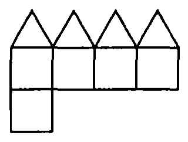
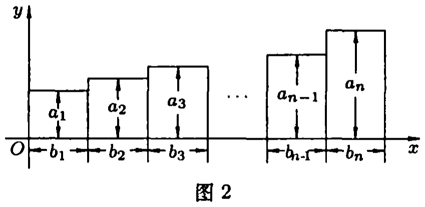
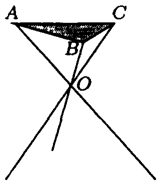
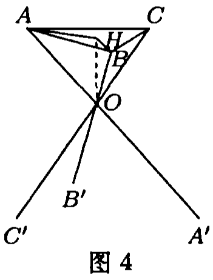

# 2008年上海卷（春）

## 填空题

### 第 1 题

已知集合 $A=\{x \mid x<-1\text{或}2\leqslant x<3\}$，$B=\{x \mid -2\leqslant x<4\}$，则 $A\cup B=$＿＿＿＿＿＿.

#### 答案

$\{x \mid x<4\}$.

#### 解析

由 $B=[-2,4)$，且 $A$ 在 $x<-1$ 的部分向左无限延伸，而 $A$ 在 $2\leqslant x<3$ 的部分已包含于 $B$，可得

$$

A\cup B=(-\infty,4)=\{x\mid x<4\}

$$

### 第 2 题

计算：$\displaystyle\lim_{n\to\infty}\frac{3^n+1}{3^{n+1}+2^n}=$＿＿＿＿＿＿.

#### 答案

$\frac{1}{3}$.

#### 解析

分子、分母同除以 $3^n$，得

$$

\frac{3^n+1}{3^{n+1}+2^n}
=\frac{1+3^{-n}}{3+(2/3)^n}

$$

当 $n\to\infty$ 时，$3^{-n}\to0$，$(2/3)^n\to0$，因此原极限为

$$

\frac{1+0}{3+0}=\frac13

$$

### 第 3 题

函数 $f(x)=\frac{\sqrt{-x^2+x+6}}{x-1}$ 的定义域是＿＿＿＿＿＿.

#### 答案

$\left[-2,1\right)\cup\left(1,3\right]$.

#### 解析

根式有意义要求

$$

-x^2+x+6\geqslant0
\iff (x-3)(x+2)\leqslant0

$$

所以 $x\in[-2,3]$. 又因分母不能为零，需排除 $x=1$. 故定义域为

$$

[-2,1)\cup(1,3]

$$

### 第 4 题

方程 $2\cos\left(x-\frac{\pi}{4}\right)=1$ 在区间 $(0,\pi)$ 内的解是＿＿＿＿＿＿.

#### 答案

$x=\frac{7\pi}{12}$.

#### 解析

由 $2\cos(x-\frac\pi4)=1$，得 $x-\frac\pi4=\pm\frac\pi3+2k\pi$，$k\in\mathbb{Z}$. 于是

$$

x=\frac{7\pi}{12}+2k\pi
\quad\text{或}\quad
x=-\frac\pi{12}+2k\pi

$$

在 $0<x<\pi$ 内，只有第一组取 $k=0$ 时满足条件，因此

$$

x=\frac{7\pi}{12}

$$

### 第 5 题

已知数列 $\{a_n\}$ 是公差不为零的等差数列，$a_1=1$. 若 $a_1$，$a_2$，$a_5$ 成等比数列，则 $a_n=$＿＿＿＿＿＿.

#### 答案

$a_n=2n-1$.

#### 解析

设等差数列公差为 $d\ne0$. 由 $a_1=1$，有 $a_2=1+d$，$a_5=1+4d$. 因为 $a_1$，$a_2$，$a_5$ 成等比数列，故

$$

a_2^2=a_1a_5
\iff (1+d)^2=1+4d
\iff d(d-2)=0

$$

由 $d\ne0$，得 $d=2$，所以

$$

a_n=a_1+(n-1)d=1+2(n-1)=2n-1

$$

### 第 6 题

化简：$\cos\left(\frac{\pi}{3}+\alpha\right)+\sin\left(\frac{\pi}{6}+\alpha\right)=$＿＿＿＿＿＿.

#### 答案

$\cos \alpha$.

#### 解析

利用和角公式，原式为

$$

\left(\frac12\cos\alpha-\frac{\sqrt3}{2}\sin\alpha\right)
+\left(\frac12\cos\alpha+\frac{\sqrt3}{2}\sin\alpha\right)
=\cos\alpha

$$

### 第 7 题

已知 $P$ 是双曲线 $\frac{x^2}{a^2}-\frac{y^2}{9}=1$ 右支上的一点，双曲线的一条渐近线方程为 $3x-y=0$. 设 $F_1$，$F_2$ 分别为双曲线的左，右焦点. 若 $|PF_2|=3$，则 $|PF_1|=$＿＿＿＿＿＿.

#### 答案

$5$.

#### 解析

双曲线的渐近线为 $y=\pm\frac{3}{a}x$. 由 $3x-y=0$，得 $\frac3a=3$，$a=1$，$b=3$. 故焦半距

$$

c=\sqrt{a^2+b^2}=\sqrt{10}

$$

双曲线右支上点 $P$ 满足

$$

|PF_1|-|PF_2|=2a=2

$$

已知 $|PF_2|=3$，所以 $|PF_1|=3+2=5$.

### 第 8 题

已知一个凸多面体共有 $9$ 个面，所有棱长均为 $1$，其平面展开图如图 $1$ 所示，则该凸多面体的体积 $V=$＿＿＿＿＿＿.

#### 答案

$1+\frac{\sqrt{2}}{6}$.

#### 解析

展开图折合后可看作一个棱长为 $1$ 的正方体和一个底面为正方形、四个侧面为等边三角形的正四棱锥，二者底面重合. 正方体体积为 $1$. 对正四棱锥，底面中心到顶点的距离为 $\frac{\sqrt2}{2}$，侧棱长为 $1$，故高为

$$

h=\sqrt{1^2-\left(\frac{\sqrt2}{2}\right)^2}=\frac{\sqrt2}{2}

$$

因此总体积为

$$

V=1+\frac13\cdot1^2\cdot\frac{\sqrt2}{2}
=1+\frac{\sqrt2}{6}

$$

### 第 9 题

已知无穷数列 $\{a_n\}$ 前 $n$ 项和 $S_n=\frac{1}{3}a_n-1$，则数列 $\{a_n\}$ 的各项和为＿＿＿＿＿＿.

#### 答案

$-1$.

#### 解析

取 $n=1$，由 $S_1=a_1=\frac13a_1-1$，得

$$

a_1=-\frac32

$$

当 $n\geqslant2$ 时，$a_n=S_n-S_{n-1}$，从而

$$

a_n=\frac13(a_n-a_{n-1})
\iff a_n=-\frac12a_{n-1}

$$

所以数列为等比数列，公比为 $-\frac12$，其各项和为

$$

\sum_{n=1}^{\infty}a_n
=\frac{-3/2}{1-(-1/2)}=-1

$$

### 第 10 题

古代“五行”学说认为：“物质分金，木，土，水，火五种属性，金克木，木克土，土克水，水克火，火克金.” 将五种不同属性的物质任意排成一列，设事件 $A$ 表示“排列中属性相克的两种物质不相邻”，则事件 $A$ 出现的概率是（结果用数值表示）＿＿＿＿＿＿.

#### 答案

$\frac{1}{12}$.

#### 解析

五种属性相克的相邻关系为一个五边形：金—木—土—水—火—金. 事件 $A$ 要求排列中的相邻边不能是这五条边，因此允许的相邻关系正好是补图中的另一个五边形.

满足条件的排列就是这个五边形上的有向哈密顿路径：先选出不使用的边，有 $5$ 种；再确定排列方向，有 $2$ 种. 所以有利排列数为 $5\times2=10$. 全部排列数为 $5!=120$，故

$$

P(A)=\frac{10}{120}=\frac1{12}

$$

### 第 11 题

已知 $a_1$，$a_2$，$\cdots$，$a_n$，$b_1$，$b_2$，$\cdots$，$b_n$（$n$ 是正整数），令 $L_1=b_1+b_2+\cdots+b_n$，$L_2=b_2+b_3+\cdots+b_n$，$\cdots$，$L_n=b_n$. 某人用图 $2$ 分析得到恒等式 $a_1b_1+a_2b_2+\cdots+a_nb_n=a_1L_1+c_2L_2+c_3L_3+\cdots+c_kL_k+\cdots+c_nL_n$，则 $c_k=$＿＿＿＿＿＿（$2\leqslant k\leqslant n$）.

#### 答案

$a_k-a_{k-1}$.

#### 解析

在右端展开 $L_j=b_j+b_{j+1}+\cdots+b_n$，可知 $b_k$ 的系数为

$$

a_1+c_2+c_3+\cdots+c_k

$$

恒等式左端中 $b_k$ 的系数是 $a_k$，因此

$$

a_k=a_1+c_2+\cdots+c_k

$$

同样比较 $b_{k-1}$ 的系数，可得

$$

a_{k-1}=a_1+c_2+\cdots+c_{k-1}

$$

两式相减，得

$$

c_k=a_k-a_{k-1}

$$

### 第 12 题

已知 $A(1,2)$，$B(3,4)$，直线 $l_1:x=0$，$l_2:y=0$ 和 $l_3:x+3y-1=0$. 设 $P_i$ 是 $l_i$（$i=1$，$2$，$3$）上与 $A$，$B$ 两点距离平方和最小的点，则 $\triangle P_1P_2P_3$ 的面积是＿＿＿＿＿＿.

#### 答案

$\frac{3}{2}$.

#### 解析

设 $C=\frac{A+B}{2}=(2,3)$. 对任意点 $P$，有中线平方和恒等式

$$

PA^2+PB^2=2PC^2+\frac{AB^2}{2}

$$

因此在每条给定直线上，$PA^2+PB^2$ 取最小值当且仅当 $PC$ 取最小值，即 $P$ 是 $C$ 在该直线上的正射影.

于是 $P_1=(0,3)$，$P_2=(2,0)$. 将 $C$ 投影到 $l_3:x+3y-1=0$，得

$$

P_3=C-\frac{2+9-1}{1^2+3^2}(1,3)=(1,0)

$$

三点中 $P_2P_3=1$，且 $P_1$ 到 $x$ 轴的距离为 $3$，所以

$$

S_{\triangle P_1P_2P_3}=\frac12\times1\times3=\frac32

$$

## 单选题

### 第 13 题

已知向量 $\boldsymbol{a}=(2,-3)$，$\boldsymbol{b}=(3,\lambda)$，若 $\boldsymbol{a}\parallel\boldsymbol{b}$，则 $\lambda$ 等于（）

A.  
$\frac{2}{3}$.

B.  
$-2$.

C.  
$-\frac{9}{2}$.

D.  
$-\frac{2}{3}$.

#### 答案

C

#### 解析

两向量平行的充要条件是行列式为零，因此

$$

\begin{vmatrix}2&-3\\3&\lambda\end{vmatrix}=2\lambda+9=0

$$

解得 $\lambda=-\frac92$，对应选项 C.

### 第 14 题

已知椭圆 $\frac{x^2}{10-m}+\frac{y^2}{m-2}=1$，长轴在 $y$ 轴上. 若焦距为 $4$，则 $m$ 等于（）

A.  
$4$.

B.  
$5$.

C.  
$7$.

D.  
$8$.

#### 答案

D

#### 解析

椭圆有意义要求 $m-2>0$ 且 $10-m>0$，即 $2<m<10$. 长轴在 $y$ 轴上还要求

$$

m-2>10-m

$$

所以 $m>6$. 令 $a^2=m-2$，$b^2=10-m$，则

$$

c^2=a^2-b^2=2m-12

$$

焦距为 $4$，故 $2c=4$，即 $c=2$. 因而

$$

2m-12=4\implies m=8

$$

对应选项 D.

### 第 15 题

已知函数 $f(x)$，$g(x)$ 定义在 $\mathbb{R}$ 上，$h(x)=f(x)\cdot g(x)$，则“$f(x)$，$g(x)$ 均为奇函数”是“$h(x)$ 为偶函数”的（）

A.  
充分不必要条件.

B.  
必要不充分条件.

C.  
充要条件.

D.  
既不充分也不必要条件.

#### 答案

A

#### 解析

若 $f$，$g$ 均为奇函数，则

$$

h(-x)=f(-x)g(-x)=(-f(x))(-g(x))=f(x)g(x)=h(x)

$$

所以 $h$ 为偶函数，说明该条件充分. 但它不是必要条件，例如取 $f(x)=g(x)=1$，二者都不是奇函数，而 $h(x)=1$ 是偶函数. 因此是充分不必要条件，对应选项 A.

### 第 16 题

已知 $z\in\mathbf{C}$，且 $|z-2-2\i|=1$，$\i$ 为虚数单位，则 $|z+2-2\i|$ 的最小值是（）

A.  
$2$.

B.  
$3$.

C.  
$4$.

D.  
$5$.

#### 答案

B

#### 解析

条件 $|z-2-2\i|=1$ 表示点 $z$ 在圆心 $Q=(2,2)$、半径 $1$ 的圆上. 要求的模是点 $z$ 到 $R=(-2,2)$ 的距离，而 $QR=4$. 由三角不等式

$$

|z-R|\geqslant QR-|z-Q|=4-1=3

$$

当 $z=(1,2)$ 时，$z$ 在给定圆上且 $R$，$Q$，$z$ 共线，所以等号成立. 最小值为 $3$，对应选项 B.

## 解答题

### 第 17 题

已知 $\cos \theta=-\frac{\sqrt{2}}{3}$，$\theta\in\left(\frac{\pi}{2},\pi\right)$，求 $\frac{2}{\sin 2\theta}-\frac{\cos \theta}{\sin \theta}$ 的值.

#### 解析

$$

\frac{2}{\sin 2\theta}-\frac{\cos \theta}{\sin \theta}=\frac{2}{2\sin \theta\cos \theta}-\frac{\cos \theta}{\sin \theta}=\frac{1-\cos^2\theta}{\sin \theta\cos \theta}=\frac{\sin \theta}{\cos \theta}

$$

又 $\cos \theta=-\frac{\sqrt{2}}{3}$，$\theta\in\left(\frac{\pi}{2},\pi\right)$， $\sin \theta=\sqrt{1-\frac{2}{9}}=\frac{\sqrt{7}}{3}$. 所以 $\frac{2}{\sin 2\theta}-\frac{\cos \theta}{\sin \theta}=\frac{\sin \theta}{\cos \theta}=-\frac{\sqrt{14}}{2}$.

### 第 18 题

在平面直角坐标系 $xOy$ 中，$A$，$B$ 分别为直线 $x+y=2$ 与 $x$，$y$ 轴的交点，$C$ 为 $AB$ 的中点. 若抛物线 $y^2=2px$（$p>0$）过点 $C$，求焦点 $F$ 到直线 $AB$ 的距离.

#### 解析

由已知可得 $A(2,0)$，$B(0,2)$，$C(1,1)$. 解得抛物线方程为 $y^2=x$，于是焦点 $F\left(\frac{1}{4},0\right)$. 所以点 $F$ 到直线 $AB$ 的距离为

$$

d=\frac{\left|\frac14+0-2\right|}{\sqrt{1^2+1^2}}
=\frac{7}{4\sqrt2}=\frac{7\sqrt2}{8}

$$

### 第 19 题

已知函数 $f(x)=\log_2\left(2^x+1\right)$.

1.  求证：函数 $f(x)$ 在 $(-\infty,+\infty)$ 内单调递增；

2.  记 $f^{-1}(x)$ 为函数 $f(x)$ 的反函数. 若关于 $x$ 的方程 $f^{-1}(x)=m+f(x)$ 在 $[1,2]$ 上有解，求 $m$ 的取值范围.

#### 解析

1.  任取 $x_1<x_2$，则 $f(x_1)-f(x_2)=\log_2\left(2^{x_1}+1\right)-\log_2\left(2^{x_2}+1\right)=\log_2\frac{2^{x_1}+1}{2^{x_2}+1}$. 因为 $x_1<x_2$，所以 $0<2^{x_1}+1<2^{x_2}+1$，从而 $0<\frac{2^{x_1}+1}{2^{x_2}+1}<1$，$\log_2\frac{2^{x_1}+1}{2^{x_2}+1}<0$. 所以 $f(x_1)<f(x_2)$，即函数 $f(x)$ 在 $(-\infty,+\infty)$ 内单调递增.

2.  令 $y=f(x)$，则 $2^y=2^x+1$，$x=\log_2(2^y-1)$. 由于 $2^x+1>1$，函数 $f$ 的值域为 $(0,+\infty)$，所以 $f^{-1}(x)=\log_2(2^x-1)$，$x>0$.

    【解法一】

$$

m=f^{-1}(x)-f(x)=\log_2\left(2^x-1\right)-\log_2\left(2^x+1\right)=\log_2\frac{2^x-1}{2^x+1}=\log_2\left(1-\frac{2}{2^x+1}\right)

$$

    当 $1\leqslant x\leqslant 2$ 时， $\frac{2}{5}\leqslant \frac{2}{2^x+1}\leqslant \frac{2}{3}$， 所以 $\frac{1}{3}\leqslant 1-\frac{2}{2^x+1}\leqslant \frac{3}{5}$. 该量关于 $x$ 连续递增，端点 $x=1$，$2$ 分别取到两端值，且 $\log_2$ 递增，因此 $m$ 的取值范围是 $\left[\log_2\left(\frac{1}{3}\right),\log_2\left(\frac{3}{5}\right)\right]$.

    【解法二】解方程 $\log_2\left(2^x-1\right)=m+\log_2\left(2^x+1\right)$，得 $x=\log_2\left(\frac{2^m+1}{1-2^m}\right)$. 因为 $1\leqslant x\leqslant 2$，所以 $1\leqslant \log_2\left(\frac{2^m+1}{1-2^m}\right)\leqslant 2$. 解得 $\log_2\left(\frac{1}{3}\right)\leqslant m\leqslant \log_2\left(\frac{3}{5}\right)$. 因此 $m$ 的取值范围是 $\left[\log_2\left(\frac{1}{3}\right),\log_2\left(\frac{3}{5}\right)\right]$.

### 第 20 题

某厂根据市场需求开发折叠式小凳（如图 $3$ 所示）. 凳面为三角形的尼龙布，凳脚为三根钢管. 考虑到钢管的受力和人的舒适度等因素，设计小凳应满足：

1.  凳子高度为 $30 \mathrm{~cm}$；

2.  三根细钢管相交处的节点 $O$ 与凳面三角形 $ABC$ 重心的连线垂直于凳面和地面.

<!-- -->

1.  若凳面是边长为 $20 \mathrm{~cm}$ 的正三角形，三只凳脚与地面所成的角均为 $45^\circ$，确定节点 $O$ 分细钢管上下两段的比值（精确到 $0.01$）；

2.  若凳面是顶角为 $120^\circ$ 的等腰三角形，腰长为 $24 \mathrm{~cm}$，节点 $O$ 分细钢管上下两段之比为 $2:3$. 确定三根细钢管的长度（精确到 $0.1 \mathrm{~cm}$）.

#### 解析

1.  设 $\triangle ABC$ 的重心为 $H$，连结 $OH$. 正三角形的高为 $10\sqrt3$，重心到顶点的距离为高的 $\frac23$，所以

$$

BH=\frac{20\sqrt3}{3}

$$

    设细钢管上下两段之比为 $\lambda$. 已知凳子高度为 $30$，则 $OH=\frac{30\lambda}{1+\lambda}$. 因为节点 $O$ 与凳面三角形 $ABC$ 重心的连线与地面垂直，且凳面与地面平行，所以 $\angle OBH$ 就是 $OB$ 与平面 $ABC$ 所成的角，亦即 $\angle OBH=45^\circ$. 因而 $BH=OH$，$\frac{30\lambda}{1+\lambda}=\frac{20\sqrt{3}}{3}$. 解得 $\lambda=\frac{2\sqrt{3}}{9-2\sqrt{3}}\approx 0.63$， 即节点 $O$ 分细钢管上下两段的比值约为 $0.63$.

1.  设 $\angle B=120^\circ$，则 $AB=BC=24$. 由余弦定理，

$$

AC^2=24^2+24^2-2\cdot24^2\cos120^\circ=3\cdot24^2

$$

    所以 $AC=24\sqrt3$. 取 $B=(0,0)$，$A=(24,0)$，$C=(-12,12\sqrt3)$，则重心

$$

H=\frac{A+B+C}{3}=(4,4\sqrt3)

$$

    从而 $BH=\sqrt{4^2+(4\sqrt3)^2}=8$，$AH=\sqrt{20^2+(4\sqrt3)^2}=8\sqrt7$. 凳面与地面平行，且凳子总高度为 $30\mathrm{~cm}$. 由于节点 $O$ 分细钢管上下两段之比为 $2:3$，相似三角形给出

$$

OH=30\times\frac{2}{2+3}=12\mathrm{~cm}

$$

    设过点 $A$，$B$，$C$ 的细钢管分别为 $AA'$，$BB'$，$CC'$，则 $AA'=CC'=\frac{5}{2}OA=\frac{5}{2}\sqrt{OH^2+AH^2}=10\sqrt{37}\approx 60.8$，$BB'=\frac{5}{2}OB=\frac{5}{2}\sqrt{OH^2+BH^2}=10\sqrt{13}\approx 36.1$. 所以对应于 $A$，$B$，$C$ 三点的三根细钢管长度分别为 $60.8 \mathrm{~cm}$，$36.1 \mathrm{~cm}$ 和 $60.8 \mathrm{~cm}$.

### 第 21 题

在直角坐标平面 $xOy$ 上的一列点 $A_1(1,a_1)$，$A_2(2,a_2)$，$\cdots$，$A_n(n,a_n)$，$\cdots$，简记为 $\{A_n\}$. 若由 $b_n=\overrightarrow{A_nA_{n+1}}\cdot\boldsymbol{j}$ 构成的数列 $\{b_n\}$ 满足 $b_{n+1}>b_n$，$n=1$，$2$，$3$，$\cdots$，其中 $\boldsymbol{j}$ 为方向与 $y$ 轴正方向相同的单位向量，则称 $\{A_n\}$ 为 $T$ 点列.

1.  判断 $A_1(1,1)$，$A_2\left(2,\frac{1}{2}\right)$，$A_3\left(3,\frac{1}{3}\right)$，$\cdots$，$A_n\left(n,\frac{1}{n}\right)$，$\cdots$，是否为 $T$ 点列，并说明理由；

2.  若 $\{A_n\}$ 为 $T$ 点列，且点 $A_2$ 在点 $A_1$ 的右上方. 任取其中连续三点 $A_k$，$A_{k+1}$，$A_{k+2}$，判断 $\triangle A_kA_{k+1}A_{k+2}$ 的形状（锐角三角形，直角三角形，钝角三角形），并予以证明；

3.  若 $\{A_n\}$ 为 $T$ 点列，正整数 $1\leqslant m<n<p<q$ 满足 $m+q=n+p$，求证：$\overrightarrow{A_nA_q}\cdot\boldsymbol{j}>\overrightarrow{A_mA_p}\cdot\boldsymbol{j}$.

#### 解析

1.  $a_n=\frac{1}{n}$，所以 $b_n=\frac{1}{n+1}-\frac{1}{n}=-\frac{1}{n(n+1)}$. 进一步，

$$

b_{n+1}-b_n=-\frac{1}{(n+1)(n+2)}+\frac{1}{n(n+1)}=\frac{2}{n(n+1)(n+2)}>0

$$

    故 $b_{n+1}>b_n$，因此 $\{A_n\}$ 是 $T$ 点列.

2.  在 $\triangle A_kA_{k+1}A_{k+2}$ 中， $\overrightarrow{A_{k+1}A_k}=(-1,a_k-a_{k+1})$，$\overrightarrow{A_{k+1}A_{k+2}}=(1,a_{k+2}-a_{k+1})$. 所以 $\overrightarrow{A_{k+1}A_k}\cdot\overrightarrow{A_{k+1}A_{k+2}}=-1+(a_{k+2}-a_{k+1})(a_k-a_{k+1})$. 因为点 $A_2$ 在点 $A_1$ 的右上方，所以 $b_1=a_2-a_1>0$. 又 $\{A_n\}$ 为 $T$ 点列，所以 $b_n\geqslant b_1>0$. 因而 $(a_{k+2}-a_{k+1})(a_k-a_{k+1})=-b_{k+1}b_k<0$. 于是 $\overrightarrow{A_{k+1}A_k}\cdot\overrightarrow{A_{k+1}A_{k+2}}<0$. 所以 $\angle A_kA_{k+1}A_{k+2}$ 为钝角，即 $\triangle A_kA_{k+1}A_{k+2}$ 为钝角三角形.

3.  因为 $1\leqslant m<n<p<q$，且 $m+q=n+p$，所以 $q-p=n-m>0$. 又

$$

a_q-a_p=a_q-a_{q-1}+a_{q-1}-a_{q-2}+\cdots+a_{p+1}-a_p=b_{q-1}+b_{q-2}+\cdots+b_p\geqslant (q-p)b_p

$$

    按定义展开可得

$$

a_n-a_m=b_{n-1}+b_{n-2}+\cdots+b_m\leqslant (n-m)b_{n-1}

$$

    由于 $\{A_n\}$ 为 $T$ 点列，且 $p>n-1$，于是 $b_p>b_{n-1}$. 因此 $a_q-a_p>a_n-a_m$，所以 $a_q-a_n>a_p-a_m$，即 $\overrightarrow{A_nA_q}\cdot\boldsymbol{j}>\overrightarrow{A_mA_p}\cdot\boldsymbol{j}$.

### 第 22 题

已知 $z$ 是实系数方程 $x^2+2bx+c=0$ 的虚根，记它在直角坐标平面上的对应点为 $P_z(\operatorname{Re} z,\operatorname{Im} z)$.

1.  若 $(b,c)$ 在直线 $2x+y=0$ 上，求证：$P_z$ 在圆 $C_1:(x-1)^2+y^2=1$ 上；

2.  给定圆 $C:(x-m)^2+y^2=r^2$（$m$，$r\in\mathbb{R}$，$r>0$），则存在唯一的线段 $s$ 满足：

    1.  若 $P_z$ 在圆 $C$ 上，则 $(b,c)$ 在线段 $s$ 上；

    2.  若 $(b,c)$ 是线段 $s$ 上一点（非端点），则 $P_z$ 在圆 $C$ 上.

    写出线段 $s$ 的表达式，并说明理由；

3.  由第 $2$ 问知线段 $s$ 与圆 $C$ 之间确定了一种对应关系，通过这种对应关系的研究，填写表一（表中 $s_1$ 是第 $1$ 问中圆 $C_1$ 的对应线段）.

|      线段 $s$ 与线段 $s_1$ 的关系      | $m$，$r$ 的取值或表达式 |
|:------------------------------------------:|:---------------------------:|
| 线段 $s$ 所在直线平行于 $s_1$ 所在直线 |                             |
|    线段 $s$ 所在直线平分线段 $s_1$     |                             |
|     线段 $s$ 与线段 $s_1$ 长度相等     |                             |

#### 解析

1.  由题意可得 $2b+c=0$，即 $c=-2b$. 因为 $z$ 是虚根，方程的判别式为负，故 $-2b-b^2>0$. 解方程

$$

x^2+2bx-2b=0

$$

    得

$$

z=-b\pm\sqrt{-2b-b^2}\i

$$

    因此点 $P_z$ 的坐标为 $(-b,\pm\sqrt{-2b-b^2})$. 对这两个点都有

$$

(-b-1)^2+\left(\pm\sqrt{-2b-b^2}\right)^2
    =(b+1)^2-2b-b^2=1

$$

    所以 $P_z$ 在圆 $C_1:(x-1)^2+y^2=1$ 上.

2.  【解法一】当 $\Delta<0$，即 $b^2<c$ 时，解得 $z=-b\pm\sqrt{c-b^2}\i$， 因此点 $P_z(-b,\sqrt{c-b^2})$ 或 $P_z(-b,-\sqrt{c-b^2})$. 由题意可得 $(-b-m)^2+c-b^2=r^2$，整理后得 $c=-2mb+r^2-m^{2}$. 又 $\Delta=4(b^2-c)<0$，$(b+m)^2+c-b^2=r^2$，所以 $b\in(-m-r,-m+r)$. 故线段 $s$ 为 $c=-2mb+r^2-m^{2}$，$b\in[-m-r,-m+r]$. 若 $(b,c)$ 是线段 $s$ 上一点（非端点），则实系数方程为 $x^2+2b(x-m)+r^2-m^{2}=0$，$b\in(-m-r,-m+r)$. 此时 $\Delta<0$，且点 $P_z(-b,\sqrt{r^2-(b+m)^2})$，$P_z(-b,-\sqrt{r^2-(b+m)^2})$ 在圆 $C$ 上.

3.  表一中，第1问对应的圆 $C_1$ 为 $m=1$，$r=1$，故 $c=-2b$，$-2\leqslant b\leqslant0$. 其线段中点为 $(-1,2)$，长度为 $2\sqrt5$. 一般的线段 $s$ 的斜率为 $-2m$，半长为 $r\sqrt{1+4m^2}$，故长度为 $2r\sqrt{1+4m^2}$.

    因此表一为：

    | 线段 $s$ 与线段 $s_1$ 的关系 | $m$，$r$ 的取值或表达式 |
    |:--:|:--:|
    | 线段 $s$ 所在直线平行于 $s_1$ 所在直线 | $m=1$，$r\neq 1$ |
    | 线段 $s$ 所在直线平分线段 $s_1$ | $r^2-\left(m-1\right)^2=1$，$m\neq 1$ |
    | 线段 $s$ 与线段 $s_1$ 长度相等 | $\left(1+4m^2\right)r^2=5$ |
