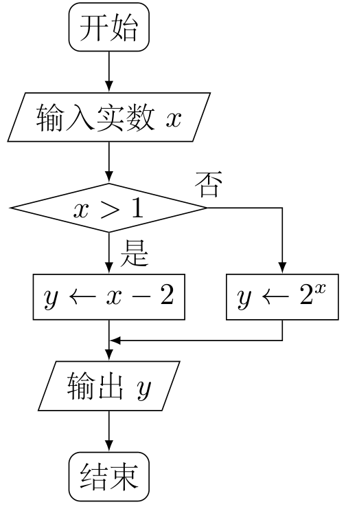
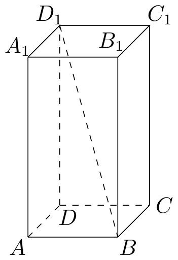
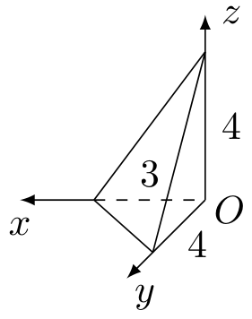
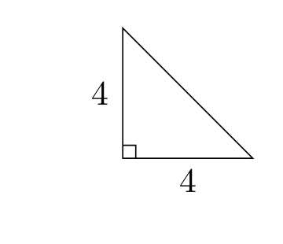
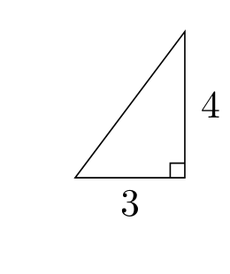
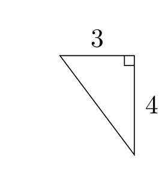
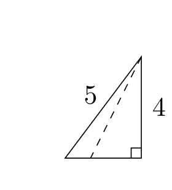

# 2009年上海卷（秋文）

## 填空题

### 第 1 题

函数 $f(x) = x^3 + 1$ 的反函数 $f^{-1}(x) =$＿＿＿＿＿＿.

#### 答案

$\sqrt[3]{x-1}$.

#### 解析

令 $y=f(x)=x^3+1$，则 $x^3=y-1$，所以 $x=\sqrt[3]{y-1}$. 交换 $x$，$y$ 得 $f^{-1}(x)=\sqrt[3]{x-1}$，故填 $\sqrt[3]{x-1}$.

### 第 2 题

已知集合 $A = \{x \mid x \leqslant 1\}$，$B = \{x \mid x \geqslant a\}$，且 $A \cup B = \mathbb{R}$，则实数 $a$ 的取值范围是＿＿＿＿＿＿.

#### 答案

$a \leqslant 1$.

#### 解析

集合 $A=(-\infty,1]$，$B=[a,+\infty)$. 若 $a\leqslant1$，两个区间相接或重叠，故 $A\cup B=\mathbb{R}$. 若 $a>1$，则区间 $(1,a)$ 中的数既不属于 $A$ 也不属于 $B$，不可能有 $A\cup B=\mathbb{R}$. 因此 $a\leqslant1$，故填 $a\leqslant1$.

### 第 3 题

若行列式 $\begin{vmatrix} 4 & 5 & x \\ 1 & x & 3 \\ 7 & 8 & 9 \end{vmatrix}$ 中，元素 $4$ 的代数余子式大于 $0$，则 $x$ 满足的条件是＿＿＿＿＿＿.

#### 答案

$x > \frac{8}{3}$.

#### 解析

元素 $4$ 位于第 $1$ 行第 $1$ 列，其代数余子式为

$$

A_{11}=(-1)^{1+1}\begin{vmatrix}x&3\\8&9\end{vmatrix}=9x-24

$$

由 $A_{11}>0$，得 $9x-24>0$，所以 $x>\frac{8}{3}$，故填 $x>\frac{8}{3}$.

### 第 4 题

某算法的程序框图如图所示，则输出量 $y$ 与输入量 $x$ 满足的关系式是＿＿＿＿＿＿.

#### 答案

$$

y = \begin{cases}
x-2, & x>1,\\
2^x, & x\leqslant 1.
\end{cases}

$$

#### 解析

程序先判断 $x>1$. 当 $x>1$ 时，沿“是”分支执行 $y\leftarrow x-2$；当 $x\leqslant1$ 时，沿“否”分支执行 $y\leftarrow2^x$. 因此

$$

y=\begin{cases}
x-2,&x>1,\\
2^x,&x\leqslant1.
\end{cases}

$$

### 第 5 题

如图，若正四棱柱 $ABCD - A_1B_1C_1D_1$ 的底面边长为 $2$，高为 $4$，则异面直线 $BD_1$ 与 $AD$ 所成角的大小是＿＿＿＿＿＿. （结果用反三角函数表示）

#### 答案

$\arctan\sqrt{5}$.

#### 解析

因为 $AD\parallel A_1D_1$，异面直线 $BD_1$ 与 $AD$ 所成的角等于直线 $D_1B$ 与 $A_1D_1$ 所成的角. 三角形 $A_1D_1B$ 在 $A_1$ 处为直角，且 $A_1D_1=2$，$A_1B=\sqrt{2^2+4^2}=2\sqrt5$. 若所成角为 $\theta$，则

$$

\tan\theta=\frac{A_1B}{A_1D_1}=\sqrt5

$$

由于异面直线所成角取锐角，故 $\theta=\arctan\sqrt5$，填 $\arctan\sqrt5$.

### 第 6 题

若球 $O_1$，$O_2$ 表面积之比 $\frac{S_1}{S_2} = 4$，则它们的半径之比 $\frac{R_1}{R_2} =$＿＿＿＿＿＿.

#### 答案

$2$.

#### 解析

球的表面积为 $S=4\pi R^2$，所以

$$

\frac{S_1}{S_2}=\frac{4\pi R_1^2}{4\pi R_2^2}=\left(\frac{R_1}{R_2}\right)^2=4

$$

半径为正，故 $\frac{R_1}{R_2}=2$，填 $2$.

### 第 7 题

已知实数 $x$，$y$ 满足

$$

\begin{cases}
y \leqslant 2x,\\
y \geqslant -2x,\\
x \leqslant 3,
\end{cases}

$$

则目标函数 $z = x - 2y$ 的最小值是＿＿＿＿＿＿.

#### 答案

$-9$.

#### 解析

由 $y\leqslant2x$ 与 $y\geqslant-2x$ 可知 $-2x\leqslant2x$，故 $x\geqslant0$. 目标函数 $z=x-2y$ 在固定 $x$ 时随 $y$ 增大而减小，所以取允许的最大值 $y=2x$. 此时 $z=x-4x=-3x$. 又 $0\leqslant x\leqslant3$，故 $z\geqslant-9$，且在 $(x,y)=(3,6)$ 处取到，故最小值为 $-9$.

### 第 8 题

若等腰直角三角形的直角边长为 $2$，则以一直角边所在的直线为轴旋转一周所成的几何体体积是＿＿＿＿＿＿.

#### 答案

$\frac{8\pi}{3}$.

#### 解析

以直角边所在直线为轴旋转后得到圆锥，其高为 $2$，底面半径为另一条直角边长 $2$. 因而

$$

V=\frac13\pi\cdot2^2\cdot2=\frac{8\pi}{3}

$$

故填 $\frac{8\pi}{3}$.

### 第 9 题

过点 $A(1, 0)$ 作倾斜角为 $\frac{\pi}{4}$ 的直线，与抛物线 $y^2 = 2x$ 交于 $M$，$N$ 两点，则 $|MN| =$＿＿＿＿＿＿.

#### 答案

$2\sqrt{6}$.

#### 解析

直线过 $A(1,0)$，倾斜角为 $\frac\pi4$，斜率为 $1$，故方程为 $y=x-1$. 与 $y^2=2x$ 联立，得

$$

(x-1)^2=2x\iff x^2-4x+1=0

$$

两交点的横坐标之差为 $2\sqrt3$，由于它们在直线 $y=x-1$ 上，纵坐标之差也为 $2\sqrt3$. 因此

$$

|MN|=\sqrt{(2\sqrt3)^2+(2\sqrt3)^2}=2\sqrt6

$$

故填 $2\sqrt6$.

### 第 10 题

函数 $y = 2\cos^2 x + \sin 2x$ 的最小值是＿＿＿＿＿＿.

#### 答案

$1-\sqrt{2}$.

#### 解析

利用二倍角公式，

$$

2\cos^2x+\sin2x=1+\cos2x+\sin2x=1+\sqrt2\sin\left(2x+\frac\pi4\right)

$$

由于正弦值的范围为 $[-1,1]$，函数的最小值为 $1-\sqrt2$，故填 $1-\sqrt2$.

### 第 11 题

若某学校要从 $5$ 名男生和 $2$ 名女生中选出 $3$ 人作为上海世博会的志愿者，则选出的志愿者中男女生均不少于 $1$ 名的概率是＿＿＿＿＿＿. （结果用最简分数表示）

#### 答案

$\frac{5}{7}$.

#### 解析

从 $7$ 人中选 $3$ 人的总数为 $\mathrm C_7^3=35$. 满足男女生均不少于 $1$ 名的情形有两类：选 $1$ 名男生和 $2$ 名女生，或选 $2$ 名男生和 $1$ 名女生. 有利情况数为

$$

\mathrm C_5^1\mathrm C_2^2+\mathrm C_5^2\mathrm C_2^1=5+20=25

$$

所以所求概率为 $\frac{25}{35}=\frac57$，故填 $\frac57$.

### 第 12 题

已知 $F_1$，$F_2$ 是椭圆 $C: \frac{x^2}{a^2} + \frac{y^2}{b^2} = 1$（$a > b > 0$）的两个焦点，$P$ 为椭圆 $C$ 上一点，且 $\overrightarrow{PF_1} \perp \overrightarrow{PF_2}$. 若 $\triangle PF_1F_2$ 的面积为 $9$，则 $b =$＿＿＿＿＿＿.

#### 答案

$3$.

#### 解析

设 $PF_1=r_1$，$PF_2=r_2$，椭圆焦半距为 $c$. 由椭圆定义，$r_1+r_2=2a$. 因为 $\overrightarrow{PF_1}\perp\overrightarrow{PF_2}$，三角形 $PF_1F_2$ 在 $P$ 处直角，且面积为 $9$，所以 $r_1r_2=18$. 又 $F_1F_2=2c$，由勾股定理

$$

r_1^2+r_2^2=4c^2

$$

于是

$$

4a^2=(r_1+r_2)^2=r_1^2+r_2^2+2r_1r_2=4c^2+36

$$

从而 $a^2-c^2=9$. 椭圆满足 $b^2=a^2-c^2$，且 $b>0$，故 $b=3$，填 $3$.

### 第 13 题

已知函数 $f(x) = \sin x + \tan x$. 项数为 $27$ 的等差数列 $\{a_n\}$ 满足 $a_n \in \left( -\frac{\pi}{2}, \frac{\pi}{2} \right)$，且公差 $d \neq 0$. 若 $f(a_1) + f(a_2) + \cdots + f(a_{27}) = 0$，则当 $k =$＿＿＿＿＿＿ 时，$f(a_k) = 0$.

#### 答案

$14$.

#### 解析

在区间 $\left(-\frac\pi2,\frac\pi2\right)$ 内，

$$

f'(x)=\cos x+\sec^2x>0

$$

所以 $f$ 严格递增，且 $f$ 为奇函数. 记等差数列的中项为 $a_{14}$. 若 $a_{14}=0$，则 $a_{14-j}=-a_{14+j}$，成对项的函数值相反，故总和为 $0$. 反之，令 $h=|d|$. 若 $a_{14}>0$，对每个 $j=1$，$\ldots$，$13$，数 $a_{14-j}$ 与 $a_{14+j}$ 可写成 $a_{14}-jh$ 与 $a_{14}+jh$ 的顺序交换. 若 $a_{14}-jh\geqslant0$，两项函数值均非负且后一项更大；若 $a_{14}-jh<0$，则 $a_{14}+jh>-(a_{14}-jh)>0$，由奇函数性和严格递增性仍有

$$

f(a_{14}-jh)+f(a_{14}+jh)>0

$$

再加上 $f(a_{14})>0$，总和大于 $0$. 若 $a_{14}<0$，令 $t=-a_{14}>0$. 对每个 $j=1$，$\ldots$，$13$，由 $f$ 为奇函数，

$$

f(a_{14}-jh)+f(a_{14}+jh)
=-f(t+jh)-f(t-jh)

$$

这里 $t+jh>-(t-jh)$，且 $f$ 严格递增、$f$ 为奇函数，所以 $f(t-jh)+f(t+jh)>0$，上述和确实小于 $0$. 且 $f(a_{14})<0$，所以总和小于 $0$. 因题设总和为 $0$，必有 $a_{14}=0$，从而 $f(a_{14})=f(0)=0$. 故 $k=14$.

### 第 14 题

某地街道呈现东—西，南—北向的网格状，相邻街距都为 $1$，两街道相交的点称为格点. 若以互相垂直的两条街道为轴建立直角坐标系，现有下述格点 $(-2, 2)$，$(3, 1)$，$(3, 4)$，$(-2, 3)$，$(4, 5)$ 为报刊零售点. 请确定一个格点为发行站，使 $5$ 个零售点沿街道到发行站之间路程的和最短，发行站为＿＿＿＿＿＿.

#### 答案

$(3,3)$.

#### 解析

发行站为格点 $(x,y)$ 时，总路程为

$$

\begin{aligned}
T(x,y)={}&|x+2|+|x-3|+|x-3|+|x+2|+|x-4|\\
&+|y-2|+|y-1|+|y-4|+|y-3|+|y-5|.
\end{aligned}

$$

横坐标部分在数据 $(-2,-2,3,3,4)$ 的中位数 $3$ 处取最小值，纵坐标部分在数据 $(1,2,3,4,5)$ 的中位数 $3$ 处取最小值. 因此总路程在格点 $(3,3)$ 处取最小值，故发行站为 $(3,3)$.

## 单选题

### 第 15 题

已知直线 $l_1: (k - 3)x + (4 - k)y + 1 = 0$ 与 $l_2: 2(k - 3)x - 2y + 3 = 0$ 平行，则 $k$ 的值是（）

A.  
$1$ 或 $3$

B.  
$1$ 或 $5$

C.  
$3$ 或 $5$

D.  
$1$ 或 $2$

#### 答案

C

#### 解析

两直线平行的充要条件是法向量的行列式为零：

$$

(k-3)(-2)-2(k-3)(4-k)=0

$$

化简得 $-2(k-3)(5-k)=0$，所以 $k=3$ 或 $k=5$. 这两个值下两条直线均为不同的平行直线，故选 C.

### 第 16 题

如图，已知三棱锥的底面是直角三角形，直角边长分别为 $3$ 和 $4$，过直角顶点的侧棱长为 $4$，且垂直于底面，该三棱锥的主视图是（）

A.  

B.  

C.  

D.  

#### 答案

B

#### 解析

取主视方向为 $y$ 轴方向，底面直角三角形在主视图中的两条投影直角边分别为底面一条直角边 $3$ 和垂直底面的侧棱 $4$. 因此主视图是直角边长为 $3$，$4$ 的直角三角形，符合选项 B，故选 B.

### 第 17 题

点 $P(4, -2)$ 与圆 $x^2 + y^2 = 4$ 上任一点连线的中点轨迹方程是（）

A.  
$(x - 2)^2 + (y + 1)^2 = 1$

B.  
$(x - 2)^2 + (y + 1)^2 = 4$

C.  
$(x + 4)^2 + (y - 2)^2 = 4$

D.  
$(x + 2)^2 + (y - 1)^2 = 1$

#### 答案

A

#### 解析

设圆上动点为 $Q(X,Y)$，线段 $PQ$ 的中点为 $M(x,y)$. 则 $x=\frac{4+X}{2}$，$y=\frac{-2+Y}{2}$ 即 $X=2x-4$，$Y=2y+2$. 代入圆方程 $X^2+Y^2=4$，得

$$

(2x-4)^2+(2y+2)^2=4
\iff (x-2)^2+(y+1)^2=1

$$

故轨迹方程对应选项 A，选 A.

### 第 18 题

在发生某公共卫生事件期间，有专业机构认为该事件在一段时间内没有发生大规模群体感染的标志为“连续 $10$ 天，每天新增疑似病例不超过 $7$ 人”. 根据过去 $10$ 天甲，乙，丙，丁四地新增疑似病例数据，一定符合该标志的是（）

A.  
甲地：总体均值为 $3$，中位数为 $4$

B.  
乙地：总体均值为 $1$，总体方差大于 $0$

C.  
丙地：中位数为 $2$，众数为 $3$

D.  
丁地：总体均值为 $2$，总体方差为 $3$

#### 答案

D

#### 解析

设十天新增疑似病例数为非负整数 $x_1$，$\ldots$，$x_{10}$. 选项 D 给出总体均值为 $2$，总体方差为 $3$，所以

$$

\sum_{i=1}^{10}(x_i-2)^2=10\times3=30

$$

若某一天 $x_i\geqslant8$，则 $(x_i-2)^2\geqslant36$，与上式矛盾. 因此所有 $x_i\leqslant7$，D 一定符合标志.

其余选项均不能保证最大值不超过 $7$：例如 A 可取数据 $(0,0,0,0,4,4,4,4,4,10)$，其总体均值为 $3$、中位数为 $4$；B 可取 $(0,0,0,0,0,0,0,0,0,10)$，其总体均值为 $1$ 且总体方差大于 $0$；C 可取 $(0,0,1,1,2,2,3,3,3,10)$，其中位数为 $2$、众数为 $3$. 它们均有一天超过 $7$ 人，故选 D.

## 解答题

### 第 19 题

已知复数 $z = a + b\i$（$a$，$b \in \mathbb{R}^+$）（$\i$ 是虚数单位）是方程 $x^2 - 4x + 5 = 0$ 的根. 复数 $w = u + 3\i$（$u \in \mathbb{R}$）满足 $|w - z| < 2\sqrt{5}$，求 $u$ 的取值范围.

#### 解析

由

$$

z^2-4z+5=0\iff (z-2)^2+1=0

$$

得方程的两个根为 $2+\i$ 和 $2-\i$. 由 $a$，$b\in\mathbb{R}^+$，题设中的根满足 $z=2+\i$. 于是

$$

w-z=(u+3\i)-(2+\i)=(u-2)+2\i

$$

从而

$$

|w-z|^2=(u-2)^2+4<\left(2\sqrt5\right)^2=20

$$

因此 $(u-2)^2<16$，即 $-4<u-2<4$，所以

$$

-2<u<6

$$

### 第 20 题

已知 $\triangle ABC$ 的角 $A$，$B$，$C$ 所对的边分别是 $a$，$b$，$c$，设向量 $\boldsymbol{m}= (a, b)$，$\boldsymbol{n}= (\sin B, \sin A)$，$\boldsymbol{p}= (b - 2, a - 2)$.

1.  若 $\boldsymbol{m}\parallel \boldsymbol{n}$，求证：$\triangle ABC$ 为等腰三角形；

2.  若 $\boldsymbol{m}\perp \boldsymbol{p}$，边长 $c = 2$，角 $C = \frac{\pi}{3}$，求 $\triangle ABC$ 的面积.

#### 解析

1.  由正弦定理，存在外接圆半径 $R$，使 $a=2R\sin A$，$b=2R\sin B$. 向量平行给出

$$

\begin{vmatrix}a&b\\ \sin B&\sin A\end{vmatrix}=0

$$

    即 $a\sin A-b\sin B=0$. 代入正弦定理，得

$$

2R\sin^2A=2R\sin^2B,\qquad\text{所以}\qquad \sin^2A=\sin^2B

$$

    因为 $A$，$B\in(0,\pi)$，故 $\sin A$，$\sin B>0$，从而 $\sin A=\sin B$. 于是 $A=B$ 或 $A+B=\pi$. 后者将导致 $C=0$，不可能，故 $A=B$，进而 $a=b$，所以 $\triangle ABC$ 为等腰三角形.

2.  由 $\bs m\perp\bs p$，得

$$

\bs m\cdot\bs p=a(b-2)+b(a-2)=0

$$

    即 $ab=a+b$. 又 $c=2$、$C=\frac{\pi}{3}$，由余弦定理

$$

4=a^2+b^2-2ab\cos\frac{\pi}{3}=a^2+b^2-ab

$$

    设 $s=a+b$，则 $ab=s$，所以 $4=s^2-3s$，$s^2-3s-4=0$. 由于 $s>0$，得 $s=4$. 因此三角形面积为

$$

S=\frac12ab\sin C=\frac12(a+b)\sin\frac{\pi}{3}
      =\frac12\cdot4\cdot\frac{\sqrt3}{2}=\sqrt3

$$

### 第 21 题

有时可用函数

$$

f(x) = \begin{cases}
0.1 + 15 \ln \frac{a}{a - x}, & x \leqslant 6,\\
\frac{x - 4.4}{x - 4}, & x > 6,
\end{cases}

$$

描述学习某学科知识的掌握程度，其中 $x$ 表示某学科知识的学习次数（$x \in \mathbf{N}^*$），$f(x)$ 表示对该学科知识的掌握程度，正实数 $a$ 与学科知识有关.

1.  证明：当 $x \geqslant 7$ 时，掌握程度的增加量 $f(x + 1) - f(x)$ 总是下降；

2.  根据经验，学科甲，乙，丙对应的 $a$ 的取值范围分别为 $(115, 121]$，$(121, 127]$，$(121, 133]$. 当学习某学科知识 $6$ 次时，掌握程度是 $85\%$，请确定相应的学科.

#### 解析

1.  当 $x\geqslant7$ 时，$x$，$x+1>6$，故

$$

f(x+1)-f(x)=\frac{x-3.4}{x-3}-\frac{x-4.4}{x-4}
      =\frac{0.4}{(x-3)(x-4)}

$$

    对 $x\geqslant7$，分母 $(x-3)(x-4)$ 随 $x$ 严格增大且为正，所以该增加量严格下降.

2.  $f(6)=85\%=0.85$，故 $0.1+15\ln\frac{a}{a-6}=0.85$，$\ln\frac{a}{a-6}=0.05$. 于是 $\frac{a}{a-6}=e^{0.05}$，$a=\frac{6e^{0.05}}{e^{0.05}-1}\approx123.0$. 按原 PDF 的区间，学科乙为 $(121,127]$，学科丙为 $(121,133]$，故该 $a$ 同时属于乙、丙两类，结论为学科乙或丙.

### 第 22 题

已知双曲线 $C$ 的中心是原点，右焦点为 $F(\sqrt{3}, 0)$，一条渐近线 $m: x + \sqrt{2}y = 0$，设过点 $A(-3\sqrt{2}, 0)$ 的直线 $l$ 的方向向量 $\boldsymbol{e}= (1, k)$.

1.  求双曲线 $C$ 的方程；

2.  若过原点的直线 $a \parallel l$，且 $a$ 与 $l$ 的距离为 $\sqrt{6}$，求 $k$ 的值；

3.  证明：当 $k > \frac{\sqrt{2}}{2}$ 时，在双曲线 $C$ 的右支上不存在点 $Q$，使之到直线 $l$ 的距离为 $\sqrt{6}$.

#### 解析

1.  设双曲线为 $\frac{x^2}{a^2}-\frac{y^2}{b^2}=1$，$a$，$b>0$. 其右焦点横坐标满足 $c^2=a^2+b^2=3$. 渐近线斜率的绝对值为 $b/a$，而 $x+\sqrt2y=0$ 的斜率绝对值为 $1/\sqrt2$，所以 $b^2=a^2/2$. 解得 $a^2=2$，$b^2=1$，故

$$

\frac{x^2}{2}-y^2=1

$$

2.  直线 $l$ 的方程为

$$

y=k(x+3\sqrt2),\qquad\text{即}\qquad kx-y+3\sqrt2k=0

$$

    过原点且平行于 $l$ 的直线为 $kx-y=0$，两平行线的距离为

$$

\frac{|3\sqrt2k|}{\sqrt{k^2+1}}=\sqrt6

$$

    两边平方并化简，得 $18k^2=6(k^2+1)$，即 $k^2=\frac12$. 所以

$$

k=\pm\frac{\sqrt2}{2}

$$

3.  反设右支存在点 $Q(x,y)$ 满足到 $l$ 的距离为 $\sqrt6$. 则

$$

\frac{|kx-y+3\sqrt2k|}{\sqrt{k^2+1}}=\sqrt6

$$

    即存在

$$

t=3\sqrt2k\pm\sqrt{6(k^2+1)}

$$

    使 $y=kx+t$. 当 $k>\frac{\sqrt2}{2}$ 时，$t$ 的两个可能值都为正：加号对应的 $t=3\sqrt2k+\sqrt{6(k^2+1)}>0$；对减号，

$$

3\sqrt2k>\sqrt{6(k^2+1)}
      \iff 18k^2>6(k^2+1)\iff k^2>\frac12

$$

    又因 $Q$ 在双曲线右支上，$x\geqslant\sqrt2$，故

$$

y=kx+t>kx>\frac{x}{\sqrt2}\geqslant1>0

$$

    但双曲线右支的上半支满足 $0\leqslant y=\sqrt{x^2/2-1}<x/\sqrt2$，下半支满足 $y\leqslant0$，均与上式矛盾. 因此不存在这样的点 $Q$.

### 第 23 题

已知 $\{a_n\}$ 是公差为 $d$ 的等差数列，$\{b_n\}$ 是公比为 $q$ 的等比数列.

1.  若 $a_n = 3n + 1$，是否存在 $m$，$k \in \mathbf{N}^*$，使 $a_m + a_{m+1} = a_k$？请说明理由；

2.  若 $b_n = aq^n$（$a$，$q$ 为常数，且 $aq \neq 0$），对任意 $m$ 存在 $k$，使 $b_m \cdot b_{m+1} = b_k$，试求 $a$，$q$ 满足的充要条件；

3.  若 $a_n = 2n + 1$，$b_n = 3^n$，试确定所有的 $p$，使数列 $\{b_n\}$ 中存在某个连续 $p$ 项的和是数列 $\{a_n\}$ 中的一项，请证明.

#### 解析

1.  若存在这样的 $m$，$k$，则

$$

a_m+a_{m+1}=(3m+1)+(3m+4)=6m+5

$$

    令其等于 $a_k=3k+1$，得到 $3k=6m+4$. 左边被 $3$ 整除，而右边除以 $3$ 余 $1$，矛盾. 因此不存在这样的 $m$，$k$.

2.  由 $b_n=aq^n$ 及 $aq\ne0$，条件

$$

b_mb_{m+1}=b_k

$$

    等价于

$$

a^2q^{2m+1}=aq^k,\qquad\text{即}\qquad a=q^{k-(2m+1)}

$$

    取 $m=1$，可知 $a=q^c$，其中 $c=k-3\in\mathbb{Z}$，且因为 $k\in\mathbb{N}^*$，有 $c\geqslant-2$. 反之，若 $a=q^c$，其中 $c\in\mathbb{Z}$，$\ c\geqslant-2$，则对任意 $m\in\mathbb{N}^*$，取

$$

k=2m+1+c\geqslant1

$$

    就有 $a^2q^{2m+1}=aq^k$，故条件成立. 因此充要条件为 $a=q^c$，其中 $c\in\mathbb{Z}$，$\ c\geqslant-2$.

3.  连续 $p$ 项的和（从第 $n$ 项开始）为

$$

\sum_{j=0}^{p-1}b_{n+j}=3^n\frac{3^p-1}{3-1}
      =\frac{3^n(3^p-1)}2

$$

    若 $p$ 为偶数，则这是偶数个奇数的和，为偶数；而 $a_m=2m+1$ 为奇数，不可能相等. 若 $p$ 为奇数，则上述和为奇数，且 $n\geqslant1$、$p\geqslant1$ 时不小于 $3$. 令其为 $S$，取 $m=(S-1)/2\in\mathbb{N}^*$，便有 $a_m=S$. 所以当且仅当 $p$ 为奇数.
