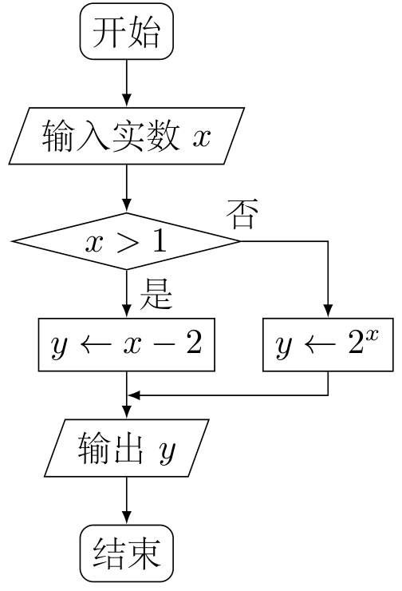
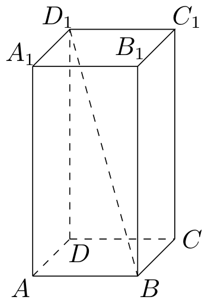
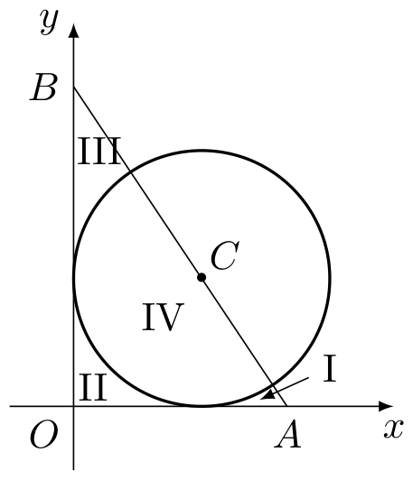
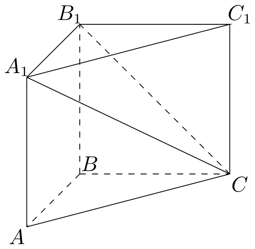

# 2009年上海卷（秋理）

## 填空题

### 第 1 题

若复数 $z$ 满足 $z(1 + \i) = 1 - \i$（$\i$ 是虚数单位），则其共轭复数 $\overline{z} =$＿＿＿＿＿＿.

#### 答案

$\i$.

#### 解析

由 $z(1+\i)=1-\i$，得

$$

z=\frac{1-\i}{1+\i}=\frac{(1-\i)^2}{(1+\i)(1-\i)}=\frac{-2\i}{2}=-\i

$$

因此 $\overline{z}=\i$.

### 第 2 题

已知集合 $A = \{x \mid x \leqslant 1\}$，$B = \{x \mid x \geqslant \alpha\}$，且 $A \cup B = \mathbb{R}$，则实数 $\alpha$ 的取值范围是＿＿＿＿＿＿.

#### 答案

$\alpha \leqslant 1$.

#### 解析

由题意，$A=(-\infty,1]$，$B=[\alpha,+\infty)$. 若 $\alpha>1$，则区间 $(1,\alpha)$ 中的实数既不属于 $A$，也不属于 $B$，从而 $A\cup B\neq\mathbb{R}$. 反之，若 $\alpha\leqslant1$，则任意实数 $x\leqslant1$ 时属于 $A$，任意实数 $x>1$ 时有 $x\geqslant\alpha$，因而属于 $B$，所以 $A\cup B=\mathbb{R}$. 故 $\alpha$ 的取值范围为 $\alpha\leqslant1$.

### 第 3 题

若行列式 $\begin{vmatrix} 4 & 5 & x \\ 1 & x & 3 \\ 7 & 8 & 9 \end{vmatrix}$ 中，元素 $4$ 的代数余子式大于 $0$，则 $x$ 满足的条件是＿＿＿＿＿＿.

#### 答案

$x > \frac{8}{3}$.

#### 解析

元素 $4$ 位于行列式的第 $1$ 行第 $1$ 列，因此它的代数余子式为

$$

C_{11}=(-1)^{1+1}\begin{vmatrix}x&3\\8&9\end{vmatrix}=9x-24

$$

由题意 $9x-24>0$，所以 $x>\dfrac{8}{3}$.

### 第 4 题

某算法的程序框图如图所示，则输出量 $y$ 与输入量 $x$ 满足的关系式是＿＿＿＿＿＿.

#### 答案

$$

y=\begin{cases}
2^x,&x\leqslant 1,\\
x-2,&x>1.
\end{cases}

$$

#### 解析

由程序框图可知，当输入 $x>1$ 时，沿“是”分支得到 $y=x-2$；当输入 $x\leqslant 1$ 时，沿“否”分支得到 $y=2^x$. 因此

$$

y=\begin{cases}
2^x,&x\leqslant 1,\\
x-2,&x>1.
\end{cases}

$$

### 第 5 题

如图，若正四棱柱 $ABCD - A_1B_1C_1D_1$ 的底面边长为 $2$，高为 $4$，则异面直线 $BD_1$ 与 $AD$ 所成角的大小是＿＿＿＿＿＿. （结果用反三角函数表示）

#### 答案

$\arctan\sqrt{5}$.

#### 解析

建立直角坐标系，取 $A=(0,0,0)$，$B=(2,0,0)$，$D=(0,2,0)$，并令竖直方向为 $z$ 轴，则 $D_1=(0,2,4)$. 因而 $\overrightarrow{AD}=(0,2,0)$，$\overrightarrow{BD_1}=(-2,2,4)$. 设异面直线所成的锐角为 $\theta$，则

$$

\cos\theta=\frac{\left|\overrightarrow{AD}\cdot\overrightarrow{BD_1}\right|}{|\overrightarrow{AD}|\,|\overrightarrow{BD_1}|}=\frac{4}{2\sqrt{24}}=\frac{1}{\sqrt{6}}

$$

于是 $\tan\theta=\sqrt{\dfrac{1}{\cos^2\theta}-1}=\sqrt{5}$. 因为 $0\leqslant\theta\leqslant\dfrac{\pi}{2}$，所以 $\theta=\arctan\sqrt{5}$.

### 第 6 题

函数 $y = 2\cos^2 x + \sin 2x$ 的最小值是＿＿＿＿＿＿.

#### 答案

$1 - \sqrt{2}$.

#### 解析

利用 $2\cos^2x=1+\cos2x$，有

$$

y=1+\cos2x+\sin2x=1+\sqrt{2}\sin\left(2x+\frac{\pi}{4}\right)

$$

由于正弦函数的取值范围为 $[-1,1]$，故

$$

y\geqslant1-\sqrt{2}

$$

且当 $\sin\left(2x+\dfrac{\pi}{4}\right)=-1$ 时等号成立. 因此最小值为 $1-\sqrt{2}$.

### 第 7 题

某学校要从 $5$ 名男生和 $2$ 名女生中选出 $2$ 人作为上海世博会志愿者，若用随机变量 $\xi$ 表示选出的志愿者中女生的人数，则数学期望 $E(\xi) =$＿＿＿＿＿＿. （结果用最简分数表示）

#### 答案

$\frac{4}{7}$.

#### 解析

从 $5$ 名男生和 $2$ 名女生中任取 $2$ 人，共有 $\mathrm C_7^2=21$ 种取法. 女生人数 $\xi$ 的分布为 $P(\xi=0)=\frac{\mathrm C_5^2}{\mathrm C_7^2}=\frac{10}{21}$，$P(\xi=1)=\frac{\mathrm C_5^1\mathrm C_2^1}{\mathrm C_7^2}=\frac{10}{21}$

$$

P(\xi=2)=\frac{\mathrm C_2^2}{\mathrm C_7^2}=\frac{1}{21}

$$

因此

$$

E(\xi)=0\cdot\frac{10}{21}+1\cdot\frac{10}{21}+2\cdot\frac{1}{21}=\frac{4}{7}

$$

### 第 8 题

已知三个球的半径 $R_1$，$R_2$，$R_3$ 满足 $R_1 + 2R_2 = 3R_3$，则它们的表面积 $S_1$，$S_2$，$S_3$ 满足的等量关系是＿＿＿＿＿＿.

#### 答案

$\sqrt{S_1} + 2\sqrt{S_2} = 3\sqrt{S_3}$.

#### 解析

球的表面积满足 $S_i=4\pi R_i^2$. 由于半径为正数，故 $\sqrt{S_i}=2\sqrt{\pi}\,R_i$，$(i=1,2,3)$. 将题设关系 $R_1+2R_2=3R_3$ 两边同乘 $2\sqrt{\pi}$，得到

$$

\sqrt{S_1}+2\sqrt{S_2}=3\sqrt{S_3}

$$

### 第 9 题

已知 $F_1$，$F_2$ 是椭圆 $C: \frac{x^2}{a^2} + \frac{y^2}{b^2} = 1$（$a > b > 0$）的两个焦点，$P$ 为椭圆 $C$ 上一点，且 $\overrightarrow{PF_1} \perp \overrightarrow{PF_2}$，若 $\triangle PF_1F_2$ 的面积为 $9$，则 $b =$＿＿＿＿＿＿.

#### 答案

$3$.

#### 解析

设 $PF_1=m$，$PF_2=n$，焦半距为 $c$. 由 $\overrightarrow{PF_1}\perp\overrightarrow{PF_2}$，三角形 $PF_1F_2$ 在 $P$ 处直角，故

$$

m^2+n^2=F_1F_2^2=(2c)^2

$$

又由椭圆的定义，$m+n=2a$. 两边平方并利用 $a^2-b^2=c^2$，得

$$

4a^2=m^2+n^2+2mn=4c^2+2mn

$$

从而 $mn=2(a^2-c^2)=2b^2$. 因此三角形面积为

$$

9=\frac12mn=b^2

$$

由于 $b>0$，所以 $b=3$.

### 第 10 题

在极坐标系中，由三条直线 $\theta = 0$，$\theta = \frac{\pi}{3}$，$\rho \cos \theta + \rho \sin \theta = 1$ 围成图形的面积是＿＿＿＿＿＿.

#### 答案

$\frac{3 - \sqrt{3}}{4}$.

#### 解析

由直线 $\rho\cos\theta+\rho\sin\theta=1$，得

$$

\rho=\frac{1}{\cos\theta+\sin\theta}

$$

所围图形对应于 $0\leqslant\theta\leqslant\dfrac{\pi}{3}$，故其面积为

$$

S=\frac12\int_0^{\pi/3}\frac{1}{(\cos\theta+\sin\theta)^2}\,\mathrm d\theta
=\frac14\int_0^{\pi/3}\sec^2\left(\theta-\frac{\pi}{4}\right)\,\mathrm d\theta
=\frac14\left[\tan\left(\theta-\frac{\pi}{4}\right)\right]_0^{\pi/3}

$$

因为 $\tan\dfrac{\pi}{12}=2-\sqrt3$，所以

$$

S=\frac14\left((2-\sqrt3)-(-1)\right)=\frac{3-\sqrt3}{4}

$$

### 第 11 题

当 $0 \leqslant x \leqslant 1$ 时，不等式 $\sin \frac{\pi x}{2} \geqslant kx$ 成立. 则实数 $k$ 的取值范围是＿＿＿＿＿＿.

#### 答案

$k \leqslant 1$.

#### 解析

令 $g(x)=\sin\dfrac{\pi x}{2}$. 因为 $g''(x)=-\frac{\pi^2}{4}\sin\frac{\pi x}{2}\leqslant0$，$(0\leqslant x\leqslant1)$ 所以 $g$ 在 $[0,1]$ 上为凹函数. 又 $g(0)=0$，$g(1)=1$，由凹函数图象位于端点连线的上方，得 $\sin\frac{\pi x}{2}\geqslant x$，$(0\leqslant x\leqslant1)$. 若题设不等式对所有 $x\in[0,1]$ 成立，取 $x=1$ 得 $1\geqslant k$，即 $k\leqslant1$. 反之，当 $k\leqslant1$ 时，由 $x\geqslant0$ 有 $kx\leqslant x\leqslant\sin\dfrac{\pi x}{2}$，题设不等式对整个区间成立. 因此 $k\leqslant1$.

### 第 12 题

已知函数 $f(x) = \sin x + \tan x$，项数为 $27$ 的等差数列 $\{a_n\}$ 满足 $a_n \in \left( -\frac{\pi}{2}, \frac{\pi}{2} \right)$，且公差 $d \neq 0$. 若 $f(a_1) + f(a_2) + \cdots + f(a_{27}) = 0$，则当 $k =$＿＿＿＿＿＿ 时，$f(a_k) = 0$.

#### 答案

$14$.

#### 解析

函数 $f(x)=\sin x+\tan x$ 在 $\left(-\dfrac{\pi}{2},\dfrac{\pi}{2}\right)$ 上为奇函数，且

$$

f'(x)=\cos x+\sec^2x>0

$$

所以 $f$ 在该区间上严格递增. 等差数列的中项为 $a_{14}$，并且第 $14-j$ 项和第 $14+j$ 项可写成 $a_{14}-u$ 与 $a_{14}+u$，其中 $u=|jd|>0$.

若 $a_{14}>0$，当 $a_{14}-u\geqslant0$ 时，两个函数值之和为正；当 $a_{14}-u<0$ 时，由严格递增性和奇函数性质， $a_{14}+u>u-a_{14}>0$，$\Longrightarrow$，$f(a_{14}+u)>f(u-a_{14})=-f(a_{14}-u)$ 故仍有 $f(a_{14}+u)+f(a_{14}-u)>0$. 所有成对项的和以及中项 $f(a_{14})$ 都为正，于是全体和不可能为零. 同理，若 $a_{14}<0$，全体和为负.

因此题设等式只能在 $a_{14}=0$ 时成立. 此时 $f(a_{14})=f(0)=0$，所以 $k=14$.

### 第 13 题

某地街道呈现东—西，南—北向的网格状，相邻街距都为 $1$. 两街道相交的点称为格点. 若以互相垂直的两条街道为轴建立直角坐标系，现有下述格点 $(-2, 2)$，$(3, 1)$，$(3, 4)$，$(-2, 3)$，$(4, 5)$，$(6, 6)$ 为报刊零售点. 请确定一个格点（除零售点外）为发行站，使 $6$ 个零售点沿街道到发行站之间路程的和最短＿＿＿＿＿＿.

#### 答案

$(3, 3)$.

#### 解析

设发行站为格点 $(u,v)$. 六个零售点到它的沿街路程之和为

$$

\begin{aligned}
T(u,v)&=|u+2|+|u-3|+|u-3|+|u+2|+|u-4|+|u-6|\\
&\quad+|v-2|+|v-1|+|v-4|+|v-3|+|v-5|+|v-6|.
\end{aligned}

$$

横、纵坐标部分彼此独立. 对按从小到大排列的六个实数 $z_1\leqslant\cdots\leqslant z_6$，函数 $\sum_{i=1}^6|w-z_i|$ 在且仅在中位数区间 $[z_3,z_4]$ 上取得最小值；这是因为 $w$ 每向右移动一单位，绝对值和的增量等于左侧点数减右侧点数，符号在该区间内由负变正. 横坐标数据为 $-2$，$-2$，$3$，$3$，$4$，$6$，所以 $u=3$. 纵坐标数据为 $1$，$2$，$3$，$4$，$5$，$6$，所以 $v$ 可取 $3$ 或 $4$. 点 $(3,4)$ 是零售点，不能作为发行站，故只能取 $(3,3)$.

### 第 14 题

将函数 $y = \sqrt{4 + 6x - x^2} - 2$（$x \in [0, 6]$）的图象绕坐标原点逆时针方向旋转角 $\theta$（$0 \leqslant \theta \leqslant \alpha$），得到曲线 $C$. 若对于每一个旋转角 $\theta$，曲线 $C$ 都是一个函数的图象，则 $\alpha$ 的最大值为＿＿＿＿＿＿.

#### 答案

$\arctan\frac{2}{3}$.

#### 解析

原曲线可参数化为 $(x,y(x))$，其中 $y(x)=\sqrt{13-(x-3)^2}-2$，$0\leqslant x\leqslant6$. 旋转 $\theta$ 后点的横坐标为

$$

X_\theta(x)=x\cos\theta-y(x)\sin\theta

$$

若旋转后的曲线是函数图象，则参数 $x$ 到旋转后横坐标的映射必须单射，从而需考察 $X_\theta'(x)=\cos\theta-y'(x)\sin\theta$，$y'(x)=\frac{3-x}{\sqrt{13-(x-3)^2}}$. 在 $[0,6]$ 上，$y'(x)\leqslant y'(0)=\dfrac32$，因此当 $0\leqslant\theta\leqslant\arctan\dfrac23$ 时，

$$

X_\theta'(x)\geqslant\cos\theta-\frac32\sin\theta\geqslant0

$$

除端点情形外导数为正，故 $X_\theta(x)$ 严格递增，旋转后的曲线是函数图象.

若 $\theta>\arctan\dfrac23$ 且 $\theta<\dfrac\pi2$，则 $X_\theta'(0)=\cos\theta-\frac32\sin\theta<0$，$X_\theta'(6)=\cos\theta+\frac32\sin\theta>0$. 又因

$$

y''(x)=-\frac{13}{\left(13-(x-3)^2\right)^{3/2}}<0

$$

故 $X_\theta'(x)$ 在 $[0,6]$ 上严格递增，$X_\theta(x)$ 先减后增，在某个内点取得唯一最小值. 取该最小值上方且足够接近的一个横坐标，由连续性可得对应的两个不同参数值；旋转后两点横坐标相同而点本身不同，因而纵坐标不同，曲线不是函数图象. 当 $\theta=\dfrac\pi2$ 时，$X_\theta(x)=-y(x)$，且 $X_\theta(0)=X_\theta(6)=0$ 而 $X_\theta(3)\neq0$，同样不是单射，所以任何 $\alpha\geqslant\dfrac\pi2$ 也不可能满足题设. 因而允许的最大旋转角为 $\arctan\dfrac23$.

## 单选题

### 第 15 题

“$-2 \leqslant a \leqslant 2$”是“实系数一元二次方程 $x^2 + ax + 1 = 0$ 有虚根”的（）

A.  
必要不充分条件

B.  
充分不必要条件

C.  
充要条件

D.  
既不充分也不必要条件

#### 答案

A.

#### 解析

方程 $x^2+ax+1=0$ 有虚根的充要条件是判别式小于零，即

$$

\Delta=a^2-4<0\quad\Longleftrightarrow\quad -2<a<2

$$

因此 $-2\leqslant a\leqslant2$ 是该条件的必要条件，但在 $a=2$ 或 $a=-2$ 时方程有重根而不是虚根，故不是充分条件. 所以应选 A.

### 第 16 题

若事件 $E$ 与 $F$ 相互独立，且 $P(E) = P(F) = \frac{1}{4}$，则 $P(E \cap F)$ 的值等于（）

A.  
$0$

B.  
$\frac{1}{16}$

C.  
$\frac{1}{4}$

D.  
$\frac{1}{2}$

#### 答案

B.

#### 解析

由事件 $E$ 与 $F$ 相互独立，

$$

P(E\cap F)=P(E)P(F)=\frac14\cdot\frac14=\frac1{16}

$$

所以应选 B.

### 第 17 题

在发生某公共卫生事件期间，有专业机构认为该事件在一段时间没有发生规模群体感染的标志为“连续 $10$ 天，每天新增疑似病例不超过 $7$ 人”. 根据过去 $10$ 天甲，乙，丙，丁四地新增疑似病例数据，一定符合该标志的是（）

A.  
甲地：总体均值为 $3$，中位数为 $4$

B.  
乙地：总体均值为 $1$，总体方差大于 $0$

C.  
丙地：中位数为 $2$，众数为 $3$

D.  
丁地：总体均值为 $2$，总体方差为 $3$

#### 答案

D.

#### 解析

设过去十天的新增疑似病例数为非负整数 $x_1$，$\ldots$，$x_{10}$. 对丁地，均值为 $2$，方差为 $3$，所以 $\sum_{i=1}^{10}x_i=20$，$\sum_{i=1}^{10}x_i^2=10(3+2^2)=70$. 若某一天 $x_i=t\geqslant8$，由于其余九天的病例数非负，故 $t\leqslant20$，且其余九天的和为 $20-t$. 由均方不等式，

$$

\sum_{j\ne i}x_j^2\geqslant\frac{(20-t)^2}{9}

$$

从而 $H(t)=t^2+\frac{(20-t)^2}{9}$，$\sum_{j=1}^{10}x_j^2\geqslant H(t)$. 对 $8\leqslant t\leqslant20$，有

$$

H'(t)=2t-\frac{2(20-t)}9=\frac{20(t-2)}9>0

$$

故 $H(t)\geqslant H(8)=80>70$，矛盾. 因此每天新增病例数都不超过 $7$，丁地一定符合标志.

其余选项均不能保证最大值不超过 $7$. 例如甲地可取数据 $0$，$0$，$0$，$0$，$4$，$4$，$4$，$4$，$4$，$10$，乙地可取 $0$，$0$，$0$，$0$，$0$，$0$，$0$，$0$，$0$，$10$，丙地可取 $0$，$0$，$0$，$1$，$1$，$3$，$3$，$3$，$3$，$10$，它们分别满足相应条件但都出现了超过 $7$ 的数据. 所以应选 D.

### 第 18 题

过圆 $C: (x - 1)^2 + (y - 1)^2 = 1$ 的圆心作直线分别交 $x$，$y$ 正半轴于点 $A$，$B$，$\triangle AOB$ 被圆分成四部分（如图），若这四部分图形面积满足 $S_{\mathrm I} + S_{\mathrm{IV}} = S_{\mathrm{II}} + S_{\mathrm{III}}$，则直线 $AB$ 有（）

A.  
$0$ 条

B.  
$1$ 条

C.  
$2$ 条

D.  
$3$ 条

#### 答案

B.

#### 解析

设直线与两坐标轴的交点为 $A=(a,0)$，$B=(0,b)$. 因为直线过圆心 $C=(1,1)$，所以

$$

\frac1a+\frac1b=1

$$

令 $t=a-1>0$，则 $b-1=\dfrac1t$，且每个正数 $t$ 唯一确定一条这样的直线.

区域 $S_{\mathrm{II}}$ 由两坐标轴和圆在第一象限的弧围成，其面积是单位正方形面积减去四分之一单位圆面积，即

$$

S_{\mathrm{II}}=1-\frac\pi4

$$

直线 $AB$ 过圆心，且三角形 $AOB$ 位于直线 $AB$ 的下侧，所以圆在三角形 $AOB$ 内的部分 $S_{\mathrm{IV}}$ 是一个半圆，从而

$$

S_{\mathrm{IV}}=\frac\pi2

$$

令 $T_A=(1,0)$，并令 $\phi=\arctan t$. 设直线与圆在靠近 $A$ 的交点为 $P$，则由方向向量 $(t,-1)$ 得

$$

P=C+\frac{(t,-1)}{\sqrt{1+t^2}}

$$

三角形 $AT_AP$ 的面积为 $\dfrac12t\left(1-\dfrac1{\sqrt{1+t^2}}\right)$，弦 $T_AP$ 与弧 $T_AP$ 所夹的圆弓形面积为 $\dfrac12\left(\phi-\dfrac{t}{\sqrt{1+t^2}}\right)$，因此

$$

S_{\mathrm I}=\frac{t-\phi}{2}=\frac{t-\arctan t}{2}

$$

交换 $x$，$y$ 后，区域 $S_{\mathrm{III}}$ 的对应参数为 $1/t$，同样计算得

$$

S_{\mathrm{III}}=\frac{t^{-1}-\arctan(t^{-1})}{2}

$$

于是原条件等价于

$$

S_{\mathrm I}-S_{\mathrm{III}}=S_{\mathrm{II}}-S_{\mathrm{IV}}=1-\frac{3\pi}{4}

$$

令

$$

G(t)=S_{\mathrm I}-S_{\mathrm{III}}=\frac12\left(t-\frac1t-\arctan t+\arctan\frac1t\right)

$$

则 $G'(t)=\frac12\left(1+\frac1{t^2}-\frac2{1+t^2}\right)=\frac{t^4+1}{2t^2(1+t^2)}>0$，$(t>0)$. 并且 $G(t)\to-\infty$（$t\to0^+$），$G(t)\to+\infty$（$t\to+\infty$），所以方程 $G(t)=1-\dfrac{3\pi}{4}$ 恰有一个正数解，即恰有一条直线满足条件. 所以应选 B.

## 解答题

### 第 19 题

如图，在直三棱柱 $ABC - A_1B_1C_1$ 中，$AA_1 = BC = AB = 2$，$AB \perp BC$，求二面角 $B_1 - A_1C - C_1$ 的大小.

#### 解析

建立空间直角坐标系，取 $B$ 为原点，$BA$，$BC$，$BB_1$ 所在直线分别为 $x$ 轴、$y$ 轴、$z$ 轴，则 $B=(0,0,0)$，$A=(2,0,0)$，$C=(0,2,0)$ $A_1=(2,0,2)$，$B_1=(0,0,2)$，$C_1=(0,2,2)$. 设 $\boldsymbol{u}=\overrightarrow{A_1C}=(-2,2,-2)$. 在平面 $B_1A_1C$ 内，取从棱 $A_1C$ 指向 $B_1$ 且垂直于棱 $A_1C$ 的向量

$$

\boldsymbol{v}_1=\overrightarrow{A_1B_1}-\frac{\overrightarrow{A_1B_1}\cdot\boldsymbol{u}}{\boldsymbol{u}\cdot\boldsymbol{u}}\boldsymbol{u}=(-2,0,0)-\frac{4}{12}(-2,2,-2)=\frac{2}{3}(-2,-1,1)

$$

在平面 $A_1CC_1$ 内，取从棱 $A_1C$ 指向 $C_1$ 且垂直于棱 $A_1C$ 的向量

$$

\boldsymbol{v}_2=\overrightarrow{A_1C_1}-\frac{\overrightarrow{A_1C_1}\cdot\boldsymbol{u}}{\boldsymbol{u}\cdot\boldsymbol{u}}\boldsymbol{u}=(-2,2,0)-\frac{8}{12}(-2,2,-2)=\frac{2}{3}(-1,1,2)

$$

所以所求二面角等于 $\boldsymbol{v}_1$ 与 $\boldsymbol{v}_2$ 的夹角 $\theta$，从而

$$

\cos\theta=\frac{(-2,-1,1)\cdot(-1,1,2)}{\sqrt{(-2)^2+(-1)^2+1^2}\sqrt{(-1)^2+1^2+2^2}}=\frac{1}{2}

$$

由于二面角的范围是 $[0,\pi]$，故 $\theta=\frac{\pi}{3}$.

### 第 20 题

有时可用函数

$$

f(x) = \begin{cases}
0.1 + 15 \ln \frac{a}{a - x}, & x \leqslant 6,\\
\frac{x - 4.4}{x - 4}, & x > 6,
\end{cases}

$$

描述学习某学科知识的掌握程度，其中 $x$ 表示某学科知识的学习次数（$x \in \mathbf{N}^*$），$f(x)$ 表示对该学科知识的掌握程度，正实数 $a$ 与学科知识有关.

1.  证明：当 $x \geqslant 7$ 时，掌握程度的增加量 $f(x + 1) - f(x)$ 总是下降；

2.  根据经验，学科甲，乙，丙对应的 $a$ 的取值范围分别为 $(115, 121]$，$(121, 127]$，$(121, 133]$. 当学习某学科知识 $6$ 次时，掌握程度是 $85\%$，请确定相应的学科.

#### 解析

1.  当 $x\geqslant 7$ 时，$x$ 和 $x+1$ 都大于 $6$，因此

$$

f(x)=\frac{x-4.4}{x-4}=1-\frac{0.4}{x-4}

$$

    令 $\Delta_x=f(x+1)-f(x)$，则

$$

\Delta_x=\frac{0.4}{(x-4)(x-3)}

$$

    于是

$$

\Delta_{x+1}-\Delta_x=\frac{0.4}{(x-3)(x-2)}-\frac{0.4}{(x-4)(x-3)}=-\frac{0.8}{(x-4)(x-3)(x-2)}<0

$$

    所以当 $x\geqslant 7$ 时，掌握程度的增加量总是下降.

2.  由题意，$f(6)=0.85$，且 $6\leqslant 6$，故

$$

0.1+15\ln\frac{a}{a-6}=0.85

$$

    即 $\ln\frac{a}{a-6}=\frac{1}{20}$，$\frac{a}{a-6}=\e^{1/20}$. 解得

$$

a=\frac{6\e^{1/20}}{\e^{1/20}-1}=\frac{6}{1-\e^{-1/20}}\approx123.025

$$

    因为 $a\approx123.025$，所以 $121<a\leqslant127$ 且 $121<a\leqslant133$，而 $a\notin(115,121]$. 因此相应的学科为乙、丙.

### 第 21 题

已知双曲线 $C: \frac{x^2}{2} - y^2 = 1$，设过点 $A(-3\sqrt{2}, 0)$ 的直线 $l$ 的方向向量 $\boldsymbol{e}= (1, k)$.

1.  当直线 $l$ 与双曲线 $C$ 的一条渐近线 $m$ 平行时，求直线 $l$ 的方程及 $l$ 与 $m$ 的距离；

2.  证明：当 $k > \frac{\sqrt{2}}{2}$ 时，在双曲线 $C$ 的右支上不存在点 $Q$，使之到直线 $l$ 的距离为 $\sqrt{6}$.

#### 解析

1.  直线 $l$ 过点 $A(-3\sqrt{2},0)$，方向向量为 $\boldsymbol{e}=(1,k)$，故 $l:y=k(x+3\sqrt{2})$，$kx-y+3\sqrt{2}k=0$. 双曲线 $C$ 的渐近线为 $m_1:y=\frac{x}{\sqrt{2}}$，$m_2:y=-\frac{x}{\sqrt{2}}$. 当 $k=\frac{\sqrt{2}}{2}$ 时，$l\parallel m_1$，且

$$

l:y=\frac{x}{\sqrt{2}}+3

$$

    所以

$$

d(l,m_1)=\frac{3\sqrt{2}}{\sqrt{1+2}}=\sqrt{6}

$$

    当 $k=-\frac{\sqrt{2}}{2}$ 时，$l\parallel m_2$，且

$$

l:y=-\frac{x}{\sqrt{2}}-3

$$

    同理有 $d(l,m_2)=\sqrt{6}$. 因此，直线 $l$ 的方程及其与相应渐近线的距离分别为 $k=\frac{\sqrt{2}}{2}:$，$l:y=\frac{x}{\sqrt{2}}+3$，$d=\sqrt{6};$ $k=-\frac{\sqrt{2}}{2}:$，$l:y=-\frac{x}{\sqrt{2}}-3$，$d=\sqrt{6}$.

2.  设 $Q(x,y)$ 在双曲线 $C$ 的右支上，则 $x\geqslant\sqrt{2}$，且

$$

y=\pm\sqrt{\frac{x^2}{2}-1}

$$

    点 $Q$ 到直线 $l$ 的距离为

$$

d(Q,l)=\frac{\left|kx-y+3\sqrt{2}k\right|}{\sqrt{k^2+1}}

$$

    先考虑双曲线的下支. 此时

$$

kx-y+3\sqrt{2}k=kx+\sqrt{\frac{x^2}{2}-1}+3\sqrt{2}k\geqslant4\sqrt{2}k

$$

    由 $k>\frac{\sqrt{2}}{2}$ 得

$$

(4\sqrt{2}k)^2-6(k^2+1)=26k^2-6>0

$$

    所以 $kx-y+3\sqrt{2}k>\sqrt{6(k^2+1)}$，从而 $d(Q,l)>\sqrt{6}$.

    再考虑双曲线的上支. 令 $g(x)=kx-\sqrt{\frac{x^2}{2}-1}$，$x\geqslant\sqrt{2}$. 因为 $k>\frac{\sqrt{2}}{2}$，且

$$

g'(x)=k-\frac{x}{2\sqrt{x^2/2-1}}

$$

    令 $g'(x)=0$，得

$$

x_0=\frac{2k}{\sqrt{2k^2-1}}

$$

    ；由 $g'(x)$ 在 $x_0$ 左侧为负、右侧为正，知 $g(x)$ 在 $x_0$ 处取得最小值，且

$$

g(x_0)=\sqrt{2k^2-1}

$$

    于是

$$

kx-y+3\sqrt{2}k=g(x)+3\sqrt{2}k\geqslant3\sqrt{2}k+\sqrt{2k^2-1}>0

$$

    并且

$$

\left(3\sqrt{2}k+\sqrt{2k^2-1}\right)^2-6(k^2+1)
    =7(2k^2-1)+6\sqrt{2}k\sqrt{2k^2-1}>0

$$

    所以仍有 $d(Q,l)>\sqrt{6}$. 上、下两支均不可能出现距离等于 $\sqrt{6}$ 的点，命题得证.

### 第 22 题

已知函数 $y = f^{-1}(x)$ 是 $y = f(x)$ 的反函数. 定义：若对给定的实数 $a$（$a \neq 0$），函数 $y = f(x + a)$ 与 $y = f^{-1}(x + a)$ 互为反函数，则称 $y = f(x)$ 满足“$a$ 和性质”；若函数 $y = f(ax)$ 与 $y = f^{-1}(ax)$ 互为反函数，则称 $y = f(x)$ 满足“$a$ 积性质”.

1.  判断函数 $g(x) = x^2$（$x > 0$）是否满足“$1$ 和性质”，并说明理由；

2.  求所有满足“$2$ 和性质”的一次函数；

3.  设函数 $y = f(x)$（$x > 0$）对任何 $a > 0$ 都满足“$a$ 积性质”，求 $y = f(x)$ 的表达式.

#### 解析

1.  当 $x>0$ 时，$g^{-1}(x)=\sqrt{x}$. 若记 $u(x)=g(x+1)=(x+1)^2$，$v(x)=g^{-1}(x+1)=\sqrt{x+1}$ 则

$$

u\bigl(v(x)\bigr)=\left(\sqrt{x+1}+1\right)^2\neq x

$$

    因此 $u(x)$ 与 $v(x)$ 不是互为反函数，函数 $g(x)=x^2$ 不满足“$1$ 和性质”.

2.  设一次函数 $f(x)=rx+s$，其中 $r\neq0$，则

$$

f^{-1}(x)=\frac{x-s}{r}

$$

    令 $u(x)=f(x+2)=rx+2r+s$，$v(x)=f^{-1}(x+2)=\frac{x+2-s}{r}$. 若 $u$ 与 $v$ 互为反函数，则 $u(v(x))=x$，而

$$

u\bigl(v(x)\bigr)=x+2+2r

$$

    故 $r=-1$. 反之，当 $r=-1$ 时，$u(x)=v(x)=-x-2+s$，且

$$

u\bigl(u(x)\bigr)=x

$$

    所以所有满足“$2$ 和性质”的一次函数为 $y=-x+s$，$(s\in\mathbb{R})$.

3.  记 $h=f^{-1}$. 对任意 $a>0$，函数 $x\mapsto f(ax)$ 与 $x\mapsto h(ax)$ 互为反函数，因此

$$

f\bigl(a h(ax)\bigr)=x

$$

    对等式两边施加 $h$，得到 $a h(ax)=h(x)$，$h(ax)=\frac{h(x)}{a}$. 任取正数 $t$，$x$，令 $a=t/x$，则 $h(t)=\frac{x}{t}h(x)$，$th(t)=xh(x)$. 所以存在常数 $c$，使得

$$

h(t)=\frac{c}{t}

$$

    由于 $h(t)$ 的值属于函数 $f$ 的定义域 $(0,+\infty)$，故 $c>0$. 于是 $f(x)=\frac{c}{x}$，$(x>0)$. 反之，若 $f(x)=c/x$，其中 $c>0$，则 $f^{-1}(x)=c/x$，且对任意 $a>0$，

$$

f(ax)=f^{-1}(ax)=\frac{c}{ax}

$$

    并且

$$

f\left(a\cdot\frac{c}{ax}\right)=x

$$

    所以该函数确实对任意正数 $a$ 满足“$a$ 积性质”. 因此 $y=\frac{c}{x}$，$(c>0)$.

### 第 23 题

已知 $\{a_n\}$ 是公差为 $d$ 的等差数列，$\{b_n\}$ 是公比为 $q$ 的等比数列.

1.  若 $a_n = 3n + 1$，是否存在 $m$，$k \in \mathbf{N}^*$，有 $a_m + a_{m+1} = a_k$？请说明理由；

2.  找出所有数列 $\{a_n\}$ 和 $\{b_n\}$，使对一切 $n \in \mathbf{N}^*$，$\frac{a_{n+1}}{a_n} = b_n$，并说明理由；

3.  若 $a_1 = 5$，$d = 4$，$b_1 = q = 3$，试确定所有的 $p$，使数列 $\{a_n\}$ 中存在某个连续 $p$ 项的和是数列 $\{b_n\}$ 中的一项，请证明.

#### 解析

1.  因为 $a_n=3n+1$，所以

$$

a_m+a_{m+1}=(3m+1)+(3m+4)=6m+5

$$

    若存在正整数 $m$，$k$ 使 $a_m+a_{m+1}=a_k$，则

$$

6m+5=3k+1

$$

    即 $3(k-2m)=4$，这不可能. 因此不存在这样的 $m$，$k$.

2.  由于题设中的比值对一切正整数 $n$ 有意义，所以 $a_n\neq0$，且 $b_n\neq0$. 又因为 $b_{n+1}=qb_n$，故

$$

q=\frac{b_{n+1}}{b_n}=\frac{a_{n+2}/a_{n+1}}{a_{n+1}/a_n}=\frac{a_na_{n+2}}{a_{n+1}^2}

$$

    等差数列满足 $a_n=a_{n+1}-d$，$a_{n+2}=a_{n+1}+d$，所以

$$

q=\frac{(a_{n+1}-d)(a_{n+1}+d)}{a_{n+1}^2}=1-\frac{d^2}{a_{n+1}^2}

$$

    若 $d\neq0$，则 $a_{n+1}^2$ 对所有正整数 $n$ 都相同. 于是相邻三项满足

$$

a_{n+1}^2=a_{n+2}^2=a_{n+3}^2

$$

    由 $a_{n+2}-a_{n+1}=a_{n+3}-a_{n+2}=d\neq0$，前两个等式分别迫使 $a_{n+2}=-a_{n+1}$，$a_{n+3}=-a_{n+2}=a_{n+1}$ 从而 $a_{n+3}-a_{n+1}=2d=0$，矛盾. 所以 $d=0$.

    此时 $a_n=a_1\neq0$，由题设 $b_n=a_{n+1}/a_n=1$，故 $b_1=1$，$q=1$. 反之，任取非零常数 $c$，令 $a_n=c$，$b_n=1$，即可满足题设条件. 因此所有数列为 $a_n=c$，$(c\neq0)$，$b_n=1$.

3.  由 $a_1=5$，$d=4$，得

$$

a_n=5+4(n-1)=4n+1

$$

    又因 $b_1=q=3$，所以 $b_n=3^n$. 从第 $m$ 项起的连续 $p$ 项和为

$$

\sum_{j=0}^{p-1}a_{m+j}=\sum_{j=0}^{p-1}(4m+4j+1)=p(4m+1)+4\cdot\frac{p(p-1)}{2}=p(4m+2p-1)

$$

    若该和等于某一项 $b_n=3^n$，则 $p$ 是 $3^n$ 的因数，故必有 $p=3^r$，其中 $r=0$，$1$，$2$，$\ldots$. 设

$$

4m+2\cdot3^r-1=3^s

$$

    由于 $m\geqslant1$，左端大于 $1$，且

$$

3^s\equiv2\cdot3^r-1\equiv1\pmod 4

$$

    所以 $s$ 为偶数. 这说明上述必要条件没有进一步限制 $r$.

    反之，任取 $r=0$，$1$，$2$，$\ldots$，取 $s=2r+2$，并令

$$

m=\frac{3^{2r+2}-2\cdot3^r+1}{4}

$$

    由于 $3^{2r+2}\equiv1\pmod4$，且 $2\cdot3^r-1\equiv1\pmod4$，故 $m$ 是正整数，并且

$$

p(4m+2p-1)=3^r\cdot3^{2r+2}=3^{3r+2}=b_{3r+2}

$$

    当 $p=3^r$ 时成立. 因此所有可能的 $p$ 为 $p=3^r$，$(r=0,1,2,\ldots)$.
